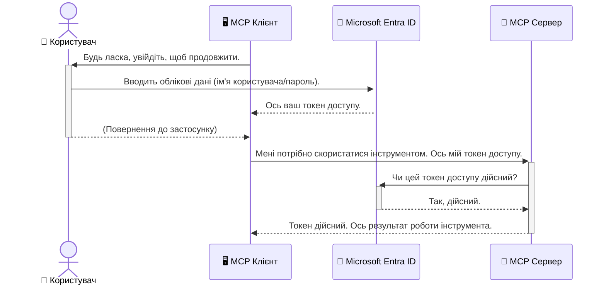

# Захист AI робочих процесів: автентифікація Entra ID для серверів Model Context Protocol

> [!NOTE]
> Віддалений код сервера в цьому уроці захищає спадкові кінцеві точки `/sse` та `/message`
> і орієнтований на MCP `2025-11-25`. Зберігайте його практики ідентифікації та перевірки токенів,
> але для нових реалізацій використовуйте сумісний зі `2026-07-28` Streamable HTTP транспорт.


## Вступ
Захист вашого сервера Model Context Protocol (MCP) так само важливий, як закрити на замок вхідні двері вашого будинку. Залишаючи сервер MCP відкритим, ви піддаєте свої інструменти та дані несанкціонованому доступу, що може призвести до порушень безпеки. Microsoft Entra ID пропонує надійне хмарне рішення з управління ідентифікацією та доступом, яке допомагає гарантувати, що лише авторизовані користувачі та програми можуть взаємодіяти із вашим сервером MCP. У цьому розділі ви навчитеся захищати свої AI робочі процеси за допомогою автентифікації Entra ID.

## Цілі навчання
Наприкінці цього розділу ви зможете:

- Розуміти важливість захисту серверів MCP.
- Пояснювати основи Microsoft Entra ID та автентифікації OAuth 2.0.
- Визначати різницю між публічними та конфіденційними клієнтами.
- Реалізовувати автентифікацію Entra ID у сценаріях локального (публічний клієнт) та віддаленого (конфіденційний клієнт) серверів MCP.
- Застосовувати найкращі практики безпеки при розробці AI робочих процесів.

## Безпека і MCP

Так само, як ви не залишили б вхідні двері будинку незамкненими, ви не повинні залишати свій сервер MCP відкритим для будь-кого. Захист AI робочих процесів є необхідним для створення надійних, довірених і безпечних застосунків. У цій главі буде представлено використання Microsoft Entra ID для захисту серверів MCP, гарантувавши, що лише авторизовані користувачі та програми можуть взаємодіяти з вашими інструментами і даними.

## Чому безпека важлива для серверів MCP

Уявіть, що ваш сервер MCP має інструмент, який може надсилати електронні листи або отримувати доступ до бази даних клієнтів. Незахищений сервер означає, що будь-хто може потенційно використовувати цей інструмент, що призведе до несанкціонованого доступу до даних, спаму або інших шкідливих дій.

Впроваджуючи автентифікацію, ви гарантуєте, що кожен запит до вашого сервера перевіряється, підтверджуючи особу користувача або програми, яка робить запит. Це перший і найважливіший крок у захисті ваших AI робочих процесів.

## Вступ до Microsoft Entra ID

[**Microsoft Entra ID**](https://adoption.microsoft.com/microsoft-security/entra/) — це хмарний сервіс управління ідентичністю та доступом. Уявіть його як універсального охоронця безпеки для ваших застосунків. Він обробляє складний процес перевірки ідентичності користувача (автентифікація) та визначення, що користувач може робити (авторизація).

Використовуючи Entra ID, ви можете:

- Забезпечити безпечний вхід користувачів.
- Захищати API та служби.
- Керувати політиками доступу з центрального місця.

Для серверів MCP Entra ID пропонує надійне і широко визнане рішення для управління тим, хто може отримати доступ до можливостей вашого сервера.

---

## Розуміння магії: як працює автентифікація Entra ID

Entra ID використовує відкриті стандарти, такі як **OAuth 2.0**, для обробки автентифікації. Хоча деталі можуть бути складними, основна ідея проста і легко пояснюється за допомогою аналогії.

### Легкий вступ в OAuth 2.0: ключ валета

Уявіть OAuth 2.0 як сервіс паркувальника для вашої машини. Коли ви приїжджаєте до ресторану, ви не даєте паркувальнику ваш головний ключ. Натомість ви надаєте **ключ валета**, який має обмежені права — він може заводити машину і замикати двері, але не може відчинити багажник чи бардачок.

В цій аналогії:

- **Ви** — це **користувач**.
- **Ваша машина** — це **сервер MCP** з його цінними інструментами та даними.
- **Валет** — це **Microsoft Entra ID**.
- **Паркувальник** — це **клієнт MCP** (програма, яка намагається отримати доступ до сервера).
- **Ключ валета** — це **токен доступу**.

Токен доступу — це захищений текстовий рядок, який клієнт MCP отримує від Entra ID після вашого входу в систему. Клієнт потім пред'являє цей токен серверу MCP з кожним запитом. Сервер може перевірити токен, щоб переконатися, що запит легітимний і клієнт має необхідні дозволи, все це без необхідності обробляти ваші справжні облікові дані (наприклад, пароль).

### Потік автентифікації

Ось як цей процес працює на практиці:



### Знайомство з Microsoft Authentication Library (MSAL)

Перед тим, як заглибитися в код, важливо представити ключовий компонент, який ви побачите в прикладах: **Microsoft Authentication Library (MSAL)**.

MSAL — це бібліотека, розроблена Microsoft, яка значно полегшує розробникам обробку автентифікації. Замість того, щоб ви писали складний код для обробки захисних токенів, керування входами та оновлення сесій, MSAL робить всю тяжку роботу за вас.

Використання бібліотеки, як MSAL, настійно рекомендується, тому що:

- **Вона безпечна:** Реалізує стандарти галузі та найкращі практики безпеки, зменшуючи ризик уразливостей у вашому коді.
- **Спрощує розробку:** Абстрагує складність протоколів OAuth 2.0 та OpenID Connect, дозволяючи додати надійну автентифікацію до вашого застосунку за кілька рядків коду.
- **Її підтримують:** Microsoft активно підтримує та оновлює MSAL для вирішення нових загроз безпеки та змін платформ.

MSAL підтримує широкий спектр мов і фреймворків, включаючи .NET, JavaScript/TypeScript, Python, Java, Go та мобільні платформи, як iOS і Android. Це означає, що ви можете використовувати однакові патерни автентифікації по всьому стеку технологій.

Щоб дізнатися більше про MSAL, перегляньте офіційну [документацію огляду MSAL](https://learn.microsoft.com/entra/identity-platform/msal-overview).

---

## Захист вашого сервера MCP за допомогою Entra ID: покроковий посібник

Тепер давайте розглянемо, як захистити локальний сервер MCP (той, що працює через `stdio`) за допомогою Entra ID. Цей приклад використовує **публічний клієнт**, що підходить для застосунків, які запускаються на машині користувача, як-от десктопні застосунки або локальні сервери розробки.

### Сценарій 1: Захист локального сервера MCP (з публічним клієнтом)

У цьому сценарії розглянемо MCP сервер, який працює локально, спілкується через `stdio` і використовує Entra ID для автентифікації користувача перед наданням доступу до своїх інструментів. Сервер матиме один інструмент, який отримує профіль користувача з Microsoft Graph API.

#### 1. Налаштування програми в Entra ID

Перед написанням коду слід зареєструвати вашу програму в Microsoft Entra ID. Це повідомляє Entra ID про вашу програму та надає їй дозвіл використовувати службу автентифікації.

1. Перейдіть до **[порталу Microsoft Entra](https://entra.microsoft.com/)**.
2. Відкрийте **App registrations** і натисніть **New registration**.
3. Назвіть вашу програму (наприклад, "My Local MCP Server").
4. Для **Supported account types** оберіть **Accounts in this organizational directory only**.
5. Для цього прикладу поле **Redirect URI** можна залишити порожнім.
6. Натисніть **Register**.

Після реєстрації зверніть увагу на **Application (client) ID** та **Directory (tenant) ID**. Вони знадобляться в вашому коді.

#### 2. Код: розбір

Розглянемо ключові частини коду, що відповідають за автентифікацію. Повний код цього прикладу доступний у папці [Entra ID - Local - WAM](https://github.com/Azure-Samples/mcp-auth-servers/tree/main/src/entra-id-local-wam) репозиторію [mcp-auth-servers GitHub](https://github.com/Azure-Samples/mcp-auth-servers).

**`AuthenticationService.cs`**

Цей клас відповідає за взаємодію з Entra ID.

- **`CreateAsync`**: Цей метод ініціалізує `PublicClientApplication` із MSAL (Microsoft Authentication Library). Він налаштований з `clientId` і `tenantId` вашої програми.
- **`WithBroker`**: Дозволяє використання брокера (наприклад, Windows Web Account Manager), що забезпечує більш безпечний і зручний досвід єдиного входу.
- **`AcquireTokenAsync`**: Це основний метод. Спершу намагається отримати токен мовчки (користувач не має заново входити, якщо сесія дійсна). Якщо мовчазний токен отримати не вдається, користувача буде запрошено увійти інтерактивно.

```csharp
// Simplified for clarity
public static async Task<AuthenticationService> CreateAsync(ILogger<AuthenticationService> logger)
{
    var msalClient = PublicClientApplicationBuilder
        .Create(_clientId) // Your Application (client) ID
        .WithAuthority(AadAuthorityAudience.AzureAdMyOrg)
        .WithTenantId(_tenantId) // Your Directory (tenant) ID
        .WithBroker(new BrokerOptions(BrokerOptions.OperatingSystems.Windows))
        .Build();

    // ... cache registration ...

    return new AuthenticationService(logger, msalClient);
}

public async Task<string> AcquireTokenAsync()
{
    try
    {
        // Try silent authentication first
        var accounts = await _msalClient.GetAccountsAsync();
        var account = accounts.FirstOrDefault();

        AuthenticationResult? result = null;

        if (account != null)
        {
            result = await _msalClient.AcquireTokenSilent(_scopes, account).ExecuteAsync();
        }
        else
        {
            // If no account, or silent fails, go interactive
            result = await _msalClient.AcquireTokenInteractive(_scopes).ExecuteAsync();
        }

        return result.AccessToken;
    }
    catch (Exception ex)
    {
        _logger.LogError(ex, "An error occurred while acquiring the token.");
        throw; // Optionally rethrow the exception for higher-level handling
    }
}
```

**`Program.cs`**

Тут налаштовується сервер MCP і інтегрується сервіс автентифікації.

- **`AddSingleton<AuthenticationService>`**: Реєструє `AuthenticationService` у контейнері впровадження залежностей, щоб інші частини програми (як наш інструмент) могли його використовувати.
- **`GetUserDetailsFromGraph` tool**: Цей інструмент потребує екземпляр `AuthenticationService`. Перед виконанням він викликає `authService.AcquireTokenAsync()` для отримання дійсного токена доступу. Якщо автентифікація успішна, токен використовується для виклику Microsoft Graph API та отримання деталей користувача.

```csharp
// Simplified for clarity
[McpServerTool(Name = "GetUserDetailsFromGraph")]
public static async Task<string> GetUserDetailsFromGraph(
    AuthenticationService authService)
{
    try
    {
        // This will trigger the authentication flow
        var accessToken = await authService.AcquireTokenAsync();

        // Use the token to create a GraphServiceClient
        var graphClient = new GraphServiceClient(
            new BaseBearerTokenAuthenticationProvider(new TokenProvider(authService)));

        var user = await graphClient.Me.GetAsync();

        return System.Text.Json.JsonSerializer.Serialize(user);
    }
    catch (Exception ex)
    {
        return $"Error: {ex.Message}";
    }
}
```

#### 3. Як це працює разом

1. Коли клієнт MCP намагається використати інструмент `GetUserDetailsFromGraph`, інструмент спершу викликає `AcquireTokenAsync`.
2. `AcquireTokenAsync` активує бібліотеку MSAL, що перевіряє наявність дійсного токена.
3. Якщо токен не знайдено, MSAL через брокера запропонує користувачу увійти у свій акаунт Entra ID.
4. Після входу Entra ID видає токен доступу.
5. Інструмент отримує токен і використовує його для захищеного виклику Microsoft Graph API.
6. Дані користувача повертаються клієнту MCP.

Цей процес гарантує, що користувачі можуть використовувати інструмент лише після автентифікації, ефективно захищаючи ваш локальний сервер MCP.

### Сценарій 2: Захист віддаленого сервера MCP (з конфіденційним клієнтом)

Коли ваш сервер MCP працює на віддаленій машині (наприклад, у хмарі) і використовує протокол, як HTTP Streaming, вимоги до безпеки відрізняються. В цьому випадку слід використовувати **конфіденційний клієнт** та **Authorization Code Flow**. Це більш безпечний метод, оскільки секрети застосунку ніколи не потрапляють до браузера.

Цей приклад використовує сервер MCP на TypeScript, який застосовує Express.js для обробки HTTP запитів.

#### 1. Налаштування програми в Entra ID

Налаштування в Entra ID схоже на публічного клієнта, але з однією важливою відмінністю: потрібно створити **секрет клієнта**.

1. Перейдіть до **[порталу Microsoft Entra](https://entra.microsoft.com/)**.
2. У реєстрації вашого додатка відкрийте вкладку **Certificates & secrets**.
3. Натисніть **New client secret**, опишіть його і натисніть **Add**.
4. **Важливо:** Скопіюйте значення секрету негайно. Пізніше ви не зможете його побачити.
5. Також необхідно налаштувати **Redirect URI**. Перейдіть на вкладку **Authentication**, натисніть **Add a platform**, оберіть **Web** і введіть redirect URI для вашої програми (наприклад, `http://localhost:3001/auth/callback`).

> **⚠️ Важлива примітка щодо безпеки:** Для виробничих застосунків Microsoft настійно рекомендує використовувати методи автентифікації без секретів, такі як **Managed Identity** або **Workload Identity Federation** замість клієнтських секретів. Клієнтські секрети становлять ризик безпеки, оскільки їх можна розкрити або скомпрометувати. Керовані ідентичності забезпечують більш безпечний підхід, усуваючи потребу зберігати облікові дані у вашому коді або конфігурації.
>
> Для детальнішої інформації про керовані ідентичності та їх імплементацію дивіться [Огляд керованих ідентичностей для ресурсів Azure](https://learn.microsoft.com/entra/identity/managed-identities-azure-resources/overview).

#### 2. Код: розбір

У цьому прикладі використовується підхід із сесіями. Коли користувач автентифікується, сервер зберігає токен доступу і токен оновлення в сесії та видає користувачу сесійний токен. Цей сесійний токен використовується для подальших запитів. Повний код цього прикладу доступний у папці [Entra ID - Confidential client](https://github.com/Azure-Samples/mcp-auth-servers/tree/main/src/entra-id-cca-session) репозиторію [mcp-auth-servers GitHub](https://github.com/Azure-Samples/mcp-auth-servers).

**`Server.ts`**

Цей файл налаштовує сервер Express і рівень транспорту MCP.

- **`requireBearerAuth`**: Це проміжне програмне забезпечення, що захищає кінцеві точки `/sse` та `/message`. Воно перевіряє наявність дійсного токена носія в заголовку `Authorization` запиту.
- **`EntraIdServerAuthProvider`**: Це кастомний клас, що реалізує інтерфейс `McpServerAuthorizationProvider`. Відповідає за обробку OAuth 2.0 потоку.
- **`/auth/callback`**: Ця кінцева точка обробляє редирект від Entra ID після автентифікації користувача. Вона обмінює код авторизації на токен доступу і токен оновлення.

```typescript
// Спрощено для ясності
const app = express();
const { server } = createServer();
const provider = new EntraIdServerAuthProvider();

// Захистити кінцеву точку SSE
app.get("/sse", requireBearerAuth({
  provider,
  requiredScopes: ["User.Read"]
}), async (req, res) => {
  // ... підключитися до транспорту ...
});

// Захистити кінцеву точку повідомлень
app.post("/message", requireBearerAuth({
  provider,
  requiredScopes: ["User.Read"]
}), async (req, res) => {
  // ... обробити повідомлення ...
});

// Обробити зворотній виклик OAuth 2.0
app.get("/auth/callback", (req, res) => {
  provider.handleCallback(req.query.code, req.query.state)
    .then(result => {
      // ... обробити успіх або невдачу ...
    });
});
```

**`Tools.ts`**

У цьому файлі визначені інструменти, які надає сервер MCP. Інструмент `getUserDetails` схожий на той, що в попередньому прикладі, але отримує токен доступу з сесії.

```typescript
// Спрощено для ясності
server.setRequestHandler(CallToolRequestSchema, async (request) => {
  const { name } = request.params;
  const context = request.params?.context as { token?: string } | undefined;
  const sessionToken = context?.token;

  if (name === ToolName.GET_USER_DETAILS) {
    if (!sessionToken) {
      throw new AuthenticationError("Authentication token is missing or invalid. Ensure the token is provided in the request context.");
    }

    // Отримати токен Entra ID із сховища сесії
    const tokenData = tokenStore.getToken(sessionToken);
    const entraIdToken = tokenData.accessToken;

    const graphClient = Client.init({
      authProvider: (done) => {
        done(null, entraIdToken);
      }
    });

    const user = await graphClient.api('/me').get();

    // ... повернути деталі користувача ...
  }
});
```

**`auth/EntraIdServerAuthProvider.ts`**

Цей клас відповідає за:

- Перенаправлення користувача на сторінку входу Entra ID.
- Обмін коду авторизації на токен доступу.
- Збереження токенів у `tokenStore`.
- Оновлення токена доступу при його закінченні.


#### 3. Як це все працює разом

1. Коли користувач вперше намагається підключитися до сервера MCP, проміжне програмне забезпечення `requireBearerAuth` побачить, що у нього немає дійсної сесії, і перенаправить його на сторінку входу Entra ID.
2. Користувач входить за допомогою свого облікового запису Entra ID.
3. Entra ID перенаправляє користувача назад до кінцевої точки `/auth/callback` з кодом авторизації.
4. Сервер обмінює код на токен доступу та оновлення, зберігає їх і створює токен сесії, який надсилається клієнту.
5. Тепер клієнт може використовувати цей токен сесії в заголовку `Authorization` для всіх майбутніх запитів до сервера MCP.
6. Коли викликається інструмент `getUserDetails`, він використовує токен сесії, щоб знайти токен доступу Entra ID, а потім використовує його для виклику Microsoft Graph API.

Цей процес складніший, ніж публічний клієнтський потік, але він необхідний для кінцевих точок, які доступні в Інтернеті. Оскільки віддалені сервери MCP доступні через публічний інтернет, їм потрібні більш суворі заходи безпеки для захисту від несанкціонованого доступу та потенційних атак.


## Найкращі практики безпеки

- **Завжди використовуйте HTTPS**: Шифруйте зв’язок між клієнтом і сервером, щоб захистити токени від перехоплення.
- **Реалізуйте контроль доступу на основі ролей (RBAC)**: Перевіряйте не тільки *чи* користувач автентифікований, а й *що* він уповноважений робити. Ви можете визначати ролі в Entra ID і перевіряти їх на сервері MCP.
- **Моніторинг та аудит**: Логуйте всі події автентифікації, щоб мати змогу виявляти та реагувати на підозрілу активність.
- **Обробка обмежень частоти та гальмування**: Microsoft Graph та інші API реалізують обмеження частоти для запобігання зловживанням. У вашому сервері MCP реалізуйте експоненціальне відновлення та логіку повторних спроб для плавної обробки відповідей HTTP 429 (Забагато запитів). Розгляньте кешування часто запитуваних даних для зменшення викликів API.
- **Безпечне зберігання токенів**: Зберігайте токени доступу та оновлення безпечно. Для локальних застосунків використовуйте вбудовані системні механізми безпеки. Для серверних застосунків розгляньте можливість використання зашифрованого сховища або служб керування ключами, таких як Azure Key Vault.
- **Обробка терміну дії токенів**: Токени доступу мають обмежений термін дії. Реалізуйте автоматичне оновлення токенів за допомогою токенів оновлення для безперервного користувацького досвіду без необхідності повторної автентифікації.
- **Розгляньте використання Azure API Management**: Хоча безпеку безпосередньо на сервері MCP можна налаштувати детально, шлюзи API, такі як Azure API Management, можуть автоматично піклуватися про багато аспектів безпеки, включно з автентифікацією, авторизацією, обмеженням частоти та моніторингом. Вони забезпечують централізований шар безпеки між вашими клієнтами та серверами MCP. Детальніше про використання шлюзів API з MCP дивіться в нашому [Azure API Management Your Auth Gateway For MCP Servers](https://techcommunity.microsoft.com/blog/integrationsonazureblog/azure-api-management-your-auth-gateway-for-mcp-servers/4402690).


## Основні висновки

- Захист вашого сервера MCP має критичне значення для безпеки ваших даних і інструментів.
- Microsoft Entra ID надає надійне та масштабоване рішення для автентифікації та авторизації.
- Використовуйте **публічного клієнта** для локальних застосунків і **конфіденційного клієнта** для віддалених серверів.
- **Потік з кодом авторизації (Authorization Code Flow)** є найбільш безпечним варіантом для веб-застосунків.


## Завдання

1. Подумайте про сервер MCP, який ви могли б створити. Чи буде це локальний сервер чи віддалений?
2. Залежно від вашої відповіді, чи використаєте ви публічного чи конфіденційного клієнта?
3. Який дозвіл ваш сервер MCP запросить для виконання дій над Microsoft Graph?


## Практичні вправи

### Вправа 1: Зареєструвати застосунок в Entra ID
Перейдіть до порталу Microsoft Entra.
Зареєструйте новий застосунок для вашого сервера MCP.
Запишіть Ідентифікатор застосунку (клієнта) та Ідентифікатор каталогу (орендаря).

### Вправа 2: Захист локального сервера MCP (Публічний клієнт)
- Слідуйте прикладу коду для інтеграції MSAL (Microsoft Authentication Library) для автентифікації користувачів.
- Перевірте процес автентифікації, викликавши інструмент MCP, що отримує відомості користувача з Microsoft Graph.

### Вправа 3: Захист віддаленого сервера MCP (Конфіденційний клієнт)
- Зареєструйте конфіденційного клієнта в Entra ID та створіть секрет клієнта.
- Налаштуйте сервер MCP на Express.js для використання потокового коду авторизації.
- Перевірте захищені кінцеві точки та підтвердіть доступ за допомогою токена.

### Вправа 4: Застосування найкращих практик безпеки
- Увімкніть HTTPS для вашого локального або віддаленого сервера.
- Реалізуйте контроль доступу на основі ролей (RBAC) у логіці сервера.
- Додайте обробку терміну дії токенів та безпечне зберігання токенів.

## Ресурси

1. **Документація огляду MSAL**  
   Дізнайтесь, як бібліотека Microsoft Authentication Library (MSAL) забезпечує безпечне отримання токенів на різних платформах:  
   [MSAL Overview on Microsoft Learn](https://learn.microsoft.com/en-gb/entra/msal/overview)

2. **Репозиторій GitHub Azure-Samples/mcp-auth-servers**  
   Ознайомчі реалізації серверів MCP, які демонструють потоки автентифікації:  
   [Azure-Samples/mcp-auth-servers on GitHub](https://github.com/Azure-Samples/mcp-auth-servers)

3. **Огляд Керованих ідентичностей для ресурсів Azure**  
   Дізнайтесь, як позбутися секретів, використовуючи системні або призначені користувачем керовані ідентичності:  
   [Managed Identities Overview on Microsoft Learn](https://learn.microsoft.com/en-us/entra/identity/managed-identities-azure-resources/)

4. **Azure API Management: Ваш шлюз автентифікації для серверів MCP**  
   Детальний погляд на використання APIM як безпечного шлюзу OAuth2 для серверів MCP:  
   [Azure API Management Your Auth Gateway For MCP Servers](https://techcommunity.microsoft.com/blog/integrationsonazureblog/azure-api-management-your-auth-gateway-for-mcp-servers/4402690)

5. **Довідник дозволів Microsoft Graph**  
   Повний список делегованих і прикладних дозволів для Microsoft Graph:  
   [Microsoft Graph Permissions Reference](https://learn.microsoft.com/zh-tw/graph/permissions-reference)


## Результати навчання
Після завершення цього розділу ви зможете:

- Пояснити, чому автентифікація є критичною для серверів MCP та робочих процесів ШІ.
- Налаштувати і конфігурувати автентифікацію Entra ID для сценаріїв локального та віддаленого сервера MCP.
- Обрати відповідний тип клієнта (публічний або конфіденційний) залежно від розгортання сервера.
- Реалізувати безпечні практики кодування, включно із зберіганням токенів та авторизацією на основі ролей.
- Впевнено захищати ваш сервер MCP та його інструменти від несанкціонованого доступу.

## Що далі 

- [5.13 Інтеграція протоколу Model Context Protocol (MCP) з Microsoft Foundry](../mcp-foundry-agent-integration/README.md)

---

<!-- CO-OP TRANSLATOR DISCLAIMER START -->
**Відмова від відповідальності**:
Цей документ було перекладено за допомогою сервісу штучного інтелекту для перекладу [Co-op Translator](https://github.com/Azure/co-op-translator). Хоча ми прагнемо до точності, будь ласка, майте на увазі, що автоматичні переклади можуть містити помилки або неточності. Оригінальний документ рідною мовою слід вважати авторитетним джерелом. Для критично важливої інформації рекомендується професійний людський переклад. Ми не несемо відповідальності за будь-які непорозуміння або неправильні тлумачення, що виникли внаслідок використання цього перекладу.
<!-- CO-OP TRANSLATOR DISCLAIMER END -->