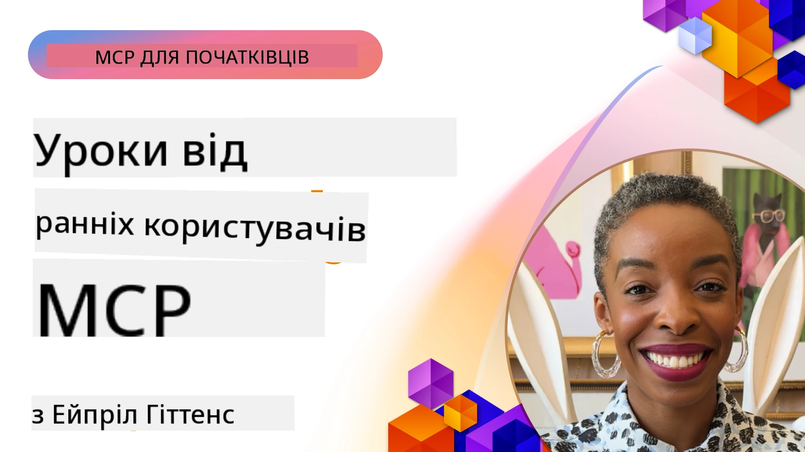

# 🌟 Уроки від ранніх користувачів

[](https://youtu.be/jds7dSmNptE)

_(Натисніть на зображення вище, щоб переглянути відео цього уроку)_

## 🎯 Що охоплює цей модуль

Цей модуль досліджує, як реальні організації та розробники використовують Model Context Protocol (MCP) для вирішення практичних проблем і стимулювання інновацій. Через детальні кейс-дослідження, практичні проекти та реальні приклади ви дізнаєтесь, як MCP дозволяє безпечно інтегрувати масштабовані AI-рішення, які з’єднують мовні моделі, інструменти та корпоративні дані.

### 📚 Погляньте MCP у дії

Хочете побачити, як ці принципи застосовуються у готових до виробництва інструментах? Перегляньте наш [**10 серверів Microsoft MCP, які трансформують продуктивність розробників**](microsoft-mcp-servers.md), де представлені реальні сервери Microsoft MCP, які ви можете використовувати вже сьогодні.

## Огляд

Цей урок досліджує, як ранні користувачі застосовували Model Context Protocol (MCP) для вирішення реальних проблем і стимулювання інновацій у різних галузях. Через детальні кейс-дослідження та практичні проекти ви побачите, як MCP забезпечує стандартизовану, безпечну та масштабовану інтеграцію AI — об’єднуючи великі мовні моделі, інструменти та корпоративні дані в єдину систему. Ви отримаєте практичний досвід розробки рішень на базі MCP, дізнаєтеся перевірені патерни впровадження та кращі практики розгортання MCP у виробничих середовищах. Урок також висвітлює нові тренди, майбутні напрямки та ресурси з відкритим кодом, які допоможуть вам залишатися на передовій технології MCP та її розвиваючої екосистеми.

## Навчальні цілі

- Аналізувати реальні впровадження MCP у різних галузях
- Проектувати та створювати повноцінні додатки на основі MCP
- Досліджувати нові тренди та майбутні напрямки технології MCP
- Застосовувати кращі практики у реальних сценаріях розробки

## Реальні впровадження MCP

### Кейс-дослідження 1: Автоматизація служби підтримки клієнтів в корпорації

Міжнародна корпорація реалізувала рішення на основі MCP для стандартизації AI-взаємодій у своїх системах підтримки клієнтів. Це дозволило їм:

- Створити уніфікований інтерфейс для кількох провайдерів LLM
- Підтримувати єдину систему управління запитами у різних відділах
- Запровадити надійні засоби безпеки та відповідності вимогам
- Легко перемикатися між різними моделями AI в залежності від конкретних потреб

**Технічна реалізація:**

```python
# Реалізація сервера MCP на Python для підтримки клієнтів
import logging
import asyncio
from modelcontextprotocol import create_server, ServerConfig
from modelcontextprotocol.server import MCPServer
from modelcontextprotocol.transports import create_http_transport
from modelcontextprotocol.resources import ResourceDefinition
from modelcontextprotocol.prompts import PromptDefinition
from modelcontextprotocol.tool import ToolDefinition

# Налаштувати ведення журналу
logging.basicConfig(level=logging.INFO)

async def main():
    # Створити конфігурацію сервера
    config = ServerConfig(
        name="Enterprise Customer Support Server",
        version="1.0.0",
        description="MCP server for handling customer support inquiries"
    )
    
    # Ініціалізувати сервер MCP
    server = create_server(config)
    
    # Зареєструвати ресурси бази знань
    server.resources.register(
        ResourceDefinition(
            name="customer_kb",
            description="Customer knowledge base documentation"
        ),
        lambda params: get_customer_documentation(params)
    )
    
    # Зареєструвати шаблони підказок
    server.prompts.register(
        PromptDefinition(
            name="support_template",
            description="Templates for customer support responses"
        ),
        lambda params: get_support_templates(params)
    )
    
    # Зареєструвати інструменти підтримки
    server.tools.register(
        ToolDefinition(
            name="ticketing",
            description="Create and update support tickets"
        ),
        handle_ticketing_operations
    )
    
    # Запустити сервер з HTTP транспортом
    transport = create_http_transport(port=8080)
    await server.run(transport)

if __name__ == "__main__":
    asyncio.run(main())
```

**Результати:** Зменшення витрат на моделі на 30%, підвищення послідовності відповідей на 45%, а також покращення відповідності вимогам у глобальних операціях.

### Кейс-дослідження 2: Медичний діагностичний асистент

Медичний заклад розробив інфраструктуру MCP для інтеграції кількох спеціалізованих медичних AI-моделей, водночас забезпечуючи захист чутливих даних пацієнтів:

- Безперешкодне перемикання між загальними та спеціалізованими медичними моделями
- Строгий контроль конфіденційності та ведення аудиту
- Інтеграція з існуючими системами електронних медичних записів (EHR)
- Послідовна інженерія запитів для медичної термінології

**Технічна реалізація:**

```csharp
// C# MCP host application implementation in healthcare application
using Microsoft.Extensions.DependencyInjection;
using ModelContextProtocol.SDK.Client;
using ModelContextProtocol.SDK.Security;
using ModelContextProtocol.SDK.Resources;

public class DiagnosticAssistant
{
    private readonly MCPHostClient _mcpClient;
    private readonly PatientContext _patientContext;
    
    public DiagnosticAssistant(PatientContext patientContext)
    {
        _patientContext = patientContext;
        
        // Configure MCP client with healthcare-specific settings
        var clientOptions = new ClientOptions
        {
            Name = "Healthcare Diagnostic Assistant",
            Version = "1.0.0",
            Security = new SecurityOptions
            {
                Encryption = EncryptionLevel.Medical,
                AuditEnabled = true
            }
        };
        
        _mcpClient = new MCPHostClientBuilder()
            .WithOptions(clientOptions)
            .WithTransport(new HttpTransport("https://healthcare-mcp.example.org"))
            .WithAuthentication(new HIPAACompliantAuthProvider())
            .Build();
    }
    
    public async Task<DiagnosticSuggestion> GetDiagnosticAssistance(
        string symptoms, string patientHistory)
    {
        // Create request with appropriate resources and tool access
        var resourceRequest = new ResourceRequest
        {
            Name = "patient_records",
            Parameters = new Dictionary<string, object>
            {
                ["patientId"] = _patientContext.PatientId,
                ["requestingProvider"] = _patientContext.ProviderId
            }
        };
        
        // Request diagnostic assistance using appropriate prompt
        var response = await _mcpClient.SendPromptRequestAsync(
            promptName: "diagnostic_assistance",
            parameters: new Dictionary<string, object>
            {
                ["symptoms"] = symptoms,
                patientHistory = patientHistory,
                relevantGuidelines = _patientContext.GetRelevantGuidelines()
            });
            
        return DiagnosticSuggestion.FromMCPResponse(response);
    }
}
```

**Результати:** Покращені діагностичні рекомендації для лікарів при повній відповідності вимогам HIPAA та значне скорочення перемикань між системами.

### Кейс-дослідження 3: Аналіз ризиків у фінансових послугах

Фінансова установа впровадила MCP для стандартизації процесів аналізу ризиків у різних відділах:

- Створили уніфікований інтерфейс для моделей кредитного ризику, виявлення шахрайства та інвестиційних ризиків
- Запровадили суворий контроль доступу та версіонування моделей
- Забезпечили можливість аудиту всіх AI-рекомендацій
- Підтримували послідовне форматування даних у різних системах

**Технічна реалізація:**

```java
// Java MCP-сервер для оцінки фінансових ризиків
import org.mcp.server.*;
import org.mcp.security.*;

public class FinancialRiskMCPServer {
    public static void main(String[] args) {
        // Створити MCP-сервер з функціями фінансової відповідності
        MCPServer server = new MCPServerBuilder()
            .withModelProviders(
                new ModelProvider("risk-assessment-primary", new AzureOpenAIProvider()),
                new ModelProvider("risk-assessment-audit", new LocalLlamaProvider())
            )
            .withPromptTemplateDirectory("./compliance/templates")
            .withAccessControls(new SOCCompliantAccessControl())
            .withDataEncryption(EncryptionStandard.FINANCIAL_GRADE)
            .withVersionControl(true)
            .withAuditLogging(new DatabaseAuditLogger())
            .build();
            
        server.addRequestValidator(new FinancialDataValidator());
        server.addResponseFilter(new PII_RedactionFilter());
        
        server.start(9000);
        
        System.out.println("Financial Risk MCP Server running on port 9000");
    }
}
```

**Результати:** Покращене дотримання нормативних вимог, скорочення часу розгортання моделей на 40% та підвищення послідовності оцінки ризиків у різних відділах.

### Кейс-дослідження 4: Сервер Microsoft Playwright MCP для автоматизації браузера

Microsoft розробив [Playwright MCP Server](https://github.com/microsoft/playwright-mcp), який забезпечує безпечну, стандартизовану автоматизацію браузера через Model Context Protocol. Цей сервер, готовий до виробництва, дозволяє AI-агентам та LLM взаємодіяти з веб-браузерами у контрольованому, аудиторському та розширюваному режимі — підтримуючи сценарії автоматизованого тестування веб-сайтів, видобутку даних та комплексних робочих процесів.

> **🎯 Готовий до виробництва інструмент**
> 
> Це реальний MCP сервер, який ви можете використовувати сьогодні! Дізнайтеся більше про Playwright MCP Server та ще 9 інших готових Microsoft MCP серверів у нашому [**Посібнику Microsoft MCP Servers**](microsoft-mcp-servers.md#8--playwright-mcp-server).

**Ключові особливості:**
- Надає можливості автоматизації браузера (навігація, заповнення форм, створення скріншотів тощо) як інструменти MCP
- Забезпечує суворий контроль доступу та ізоляцію для запобігання несанкціонованих дій
- Забезпечує детальні аудиторські журнали всієї взаємодії з браузером
- Підтримує інтеграцію з Azure OpenAI та іншими провайдерами LLM для агентської автоматизації
- Працює як основа для можливостей веб-перегляду GitHub Copilot Coding Agent

**Технічна реалізація:**

```typescript
// TypeScript: Реєстрація інструментів автоматизації браузера Playwright на сервері MCP
import { createServer, ToolDefinition } from 'modelcontextprotocol';
import { launch } from 'playwright';

const server = createServer({
  name: 'Playwright MCP Server',
  version: '1.0.0',
  description: 'MCP server for browser automation using Playwright'
});

// Зареєструвати інструмент для переходу за URL та зняття скріншоту
server.tools.register(
  new ToolDefinition({
    name: 'navigate_and_screenshot',
    description: 'Navigate to a URL and capture a screenshot',
    parameters: {
      url: { type: 'string', description: 'The URL to visit' }
    }
  }),
  async ({ url }) => {
    const browser = await launch();
    const page = await browser.newPage();
    await page.goto(url);
    const screenshot = await page.screenshot();
    await browser.close();
    return { screenshot };
  }
);

// Запустити сервер MCP
server.listen(8080);
```

**Результати:**

- Забезпечена безпечна програмна автоматизація браузера для AI-агентів та LLM
- Скорочення ручного тестування і покращення покриття тестами веб-застосунків
- Надана багаторазова та розширювана основа для інтеграції інструментів на базі браузера у корпоративних середовищах
- Працює як база для веб-перегляду у GitHub Copilot

**Посилання:**

- [Репозиторій Playwright MCP Server на GitHub](https://github.com/microsoft/playwright-mcp)
- [Microsoft AI та рішення для автоматизації](https://azure.microsoft.com/en-us/products/ai-services/)

### Кейс-дослідження 5: Azure MCP – корпоративний Model Context Protocol як сервіс

Azure MCP Server ([https://aka.ms/azmcp](https://aka.ms/azmcp)) – це керований, корпоративного рівня сервіс Model Context Protocol від Microsoft, створений для надання масштабованих, безпечних і відповідних MCP сервісних можливостей у хмарі. Azure MCP дозволяє організаціям швидко розгортати, керувати та інтегрувати MCP сервери з Azure AI, даними та службами безпеки, знижуючи операційне навантаження та пришвидшуючи впровадження AI.

> **🎯 Готовий до виробництва інструмент**
> 
> Це реальний MCP сервер, який ви можете використовувати сьогодні! Дізнайтеся більше про Microsoft Foundry MCP Server у нашому [**Посібнику Microsoft MCP Servers**](microsoft-mcp-servers.md).


- Повністю керований хостинг MCP сервера з вбудованим масштабуванням, моніторингом та безпекою
- Рідна інтеграція з Azure OpenAI, Azure AI Search та іншими сервісами Azure
- Корпоративна аутентифікація та авторизація через Microsoft Entra ID
- Підтримка кастомних інструментів, шаблонів запитів та конекторів ресурсів
- Відповідність корпоративним вимогам безпеки та регулювання

**Технічна реалізація:**

```yaml
# Example: Azure MCP server deployment configuration (YAML)
apiVersion: mcp.microsoft.com/v1
kind: McpServer
metadata:
  name: enterprise-mcp-server
spec:
  modelProviders:
    - name: azure-openai
      type: AzureOpenAI
      endpoint: https://<your-openai-resource>.openai.azure.com/
      apiKeySecret: <your-azure-keyvault-secret>
  tools:
    - name: document_search
      type: AzureAISearch
      endpoint: https://<your-search-resource>.search.windows.net/
      apiKeySecret: <your-azure-keyvault-secret>
  authentication:
    type: EntraID
    tenantId: <your-tenant-id>
  monitoring:
    enabled: true
    logAnalyticsWorkspace: <your-log-analytics-id>
```

**Результати:**  
- Скорочення часу до отримання результатів у корпоративних AI-проєктах завдяки готовій платформі MCP сервера з відповідністю вимогам
- Спрощена інтеграція LLM, інструментів та джерел корпоративних даних
- Покращена безпека, спостережуваність та операційна ефективність робочих навантажень MCP
- Підвищення якості коду завдяки кращим практикам Azure SDK та сучасним схемам аутентифікації

**Посилання:**  
- [Документація Azure MCP](https://aka.ms/azmcp)
- [Репозиторій Azure MCP Server на GitHub](https://github.com/Azure/azure-mcp)
- [Сервіси Azure AI](https://azure.microsoft.com/en-us/products/ai-services/)
- [Центр Microsoft MCP](https://mcp.azure.com)

## Кейс-дослідження 6: NLWeb 
MCP (Model Context Protocol) — це новий протокол для чатботів та AI-асистентів для взаємодії з інструментами. Кожен екземпляр NLWeb також є MCP-сервером, який підтримує одну основну методику - ask, яка використовується для запитання сайту природною мовою. Повернена відповідь використовує schema.org — широко вживану словникову базу для опису веб-даних. Грубо кажучи, MCP — це NLWeb, як Http для HTML. NLWeb поєднує протоколи, формати Schema.org та приклади коду, щоб допомогти сайтам швидко створювати такі кінцеві точки, які приносять користь як людям через розмовні інтерфейси, так і машинам через природну взаємодію агент-агент.

У NLWeb є два окремі компоненти.
- Протокол, який дуже простий для початку, щоб взаємодіяти з сайтом природною мовою та формат, який використовує json і schema.org для поверненої відповіді. Детальніше дивіться в документації по REST API.
- Проста реалізація (1), яка використовує існуючу розмітку для сайтів, що можна абстрагувати як списки елементів (продукти, рецепти, атракції, відгуки тощо). Разом із набором віджетів користувацького інтерфейсу сайти можуть легко забезпечити розмовні інтерфейси до свого контенту. Докладніше дивіться в документації Life of a chat query про те, як це працює.
 
**Посилання:**  
- [Документація Azure MCP](https://aka.ms/azmcp)
- [NLWeb](https://github.com/microsoft/NlWeb)

### Кейс-дослідження 7: Сервер Microsoft Foundry MCP – інтеграція корпоративних AI-агентів

Сервери Microsoft Foundry MCP демонструють, як MCP можна використовувати для оркестрації та керування AI-агентами і робочими процесами у корпоративних середовищах. Інтегруючи MCP з Microsoft Foundry, організації можуть стандартизувати взаємодію агентів, використовувати управління робочими процесами Foundry та забезпечувати безпечні, масштабовані розгортання.

> **🎯 Готовий до виробництва інструмент**
> 
> Це реальний MCP сервер, який ви можете використовувати сьогодні! Дізнайтеся більше про Microsoft Foundry MCP Server у нашому [**Посібнику Microsoft MCP Servers**](microsoft-mcp-servers.md#9--microsoft-foundry-mcp-server).

**Ключові особливості:**
- Повний доступ до екосистеми AI Azure, включаючи каталоги моделей та управління розгортанням
- Індексування знань за допомогою Azure AI Search для RAG-застосунків
- Інструменти оцінки продуктивності моделей AI та забезпечення якості
- Інтеграція з Microsoft Foundry Catalog та Labs для передових дослідницьких моделей
- Можливості керування агентами та оцінки для виробничих сценаріїв

**Результати:**
- Швидке прототипування та надійний моніторинг робочих процесів AI-агентів
- Безшовна інтеграція з сервісами Azure AI для розширених сценаріїв
- Уніфікований інтерфейс для створення, впровадження та моніторингу агентських конвеєрів
- Покращена безпека, відповідність та операційна ефективність для підприємств
- Прискорене впровадження AI при збереженні контролю над складними агентськими процесами

**Посилання:**
- [Репозиторій Microsoft Foundry MCP Server на GitHub](https://github.com/azure-ai-foundry/mcp-foundry)
- [Інтеграція Azure AI Agents з MCP (блог Microsoft Foundry)](https://devblogs.microsoft.com/foundry/integrating-azure-ai-agents-mcp/)

### Кейс-дослідження 8: Пісочниця Foundry MCP – експерименти та прототипування

Пісочниця Foundry MCP пропонує готове середовище для експериментів із серверами MCP та інтеграціями Microsoft Foundry. Розробники можуть швидко прототипувати, тестувати та оцінювати AI-моделі та робочі процеси агентів, використовуючи ресурси з Microsoft Foundry Catalog і Labs. Пісочниця спрощує налаштування, надає прикладні проекти та підтримує спільну розробку, що полегшує вивчення кращих практик і нових сценаріїв з мінімальними витратами. Вона особливо корисна для команд, які хочуть перевірити ідеї, поділитися експериментами та прискорити навчання без складної інфраструктури. Завдяки зниженню бар’єрів для входу, пісочниця сприяє інноваціям і внескам спільноти у екосистему MCP та Microsoft Foundry.

**Посилання:**

- [Репозиторій Foundry MCP Playground на GitHub](https://github.com/azure-ai-foundry/foundry-mcp-playground)

### Кейс-дослідження 9: Сервер Microsoft Learn Docs MCP – доступ до документації з підтримкою AI

Сервер Microsoft Learn Docs MCP — це хмарний сервіс, що надає AI-асистентам доступ у реальному часі до офіційної документації Microsoft через Model Context Protocol. Цей готовий до виробництва сервер підключений до комплексної екосистеми Microsoft Learn і дає змогу семантичний пошук по всіх офіційних джерелах Microsoft.

> **🎯 Готовий до виробництва інструмент**
> 
> Це реальний MCP сервер, який ви можете використовувати сьогодні! Дізнайтеся більше про Microsoft Learn Docs MCP Server у нашому [**Посібнику Microsoft MCP Servers**](microsoft-mcp-servers.md#1--microsoft-learn-docs-mcp-server).

**Ключові особливості:**
- Доступ у реальному часі до офіційної документації Microsoft, документації Azure та Microsoft 365
- Розвинені можливості семантичного пошуку, які розуміють контекст і намір
- Завжди актуальна інформація, оскільки контент Microsoft Learn оновлюється регулярно
- Комплексне охоплення Microsoft Learn, документації Azure та джерел Microsoft 365
- Повертає до 10 високоякісних контентних блоків із заголовками статей та URL-адресами

**Чому це критично:**
- Вирішує проблему «застарілих знань AI» для технологій Microsoft
- Забезпечує AI-асистентів найновішою інформацією про .NET, C#, Azure та Microsoft 365
- Надає авторитетну інформацію з першоджерел для точної генерації коду
- Важливо для розробників, які працюють з швидко еволюціонуючими технологіями Microsoft

**Результати:**
- Суттєве підвищення точності AI-згенерованого коду для технологій Microsoft
- Зменшення часу на пошук актуальної документації та кращих практик
- Підвищення продуктивності розробників завдяки контекстно-залежному пошуку документації
- Безшовна інтеграція з робочими процесами розробки без виходу з IDE

**Посилання:**
- [Репозиторій Microsoft Learn Docs MCP Server на GitHub](https://github.com/MicrosoftDocs/mcp)
- [Документація Microsoft Learn](https://learn.microsoft.com/)

## Практичні проекти

### Проект 1: Створення MCP сервера з підтримкою багатьох провайдерів

**Мета:** Створити MCP сервер, який може маршрутизувати запити до кількох провайдерів AI-моделей на основі конкретних критеріїв.

**Вимоги:**

- Підтримка щонайменше трьох різних провайдерів моделей (наприклад, OpenAI, Anthropic, локальні моделі)
- Реалізація механізму маршрутизації на основі метаданих запиту
- Створення системи конфігурації для управління обліковими даними провайдерів
- Додавання кешування для оптимізації продуктивності та витрат
- Побудова простого інформаційного табло для моніторингу використання

**Кроки реалізації:**

1. Налаштувати базову інфраструктуру MCP сервера
2. Реалізувати адаптери провайдерів для кожної служби AI-моделей
3. Створити логіку маршрутизації на основі атрибутів запиту
4. Додати механізми кешування для часто використовуваних запитів
5. Розробити інформаційне табло моніторингу
6. Протестувати з різними патернами запитів

**Технології:** Оберіть серед Python (.NET/Java/Python на ваш вибір), Redis для кешування та простий веб-фреймворк для табло.

### Проект 2: Система управління шаблонами запитів для підприємства

**Мета:** Розробити систему на основі MCP для управління, версіонування та розгортання шаблонів запитів по організації.

**Вимоги:**


- Створити централізований репозиторій для шаблонів запитів
- Впровадити версіонування та робочі процеси затвердження
- Розробити можливості тестування шаблонів з прикладами вхідних даних
- Розробити контроль доступу на основі ролей
- Створити API для отримання та розгортання шаблонів

**Кроки реалізації:**

1. Спроектувати схему бази даних для зберігання шаблонів
2. Створити основне API для операцій CRUD над шаблонами
3. Впровадити систему версіонування
4. Розробити робочий процес затвердження
5. Розробити тестову платформу
6. Створити простий веб-інтерфейс для управління
7. Інтегрувати з MCP сервером

**Технології:** Ваш вибір бекенд-фреймворку, SQL або NoSQL бази даних, а також фронтенд-фреймворку для інтерфейсу управління.

### Проєкт 3: Платформа генерації контенту на основі MCP

**Мета:** Створити платформу генерації контенту, яка використовує MCP для забезпечення послідовних результатів у різних типах контенту.

**Вимоги:**

- Підтримка кількох форматів контенту (блоги, соцмережі, маркетингові тексти)
- Впровадження генерації на основі шаблонів з можливістю налаштувань
- Створення системи рецензування і зворотного зв’язку
- Відстеження показників ефективності контенту
- Підтримка версіонування контенту та ітерацій

**Кроки реалізації:**

1. Налаштувати інфраструктуру клієнта MCP
2. Створити шаблони для різних типів контенту
3. Побудувати конвеєр генерації контенту
4. Впровадити систему рецензування
5. Розробити систему відстеження метрик
6. Створити користувацький інтерфейс для управління шаблонами та генерації контенту

**Технології:** Ваша улюблена мова програмування, веб-фреймворк і система баз даних.

## Майбутні напрямки розвитку технології MCP

### Нові тенденції

1. **Мульти-модальний MCP**
   - Розширення MCP для стандартизації взаємодії з моделями зображень, аудіо та відео
   - Розробка можливостей міжмодального розуміння
   - Стандартизовані формати запитів для різних модальностей

2. **Федеративна інфраструктура MCP**
   - Розподілені мережі MCP, які можуть обмінюватися ресурсами між організаціями
   - Стандартизовані протоколи для безпечного обміну моделями
   - Техніки обчислень із захистом приватності

3. **Маркетплейси MCP**
   - Екосистеми для поширення та монетизації MCP-шаблонів і плагінів
   - Процеси забезпечення якості та сертифікації
   - Інтеграція з маркетплейсами моделей

4. **MCP для обчислень на периферії (Edge Computing)**
   - Адаптація стандартів MCP для пристроїв з обмеженими ресурсами
   - Оптимізовані протоколи для середовищ із низькою пропускною спроможністю
   - Спеціалізовані реалізації MCP для IoT-екосистем

5. **Регуляторні рамки**
   - Розробка розширень MCP для дотримання нормативних вимог
   - Стандартизовані аудиторські траєкторії та інтерфейси пояснюваності
   - Інтеграція з новими рамками управління ШІ

### Рішення MCP від Microsoft

Microsoft та Azure розробили кілька відкритих репозиторіїв, щоб допомогти розробникам впроваджувати MCP у різних сценаріях:

#### Організація Microsoft

1. [playwright-mcp](https://github.com/microsoft/playwright-mcp) - MCP сервер Playwright для автоматизації браузера та тестування
2. [files-mcp-server](https://github.com/microsoft/files-mcp-server) - Реалізація MCP сервера OneDrive для локального тестування та внеску спільноти
3. [NLWeb](https://github.com/microsoft/NlWeb) - NLWeb — це збірка відкритих протоколів та пов’язаних з ними інструментів з відкритим кодом. Головна мета — створити базовий рівень для AI Web

#### Організація Azure-Samples

1. [mcp](https://github.com/Azure-Samples/mcp) - Посилання на зразки, інструменти та ресурси для побудови та інтеграції MCP серверів на Azure з підтримкою кількох мов
2. [mcp-auth-servers](https://github.com/Azure-Samples/mcp-auth-servers) - Приклад MCP серверів, що демонструють автентифікацію відповідно до поточної специфікації Model Context Protocol
3. [remote-mcp-functions](https://github.com/Azure-Samples/remote-mcp-functions) - Лендінгова сторінка для реалізацій віддалених MCP серверів у Azure Functions зі посиланнями на мовні репозиторії
4. [remote-mcp-functions-python](https://github.com/Azure-Samples/remote-mcp-functions-python) - Шаблон швидкого запуску для створення та розгортання власних віддалених MCP серверів на Azure Functions з Python
5. [remote-mcp-functions-dotnet](https://github.com/Azure-Samples/remote-mcp-functions-dotnet) - Шаблон швидкого запуску для створення та розгортання власних віддалених MCP серверів на Azure Functions з .NET/C#
6. [remote-mcp-functions-typescript](https://github.com/Azure-Samples/remote-mcp-functions-typescript) - Шаблон швидкого запуску для створення та розгортання власних віддалених MCP серверів на Azure Functions з TypeScript
7. [remote-mcp-apim-functions-python](https://github.com/Azure-Samples/remote-mcp-apim-functions-python) - Azure API Management як AI Gateway до віддалених MCP серверів з Python
8. [AI-Gateway](https://github.com/Azure-Samples/AI-Gateway) - Експерименти APIM ❤️ AI, включаючи можливості MCP, інтеграцію з Azure OpenAI та AI Foundry

Ці репозиторії пропонують різноманітні реалізації, шаблони та ресурси для роботи з Model Context Protocol на різних мовах програмування та сервісах Azure. Вони охоплюють спектр випадків використання — від базових серверних реалізацій до автентифікації, розгортання в хмарі та сценаріїв інтеграції в підприємствах.

#### Каталог ресурсів MCP

Каталог [MCP Resources](https://github.com/microsoft/mcp/tree/main/Resources) в офіційному репозиторії Microsoft MCP містить добірку зразків ресурсів, шаблонів запитів і визначень інструментів для використання з MCP серверами. Цей каталог призначений для допомоги розробникам швидко почати роботу з MCP, пропонуючи повторно використовувані блоки та приклади найкращих практик для:

- **Шаблони запитів:** Готові до використання шаблони запитів для поширених задач і сценаріїв ШІ, які можна адаптувати для ваших реалізацій MCP серверів.
- **Визначення інструментів:** Зразки схем інструментів та метаданих для стандартизації інтеграції та виклику інструментів у різних MCP серверах.
- **Приклади ресурсів:** Зразки визначень ресурсів для підключення до джерел даних, API та зовнішніх послуг у межах MCP.
- **Приклади реалізацій:** Практичні зразки, що демонструють структуру та організацію ресурсів, запитів і інструментів у реальних MCP проєктах.

Ці ресурси прискорюють розробку, сприяють стандартизації та допомагають забезпечити найкращі практики при створенні та розгортанні рішень на основі MCP.

#### Каталог ресурсів MCP

- [MCP Resources (зразки запитів, інструменти та визначення ресурсів)](https://github.com/microsoft/mcp/tree/main/Resources)

### Можливості досліджень

- Ефективні методи оптимізації запитів у рамках MCP
- Моделі безпеки для багатоорендних розгортань MCP
- Порівняльне тестування продуктивності різних реалізацій MCP
- Методи формальної верифікації MCP серверів

## Висновок

Model Context Protocol (MCP) стрімко формує майбутнє стандартизованої, безпечної та сумісної інтеграції ШІ у різних галузях. Через кейс-стаді та практичні проєкти цього уроку ви побачили, як ранні користувачі — у тому числі Microsoft та Azure — використовують MCP для вирішення реальних завдань, прискорення впровадження ШІ та забезпечення відповідності, безпеки і масштабованості. Модульний підхід MCP дозволяє організаціям з’єднувати великі мовні моделі, інструменти та корпоративні дані в єдину, аудиторську платформу. У міру розвитку MCP важливо підтримувати зв’язок із спільнотою, досліджувати відкриті ресурси та застосовувати найкращі практики для побудови надійних ШІ-рішень, готових до майбутнього.

## Додаткові ресурси

- [MCP Foundry GitHub Repository](https://github.com/azure-ai-foundry/mcp-foundry)
- [Foundry MCP Playground](https://github.com/azure-ai-foundry/foundry-mcp-playground)
- [Інтеграція агенцій Azure AI з MCP (блог Microsoft Foundry)](https://devblogs.microsoft.com/foundry/integrating-azure-ai-agents-mcp/)
- [MCP GitHub Repository (Microsoft)](https://github.com/microsoft/mcp)
- [MCP Resources Directory (зразки запитів, інструменти та визначення ресурсів)](https://github.com/microsoft/mcp/tree/main/Resources)
- [Спільнота MCP та документація](https://modelcontextprotocol.io/introduction)
- [Специфікація MCP (2026-07-28)](https://modelcontextprotocol.io/specification/2026-07-28/)
- [Документація Azure MCP](https://aka.ms/azmcp)
- [OWASP MCP Top 10](https://microsoft.github.io/mcp-azure-security-guide/mcp/) - Найкращі практики безпеки
- [Playwright MCP Server GitHub Repository](https://github.com/microsoft/playwright-mcp)
- [Files MCP Server (OneDrive)](https://github.com/microsoft/files-mcp-server)
- [Azure-Samples MCP](https://github.com/Azure-Samples/mcp)
- [MCP Auth Servers (Azure-Samples)](https://github.com/Azure-Samples/mcp-auth-servers)
- [Remote MCP Functions (Azure-Samples)](https://github.com/Azure-Samples/remote-mcp-functions)
- [Remote MCP Functions Python (Azure-Samples)](https://github.com/Azure-Samples/remote-mcp-functions-python)
- [Remote MCP Functions .NET (Azure-Samples)](https://github.com/Azure-Samples/remote-mcp-functions-dotnet)
- [Remote MCP Functions TypeScript (Azure-Samples)](https://github.com/Azure-Samples/remote-mcp-functions-typescript)
- [Remote MCP APIM Functions Python (Azure-Samples)](https://github.com/Azure-Samples/remote-mcp-apim-functions-python)
- [AI-Gateway (Azure-Samples)](https://github.com/Azure-Samples/AI-Gateway)
- [Розв’язки Microsoft AI та автоматизації](https://azure.microsoft.com/en-us/products/ai-services/)

## Вправи

1. Проаналізуйте одне з кейс-стаді та запропонуйте альтернативний підхід до впровадження.
2. Оберіть одну з ідей проєкту й створіть детальну технічну специфікацію.
3. Дослідіть галузь, не охоплену в кейс-стаді, і окресліть, як MCP може вирішити її специфічні виклики.
4. Вивчіть один із напрямків розвитку та створіть концепцію нового розширення MCP для його підтримки.

## Що далі

Дізнайтеся більше: [Microsoft MCP Servers](./microsoft-mcp-servers.md)

Продовжити: [Модуль 8: Найкращі практики](../08-BestPractices/README.md)

---

<!-- CO-OP TRANSLATOR DISCLAIMER START -->
**Відмова від відповідальності**:
Цей документ було перекладено за допомогою сервісу штучного інтелекту для перекладу [Co-op Translator](https://github.com/Azure/co-op-translator). Хоча ми прагнемо до точності, будь ласка, майте на увазі, що автоматичні переклади можуть містити помилки або неточності. Оригінальний документ рідною мовою слід вважати авторитетним джерелом. Для критично важливої інформації рекомендується професійний людський переклад. Ми не несемо відповідальності за будь-які непорозуміння або неправильні тлумачення, що виникли внаслідок використання цього перекладу.
<!-- CO-OP TRANSLATOR DISCLAIMER END -->