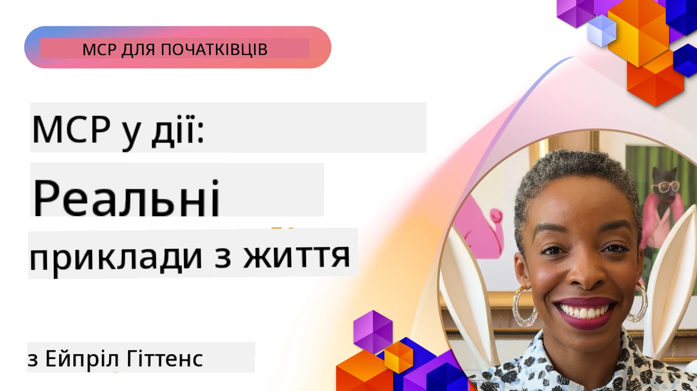

# MCP у дії: кейс-стаді з реального світу

_(Натисніть на зображення вище, щоб переглянути відео цього уроку)_

Протокол контексту моделі (MCP) змінює спосіб взаємодії AI-додатків із даними, інструментами та сервісами. У цьому розділі наведено кейс-стаді з реального світу, які демонструють практичне застосування MCP у різних корпоративних сценаріях.

## Огляд

У цьому розділі представлені конкретні приклади впровадження MCP, які висвітлюють, як організації використовують цей протокол для розв’язання складних бізнес-задач. Аналізуючи ці кейс-стаді, ви отримаєте уявлення про універсальність, масштабованість та практичні переваги MCP у реальних сценаріях.

## Ключові цілі навчання

Вивчаючи ці кейс-стаді, ви зможете:

- Зрозуміти, як MCP може застосовуватися для розв’язання конкретних бізнес-проблем
- Дізнатися про різні схеми інтеграції та архітектурні підходи
- Визначити найкращі практики впровадження MCP у корпоративних середовищах
- Отримати уявлення про виклики та рішення, з якими стикаються у реальних впровадженнях
- Виявити можливості застосування схожих схем у власних проектах

## Основні кейс-стаді

### 1. [Azure AI Агентів Подорожей – Випадок з реалізації](./travelagentsample.md)

Цей кейс-стаді розглядає комплексне референсне рішення компанії Microsoft, яке демонструє, як створити багатoагентську AI-систему планування подорожей за допомогою MCP, Azure OpenAI та Azure AI Search. Проєкт демонструє:

- Оркестрацію багатьох агентів через MCP
- Інтеграцію корпоративних даних з Azure AI Search
- Безпечну, масштабовану архітектуру на базі сервісів Azure
- Розширювані інструменти з повторно використовуваними компонентами MCP
- Конверсійний користувацький досвід, підсилений Azure OpenAI

Архітектура та деталі реалізації надають цінні знання для побудови складних багатoагентських систем із MCP як шаром координації.

### 2. [Оновлення елементів Azure DevOps за даними з YouTube](./UpdateADOItemsFromYT.md)

Цей кейс-стаді демонструє практичне застосування MCP для автоматизації бізнес-процесів. Показано, як інструменти MCP можуть використовуватися для:

- Витягання даних з онлайн-платформ (YouTube)
- Оновлення робочих елементів в системах Azure DevOps
- Створення повторюваних автоматизованих робочих процесів
- Інтеграції даних між різними системами

Цей приклад ілюструє, як навіть відносно прості впровадження MCP можуть значно підвищити ефективність завдяки автоматизації рутинних завдань і поліпшенню узгодженості даних між системами.

### 3. [Отримання документації в реальному часі за допомогою MCP](./docs-mcp/README.md)

У цьому кейс-стаді вас проведуть через процес підключення Python-консольного клієнта до сервера Model Context Protocol (MCP) для отримання та реєстрації документації Microsoft у режимі реального часу з врахуванням контексту. Ви навчитеся:

- Підключатися до MCP-сервера з Python-клієнта та офіційного MCP SDK
- Використовувати потокових HTTP-клієнтів для ефективного отримання даних у режимі реального часу
- Викликати засоби документації на сервері та реєструвати відповіді безпосередньо у консолі
- Інтегрувати актуальну документацію Microsoft у ваш робочий процес без виходу з терміналу

Розділ включає практичне завдання, мінімальний робочий приклад коду та посилання на додаткові ресурси для глибшого вивчення. Перегляньте повний практикум і код у доданому розділі, щоб зрозуміти, як MCP може трансформувати доступ до документації та продуктивність розробника у консольному середовищі.

### 4. [Інтерактивний вебдодаток для генерації планів навчання з MCP](./docs-mcp/README.md)

Цей кейс-стаді демонструє, як створити інтерактивний вебдодаток за допомогою Chainlit та протоколу Model Context Protocol (MCP) для генерації персоналізованих планів навчання з будь-якої теми. Користувачі можуть вказати предмет (наприклад, «сертифікація AI-900») та тривалість навчання (наприклад, 8 тижнів), а додаток надасть покроковий розклад рекомендованого контенту. Chainlit забезпечує розмовний чат-інтерфейс, роблячи досвід цікавим і адаптивним.

- Розмовний вебдодаток на базі Chainlit
- Користувацькі запити для вибору теми та тривалості
- Рекомендації контенту по тижнях з використанням MCP
- Адаптивні відповіді в режимі реального часу в чат-інтерфейсі

Проєкт демонструє, як поєднання розмовного AI та MCP може створити динамічні, керовані користувачем освітні інструменти у сучасному веб-середовищі.

### 5. [Документація в редакторі з MCP-сервером у VS Code](./docs-mcp/README.md)

У цьому кейс-стаді показано, як можна інтегрувати документацію Microsoft Learn безпосередньо у ваш VS Code за допомогою MCP-сервера — жодних перемикань між вкладками браузера! Ви дізнаєтесь, як:

- Миттєво шукати та читати документацію у VS Code через панель MCP або командну палітру
- Посилатися на документацію та вставляти посилання безпосередньо у файли README чи курсів у форматі markdown
- Використовувати GitHub Copilot і MCP разом для безшовної AI-підтримки документації та коду
- Перевіряти та вдосконалювати документацію завдяки зворотному зв’язку в реальному часі та точності від Microsoft
- Інтегрувати MCP із робочими процесами GitHub для безперервної перевірки документації

Реалізація включає:

- Приклад конфігурації `.vscode/mcp.json` для простого налаштування
- Покрокові інструкції зі скріншотами інтеграції в редакторі
- Поради для поєднання Copilot і MCP для максимальної продуктивності

Цей сценарій ідеально підходить для авторів курсів, технічних письменників та розробників, які прагнуть залишатися зосередженими у редакторі, працюючи з документацією, Copilot та інструментами валідації — все це забезпечує MCP.

### 6. [Створення MCP-сервера на базі APIM](./apimsample.md)

Цей кейс-стаді пропонує покрокову інструкцію зі створення MCP-сервера за допомогою Azure API Management (APIM). Розглядаються:

- Налаштування MCP-сервера в Azure API Management
- Виставлення API-операцій як інструментів MCP
- Конфігурація політик для обмеження запитів та безпеки
- Тестування MCP-сервера за допомогою Visual Studio Code та GitHub Copilot

Цей приклад ілюструє, як використовувати можливості Azure для створення надійного MCP-сервера, який можна застосовувати у різних додатках, покращуючи інтеграцію AI-систем із корпоративними API.

### 7. [GitHub MCP Registry — прискорення агентської інтеграції](https://github.com/mcp)

У цьому кейс-стаді розглядається, як GitHub MCP Registry, запущений у вересні 2025 року, розв’язує ключову проблему в екосистемі AI: фрагментований пошук та розгортання серверів Model Context Protocol (MCP).

#### Огляд
**MCP Registry** усуває проблему розпорошених MCP-серверів у репозиторіях і реєстрах, через що інтеграція була повільною і схильною до помилок. Ці сервери дозволяють AI-агентам взаємодіяти з зовнішніми системами, такими як API, бази даних і джерела документації.

#### Проблема
Розробники агентських робочих процесів стикалися з кількома викликами:
- **Погана доступність** MCP-серверів на різних платформах
- **Зайві питання налаштування** на форумах і в документації
- **Ризики безпеки** через неперевірені чи ненадійні джерела
- **Відсутність стандартів** щодо якості та сумісності серверів

#### Архітектура рішення
MCP Registry GitHub централізує надійні MCP-сервери з такими ключовими функціями:
- **Інтеграція одним кліком** через VS Code для спрощення налаштувань
- **Сортування сигналу від шуму** за кількістю зірок, активністю та затвердженням спільноти
- **Пряма інтеграція** з GitHub Copilot та іншими сумісними інструментами MCP
- **Відкритий внесок** як від спільноти, так і від корпоративних партнерів

#### Бізнес-ефект
Реєстр забезпечив відчутні покращення:
- **Швидше освоєння** інструментів для розробників, як Microsoft Learn MCP Server, що передає офіційну документацію безпосередньо агентам
- **Підвищення продуктивності** через спеціалізовані сервери на кшталт `github-mcp-server`, які дають змогу автоматизувати GitHub природною мовою (створення PR, перезапуски CI, сканування коду)
- **Зміцнення довіри екосистеми** завдяки курованим спискам та прозорим стандартам конфігурації

#### Стратегічна цінність
Для спеціалістів із життєвого циклу агентів і відтворюваних робочих процесів MCP Registry пропонує:
- Модульне розгортання агентів зі стандартизованими компонентами
- Пайплайни оцінки на базі реєстру для послідовного тестування та валідації
- Взаємодію між інструментами для безперебійної інтеграції між різними AI-платформами

Цей кейс-стаді демонструє, що MCP Registry — це не просто довідник, а базова платформа для масштабованої інтеграції моделей і розгортання агентських систем у реальному світі.

### 8. [Публікація в соцмережі від імені агента](./publora-social-publishing.md)

Цей кейс-стаді розповідає про **MCP-сервер із можливістю запису** — сервер, інструменти якого виконують незворотні дії від імені користувача — із прикладом соціального публікування. Агент складає пост, людина його схвалює, і сервер публікує це в мережах згідно з графіком.

Цікавість полягає в обмеженнях проєктування для публікації, які застосовні до будь-якого сервера, що пише, а не тільки читає:

- **Відкритий пошук, автентифіковане виконання** — `tools/list` відповідає без облікових даних, щоб реєстри і клієнти могли інспектувати, а кожен виклик `tools/call` вимагає токен інакше повертає `401` з заголовком `WWW-Authenticate`
- **Реєстрація OAuth без позакиївкового кроку** — динамічна реєстрація клієнтів сьогодні, із Client ID Metadata Documents, на які вказує специфікація від `2026-07-28`
- **Анотації інструментів** (`readOnlyHint`, `destructiveHint`, `idempotentHint`), які клієнти використовують для визначення, що треба підтвердити — підказки, а не примус, те, що зараз очікують директорії конекторів на огляді
- **Ідентифікатори, що не можуть бути вигадами**, щоб помилка "галюцинації" призводила до явної відмови, а не виконання на підставі правдоподібного значення
- **Ключі ідемпотентності для інструментів створення постів**, щоб повторна спроба середовища агента не спричиняла дублікати публікації
- **Мішенний оператор без дії, описаний у схемі інструменту**, що проходить повний шлях запису і нічого не публікує, для оглядачів і CI

Розділ завершується коротким чеклістом, який можна застосувати до сервера, що ви будуєте.

## Висновок

Ці вісім комплексних кейс-стаді демонструють вражаючу універсальність і практичне застосування протоколу Model Context Protocol у різноманітних реальних сценаріях. Від складних багатoагентських систем планування подорожей і управління корпоративними API до оптимізованих робочих процесів документації та революційного GitHub MCP Registry, ці приклади показують, як MCP забезпечує стандартизований, масштабований спосіб підключення AI-систем до потрібних інструментів, даних і сервісів для надання виняткової цінності.

Кейс-стаді охоплюють різні аспекти впровадження MCP:
- **Корпоративна інтеграція**: Azure API Management та автоматизація Azure DevOps
- **Оркестрація багатьох агентів**: планування подорожей за участю скоординованих AI-агентів
- **Продуктивність розробника**: інтеграція VS Code і доступ до документації в реальному часі
- **Розвиток екосистеми**: GitHub MCP Registry як базова платформа
- **Освітні застосунки**: інтерактивні генератори планів навчання та розмовні інтерфейси

Вивчаючи ці впровадження, ви отримуєте важливі знання про:
- **Архітектурні патерни** для різних масштабів і сценаріїв використання
- **Стратегії впровадження**, які балансуюють функціональність і підтримуваність
- **Питання безпеки та масштабованості** для продакшн-розгортань
- **Найкращі практики** розробки MCP-серверів і інтеграції клієнтів
- **Екосистемний підхід** для створення взаємопов’язаних AI-рішень

Ці приклади разом демонструють, що MCP — це не просто теоретична концепція, а зрілий, готовий до використання протокол, що дає змогу створювати практичні рішення складних бізнес-задач. Незалежно від того, чи ви створюєте прості інструменти автоматизації, чи складні багатoагентські системи, описані тут патерни і підходи надають міцну основу для власних проектів MCP.

## Додаткові ресурси

- [GitHub репозиторій Azure AI Travel Agents](https://github.com/Azure-Samples/azure-ai-travel-agents)
- [Інструмент Azure DevOps MCP](https://github.com/microsoft/azure-devops-mcp)
- [Інструмент Playwright MCP](https://github.com/microsoft/playwright-mcp)
- [MCP-сервер Microsoft Docs](https://github.com/MicrosoftDocs/mcp)
- [GitHub MCP Registry — прискорення агентської інтеграції](https://github.com/mcp)
- [Приклади спільноти MCP](https://github.com/microsoft/mcp)

## Що далі

- Попередній розділ: [Модуль 8: Найкращі практики](../08-BestPractices/README.md)
- Наступний розділ: [Модуль 10: Оптимізація AI-робочих процесів: Створення MCP-сервера за допомогою AI Toolkit](../10-StreamliningAIWorkflowsBuildingAnMCPServerWithAIToolkit/README.md)

---

<!-- CO-OP TRANSLATOR DISCLAIMER START -->
**Відмова від відповідальності**:
Цей документ було перекладено за допомогою сервісу штучного інтелекту для перекладу [Co-op Translator](https://github.com/Azure/co-op-translator). Хоча ми прагнемо до точності, будь ласка, майте на увазі, що автоматичні переклади можуть містити помилки або неточності. Оригінальний документ рідною мовою слід вважати авторитетним джерелом. Для критично важливої інформації рекомендується професійний людський переклад. Ми не несемо відповідальності за будь-які непорозуміння або неправильні тлумачення, що виникли внаслідок використання цього перекладу.
<!-- CO-OP TRANSLATOR DISCLAIMER END -->