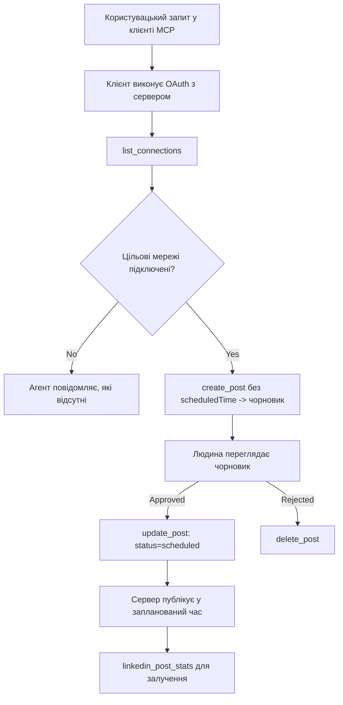

# Кейс: Публікація у соціальні мережі з агента через віддалений MCP сервер

> **Відмова від відповідальності:** Існує багато сервісів та проєктів з відкритим кодом, які можуть публікувати в соціальні мережі, а також команда може інтегрувати API кожної мережі безпосередньо. Нижче наведено один приклад роботи, який демонструє, як може бути спроєктований і використаний **віддалений MCP сервер з можливістю запису**. Publora — комерційний сервіс із безкоштовним тарифом; наведені тут шаблони застосовні до будь-якого MCP сервера, який виконує незворотні дії від імені користувача.

## Огляд

Агенти добре генерують контент, але погано його доставляють. Модель може написати анонс релізу за секунди, після чого робота припиняється: для публікації потрібен API для кожної мережі, додаток OAuth для кожної мережі та різні правила медіа для кожної з них. Більшість команд вирішують це вручну, копіюючи текст у браузер.

Цей кейс показує, як останній крок реалізувати за допомогою єдиного віддаленого MCP сервера і — що корисніше для тих, хто будує подібне — які проектні рішення має правильно реалізувати сервер з можливістю запису. Читання даних пробачає помилки. Публікація — ні: неправильний виклик інструменту видно для аудиторії і його не можна скасувати.

## Сценарій

Невелика команда розробників створює чернетки повідомлень у агенті (Claude, VS Code, Cursor — клієнт не має значення). Вони хочуть, щоб агент:

- бачив, які соціальні акаунти команда підключила,
- створював чернетки постів і зберігав їх до затвердження людиною,
- додавав зображення,
- планував публікацію у кількох мережах на обраний час,
- а згодом звітував про результати.

Важливо, що вони хочуть, щоб агент *не міг* випадково опублікувати пост під час експериментів.

## Використані інструменти

- [Publora MCP Server](https://github.com/publora/mcp-server) — віддалений MCP сервер (`streamable-http`), що надає інструменти публікації, планування, медіа та аналітики LinkedIn. Зареєстрований у офіційному MCP реєстрі як `com.publora/mcp-server`.

## Покроковий процес

1. **Підключення сервера.** Клієнти, які підтримують OAuth, проходять потік авторизації з PKCE через власний екран згоди сервера; клієнти без підтримки, наприклад headless CLI, використовують ключ API Publora в заголовку. Підтримуються обидва варіанти, і вибір залежить від клієнта, а не сервера.
2. **Перелік з'єднань.** Агент викликає `list_connections` і отримує підключені облікові записи з їхніми ідентифікаторами.
3. **Чернетка.** Агент викликає `create_post` *без* часу публікації. Пост зберігається як чернетка — нічого не публікується.
4. **Додавання медіа.** Публічні URL зображень передаються в тому ж виклику; сервер їх завантажує і перевіряє.
5. **Планування.** Після затвердження людиною `update_post` встановлює статус як запланований з часом у форматі ISO 8601.
6. **Вимірювання.** Для LinkedIn `linkedin_post_stats` повертає залучення після публікації поста.

## Приклад підказки

```text
Which social accounts do I have connected?
Draft a post announcing our new changelog page, attach the screenshot at
https://example.com/changelog.png, and keep it as a draft — do not publish it.
Once I approve, schedule it to LinkedIn and Bluesky for tomorrow at 09:00 UTC.
```

## Діаграма Mermaid



## Технічна реалізація

Уроки, наведені нижче, є переносимою частиною цього кейсу.

### Відкрите виявлення, автентифіковане виконання

`tools/list` надається без облікових даних; кожен `tools/call` вимагає токен
інакше повертає `401` з заголовком `WWW-Authenticate`, який вказує на
метадані захищеного ресурсу. У сервера є застарілий кінцевий пункт, який теж відповідає на
неавтентифікований `initialize` для клієнтів протоколу старіше за
`2026-07-28`; поточні клієнти цей обмін не використовують.

Цей розподіл, який залежить від сервера, дозволяє реєстрам, каталогам і клієнтам оглядати
назви інструментів, схеми та анотації без секрету, при цьому перешкоджає анонімному
запуску. Відкрите виявлення — це вибір розгортання, а не вимога MCP; захищене
розгортання може також вимагати авторизації для `tools/list`.

### Реєстрація: динамічна реєстрація клієнтів і що її замінює

Сервер рекламує `/.well-known/oauth-protected-resource` і `/.well-known/oauth-authorization-server`, підтримує потік авторизації з PKCE (`S256`), токени оновлення та **динамічну реєстрацію клієнтів**.

Динамічна реєстрація усунула ручний крок для застарілих клієнтів: без неї
кожен клієнт мав попередньо отримати `client_id` від постачальника.

Слід розглядати це як поведінку сумісності, а не модель для копіювання. Нова редакція специфікації 2026-07-28 знімає підтримку динамічної реєстрації на користь Документів метаданих Client ID (CIMD), де клієнт публікує метадані за стабільним HTTPS URL, і цей URL *є* `client_id`. DCR поки працює, але сервер, який розробляється зараз, має планувати CIMD і зберігати DCR лише для старіших клієнтів.

### Анотації інструментів — це не декоративний елемент

Кожен інструмент несе `title` і відповідні підказки: `readOnlyHint`, `destructiveHint`, `idempotentHint`, `openWorldHint`.

Є дві причини вкладати в них зусилля. По-перше, клієнти використовують підказки, щоб вирішити, що підтверджувати з користувачем — клієнт може автоматично виконати операцію тільки для читання і зупинитись для підтвердження перед видаленням. Специфікація чітко вказує, що анотації — це ненадійні підказки, а не механізм авторизації: вони впливають на те, що клієнт пропонує зробити, не блокують дій на сервері, і сервер самостійно застосовує свої правила. По-друге, основні каталоги конекторів тепер *вимагають* їх для перевірки; сервер без назв і підказок інструментів повернуть назад, незалежно від якості роботи.

### Зробіть ідентифікатори непередбачуваними

Ідентифікатори платформи — це непрозорі рядки, що повертаються `list_connections`, і опис схеми чітко каже, що їх слід копіювати дослівно, а не вгадувати. Сервер відкидає все інше.

Моделі вправні в вигадуванні. Будь-який сервер із можливістю запису має припускати, що ідентифікатор рано чи пізно буде вигаданий неправильно, і цей шлях має завершитись гучною і ранньою помилкою, а не виконанням дії за правдоподібним значенням.

### Помилки до публікації з зрозумілим повідомленням

Деякі мережі відмовляють у публікації текстових постів без зображення або відео. Це перевіряється під час планування, і помилка повідомляє платформу і відсутню вимогу.

Агент може відновитися після повідомлення "Instagram вимагає медіа — додайте зображення або відео" без повторного запиту. Він не може відновитись після загальної помилки `400`.

### Робіть повторні спроби безпечними

Два інструменти для створення контенту, `create_post` і `update_post`, приймають ключ ідемпотентності: повторне використання з однаковим запитом відтворює оригінальну відповідь замість створення другого поста. Середовища виконання агента повторюють запити при тайм-аутах; без ідемпотентності повільна відповідь стає дублюючою публікацією. Інші інструменти запису — видалення, медіа, реакції і коментарі LinkedIn — такого ключа не мають, тому повторна спроба там не є автоматично безпечною. Варто знати, які ваші зміни захищені, а які ні.

### Забезпечте можливість тестування без публікації


Сервер приймає зарезервовану ціль `publora-playground`, яка перевіряється та визнається як реальна ціль, а потім ігнорується — нічого не доходить до живого акаунту. Вона описана у схемі інструменту, яку будь-який клієнт може прочитати без облікових даних: поле `platforms` у `create_post` документує її як "ціль тесту підключення, що не потребує реального підключення — допис визнається і відкидається, нічого не публікується". Викличте її, передавши як єдиний запис: `platforms: ["publora-playground"]`.

Виявилося, що це одна з найкорисніших детелей на всій поверхні. Рецензенти каталогів конекторів, учасники та CI можуть повністю відпрацювати шлях запису від початку до кінця без ризику для реальної аудиторії. Будь-який сервер MCP з необоротними діями отримує вигоду від задокументованої цілі без операцій.

## Результати та вплив

- Крок публікації перемістився з браузера до тієї ж розмови, де створюється контент, а звичка до чернеток зберігає участь людини. Будьте точними у визначенні: чернетка — це домовленість, а не межа. Ті самі облікові дані можуть планувати або публікувати, тож будь-хто, хто потребує справжнього затвердження, повинен реалізувати це поза поверхнею інструменту — окремі облікові дані або політика перед сервером.
- Відмінності між мережами — вимоги до медіа, нитка повідомлень, керування відповідями — опрацьовуються один раз на сервері, а не в кожному агента, що з ним спілкується.
- Той самий сервер підтримує декілька клієнтів MCP без попередньо виданих облікових даних.
    Поточні клієнти можуть використовувати документи метаданих Client ID; DCR залишається запасним варіантом
    для старіших клієнтів.
- Вищезгадані обмеження проєктування формувалися як від рецензій каталогу конекторів, так і від користувачів: анотації, OAuth і безпечна тестова ціль були необхідні принаймні одному з них.

## Посилання

- [Servidor Publora MCP (джерело)](https://github.com/publora/mcp-server)
- [API та документація MCP Publora](https://docs.publora.com)
- [Запис у реєстр MCP: `com.publora/mcp-server`](https://registry.modelcontextprotocol.io/v0/servers?search=com.publora/mcp-server)
- [Специфікація MCP — Авторизація](https://modelcontextprotocol.io/specification/2026-07-28/basic/authorization)
- [Специфікація MCP — Анотації інструментів](https://modelcontextprotocol.io/docs/concepts/tools)

## Що далі

- Візьміть сервер MCP, який ви розробляєте, і перевірте три найпростіші удосконалення тут: анотації для кожного інструменту, ключ ідемпотентності для кожного запису та задокументовану ціль без операцій.
- Спробуйте розділення відкритого виявлення: викличте `tools/list` до публічного віддаленого сервера без облікових даних, а потім викличте інструмент і дослідіть виклик `401`.
- Розгляньте, що означає "відмінити" у вашій доменній області. Публікація має чернетки і вилучення; якщо ваших дій немає еквіваленту, підтвердження належить у дизайні інструменту, а не у запиті.

---

<!-- CO-OP TRANSLATOR DISCLAIMER START -->
**Відмова від відповідальності**:
Цей документ було перекладено за допомогою сервісу штучного інтелекту для перекладу [Co-op Translator](https://github.com/Azure/co-op-translator). Хоча ми прагнемо до точності, будь ласка, майте на увазі, що автоматичні переклади можуть містити помилки або неточності. Оригінальний документ рідною мовою слід вважати авторитетним джерелом. Для критично важливої інформації рекомендується професійний людський переклад. Ми не несемо відповідальності за будь-які непорозуміння або неправильні тлумачення, що виникли внаслідок використання цього перекладу.
<!-- CO-OP TRANSLATOR DISCLAIMER END -->