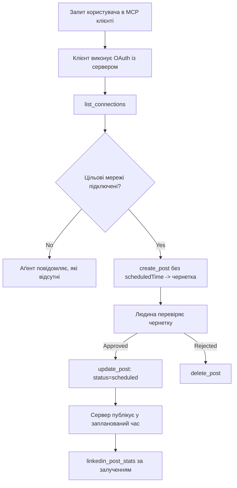

# Кейсове дослідження: Публікація в соціальні мережі через агента з віддаленим MCP сервером

> **Відмова від відповідальності:** Існує кілька сервісів і проєктів з відкритим кодом, які можуть публікувати в соціальні мережі, і команда також могла б безпосередньо інтегрувати API кожної мережі. Нижченаведений сценарій поданий як один з прикладів того, як може бути розроблений і використаний **віддалений MCP сервер з можливістю запису**. Publora — це комерційний сервіс з безплатним тарифом; описані тут патерни застосовні до будь-якого MCP сервера, який виконує незворотні дії від імені користувача.

## Огляд

Агенти гарні у створенні чернеток контенту, але погані у доставці. Модель може за секунди написати анонс випуску, і робота припиняється: публікація означає API для кожної мережі, OAuth додаток для кожної мережі та різний набір правил для медіа кожної з них. Більшість команд вирішують це копіюванням тексту вручну в браузер.

У цьому кейсовому дослідженні розглядається, як цей останній крок можна закрити одним віддаленим MCP сервером, і — що корисніше для тих, хто його розробляє — як слід правильно визначити дизайн **сервера з можливістю запису**. Зчитування даних пробачає помилки. Публікація — ні: неправильний виклик інструменту видимий аудиторії і не може бути скасований.

## Сценарій

Невелика команда підтримки розробників створює чернетки постів всередині агента (Claude, VS Code, Cursor — клієнт не має значення). Вони хочуть, щоб агент міг:

- бачити, які соціальні акаунти команда підключила,
- створювати чернетку посту і зберігати її для схвалення людиною,
- додавати зображення,
- планувати публікацію для кількох мереж у вибраний час,
- а потім звітувати про його ефективність.

Ключовим є те, що агент *не повинен* випадково публікувати поки команда експериментує.

## Використані інструменти

- [Publora MCP Server](https://github.com/publora/mcp-server) — віддалений MCP сервер (`streamable-http`), який пропонує інструменти для публікації, планування, роботи з медіа і аналітики LinkedIn. Зареєстрований в офіційному реєстрі MCP як `com.publora/mcp-server`.

## Покроковий робочий процес

1. **Підключення сервера.** Клієнти з OAuth проходять потік авторизації з кодом та PKCE через екран згоди сервера; клієнти без OAuth, наприклад безголові CLI, використовують ключ API Publora в заголовку. Обидва варіанти підтримуються, вибір залежить від клієнта, а не від сервера.
2. **Перелік підключень.** Агент виконує `list_connections` і отримує підключені акаунти з їх ідентифікаторами.
3. **Створення чернетки.** Агент виконує `create_post` *без* часу планування. Пост зберігається як чернетка — нічого не публікується.
4. **Додавання медіа.** Публічні URL зображень передаються в тому самому виклику; сервер завантажує і перевіряє їх.
5. **Планування.** Після схвалення людиною, `update_post` встановлює статус як запланований з часом у форматі ISO 8601.
6. **Вимірювання.** Для LinkedIn `linkedin_post_stats` повертає дані про взаємодію, коли пост активний.

## Приклад підказки

```text
Which social accounts do I have connected?
Draft a post announcing our new changelog page, attach the screenshot at
https://example.com/changelog.png, and keep it as a draft — do not publish it.
Once I approve, schedule it to LinkedIn and Bluesky for tomorrow at 09:00 UTC.
```

## Діаграма Mermaid



## Технічна реалізація

Нижче наведені уроки — переносима частина цього кейсу.

### Відкрите виявлення, автентифіковане виконання

`tools/list` доступний без облікових даних; кожен `tools/call` вимагає токен інакше повертає `401` з заголовком `WWW-Authenticate`, який посилається на метадані захищеного ресурсу. (Сервер також відповідає неавтентифікованому `initialize`, що важливо лише для клієнтів протоколів до `2026-07-28`; ця версія протоколу прибрала рукопотискання зовсім.)

Такий поділ має значення на практиці. Реєстри, каталоги та клієнти можуть інспектувати інструменти — назви, схеми, анотації — без секретів, натомість ніякі дії не можуть бути *виконані* анонімно. Сервер, що вимагає токен для `initialize`, фактично невидимий для інструментів; сервер, який дозволяє анонімний `tools/call`, створює ризик.

### Реєстрація: динамічна реєстрація клієнтів і що її замінює

Сервер рекламує `/.well-known/oauth-protected-resource` і `/.well-known/oauth-authorization-server`, підтримує потік авторизації коду з PKCE (`S256`), refresh tokens і **динамічну реєстрацію клієнтів**.

Динамічна реєстрація позбавляє вручну потрібного кроку: без неї кожному клієнту потрібен попередньо виданий `client_id`, що означає поза кадром запит до постачальника для кожного нового клієнта.

Слід розглядати це як сумісність, а не як зразок для копіювання. Версія специфікації від `2026-07-28` відмовляється від динамічної реєстрації на користь Документів метаданих Client ID, коли клієнт публікує метадані на стабільному HTTPS URL, і цей URL *є* `client_id`. DCR поки працює, але сервер, що сьогодні будується, має планувати підтримку CIMD і залишати DCR лише для старих клієнтів.

### Анотації інструментів — це не декорація

Кожен інструмент має `title` і відповідні підказки: `readOnlyHint`, `destructiveHint`, `idempotentHint`, `openWorldHint`.

Є дві причини їх застосування. По-перше, клієнти використовують підказки, щоб вирішити, що підтверджувати з користувачем — клієнт може автоматично виконати читання і зупинитись на видаленні для підтвердження. Специфікація чітко каже, що анотації — це ненадійні підказки, а не механізм авторизації: вони визначають, що клієнт пропонує зробити, але нічого не зупиняють на сервері, сервер все одно повинен свої правила застосовувати. По-друге, головні каталоги конекторів тепер *вимагають* анотацій для перегляду; сервер без них повернуть назад, незалежно від якості роботи.

### Зробіть ідентифікатори невинахідливими

Ідентифікатори платформи — це непрозорі рядки, які повертає `list_connections`, і схема чітко каже, що їх треба копіювати дослівно, ніколи не вгадувати. Сервер відкидає все інше.

Моделі вміють “вгадувати”. Будь-який сервер із можливістю запису має припускати, що ідентифікатор рано чи пізно буде вигаданий, і цю спробу треба одразу гучно відхилити, а не діяти згідно з вірогідним значенням.

### Відмовляти перед публікацією, з повідомленням для дії

Деякі мережі відмовляються приймати чисто текстові пости і вимагають зображення чи відео. Це перевіряється при плануванні, а помилка повідомляє платформу і відсутню вимогу.

Агент може відновитись після повідомлення "Instagram вимагає медіа — додайте зображення або відео" без додаткового кола. Він не може відновитися після загального `400`.

### Зробіть повторні спроби безпечними

Два інструменти, які створюють контент — `create_post` і `update_post` — приймають ключ ідемпотентності: повторне використання цього ключа з ідентичним запитом повертає початкову відповідь замість створення другого посту. Середовища роботи агентів роблять повторні спроби при тайм-аутах; без ідемпотентності повільна відповідь стає дублікатом. Інші інструменти запису — видалення, кроки з медіа, реакції і коментарі LinkedIn — не приймають ключ, тому повтор на них не автоматично безпечний. Варто знати, які мутації власні захищені, а які ні.

### Забезпечте спосіб тестувати без публікації

Сервер приймає зарезервовану ціль `publora-playground`, яка перевіряється і підтверджується як реальна, а потім відхиляється — нічого не доходить до живого акаунта. Це описане в самій схемі інструменту, всі клієнти можуть читати його без облікових даних: поле `platforms` в `create_post` описує це як "ціль тестування з'єднання, що не потребує реального з'єднання — пост приймається і відхиляється, нічого не публікується". Викликайте це, передаючи єдиний запис: `platforms: ["publora-playground"]`.

Це виявилося однією з найкорисніших деталей усієї поверхні. Оглядачі каталогів конекторів, контриб’ютори і CI можуть повністю проходити шлях запису від початку до кінця без ризику для реальної аудиторії. Будь-який MCP сервер з незворотними діями виграє від документованої цілі, яка нічого не робить.

## Результати та вплив

- Крок публікації перемістився з браузера в ту ж розмову, де пишеться контент, і звичка починати з чернетки тримає людину в циклі. Будьте точні у тому, що таке чернетка: це домовленість, а не межа. Ті ж облікові дані можуть планувати чи публікувати, тому справжній шлюз схвалення потрібно забезпечувати поза інструментальною поверхнею — окремі облікові дані чи політика перед сервером.
- Відмінності по мережах — вимоги до медіа, теми, керування відповідями — обробляються один раз у сервері, а не в кожному агенті, що з ним працює.
- Один сервер підтримує кілька MCP клієнтів без роботи з кожним окремо, бо виявлення відкриті, а реєстрація — динамічна.
- Вищезазначені конструктивні обмеження сформувалися як під час огляду каталогів конекторів, так і під впливом користувачів: анотації, OAuth і безпечна тестова ціль були необхідні хоча б одному з них.

## Посилання

- [Publora MCP Server (джерело)](https://github.com/publora/mcp-server)
- [Документація API і MCP Publora](https://docs.publora.com)
- [Запис у реєстрі MCP: `com.publora/mcp-server`](https://registry.modelcontextprotocol.io/v0/servers?search=com.publora/mcp-server)
- [Специфікація MCP — Авторизація](https://modelcontextprotocol.io/specification/draft/basic/authorization)
- [Специфікація MCP — Анотації інструментів](https://modelcontextprotocol.io/docs/concepts/tools)

## Що далі

- Візьміть MCP сервер, який ви розробляєте, і перевірте три найдоступніших покращення тут: анотації для кожного інструменту, ключ ідемпотентності для кожного запису і документовану тестову ціль без дій.
- Спробуйте поділ відкритого виявлення: викличте `tools/list` до публічного віддаленого сервера без облікових даних, потім викличте інструмент і перегляньте `401` відповідь.
- Розгляньте, що означає "скасування" для вашої сфери. Публікація має чернетки і видалення; якщо у ваших дій немає рівнозначного, підтвердження має бути в дизайні інструменту, не в підказці.

---

<!-- CO-OP TRANSLATOR DISCLAIMER START -->
**Відмова від відповідальності**:
Цей документ було перекладено за допомогою сервісу штучного інтелекту для перекладу [Co-op Translator](https://github.com/Azure/co-op-translator). Хоча ми прагнемо до точності, будь ласка, майте на увазі, що автоматичні переклади можуть містити помилки або неточності. Оригінальний документ рідною мовою слід вважати авторитетним джерелом. Для критично важливої інформації рекомендується професійний людський переклад. Ми не несемо відповідальності за будь-які непорозуміння або неправильні тлумачення, що виникли внаслідок використання цього перекладу.
<!-- CO-OP TRANSLATOR DISCLAIMER END -->