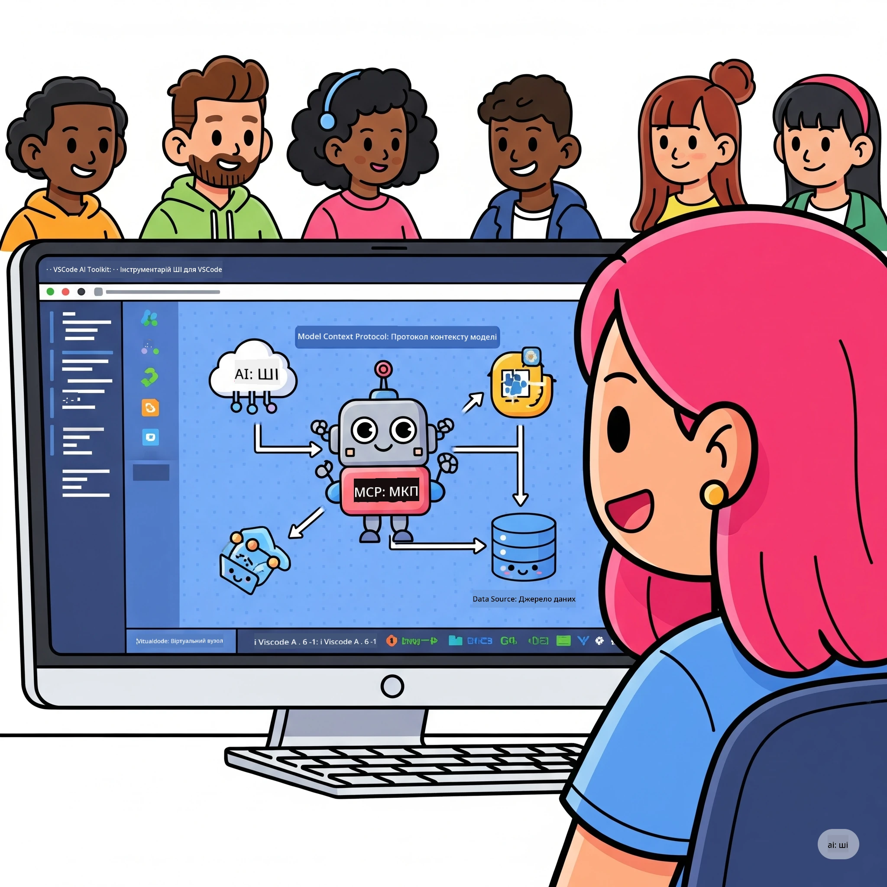
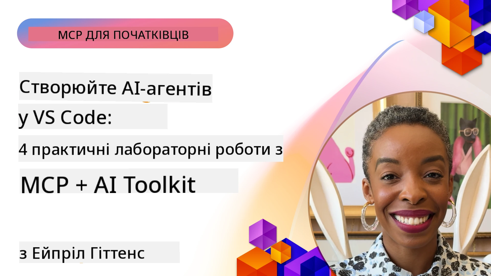

# Оптимізація робочих процесів ШІ: Створення серверу MCP за допомогою Microsoft Foundry Toolkit

## 🎯 Огляд

_(Натисніть на зображення вище, щоб переглянути відео цього уроку)_

Ласкаво просимо на **Практичний семінар Model Context Protocol (MCP)**! Цей комплексний практичний курс поєднує дві передові технології для революції у розробці застосунків штучного інтелекту:

> **Примітка сумісності:** код семінару було створено та протестовано з MCP
> `2025-11-25`, як показано на значку вище. Використовуйте
> [поточну специфікацію `2026-07-28`](https://modelcontextprotocol.io/specification/2026-07-28/)
> для нових імплементацій протоколу та переглядайте нотатки до випуску SDK перед
> міграцією лабораторних робіт.

- **🔗 Model Context Protocol (MCP)**: Відкритий стандарт для безшовної інтеграції інструментів ШІ
- **🛠️ Розширення Microsoft Foundry Toolkit для VS Code**: Потужне розширення Microsoft для розробки ШІ

### 🎓 Чому ви навчитеся

Наприкінці цього семінару ви здобудете майстерність у створенні інтелектуальних застосунків, що поєднують моделі ШІ з реальними інструментами та сервісами. Від автоматизованого тестування до власної інтеграції API — ви отримаєте практичні навички для розв’язання складних бізнес-завдань.

## 🏗️ Технологічний стек

### 🔌 Model Context Protocol (MCP)

MCP — це **"USB-C для ШІ"** — універсальний стандарт, що з'єднує моделі ШІ з зовнішніми інструментами та джерелами даних.

**✨ Основні характеристики:**

- 🔄 **Стандартизована інтеграція**: Універсальний інтерфейс для підключення інструментів ШІ
- 🏛️ **Гнучка архітектура**: Локальні та віддалені сервери через stdio/SSE транспорт
- 🧰 **Багатий екосистем**: Інструменти, підказки та ресурси в одному протоколі
- 🔒 **Готовність для підприємств**: Вбудована безпека та надійність

**🎯 Чому MCP важливий:**
Так само, як USB-C ліквідував хаос із кабелями, MCP усуває складність інтеграції ШІ. Один протокол — безмежні можливості.

### 🤖 Розширення Microsoft Foundry Toolkit для VS Code

Флагманське розширення Microsoft для розробки ШІ, яке перетворює VS Code на потужний інструмент ШІ.

**🚀 Основні можливості:**

- 📦 **Каталог моделей**: Доступ до моделей від Azure AI, GitHub, Hugging Face, Ollama
- ⚡ **Локальний висновок**: Оптимізоване виконання ONNX на CPU/GPU/NPU
- 🏗️ **Конструктор агентів**: Візуальна розробка агентів ШІ з інтеграцією MCP
- 🎭 **Мультимодальність**: Підтримка тексту, зображень та структурованого виводу

**💡 Переваги розробки:**

- Розгортання моделей без конфігурації
- Візуальна Інженерія підказок
- Пісочниця для тестів у реальному часі
- Безшовна інтеграція серверу MCP

## 📚 Навчальна програма

### [🚀 Модуль 1: Основи Microsoft Foundry Toolkit](./lab1/README.md)

**Тривалість**: 15 хвилин

- 🛠️ Встановлення та налаштування Microsoft Foundry Toolkit для VS Code
- 🗂️ Ознайомлення з Каталогом моделей (понад 100 моделей з GitHub, ONNX, OpenAI, Anthropic, Google)
- 🎮 Освоєння інтерактивного майданчику для тестування моделей у реальному часі
- 🤖 Створення першого агента ШІ за допомогою Agent Builder
- 📊 Оцінка продуктивності моделей за допомогою вбудованих метрик (F1, релевантність, схожість, узгодженість)
- ⚡ Вивчення пакетної обробки та мультимодальної підтримки

**🎯 Результат навчання**: Створення функціонального агента ШІ з повним розумінням можливостей Microsoft Foundry Toolkit

### [🌐 Модуль 2: MCP з Microsoft Foundry Toolkit Fundamentals](./lab2/README.md)

**Тривалість**: 20 хвилин

- 🧠 Засвоєння архітектури та концепцій Model Context Protocol (MCP)
- 🌐 Ознайомлення з екосистемою серверів MCP від Microsoft
- 🤖 Створення браузерного агента автоматизації за допомогою Playwright MCP серверу
- 🔧 Інтеграція серверів MCP з Agent Builder Microsoft Foundry Toolkit
- 📊 Налаштування та тестування інструментів MCP у ваших агентах
- 🚀 Експорт і розгортання агентів на базі MCP для використання у виробництві

**🎯 Результат навчання**: Розгортання агента ШІ, оснащеного зовнішніми інструментами через MCP

### [🔧 Модуль 3: Поглиблена розробка MCP з Microsoft Foundry Toolkit](./lab3/README.md)

**Тривалість**: 20 хвилин

- 💻 Створення власних серверів MCP за допомогою Microsoft Foundry Toolkit
- 🐍 Налаштування та використання останньої версії MCP Python SDK (v1.9.3)
- 🔍 Налаштування та використання MCP Inspector для налагодження
- 🛠️ Розробка Weather MCP Server з професійними робочими процесами налагодження
- 🧪 Налагодження серверів MCP у середовищах Agent Builder та Inspector

**🎯 Результат навчання**: Розробка та налагодження власних MCP серверів із сучасними інструментами

### [🐙 Модуль 4: Практична розробка MCP - користувацький сервер GitHub Clone](./lab4/README.md)

**Тривалість**: 30 хвилин

- 🏗️ Побудова реального MCP серверу GitHub Clone для робочих процесів розробки
- 🔄 Реалізація розумного клонування репозиторіїв з валідацією та обробкою помилок
- 📁 Створення інтелектуального управління директоріями та інтеграція з VS Code
- 🤖 Використання режиму агента GitHub Copilot з користувацькими інструментами MCP
- 🛡️ Застосування надійності, готової до виробництва, та кросплатформної сумісності

**🎯 Результат навчання**: Розгортання готового до виробництва MCP серверу, що оптимізує реальні робочі процеси розробки

## 💡 Реальні застосування та вплив

### 🏢 Випадки використання в підприємствах

#### 🔄 Автоматизація DevOps

Трансформуйте ваш робочий процес розробки за допомогою інтелектуальної автоматизації:

- **Інтелектуальне управління репозиторіями**: Автоматизований огляд коду та рішення про злиття з ШІ
- **Інтелектуальний CI/CD**: Автоматична оптимізація пайплайнів на основі змін у коді
- **Тріаж задач**: Автоматична класифікація та призначення помилок

#### 🧪 Революція в забезпеченні якості

Покращуйте тестування за допомогою автоматизації на базі ШІ:

- **Інтелектуальне генерування тестів**: Автоматичне створення комплексних тестових наборів
- **Візуальне регресійне тестування**: Виявлення змін у UI за допомогою ШІ
- **Моніторинг продуктивності**: Проактивне виявлення та усунення проблем

#### 📊 Інтелектуальні потоки обробки даних

Побудуйте розумніші робочі процеси обробки даних:

- **Адаптивні ETL-процеси**: Самооптимізовані трансформації даних
- **Виявлення аномалій**: Моніторинг якості даних у реальному часі
- **Інтелектуальна маршрутизація**: Розумне керування потоками даних

#### 🎧 Покращення досвіду клієнтів

Створюйте виняткові взаємодії з клієнтами:

- **Підтримка з урахуванням контексту**: Агенти ШІ з доступом до історії клієнтів
- **Проактивне розв’язання проблем**: Прогнозуюче обслуговування клієнтів
- **Мультиканальна інтеграція**: Єдиний досвід ШІ на різних платформах

## 🛠️ Вимоги та налаштування

### 💻 Системні вимоги

| Компонент | Вимога | Примітки |
|-----------|-------------|-------|
| **Операційна система** | Windows 10+, macOS 10.15+, Linux | Будь-яка сучасна ОС |
| **Visual Studio Code** | Остання стабільна версія | Потрібно для Microsoft Foundry Toolkit |
| **Node.js** | v18.0+ і npm | Для розробки серверів MCP |
| **Python** | 3.10+ | Опційно для серверів MCP на Python |
| **Оперативна пам’ять** | Мінімум 8 ГБ ОЗП | Рекомендовано 16 ГБ для локальних моделей |

### 🔧 Середовище розробки

#### Рекомендовані розширення для VS Code

- **Microsoft Foundry Toolkit** (ms-windows-ai-studio.windows-ai-studio)
- **Python** (ms-python.python)
- **Python Debugger** (ms-python.debugpy)
- **GitHub Copilot** (GitHub.copilot) - Опційно, але корисно

#### Опціональні інструменти

- **uv**: Сучасний менеджер пакунків Python
- **MCP Inspector**: Візуальний інструмент налагодження для серверів MCP
- **Playwright**: Для прикладів автоматизації вебу

## 🎖️ Результати навчання та шлях сертифікації

### 🏆 Контрольний список навичок

Завершуючи цей семінар, ви оволодієте:

#### 🎯 Основні компетенції

- [ ] **Майстерність протоколу MCP**: Глибоке розуміння архітектури та патернів реалізації
- [ ] **Знання Microsoft Foundry Toolkit**: Експертне використання Microsoft Foundry Toolkit для швидкої розробки
- [ ] **Розробка власних серверів**: Створення, розгортання та підтримка MCP серверів у виробництві
- [ ] **Відмінність у інтеграції інструментів**: Безшовне підключення ШІ до існуючих робочих процесів розробки
- [ ] **Застосування навичок для вирішення задач**: Застосування отриманих навичок для реальних бізнес-викликів

#### 🔧 Технічні навички

- [ ] Встановлення та налаштування Microsoft Foundry Toolkit у VS Code
- [ ] Проектування та розробка власних серверів MCP
- [ ] Інтеграція моделей GitHub з архітектурою MCP
- [ ] Створення автоматизованих робочих процесів тестування за допомогою Playwright
- [ ] Розгортання агентів ШІ для виробничого використання
- [ ] Налагодження та оптимізація продуктивності серверів MCP

#### 🚀 Додаткові можливості

- [ ] Проектування корпоративних інтеграцій ШІ
- [ ] Впровадження найкращих практик безпеки для застосунків ШІ
- [ ] Проектування масштабованих архітектур серверів MCP
- [ ] Створення користувацьких ланцюжків інструментів для специфічних доменів
- [ ] Наставництво в сфері розробки AI-native

## 📖 Додаткові ресурси

- [MCP Specification (2026-07-28)](https://modelcontextprotocol.io/specification/2026-07-28/)
- [Microsoft Foundry Toolkit GitHub Repository](https://github.com/microsoft/vscode-ai-toolkit)
- [Sample MCP Servers Collection](https://github.com/modelcontextprotocol/servers)
- [Best Practices Guide](https://modelcontextprotocol.io/docs/best-practices)
- [OWASP MCP Top 10](https://microsoft.github.io/mcp-azure-security-guide/mcp/) - Найкращі практики безпеки

---

**🚀 Готові революціонізувати свій робочий процес розробки ШІ?**

Давайте разом створювати майбутнє інтелектуальних застосунків з MCP та Microsoft Foundry Toolkit!

## Що далі

Продовжуйте з: [Модуль 11: Практичні лабораторні з MCP Server](../11-MCPServerHandsOnLabs/README.md)

---

<!-- CO-OP TRANSLATOR DISCLAIMER START -->
**Відмова від відповідальності**:
Цей документ було перекладено за допомогою сервісу штучного інтелекту для перекладу [Co-op Translator](https://github.com/Azure/co-op-translator). Хоча ми прагнемо до точності, будь ласка, майте на увазі, що автоматичні переклади можуть містити помилки або неточності. Оригінальний документ рідною мовою слід вважати авторитетним джерелом. Для критично важливої інформації рекомендується професійний людський переклад. Ми не несемо відповідальності за будь-які непорозуміння або неправильні тлумачення, що виникли внаслідок використання цього перекладу.
<!-- CO-OP TRANSLATOR DISCLAIMER END -->