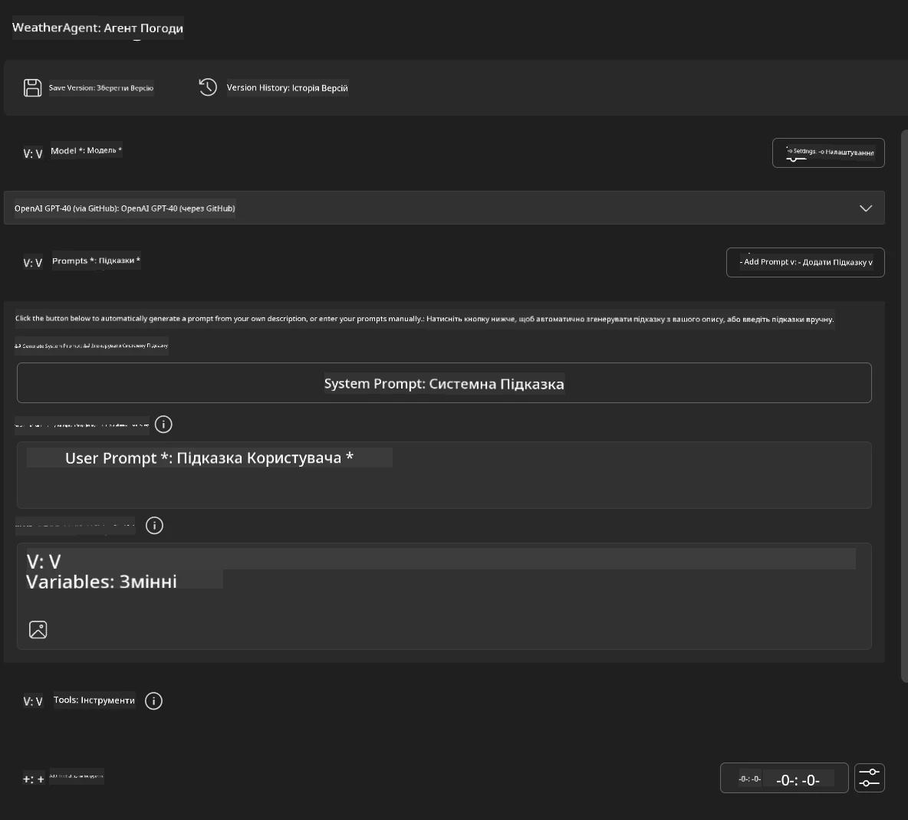
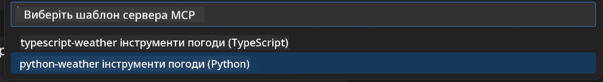
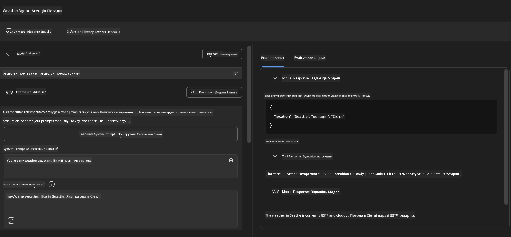
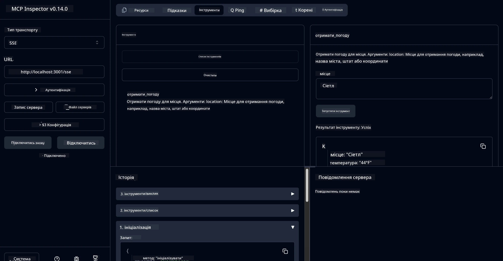

# 🔧 Модуль 3: Поглиблена розробка MCP з Microsoft Foundry Toolkit

> [!NOTE]
> URL-адреси Інспектора в цій лабораторній роботі використовують застарілий `/sse` кінцевий пункт і націлені на
> зафіксовані залежності MCP SDK `1.9.3` та Inspector `0.14.0`. Вони не є
> актуальними прикладами Streamable HTTP від `2026-07-28`.


## 🎯 Навчальні цілі

По завершенню цієї лабораторної роботи ви зможете:

- ✅ Створювати власні MCP сервери за допомогою Microsoft Foundry Toolkit
- ✅ Налаштовувати та використовувати останню версію MCP Python SDK (v1.9.3)
- ✅ Налагоджувати MCP Inspector для відлагодження
- ✅ Відлагоджувати MCP сервери як у середовищі Agent Builder, так і Inspector
- ✅ Розуміти просунуті робочі процеси розробки MCP серверів

## 📋 Необхідні умови

- Завершення Лабораторної роботи 2 (Основи MCP)
- VS Code із встановленим розширенням Microsoft Foundry Toolkit
- Середовище Python 3.10+
- Node.js та npm для налаштування Inspector

## 🏗️ Що ви створите

У цій лабораторній роботі ви створите **Weather MCP Server**, який демонструє:
- Власну реалізацію MCP сервера
- Інтеграцію з Microsoft Foundry Toolkit Agent Builder
- Професійні робочі процеси відлагодження
- Сучасні шаблони використання MCP SDK

---

## 🔧 Огляд основних компонентів

### 🐍 MCP Python SDK
Model Context Protocol Python SDK забезпечує основу для створення власних MCP серверів. Ви використовуватимете версію 1.9.3 із покращеними можливостями відлагодження.

### 🔍 MCP Inspector
Потужний інструмент відлагодження, який надає:
- Моніторинг сервера в реальному часі
- Візуалізацію виконання інструментів
- Інспекцію запитів/відповідей мережі
- Інтерактивне тестове середовище

---

## 📖 Покрокова реалізація

### Крок 1: Створіть WeatherAgent в Agent Builder

1. **Запустіть Agent Builder** у VS Code через розширення Microsoft Foundry Toolkit
2. **Створіть нового агента** з такою конфігурацією:
   - Назва агента: `WeatherAgent`



### Крок 2: Ініціалізуйте проект MCP Server

1. **Перейдіть до Tools** → **Add Tool** в Agent Builder
2. **Виберіть "MCP Server"** із доступних опцій
3. **Виберіть "Create A new MCP Server"**
4. **Виберіть шаблон `python-weather`**
5. **Назвіть свій сервер:** `weather_mcp`



### Крок 3: Відкрийте та перегляньте проект

1. **Відкрийте згенерований проект** у VS Code
2. **Перевірте структуру проекту:**
   ```
   weather_mcp/
   ├── src/
   │   ├── __init__.py
   │   └── server.py
   ├── inspector/
   │   ├── package.json
   │   └── package-lock.json
   ├── .vscode/
   │   ├── launch.json
   │   └── tasks.json
   ├── pyproject.toml
   └── README.md
   ```

### Крок 4: Оновлення до останньої версії MCP SDK

> **🔍 Чому оновлювати?** Ми хочемо використовувати останню версію MCP SDK (v1.9.3) та сервіс Inspector (0.14.0) для розширених функцій і кращих можливостей налагодження.

#### 4a. Оновлення залежностей Python

**Редагуйте `pyproject.toml`:** оновлення [./code/weather_mcp/pyproject.toml](../../../../10-StreamliningAIWorkflowsBuildingAnMCPServerWithAIToolkit/lab3/code/weather_mcp/pyproject.toml)


#### 4b. Оновіть конфігурацію Inspector

**Редагуйте `inspector/package.json`:** оновлення [./code/weather_mcp/inspector/package.json](../../../../10-StreamliningAIWorkflowsBuildingAnMCPServerWithAIToolkit/lab3/code/weather_mcp/inspector/package.json)

#### 4c. Оновіть залежності Inspector

**Редагуйте `inspector/package-lock.json`:** оновлення [./code/weather_mcp/inspector/package-lock.json](../../../../10-StreamliningAIWorkflowsBuildingAnMCPServerWithAIToolkit/lab3/code/weather_mcp/inspector/package-lock.json)

> **📝 Примітка:** Цей файл містить докладні визначення залежностей. Нижче наведена основна структура - повний вміст забезпечує правильне розв’язання залежностей.


> **⚡ Повний лок пакету:** Повний package-lock.json містить близько 3000 рядків визначень залежностей. Вищенаведено ключову структуру - використовуйте наданий файл для повного розв’язання залежностей.

### Крок 5: Налаштуйте налагодження у VS Code

*Примітка: Будь ласка, скопіюйте файл у заданому шляху, щоб замінити відповідний локальний файл*

#### 5a. Оновіть конфігурацію запуску

**Редагуйте `.vscode/launch.json`:**

```json
{
  "version": "0.2.0",
  "configurations": [
    {
      "name": "Attach to Local MCP",
      "type": "debugpy",
      "request": "attach",
      "connect": {
        "host": "localhost",
        "port": 5678
      },
      "presentation": {
        "hidden": true
      },
      "internalConsoleOptions": "neverOpen",
      "postDebugTask": "Terminate All Tasks"
    },
    {
      "name": "Launch Inspector (Edge)",
      "type": "msedge",
      "request": "launch",
      "url": "http://localhost:6274?timeout=60000&serverUrl=http://localhost:3001/sse#tools",
      "cascadeTerminateToConfigurations": [
        "Attach to Local MCP"
      ],
      "presentation": {
        "hidden": true
      },
      "internalConsoleOptions": "neverOpen"
    },
    {
      "name": "Launch Inspector (Chrome)",
      "type": "chrome",
      "request": "launch",
      "url": "http://localhost:6274?timeout=60000&serverUrl=http://localhost:3001/sse#tools",
      "cascadeTerminateToConfigurations": [
        "Attach to Local MCP"
      ],
      "presentation": {
        "hidden": true
      },
      "internalConsoleOptions": "neverOpen"
    }
  ],
  "compounds": [
    {
      "name": "Debug in Agent Builder",
      "configurations": [
        "Attach to Local MCP"
      ],
      "preLaunchTask": "Open Agent Builder",
    },
    {
      "name": "Debug in Inspector (Edge)",
      "configurations": [
        "Launch Inspector (Edge)",
        "Attach to Local MCP"
      ],
      "preLaunchTask": "Start MCP Inspector",
      "stopAll": true
    },
    {
      "name": "Debug in Inspector (Chrome)",
      "configurations": [
        "Launch Inspector (Chrome)",
        "Attach to Local MCP"
      ],
      "preLaunchTask": "Start MCP Inspector",
      "stopAll": true
    }
  ]
}
```

**Редагуйте `.vscode/tasks.json`:**

```
{
  "version": "2.0.0",
  "tasks": [
    {
      "label": "Start MCP Server",
      "type": "shell",
      "command": "python -m debugpy --listen 127.0.0.1:5678 src/__init__.py sse",
      "isBackground": true,
      "options": {
        "cwd": "${workspaceFolder}",
        "env": {
          "PORT": "3001"
        }
      },
      "problemMatcher": {
        "pattern": [
          {
            "regexp": "^.*$",
            "file": 0,
            "location": 1,
            "message": 2
          }
        ],
        "background": {
          "activeOnStart": true,
          "beginsPattern": ".*",
          "endsPattern": "Application startup complete|running"
        }
      }
    },
    {
      "label": "Start MCP Inspector",
      "type": "shell",
      "command": "npm run dev:inspector",
      "isBackground": true,
      "options": {
        "cwd": "${workspaceFolder}/inspector",
        "env": {
          "CLIENT_PORT": "6274",
          "SERVER_PORT": "6277",
        }
      },
      "problemMatcher": {
        "pattern": [
          {
            "regexp": "^.*$",
            "file": 0,
            "location": 1,
            "message": 2
          }
        ],
        "background": {
          "activeOnStart": true,
          "beginsPattern": "Starting MCP inspector",
          "endsPattern": "Proxy server listening on port"
        }
      },
      "dependsOn": [
        "Start MCP Server"
      ]
    },
    {
      "label": "Open Agent Builder",
      "type": "shell",
      "command": "echo ${input:openAgentBuilder}",
      "presentation": {
        "reveal": "never"
      },
      "dependsOn": [
        "Start MCP Server"
      ],
    },
    {
      "label": "Terminate All Tasks",
      "command": "echo ${input:terminate}",
      "type": "shell",
      "problemMatcher": []
    }
  ],
  "inputs": [
    {
      "id": "openAgentBuilder",
      "type": "command",
      "command": "ai-mlstudio.agentBuilder",
      "args": {
        "initialMCPs": [ "local-server-weather_mcp" ],
        "triggeredFrom": "vsc-tasks"
      }
    },
    {
      "id": "terminate",
      "type": "command",
      "command": "workbench.action.tasks.terminate",
      "args": "terminateAll"
    }
  ]
}
```


---

## 🚀 Запуск і тестування вашого MCP сервера

### Крок 6: Встановіть залежності

Після внесення змін у конфігурацію виконайте наступні команди:

**Встановлення залежностей Python:**
```bash
uv sync
```

**Встановлення залежностей Inspector:**
```bash
cd inspector
npm install
```

### Крок 7: Відлагоджування з Agent Builder

1. **Натисніть F5** або використайте конфігурацію **"Debug in Agent Builder"**
2. **Обрати компаунд конфігурацію** з панелі налагодження
3. **Зачекайте, поки сервер запуститься** і відкриється Agent Builder
4. **Тестуйте ваш Weather MCP сервер** за допомогою природніх мовних запитів

Введіть запит, наприклад

SYSTEM_PROMPT

```
You are my weather assistant
```

USER_PROMPT

```
How's the weather like in Seattle
```



### Крок 8: Відлагоджування з MCP Inspector

1. **Використайте конфігурацію "Debug in Inspector"** (Edge або Chrome)
2. **Відкрийте інтерфейс Inspector** за адресою `http://localhost:6274`
3. **Досліджуйте інтерактивне тестове середовище:**
   - Перегляд доступних інструментів
   - Тестування виконання інструментів
   - Моніторинг мережевих запитів
   - Відлагодження відповідей сервера



---

## 🎯 Ключові результати навчання

Виконавши цю лабораторну роботу, ви:

- [x] **Створили власний MCP сервер** за допомогою шаблонів Microsoft Foundry Toolkit
- [x] **Оновилися до останньої версії MCP SDK** (v1.9.3) для розширеної функціональності
- [x] **Налаштували професійні робочі процеси відлагодження** для Agent Builder та Inspector
- [x] **Встановили MCP Inspector** для інтерактивного тестування серверів
- [x] **Оптимізували конфігурації налагодження VS Code** для розробки MCP

## 🔧 Досліджені розширені можливості

| Функція | Опис | Використання |
|---------|-------------|----------|
| **MCP Python SDK v1.9.3** | Остання реалізація протоколу | Сучасна розробка серверів |
| **MCP Inspector 0.14.0** | Інтерактивний інструмент налагодження | Тестування серверів у реальному часі |
| **Налагодження VS Code** | Інтегроване середовище розробки | Професійний робочий процес відлагодження |
| **Інтеграція Agent Builder** | Прямий зв’язок з Microsoft Foundry Toolkit | Повне тестування агентів |

## 📚 Додаткові ресурси

- [MCP Python SDK Документація](https://modelcontextprotocol.io/docs/sdk/python)
- [Керівництво розширення Microsoft Foundry Toolkit](https://code.visualstudio.com/docs/ai/ai-toolkit)
- [Документація налагодження VS Code](https://code.visualstudio.com/docs/editor/debugging)
- [Специфікація Model Context Protocol](https://modelcontextprotocol.io/docs/concepts/architecture)

---

**🎉 Вітаємо!** Ви успішно завершили Лабораторну роботу 3 і тепер можете створювати, відлагоджувати та розгортати власні MCP сервери, використовуючи професійні робочі процеси розробки.

### 🔜 Продовжуйте до наступного модуля

Готові застосувати свої навички MCP у реальному робочому процесі розробки? Продовжуйте з **[Модуль 4: Практична розробка MCP - власний сервер клонування GitHub](../lab4/README.md)**, де ви:
- Створите MCP сервер, готовий до виробництва, що автоматизує операції з репозиторіями GitHub
- Реалізуєте функціональність клонування репозиторіїв GitHub через MCP
- Інтегруєте власні MCP сервери з VS Code та режимом агента GitHub Copilot
- Тестуватимете та розгортатимете власні MCP сервери у виробничих середовищах
- Вивчите практичну автоматизацію робочих процесів для розробників

---

<!-- CO-OP TRANSLATOR DISCLAIMER START -->
**Відмова від відповідальності**:
Цей документ було перекладено за допомогою сервісу штучного інтелекту для перекладу [Co-op Translator](https://github.com/Azure/co-op-translator). Хоча ми прагнемо до точності, будь ласка, майте на увазі, що автоматичні переклади можуть містити помилки або неточності. Оригінальний документ рідною мовою слід вважати авторитетним джерелом. Для критично важливої інформації рекомендується професійний людський переклад. Ми не несемо відповідальності за будь-які непорозуміння або неправильні тлумачення, що виникли внаслідок використання цього перекладу.
<!-- CO-OP TRANSLATOR DISCLAIMER END -->