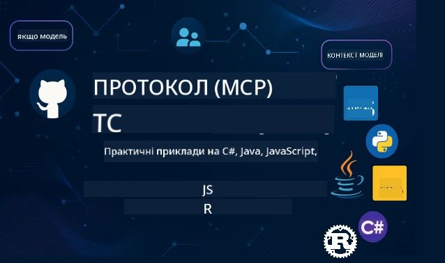

 

[](https://GitHub.com/microsoft/mcp-for-beginners/graphs/contributors)
[](https://GitHub.com/microsoft/mcp-for-beginners/issues)
[](https://GitHub.com/microsoft/mcp-for-beginners/pulls)
[](http://makeapullrequest.com)

[](https://GitHub.com/microsoft/mcp-for-beginners/watchers)
[](https://GitHub.com/microsoft/mcp-for-beginners/fork)
[](https://GitHub.com/microsoft/mcp-for-beginners/stargazers)


[](https://discord.gg/nTYy5BXMWG)

Дотримуйтесь цих кроків, щоб розпочати використання цих ресурсів:
1. **Форкніть репозиторій**: Натисніть [](https://GitHub.com/microsoft/mcp-for-beginners/fork)
2. **Клонувати репозиторій**:   `git clone https://github.com/microsoft/mcp-for-beginners.git`
3. **Приєднатися до** [](https://discord.gg/nTYy5BXMWG)


### 🌐 Підтримка кількох мов

#### Підтримується за допомогою GitHub Action (автоматично та завжди оновлюється)

<!-- CO-OP TRANSLATOR LANGUAGES TABLE START -->
[Arabic](../ar/README.md) | [Bengali](../bn/README.md) | [Bulgarian](../bg/README.md) | [Burmese (Myanmar)](../my/README.md) | [Chinese (Simplified)](../zh-CN/README.md) | [Chinese (Traditional, Hong Kong)](../zh-HK/README.md) | [Chinese (Traditional, Macau)](../zh-MO/README.md) | [Chinese (Traditional, Taiwan)](../zh-TW/README.md) | [Croatian](../hr/README.md) | [Czech](../cs/README.md) | [Danish](../da/README.md) | [Dutch](../nl/README.md) | [Estonian](../et/README.md) | [Finnish](../fi/README.md) | [French](../fr/README.md) | [German](../de/README.md) | [Greek](../el/README.md) | [Hebrew](../he/README.md) | [Hindi](../hi/README.md) | [Hungarian](../hu/README.md) | [Indonesian](../id/README.md) | [Italian](../it/README.md) | [Japanese](../ja/README.md) | [Kannada](../kn/README.md) | [Korean](../ko/README.md) | [Lithuanian](../lt/README.md) | [Malay](../ms/README.md) | [Malayalam](../ml/README.md) | [Marathi](../mr/README.md) | [Nepali](../ne/README.md) | [Nigerian Pidgin](../pcm/README.md) | [Norwegian](../no/README.md) | [Persian (Farsi)](../fa/README.md) | [Polish](../pl/README.md) | [Portuguese (Brazil)](../pt-BR/README.md) | [Portuguese (Portugal)](../pt-PT/README.md) | [Punjabi (Gurmukhi)](../pa/README.md) | [Romanian](../ro/README.md) | [Russian](../ru/README.md) | [Serbian (Cyrillic)](../sr/README.md) | [Slovak](../sk/README.md) | [Slovenian](../sl/README.md) | [Spanish](../es/README.md) | [Swahili](../sw/README.md) | [Swedish](../sv/README.md) | [Tagalog (Filipino)](../tl/README.md) | [Tamil](../ta/README.md) | [Telugu](../te/README.md) | [Thai](../th/README.md) | [Turkish](../tr/README.md) | [Ukrainian](./README.md) | [Urdu](../ur/README.md) | [Vietnamese](../vi/README.md)

> **Віддаєте перевагу локальному клонуванню?**

> Цей репозиторій містить понад 50 мовних перекладів, що значно збільшує розмір завантаження. Щоб клонувати без перекладів, використовуйте sparse checkout:
> ```bash
> git clone --filter=blob:none --sparse https://github.com/microsoft/mcp-for-beginners.git
> cd mcp-for-beginners
> git sparse-checkout set --no-cone '/*' '!translations' '!translated_images'
> ```
> Це дає вам все необхідне для проходження курсу з набагато швидшим завантаженням.
<!-- CO-OP TRANSLATOR LANGUAGES TABLE END -->

# 🚀 Навчальна програма Model Context Protocol (MCP) для початківців

## **Вивчайте MCP на практичних прикладах коду на C#, Java, JavaScript, Rust, Python та TypeScript**

## 🧠 Огляд навчальної програми Model Context Protocol
Ласкаво просимо у вашу подорож у світ Model Context Protocol! Якщо ви коли-небудь задавалися питанням, як AI-додатки взаємодіють з різними інструментами та сервісами, ви саме зараз відкриваєте елегантне рішення, яке змінює спосіб створення розумних систем розробниками.

Уявіть MCP як універсальний перекладач для AI-додатків — так само, як USB-порти дозволяють підключати будь-який пристрій до вашого комп’ютера, MCP дає змогу AI-моделям підключатися до будь-яких інструментів або сервісів у стандартизований спосіб. Чи створюєте ви свого першого чатбота, чи працюєте над складними AI-воркфлоу, розуміння MCP дасть вам здатність створювати потужніші та гнучкіші додатки.

Ця навчальна програма створена з терпінням і турботою про ваш освітній шлях. Ми почнемо з простих концепцій, які ви вже розумієте, і поступово розвиватимемо ваші навички через практичні вправи на вашій улюбленій мові програмування. Кожен крок містить чіткі пояснення, практичні приклади та багато підтримки.

До кінця цієї подорожі ви будете впевнено створювати власні MCP-сервери, інтегрувати їх із популярними AI-платформами та розуміти, як ця технологія змінює майбутнє розробки AI. Розпочнемо цю захоплюючу пригоду разом!

### Офіційна документація та специфікації

Ці ресурси стають ціннішими разом із вашим зростаючим розумінням, але не відчувайте тиск прочитати все одразу. Починайте з тем, які вам найбільше цікаві!
- 📘 [Документація MCP](https://modelcontextprotocol.io/) – це ваш основний ресурс зі покроковими підручниками та посібниками користувача. Документація написана з урахуванням початківців, містить зрозумілі приклади, за якими можна слідувати у власному темпі.
- 📜 [Специфікація MCP](https://modelcontextprotocol.io/docs/) – уявіть це як ваш всебічний довідник. Працюючи з програмою, ви повертатиметеся сюди для пошуку конкретних деталей і вивчення розширених функцій.
- 📜 [Оригінальна специфікація MCP](https://modelcontextprotocol.io/specification/versioning) – містить додаткові технічні деталі, які можуть бути корисними для просунутих реалізацій. Вона є на випадок потреби, але не турбуйтеся про неї на початку.
- 🧑‍💻 [Репозиторій MCP на GitHub](https://github.com/modelcontextprotocol) – тут ви знайдете SDK, інструменти та приклади коду багатьма мовами програмування. Це ніби скарбниця практичних прикладів і готових компонентів.
- 🌐 [Спільнота MCP](https://github.com/orgs/modelcontextprotocol/discussions) – приєднуйтеся до інших учнів та досвідчених розробників у обговореннях про MCP. Це підтримуюча спільнота, де вітаються питання і вільно діляться знаннями.
  
## Навчальні цілі

Після завершення цієї програми ви почуватиметеся впевнено й радітимете своїм новим навичкам. Ось чого ви досягнете:

• **Зрозуміти основи MCP**: Ви зрозумієте, що таке Model Context Protocol і чому він змінює спосіб спільної роботи AI-додатків, використовуючи аналогії та приклади, які легко сприймати.

• **Створити свій перший MCP-сервер**: Ви створите робочий MCP-сервер на обраній мові програмування, починаючи з простих прикладів і крок за кроком нарощуючи вміння.

• **Підключити AI-моделі до реальних інструментів**: Ви дізнаєтеся, як поєднати AI-моделі з практичними сервісами, надаючи вашим додаткам нові потужні можливості.

• **Впровадити найкращі практики безпеки**: Ви зрозумієте, як захищати свої реалізації MCP, оберігаючи одночасно додатки та користувачів.

• **Впевнено розгортати проекти**: Ви дізнаєтеся, як перейти від розробки до продуктивного середовища, використовуючи практичні стратегії впровадження, які працюють у реальному житті.

• **Приєднатися до спільноти MCP**: Ви станете частиною зростаючої спільноти розробників, що формують майбутнє розробки AI-додатків. 

## Необхідна база

Перш ніж занурюватися в MCP, переконаємося, що ви комфортно почуваєтеся з деякими базовими поняттями. Не хвилюйтеся, якщо ви не експерт у цих сферах — ми пояснимо все, що потрібно знати, по ходу!

### Розуміння протоколів (основа)

Уявіть протокол як правила для розмови. Коли ви телефонуєте другу, ви обидва знаєте, що при відповіді кажете "привіт", говорите по черзі і кажете "до побачення" в кінці. Комп’ютерним програмам потрібні подібні правила для ефективної комунікації.

MCP — це протокол, набір погоджених правил, які допомагають AI-моделям та додаткам мати продуктивні "розмови" з інструментами і сервісами. Так само, як правила розмов роблять людське спілкування плавнішим, MCP робить комунікацію AI-додатків набагато надійнішою і потужнішою.

### Відносини клієнт-сервер (як працюють програми разом)

Ви вже щодня користуєтеся відносинами клієнт-сервер! Коли ви відкриваєте браузер (клієнт) і заходите на вебсайт, ви підключаєтеся до веб-серверу, який надсилає вам вміст сторінки. Браузер знає, як запитувати інформацію, а сервер знає, як відповісти.

У MCP у нас подібні відносини: AI-моделі виступають клієнтами, які запитують інформацію або дії, а MCP-сервери надають ці можливості. Це ніби у AI є помічник (сервер), до якого можна звернутися з конкретними завданнями.

### Чому стандартизація важлива (щоб усе працювало разом)

Уявіть, якби кожен виробник авто використовував газові насоси різної форми — вам би потрібен був адаптер для кожного автомобіля! Стандартизація означає погодження спільних підходів, щоб усе працювало без проблем.

MCP забезпечує таку стандартизацію для AI-додатків. Замість того, щоб кожна AI-модель потребувала унікального коду для роботи з кожним інструментом, MCP створює універсальний спосіб спілкування. Це означає, що розробники можуть створити інструмент один раз і використовувати його з багатьма різними AI-системами.

## 🧭 Огляд вашого навчального шляху

Ваша подорож у світі MCP ретельно структурована, щоб послідовно розвивати вашу впевненість і навички. Кожний етап знайомить з новими концепціями, одночасно закріплюючи раніше вивчене.

### 🌱 Початковий етап: Розуміння основ (Модулі 0-2)

Саме тут починається ваша пригода! Ми познайомимо вас із концепціями MCP за допомогою знайомих аналогій і простих прикладів. Ви зрозумієте, що таке MCP, навіщо він існує і яку роль відіграє у світі AI-розробки загалом.

• **Модуль 0 – Вступ до MCP**: Ми почнемо з огляду, що таке MCP і чому він важливий для сучасних AI-додатків. Ви побачите реальні приклади використання MCP і зрозумієте, як він вирішує поширені проблеми розробників.

• **Модуль 1 – Основні концепції**: Тут ви вивчите базові складові MCP. Ми використаємо багато аналогій і наочних прикладів, щоб ці поняття стали вам зрозумілими і природними.

• **Модуль 2 – Безпека в MCP**: Безпека може здаватися лякливою, але ми покажемо, як MCP має вбудовані засоби захисту, і навчимо вас найкращим практикам, які оберігають ваші додатки з самого початку.

### 🔨 Етап побудови: Створення перших реалізацій (Модуль 3)

Тепер починається справжнє захоплення! Ви отримаєте практичний досвід створення реальних MCP-серверів і клієнтів. Не хвилюйтеся — ми почнемо з простого та проведемо вас через кожен крок.

Цей модуль містить кілька практичних посібників, які дозволяють тренуватися на обраній вами мові програмування. Ви створите свій перший сервер, побудуєте клієнта для підключення до нього і навіть інтегруєтеся з популярними інструментами розробки, такими як VS Code.
Кожен посібник містить повні приклади коду, поради з усунення неполадок та пояснення причин, чому ми робимо певні дизайнерські вибори. Наприкінці цього етапу у вас будуть робочі реалізації MCP, якими ви зможете пишатися!

### 🚀 Етап зростання: просунуті концепції та реальні застосування (модулі 4-5)

Опановуючи основи, ви готові вивчити більш складні функції MCP. Ми розглянемо практичні стратегії реалізації, методи налагодження та розширені теми, такі як інтеграція мультимодальної штучної інтелекту.

Ви також навчитеся масштабувати ваші реалізації MCP для використання в продакшені та інтегрувати їх з хмарними платформами, такими як Azure. Ці модулі підготують вас до створення рішень MCP, які можуть впоратися з реальними вимогами.

### 🌟 Етап оволодіння: спільнота та спеціалізація (модулі 6-11)

Останній етап зосереджений на приєднанні до спільноти MCP та спеціалізації у тих сферах, які вас найбільше цікавлять. Ви дізнаєтесь, як робити внесок у відкриті проєкти MCP, реалізовувати розширені патерни автентифікації та створювати комплексні рішення з інтеграцією баз даних.

Модуль 11 заслуговує на окрему увагу — це повний практичний курс з 13 лабораторних робіт, який навчає створювати сервери MCP, готові до продакшену, з інтеграцією PostgreSQL. Це як підсумковий проєкт, що об’єднує все, чого ви навчилися!

### 📚 Повна структура курсу

| Модуль | Тема | Опис | Посилання |
|--------|-------|-------------|------|
| **Модулі 1-3: Основи** | | | |
| 00 | Вступ до MCP | Огляд протоколу Model Context Protocol та його значення в AI пайплайнах | [Детальніше](./00-Introduction/README.md) |
| 01 | Пояснення основних понять | Детальний розгляд основних концепцій MCP | [Детальніше](./01-CoreConcepts/README.md) |
| 02 | Безпека в MCP | Загрози безпеці та кращі практики | [Детальніше](./02-Security/README.md) |
| 03 | Початок роботи з MCP | Налаштування середовища, базові сервери/клієнти, інтеграція | [Детальніше](./03-GettingStarted/README.md) |
| **Модуль 3: Створення першого сервера та клієнта** | | | |
| 3.1 | Перший сервер | Створіть свій перший MCP сервер | [Посібник](./03-GettingStarted/01-first-server/README.md) |
| 3.2 | Перший клієнт | Розробіть базовий MCP клієнт | [Посібник](./03-GettingStarted/02-client/README.md) |
| 3.3 | Клієнт з LLM | Інтеграція великих мовних моделей | [Посібник](./03-GettingStarted/03-llm-client/README.md) |
| 3.4 | Інтеграція VS Code | Використання MCP серверів у VS Code | [Посібник](./03-GettingStarted/04-vscode/README.md) |
| 3.5 | stdio сервер | Створення серверів за допомогою stdio транспорту | [Посібник](./03-GettingStarted/05-stdio-server/README.md) |
| 3.6 | HTTP стрімінг | Реалізація HTTP стрімінгу в MCP | [Посібник](./03-GettingStarted/06-http-streaming/README.md) |
| 3.7 | AI набір інструментів | Використання AI Toolkit з MCP | [Посібник](./03-GettingStarted/07-aitk/README.md) |
| 3.8 | Тестування | Тестування реалізації MCP сервера | [Посібник](./03-GettingStarted/08-testing/README.md) |
| 3.9 | Розгортання | Розгортання MCP серверів у продакшені | [Посібник](./03-GettingStarted/09-deployment/README.md) |
| 3.10 | Розширене використання сервера | Використання розширених серверів для нових функцій та покращеної архітектури | [Посібник](./03-GettingStarted/10-advanced/README.md) |
| 3.11 | Проста автентифікація | Розділ, що показує автентифікацію з самого початку і RBAC | [Посібник](./03-GettingStarted/11-simple-auth/README.md) |
| **Модулі 4-5: Практичні & розширені теми** | | | |
| 04 | Практична реалізація | SDK, налагодження, тестування, багаторазові шаблони запитів | [Детальніше](./04-PracticalImplementation/README.md) |
| 05 | Розширені теми MCP | Мультимодальний AI, масштабування, корпоративне використання | [Детальніше](./05-AdvancedTopics/README.md) |
| 5.1 | Інтеграція з Azure | Інтеграція MCP з Azure | [Посібник](./05-AdvancedTopics/mcp-integration/README.md) |
| 5.2 | Мультимодальність | Робота з кількома модальностями | [Посібник](./05-AdvancedTopics/mcp-multi-modality/README.md) |
| 5.3 | Демонстрація OAuth2 | Реалізація автентифікації OAuth2 | [Посібник](./05-AdvancedTopics/mcp-oauth2-demo/README.md) |
| 5.4 | Кореневі контексти | Розуміння та реалізація кореневих контекстів | [Посібник](./05-AdvancedTopics/mcp-root-contexts/README.md) |
| 5.5 | Маршрутизація | Стратегії маршрутизації MCP | [Посібник](./05-AdvancedTopics/mcp-routing/README.md) |
| 5.6 | Відбір | Техніки відбору в MCP | [Посібник](./05-AdvancedTopics/mcp-sampling/README.md) |
| 5.7 | Масштабування | Масштабування реалізацій MCP | [Посібник](./05-AdvancedTopics/mcp-scaling/README.md) |
| 5.8 | Безпека | Розширені аспекти безпеки | [Посібник](./05-AdvancedTopics/mcp-security/README.md) |
| 5.9 | Веб-пошук | Реалізація функцій веб-пошуку | [Посібник](./05-AdvancedTopics/web-search-mcp/README.md) |
| 5.10 | Реальний час стрімінгу | Створення функціоналу стрімінгу в реальному часі | [Посібник](./05-AdvancedTopics/mcp-realtimestreaming/README.md) |
| 5.11 | Пошук в реальному часі | Реалізація пошуку в реальному часі | [Посібник](./05-AdvancedTopics/mcp-realtimesearch/README.md) |
| 5.12 | Автентифікація Entra ID | Автентифікація з Microsoft Entra ID | [Посібник](./05-AdvancedTopics/mcp-security-entra/README.md) |
| 5.13 | Інтеграція Foundry | Інтеграція з Azure AI Foundry | [Посібник](./05-AdvancedTopics/mcp-foundry-agent-integration/README.md) |
| 5.14 | Інженерія контексту | Техніки ефективної інженерії контексту | [Посібник](./05-AdvancedTopics/mcp-contextengineering/README.md) |
| 5.15 | Користувацький транспорт MCP | Реалізації користувацьких транспортів | [Посібник](./05-AdvancedTopics/mcp-transport/README.md) |
| **Модулі 6-10: Спільнота та найкращі практики** | | | |
| 06 | Внески спільноти | Як робити внесок у екосистему MCP | [Посібник](./06-CommunityContributions/README.md) |
| 07 | Уроки з раннього впровадження | Історії реальних впроваджень | [Посібник](./07-LessonsFromEarlyAdoption/README.md) |
| 08 | Найкращі практики MCP | Продуктивність, відмовостійкість, стійкість | [Посібник](./08-BestPractices/README.md) |
| 09 | Кейси MCP | Приклади практичної реалізації | [Посібник](./09-CaseStudy/README.md) |
| 10 | Практичний семінар | Створення MCP сервера з AI Toolkit | [Лабораторна робота](./10-StreamliningAIWorkflowsBuildingAnMCPServerWithAIToolkit/README.md) |
| **Модуль 11: MCP сервер практичні лабораторії** | | | |
| 11 | Інтеграція MCP сервера з базою даних | Комплексний курс з 13 лабораторних робіт для інтеграції PostgreSQL | [Лабораторії](./11-MCPServerHandsOnLabs/README.md) |
| 11.1 | Вступ | Огляд MCP з інтеграцією бази даних та кейсом роздрібної аналітики | [Лаб 00](./11-MCPServerHandsOnLabs/00-Introduction/README.md) |
| 11.2 | Основна архітектура | Розуміння архітектури сервера MCP, шарів бази даних та патернів безпеки | [Лаб 01](./11-MCPServerHandsOnLabs/01-Architecture/README.md) |
| 11.3 | Безпека та мультітенантність | Row Level Security, автентифікація та доступ до даних кількох орендарів | [Лаб 02](./11-MCPServerHandsOnLabs/02-Security/README.md) |
| 11.4 | Налаштування середовища | Підготовка середовища розробки, Docker, ресурси Azure | [Лаб 03](./11-MCPServerHandsOnLabs/03-Setup/README.md) |
| 11.5 | Проєктування бази даних | Налаштування PostgreSQL, дизайн схеми для рітейлу, приклад даних | [Лаб 04](./11-MCPServerHandsOnLabs/04-Database/README.md) |
| 11.6 | Реалізація MCP сервера | Створення FastMCP сервера з інтеграцією бази даних | [Лаб 05](./11-MCPServerHandsOnLabs/05-MCP-Server/README.md) |
| 11.7 | Розробка інструментів | Створення інструментів запитів до бази та інспекції схеми | [Лаб 06](./11-MCPServerHandsOnLabs/06-Tools/README.md) |
| 11.8 | Семантичний пошук | Реалізація векторних вбудувань з Azure OpenAI та pgvector | [Лаб 07](./11-MCPServerHandsOnLabs/07-Semantic-Search/README.md) |
| 11.9 | Тестування та налагодження | Стратегії тестування, інструменти налагодження та підходи валідації | [Лаб 08](./11-MCPServerHandsOnLabs/08-Testing/README.md) |
| 11.10 | Інтеграція VS Code | Налаштування VS Code MCP інтеграції та використання AI Chat | [Лаб 09](./11-MCPServerHandsOnLabs/09-VS-Code/README.md) |
| 11.11 | Стратегії розгортання | Розгортання через Docker, Azure Container Apps та питання масштабування | [Лаб 10](./11-MCPServerHandsOnLabs/10-Deployment/README.md) |
| 11.12 | Моніторинг | Application Insights, логування, моніторинг продуктивності | [Лаб 11](./11-MCPServerHandsOnLabs/11-Monitoring/README.md) |
| 11.13 | Найкращі практики | Оптимізація продуктивності, укріплення безпеки, поради для продакшену | [Лаб 12](./11-MCPServerHandsOnLabs/12-Best-Practices/README.md) |

### 💻 Приклади коду

Одна з найбільш захоплюючих частин вивчення MCP — це поступове покращення ваших навичок програмування. Ми спроектували наші приклади коду так, щоб вони починалися просто і ставали дедалі складнішими разом із поглибленням вашого розуміння. Ось як ми вводимо концепції – з кодом, який легко зрозуміти, але який демонструє реальні принципи MCP, ви зможете зрозуміти не тільки що цей код робить, а й чому він структурований саме так і як вписується у великі MCP програми.

#### Базові приклади калькулятора MCP

| Мова | Опис | Посилання |
|----------|-------------|------|
| C# | Приклад MCP сервера | [Переглянути код](./03-GettingStarted/samples/csharp/README.md) |
| Java | MCP калькулятор | [Переглянути код](./03-GettingStarted/samples/java/calculator/README.md) |
| JavaScript | Демонстрація MCP | [Переглянути код](./03-GettingStarted/samples/javascript/README.md) |
| Python | MCP сервер | [Переглянути код](../../03-GettingStarted/samples/python/mcp_calculator_server.py) |
| TypeScript | Приклад MCP | [Переглянути код](./03-GettingStarted/samples/typescript/README.md) |
| Rust | Приклад MCP | [Переглянути код](./03-GettingStarted/samples/rust/README.md) |

#### Розширені реалізації MCP

| Мова | Опис | Посилання |
|----------|-------------|------|
| C# | Розширений приклад | [Переглянути код](./04-PracticalImplementation/samples/csharp/README.md) |
| Java з Spring | Приклад контейнерного додатку | [Переглянути код](./04-PracticalImplementation/samples/java/containerapp/README.md) |
| JavaScript | Розширений приклад | [Переглянути код](./04-PracticalImplementation/samples/javascript/README.md) |
| Python | Складна реалізація | [Переглянути код](../../04-PracticalImplementation/samples/python/READMEmd) |
| TypeScript | Приклад контейнера | [Переглянути код](./04-PracticalImplementation/samples/typescript/README.md) |


## 🎯 Вимоги для вивчення MCP

Щоб отримати максимум від цього курсу, ви повинні мати:

- Базові знання програмування принаймні однією з мов: C#, Java, JavaScript, Python чи TypeScript
- Розуміння клієнт-серверної моделі та API
- Знайомство з концепціями REST та HTTP
- (Опціонально) Базові знання AI/ML концепцій

- Участь у наших обговореннях спільноти для підтримки

## 📚 Посібник з вивчення та ресурси

У цьому репозиторії міститься декілька ресурсів, які допоможуть вам ефективно орієнтуватися та навчатися:

### Посібник з вивчення

Доступний всебічний [Посібник з вивчення](./study_guide.md), який допоможе вам ефективно орієнтуватися в цьому репозиторії. Ця візуальна мапа курсу показує, як всі теми пов’язані між собою, і надає рекомендації щодо ефективного використання зразків проєктів. Особливо корисно, якщо ви візуальний учень, який любить бачити загальну картину.

Посібник містить:
- Візуальну мапу курсу з усіма темами
- Детальний розбір кожного розділу репозиторію
- Інструкції з використання прикладів проєктів
- Рекомендовані шляхи навчання для різних рівнів
- Додаткові ресурси для підтримки вашого навчання

### Журнал змін

Ми підтримуємо детальний [Журнал змін](./changelog.md), в якому фіксуються всі значущі оновлення матеріалів курсу, щоб ви могли бути в курсі останніх удосконалень і доповнень.
- Додавання нового контенту
- Зміни в структурі
- Покращення функцій
- Оновлення документації

## 🛠️ Як ефективно використовувати цей курс

Кожен урок у цьому посібнику містить:
1. Чіткі пояснення концепцій MCP  
2. Приклади коду в реальному часі на кількох мовах  
3. Вправи для створення реальних застосунків MCP  
4. Додаткові ресурси для просунутих користувачів

## Контент на запит

### [MCP Dev Days July 2025](https://developer.microsoft.com/en-us/reactor/series/S-1563/)
#### [➡️Переглянути на запит - MCP Dev Days](https://developer.microsoft.com/en-us/reactor/series/S-1563/)
Підготуйтеся до двох днів глибоких технічних інсайтів, спілкування в спільноті та практичного навчання на MCP Dev Days — віртуальному заході, присвяченому Model Context Protocol (MCP) — новому стандарту, який поєднує AI-моделі та інструменти, які вони використовують.
Ви можете переглянути MCP Dev Days, зареєструвавшись на нашій сторінці події: https://aka.ms/mcpdevdays.

#### [День 1: Продуктивність MCP, DevTools та спільнота:](https://developer.microsoft.com/en-us/reactor/series/S-1563/)

Присвячений наданню розробникам можливостей використовувати MCP у своїх робочих процесах і святкуванню неймовірної спільноти MCP. До нас приєднаються члени спільноти та партнери, такі як Arcade, Block, Okta та Neon, щоб показати, як вони співпрацюють з Microsoft для формування відкритої, розширюваної екосистеми MCP. Демонстрації з реального життя у VS Code, Visual Studio, GitHub Copilot та популярних інструментах спільноти
Практичні, контекстно-орієнтовані робочі процеси розробки
Сесії та інсайти від спільноти
Якщо ви тільки починаєте з MCP або вже працюєте з ним, День 1 задасть тон, надихаючи та даючи корисні поради.

#### [День 2: Будуйте MCP сервери впевнено](https://developer.microsoft.com/en-us/reactor/series/S-1563/)

Призначений для розробників MCP. Ми детально розглянемо стратегії впровадження та найкращі практики створення MCP серверів і інтеграції MCP у ваші AI робочі процеси.

#### Теми включають:

- Створення MCP серверів та інтеграція в агентські рішення
- Розробка на основі prompt’ів
- Найкращі практики безпеки
- Використання будівельних блоків, таких як Functions, ACA та API Management
- Вирівнювання реєстру та інструменти (1P + 3P)

Якщо ви розробник, творець інструментів чи стратег з AI продуктів, цей день насичений інсайтами для створення масштабованих, безпечних і готових до майбутнього рішень MCP.

### MCP Boot Camp August 2025
Навчіться на інтенсивних відеосесіях, як створювати MCP сервери, інтегруватись з VS Code і професійно розгортати на Azure за матеріалами курсу MCP для початківців. Отримаєте практичні навички в технології, яку вже використовують провідні компанії.

#### [➡️Переглянути на запит MCP Bootcamp | Англійська](https://developer.microsoft.com/en-us/reactor/series/s-1568/)
#### [➡️Переглянути на запит MCP Bootcamp | Бразильська](https://developer.microsoft.com/en-us/reactor/series/S-1566/)
#### [➡️Переглянути на запит MCP Bootcamp | Іспанська](https://developer.microsoft.com/en-us/reactor/series/S-1567/)

### Давайте вивчимо MCP з C# - Серія навчальних відео
Давайте познайомимось із Model Context Protocol (MCP), передовим фреймворком, створеним для стандартизації взаємодії між AI-моделями та клієнтськими застосунками. Через цей курс для початківців ми познайомимо вас з MCP і допоможемо створити ваш перший MCP сервер.
#### C#: [https://aka.ms/letslearnmcp-csharp](https://aka.ms/letslearnmcp-csharp)
#### Java: [https://aka.ms/letslearnmcp-java](https://aka.ms/letslearnmcp-java)
#### JavaScript: [https://aka.ms/letslearnmcp-javascript](https://aka.ms/letslearnmcp-javascript)
#### Python: [https://aka.ms/letslearnmcp-python](https://aka.ms/letslearnmcp-python)

## 🎓 Ваш шлях MCP починається

Вітаємо! Ви щойно зробили перший крок у захопливу подорож, яка розширить ваші програмні можливості та зв’яже вас із передовими розробками в AI.

### Що ви вже досягли

Прочитавши цей вступ, ви вже почали будувати свою базу знань MCP. Ви розумієте, що таке MCP, чому це важливо, і як ця навчальна програма підтримає ваш шлях до знань. Це значне досягнення і початок вашої експертності в цій важливій технології.

### Пригоди попереду

Поступово проходячи модулі, пам’ятайте, що кожен експерт спочатку був початківцем. Концепції, які зараз здаються складними, стануть природними, коли ви будете їх практикувати та застосовувати. Кожен маленький крок створює потужні можливості, які служитимуть вам протягом вашої розробницької кар’єри.

### Ваша підтримка

Ви приєднуєтесь до спільноти учнів і експертів, які захоплені MCP і готові допомагати іншим досягати успіху. Якщо вам потрібна допомога із завданням або хочеться поділитися проривом — спільнота тут, щоб підтримати вас.

Якщо застрягли або маєте питання про створення AI-застосунків, приєднуйтесь до обговорень MCP з іншими учнями та досвідченими розробниками. Це дружня спільнота, де запитання вітаються, а знання поширюються вільно.

[](https://discord.gg/nTYy5BXMWG)

Якщо ви маєте відгуки про продукт або помилки під час розробки, відвідайте:

[](https://aka.ms/foundry/forum)

### Готові почати?

Ваша MCP пригода починається зараз! Почніть з Модуля 0, щоб зануритись у перші практичні досвіди MCP, або дослідіть зразкові проекти, щоб побачити, що ви створюватимете. Пам’ятайте — кожен експерт починав точно там, де ви зараз, і з терпінням та практикою ви будете вражені своїми досягненнями.

Ласкаво просимо у світ розробки Model Context Protocol. Давайте створювати щось неймовірне разом!

## 🤝 Внесок у навчальну спільноту

Ця навчальна програма стає кращою завдяки внескам таких учнів, як ви! Чи то виправлення помилки, чи пропозиція зрозумілішого пояснення, чи додавання нового прикладу — ваш внесок допомагає іншим початківцям досягати успіху.

Дякуємо Microsoft Valued Professional [Shivam Goyal](https://www.linkedin.com/in/shivam2003/) за внесок з прикладами коду.

Процес внеску спроектовано так, щоб бути дружнім і підтримуючим. Більшість внесків потребують Contributor License Agreement (CLA), але автоматизовані інструменти допоможуть вам пройти цей процес легко.

## 📜 Відкрите навчання

Весь цей курс доступний під ліцензією MIT [LICENSE](../../LICENSE), що означає, що ви можете вільно використовувати, модифікувати і поширювати його. Це підтримує нашу місію зробити знання про MCP доступними для розробників усюди.
## 🤝 Керівництво з внесків

Цей проєкт вітає внески та пропозиції. Більшість внесків вимагають, щоб ви погодились із Contributor License Agreement (CLA), який підтверджує, що ви маєте право та дійсно надаєте нам права на використання вашого внеску. Деталі можна знайти на <https://cla.opensource.microsoft.com>.

Коли ви створюєте pull request, бот CLA автоматично визначає, чи потрібно надати CLA, та відповідно маркує PR (наприклад, перевірка статусу, коментар). Просто слідуйте інструкціям бота. Вам потрібно зробити це лише один раз для всіх репозиторіїв, які використовують наш CLA.

Цей проєкт прийняв [Microsoft Open Source Code of Conduct](https://opensource.microsoft.com/codeofconduct/).
Додаткову інформацію дивіться у [Code of Conduct FAQ](https://opensource.microsoft.com/codeofconduct/faq/) або звертайтеся на [opencode@microsoft.com](mailto:opencode@microsoft.com) з питаннями чи коментарями.

---

*Готові почати свій шлях MCP? Почніть з [Модуль 00 - Вступ до MCP](./00-Introduction/README.md) і зробіть свої перші кроки у світі розробки Model Context Protocol!*


## 🎒 Інші курси
Наша команда також пропонує інші курси! Ознайомтеся:

<!-- CO-OP TRANSLATOR OTHER COURSES START -->
### LangChain
[](https://aka.ms/langchain4j-for-beginners)
[](https://aka.ms/langchainjs-for-beginners?WT.mc_id=m365-94501-dwahlin)

---

### Azure / Edge / MCP / Agents
[](https://github.com/microsoft/AZD-for-beginners?WT.mc_id=academic-105485-koreyst)
[](https://github.com/microsoft/edgeai-for-beginners?WT.mc_id=academic-105485-koreyst)
[](https://github.com/microsoft/mcp-for-beginners?WT.mc_id=academic-105485-koreyst)
[](https://github.com/microsoft/ai-agents-for-beginners?WT.mc_id=academic-105485-koreyst)

---
 
### Серія Generative AI
[](https://github.com/microsoft/generative-ai-for-beginners?WT.mc_id=academic-105485-koreyst)
[-9333EA?style=for-the-badge&labelColor=E5E7EB&color=9333EA)](https://github.com/microsoft/Generative-AI-for-beginners-dotnet?WT.mc_id=academic-105485-koreyst)
[-C084FC?style=for-the-badge&labelColor=E5E7EB&color=C084FC)](https://github.com/microsoft/generative-ai-for-beginners-java?WT.mc_id=academic-105485-koreyst)
[-E879F9?style=for-the-badge&labelColor=E5E7EB&color=E879F9)](https://github.com/microsoft/generative-ai-with-javascript?WT.mc_id=academic-105485-koreyst)

---
 
### Основи навчання
[](https://aka.ms/ml-beginners?WT.mc_id=academic-105485-koreyst)
[](https://aka.ms/datascience-beginners?WT.mc_id=academic-105485-koreyst)
[](https://aka.ms/ai-beginners?WT.mc_id=academic-105485-koreyst)
[](https://github.com/microsoft/Security-101?WT.mc_id=academic-96948-sayoung)
[](https://aka.ms/webdev-beginners?WT.mc_id=academic-105485-koreyst)
[](https://aka.ms/iot-beginners?WT.mc_id=academic-105485-koreyst)
[](https://github.com/microsoft/xr-development-for-beginners?WT.mc_id=academic-105485-koreyst)

---
 
### Серія Copilot
[](https://aka.ms/GitHubCopilotAI?WT.mc_id=academic-105485-koreyst)
[](https://github.com/microsoft/mastering-github-copilot-for-dotnet-csharp-developers?WT.mc_id=academic-105485-koreyst)
[](https://github.com/microsoft/CopilotAdventures?WT.mc_id=academic-105485-koreyst)
<!-- CO-OP TRANSLATOR OTHER COURSES END -->

---

<!-- CO-OP TRANSLATOR DISCLAIMER START -->
**Відмова від відповідальності**:
Цей документ було перекладено за допомогою сервісу автоматичного перекладу [Co-op Translator](https://github.com/Azure/co-op-translator). Хоча ми прагнемо до точності, будь ласка, майте на увазі, що автоматичні переклади можуть містити помилки або неточності. Оригінальний документ рідною мовою слід вважати авторитетним джерелом. Для критичної інформації рекомендується звертатися до професійного людського перекладу. Ми не несемо відповідальності за будь-які непорозуміння чи неправильні тлумачення, що виникли через використання цього перекладу.
<!-- CO-OP TRANSLATOR DISCLAIMER END -->