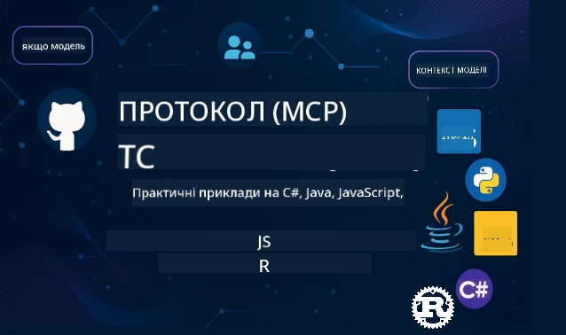

 

[](https://GitHub.com/microsoft/mcp-for-beginners/graphs/contributors)
[](https://GitHub.com/microsoft/mcp-for-beginners/issues)
[](https://GitHub.com/microsoft/mcp-for-beginners/pulls)
[](http://makeapullrequest.com)

[](https://GitHub.com/microsoft/mcp-for-beginners/watchers)
[](https://GitHub.com/microsoft/mcp-for-beginners/fork)
[](https://GitHub.com/microsoft/mcp-for-beginners/stargazers)


[](https://discord.gg/nTYy5BXMWG)

Дотримуйтесь цих кроків, щоб розпочати роботу з цими ресурсами:
1. **Форкніть репозиторій**: Натисніть [](https://GitHub.com/microsoft/mcp-for-beginners/fork)
2. **Клонуйте репозиторій**:   `git clone https://github.com/microsoft/mcp-for-beginners.git`
3. **Приєднуйтесь до** [](https://discord.gg/nTYy5BXMWG)


### 🌐 Підтримка багатьох мов

#### Підтримується через GitHub Action (автоматично та завжди актуально)

<!-- CO-OP TRANSLATOR LANGUAGES TABLE START -->
[Arabic](../ar/README.md) | [Bengali](../bn/README.md) | [Bulgarian](../bg/README.md) | [Burmese (Myanmar)](../my/README.md) | [Chinese (Simplified)](../zh-CN/README.md) | [Chinese (Traditional, Hong Kong)](../zh-HK/README.md) | [Chinese (Traditional, Macau)](../zh-MO/README.md) | [Chinese (Traditional, Taiwan)](../zh-TW/README.md) | [Croatian](../hr/README.md) | [Czech](../cs/README.md) | [Danish](../da/README.md) | [Dutch](../nl/README.md) | [Estonian](../et/README.md) | [Finnish](../fi/README.md) | [French](../fr/README.md) | [German](../de/README.md) | [Greek](../el/README.md) | [Hebrew](../he/README.md) | [Hindi](../hi/README.md) | [Hungarian](../hu/README.md) | [Indonesian](../id/README.md) | [Italian](../it/README.md) | [Japanese](../ja/README.md) | [Kannada](../kn/README.md) | [Korean](../ko/README.md) | [Lithuanian](../lt/README.md) | [Malay](../ms/README.md) | [Malayalam](../ml/README.md) | [Marathi](../mr/README.md) | [Nepali](../ne/README.md) | [Nigerian Pidgin](../pcm/README.md) | [Norwegian](../no/README.md) | [Persian (Farsi)](../fa/README.md) | [Polish](../pl/README.md) | [Portuguese (Brazil)](../pt-BR/README.md) | [Portuguese (Portugal)](../pt-PT/README.md) | [Punjabi (Gurmukhi)](../pa/README.md) | [Romanian](../ro/README.md) | [Russian](../ru/README.md) | [Serbian (Cyrillic)](../sr/README.md) | [Slovak](../sk/README.md) | [Slovenian](../sl/README.md) | [Spanish](../es/README.md) | [Swahili](../sw/README.md) | [Swedish](../sv/README.md) | [Tagalog (Filipino)](../tl/README.md) | [Tamil](../ta/README.md) | [Telugu](../te/README.md) | [Thai](../th/README.md) | [Turkish](../tr/README.md) | [Ukrainian](./README.md) | [Urdu](../ur/README.md) | [Vietnamese](../vi/README.md)

> **Віддаєте перевагу клонувати локально?**
>
> Цей репозиторій включає понад 50 мовних перекладів, що значно збільшує розмір завантаження. Щоб клонувати без перекладів, скористайтеся sparse checkout:
>
> **Bash / macOS / Linux:**
> ```bash
> git clone --filter=blob:none --sparse https://github.com/microsoft/mcp-for-beginners.git
> cd mcp-for-beginners
> git sparse-checkout set --no-cone '/*' '!translations' '!translated_images'
> ```
>
> **CMD (Windows):**
> ```cmd
> git clone --filter=blob:none --sparse https://github.com/microsoft/mcp-for-beginners.git
> cd mcp-for-beginners
> git sparse-checkout set --no-cone "/*" "!translations" "!translated_images"
> ```
>
> Це дасть вам усе необхідне для проходження курсу з набагато швидшим завантаженням.
<!-- CO-OP TRANSLATOR LANGUAGES TABLE END -->

# 🚀 Навчальна програма Model Context Protocol (MCP) для початківців

## **Вивчайте MCP з практичними прикладами коду на C#, Java, JavaScript, Rust, Python і TypeScript**

## 🧠 Огляд навчальної програми Model Context Protocol
Ласкаво просимо у вашу подорож у світ Model Context Protocol! Якщо ви коли-небудь замислювалися, як AI-застосунки спілкуються з різними інструментами та сервісами, ви ось-ось відкриєте витончене рішення, яке змінює те, як розробники створюють інтелектуальні системи.

Уявіть MCP як універсальний перекладач для AI-застосунків — так само, як USB-порти дозволяють підключати будь-який пристрій до комп’ютера, MCP дозволяє AI-моделям підключатися до будь-яких інструментів або сервісів стандартизованим способом. Незалежно від того, чи створюєте ви свого першого чат-бота, чи працюєте над складними AI-робочими процесами, розуміння MCP надасть вам можливість створювати більш потужні та гнучкі застосунки.

Ця навчальна програма створена з терпінням і турботою про ваш процес навчання. Ми почнемо з простих і знайомих концепцій і поступово нарощуватимемо вашу експертизу через практичні вправи у вашій улюбленій мові програмування. Кожен крок супроводжується чіткими поясненнями, практичними прикладами і безліччю підтримки на шляху.

До кінця цієї подорожі ви будете впевнено створювати власні MCP-сервери, інтегрувати їх з популярними AI-платформами і розуміти, як ця технологія змінює майбутнє розробки AI. Давайте розпочнемо цю захоплюючу пригоду разом!

### Офіційна документація та специфікації

Ця навчальна програма відповідає **Специфікації MCP 2025-11-25** (остання стабільна версія). Специфікація MCP використовує версію на основі дати (формат РРРР-ММ-ДД) для забезпечення чіткого відстеження версій протоколу.

Ці ресурси стають ціннішими разом із вашим ростом розуміння, але не відчувайте тиск читати все одразу. Починайте з тем, які вас найбільше цікавлять!
- 📘 [Документація MCP](https://modelcontextprotocol.io/) – це ваш провідник із покроковими підручниками та керівництвами користувача. Документація написана з урахуванням початківців, надаючи чіткі приклади, які ви можете виконувати у своєму темпі.
- 📜 [Специфікація MCP](https://modelcontextprotocol.io/specification/2025-11-25) – розглядайте це як ваш повний довідник. Працюючи з цією програмою, ви повертатиметесь сюди, щоб знаходити конкретні деталі та вивчати розширені можливості.
- 📜 [Версіонування Специфікації MCP](https://modelcontextprotocol.io/specification/versioning) – містить інформацію про історію версій протоколу та як MCP використовує версіонування на основі дати (формат РРРР-ММ-ДД).
- 🧑‍💻 [Репозиторій MCP на GitHub](https://github.com/modelcontextprotocol) – Тут ви знайдете SDK, інструменти та зразки коду для різних мов програмування. Це сховище практичних прикладів та готових до використання компонентів.
- 🌐 [Спільнота MCP](https://github.com/orgs/modelcontextprotocol/discussions) – Приєднуйтесь до інших учнів та досвідчених розробників у обговореннях MCP. Це дружня спільнота, де вітаються запитання і відкрито ділиться знаннями.
  
## Навчальні цілі

За завершенням цієї навчальної програми ви почуватиметесь упевнено і радісно через нові навички. Ось чого ви досягнете:

• **Зрозумієте основи MCP**: Ви осягнете, що таке Model Context Protocol і чому він революціонізує співпрацю AI-застосунків, використовуючи аналогії та приклади, які легко усвідомлюються.

• **Створите свій перший MCP-сервер**: Ви створите працюючий MCP-сервер на улюбленій мові програмування, починаючи з простих прикладів і крок за кроком підвищуючи навички.

• **Підключите AI-моделі до реальних інструментів**: Ви навчитесь долати розрив між AI-моделями та реальними сервісами, надаючи вашим застосункам потужні нові можливості.

• **Застосуєте найкращі практики безпеки**: Ви зрозумієте, як зробити реалізації MCP безпечними, захищаючи і застосунки, і користувачів.

• **Розгортатимете з упевненістю**: Ви дізнаєтесь, як переводити MCP-проекти з розробки в продуктивне середовище з практичними стратегіями деплоя, що працюють у реальному житті.

• **Приєднаєтесь до спільноти MCP**: Ви станете частиною зростаючої спільноти розробників, які формують майбутнє розробки AI-застосунків. 

## Важливі базові знання

Перед тим, як зануритися у подробиці MCP, переконаємось, що ви добре орієнтуєтесь у базових поняттях. Не хвилюйтесь, якщо ви не є експертом — ми пояснимо все, що потрібно знати по ходу!

### Розуміння протоколів (фундамент)

Уявіть протокол як правила для розмови. Коли ви телефонуєте другові, обоє знають, що треба сказати «привіт» при відповіді, по черзі говорити і сказати «до побачення» наприкінці. Комп’ютерні програми потребують подібних правил для ефективного спілкування.

MCP — це протокол, набір домовлених правил, які допомагають AI-моделям і застосункам «спілкуватися» з інструментами та сервісами. Так само, як наявність правил розмови полегшує спілкування людей, наявність MCP робить комунікацію AI-застосунків надійнішою й потужнішою.

### Відносини клієнт-сервер (як працюють програми разом)

Ви щодня користуєтесь відносинами клієнт-сервер! Коли ви відкриваєте веб-браузер (клієнт), щоб зайти на веб-сайт, ви підключаєтесь до веб-сервера, який надсилає вам сторінку. Браузер знає, як запитати інформацію, а сервер знає, як відповісти.

У MCP відносини схожі: AI-моделі виступають клієнтами, які запитують інформацію або дії, а MCP-сервери надають ці можливості. Це як допоміжник (сервер), до якого AI може звертатися з проханням виконати конкретні завдання.

### Чому стандарти мають значення (щоб усе працювало разом)

Уявіть, що кожен виробник автомобілів використовує насос для палива різної форми — вам знадобився б адаптер для кожного авто! Стандарти означають домовленість про спільні підходи, щоб усе працювало без проблем.

MCP забезпечує цю стандартизацію для AI-застосунків. Замість того, щоб кожна AI-модель потребувала спеціального коду для роботи з кожним інструментом, MCP створює універсальний спосіб спілкування. Це дозволяє розробникам створювати інструменти один раз і використовувати їх з багатьма різними AI-системами.

## 🧭 Огляд вашого шляху навчання

Ваша подорож MCP прискіпливо структурована для поступового нарощування впевненості та навичок. Кожен етап вводить нові концепції і закріплює вивчене раніше.

### 🌱 Початковий етап: розуміння основ (модулі 0-2)

Саме тут починається ваша пригода! Ми познайомимо вас із концепціями MCP, використовуючи знайомі аналогії та прості приклади. Ви зрозумієте, що таке MCP, навіщо він потрібен і як вписується в ширший світ розробки AI.

• **Модуль 0 - Вступ до MCP**: Почнемо із дослідження, що таке MCP і чому він такий важливий для сучасних AI-застосунків. Ви побачите реальні приклади MCP у дії та зрозумієте, як він розв’язує розповсюджені проблеми розробників.

• **Модуль 1 - Основні концепції**: Тут ви дізнаєтесь основні будівельні блоки MCP. Ми використаємо багато аналогій і візуальних прикладів, щоб ці поняття стали зрозумілими і природними.

• **Модуль 2 - Безпека в MCP**: Безпека може здаватися складною, але ми покажемо, як MCP має вбудовані механізми захисту і навчимо найкращим практикам, які захищають застосунки з перших кроків.

### 🔨 Етап побудови: створення перших реалізацій (модуль 3)

Тепер починається справжня розвага! Ви отримаєте практичний досвід створення справжніх MCP-серверів і клієнтів. Не хвилюйтеся — ми почнемо з простого і проведемо вас через кожен крок.
Цей модуль включає кілька практичних посібників, які дозволяють практикуватися у вашій улюбленій мові програмування. Ви створите свій перший сервер, розробите клієнта для підключення до нього і навіть інтегруєтеся з популярними інструментами розробки, такими як VS Code.

Кожен посібник містить повні приклади коду, поради з усунення несправностей та пояснення, чому ми приймаємо певні конструктивні рішення. Наприкінці цього етапу у вас будуть робочі реалізації MCP, якими ви можете пишатися!

### 🚀 Фаза розвитку: розширені концепції та застосування у реальному світі (модулі 4-5)

Опановуючи основи, ви готові досліджувати більш складні функції MCP. Ми розглянемо практичні стратегії впровадження, техніки налагодження та такі просунуті теми, як інтеграція мультимодальної ШІ.

Ви також навчитеся масштабувати свої реалізації MCP для продуктивного використання та інтеграції з хмарними платформами, такими як Azure. Ці модулі підготують вас до створення MCP-рішень, здатних справлятися з вимогами реального світу.

### 🌟 Фаза майстерності: спільнота та спеціалізація (модулі 6-11)

Заключна фаза зосереджена на приєднанні до спільноти MCP і спеціалізації у сферах, які вас найбільше цікавлять. Ви дізнаєтеся, як робити внесок у відкриті MCP-проєкти, впроваджувати просунуті схеми аутентифікації та створювати комплексні рішення з інтеграцією баз даних.

Особливо варто відзначити Модуль 11 — це повний навчальний курс із 13 лабораторних робіт, що вчить створювати продакшн-здатні MCP-сервери з інтеграцією PostgreSQL. Це наче фінальний проєкт, який об’єднує все, чому ви навчилися!

### 📚 Повна структура навчальної програми

| Модуль | Тема | Опис | Посилання |
|--------|-------|-------------|------|
| **Модулі 0-3: Основи** | | | |
| 00 | Вступ до MCP | Огляд протоколу Model Context Protocol та його значення в AI-каналах | [Читати далі](./00-Introduction/README.md) |
| 01 | Пояснення основних понять | Глибоке дослідження ключових концепцій MCP | [Читати далі](./01-CoreConcepts/README.md) |
| 02 | Безпека в MCP | Загрози безпеці та найкращі практики | [Читати далі](./02-Security/README.md) |
| 03 | Початок роботи з MCP | Налаштування середовища, базові сервери/клієнти, інтеграція | [Читати далі](./03-GettingStarted/README.md) |
| **Модуль 3: Створення вашого першого сервера та клієнта** | | | |
| 3.1 | Перший сервер | Створіть свій перший MCP-сервер | [Посібник](./03-GettingStarted/01-first-server/README.md) |
| 3.2 | Перший клієнт | Розробіть базового MCP-клієнта | [Посібник](./03-GettingStarted/02-client/README.md) |
| 3.3 | Клієнт з LLM | Інтеграція великих мовних моделей | [Посібник](./03-GettingStarted/03-llm-client/README.md) |
| 3.4 | Інтеграція з VS Code | Використання MCP-серверів у VS Code | [Посібник](./03-GettingStarted/04-vscode/README.md) |
| 3.5 | Сервер stdio | Створення серверів із використанням stdio-транспорту | [Посібник](./03-GettingStarted/05-stdio-server/README.md) |
| 3.6 | HTTP-стримінг | Впровадження HTTP-стримінгу в MCP | [Посібник](./03-GettingStarted/06-http-streaming/README.md) |
| 3.7 | AI Toolkit | Використання AI Toolkit з MCP | [Посібник](./03-GettingStarted/07-aitk/README.md) |
| 3.8 | Тестування | Тестування реалізації MCP-сервера | [Посібник](./03-GettingStarted/08-testing/README.md) |
| 3.9 | Розгортання | Розгортання MCP-серверів у продуктивному середовищі | [Посібник](./03-GettingStarted/09-deployment/README.md) |
| 3.10 | Розширене використання серверів | Використання розширених серверів для просунутого функціоналу та покращеної архітектури | [Посібник](./03-GettingStarted/10-advanced/README.md) |
| 3.11 | Проста аутентифікація | Розділ, який показує аутентифікацію з самого початку та RBAC | [Посібник](./03-GettingStarted/11-simple-auth/README.md) |
| 3.12 | MCP-хости | Налаштування Claude Desktop, Cursor, Cline та інших MCP-хостів | [Посібник](./03-GettingStarted/12-mcp-hosts/README.md) |
| 3.13 | MCP Inspector | Налагодження та тестування MCP-серверів за допомогою інструменту Inspector | [Посібник](./03-GettingStarted/13-mcp-inspector/README.md) |
| 3.14 | Вибірка | Використання вибірки для співпраці з клієнтом | [Посібник](./03-GettingStarted/14-sampling/README.md) |
| 3.15 | MCP-додатки | Створення MCP-додатків | [Посібник](./03-GettingStarted/15-mcp-apps/README.md) |
| **Модулі 4-5: Практичні та просунуті теми** | | | |
| 04 | Практична імплементація | SDK, налагодження, тестування, повторно використовувані шаблони промптів | [Читати далі](./04-PracticalImplementation/README.md) |
| 4.1 | Пагінація | Обробка великих наборів результатів за допомогою курсорної пагінації | [Посібник](./04-PracticalImplementation/pagination/README.md) |
| 05 | Просунуті теми в MCP | Мультимодальний ШІ, масштабування, корпоративне використання | [Читати далі](./05-AdvancedTopics/README.md) |
| 5.1 | Інтеграція з Azure | Інтеграція MCP з Azure | [Посібник](./05-AdvancedTopics/mcp-integration/README.md) |
| 5.2 | Мультимодальність | Робота з кількома модальностями | [Посібник](./05-AdvancedTopics/mcp-multi-modality/README.md) |
| 5.3 | Демонстрація OAuth2 | Впровадження аутентифікації OAuth2 | [Посібник](./05-AdvancedTopics/mcp-oauth2-demo/README.md) |
| 5.4 | Кореневі контексти | Розуміння та впровадження кореневих контекстів | [Посібник](./05-AdvancedTopics/mcp-root-contexts/README.md) |
| 5.5 | Маршрутизація | Стратегії маршрутизації MCP | [Посібник](./05-AdvancedTopics/mcp-routing/README.md) |
| 5.6 | Вибірка | Техніки вибірки в MCP | [Посібник](./05-AdvancedTopics/mcp-sampling/README.md) |
| 5.7 | Масштабування | Масштабування реалізацій MCP | [Посібник](./05-AdvancedTopics/mcp-scaling/README.md) |
| 5.8 | Безпека | Просунуті питання безпеки | [Посібник](./05-AdvancedTopics/mcp-security/README.md) |
| 5.9 | Веб-пошук | Впровадження можливостей веб-пошуку | [Посібник](./05-AdvancedTopics/web-search-mcp/README.md) |
| 5.10 | Потокова трансляція в реальному часі | Створення функціональності потокової трансляції в реальному часі | [Посібник](./05-AdvancedTopics/mcp-realtimestreaming/README.md) |
| 5.11 | Пошук у реальному часі | Впровадження пошуку в реальному часі | [Посібник](./05-AdvancedTopics/mcp-realtimesearch/README.md) |
| 5.12 | Аутентифікація Entra ID | Аутентифікація з Microsoft Entra ID | [Посібник](./05-AdvancedTopics/mcp-security-entra/README.md) |
| 5.13 | Інтеграція Foundry | Інтеграція з Azure AI Foundry | [Посібник](./05-AdvancedTopics/mcp-foundry-agent-integration/README.md) |
| 5.14 | Техніки інженерії контексту | Методи ефективної інженерії контексту | [Посібник](./05-AdvancedTopics/mcp-contextengineering/README.md) |
| 5.15 | Користувацький транспорт MCP | Реалізації користувацьких транспортів | [Посібник](./05-AdvancedTopics/mcp-transport/README.md) |
| 5.16 | Функції протоколу | Сповіщення про прогрес, скасування, шаблони ресурсів | [Посібник](./05-AdvancedTopics/mcp-protocol-features/README.md) |
| **Модулі 6-10: Спільнота та найкращі практики** | | | |
| 06 | Внески спільноти | Як робити внесок у екосистему MCP | [Посібник](./06-CommunityContributions/README.md) |
| 07 | Уроки раннього впровадження | Історії застосування у реальному світі | [Посібник](./07-LessonsfromEarlyAdoption/README.md) |
| 08 | Найкращі практики MCP | Продуктивність, відмовостійкість, стійкість | [Посібник](./08-BestPractices/README.md) |
| 09 | Кейс-стаді MCP | Приклади практичної реалізації | [Посібник](./09-CaseStudy/README.md) |
| 10 | Практичний семінар | Створення MCP-сервера з AI Toolkit | [Лабораторна](./10-StreamliningAIWorkflowsBuildingAnMCPServerWithAIToolkit/README.md) |
| **Модуль 11: Практична лабораторна робота MCP-сервера** | | | |
| 11 | Інтеграція бази даних MCP-сервера | Комплексний 13-лабороторний практикум з інтеграції PostgreSQL | [Лабораторії](./11-MCPServerHandsOnLabs/README.md) |
| 11.1 | Вступ | Огляд MCP з інтеграцією бази даних та кейсом рітейл-аналітики | [Лаб 00](./11-MCPServerHandsOnLabs/00-Introduction/README.md) |
| 11.2 | Основна архітектура | Розуміння архітектури MCP-сервера, шарів бази даних і шаблонів безпеки | [Лаб 01](./11-MCPServerHandsOnLabs/01-Architecture/README.md) |
| 11.3 | Безпека та мультиоренність | Рівень безпеки на рядок, аутентифікація та доступ до даних багатьох орендарів | [Лаб 02](./11-MCPServerHandsOnLabs/02-Security/README.md) |
| 11.4 | Налаштування середовища | Налаштування середовища розробки, Docker, ресурси Azure | [Лаб 03](./11-MCPServerHandsOnLabs/03-Setup/README.md) |
| 11.5 | Проєктування бази даних | Налаштування PostgreSQL, проєктування рітейл-схеми та зразкові дані | [Лаб 04](./11-MCPServerHandsOnLabs/04-Database/README.md) |
| 11.6 | Реалізація MCP-сервера | Створення сервера FastMCP з інтеграцією бази даних | [Лаб 05](./11-MCPServerHandsOnLabs/05-MCP-Server/README.md) |
| 11.7 | Розробка інструментів | Створення інструментів запитів до бази даних та інспекція схеми | [Лаб 06](./11-MCPServerHandsOnLabs/06-Tools/README.md) |
| 11.8 | Семантичний пошук | Впровадження векторних ембеддінгів з Azure OpenAI та pgvector | [Лаб 07](./11-MCPServerHandsOnLabs/07-Semantic-Search/README.md) |
| 11.9 | Тестування та налагодження | Стратегії тестування, інструменти налагодження та підходи до валідації | [Лаб 08](./11-MCPServerHandsOnLabs/08-Testing/README.md) |
| 11.10 | Інтеграція з VS Code | Налаштування інтеграції MCP у VS Code та використання AI Chat | [Лаб 09](./11-MCPServerHandsOnLabs/09-VS-Code/README.md) |
| 11.11 | Стратегії розгортання | Розгортання через Docker, Azure Container Apps і особливості масштабування | [Лаб 10](./11-MCPServerHandsOnLabs/10-Deployment/README.md) |
| 11.12 | Моніторинг | Application Insights, логування, моніторинг продуктивності | [Лаб 11](./11-MCPServerHandsOnLabs/11-Monitoring/README.md) |
| 11.13 | Найкращі практики | Оптимізація продуктивності, підвищення безпеки, поради для продуктивного середовища | [Лаб 12](./11-MCPServerHandsOnLabs/12-Best-Practices/README.md) |

### 💻 Проєкти з прикладами коду

Одна з найцікавіших частин навчання MCP — поступове покращення ваших навичок кодування. Ми розробили приклади коду так, щоб вони починалися із простих варіантів і ставали все складнішими у міру поглиблення розуміння. Ось як ми вводимо концепції — з кодом, який легко зрозуміти, але який демонструє реальні принципи MCP; ви зрозумієте не лише те, що робить цей код, а й чому він структурований саме так і як він вписується у більші MCP-додатки.

#### Базові приклади калькулятора MCP

| Мова | Опис | Посилання |
|----------|-------------|------|
| C# | Приклад MCP-сервера | [Переглянути код](./03-GettingStarted/samples/csharp/README.md) |
| Java | Калькулятор MCP | [Переглянути код](./03-GettingStarted/samples/java/calculator/README.md) |
| JavaScript | Демо MCP | [Переглянути код](./03-GettingStarted/samples/javascript/README.md) |
| Python | MCP-сервер | [Переглянути код](../../03-GettingStarted/samples/python/mcp_calculator_server.py) |
| TypeScript | Приклад MCP | [Переглянути код](./03-GettingStarted/samples/typescript/README.md) |
| Rust | Приклад MCP | [Переглянути код](./03-GettingStarted/samples/rust/README.md) |

#### Просунуті реалізації MCP

| Мова | Опис | Посилання |
|----------|-------------|------|
| C# | Просунутий приклад | [Переглянути код](./04-PracticalImplementation/samples/csharp/README.md) |
| Java зі Spring | Приклад контейнерного додатку | [Переглянути код](./04-PracticalImplementation/samples/java/containerapp/README.md) |
| JavaScript | Просунутий приклад | [Переглянути код](./04-PracticalImplementation/samples/javascript/README.md) |
| Python | Складна реалізація | [Переглянути код](./04-PracticalImplementation/samples/python/README.md) |
| TypeScript | Приклад контейнера | [Переглянути код](./04-PracticalImplementation/samples/typescript/README.md) |


## 🎯 Передумови для вивчення MCP

Щоб максимально використати цю навчальну програму, вам слід мати:
- Базові знання програмування принаймні в одній з наступних мов: C#, Java, JavaScript, Python або TypeScript  
- Розуміння клієнт-серверної моделі та API  
- Знайомство з концепціями REST та HTTP  
- (Опціонально) Бекґраунд у концепціях AI/ML  

- Участь у дискусіях нашої спільноти для підтримки  

## 📚 Навчальний порадник та ресурси  

Цей репозиторій містить кілька ресурсів, які допоможуть вам ефективно орієнтуватися та вчитися:  

### Навчальний порадник  

Детальний [Навчальний порадник](./study_guide.md) доступний, щоб допомогти вам ефективно користуватися цим репозиторієм. Ця візуальна карта навчального курсу показує, як усі теми пов’язані між собою, і дає рекомендації щодо ефективного використання прикладних проектів. Це особливо корисно, якщо ви є візуальним учнем і любите бачити загальну картину.  

У посібнику включено:  
- Візуальна карта курсу з усіма темами  
- Детальний розподіл кожного розділу репозиторію  
- Рекомендації щодо використання прикладних проектів  
- Рекомендовані навчальні шляхи для різних рівнів навичок  
- Додаткові ресурси для підтримки вашого навчального шляху  

### Журнал змін  

Ми підтримуємо детальний [Журнал змін](./changelog.md), який відстежує всі важливі оновлення матеріалів курсу, щоб ви могли залишатися в курсі останніх покращень і доповнень.  
- Додавання нового контенту  
- Структурні зміни  
- Покращення функціональності  
- Оновлення документації  

## 🛠️ Як ефективно користуватися цим курсом  

Кожен урок у цьому посібнику містить:  

1. Чіткі пояснення концепцій MCP  
2. Живі приклади коду на різних мовах  
3. Вправи для створення реальних додатків MCP  
4. Додаткові ресурси для досвідчених учнів  

### Навчаємося MCP з C# - серія уроків  
Давайте познайомимося з протоколом Model Context Protocol (MCP), сучасним фреймворком, призначеним для стандартизації взаємодії між AI-моделями та клієнтськими додатками. У цій доступній для початківців сесії ми познайомимо вас із MCP і проведемо через створення вашого першого MCP-сервера.  
#### C#: [https://aka.ms/letslearnmcp-csharp](https://aka.ms/letslearnmcp-csharp)  
#### Java: [https://aka.ms/letslearnmcp-java](https://aka.ms/letslearnmcp-java)  
#### JavaScript: [https://aka.ms/letslearnmcp-javascript](https://aka.ms/letslearnmcp-javascript)  
#### Python: [https://aka.ms/letslearnmcp-python](https://aka.ms/letslearnmcp-python)  

## 🎓 Ваш шлях MCP починається  

Вітаємо! Ви щойно зробили перший крок у захоплюючій подорожі, яка розширить ваші програмістські можливості і з'єднає вас із передовими розробками в галузі AI.  

### Чого ви вже досягли  

Прочитавши це вступне знайомство, ви вже почали будувати свою базу знань про MCP. Ви розумієте, що таке MCP, чому це важливо, і як цей курс підтримуватиме ваш навчальний шлях. Це значне досягнення і початок вашої експертизи у цій важливій технології.  

### Пригода попереду  

Прокладаючи шлях через модулі, пам’ятайте, що кожен експерт колись був новачком. Концепції, які зараз здаються складними, стануть другою натурою, коли ви їх практикуватимете і застосовуватимете. Кожен маленький крок наближає вас до потужних можливостей, які служитимуть вам упродовж усієї кар’єри розробника.  

### Ваша мережа підтримки  

Ви приєднуєтеся до спільноти учнів і експертів, які пристрасно цікавляться MCP і готові допомагати іншим досягати успіху. Чи застрягли ви на труднощі з кодом, чи хочете поділитися проривом — спільнота тут, щоб підтримати вас.  

Якщо у вас виникнуть труднощі або питання щодо створення AI-додатків, приєднуйтесь до інших учнів та досвідчених розробників у обговореннях MCP. Це підтримуюча спільнота, де питання вітаються, а знання вільно поширюються.  

[](https://discord.gg/nTYy5BXMWG)  

Якщо у вас є відгуки про продукт або помилки під час розробки, відвідайте:  

[](https://aka.ms/foundry/forum)  

### Готові почати?  

Ваша пригода з MCP починається зараз! Почніть з Модуля 0, щоб зануритися у перші практичні досвіди з MCP, або дослідіть прикладні проекти, щоб побачити, що ви будете створювати. Пам’ятайте — кожен експерт починав саме там, де ви зараз, і з терпінням та практикою ви будете вражені тим, що зможете досягти.  

Ласкаво просимо у світ розробки на основі протоколу Model Context Protocol. Давайте створимо щось дивовижне разом!  

## 🤝 Внесок у навчальну спільноту  

Цей курс стає сильнішим завдяки внескам таких учнів, як ви! Чи виправляєте ви друкарську помилку, чи пропонуєте ясніше пояснення, чи додаєте новий приклад — ваші внески допомагають іншим новачкам досягти успіху.  

Дякуємо Microsoft Valued Professional [Shivam Goyal](https://www.linkedin.com/in/shivam2003/) за внесок у приклади коду.  

Процес внеску розроблений бути гостинним і підтримуючим. Більшість внесків вимагають підписання Contributor License Agreement (CLA), але автоматизовані інструменти проведуть вас через цей процес плавно.  

## 📜 Відкрите навчання з відкритим кодом  

Весь цей курс доступний під ліцензією MIT [LICENSE](../../LICENSE), що означає, що ви можете вільно використовувати, модифікувати та поширювати його. Це підтримує нашу місію зробити знання про MCP доступними для розробників у всьому світі.  
## 🤝 Правила внеску  

Цей проект вітає внески та пропозиції. Більшість внесків вимагає від вас погодження з Contributor License Agreement (CLA), який підтверджує, що ви маєте право і надаєте нам права на використання вашого внеску. Деталі на <https://cla.opensource.microsoft.com>.  

Під час подачі pull request, CLA-бот автоматично визначить, чи потрібно вам надати CLA, і ознакує PR відповідним чином (наприклад, статусом перевірки чи коментарем). Просто дотримуйтесь інструкцій бота. Вам потрібно зробити це лише один раз для всіх репозиторіїв, які використовують наш CLA.  

Цей проект прийняв [Кодекс поведінки Microsoft Open Source](https://opensource.microsoft.com/codeofconduct/).  
Для додаткової інформації див. [Питання та відповіді про Кодекс поведінки](https://opensource.microsoft.com/codeofconduct/faq/) або звертайтеся на [opencode@microsoft.com](mailto:opencode@microsoft.com) з додатковими питаннями чи коментарями.  

---

*Готові розпочати свою подорож з MCP? Почніть із [Модуля 00 - Вступ до MCP](./00-Introduction/README.md) і зробіть свої перші кроки у світі розробки на основі Model Context Protocol!*  


## 🎒 Інші курси  
Наша команда створює й інші курси! Ознайомтесь:  

<!-- CO-OP TRANSLATOR OTHER COURSES START -->  
### LangChain  
[](https://aka.ms/langchain4j-for-beginners)  
[](https://aka.ms/langchainjs-for-beginners?WT.mc_id=m365-94501-dwahlin)  
[](https://github.com/microsoft/langchain-for-beginners?WT.mc_id=m365-94501-dwahlin)  
---  

### Azure / Edge / MCP / Агенти  
[](https://github.com/microsoft/AZD-for-beginners?WT.mc_id=academic-105485-koreyst)  
[](https://github.com/microsoft/edgeai-for-beginners?WT.mc_id=academic-105485-koreyst)  
[](https://github.com/microsoft/mcp-for-beginners?WT.mc_id=academic-105485-koreyst)  
[](https://github.com/microsoft/ai-agents-for-beginners?WT.mc_id=academic-105485-koreyst)  

---  
 
### Серія Generative AI  
[](https://github.com/microsoft/generative-ai-for-beginners?WT.mc_id=academic-105485-koreyst)  
[-9333EA?style=for-the-badge&labelColor=E5E7EB&color=9333EA)](https://github.com/microsoft/Generative-AI-for-beginners-dotnet?WT.mc_id=academic-105485-koreyst)  
[-C084FC?style=for-the-badge&labelColor=E5E7EB&color=C084FC)](https://github.com/microsoft/generative-ai-for-beginners-java?WT.mc_id=academic-105485-koreyst)  
[-E879F9?style=for-the-badge&labelColor=E5E7EB&color=E879F9)](https://github.com/microsoft/generative-ai-with-javascript?WT.mc_id=academic-105485-koreyst)  

---  
 
### Основне навчання  
[](https://aka.ms/ml-beginners?WT.mc_id=academic-105485-koreyst)  
[](https://aka.ms/datascience-beginners?WT.mc_id=academic-105485-koreyst)  
[](https://aka.ms/ai-beginners?WT.mc_id=academic-105485-koreyst)  
[](https://github.com/microsoft/Security-101?WT.mc_id=academic-96948-sayoung)  
[](https://aka.ms/webdev-beginners?WT.mc_id=academic-105485-koreyst)  
[](https://aka.ms/iot-beginners?WT.mc_id=academic-105485-koreyst)  
[](https://github.com/microsoft/xr-development-for-beginners?WT.mc_id=academic-105485-koreyst)  

---  
 
### Серія Copilot  

[](https://aka.ms/GitHubCopilotAI?WT.mc_id=academic-105485-koreyst)
[](https://github.com/microsoft/mastering-github-copilot-for-dotnet-csharp-developers?WT.mc_id=academic-105485-koreyst)
[](https://github.com/microsoft/CopilotAdventures?WT.mc_id=academic-105485-koreyst)
<!-- CO-OP TRANSLATOR OTHER COURSES END -->

---

<!-- CO-OP TRANSLATOR DISCLAIMER START -->
**Відмова від відповідальності**:
Цей документ був перекладений за допомогою сервісу автоматичного перекладу [Co-op Translator](https://github.com/Azure/co-op-translator). Хоч ми і прагнемо до точності, будь ласка, майте на увазі, що автоматичні переклади можуть містити помилки або неточності. Оригінальний документ рідною мовою слід вважати авторитетним джерелом. Для критично важливої інформації рекомендується професійний людський переклад. Ми не несемо відповідальності за будь-які непорозуміння або неправильні тлумачення, що виникли внаслідок використання цього перекладу.
<!-- CO-OP TRANSLATOR DISCLAIMER END -->