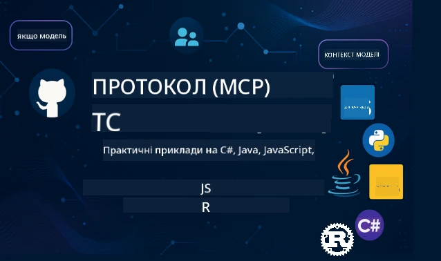

 

[](https://GitHub.com/microsoft/mcp-for-beginners/graphs/contributors)
[](https://GitHub.com/microsoft/mcp-for-beginners/issues)
[](https://GitHub.com/microsoft/mcp-for-beginners/pulls)
[](http://makeapullrequest.com)
[](https://mcptoplist.com/server/mcp.so%2Fmcp-for-beginners%2Fmicrosoft)

[](https://GitHub.com/microsoft/mcp-for-beginners/watchers)
[](https://GitHub.com/microsoft/mcp-for-beginners/fork)
[](https://GitHub.com/microsoft/mcp-for-beginners/stargazers)


[](https://discord.gg/nTYy5BXMWG)

Дотримуйтесь цих кроків, щоб почати користуватися цими ресурсами:
1. **Форкніть репозиторій**: Нажміть [](https://GitHub.com/microsoft/mcp-for-beginners/fork)
2. **Клонувати репозиторій**:   `git clone https://github.com/microsoft/mcp-for-beginners.git`
3. **Приєднайтесь до** [](https://discord.gg/nTYy5BXMWG)


### 🌐 Підтримка кількох мов

#### Підтримується через GitHub Action (автоматично та завжди актуально)

<!-- CO-OP TRANSLATOR LANGUAGES TABLE START -->
[Arabic](../ar/README.md) | [Bengali](../bn/README.md) | [Bulgarian](../bg/README.md) | [Burmese (Myanmar)](../my/README.md) | [Chinese (Simplified)](../zh-CN/README.md) | [Chinese (Traditional, Hong Kong)](../zh-HK/README.md) | [Chinese (Traditional, Macau)](../zh-MO/README.md) | [Chinese (Traditional, Taiwan)](../zh-TW/README.md) | [Croatian](../hr/README.md) | [Czech](../cs/README.md) | [Danish](../da/README.md) | [Dutch](../nl/README.md) | [Estonian](../et/README.md) | [Finnish](../fi/README.md) | [French](../fr/README.md) | [German](../de/README.md) | [Greek](../el/README.md) | [Hebrew](../he/README.md) | [Hindi](../hi/README.md) | [Hungarian](../hu/README.md) | [Indonesian](../id/README.md) | [Italian](../it/README.md) | [Japanese](../ja/README.md) | [Kannada](../kn/README.md) | [Khmer](../km/README.md) | [Korean](../ko/README.md) | [Lithuanian](../lt/README.md) | [Malay](../ms/README.md) | [Malayalam](../ml/README.md) | [Marathi](../mr/README.md) | [Nepali](../ne/README.md) | [Nigerian Pidgin](../pcm/README.md) | [Norwegian](../no/README.md) | [Persian (Farsi)](../fa/README.md) | [Polish](../pl/README.md) | [Portuguese (Brazil)](../pt-BR/README.md) | [Portuguese (Portugal)](../pt-PT/README.md) | [Punjabi (Gurmukhi)](../pa/README.md) | [Romanian](../ro/README.md) | [Russian](../ru/README.md) | [Serbian (Cyrillic)](../sr/README.md) | [Slovak](../sk/README.md) | [Slovenian](../sl/README.md) | [Spanish](../es/README.md) | [Swahili](../sw/README.md) | [Swedish](../sv/README.md) | [Tagalog (Filipino)](../tl/README.md) | [Tamil](../ta/README.md) | [Telugu](../te/README.md) | [Thai](../th/README.md) | [Turkish](../tr/README.md) | [Ukrainian](./README.md) | [Urdu](../ur/README.md) | [Vietnamese](../vi/README.md)

> **Віддаєте перевагу клонувати локально?**
>
> Цей репозиторій включає понад 50 мовних перекладів, що значно збільшує розмір завантаження. Щоб клонувати без перекладів, використовуйте sparse checkout:
>
> **Bash / macOS / Linux:**
> ```bash
> git clone --filter=blob:none --sparse https://github.com/microsoft/mcp-for-beginners.git
> cd mcp-for-beginners
> git sparse-checkout set --no-cone '/*' '!translations' '!translated_images'
> ```
>
> **CMD (Windows):**
> ```cmd
> git clone --filter=blob:none --sparse https://github.com/microsoft/mcp-for-beginners.git
> cd mcp-for-beginners
> git sparse-checkout set --no-cone "/*" "!translations" "!translated_images"
> ```
>
> Це надає вам усе необхідне для проходження курсу з набагато швидшим завантаженням.
<!-- CO-OP TRANSLATOR LANGUAGES TABLE END -->

# 🚀 Навчальна програма Model Context Protocol (MCP) для початківців

## **Вивчайте MCP на практичних прикладах коду C#, Java, JavaScript, Rust, Python та TypeScript**

## 🧠 Огляд навчальної програми Model Context Protocol
Ласкаво просимо на ваш шлях у світі Model Context Protocol! Якщо ви коли-небудь задавалися питанням, як AI-додатки спілкуються з різними інструментами та сервісами, ви ось-ось дізнаєтесь про елегантне рішення, яке змінює спосіб створення інтелектуальних систем розробниками.

Уявіть MCP як універсальний перекладач для AI-додатків – так само, як USB-порти дозволяють підключати будь-який пристрій до вашого комп’ютера, MCP дає змогу AI-моделям підключатися до будь-якого інструменту чи сервісу у стандартизований спосіб. Незалежно від того, чи створюєте ви свій перший чатбот, чи працюєте над складними AI-робочими процесами, розуміння MCP дасть вам змогу створювати потужніші та гнучкіші додатки.

Ця навчальна програма створена з увагою та терпінням для вашого навчального досвіду. Ми почнемо з простих концепцій, які ви вже розумієте, і поступово нарощуватимемо вашу експертизу через практичні вправи у вашій улюбленій мові програмування. Кожен крок містить чіткі пояснення, практичні приклади та багато підтримки на шляху.

До моменту завершення цієї програми у вас буде впевненість створювати власні MCP-сервери, інтегрувати їх із популярними AI-платформами та розуміти, як ця технологія змінює майбутнє розробки AI. Розпочнемо цю захоплюючу пригоду разом!

### Офіційна документація та специфікації

Ця навчальна програма відповідає **Специфікації MCP 2025-11-25** (остання стабільна версія). Специфікація MCP використовує нумерацію версій за датою (формат РРРР-ММ-ДД) для чіткого відстеження версій протоколу.

> **Погляд у майбутнє:** реліз-кандидат для наступної версії специфікації, **2026-07-28**, заплановано на 28 липня 2026 року. Вона робить протокол безстаном на транспортному рівні, формалізує фреймворк розширень (MCP Apps, Tasks), посилює авторизацію та позбавляється Roots, Sampling і Logging. Детальний огляд дивіться в [What's Changing in MCP: The 2026-07-28 Release Candidate](./01-CoreConcepts/mcp-2026-07-28-release-candidate.md).

Ці ресурси стають ціннішими з вашим зростанням розуміння, але не відчувайте тиску читати все одразу. Починайте з тих розділів, які вас цікавлять найперше!
- 📘 [Документація MCP](https://modelcontextprotocol.io/) – Цей ресурс стане вашим путівником із покроковими підручниками та керівництвами користувача. Документація написана з урахуванням початківців, з чіткими прикладами, за якими можна йти своїм темпом.
- 📜 [Специфікація MCP](https://modelcontextprotocol.io/specification/2025-11-25) – Розглядайте це як ваш комплексний довідник. Працюючи з навчальною програмою, ви будете повертатися сюди, щоб знайти конкретні деталі та досліджувати розширені функції.
- 📜 [Версії специфікації MCP](https://modelcontextprotocol.io/specification/versioning) – Містить інформацію про історію версій протоколу та як MCP використовує нумерацію версій за датою (формат РРРР-ММ-ДД).
- 🧑‍💻 [Репозиторій MCP на GitHub](https://github.com/modelcontextprotocol) – Тут ви знайдете SDK, інструменти та приклади коду різними мовами програмування. Це ніби скарбниця практичних прикладів і готових компонентів.
- 🌐 [Спільнота MCP](https://github.com/orgs/modelcontextprotocol/discussions) – Приєднуйтесь до інших учнів і досвідчених розробників для обговорень MCP. Це підтримуюча спільнота, де питання вітаються, а знання поширюються вільно.
  
## Навчальні цілі

Наприкінці цієї навчальної програми ви почуватиметеся впевнено і з ентузіазмом щодо своїх нових навичок. Ось чого ви досягнете:

• **Зрозуміти основи MCP**: Ви осягнете, що таке Model Context Protocol і чому він революціонізує спосіб взаємодії AI-додатків, використовуючи аналогії та приклади, які мають сенс.

• **Створити свій перший MCP-сервер**: Ви створите працюючий MCP-сервер обраною мовою програмування, починаючи з простих прикладів і поступово здобуваючи навички.

• **Підключити AI-моделі до реальних інструментів**: Ви навчитеся долати розрив між AI-моделями та реальними сервісами, надаючи вашим додаткам нові потужні можливості.

• **Реалізувати найкращі практики безпеки**: Ви зрозумієте, як робити MCP-будови безпечними, захищаючи як свої додатки, так і користувачів.

• **Здійснити розгортання з упевненістю**: Ви дізнаєтесь, як переходити з розробки до виробництва MCP-проектів, з практичними стратегіями розгортання, що працюють у реальному житті.

• **Приєднатися до спільноти MCP**: Ви станете частиною зростаючої спільноти розробників, які формують майбутнє розробки AI-додатків.

## Важливий базовий рівень знань

Перш ніж заглиблюватися в особливості MCP, переконаймося, що ви почуваєтесь комфортно з деякими фундаментальними поняттями. Не хвилюйтеся, якщо ви не експерт у цих сферах — ми пояснимо все, що потрібно знати по ходу!

### Розуміння протоколів (фундамент)

Уявіть собі протокол як правила для розмови. Коли ви телефонуєте другу, обидва знають, що треба сказати «привіт» під час відповіді, говорити по черзі і сказати «до побачення», коли розмова закінчена. Комп’ютерні програми теж потребують подібних правил для ефективного спілкування.

MCP — це протокол, набір узгоджених правил, які допомагають AI-моделям і додаткам мати продуктивні «розмови» з інструментами і сервісами. Так само, як правила розмови роблять людське спілкування плавнішим, MCP робить комунікацію AI-додатків значно надійнішою і потужнішою.

### Відносини клієнт-сервер (як працюють програми разом)

Ви вже щодня користуєтеся відносинами клієнт-сервер! Коли ви користуєтеся веб-браузером (клієнт) для відвідування сайту, ви підключаєтесь до веб-сервера, який надсилає вам вміст сторінки. Браузер знає, як запитувати інформацію, а сервер знає, як відповідати.

У MCP у нас подібні відносини: AI-моделі виступають як клієнти, які запитують інформацію чи дії, тоді як MCP-сервери надають ці можливості. Це ніби мати помічника (сервер), до якого AI може звернутися з конкретними завданнями.

### Чому стандартизація важлива (щоб усе працювало разом)

Уявіть, якби кожен виробник автомобілів використовував різні форми пальників для заправки пального — вам потрібен був би окремий адаптер для кожного автомобіля! Стандартизація означає погодження на спільні підходи, щоб усе працювало гармонійно.

MCP забезпечує цю стандартизацію для AI-додатків. Замість того, щоб кожна AI-модель потребувала спеціального коду для роботи з кожним інструментом, MCP створює універсальний спосіб їхньої комунікації. Це означає, що розробники можуть створити інструмент один раз і він працюватиме з багатьма різними AI-системами.

## 🧭 Огляд вашого навчального шляху

Ваш шлях у MCP ретельно структурований, щоб поступово будувати вашу впевненість і навички. Кожна фаза представляє нові концепції, одночасно закріплюючи раніше вивчене.

### 🌱 Фаза основ: розуміння базових понять (модулі 0–2)

Саме тут починається ваша пригода! Ми познайомимо вас із концепціями MCP, використовуючи знайомі аналогії та прості приклади. Ви зрозумієте, що таке MCP, навіщо він існує і як він вписується у ширший світ розробки AI.


• **Модуль 0 - Вступ до MCP**: Ми почнемо з дослідження, що таке MCP і чому він є таким важливим для сучасних AI-застосунків. Ви побачите реальні приклади роботи MCP і зрозумієте, як він вирішує поширені проблеми, з якими стикаються розробники.

• **Модуль 1 - Пояснення основних концепцій**: Тут ви дізнаєтесь про основні будівельні блоки MCP. Ми використаємо безліч аналогій та візуальних прикладів, щоб ці концепції були природними і зрозумілими.

• **Модуль 2 - Безпека в MCP**: Безпека може звучати лякаюче, але ми покажемо, як MCP включає вбудовані функції захисту та навчимо вас найкращим практикам, які захищають ваші застосунки з самого початку.

### 🔨 Фаза побудови: Створення ваших перших реалізацій (Модуль 3)

Тепер починається справжня цікавість! Ви отримаєте практичний досвід створення реальних MCP серверів і клієнтів. Не хвилюйтеся — ми почнемо з простого і проведемо вас через кожен крок.

Цей модуль включає декілька покрокових інструкцій, які дозволять вам практикуватись у вашій улюбленій мові програмування. Ви створите свій перший сервер, розробите клієнта для підключення до нього, а також інтегруєтесь з популярними інструментами розробки, як VS Code.

Кожен посібник містить повні приклади коду, поради з усунення несправностей і пояснення, чому ми робимо конкретні архітектурні рішення. Наприкінці цієї фази у вас будуть робочі реалізації MCP, якими ви зможете пишатися!

### 🚀 Фаза зростання: Розвинуті концепції та реальні застосування (Модулі 4-5)

Опановуючи основи, ви готові дослідити більш складні функції MCP. Ми розглянемо практичні стратегії впровадження, методи налагодження та розвинуті теми, як інтеграція мульти-модальних AI.

Ви також навчитесь масштабувати ваші реалізації MCP для виробничого використання та інтегрувати їх з хмарними платформами, як Azure. Ці модулі готують вас до створення MCP рішень, які витримають реальні навантаження.

### 🌟 Фаза оволодіння: Спільнота та спеціалізація (Модулі 6-11)

Остання фаза зосереджена на приєднанні до спільноти MCP та спеціалізації в галузях, що вас цікавлять найбільше. Ви навчитесь робити внесок у відкриті проекти MCP, впроваджувати розвинені моделі аутентифікації та створювати комплексні рішення з інтеграцією баз даних.

Особливу увагу заслуговує Модуль 11 — це повний курс з 13 лабораторій, який навчає створювати готові до виробництва MCP сервери з інтеграцією PostgreSQL. Це як підсумковий проєкт, що об’єднує все, чому ви навчилися!

### 📚 Повна структура навчальної програми

| Модуль | Тема | Опис | Посилання |
|--------|-------|-------------|------|
| **Модулі 0-3: Основи** | | | |
| 00 | Вступ до MCP | Огляд Протоколу Контексту Моделі та його значення в AI-конвеєрах | [Read more](./00-Introduction/README.md) |
| 01 | Пояснення основних концепцій | Детальний розгляд основних понять MCP | [Read more](./01-CoreConcepts/README.md) |
| 1.1 | Що змінюється в MCP (2026-07-28 RC) | Безстанний протокол, Фреймворк розширень та видалення функцій у наступній версії специфікації | [Guide](./01-CoreConcepts/mcp-2026-07-28-release-candidate.md) |
| 02 | Безпека в MCP | Загрози безпеці та найкращі практики | [Read more](./02-Security/README.md) |
| 03 | Початок роботи з MCP | Налаштування середовища, базові сервери/клієнти, інтеграція | [Read more](./03-GettingStarted/README.md) |
| **Модуль 3: Створення вашого першого сервера і клієнта** | | | |
| 3.1 | Перший сервер | Створіть свій перший MCP сервер | [Guide](./03-GettingStarted/01-first-server/README.md) |
| 3.2 | Перший клієнт | Розробіть базовий MCP клієнт | [Guide](./03-GettingStarted/02-client/README.md) |
| 3.3 | Клієнт з LLM | Інтеграція великих мовних моделей | [Guide](./03-GettingStarted/03-llm-client/README.md) |
| 3.4 | Інтеграція VS Code | Використання MCP серверів у VS Code | [Guide](./03-GettingStarted/04-vscode/README.md) |
| 3.5 | Сервер stdio | Створення серверів з використанням транспорту stdio | [Guide](./03-GettingStarted/05-stdio-server/README.md) |
| 3.6 | HTTP потокове передавання | Реалізація HTTP стрімінгу в MCP | [Guide](./03-GettingStarted/06-http-streaming/README.md) |
| 3.7 | Microsoft Foundry Toolkit | Використання Microsoft Foundry Toolkit з MCP | [Guide](./03-GettingStarted/07-aitk/README.md) |
| 3.8 | Тестування | Тестування вашої реалізації MCP сервера | [Guide](./03-GettingStarted/08-testing/README.md) |
| 3.9 | Розгортання | Розгортання MCP серверів у виробництво | [Guide](./03-GettingStarted/09-deployment/README.md) |
| 3.10 | Розвинене використання серверів | Використання розвинених серверів для просунутих функцій та покращеної архітектури | [Guide](./03-GettingStarted/10-advanced/README.md) |
| 3.11 | Проста аутентифікація | Розділ, що показує аутентифікацію з початку і RBAC | [Guide](./03-GettingStarted/11-simple-auth/README.md) |
| 3.12 | MCP Хости | Налаштування Claude Desktop, Cursor, Cline та інших MCP хостів | [Guide](./03-GettingStarted/12-mcp-hosts/README.md) |
| 3.13 | MCP Інспектор | Налагодження та тестування MCP серверів за допомогою інструменту Inspector | [Guide](./03-GettingStarted/13-mcp-inspector/README.md) |
| 3.14 | Семплювання | Використання семплювання для співпраці з клієнтом | [Guide](./03-GettingStarted/14-sampling/README.md) |
| 3.15 | MCP Додатки | Створення MCP додатків | [Guide](./03-GettingStarted/15-mcp-apps/README.md) |
| **Модулі 4-5: Практичні та розвинуті теми** | | | |
| 04 | Практична реалізація | SDK, налагодження, тестування, повторне використання шаблонів запитів | [Read more](./04-PracticalImplementation/README.md) |
| 4.1 | Пагінація | Обробка великих наборів результатів за допомогою пагінації на основі курсору | [Guide](./04-PracticalImplementation/pagination/README.md) |
| 05 | Розвинуті теми MCP | Мульти-модальний AI, масштабування, корпоративне використання | [Read more](./05-AdvancedTopics/README.md) |
| 5.1 | Інтеграція з Azure | Інтеграція MCP з Azure | [Guide](./05-AdvancedTopics/mcp-integration/README.md) |
| 5.2 | Мульти-модальність | Робота з кількома модальностями | [Guide](./05-AdvancedTopics/mcp-multi-modality/README.md) |
| 5.3 | Демонстрація OAuth2 | Впровадження аутентифікації OAuth2 | [Guide](./05-AdvancedTopics/mcp-oauth2-demo/README.md) |
| 5.4 | Кореневі контексти | Розуміння та реалізація кореневих контекстів | [Guide](./05-AdvancedTopics/mcp-root-contexts/README.md) |
| 5.5 | Маршрутизація | Стратегії маршрутизації MCP | [Guide](./05-AdvancedTopics/mcp-routing/README.md) |
| 5.6 | Семплювання | Техніки семплювання в MCP | [Guide](./05-AdvancedTopics/mcp-sampling/README.md) |
| 5.7 | Масштабування | Масштабування реалізацій MCP | [Guide](./05-AdvancedTopics/mcp-scaling/README.md) |
| 5.8 | Безпека | Розвинуті аспекти безпеки | [Guide](./05-AdvancedTopics/mcp-security/README.md) |
| 5.9 | Веб-пошук | Реалізація можливостей веб-пошуку | [Guide](./05-AdvancedTopics/web-search-mcp/README.md) |
| 5.10 | Потокове передавання в реальному часі | Створення функціоналу потокового передавання в реальному часі | [Guide](./05-AdvancedTopics/mcp-realtimestreaming/README.md) |
| 5.11 | Пошук в реальному часі | Реалізація пошуку в реальному часі | [Guide](./05-AdvancedTopics/mcp-realtimesearch/README.md) |
| 5.12 | Аутентифікація Entra ID | Аутентифікація з Microsoft Entra ID | [Guide](./05-AdvancedTopics/mcp-security-entra/README.md) |
| 5.13 | Інтеграція Foundry | Інтеграція з Microsoft Foundry | [Guide](./05-AdvancedTopics/mcp-foundry-agent-integration/README.md) |
| 5.14 | Інженерія контексту | Техніки ефективної інженерії контексту | [Guide](./05-AdvancedTopics/mcp-contextengineering/README.md) |
| 5.15 | Користувацький транспорт MCP | Реалізації користувацьких транспортів | [Guide](./05-AdvancedTopics/mcp-transport/README.md) |
| 5.16 | Особливості протоколу | Повідомлення про прогрес, скасування, шаблони ресурсів | [Guide](./05-AdvancedTopics/mcp-protocol-features/README.md) |
| 5.17 | Протистояння мульті-агентів | Два агенти сперечаються, використовуючи спільні MCP інструменти, оцінює агент-арбітр | [Guide](./05-AdvancedTopics/mcp-adversarial-agents/README.md) |
| **Модулі 6-10: Спільнота та найкращі практики** | | | |
| 06 | Внесок спільноти | Як робити внесок в екосистему MCP | [Guide](./06-CommunityContributions/README.md) |
| 07 | Враження від раннього впровадження | Реальні історії впровадження | [Guide](./07-LessonsfromEarlyAdoption/README.md) |
| 08 | Найкращі практики MCP | Продуктивність, відмовостійкість, стійкість | [Guide](./08-BestPractices/README.md) |
| 09 | Кейси MCP | Практичні приклади реалізації | [Guide](./09-CaseStudy/README.md) |
| 10 | Практичний семінар | Створення MCP сервера з Microsoft Foundry Toolkit | [Lab](./10-StreamliningAIWorkflowsBuildingAnMCPServerWithAIToolkit/README.md) |
| **Модуль 11: Лабораторія MCP Server Hands On** | | | |
| 11 | Інтеграція MCP Server з базою даних | Повний курс з 13 лабораторій для інтеграції з PostgreSQL | [Labs](./11-MCPServerHandsOnLabs/README.md) |
| 11.1 | Вступ | Огляд MCP з інтеграцією бази даних та кейсом роздрібної аналітики | [Lab 00](./11-MCPServerHandsOnLabs/00-Introduction/README.md) |
| 11.2 | Основна архітектура | Розуміння архітектури MCP сервера, шарів бази даних і патернів безпеки | [Lab 01](./11-MCPServerHandsOnLabs/01-Architecture/README.md) |
| 11.3 | Безпека та мультиорендність | Безпека на рівні рядків, аутентифікація і доступ до даних у мультиорендній середовищі | [Lab 02](./11-MCPServerHandsOnLabs/02-Security/README.md) |
| 11.4 | Налаштування середовища | Налаштування середовища розробки, Docker, Azure ресурси | [Lab 03](./11-MCPServerHandsOnLabs/03-Setup/README.md) |
| 11.5 | Проєктування бази даних | Налаштування PostgreSQL, дизайн схеми роздрібної торгівлі та зразки даних | [Lab 04](./11-MCPServerHandsOnLabs/04-Database/README.md) |
| 11.6 | Реалізація MCP сервера | Побудова FastMCP сервера з інтеграцією бази даних | [Lab 05](./11-MCPServerHandsOnLabs/05-MCP-Server/README.md) |
| 11.7 | Розробка інструментів | Створення інструментів для запитів до бази та інспекції схем | [Lab 06](./11-MCPServerHandsOnLabs/06-Tools/README.md) |
| 11.8 | Семантичний пошук | Реалізація векторних ембеддінгів з Azure OpenAI та pgvector | [Lab 07](./11-MCPServerHandsOnLabs/07-Semantic-Search/README.md) |
| 11.9 | Тестування та налагодження | Стратегії тестування, інструменти налагодження та підходи валідації | [Lab 08](./11-MCPServerHandsOnLabs/08-Testing/README.md) |
| 11.10 | Інтеграція VS Code | Налаштування інтеграції MCP з VS Code та використання AI Chat | [Lab 09](./11-MCPServerHandsOnLabs/09-VS-Code/README.md) |
| 11.11 | Стратегії розгортання | Розгортання в Docker, Azure Container Apps та питання масштабування | [Lab 10](./11-MCPServerHandsOnLabs/10-Deployment/README.md) |
| 11.12 | Моніторинг | Application Insights, логування, моніторинг продуктивності | [Lab 11](./11-MCPServerHandsOnLabs/11-Monitoring/README.md) |
| 11.13 | Найкращі практики | Оптимізація продуктивності, підвищення безпеки та поради для виробництва | [Lab 12](./11-MCPServerHandsOnLabs/12-Best-Practices/README.md) |
| **Модуль 12: Інструменти MCP** | | | |
| 12.1 | Інструментальні засоби | Використання MCP у Copilot App | [ Guide ](./12-tooling/README.md) |

### 💻 Приклади проектів з кодом

Однією з найцікавіших частин навчання MCP є поступове вдосконалення ваших навичок кодування. Ми розробили наші приклади коду так, щоб починати просто і ставати більш складними, коли ваше розуміння поглиблюється. Ось як ми вводимо концепції — з кодом, який легко зрозуміти, але який демонструє реальні принципи MCP, ви зрозумієте не лише те, що робить цей код, а й чому він структурований саме так і як він вписується у великі MCP застосунки.

#### Основні приклади калькулятора MCP

| Мова | Опис | Посилання |
|----------|-------------|------|

| C# | Приклад MCP сервера | [Переглянути код](./03-GettingStarted/samples/csharp/README.md) |
| Java | Калькулятор MCP | [Переглянути код](./03-GettingStarted/samples/java/calculator/README.md) |
| JavaScript | Демонстрація MCP | [Переглянути код](./03-GettingStarted/samples/javascript/README.md) |
| Python | MCP сервер | [Переглянути код](../../03-GettingStarted/samples/python/mcp_calculator_server.py) |
| TypeScript | Приклад MCP | [Переглянути код](./03-GettingStarted/samples/typescript/README.md) |
| Rust | Приклад MCP | [Переглянути код](./03-GettingStarted/samples/rust/README.md) |

#### Просунуті реалізації MCP

| Мова | Опис | Посилання |
|----------|-------------|------|
| C# | Просунутий приклад | [Переглянути код](./04-PracticalImplementation/samples/csharp/README.md) |
| Java з Spring | Приклад контейнерного додатку | [Переглянути код](./04-PracticalImplementation/samples/java/containerapp/README.md) |
| JavaScript | Просунутий приклад | [Переглянути код](./04-PracticalImplementation/samples/javascript/README.md) |
| Python | Складна реалізація | [Переглянути код](./04-PracticalImplementation/samples/python/README.md) |
| TypeScript | Контейнерний приклад | [Переглянути код](./04-PracticalImplementation/samples/typescript/README.md) |


## 🎯 Передумови для вивчення MCP

Щоб максимально ефективно використовувати цю програму навчання, вам слід мати:

- Базові знання програмування принаймні однієї з наступних мов: C#, Java, JavaScript, Python або TypeScript
- Розуміння моделі клієнт-сервер та API
- Знайомство з концепціями REST та HTTP
- (За бажанням) Базові знання у сфері штучного інтелекту/машинного навчання

- Участь у наших спільнотах для отримання підтримки

## 📚 Посібник з навчання та ресурси

Цей репозиторій включає кілька ресурсів, які допоможуть вам ефективно орієнтуватися та вчитися:

### Посібник з навчання

Доступний всебічний [Посібник з навчання](./study_guide.md), який допоможе вам ефективно орієнтуватися в цьому репозиторії. Ця візуальна карта курсу показує, як всі теми пов'язані між собою, і містить вказівки щодо ефективного використання демонстраційних проектів. Особливо корисний тим, хто краще сприймає інформацію візуально і хоче бачити загальну картину.

Посібник включає:
- Візуальну карту курсу зі всіма темами
- Детальний розбір кожного розділу репозиторію
- Вказівки щодо використання демонстраційних проектів
- Рекомендовані навчальні шляхи для різних рівнів підготовки
- Додаткові ресурси для підтримки вашого навчального шляху

### Журнал змін

Ми підтримуємо детальний [Журнал змін](./changelog.md), який відстежує всі значущі оновлення навчальних матеріалів, щоб ви могли бути в курсі останніх поліпшень та доповнень.
- Додання нового контенту
- Структурні зміни
- Покращення функцій
- Оновлення документації

## 🛠️ Як ефективно користуватися цим курсом

Кожен урок у цьому посібнику містить:

1. Чітке пояснення концепцій MCP  
2. Практичні приклади коду на кількох мовах  
3. Вправи для створення реальних MCP додатків  
4. Додаткові ресурси для просунутих учнів

### Навчаймось MCP з C# - серія уроків
Давайте познайомимось з Model Context Protocol (MCP) — передовою платформою для стандартизації взаємодії між AI моделями та клієнтськими додатками. Через цю сесію для початківців ми ознайомимо вас з MCP і допоможемо створити ваш перший MCP сервер.
#### C#: [https://aka.ms/letslearnmcp-csharp](https://aka.ms/letslearnmcp-csharp)
#### Java: [https://aka.ms/letslearnmcp-java](https://aka.ms/letslearnmcp-java)
#### JavaScript: [https://aka.ms/letslearnmcp-javascript](https://aka.ms/letslearnmcp-javascript)
#### Python: [https://aka.ms/letslearnmcp-python](https://aka.ms/letslearnmcp-python)

## 🎓 Ваш шлях MCP починається

Вітаємо! Ви щойно зробили перший крок у захоплюючій подорожі, яка розширить ваші програмістські можливості та познайомить із передовими розробками в галузі AI.

### Що ви вже досягли

Прочитавши це введення, ви вже почали будувати свою базу знань MCP. Ви розумієте, що таке MCP, чому це важливо, і як цей курс підтримуватиме ваш навчальний процес. Це велике досягнення — початок вашої експертності в цій важливій технології.

### Пригода попереду

Прогресуючи через модулі, пам'ятайте, що кожен експерт колись був початківцем. Концепції, які зараз можуть здаватися складними, стануть звичними, якщо ви будете практикувати та застосовувати їх. Кожен маленький крок наближає вас до потужних можливостей, які служитимуть вам упродовж усього кар’єрного шляху розробника.

### Ваша мережа підтримки

Ви приєднуєтеся до спільноти учнів та експертів, які захоплені MCP і раді допомагати іншим досягати успіху. Чи застрягли ви на завданні, чи хочете поділитися проривом — спільнота тут, щоб підтримати вас.

Якщо у вас виникають труднощі або запитання щодо створення AI-додатків. Приєднуйтесь до дискусій із іншими учнями та досвідченими розробниками про MCP. Це дружнє середовище, де питання вітаються, а знання щедро діляться.

[](https://discord.gg/nTYy5BXMWG)

Якщо у вас є відгуки про продукт або помилки під час розробки, відвідайте:

[](https://aka.ms/foundry/forum)

### Готові почати?

Ваша пригода з MCP починається зараз! Розпочніть з Модуля 0, щоб зануритися у ваш перший практичний досвід роботи з MCP, або дослідіть демонстраційні проекти, щоб побачити, що ви будете створювати. Пам’ятайте — кожен експерт починав саме там, де ви зараз, і з терпінням та практикою ви здивуєтесь своїм досягненням.

Ласкаво просимо у світ розробки Model Context Protocol. Побудуємо щось дивовижне разом!

## 🤝 Внесок у спільноту навчання

Цей курс стає кращим завдяки внескам учнів, як ви! Чи виправляєте ви опечатку, чи пропонуєте зрозуміліше пояснення, чи додаєте новий приклад — ваш вклад допомагає іншим початківцям досягати успіху.

Подяка Microsoft Valued Professional [Shivam Goyal](https://www.linkedin.com/in/shivam2003/) за внесок у приклади коду.

Процес внеску спроєктований так, щоб бути привітним і підтримуючим. Більшість внесків вимагають Contributor License Agreement (CLA), але автоматизовані інструменти допоможуть вам пройти цей процес без проблем.

## 📜 Відкрите навчання

Увесь цей курс доступний під ліцензією MIT [LICENSE](../../LICENSE), що означає, що ви можете вільно використовувати, модифікувати та ділитися ним. Це підтримує нашу мету зробити знання MCP доступними для розробників усюди.
## 🤝 Керівництво для внесків

Цей проєкт вітає внески та пропозиції. Більшість внесків вимагають вашої згоди з
Contributor License Agreement (CLA), що підтверджує ваше право і фактичний дозвіл надати
нам права на використання вашого внеску. Деталі за адресою <https://cla.opensource.microsoft.com>.

Коли ви подаєте pull request, бот CLA автоматично визначає, чи потрібно вам надати
CLA і маркує PR відповідно (наприклад, статус, коментар). Просто виконуйте інструкції,
які надає бот. Вам потрібно робити це лише один раз для всіх репозиторіїв із нашим CLA.

Цей проєкт прийняв [Microsoft Open Source Code of Conduct](https://opensource.microsoft.com/codeofconduct/).
Для додаткової інформації дивіться [Code of Conduct FAQ](https://opensource.microsoft.com/codeofconduct/faq/) або
зв’яжіться з [opencode@microsoft.com](mailto:opencode@microsoft.com) із будь-якими запитаннями або коментарями.

---

*Готові почати свою подорож MCP? Розпочніть з [Модуля 00 - Вступ до MCP](./00-Introduction/README.md) та зробіть перші кроки у світі розробки Model Context Protocol!*


## 🎒 Інші курси
Наша команда також створює інші курси! Ознайомтесь:

<!-- CO-OP TRANSLATOR OTHER COURSES START -->
### LangChain
[](https://aka.ms/langchain4j-for-beginners)
[](https://aka.ms/langchainjs-for-beginners?WT.mc_id=m365-94501-dwahlin)
[](https://github.com/microsoft/langchain-for-beginners?WT.mc_id=m365-94501-dwahlin)
---

### Azure / Edge / MCP / Агенти
[](https://github.com/microsoft/AZD-for-beginners?WT.mc_id=academic-105485-koreyst)
[](https://github.com/microsoft/edgeai-for-beginners?WT.mc_id=academic-105485-koreyst)
[](https://github.com/microsoft/mcp-for-beginners?WT.mc_id=academic-105485-koreyst)
[](https://github.com/microsoft/ai-agents-for-beginners?WT.mc_id=academic-105485-koreyst)

---
 
### Серія про генеративний AI
[](https://github.com/microsoft/generative-ai-for-beginners?WT.mc_id=academic-105485-koreyst)
[-9333EA?style=for-the-badge&labelColor=E5E7EB&color=9333EA)](https://github.com/microsoft/Generative-AI-for-beginners-dotnet?WT.mc_id=academic-105485-koreyst)
[-C084FC?style=for-the-badge&labelColor=E5E7EB&color=C084FC)](https://github.com/microsoft/generative-ai-for-beginners-java?WT.mc_id=academic-105485-koreyst)
[-E879F9?style=for-the-badge&labelColor=E5E7EB&color=E879F9)](https://github.com/microsoft/generative-ai-with-javascript?WT.mc_id=academic-105485-koreyst)

---
 
### Основне навчання
[](https://aka.ms/ml-beginners?WT.mc_id=academic-105485-koreyst)
[](https://aka.ms/datascience-beginners?WT.mc_id=academic-105485-koreyst)
[](https://aka.ms/ai-beginners?WT.mc_id=academic-105485-koreyst)

[](https://github.com/microsoft/Security-101?WT.mc_id=academic-96948-sayoung)
[](https://aka.ms/webdev-beginners?WT.mc_id=academic-105485-koreyst)
[](https://aka.ms/iot-beginners?WT.mc_id=academic-105485-koreyst)
[](https://github.com/microsoft/xr-development-for-beginners?WT.mc_id=academic-105485-koreyst)

---
 
### Серія Copilot
[](https://aka.ms/GitHubCopilotAI?WT.mc_id=academic-105485-koreyst)
[](https://github.com/microsoft/mastering-github-copilot-for-dotnet-csharp-developers?WT.mc_id=academic-105485-koreyst)
[](https://github.com/microsoft/CopilotAdventures?WT.mc_id=academic-105485-koreyst)
<!-- CO-OP TRANSLATOR OTHER COURSES END -->

---

<!-- CO-OP TRANSLATOR DISCLAIMER START -->
**Відмова від відповідальності**:
Цей документ було перекладено за допомогою сервісу штучного інтелекту для перекладу [Co-op Translator](https://github.com/Azure/co-op-translator). Хоча ми прагнемо до точності, будь ласка, майте на увазі, що автоматичні переклади можуть містити помилки або неточності. Оригінальний документ рідною мовою слід вважати авторитетним джерелом. Для критично важливої інформації рекомендується професійний людський переклад. Ми не несемо відповідальності за будь-які непорозуміння або неправильні тлумачення, що виникли внаслідок використання цього перекладу.
<!-- CO-OP TRANSLATOR DISCLAIMER END -->