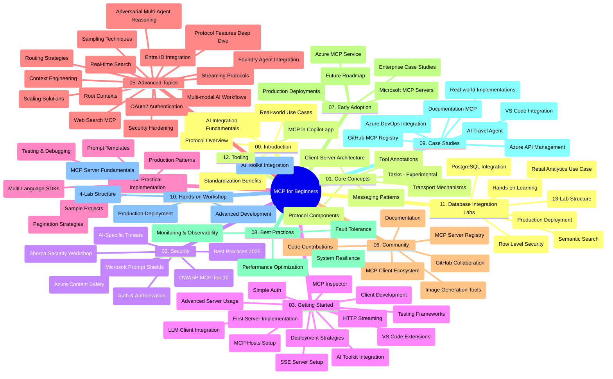

# Протокол Контексту Моделі (MCP) для Початківців - Навчальний Посібник

Цей навчальний посібник надає огляд структури та змісту сховища для навчальної програми "Протокол Контексту Моделі (MCP) для Початківців". Використовуйте цей посібник, щоб ефективно орієнтуватися в сховищі та максимально використовувати доступні ресурси.

## Огляд Сховища

Протокол Контексту Моделі (MCP) є стандартизованою основою для взаємодії між AI-моделями та клієнтськими додатками. Спершу створений Anthropic, MCP зараз підтримується ширшою спільнотою MCP через офіційну організацію на GitHub. Це сховище надає всебічну навчальну програму з практичними прикладами коду на C#, Java, JavaScript, Python та TypeScript, розроблену для AI-розробників, системних архітекторів і програмних інженерів.

## Візуальна Карта Навчальної Програми

## Структура Сховища

Сховище організоване у дванадцять основних розділів, кожен з яких зосереджений на різних аспектах MCP:

1. **Вступ (00-Introduction/)**
   - Огляд Протоколу Контексту Моделі
   - Чому стандартизація важлива в AI-процесах
   - Практичні випадки використання та переваги

2. **Основні Концепції (01-CoreConcepts/)**
   - Клієнт-серверна архітектура
   - Ключові компоненти протоколу
   - Патерни обміну повідомленнями в MCP
   - Поточна специфікація: [Що змінилося в MCP: Специфікація станом на 2026-07-28](./01-CoreConcepts/mcp-2026-07-28.md) — безстанне ядро протоколу, рамки розширень та припинення використання Roots/Sampling/Logging

3. **Безпека (02-Security/)**
   - Загрози безпеці в системах на базі MCP
   - Кращі практики для захисту реалізацій
   - Стратегії автентифікації та авторизації
   - Практичний [зразок авторизації CIMD і DCR](./02-Security/samples/cimd-dcr-auth/README.md)
   - **Вичерпна документація з безпеки**:
     - Кращі практики безпеки MCP
     - Посібник з реалізації Azure Content Safety
     - Контрольні механізми та техніки безпеки MCP
     - Швидкий довідник кращих практик MCP
   - **Ключові теми безпеки**:
     - Атаки шляхом інжекції підказок та отруєння інструментів
     - Викрадення сесій та проблеми confused deputy
     - Уразливості при передачі токенів
     - Надмірні права доступу та контроль доступу
     - Безпека ланцюга постачання для AI-компонентів
     - Інтеграція Microsoft Prompt Shields

4. **Початок Роботи (03-GettingStarted/)**
   - Налаштування середовища та конфігурації
   - Створення базових серверів і клієнтів MCP
   - Інтеграція з існуючими додатками
   - Включає розділи для:
     - Першої реалізації сервера
     - Розробки клієнта
     - Інтеграції LLM клієнта
     - Інтеграції з VS Code
     - Серверу з подіями, що надсилаються сервером (SSE)
     - Розширеного використання сервера
     - HTTP-стримінгу
     - Інтеграції AI Toolkit
     - Стратегій тестування
     - Керівництва з розгортання

5. **Практична Реалізація (04-PracticalImplementation/)**
   - Використання SDK у різних мовах програмування
   - Техніки відлагодження, тестування та валідації
   - Створення багаторазових шаблонів підказок і робочих процесів
   - Прикладні проекти з прикладами реалізації

6. **Просунуті Теми (05-AdvancedTopics/)**
   - Техніки контекстного інженерування
   - Інтеграція агента Foundry
   - Багатомодальні AI робочі процеси
   - Демонстрації автентифікації через OAuth2
   - Можливості пошуку в режимі реального часу
   - Стримінг у реальному часі
   - Реалізація кореневих контекстів
   - Маршрутизаційні стратегії
   - Техніки вибірки
   - Підходи до масштабування
   - Врахування питань безпеки
   - Інтеграція безпеки Entra ID
   - Інтеграція веб-пошуку
   - Протидія багатозначному агентському міркуванню (патерни дебатів)

7. **Внески Спільноти (06-CommunityContributions/)**
   - Як вносити код та документацію
   - Співпраця через GitHub
   - Покращення, ініційовані спільнотою, та відгуки
   - Використання різних MCP клієнтів (Claude Desktop, Cline, VSCode)
   - Робота з популярними MCP серверами, включно з генерацією зображень

8. **Уроки Раннього Впровадження (07-LessonsfromEarlyAdoption/)**
   - Реальні впровадження та історії успіху
   - Побудова та розгортання рішень на базі MCP
   - Тенденції та майбутня дорожня карта
   - **Посібник з Microsoft MCP Серверів**: всебічний посібник по 10 готовим до виробництва Microsoft MCP серверам, що включає:
     - Microsoft Learn Docs MCP Server
     - Azure MCP Server (15+ спеціалізованих конекторів)
     - GitHub MCP Server
     - Azure DevOps MCP Server
     - MarkItDown MCP Server
     - SQL Server MCP Server
     - Playwright MCP Server
     - Dev Box MCP Server
     - Microsoft Foundry MCP Server
     - Microsoft 365 Agents Toolkit MCP Server

9. **Кращі Практики (08-BestPractices/)**
   - Налаштування продуктивності та оптимізація
   - Проектування відмовостійких MCP систем
   - Стратегії тестування та стійкості

10. **Кейс-стаді (09-CaseStudy/)**
    - **Сім комплексних кейс-стаді**, що демонструють універсальність MCP у різних сценаріях:
    - **Azure AI Travel Agents**: координація багатьох агентів з Azure OpenAI та AI Search
    - **Інтеграція Azure DevOps**: автоматизація робочих процесів з оновленнями даних з YouTube
    - **Отримання документації в реальному часі**: клієнт консолі на Python зі стрімінгом HTTP
    - **Інтерактивний генератор навчального плану**: веб-додаток Chainlit з розмовним AI
    - **Документація в редакторі**: інтеграція VS Code з робочими процесами GitHub Copilot
    - **Azure API Management**: інтеграція корпоративних API зі створенням MCP серверів
    - **GitHub MCP Registry**: розвиток екосистеми та платформа для агентної інтеграції
    - Приклади реалізації, що охоплюють інтеграцію в корпоративному середовищі, підвищення продуктивності розробників та розвиток екосистеми

11. **Практичний Майстер-клас (10-StreamliningAIWorkflowsBuildingAnMCPServerWithAIToolkit/)**
    - Всебічний практичний майстер-клас, що поєднує MCP з AI Toolkit
    - Побудова інтелектуальних додатків, що об'єднують AI-моделі з реальними інструментами
    - Практичні модулі, що охоплюють основи, розробку користувацьких серверів та стратегії виробничого розгортання
    - **Структура лабораторій**:
      - Лабораторія 1: Основи MCP Серверів
      - Лабораторія 2: Розширена розробка MCP Серверів
      - Лабораторія 3: Інтеграція AI Toolkit
      - Лабораторія 4: Виробниче розгортання та масштабування
    - Навчання на основі лабораторій зі покроковими інструкціями

12. **Лабораторії інтеграції MCP Серверів з Базами Даних (11-MCPServerHandsOnLabs/)**
    - **Всебічний навчальний маршрут з 13 лабораторій** для побудови MCP серверів, готових до виробництва, з інтеграцією PostgreSQL
    - **Реалізація аналітики роздрібної торгівлі у реальному світі** із використанням кейсу Zava Retail
    - **Підприємницькі шаблони** включно з контролем доступу на рівні рядків (RLS), семантичним пошуком та багатокористувацьким доступом до даних
    - **Повна структура лабораторій**:
      - **Лабораторії 00-03: Основи** - Вступ, Архітектура, Безпека, Налаштування Середовища
      - **Лабораторії 04-06: Побудова MCP Сервера** - Проектування бази даних, Реалізація MCP Сервера, Розробка Інструментів

      - **Лабораторні роботи 07-09: Розширені функції** - Семантичний пошук, тестування та відлагодження, інтеграція з VS Code
      - **Лабораторні роботи 10-12: Виробництво та найкращі практики** - Розгортання, моніторинг, оптимізація
    - **Технології, що розглядаються**: фреймворк FastMCP, PostgreSQL, Azure OpenAI, Azure Container Apps, Application Insights
    - **Навчальні результати**: MCP сервери, готові до виробництва, патерни інтеграції баз даних, аналітика на базі штучного інтелекту, корпоративна безпека

13. **Інструменти (12-tooling/)**
    - Навчіться використовувати MCP у додатку Copilot та інших інструментах

## Додаткові ресурси

Репозиторій включає супровідні ресурси:

- **Папка з зображеннями**: містить діаграми та ілюстрації, які використовуються протягом програми
- **Переклади**: багатомовна підтримка з автоматизованими перекладами документації
- **Офіційні ресурси MCP**:
  - [Документація MCP](https://modelcontextprotocol.io/)
  - [Специфікація MCP](https://modelcontextprotocol.io/specification/2026-07-28/)
  - [Репозиторій MCP на GitHub](https://github.com/modelcontextprotocol)

## Як використовувати цей репозиторій

1. **Послідовне навчання**: слідуйте за розділами по порядку (з 00 до 11) для структурованого навчання.
2. **Фокус на певну мову програмування**: якщо ви зацікавлені у конкретній мові, досліджуйте каталоги з прикладами реалізацій на обраній мові.
3. **Практична реалізація**: почніть із розділу «Початок роботи», щоб налаштувати середовище та створити свій перший MCP сервер і клієнта.
4. **Поглиблене вивчення**: після освоєння основ переходьте до розширених тем для розширення знань.
5. **Взаємодія з спільнотою**: приєднуйтесь до спільноти MCP через обговорення на GitHub та канали Discord, щоб спілкуватись з експертами та іншими розробниками.

## MCP клієнти та інструменти

Програма охоплює різноманітні MCP клієнти та інструменти:

1. **Офіційні клієнти**:
   - Visual Studio Code 
   - MCP у Visual Studio Code
   - Claude Desktop
   - Claude у VSCode 
   - Claude API

2. **Клієнти спільноти**:
   - Cline (термінальний)
   - Cursor (редактор коду)
   - ChatMCP
   - Windsurf

3. **Інструменти управління MCP**:
   - MCP CLI
   - MCP Manager
   - MCP Linker
   - MCP Router

## Популярні MCP сервери

У репозиторії представлені різні MCP сервери, серед яких:

1. **Офіційні MCP сервери Microsoft**:
   - MCP сервер Microsoft Learn Docs
   - Azure MCP сервер (понад 15 спеціалізованих конекторів)
   - GitHub MCP сервер
   - Azure DevOps MCP сервер
   - MarkItDown MCP сервер
   - SQL Server MCP сервер
   - Playwright MCP сервер
   - Dev Box MCP сервер
   - Microsoft Foundry MCP сервер
   - Microsoft 365 Agents Toolkit MCP сервер

2. **Офіційні референсні сервери**:
   - Файлова система
   - Fetch
   - Пам’ять
   - Послідовне мислення

3. **Генерація зображень**:
   - Azure OpenAI DALL-E 3
   - Stable Diffusion WebUI
   - Replicate

4. **Інструменти розробки**:
   - Git MCP
   - Terminal Control
   - Code Assistant

5. **Спеціалізовані сервери**:
   - Salesforce
   - Microsoft Teams
   - Jira & Confluence

## Участь у проектах

Цей репозиторій вітає внески від спільноти. Дивіться розділ про внески спільноти для отримання рекомендацій, як ефективно долучитись до екосистеми MCP.

----

*Цей посібник оновлено востаннє 9 вересня 2026 року. Він відображає
Специфікацію MCP `2026-07-28` — поточну ревізію протоколу. Деякі практичні
приклади залишаються явно версійованими до `2025-11-25`, тоді як їх SDK та інструменти
використовують безстатеві API протоколу.*

---

<!-- CO-OP TRANSLATOR DISCLAIMER START -->
**Відмова від відповідальності**:
Цей документ було перекладено за допомогою сервісу штучного інтелекту для перекладу [Co-op Translator](https://github.com/Azure/co-op-translator). Хоча ми прагнемо до точності, будь ласка, майте на увазі, що автоматичні переклади можуть містити помилки або неточності. Оригінальний документ рідною мовою слід вважати авторитетним джерелом. Для критично важливої інформації рекомендується професійний людський переклад. Ми не несемо відповідальності за будь-які непорозуміння або неправильні тлумачення, що виникли внаслідок використання цього перекладу.
<!-- CO-OP TRANSLATOR DISCLAIMER END -->