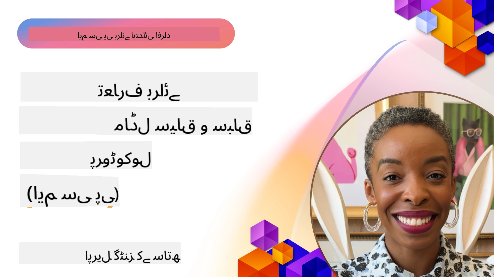
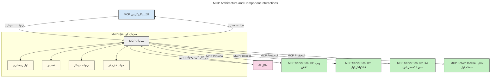
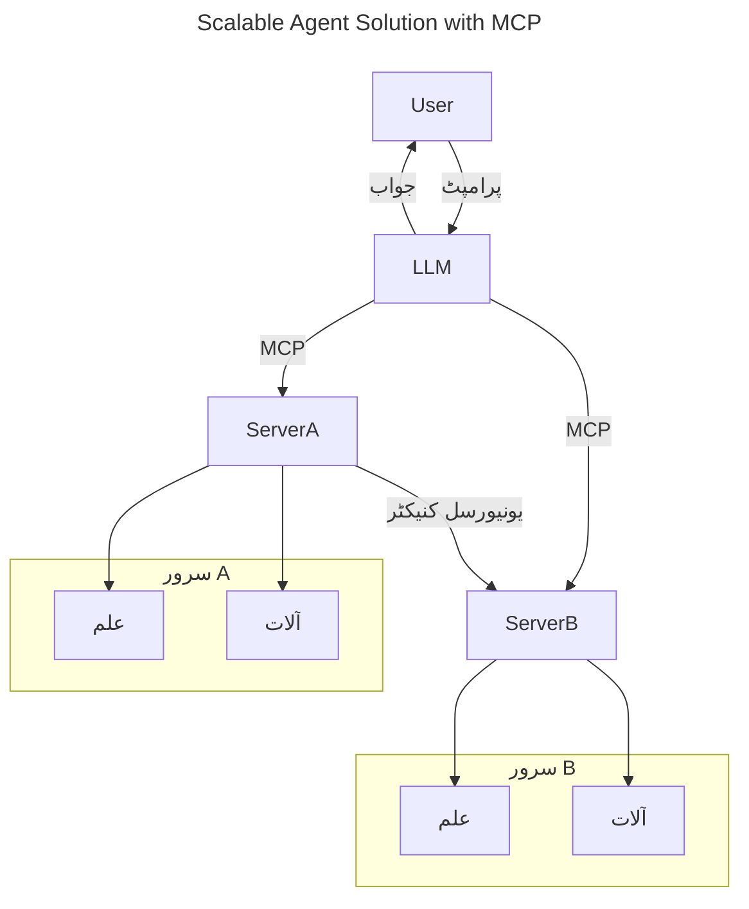
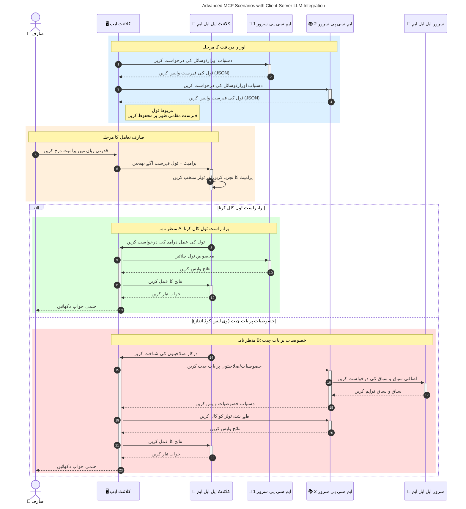

# ماڈل کانٹیکسٹ پروٹوکول (MCP) کا تعارف: اسکیل ایبل AI ایپلیکیشنز کے لیے اس کی اہمیت

_(ویڈیو دیکھنے کے لیے اوپر دی گئی تصویر پر کلک کریں)_

جنریٹو AI ایپلیکیشنز ایک بڑا قدم ہیں کیونکہ یہ اکثر صارف کو قدرتی زبان کے پرامپٹس کے ذریعے ایپ کے ساتھ بات چیت کرنے کی اجازت دیتی ہیں۔ تاہم، جب ان ایپس میں زیادہ وقت اور وسائل لگائے جاتے ہیں، تو آپ چاہتے ہیں کہ آپ آسانی سے فیچرز اور وسائل کو اس طرح شامل کر سکیں کہ اسے بڑھانا آسان ہو، آپ کی ایپ ایک سے زیادہ ماڈلز کی معاونت کر سکے، اور مختلف ماڈل کی پیچیدگیوں کو سنبھال سکے۔ مختصر یہ کہ، جنریٹو AI ایپ بنانا ابتدا میں آسان ہے، لیکن جیسے جیسے یہ بڑھتے اور پیچیدہ ہوتے جاتے ہیں، آپ کو ایک آرکیٹیکچر کی وضاحت شروع کرنا ہوگی اور ممکنہ طور پر ایک معیار پر انحصار کرنا ہوگا تاکہ آپ کی ایپس مستقل طریقے سے بنیں۔ یہاں MCP آتا ہے تاکہ چیزوں کو منظم کرے اور ایک معیار فراہم کرے۔

---

## **🔍 ماڈل کانٹیکسٹ پروٹوکول (MCP) کیا ہے؟**

**ماڈل کانٹیکسٹ پروٹوکول (MCP)** ایک **کھلا، معیاری انٹرفیس** ہے جو بڑے زبان کے ماڈلز (LLMs) کو بیرونی ٹولز، APIs، اور ڈیٹا سورسز کے ساتھ بغیر کسی رکاوٹ کے بات چیت کرنے کی اجازت دیتا ہے۔ یہ ایک مستقل آرکیٹیکچر فراہم کرتا ہے جو AI ماڈل کی فنگشنلٹی کو ان کے تربیتی ڈیٹا سے آگے بڑھاتا ہے، جس سے زیادہ ہوشیار، اسکیل ایبل، اور زیادہ جوابدہ AI سسٹمز ممکن ہوتے ہیں۔

---

## **🎯 AI میں معیار بندی کیوں ضروری ہے**

جیسے جنریٹو AI ایپلیکیشنز مزید پیچیدہ ہوتی جاتی ہیں، یہ ضروری ہے کہ ایسے معیارات کو اپنایا جائے جو **اسکیل ایبیلٹی، وسعت پذیری، سہولتِ دیکھ بھال،** اور **وینڈرز کے قید ہونے سے بچاؤ** کو یقینی بنائیں۔ MCP ان ضروریات کو درج ذیل طریقوں سے پورا کرتا ہے:

- ماڈل اور ٹول کے انضمام کو یکساں بنانا
- کمزور اور مخصوص حسب ضرورت حل کو کم کرنا
- مختلف وینڈرز کے متعدد ماڈلز کو ایک ہی ماحولیاتی نظام میں موجود رہنے کی اجازت دینا

**نوٹ:** اگرچہ MCP خود کو ایک کھلے معیار کے طور پر پیش کرتا ہے، لیکن اس کے لیے کسی موجودہ معیاری ادارے جیسے IEEE، IETF، W3C، ISO، یا کسی اور معیاری ادارے کے ذریعہ رسمی معیار سازی کا کوئی منصوبہ نہیں ہے۔

---

## **📚 تعلیمی مقاصد**

اس مضمون کے آخر تک، آپ قابل ہوں گے:

- **ماڈل کانٹیکسٹ پروٹوکول (MCP)** کی تعریف اور اس کے استعمال کے کیسز بیان کریں
- سمجھیں کہ MCP ماڈل سے ٹولز تک بات چیت کو کیسے معیاری بناتا ہے
- MCP آرکیٹیکچر کے مرکزی اجزاء کی شناخت کریں
- MCP کے حقیقی دنیا میں انٹرپرائز اور ڈیولپمنٹ کے تناظر میں اطلاقات کو دریافت کریں

---

## **💡 ماڈل کانٹیکسٹ پروٹوکول (MCP) کیوں ایک گیم چینجر ہے**

### **🔗 MCP AI بات چیت میں انتشار کو حل کرتا ہے**

MCP سے پہلے، ماڈلز کو ٹولز کے ساتھ منسلک کرنے کے لیے درکار تھا:

- ہر ٹول-ماڈل جوڑے کے لیے مخصوص کوڈ
- ہر وینڈر کے لیے غیر معیاری APIs
- اپ ڈیٹس کی وجہ سے بار بار رکاوٹیں
- زیادہ ٹولز کے ساتھ ناقص اسکیل ایبیلٹی

### **✅ MCP معیار بندی کے فوائد**

| **فائدہ**                 | **تفصیل**                                                                    |
|--------------------------|-------------------------------------------------------------------------------|
| باہمی عمل پذیری          | LLMs مختلف وینڈرز کے ٹولز کے ساتھ بغیر رکاوٹ کام کرتے ہیں                   |
| مستقل مزاجی              | پلیٹ فارمز اور ٹولز کے درمیان یکساں برتاؤ                                     |
| دوبارہ استعمال          | ایک بار بنائے گئے ٹولز کو مختلف پروجیکٹس اور سسٹمز میں استعمال کیا جا سکتا ہے |
| ترقی کی رفتار میں اضافہ | معیاری، پلگ اینڈ پلے انٹرفیسز کا استعمال کرکے ترقی کا وقت کم کریں              |

---

## **🧱 اعلیٰ سطحی MCP آرکیٹیکچر کا جائزہ**

MCP ایک **کلائنٹ-سرور ماڈل** کی پیروی کرتا ہے، جہاں:

- **MCP میزبان** AI ماڈلز چلاتے ہیں
- **MCP کلائنٹس** درخواستیں شروع کرتے ہیں
- **MCP سرورز** کانٹیکسٹ، ٹولز، اور صلاحیتیں فراہم کرتے ہیں

### **کلیدی اجزاء:**

- **وسائل** – ماڈلز کے لیے جامد یا متحرک ڈیٹا  
- **پرامپٹس** – رہنمائی شدہ جنریشن کے لیے پیش سیٹ ورک فلو  
- **ٹولز** – قابل عمل فنکشن جیسے سرچ، حساب کتاب  
- **سیمپلنگ** – خود مختار برتاؤ بذریعہ تکراری تعامل (MCP `2026-07-28` میں ختم شدہ؛ نئی تعمیلوں کو براہ راست LLM فراہم کنندہ سے انضمام کرنا چاہیے)  
   
     
- **ایلیکٹیشن** – صارف کی ان پٹ کے لیے سرور سے شروع ہونے والی درخواستیں  
- **روٹس** – سرور سے متعلق معلوماتی فائل سسٹم کے مقامات (MCP `2026-07-28` میں ختم شدہ؛ ٹول پیرامیٹرز، وسائل URI، یا سرور کنفیگریشن کو ترجیح دیں)  
   
     

### **پروٹوکول آرکیٹیکچر:**

MCP دو سطحی آرکیٹیکچر استعمال کرتا ہے:
- **ڈیٹا پرت**: JSON-RPC 2.0 پیغامات، فی درخواست میٹا ڈیٹا، دریافت، اور پروٹوکول بنیادی کام  
- **ٹرانسپورٹ پرت**: مقامی سب پروسیسز کے لیے stdio اور دور دراز سرورز کے لیے Streamable HTTP۔ Streamable HTTP SSE فریم بنانے کے لیے استعمال ہو سکتا ہے، لیکن پرانا HTTP+SSE ٹرانسپورٹ منسوخ کیا جا چکا ہے۔  
   
     
   

---

## MCP سرورز کیسے کام کرتے ہیں

MCP سرورز درج ذیل طریقے سے کام کرتے ہیں:

- **درخواست کا بہاؤ**:
    1. ایک درخواست صارف یا اس کی جانب سے کام کرنے والے سافٹ ویئر کے ذریعے شروع کی جاتی ہے۔
    2. **MCP کلائنٹ** درخواست کو **MCP میزبان** کو بھیجتا ہے، جو AI ماڈل کے رن ٹائم کو سنبھالتا ہے۔
    3. **AI ماڈل** صارف کا پرامپٹ وصول کرتا ہے اور ایک یا زیادہ ٹول کال کے ذریعے بیرونی ٹولز یا ڈیٹا تک رسائی کی درخواست کر سکتا ہے۔
    4. **MCP میزبان**، ماڈل کی بجائے، مناسب **MCP سرور(ز)** سے معیاری پروٹوکول استعمال کرتے ہوئے بات چیت کرتا ہے۔
- **MCP میزبان کی فعالیت**:
    - **ٹول رجسٹری**: دستیاب ٹولز اور ان کی صلاحیتوں کا کیٹلاگ رکھتی ہے۔
    - **تصدیق**: ٹول رسائی کے اجازت ناموں کی تصدیق کرتی ہے۔
    - **درخواست ہینڈلر**: ماڈل سے آنے والی ٹول درخواستوں کو پروسیس کرتا ہے۔
    - **ردعمل فارمیٹر**: ٹول آؤٹ پٹ کو ایک ایسے فارمیٹ میں ترتیب دیتا ہے جو ماڈل سمجھ سکے۔
- **MCP سرور کا عملدرآمد**:
    - **MCP میزبان** ٹول کالز کو ایک یا زیادہ **MCP سرورز** کو بھیجتا ہے، جو خصوصاً فنکشنز (مثلاً سرچ، حساب کتاب، ڈیٹا بیس سوالات) فراہم کرتے ہیں۔
    - **MCP سرورز** اپنے متعلقہ عمل انجام دیتے ہیں اور نتائج کو مستقل فارمیٹ میں **MCP میزبان** کو لوٹاتے ہیں۔
    - **MCP میزبان** ان نتائج کو ترتیب دیتا ہے اور **AI ماڈل** کو بھیجتا ہے۔
- **ردعمل کی تکمیل**:
    - **AI ماڈل** ٹول کے نتائج کو حتمی جواب میں شامل کرتا ہے۔
    - **MCP میزبان** یہ جواب واپس **MCP کلائنٹ** کو بھیجتا ہے، جو اسے صارف یا کال کرنے والے سافٹ ویئر تک پہنچاتا ہے۔
    

## 👨‍💻 MCP سرور کیسے بنائیں (مثالوں کے ساتھ)

MCP سرورز آپ کو LLM صلاحیتوں کو بڑھانے کی اجازت دیتے ہیں، ڈیٹا اور فنکشنلٹی فراہم کر کے۔

تیار ہیں آزمائش کے لیے؟ یہاں مختلف زبانوں/اسٹیکس میں سادہ MCP سرور بنانے کی مثالوں کے ساتھ زبان اور/یا اسٹیک مخصوص SDKs ہیں:

- **Python SDK**: https://github.com/modelcontextprotocol/python-sdk

- **TypeScript SDK**: https://github.com/modelcontextprotocol/typescript-sdk

- **Java SDK**: https://github.com/modelcontextprotocol/java-sdk

- **C#/.NET SDK**: https://github.com/modelcontextprotocol/csharp-sdk

## 🌍 MCP کے حقیقی دنیا کے استعمال کی مثالیں

MCP AI صلاحیتوں کو بڑھا کر وسیع پیمانے پر اطلاقات کی اجازت دیتا ہے:

| **اطلاق**                    | **تفصیل**                                                                  |
|------------------------------|-----------------------------------------------------------------------------|
| انٹرپرائز ڈیٹا انٹیگریشن     | LLMs کو ڈیٹا بیسز، CRMs، یا داخلی ٹولز سے منسلک کریں                         |
| خودکار AI نظام                | ٹول رسائی اور فیصلہ سازی کے ورک فلو کے ساتھ خودمختار ایجنٹس فعال کریں       |
| کثیر وضعی اطلاقات            | ایک متحد AI ایپ میں متن، تصویر، اور آڈیو ٹولز کو ملائیں                     |
| حقیقی وقت ڈیٹا انٹیگریشن      | AI بات چیت میں زندہ ڈیٹا لائیں تاکہ مزید درست اور موجودہ نتائج مل سکیں      |

### 🧠 MCP = AI بات چیت کے لیے یونیورسل اسٹینڈرڈ

ماڈل کانٹیکسٹ پروٹوکول (MCP) AI بات چیت کے لیے ایک یونیورسل معیار کی حیثیت رکھتا ہے، جیسا کہ USB-C نے آلات کے فزیکل کنیکشن کو معیاری بنایا۔ AI کی دنیا میں، MCP ایک مستقل انٹرفیس فراہم کرتا ہے جو ماڈلز (کلائنٹس) کو بیرونی ٹولز اور ڈیٹا فراہم کنندگان (سرورز) کے ساتھ بغیر رکاوٹ انضمام کی اجازت دیتا ہے۔ اس سے ہر API یا ڈیٹا سورس کے لیے منفرد کسٹم پروٹوکول کی حاجت ختم ہو جاتی ہے۔

MCP کے تحت، ایک MCP موافق ٹول (جسے MCP سرور کہا جاتا ہے) ایک متحد معیار کی پیروی کرتا ہے۔ یہ سرورز دستیاب ٹولز یا اعمال کی فہرست پیش کر سکتے ہیں اور جب AI ایجنٹ کی جانب سے درخواست کی جاتی ہے تو وہ ان اعمال کو انجام دیتے ہیں۔ AI ایجنٹ پلیٹ فارمز جو MCP کی حمایت کرتے ہیں، سرورز سے دستیاب ٹولز دریافت کر کے انہیں اس معیار کے پروٹوکول کے ذریعے بلا سکتے ہیں۔

### 💡 علم تک رسائی کو آسان بناتا ہے

ٹولز کی پیشکش سے آگے، MCP علم تک رسائی کو بھی آسان بناتا ہے۔ یہ ایپلیکیشنز کو یہ صلاحیت دیتا ہے کہ وہ بڑے زبان کے ماڈلز (LLMs) کو مختلف ڈیٹا سورسز سے منسلک کر کے کانٹیکسٹ فراہم کریں۔ مثلاً، ایک MCP سرور کسی کمپنی کے دستاویزات کے ذخیرے کی نمائندگی کر سکتا ہے، جو ایجنٹس کو مطالبے پر متعلقہ معلومات حاصل کرنے کی اجازت دیتا ہے۔ ایک اور سرور مخصوص اعمال جیسے ای میل بھیجنا یا ریکارڈز کو اپ ڈیٹ کرنا سنبھال سکتا ہے۔ ایجنٹ کے نقطہ نظر سے، یہ بس ٹولز ہیں جنہیں وہ استعمال کر سکتا ہے—کچھ ٹولز ڈیٹا (علمی کانٹیکسٹ) لوٹاتے ہیں، جبکہ کچھ اعمال انجام دیتے ہیں۔ MCP دونوں کو مؤثر طریقے سے منظم کرتا ہے۔

ایک ایجنٹ جو MCP سرور سے منسلک ہوتا ہے خود بخود سرور کی دستیاب صلاحیتوں اور قابل رسائی ڈیٹا کو ایک معیاری فارمیٹ کے ذریعے سیکھ لیتا ہے۔ یہ معیار بندی متحرک ٹول دستیابی کو ممکن بناتی ہے۔ مثلاً، ایک نئے MCP سرور کو ایجنٹ کے نظام میں شامل کرنے سے اس کے فنکشن فوری طور پر قابل استعمال ہو جاتے ہیں بغیر ایجنٹ کی ہدایات میں مزید تخصیص کے۔

یہ مربوط انضمام نیچے دیے گئے خاکے کی طرح ہے، جہاں سرورز ٹولز اور علم دونوں فراہم کرتے ہیں، جو سسٹمز کے درمیان بغیر کسی رکاوٹ کے تعاون کو یقینی بناتا ہے۔

### 👉 مثال: اسکیل ایبل ایجنٹ حل

 یونیورسل کنیکٹر MCP سرورز کو ایک دوسرے سے رابطہ قائم کرنے اور صلاحیتیں شیئر کرنے کی اجازت دیتا ہے، جس سے ServerA کام ServerB کو تفویض کر سکتا ہے یا اس کے ٹولز اور علم تک رسائی حاصل کر سکتا ہے۔ یہ سرورز کے درمیان ٹولز اور ڈیٹا کا وفاقی نظام بناتا ہے، جو اسکیل ایبل اور ماڈیولر ایجنٹ آرکیٹیکچرز کی حمایت کرتا ہے۔ چونکہ MCP ٹولز کی نمائش کو معیاری بناتا ہے، ایجنٹس سرورز کے درمیان درخواستوں کو متحرک طریقے سے دریافت اور ترتیب دے سکتے ہیں بغیر ہارڈ کوڈڈ انضمام کے۔

ٹول اور علم کا وفاق: ٹولز اور ڈیٹا سرورز کے درمیان قابل رسائی ہیں، جو مزید اسکیل ایبل اور ماڈیولر ایجنٹ آرکیٹیکچرز کو ممکن بناتا ہے۔

### 🔄 ترقی یافتہ MCP منظر نامے کلائنٹ سائڈ LLM انضمام کے ساتھ

بنیادی MCP آرکیٹیکچر سے آگے، ایسے ترقی یافتہ منظرنامے ہیں جہاں کلائنٹ اور سرور دونوں کے پاس LLMs ہوتے ہیں، جو مزید پیچیدہ تعاملات کو ممکن بناتے ہیں۔ نیچے دیے گئے خاکے میں، **کلائنٹ ایپ** ایک IDE ہو سکتا ہے جس میں LLM کے استعمال کے لیے کئی MCP ٹولز موجود ہیں:

## 🔐 MCP کے عملی فوائد

MCP استعمال کرنے کے عملی فوائد درج ذیل ہیں:

- **تازگی**: ماڈلز اپنے تربیتی ڈیٹا سے آگے جدید معلومات تک رسائی حاصل کر سکتے ہیں
- **صلاحیت میں توسیع**: ماڈلز ان کاموں کے لیے خصوصی ٹولز استعمال کر سکتے ہیں جن کے لیے انہیں تربیت نہیں دی گئی
- **ہلوسینیشنز کی کمی**: بیرونی ڈیٹا سورسز حقیقتی بنیاد فراہم کرتے ہیں
- **رازداری**: حساس ڈیٹا محفوظ ماحول میں رہ سکتا ہے بجائے اس کے کہ پرامپٹس میں شامل ہو

## 📌 کلیدی نکات

MCP استعمال کرنے کے کلیدی نکات درج ذیل ہیں:

- **MCP** معیاری بناتا ہے کہ AI ماڈلز ٹولز اور ڈیٹا کے ساتھ کیسے بات چیت کرتے ہیں
- وسعت پذیری، مستقل مزاجی، اور باہمی عمل پذیری کو فروغ دیتا ہے
- MCP ترقی کے وقت کو کم، اعتبار کو بہتر، اور ماڈل کی صلاحیتوں کو بڑھانے میں مدد دیتا ہے
- کلائنٹ-سرور آرکیٹیکچر لچکدار، وسعت پذیر AI ایپلیکیشنز کو ممکن بناتا ہے

## 🧠 مشق

ایک AI ایپلیکیشن کے بارے میں سوچیں جسے آپ بنانا چاہتے ہیں۔

- کون سے **بیرونی ٹولز یا ڈیٹا** اس کی صلاحیتوں کو بڑھا سکتے ہیں؟
- MCP انضمام کو کیسے **آسان اور زیادہ قابل اعتماد** بنا سکتا ہے؟

## اضافی وسائل

- [MCP گٹ ہب ریپوزیٹری](https://github.com/modelcontextprotocol)

## آگے کیا ہے

اگلا: [باب 1: مرکزی تصورات](../01-CoreConcepts/README.md)

---

<!-- CO-OP TRANSLATOR DISCLAIMER START -->
**ڈس کلیمر**:
یہ دستاویز AI ترجمہ سروس [Co-op Translator](https://github.com/Azure/co-op-translator) کے ذریعے ترجمہ کی گئی ہے۔ جبکہ ہم درستگی کے لیے کوشاں ہیں، براہ کرم اس بات سے آگاہ رہیں کہ خودکار ترجمے میں غلطیاں یا عدم درستیاں ہو سکتی ہیں۔ اصل دستاویز اپنے مادری زبان میں مستند ماخذ سمجھی جائے گی۔ حساس معلومات کے لیے پیشہ ور انسانی ترجمہ کی سفارش کی جاتی ہے۔ اس ترجمے کے استعمال سے پیدا ہونے والی کسی بھی غلط فہمی یا غلط تشریح کی ذمہ داری ہم قبول نہیں کرتے۔
<!-- CO-OP TRANSLATOR DISCLAIMER END -->