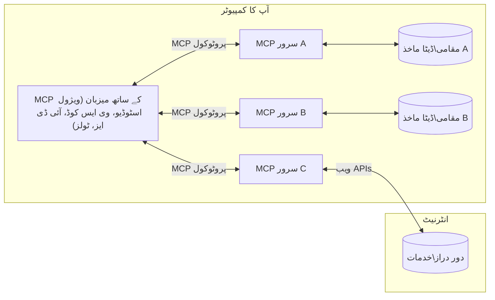

# MCP بنیادی تصورات: AI انضمام کے لیے ماڈل کانٹیکسٹ پروٹوکول میں مہارت حاصل کرنا

[](https://youtu.be/earDzWGtE84)

_(اس سبق کی ویڈیو دیکھنے کے لیے اوپر تصویر پر کلک کریں)_

[Model Context Protocol (MCP)](https://github.com/modelcontextprotocol) ایک طاقتور، معیاری فریم ورک ہے جو بڑے زبان کے ماڈلز (LLMs) اور بیرونی ٹولز، ایپلیکیشنز، اور ڈیٹا ذرائع کے درمیان مواصلات کو بہتر بناتا ہے۔  
یہ رہنما آپ کو MCP کے بنیادی تصورات سے روشناس کرائے گا۔ آپ اس کے کلائنٹ-سرور آرکیٹیکچر، اہم اجزاء، مواصلاتی طریقہ کار، اور نفاذ کی بہترین مشقوں کے بارے میں سیکھیں گے۔

- **واضح صارف کی منظوری**: تمام ڈیٹا تک رسائی اور آپریشنز کے لیے عمل درآمد سے پہلے صارف کی واضح منظوری ضروری ہے۔ صارفین کو واضح طور پر سمجھنا چاہیے کہ کون سا ڈیٹا حاصل کیا جائے گا اور کون سے اقدامات کیے جائیں گے، اجازتوں اور اختیارات پر تفصیلی کنٹرول کے ساتھ۔

- **ڈیٹا کی رازداری کا تحفظ**: صارف کا ڈیٹا صرف واضح منظوری کے ساتھ ظاہر کیا جاتا ہے اور پورے تعامل کے دوران مضبوط رسائی کنٹرولز کے ذریعے محفوظ رہنا چاہیے۔ نفاذات کو غیر مجاز ڈیٹا کی ترسیل کو روکنا اور سخت رازداری کی حدود برقرار رکھنی چاہیے۔

- **ٹول کے نفاذ کی حفاظت**: ہر ٹول کال کے لیے واضح صارف کی منظوری ضروری ہے جس میں ٹول کی فعالیت، پیرامیٹرز، اور ممکنہ اثرات کی واضح سمجھ ہو۔ مضبوط حفاظتی حدود غیر ارادی، غیر محفوظ، یا نقصان دہ ٹول کے نفاذ کو روکنی چاہیے۔

- **ٹرانسپورٹ لیئر سیکیورٹی**: تمام مواصلاتی چینلز کو مناسب انکرپشن اور تصدیقی طریقہ کار استعمال کرنے چاہئیں۔ ریموٹ کنکشنز کو محفوظ ٹرانسپورٹ پروٹوکولز اور مناسب اسناد کے انتظام کے ساتھ نافذ کیا جانا چاہیے۔

#### نفاذ کی رہنما اصول:

- **اجازت کا انتظام**: باریک بینی سے اجازت کے نظام نافذ کریں جو صارفین کو کنٹرول کرنے دیں کہ کون سے سرورز، ٹولز، اور وسائل قابل رسائی ہیں  
- **تصدیق اور اجازت**: محفوظ تصدیقی طریقے (OAuth، API کیز) استعمال کریں جن کے ساتھ مناسب ٹوکن مینجمنٹ اور میعاد ختم ہونے کی ترتیب ہو  
- **ان پٹ کی توثیق**: تمام پیرامیٹرز اور ڈیٹا ان پٹ کو متعین اسکیموں کے مطابق توثیق کریں تاکہ انجیکشن حملوں سے بچا جا سکے  
- **آڈٹ لاگنگ**: سیکیورٹی مانیٹرنگ اور تعمیل کے لیے تمام آپریشنز کے جامع لاگز رکھیں

## جائزہ

یہ سبق ماڈل کانٹیکسٹ پروٹوکول (MCP) کے بنیادی آرکیٹیکچر اور اجزاء کا جائزہ لیتا ہے۔ آپ کلائنٹ-سرور آرکیٹیکچر، کلیدی اجزاء، اور مواصلاتی طریقہ کار کے بارے میں سیکھیں گے جو MCP تعاملات کو طاقت دیتے ہیں۔

## کلیدی تعلیمی مقاصد

اس سبق کے اختتام تک، آپ:

- MCP کلائنٹ-سرور آرکیٹیکچر کو سمجھیں گے۔  
- ہوسٹس، کلائنٹس، اور سرورز کے کردار اور ذمہ داریاں شناخت کریں گے۔  
- MCP کو ایک لچکدار انضمام پرت بنانے والی بنیادی خصوصیات کا تجزیہ کریں گے۔  
- MCP ماحولیاتی نظام میں معلومات کے بہاؤ کو سمجھیں گے۔  
- .NET، جاوا، پائتھن، اور جاوا اسکرپٹ میں کوڈ مثالوں کے ذریعے عملی بصیرت حاصل کریں گے۔

## MCP آرکیٹیکچر: ایک گہری نظر

MCP ماحولیاتی نظام کلائنٹ-سرور ماڈل پر مبنی ہے۔ یہ ماڈیولر ساخت AI ایپلیکیشنز کو ٹولز، ڈیٹا بیسز، APIs، اور سیاق و سباق کے وسائل کے ساتھ مؤثر طریقے سے تعامل کرنے کی اجازت دیتی ہے۔ آئیے اس آرکیٹیکچر کو اس کے بنیادی اجزاء میں تقسیم کریں۔

اپنے بنیادی میں، MCP ایک کلائنٹ-سرور آرکیٹیکچر کی پیروی کرتا ہے جہاں ایک ہوسٹ ایپلیکیشن متعدد سرورز سے جڑ سکتی ہے:


- **MCP ہوسٹس**: پروگرامز جیسے VSCode، Claude Desktop، IDEs، یا AI ٹولز جو MCP کے ذریعے ڈیٹا تک رسائی چاہتے ہیں  
- **MCP کلائنٹس**: پروٹوکول کلائنٹس جو سرورز کے ساتھ 1:1 کنکشن برقرار رکھتے ہیں  
- **MCP سرورز**: ہلکے پھلکے پروگرامز جو معیاری ماڈل کانٹیکسٹ پروٹوکول کے ذریعے مخصوص صلاحیتیں فراہم کرتے ہیں  
- **مقامی ڈیٹا ذرائع**: آپ کے کمپیوٹر کی فائلیں، ڈیٹا بیسز، اور خدمات جن تک MCP سرورز محفوظ طریقے سے رسائی حاصل کر سکتے ہیں  
- **ریموٹ سروسز**: بیرونی نظام جو انٹرنیٹ کے ذریعے دستیاب ہیں اور جن سے MCP سرورز APIs کے ذریعے جڑ سکتے ہیں۔

MCP پروٹوکول ایک ترقی پذیر معیار ہے جو تاریخ کی بنیاد پر ورژننگ (YYYY-MM-DD فارمیٹ) استعمال کرتا ہے۔ موجودہ پروٹوکول ورژن **2025-11-25** ہے۔ آپ تازہ ترین اپ ڈیٹس [پروٹوکول وضاحت](https://modelcontextprotocol.io/specification/2025-11-25/) میں دیکھ سکتے ہیں۔

### 1. ہوسٹس

ماڈل کانٹیکسٹ پروٹوکول (MCP) میں، **ہوسٹس** AI ایپلیکیشنز ہیں جو صارفین کو پروٹوکول کے ساتھ تعامل کرنے کے لیے بنیادی انٹرفیس فراہم کرتی ہیں۔ ہوسٹس متعدد MCP سرورز سے کنکشنز کو مربوط اور منظم کرتی ہیں، ہر سرور کنکشن کے لیے مخصوص MCP کلائنٹس بناتی ہیں۔ ہوسٹس کی مثالیں:

- **AI ایپلیکیشنز**: Claude Desktop، Visual Studio Code، Claude Code  
- **ڈیولپمنٹ ماحول**: IDEs اور کوڈ ایڈیٹرز جن میں MCP انضمام ہوتا ہے  
- **حسب ضرورت ایپلیکیشنز**: مقصد کے لیے بنائے گئے AI ایجنٹس اور ٹولز

**ہوسٹس** وہ ایپلیکیشنز ہیں جو AI ماڈل کے تعاملات کو مربوط کرتی ہیں۔ وہ:

- **AI ماڈلز کو منظم کرتی ہیں**: LLMs کو چلانا یا ان کے ساتھ تعامل کرنا تاکہ جوابات تیار کیے جا سکیں اور AI ورک فلو کو مربوط کیا جا سکے  
- **کلائنٹ کنکشنز کا انتظام کرتی ہیں**: ہر MCP سرور کنکشن کے لیے ایک MCP کلائنٹ بناتی اور برقرار رکھتی ہیں  
- **صارف انٹرفیس کو کنٹرول کرتی ہیں**: گفتگو کے بہاؤ، صارف کے تعاملات، اور جوابات کی پیشکش کو سنبھالتی ہیں  
- **سیکیورٹی نافذ کرتی ہیں**: اجازتوں، حفاظتی پابندیوں، اور تصدیق کو کنٹرول کرتی ہیں  
- **صارف کی منظوری کا انتظام کرتی ہیں**: ڈیٹا شیئرنگ اور ٹول کے نفاذ کے لیے صارف کی منظوری کا انتظام کرتی ہیں

### 2. کلائنٹس

**کلائنٹس** وہ اہم اجزاء ہیں جو ہوسٹس اور MCP سرورز کے درمیان مخصوص ایک سے ایک کنکشن برقرار رکھتے ہیں۔ ہر MCP کلائنٹ ہوسٹ کی طرف سے ایک مخصوص MCP سرور سے جڑنے کے لیے بنایا جاتا ہے، تاکہ منظم اور محفوظ مواصلاتی چینلز یقینی بنائے جا سکیں۔ متعدد کلائنٹس ہوسٹس کو بیک وقت متعدد سرورز سے جڑنے کی اجازت دیتے ہیں۔

**کلائنٹس** ہوسٹ ایپلیکیشن کے اندر کنیکٹر اجزاء ہیں۔ وہ:

- **پروٹوکول مواصلات**: سرورز کو JSON-RPC 2.0 درخواستیں بھیجتے ہیں جن میں پرامپٹس اور ہدایات شامل ہوتی ہیں  
- **صلاحیتوں کا مذاکرات**: شروعات کے دوران سرورز کے ساتھ سپورٹ شدہ خصوصیات اور پروٹوکول ورژنز پر بات چیت کرتے ہیں  
- **ٹول کے نفاذ کا انتظام**: ماڈلز سے ٹول کے نفاذ کی درخواستوں کو سنبھالتے اور جوابات کو پروسیس کرتے ہیں  
- **حقیقی وقت کی اپ ڈیٹس**: سرورز سے نوٹیفیکیشنز اور حقیقی وقت کی اپ ڈیٹس کو ہینڈل کرتے ہیں  
- **جواب کی پروسیسنگ**: صارفین کو دکھانے کے لیے سرور کے جوابات کو پروسیس اور فارمیٹ کرتے ہیں

### 3. سرورز

**سرورز** پروگرامز ہیں جو MCP کلائنٹس کو کانٹیکسٹ، ٹولز، اور صلاحیتیں فراہم کرتے ہیں۔ یہ مقامی طور پر (ہوسٹ کے ساتھ ایک ہی مشین پر) یا ریموٹلی (بیرونی پلیٹ فارمز پر) چل سکتے ہیں، اور کلائنٹ کی درخواستوں کو سنبھالنے اور منظم جوابات فراہم کرنے کے ذمہ دار ہوتے ہیں۔ سرورز معیاری ماڈل کانٹیکسٹ پروٹوکول کے ذریعے مخصوص فعالیت فراہم کرتے ہیں۔

**سرورز** وہ خدمات ہیں جو کانٹیکسٹ اور صلاحیتیں فراہم کرتی ہیں۔ وہ:

- **خصوصیات کی رجسٹریشن**: کلائنٹس کو دستیاب بنیادی اجزاء (وسائل، پرامپٹس، ٹولز) رجسٹر اور فراہم کرتے ہیں  
- **درخواست کی پروسیسنگ**: کلائنٹس سے ٹول کالز، وسائل کی درخواستیں، اور پرامپٹ کی درخواستیں وصول اور عمل کرتے ہیں  
- **کانٹیکسٹ کی فراہمی**: ماڈل کے جوابات کو بہتر بنانے کے لیے سیاق و سباق کی معلومات اور ڈیٹا فراہم کرتے ہیں  
- **حالت کا انتظام**: سیشن کی حالت برقرار رکھتے ہیں اور ضرورت پڑنے پر ریاستی تعاملات کو سنبھالتے ہیں  
- **حقیقی وقت کی نوٹیفیکیشنز**: صلاحیتوں میں تبدیلیوں اور اپ ڈیٹس کے بارے میں جڑے ہوئے کلائنٹس کو نوٹیفیکیشنز بھیجتے ہیں

سرورز کو کوئی بھی ماڈل کی صلاحیتوں کو مخصوص فعالیت کے ساتھ بڑھانے کے لیے تیار کر سکتا ہے، اور یہ مقامی اور ریموٹ دونوں تعیناتی کے منظرناموں کی حمایت کرتے ہیں۔

### 4. سرور بنیادی اجزاء

ماڈل کانٹیکسٹ پروٹوکول (MCP) میں سرور تین بنیادی **بنیادی اجزاء** فراہم کرتے ہیں جو کلائنٹس، ہوسٹس، اور زبان کے ماڈلز کے درمیان بھرپور تعاملات کے لیے بنیادی بلاکس کی وضاحت کرتے ہیں۔ یہ بنیادی اجزاء پروٹوکول کے ذریعے دستیاب سیاق و سباق کی معلومات اور اقدامات کی اقسام کو متعین کرتے ہیں۔

MCP سرورز درج ذیل تین بنیادی اجزاء کا کوئی بھی امتزاج ظاہر کر سکتے ہیں:

#### وسائل

**وسائل** وہ ڈیٹا ذرائع ہیں جو AI ایپلیکیشنز کو سیاق و سباق کی معلومات فراہم کرتے ہیں۔ یہ جامد یا متحرک مواد کی نمائندگی کرتے ہیں جو ماڈل کی سمجھ اور فیصلہ سازی کو بہتر بنا سکتے ہیں:

- **سیاق و سباق کا ڈیٹا**: AI ماڈل کے استعمال کے لیے منظم معلومات اور سیاق و سباق  
- **علمی ذخائر**: دستاویزات کے ذخائر، مضامین، دستی، اور تحقیقی مقالے  
- **مقامی ڈیٹا ذرائع**: فائلیں، ڈیٹا بیسز، اور مقامی نظام کی معلومات  
- **بیرونی ڈیٹا**: API جوابات، ویب سروسز، اور ریموٹ سسٹم کا ڈیٹا  
- **متحرک مواد**: حقیقی وقت کا ڈیٹا جو بیرونی حالات کی بنیاد پر اپ ڈیٹ ہوتا ہے

وسائل کو URIs کے ذریعے شناخت کیا جاتا ہے اور `resources/list` کے ذریعے دریافت اور `resources/read` کے ذریعے حاصل کیا جا سکتا ہے:

```text
file://documents/project-spec.md
database://production/users/schema
api://weather/current
```

#### پرامپٹس

**پرامپٹس** قابل استعمال ٹیمپلیٹس ہیں جو زبان کے ماڈلز کے ساتھ تعاملات کو منظم کرنے میں مدد دیتے ہیں۔ یہ معیاری تعامل کے نمونے اور ٹیمپلیٹ شدہ ورک فلو فراہم کرتے ہیں:

- **ٹیمپلیٹ پر مبنی تعاملات**: پہلے سے منظم پیغامات اور گفتگو کے آغاز  
- **ورک فلو ٹیمپلیٹس**: عام کاموں اور تعاملات کے لیے معیاری سلسلے  
- **چند مثالیں**: ماڈل کی ہدایت کے لیے مثال پر مبنی ٹیمپلیٹس  
- **سسٹم پرامپٹس**: بنیادی پرامپٹس جو ماڈل کے رویے اور سیاق و سباق کی وضاحت کرتے ہیں  
- **متحرک ٹیمپلیٹس**: پیرامیٹرائزڈ پرامپٹس جو مخصوص سیاق و سباق کے مطابق ڈھلتے ہیں

پرامپٹس متغیر کی جگہ لینے کی حمایت کرتے ہیں اور `prompts/list` کے ذریعے دریافت اور `prompts/get` کے ذریعے حاصل کیے جا سکتے ہیں:

```markdown
Generate a {{task_type}} for {{product}} targeting {{audience}} with the following requirements: {{requirements}}
```

#### ٹولز

**ٹولز** قابل عمل فنکشنز ہیں جنہیں AI ماڈلز مخصوص کارروائیاں انجام دینے کے لیے کال کر سکتے ہیں۔ یہ MCP ماحولیاتی نظام کے "افعال" کی نمائندگی کرتے ہیں، جو ماڈلز کو بیرونی نظاموں کے ساتھ تعامل کرنے کے قابل بناتے ہیں:

- **قابل عمل فنکشنز**: مخصوص پیرامیٹرز کے ساتھ ماڈلز کی طرف سے کال کیے جانے والے الگ الگ آپریشنز  
- **بیرونی نظام کا انضمام**: API کالز، ڈیٹا بیس کی تلاش، فائل آپریشنز، حساب کتاب  
- **منفرد شناخت**: ہر ٹول کا ایک منفرد نام، وضاحت، اور پیرامیٹر اسکیمہ ہوتا ہے  
- **منظم ان پٹ/آؤٹ پٹ**: ٹولز تصدیق شدہ پیرامیٹرز قبول کرتے ہیں اور منظم، ٹائپ شدہ جوابات لوٹاتے ہیں  
- **عمل کی صلاحیتیں**: ماڈلز کو حقیقی دنیا کے اقدامات انجام دینے اور لائیو ڈیٹا حاصل کرنے کے قابل بناتے ہیں

ٹولز کو پیرامیٹر کی توثیق کے لیے JSON اسکیمہ کے ساتھ متعین کیا جاتا ہے اور `tools/list` کے ذریعے دریافت اور `tools/call` کے ذریعے چلائے جاتے ہیں:

```typescript
server.tool(
  "search_products", 
  {
    query: z.string().describe("Search query for products"),
    category: z.string().optional().describe("Product category filter"),
    max_results: z.number().default(10).describe("Maximum results to return")
  }, 
  async (params) => {
    // تلاش کریں اور منظم نتائج واپس کریں
    return await productService.search(params);
  }
);
```

## کلائنٹ بنیادی اجزاء

ماڈل کانٹیکسٹ پروٹوکول (MCP) میں، **کلائنٹس** وہ بنیادی اجزاء ظاہر کر سکتے ہیں جو سرورز کو ہوسٹ ایپلیکیشن سے اضافی صلاحیتیں طلب کرنے کی اجازت دیتے ہیں۔ یہ کلائنٹ-سائیڈ بنیادی اجزاء زیادہ بھرپور، زیادہ تعاملی سرور نفاذات کے لیے اجازت دیتے ہیں جو AI ماڈل کی صلاحیتوں اور صارف کے تعاملات تک رسائی حاصل کر سکتے ہیں۔

### سیمپلنگ

**سیمپلنگ** سرورز کو کلائنٹ کی AI ایپلیکیشن سے زبان کے ماڈل کی تکمیل طلب کرنے کی اجازت دیتا ہے۔ یہ بنیادی جز سرورز کو اپنی ماڈل انحصار شامل کیے بغیر LLM صلاحیتوں تک رسائی کی اجازت دیتا ہے:

- **ماڈل سے آزاد رسائی**: سرورز بغیر LLM SDKs شامل کیے یا ماڈل کی رسائی کا انتظام کیے تکمیل طلب کر سکتے ہیں  
- **سرور کی طرف سے شروع کردہ AI**: سرورز کو کلائنٹ کے AI ماڈل کا استعمال کرتے ہوئے خود مختار طور پر مواد تیار کرنے کی اجازت دیتا ہے  
- **تکراری LLM تعاملات**: پیچیدہ منظرناموں کی حمایت کرتا ہے جہاں سرورز کو پروسیسنگ کے لیے AI مدد کی ضرورت ہوتی ہے  
- **متحرک مواد کی تخلیق**: سرورز کو ہوسٹ کے ماڈل کا استعمال کرتے ہوئے سیاق و سباق کے مطابق جوابات بنانے کی اجازت دیتا ہے

سیمپلنگ `sampling/complete` طریقہ کار کے ذریعے شروع کی جاتی ہے، جہاں سرورز کلائنٹس کو تکمیل کی درخواستیں بھیجتے ہیں۔

### ایلیسیٹیشن

**ایلیسیٹیشن** سرورز کو کلائنٹ انٹرفیس کے ذریعے صارفین سے اضافی معلومات یا تصدیق طلب کرنے کی اجازت دیتا ہے:

- **صارف ان پٹ کی درخواستیں**: جب ٹول کے نفاذ کے لیے اضافی معلومات کی ضرورت ہو تو سرورز درخواست کر سکتے ہیں  
- **تصدیقی ڈائیلاگز**: حساس یا اثر انداز کرنے والے آپریشنز کے لیے صارف کی منظوری طلب کریں  
- **تعاملی ورک فلو**: سرورز کو مرحلہ وار صارف تعاملات بنانے کی اجازت دیتا ہے  
- **متحرک پیرامیٹر جمع کرنا**: ٹول کے نفاذ کے دوران گمشدہ یا اختیاری پیرامیٹرز جمع کریں

ایلیسیٹیشن کی درخواستیں `elicitation/request` طریقہ کار کے ذریعے کی جاتی ہیں تاکہ کلائنٹ کے انٹرفیس کے ذریعے صارف کی معلومات جمع کی جا سکیں۔

### لاگنگ

**لاگنگ** سرورز کو کلائنٹس کو منظم لاگ پیغامات بھیجنے کی اجازت دیتا ہے تاکہ ڈیبگنگ، مانیٹرنگ، اور آپریشنل شفافیت ممکن ہو:

- **ڈیبگنگ کی حمایت**: سرورز کو تفصیلی نفاذ لاگز فراہم کرنے کی اجازت دیتا ہے تاکہ مسائل حل کیے جا سکیں  
- **آپریشنل مانیٹرنگ**: کلائنٹس کو اسٹیٹس اپ ڈیٹس اور کارکردگی کے میٹرکس بھیجیں  
- **خرابی کی رپورٹنگ**: تفصیلی خرابی کے سیاق و سباق اور تشخیصی معلومات فراہم کریں  
- **آڈٹ ٹریلز**: سرور آپریشنز اور فیصلوں کے جامع لاگز بنائیں

لاگنگ پیغامات کلائنٹس کو بھیجے جاتے ہیں تاکہ سرور آپریشنز میں شفافیت فراہم کی جا سکے اور ڈیبگنگ کو آسان بنایا جا سکے۔

## MCP میں معلومات کا بہاؤ

ماڈل کانٹیکسٹ پروٹوکول (MCP) ہوسٹس، کلائنٹس، سرورز، اور ماڈلز کے درمیان معلومات کے منظم بہاؤ کی وضاحت کرتا ہے۔ اس بہاؤ کو سمجھنا اس بات کو واضح کرتا ہے کہ صارف کی درخواستیں کیسے پروسیس ہوتی ہیں اور بیرونی ٹولز اور ڈیٹا ماڈلز کے جوابات میں کیسے شامل کیے جاتے ہیں۔

- **ہوسٹ کنکشن شروع کرتا ہے**  
  ہوسٹ ایپلیکیشن (جیسے IDE یا چیٹ انٹرفیس) عام طور پر STDIO، WebSocket، یا کسی اور معاون ٹرانسپورٹ کے ذریعے MCP سرور سے کنکشن قائم کرتا ہے۔

- **صلاحیتوں کا مذاکرات**  
  کلائنٹ (جو ہوسٹ میں شامل ہوتا ہے) اور سرور اپنی سپورٹ شدہ خصوصیات، ٹولز، وسائل، اور پروٹوکول ورژنز کے بارے میں معلومات کا تبادلہ کرتے ہیں۔ یہ یقینی بناتا ہے کہ دونوں طرف سیشن کے لیے دستیاب صلاحیتوں کو سمجھتے ہیں۔

- **صارف کی درخواست**  
  صارف ہوسٹ کے ساتھ تعامل کرتا ہے (مثلاً پرامپٹ یا کمانڈ داخل کرتا ہے)۔ ہوسٹ یہ ان پٹ جمع کرتا ہے اور پروسیسنگ کے لیے کلائنٹ کو بھیجتا ہے۔

- **وسائل یا ٹول کا استعمال**  
  - کلائنٹ سرور سے اضافی سیاق و سباق یا وسائل طلب کر سکتا ہے (جیسے فائلیں، ڈیٹا بیس اندراجات، یا علمی ذخیرہ کے مضامین) تاکہ ماڈل کی سمجھ کو بہتر بنایا جا سکے۔  
  - اگر ماڈل فیصلہ کرتا ہے کہ ٹول کی ضرورت ہے (مثلاً ڈیٹا حاصل کرنے، حساب کتاب کرنے، یا API کال کرنے کے لیے)، تو کلائنٹ سرور کو ٹول کال کی درخواست بھیجتا ہے، جس میں ٹول کا نام اور پیرامیٹرز شامل ہوتے ہیں۔

- **سرور کا نفاذ**  
  سرور وسائل یا ٹول کی درخواست وصول کرتا ہے، ضروری آپریشنز انجام دیتا ہے (جیسے فنکشن چلانا، ڈیٹا بیس سے سوال کرنا، یا فائل حاصل کرنا)، اور نتائج کو منظم شکل میں کلائنٹ کو واپس بھیجتا ہے۔

- **جواب کی تخلیق**  
  کلائنٹ سرور کے جوابات (وسائل کا ڈیٹا، ٹول کے نتائج، وغیرہ) کو جاری ماڈل تعامل میں شامل کرتا ہے۔ ماڈل اس معلومات کا استعمال کرتے ہوئے جامع اور سیاق و سباق کے مطابق جواب تیار کرتا ہے۔

- **نتائج کی پیشکش**  
  ہوسٹ کلائنٹ سے حتمی آؤٹ پٹ وصول کرتا ہے اور اسے صارف کو پیش کرتا ہے، اکثر ماڈل کے تیار کردہ متن اور ٹول کے نفاذ یا وسائل کی تلاش کے نتائج دونوں کو شامل کرتے ہوئے۔

یہ بہاؤ MCP کو جدید، تعاملی، اور سیاق و سباق سے آگاہ AI ایپلیکیشنز کی حمایت کرنے کے قابل بناتا ہے جو ماڈلز کو بیرونی ٹولز اور ڈیٹا ذرائع کے ساتھ بغیر رکاوٹ جوڑتا ہے۔

## پروٹوکول آرکیٹیکچر اور پرتیں

MCP دو مختلف آرکیٹیکچرل پرتوں پر مشتمل ہے جو مل کر مکمل مواصلاتی فریم ورک فراہم کرتی ہیں:

### ڈیٹا پرت

**ڈیٹا پرت** بنیادی MCP پروٹوکول کو **JSON-RPC 2.0** کے طور پر نافذ کرتی ہے۔ یہ پرت پیغام کی ساخت، معنیات، اور تعامل کے نمونوں کی وضاحت کرتی ہے:

#### بنیادی اجزاء:

- **JSON-RPC 2.0 پروٹوکول**: تمام مواصلات معیاری JSON-RPC 2.0 پیغام کے فارمیٹ کا استعمال کرتے ہوئے طریقہ کار کی کالز، جوابات، اور نوٹیفیکیشنز کے لیے ہوتی ہے۔
- **لائف سائیکل مینجمنٹ**: کلائنٹس اور سرورز کے درمیان کنکشن کی ابتدا، صلاحیتوں کی گفت و شنید، اور سیشن کے خاتمے کو سنبھالتا ہے  
- **سرور پرمیٹیوز**: سرورز کو بنیادی فعالیت فراہم کرنے کے لیے ٹولز، وسائل، اور پرامپٹس کے ذریعے قابل بناتا ہے  
- **کلائنٹ پرمیٹیوز**: سرورز کو LLMs سے سیمپلنگ کی درخواست کرنے، صارف کی ان پٹ حاصل کرنے، اور لاگ پیغامات بھیجنے کے قابل بناتا ہے  
- **ریئل ٹائم نوٹیفیکیشنز**: پولنگ کے بغیر متحرک اپ ڈیٹس کے لیے غیر ہم وقت ساز نوٹیفیکیشنز کی حمایت کرتا ہے  

#### کلیدی خصوصیات:

- **پروٹوکول ورژن گفت و شنید**: مطابقت کو یقینی بنانے کے لیے تاریخ پر مبنی ورژننگ (YYYY-MM-DD) استعمال کرتا ہے  
- **صلاحیت کی دریافت**: کلائنٹس اور سرورز ابتدائیہ کے دوران سپورٹ شدہ فیچر کی معلومات کا تبادلہ کرتے ہیں  
- **ریاستی سیشنز**: متعدد تعاملات کے دوران کنکشن کی حالت کو برقرار رکھتا ہے تاکہ سیاق و سباق کی تسلسل ممکن ہو  

### ٹرانسپورٹ لیئر

**ٹرانسپورٹ لیئر** MCP شرکاء کے درمیان مواصلاتی چینلز، پیغام کی فریم بندی، اور توثیق کو منظم کرتا ہے:

#### سپورٹ شدہ ٹرانسپورٹ میکانزم:

1. **STDIO ٹرانسپورٹ**:  
   - براہ راست عمل کے مواصلات کے لیے معیاری ان پٹ/آؤٹ پٹ اسٹریمز استعمال کرتا ہے  
   - ایک ہی مشین پر مقامی عمل کے لیے مثالی، بغیر نیٹ ورک اوور ہیڈ کے  
   - عام طور پر مقامی MCP سرور کی تنصیبات کے لیے استعمال ہوتا ہے  

2. **اسٹریمیبل HTTP ٹرانسپورٹ**:  
   - کلائنٹ سے سرور کے پیغامات کے لیے HTTP POST استعمال کرتا ہے  
   - اختیاری سرور-سینٹ ایونٹس (SSE) سرور سے کلائنٹ کی اسٹریمنگ کے لیے  
   - نیٹ ورکس کے پار ریموٹ سرور مواصلات کو فعال کرتا ہے  
   - معیاری HTTP توثیق (بیئرر ٹوکنز، API کیز، کسٹم ہیڈرز) کی حمایت کرتا ہے  
   - MCP محفوظ ٹوکن پر مبنی توثیق کے لیے OAuth کی سفارش کرتا ہے  

#### ٹرانسپورٹ تجرید:

ٹرانسپورٹ لیئر مواصلاتی تفصیلات کو ڈیٹا لیئر سے الگ کرتا ہے، جس سے تمام ٹرانسپورٹ میکانزمز میں ایک ہی JSON-RPC 2.0 پیغام فارمیٹ استعمال کیا جا سکتا ہے۔ یہ تجرید ایپلیکیشنز کو مقامی اور ریموٹ سرورز کے درمیان بغیر رکاوٹ سوئچ کرنے کی اجازت دیتی ہے۔

### سیکیورٹی کے پہلو

MCP کی تنصیبات کو تمام پروٹوکول آپریشنز میں محفوظ، قابل اعتماد، اور محفوظ تعاملات کو یقینی بنانے کے لیے کئی اہم سیکیورٹی اصولوں کی پابندی کرنی چاہیے:

- **صارف کی رضامندی اور کنٹرول**: کسی بھی ڈیٹا تک رسائی یا آپریشنز کرنے سے پہلے صارفین کی واضح رضامندی ضروری ہے۔ انہیں واضح کنٹرول حاصل ہونا چاہیے کہ کون سا ڈیٹا شیئر کیا جائے اور کون سے اقدامات کی اجازت دی گئی ہے، جس کی حمایت جائزہ لینے اور منظوری کے لیے آسان صارف انٹرفیس سے کی جاتی ہے۔  

- **ڈیٹا کی رازداری**: صارف کا ڈیٹا صرف واضح رضامندی کے ساتھ ظاہر کیا جانا چاہیے اور مناسب رسائی کنٹرولز کے ذریعے محفوظ ہونا چاہیے۔ MCP کی تنصیبات کو غیر مجاز ڈیٹا کی ترسیل سے بچانا چاہیے اور تمام تعاملات کے دوران رازداری کو برقرار رکھنا چاہیے۔  

- **ٹول کی حفاظت**: کسی بھی ٹول کو کال کرنے سے پہلے واضح صارف کی رضامندی ضروری ہے۔ صارفین کو ہر ٹول کی فعالیت کی واضح سمجھ ہونی چاہیے، اور غیر ارادی یا غیر محفوظ ٹول کے نفاذ کو روکنے کے لیے مضبوط سیکیورٹی حدود نافذ کی جانی چاہئیں۔  

ان سیکیورٹی اصولوں کی پیروی کرتے ہوئے، MCP صارف کے اعتماد، رازداری، اور حفاظت کو تمام پروٹوکول تعاملات میں برقرار رکھتا ہے جبکہ طاقتور AI انضمامات کو فعال کرتا ہے۔

## کوڈ کی مثالیں: کلیدی اجزاء

نیچے چند مقبول پروگرامنگ زبانوں میں کوڈ کی مثالیں دی گئی ہیں جو MCP سرور کے کلیدی اجزاء اور ٹولز کو نافذ کرنے کا طریقہ دکھاتی ہیں۔

### .NET مثال: ٹولز کے ساتھ ایک سادہ MCP سرور بنانا

یہ ایک عملی .NET کوڈ مثال ہے جو دکھاتی ہے کہ کس طرح ایک سادہ MCP سرور کو کسٹم ٹولز کے ساتھ نافذ کیا جائے۔ یہ مثال ٹولز کی تعریف، رجسٹریشن، درخواستوں کو ہینڈل کرنے، اور ماڈل کانٹیکسٹ پروٹوکول کے ذریعے سرور کو کنیکٹ کرنے کا طریقہ دکھاتی ہے۔

```csharp
using System;
using System.Threading.Tasks;
using ModelContextProtocol.Server;
using ModelContextProtocol.Server.Transport;
using ModelContextProtocol.Server.Tools;

public class WeatherServer
{
    public static async Task Main(string[] args)
    {
        // Create an MCP server
        var server = new McpServer(
            name: "Weather MCP Server",
            version: "1.0.0"
        );
        
        // Register our custom weather tool
        server.AddTool<string, WeatherData>("weatherTool", 
            description: "Gets current weather for a location",
            execute: async (location) => {
                // Call weather API (simplified)
                var weatherData = await GetWeatherDataAsync(location);
                return weatherData;
            });
        
        // Connect the server using stdio transport
        var transport = new StdioServerTransport();
        await server.ConnectAsync(transport);
        
        Console.WriteLine("Weather MCP Server started");
        
        // Keep the server running until process is terminated
        await Task.Delay(-1);
    }
    
    private static async Task<WeatherData> GetWeatherDataAsync(string location)
    {
        // This would normally call a weather API
        // Simplified for demonstration
        await Task.Delay(100); // Simulate API call
        return new WeatherData { 
            Temperature = 72.5,
            Conditions = "Sunny",
            Location = location
        };
    }
}

public class WeatherData
{
    public double Temperature { get; set; }
    public string Conditions { get; set; }
    public string Location { get; set; }
}
```

### جاوا مثال: MCP سرور کے اجزاء

یہ مثال اوپر دی گئی .NET مثال کی طرح MCP سرور اور ٹول رجسٹریشن کو ظاہر کرتی ہے، لیکن جاوا میں نافذ کی گئی ہے۔

```java
import io.modelcontextprotocol.server.McpServer;
import io.modelcontextprotocol.server.McpToolDefinition;
import io.modelcontextprotocol.server.transport.StdioServerTransport;
import io.modelcontextprotocol.server.tool.ToolExecutionContext;
import io.modelcontextprotocol.server.tool.ToolResponse;

public class WeatherMcpServer {
    public static void main(String[] args) throws Exception {
        // ایک MCP سرور بنائیں
        McpServer server = McpServer.builder()
            .name("Weather MCP Server")
            .version("1.0.0")
            .build();
            
        // ایک موسم کا آلہ رجسٹر کریں
        server.registerTool(McpToolDefinition.builder("weatherTool")
            .description("Gets current weather for a location")
            .parameter("location", String.class)
            .execute((ToolExecutionContext ctx) -> {
                String location = ctx.getParameter("location", String.class);
                
                // موسم کا ڈیٹا حاصل کریں (سادہ کیا گیا)
                WeatherData data = getWeatherData(location);
                
                // فارمیٹ شدہ جواب واپس کریں
                return ToolResponse.content(
                    String.format("Temperature: %.1f°F, Conditions: %s, Location: %s", 
                    data.getTemperature(), 
                    data.getConditions(), 
                    data.getLocation())
                );
            })
            .build());
        
        // stdio ٹرانسپورٹ کا استعمال کرتے ہوئے سرور کو کنیکٹ کریں
        try (StdioServerTransport transport = new StdioServerTransport()) {
            server.connect(transport);
            System.out.println("Weather MCP Server started");
            // سرور کو چلتا رکھیں جب تک کہ عمل ختم نہ ہو جائے
            Thread.currentThread().join();
        }
    }
    
    private static WeatherData getWeatherData(String location) {
        // عمل درآمد موسم کی API کو کال کرے گا
        // مثال کے مقاصد کے لیے سادہ کیا گیا ہے
        return new WeatherData(72.5, "Sunny", location);
    }
}

class WeatherData {
    private double temperature;
    private String conditions;
    private String location;
    
    public WeatherData(double temperature, String conditions, String location) {
        this.temperature = temperature;
        this.conditions = conditions;
        this.location = location;
    }
    
    public double getTemperature() {
        return temperature;
    }
    
    public String getConditions() {
        return conditions;
    }
    
    public String getLocation() {
        return location;
    }
}
```

### پائتھون مثال: MCP سرور بنانا

یہ مثال fastmcp استعمال کرتی ہے، لہٰذا براہ کرم پہلے اسے انسٹال کریں:

```python
pip install fastmcp
```
کوڈ سیمپل:

```python
#!/usr/bin/env python3
import asyncio
from fastmcp import FastMCP
from fastmcp.transports.stdio import serve_stdio

# ایک فاسٹ ایم سی پی سرور بنائیں
mcp = FastMCP(
    name="Weather MCP Server",
    version="1.0.0"
)

@mcp.tool()
def get_weather(location: str) -> dict:
    """Gets current weather for a location."""
    return {
        "temperature": 72.5,
        "conditions": "Sunny",
        "location": location
    }

# ایک کلاس استعمال کرتے ہوئے متبادل طریقہ
class WeatherTools:
    @mcp.tool()
    def forecast(self, location: str, days: int = 1) -> dict:
        """Gets weather forecast for a location for the specified number of days."""
        return {
            "location": location,
            "forecast": [
                {"day": i+1, "temperature": 70 + i, "conditions": "Partly Cloudy"}
                for i in range(days)
            ]
        }

# کلاس کے ٹولز رجسٹر کریں
weather_tools = WeatherTools()

# سرور شروع کریں
if __name__ == "__main__":
    asyncio.run(serve_stdio(mcp))
```

### جاوا اسکرپٹ مثال: MCP سرور بنانا

یہ مثال جاوا اسکرپٹ میں MCP سرور بنانے اور دو موسم سے متعلق ٹولز کو رجسٹر کرنے کا طریقہ دکھاتی ہے۔

```javascript
// سرکاری ماڈل کانٹیکسٹ پروٹوکول SDK کا استعمال
import { McpServer } from "@modelcontextprotocol/sdk/server/mcp.js";
import { StdioServerTransport } from "@modelcontextprotocol/sdk/server/stdio.js";
import { z } from "zod"; // پیرامیٹر کی توثیق کے لیے

// ایک MCP سرور بنائیں
const server = new McpServer({
  name: "Weather MCP Server",
  version: "1.0.0"
});

// ایک موسم کا آلہ متعین کریں
server.tool(
  "weatherTool",
  {
    location: z.string().describe("The location to get weather for")
  },
  async ({ location }) => {
    // یہ عام طور پر موسم کی API کو کال کرے گا
    // مظاہرے کے لیے آسان بنایا گیا
    const weatherData = await getWeatherData(location);
    
    return {
      content: [
        { 
          type: "text", 
          text: `Temperature: ${weatherData.temperature}°F, Conditions: ${weatherData.conditions}, Location: ${weatherData.location}` 
        }
      ]
    };
  }
);

// ایک پیش گوئی کا آلہ متعین کریں
server.tool(
  "forecastTool",
  {
    location: z.string(),
    days: z.number().default(3).describe("Number of days for forecast")
  },
  async ({ location, days }) => {
    // یہ عام طور پر موسم کی API کو کال کرے گا
    // مظاہرے کے لیے آسان بنایا گیا
    const forecast = await getForecastData(location, days);
    
    return {
      content: [
        { 
          type: "text", 
          text: `${days}-day forecast for ${location}: ${JSON.stringify(forecast)}` 
        }
      ]
    };
  }
);

// معاون افعال
async function getWeatherData(location) {
  // API کال کی نقل کریں
  return {
    temperature: 72.5,
    conditions: "Sunny",
    location: location
  };
}

async function getForecastData(location, days) {
  // API کال کی نقل کریں
  return Array.from({ length: days }, (_, i) => ({
    day: i + 1,
    temperature: 70 + Math.floor(Math.random() * 10),
    conditions: i % 2 === 0 ? "Sunny" : "Partly Cloudy"
  }));
}

// stdio ٹرانسپورٹ کا استعمال کرتے ہوئے سرور سے رابطہ کریں
const transport = new StdioServerTransport();
server.connect(transport).catch(console.error);

console.log("Weather MCP Server started");
```
  
یہ جاوا اسکرپٹ مثال دکھاتی ہے کہ کس طرح ایک MCP کلائنٹ بنایا جائے جو سرور سے جڑتا ہے، پرامپٹ بھیجتا ہے، اور جواب کو پراسیس کرتا ہے بشمول کسی بھی ٹول کالز کے جو کی گئی ہوں۔

## سیکیورٹی اور اجازت

MCP میں پروٹوکول کے دوران سیکیورٹی اور اجازت کے انتظام کے لیے کئی بلٹ ان تصورات اور میکانزم شامل ہیں:

1. **ٹول اجازت کنٹرول**:  
   کلائنٹس سیشن کے دوران ماڈل کو استعمال کرنے کے لیے مخصوص ٹولز کی وضاحت کر سکتے ہیں۔ اس سے یقینی بنتا ہے کہ صرف واضح طور پر مجاز ٹولز قابل رسائی ہوں، جو غیر ارادی یا غیر محفوظ آپریشنز کے خطرے کو کم کرتا ہے۔ اجازتیں صارف کی ترجیحات، تنظیمی پالیسیوں، یا تعامل کے سیاق و سباق کی بنیاد پر متحرک طور پر ترتیب دی جا سکتی ہیں۔  

2. **توثیق**:  
   سرورز ٹولز، وسائل، یا حساس آپریشنز تک رسائی دینے سے پہلے توثیق کا تقاضا کر سکتے ہیں۔ اس میں API کیز، OAuth ٹوکنز، یا دیگر توثیقی اسکیمیں شامل ہو سکتی ہیں۔ مناسب توثیق یقینی بناتی ہے کہ صرف قابل اعتماد کلائنٹس اور صارفین سرور کی صلاحیتوں کو کال کر سکیں۔  

3. **تصدیق**:  
   تمام ٹول کالز کے لیے پیرامیٹرز کی تصدیق لازمی ہے۔ ہر ٹول اپنے پیرامیٹرز کی متوقع اقسام، فارمیٹس، اور پابندیوں کی وضاحت کرتا ہے، اور سرور آنے والی درخواستوں کی اس کے مطابق تصدیق کرتا ہے۔ یہ خراب یا نقصان دہ ان پٹ کو ٹول کی تنصیبات تک پہنچنے سے روکتا ہے اور آپریشنز کی سالمیت کو برقرار رکھتا ہے۔  

4. **ریٹ لمٹنگ**:  
   بدسلوکی کو روکنے اور سرور وسائل کے منصفانہ استعمال کو یقینی بنانے کے لیے، MCP سرورز ٹول کالز اور وسائل تک رسائی کے لیے ریٹ لمٹنگ نافذ کر سکتے ہیں۔ ریٹ لمٹس صارف، سیشن، یا عالمی سطح پر لاگو کی جا سکتی ہیں، اور ڈینائل آف سروس حملوں یا وسائل کے حد سے زیادہ استعمال سے بچاؤ میں مدد دیتی ہیں۔  

ان میکانزمز کو یکجا کر کے، MCP زبان کے ماڈلز کو بیرونی ٹولز اور ڈیٹا ذرائع کے ساتھ محفوظ بنیاد فراہم کرتا ہے، جبکہ صارفین اور ڈویلپرز کو رسائی اور استعمال پر باریک بینی سے کنٹرول دیتا ہے۔

## پروٹوکول پیغامات اور مواصلاتی بہاؤ

MCP مواصلات واضح اور قابل اعتماد تعاملات کے لیے ساختہ **JSON-RPC 2.0** پیغامات استعمال کرتا ہے جو میزبانوں، کلائنٹس، اور سرورز کے درمیان ہوتے ہیں۔ پروٹوکول مختلف قسم کے آپریشنز کے لیے مخصوص پیغام پیٹرنز کی وضاحت کرتا ہے:

### بنیادی پیغام کی اقسام:

#### **ابتدائیہ کے پیغامات**  
- **`initialize` درخواست**: کنکشن قائم کرتا ہے اور پروٹوکول ورژن اور صلاحیتوں پر گفت و شنید کرتا ہے  
- **`initialize` جواب**: سپورٹ شدہ فیچرز اور سرور کی معلومات کی تصدیق کرتا ہے  
- **`notifications/initialized`**: اشارہ دیتا ہے کہ ابتدائیہ مکمل ہو چکا ہے اور سیشن تیار ہے  

#### **دریافت کے پیغامات**  
- **`tools/list` درخواست**: سرور سے دستیاب ٹولز دریافت کرتا ہے  
- **`resources/list` درخواست**: دستیاب وسائل (ڈیٹا ذرائع) کی فہرست حاصل کرتا ہے  
- **`prompts/list` درخواست**: دستیاب پرامپٹ ٹیمپلیٹس حاصل کرتا ہے  

#### **عملدرآمد کے پیغامات**  
- **`tools/call` درخواست**: فراہم کردہ پیرامیٹرز کے ساتھ مخصوص ٹول کو چلانے کے لیے  
- **`resources/read` درخواست**: مخصوص وسیلہ سے مواد حاصل کرنے کے لیے  
- **`prompts/get` درخواست**: اختیاری پیرامیٹرز کے ساتھ پرامپٹ ٹیمپلیٹ حاصل کرنے کے لیے  

#### **کلائنٹ-سائیڈ پیغامات**  
- **`sampling/complete` درخواست**: سرور کلائنٹ سے LLM مکمل کرنے کی درخواست کرتا ہے  
- **`elicitation/request`**: سرور کلائنٹ انٹرفیس کے ذریعے صارف کی ان پٹ طلب کرتا ہے  
- **لاگنگ پیغامات**: سرور کلائنٹ کو ساختہ لاگ پیغامات بھیجتا ہے  

#### **نوٹیفیکیشن پیغامات**  
- **`notifications/tools/list_changed`**: سرور کلائنٹ کو ٹولز میں تبدیلی کی اطلاع دیتا ہے  
- **`notifications/resources/list_changed`**: سرور کلائنٹ کو وسائل میں تبدیلی کی اطلاع دیتا ہے  
- **`notifications/prompts/list_changed`**: سرور کلائنٹ کو پرامپٹس میں تبدیلی کی اطلاع دیتا ہے  

### پیغام کی ساخت:

تمام MCP پیغامات JSON-RPC 2.0 فارمیٹ کی پیروی کرتے ہیں جس میں:  
- **درخواست کے پیغامات**: `id`, `method`, اور اختیاری `params` شامل ہوتے ہیں  
- **جواب کے پیغامات**: `id` اور یا تو `result` یا `error` شامل ہوتے ہیں  
- **نوٹیفیکیشن پیغامات**: `method` اور اختیاری `params` شامل ہوتے ہیں (کوئی `id` یا جواب متوقع نہیں)  

یہ ساختہ مواصلات قابل اعتماد، قابل ٹریس، اور توسیع پذیر تعاملات کو یقینی بناتی ہے جو جدید منظرناموں جیسے ریئل ٹائم اپ ڈیٹس، ٹول چیننگ، اور مضبوط ایرر ہینڈلنگ کی حمایت کرتی ہے۔

## کلیدی نکات

- **معماری**: MCP کلائنٹ-سرور معماری استعمال کرتا ہے جہاں میزبان متعدد کلائنٹ کنکشنز کو سرورز کے ساتھ منظم کرتے ہیں  
- **شرکاء**: ماحولیاتی نظام میں میزبان (AI ایپلیکیشنز)، کلائنٹس (پروٹوکول کنیکٹرز)، اور سرورز (صلاحیت فراہم کرنے والے) شامل ہیں  
- **ٹرانسپورٹ میکانزم**: مواصلات STDIO (مقامی) اور اسٹریمیبل HTTP کے ساتھ اختیاری SSE (ریموٹ) کی حمایت کرتا ہے  
- **بنیادی پرمیٹیوز**: سرورز ٹولز (قابل عمل فنکشنز)، وسائل (ڈیٹا ذرائع)، اور پرامپٹس (ٹیمپلیٹس) ظاہر کرتے ہیں  
- **کلائنٹ پرمیٹیوز**: سرورز کلائنٹس سے سیمپلنگ (LLM مکملات)، الیسٹیشن (صارف کی ان پٹ)، اور لاگنگ کی درخواست کر سکتے ہیں  
- **پروٹوکول کی بنیاد**: JSON-RPC 2.0 پر مبنی، تاریخ پر مبنی ورژننگ کے ساتھ (موجودہ: 2025-11-25)  
- **ریئل ٹائم صلاحیتیں**: متحرک اپ ڈیٹس اور ریئل ٹائم ہم آہنگی کے لیے نوٹیفیکیشنز کی حمایت  
- **سیکیورٹی اولین**: واضح صارف کی رضامندی، ڈیٹا کی رازداری کا تحفظ، اور محفوظ ٹرانسپورٹ بنیادی تقاضے ہیں  

## مشق

اپنے شعبے میں مفید ایک سادہ MCP ٹول ڈیزائن کریں۔ وضاحت کریں:  
1. ٹول کا نام کیا ہوگا  
2. یہ کون سے پیرامیٹرز قبول کرے گا  
3. یہ کیا آؤٹ پٹ دے گا  
4. ماڈل اس ٹول کو صارف کے مسائل حل کرنے کے لیے کیسے استعمال کر سکتا ہے  

---

## آگے کیا ہے

اگلا: [باب 2: سیکیورٹی](../02-Security/README.md)

---

<!-- CO-OP TRANSLATOR DISCLAIMER START -->
**دستخطی نوٹ**:  
یہ دستاویز AI ترجمہ سروس [Co-op Translator](https://github.com/Azure/co-op-translator) کے ذریعے ترجمہ کی گئی ہے۔ اگرچہ ہم درستگی کے لیے کوشاں ہیں، براہ کرم اس بات سے آگاہ رہیں کہ خودکار ترجمے میں غلطیاں یا عدم درستیاں ہو سکتی ہیں۔ اصل دستاویز اپنی مادری زبان میں ہی معتبر ماخذ سمجھی جانی چاہیے۔ اہم معلومات کے لیے پیشہ ور انسانی ترجمہ کی سفارش کی جاتی ہے۔ اس ترجمے کے استعمال سے پیدا ہونے والی کسی بھی غلط فہمی یا غلط تشریح کی ذمہ داری ہم پر عائد نہیں ہوتی۔
<!-- CO-OP TRANSLATOR DISCLAIMER END -->