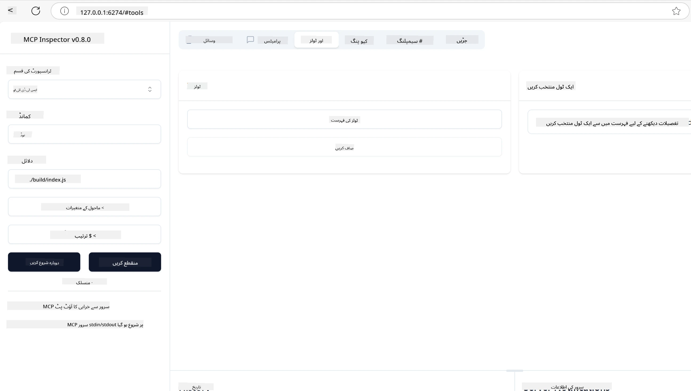
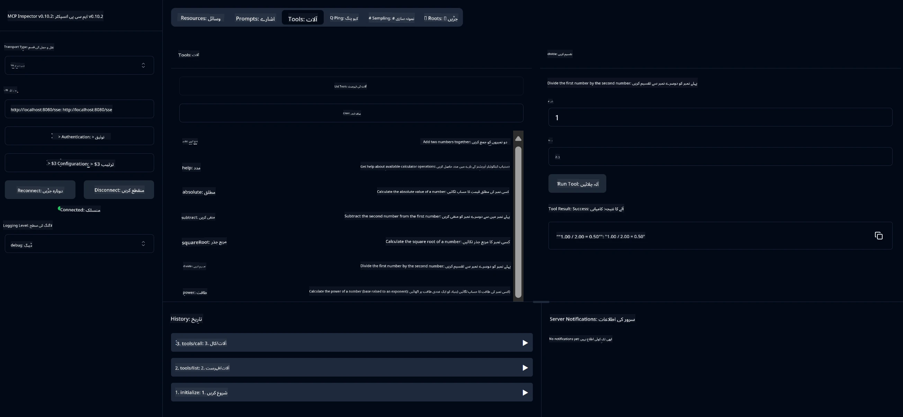
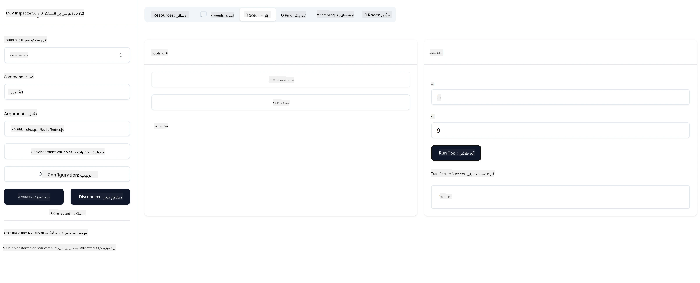

# MCP کے ساتھ شروع کرنا

> [!NOTE]
> اس سبق میں جاوا HTTP کی مثال پرانے HTTP+SSE ٹرانسپورٹ کا استعمال کرتی ہے اور
> MCP `2025-11-25` کے مطابقت پذیر SDK کے لیے ہدف ہے۔ نئے دور دراز سرورز کے لیے،
> `2026-07-28` اسٹریم ایبل HTTP ٹرانسپورٹ استعمال کریں اور اپنے SDK میں حمایت کی تصدیق کریں۔

ماڈل کانٹیکسٹ پروٹوکول (MCP) کے ساتھ اپنے پہلے اقدامات میں خوش آمدید! چاہے آپ MCP میں نئے ہیں یا اپنی سمجھ بوجھ کو گہرا کرنا چاہتے ہیں، یہ رہنما آپ کو ضروری سیٹ اپ اور ترقیاتی عمل سے گزرے گا۔ آپ سیکھیں گے کہ MCP کیسے AI ماڈلز اور ایپلیکیشنز کے درمیان ہموار انضمام کو ممکن بناتا ہے، اور جلدی سے اپنے ماحول کو MCP سے چلنے والے حل تیار کرنے اور تجربہ کرنے کے لیے کیسے تیار کریں۔

> مختصر: اگر آپ AI ایپس بناتے ہیں، تو آپ جانتے ہیں کہ آپ اپنے LLM (بڑا زبان ماڈل) میں ٹولز اور دیگر وسائل شامل کر سکتے ہیں تاکہ LLM زیادہ معلوماتی بن جائے۔ تاہم، اگر آپ یہ ٹولز اور وسائل کسی سرور پر رکھتے ہیں، تو ایپ اور سرور صلاحیتیں کسی بھی کلائنٹ کی طرف سے LLM کے ساتھ یا بغیر استعمال کی جا سکتی ہیں۔

## جائزہ

یہ سبق MCP ماحولیات قائم کرنے اور اپنے پہلے MCP ایپلیکیشنز بنانے کی عملی رہنمائی فراہم کرتا ہے۔ آپ سیکھیں گے کہ ضروری ٹولز اور فریم ورک کیسے سیٹ اپ کریں، بنیادی MCP سرورز بنائیں، میزبان ایپلیکیشنز تیار کریں، اور اپنی نفاذات کی جانچ کریں۔

ماڈل کانٹیکسٹ پروٹوکول (MCP) ایک کھلا پروٹوکول ہے جو ایپلیکیشنز کو LLMs کو کانٹیکسٹ فراہم کرنے کے طریقہ کار کو معیاری بناتا ہے۔ MCP کو AI ایپلیکیشنز کے لیے USB-C پورٹ کی طرح سمجھیں - یہ AI ماڈلز کو مختلف ڈیٹا ذرائع اور ٹولز سے منسلک کرنے کا معیاری طریقہ فراہم کرتا ہے۔

## تعلیمی مقاصد

اس سبق کے آخر تک آپ قابل ہوں گے:

- C#, جاوا، پائتھون، ٹائپ اسکرپٹ، اور رسٹ میں MCP کے لیے ترقیاتی ماحول قائم کرنا
- بنیادی MCP سرورز کو حسب ضرورت خصوصیات (وسائل، پرامپٹس، اور ٹولز) کے ساتھ بنانا اور تعینات کرنا
- MCP سرورز سے منسلک میزبان ایپلیکیشنز بنانا
- MCP کی نفاذات کا تجربہ کرنا اور ان کی خرابی دور کرنا

## اپنا MCP ماحول سیٹ اپ کرنا

MCP کے ساتھ کام شروع کرنے سے پہلے، اپنے ترقیاتی ماحول کو تیار کرنا اور بنیادی ورک فلو کو سمجھنا ضروری ہے۔ یہ سیکشن آپ کو ابتدائی سیٹ اپ کے اقدامات میں رہنمائی کرے گا تاکہ MCP کے ساتھ ایک ہموار آغاز یقینی بنایا جا سکے۔

### ضروریات

MCP کی ترقی میں داخل ہونے سے پہلے، یقینی بنائیں کہ آپ کے پاس موجود ہے:

- **ترقیاتی ماحول**: اپنی منتخب زبان (C#, جاوا، پائتھون، ٹائپ اسکرپٹ، یا رسٹ) کے لئے
- **IDE/ایڈیٹر**: Visual Studio، Visual Studio Code، IntelliJ، Eclipse، PyCharm، یا کوئی جدید کوڈ ایڈیٹر
- **پیکیج مینیجرز**: NuGet، Maven/Gradle، pip، npm/yarn، یا Cargo
- **API کلیدیں**: اپنے میزبان ایپلیکیشنز میں استعمال کے لیے کسی AI سروس کے لیے

## بنیادی MCP سرور کا ڈھانچہ

ایک MCP سرور عام طور پر شامل ہوتا ہے:

- **سرور کی ترتیب**: پورٹ، توثیق، اور دیگر ترتیبات سیٹ اپ کرنا
- **وسائل**: LLMs کو دستیاب کیے جانے والے ڈیٹا اور کانٹیکسٹ
- **ٹولز**: وہ فعالیت جو ماڈلز چلا سکتے ہیں
- **پرامپٹس**: متن بنانے یا ترتیب دینے کے لیے ٹیمپلیٹس

یہاں ٹائپ اسکرپٹ میں ایک آسان مثال ہے:

```typescript
import { McpServer, ResourceTemplate } from "@modelcontextprotocol/sdk/server/mcp.js";
import { StdioServerTransport } from "@modelcontextprotocol/sdk/server/stdio.js";
import { z } from "zod";

// ایک MCP سرور بنائیں
const server = new McpServer({
  name: "Demo",
  version: "1.0.0"
});

// ایک اضافی ٹول شامل کریں
server.tool("add",
  { a: z.number(), b: z.number() },
  async ({ a, b }) => ({
    content: [{ type: "text", text: String(a + b) }]
  })
);

// ایک متحرک خوش آمدیدی وسیلہ شامل کریں
server.resource(
  "file",
  // 'list' پیرامیٹر کنٹرول کرتا ہے کہ کس طرح وسیلہ دستیاب فائلوں کی فہرست بناتا ہے۔ اسے غیر معین (undefined) پر سیٹ کرنے سے اس وسیلہ کے لیے فہرست سازی غیر فعال ہو جاتی ہے۔
  new ResourceTemplate("file://{path}", { list: undefined }),
  async (uri, { path }) => ({
    contents: [{
      uri: uri.href,
      text: `File, ${path}!`
    }]
  })
);

// ایک فائل وسیلہ شامل کریں جو فائل کے مواد کو پڑھتا ہے
server.resource(
  "file",
  new ResourceTemplate("file://{path}", { list: undefined }),
  async (uri, { path }) => {
    let text;
    try {
      text = await fs.readFile(path, "utf8");
    } catch (err) {
      text = `Error reading file: ${err.message}`;
    }
    return {
      contents: [{
        uri: uri.href,
        text
      }]
    };
  }
);

server.prompt(
  "review-code",
  { code: z.string() },
  ({ code }) => ({
    messages: [{
      role: "user",
      content: {
        type: "text",
        text: `Please review this code:\n\n${code}`
      }
    }]
  })
);

// stdin پر پیغامات وصول کرنا اور stdout پر پیغامات بھیجنا شروع کریں
const transport = new StdioServerTransport();
await server.connect(transport);
```

پچھلے کوڈ میں ہم نے:

- MCP ٹائپ اسکرپٹ SDK سے ضروری کلاسز درآمد کیں۔
- ایک نیا MCP سرور انسٹانس بنایا اور ترتیب دیا۔
- ایک حسب ضرورت ٹول (`calculator`) کو ہینڈلر فنکشن کے ساتھ رجسٹر کیا۔
- سرور کو MCP درخواستیں سننے کے لیے شروع کیا۔

## جانچ اور خرابی دور کرنا

اپنے MCP سرور کی جانچ شروع کرنے سے پہلے، دستیاب ٹولز اور خرابی دور کرنے کے بہترین طریقوں کو سمجھنا ضروری ہے۔ مؤثر جانچ یقینی بناتی ہے کہ آپ کا سرور جس طرح ہونا چاہیے ویسا کام کرتا ہے اور آپ کو مسائل کی شناخت اور حل جلدی کرنے میں مدد دیتی ہے۔ اگلا سیکشن MCP نفاذ کی تصدیق کے لیے تجویز کردہ طریقے بیان کرتا ہے۔

MCP آپ کو اپنے سرورز کی جانچ اور خرابی دور کرنے میں مدد کے لیے ٹولز فراہم کرتا ہے:

- **انسپکٹر ٹول**، یہ گرافیکل انٹرفیس آپ کو اپنے سرور سے جڑنے اور اپنے ٹولز، پرامپٹس اور وسائل کی جانچ کرنے کی اجازت دیتا ہے۔
- **کرل**، آپ سرور سے کنیکٹ کرنے کے لیے کمانڈ لائن ٹول curl یا دیگر کلائنٹس کا استعمال بھی کر سکتے ہیں جو HTTP کمانڈز بنا اور چلا سکتے ہیں۔

### MCP انسپکٹر کا استعمال

[MCP انسپکٹر](https://github.com/modelcontextprotocol/inspector) ایک بصری جانچ کا ٹول ہے جو آپ کی مدد کرتا ہے:

1. **سرور صلاحیتوں کا پتہ لگانا**: دستیاب وسائل، ٹولز، اور پرامپٹس کو خودکار طریقے سے دریافت کریں
2. **ٹول کی کارکردگی کی جانچ**: مختلف پیرامیٹر آزما کر اور ردعمل حقیقی وقت میں دیکھیں
3. **سرور میٹا ڈیٹا دیکھیں**: سرور کی معلومات، اسکیموں، اور ترتیبات کا معائنہ کریں

```bash
# مثلاً TypeScript، MCP انسپکٹر کو انسٹال اور چلانا
npx @modelcontextprotocol/inspector node build/index.js
```

جب آپ اوپر دیے گئے کمانڈز چلائیں گے، تو MCP انسپکٹر آپ کے براؤزر میں ایک مقامی ویب انٹرفیس لانچ کرے گا۔ آپ کو ایک ڈیش بورڈ دکھائی دے گا جس میں آپ کے رجسٹرڈ MCP سرور، ان کے دستیاب ٹولز، وسائل اور پرامپٹس شامل ہوں گے۔ یہ انٹرفیس آپ کو فعال طور پر ٹول کی کارکردگی کی جانچ، سرور میٹا ڈیٹا کی جانچ، اور حقیقی وقت میں ردعمل دیکھنے کی سہولت دیتا ہے، جس سے آپ کے MCP سرور نفاذات کی تصدیق اور خرابی دور کرنا آسان ہو جاتا ہے۔

یہاں ایک اسکرین شاٹ ہے کہ یہ کیسا لگ سکتا ہے:



## عام سیٹ اپ مسائل اور حل

| مسئلہ | ممکنہ حل |
|-------|-------------------|
| کنکشن مسترد ہوگیا | چیک کریں کہ سرور چل رہا ہے اور پورٹ درست ہے |
| ٹول کی کارکردگی میں غلطیاں | پیرامیٹر کی توثیق اور خرابی سنبھالنے کا جائزہ لیں |
| توثیق کی ناکامیاں | API کلیدوں اور اجازتوں کی تصدیق کریں |
| اسکیمہ کی توثیق غلطیاں | یقینی بنائیں کہ پیرامیٹرز تعریف شدہ اسکیمہ سے میل کھاتے ہیں |
| سرور شروع نہیں ہو رہا | پورٹ ٹکراؤ یا گم شدہ انحصارات چیک کریں |
| CORS کی غلطیاں | کراس ماخذ درخواستوں کے لیے مناسب CORS ہیڈرز کو ترتیب دیں |
| توثیقی مسائل | ٹوکن کی درستگی اور اجازتوں کی تصدیق کریں |

## مقامی ترقی

مقامی ترقی اور جانچ کے لیے، آپ اپنے کمپیوٹر پر براہ راست MCP سرور چلا سکتے ہیں:

1. **سرور عمل شروع کریں**: اپنی MCP سرور ایپلیکیشن چلائیں
2. **نیٹ ورکنگ ترتیب دیں**: یقینی بنائیں کہ سرور متوقع پورٹ پر قابل رسائی ہے
3. **کلائنٹس کو منسلک کریں**: `http://localhost:3000` جیسے مقامی کنکشن URLs استعمال کریں

```bash
# مثال: ٹائپ اسکرپٹ MCP سرور کو مقامی طور پر چلانا
npm run start
# سرور http://localhost:3000 پر چل رہا ہے
```

## اپنا پہلا MCP سرور بنانا

ہم نے پہلے سبق میں [بنیادی تصورات](../../01-CoreConcepts/README.md) کا احاطہ کیا ہے، اب وقت ہے کہ اس علم کو کام میں لائیں۔

### سرور کیا کر سکتا ہے

کوڈ لکھنا شروع کرنے سے پہلے، آیئے یاد دلاتے ہیں کہ سرور کیا کر سکتا ہے:

ایک MCP سرور مثال کے طور پر یہ کر سکتا ہے:

- مقامی فائلوں اور ڈیٹا بیسز تک رسائی حاصل کرنا
- دور دراز APIs سے جڑنا
- حسابات انجام دینا
- دیگر ٹولز اور خدمات کے ساتھ انضمام کرنا
- انٹریکشن کے لیے صارف انٹرفیس فراہم کرنا

بہت اچھا، اب جب کہ ہم جانتے ہیں کہ اس کے لیے کیا کیا جا سکتا ہے، آیئے کوڈنگ شروع کریں۔

## مشق: سرور بنانا

سرور بنانے کے لیے، آپ کو یہ مراحل پورے کرنے ہوں گے:

- MCP SDK انسٹال کریں۔
- ایک پروجیکٹ بنائیں اور پروجیکٹ کا ڈھانچہ ترتیب دیں۔
- سرور کوڈ لکھیں۔
- سرور کی جانچ کریں۔

### -1- پروجیکٹ بنائیں

#### ٹائپ اسکرپٹ

```sh
# پراجیکٹ ڈائریکٹری بنائیں اور npm پروجیکٹ کو شروع کریں
mkdir calculator-server
cd calculator-server
npm init -y
```

#### پائتھون

```sh
# پروجیکٹ ڈائریکٹری بنائیں
mkdir calculator-server
cd calculator-server
# فولڈر کو Visual Studio Code میں کھولیں - اگر آپ کوئی اور IDE استعمال کر رہے ہیں تو یہ مرحلہ چھوڑ دیں
code .
```

#### .NET

```sh
dotnet new console -n McpCalculatorServer
cd McpCalculatorServer
```

#### جاوا

جاوا کے لیے، ایک Spring Boot پروجیکٹ بنائیں:

```bash
curl https://start.spring.io/starter.zip \
  -d dependencies=web \
  -d javaVersion=21 \
  -d type=maven-project \
  -d groupId=com.example \
  -d artifactId=calculator-server \
  -d name=McpServer \
  -d packageName=com.microsoft.mcp.sample.server \
  -o calculator-server.zip
```

زپ فائل نکالیں:

```bash
unzip calculator-server.zip -d calculator-server
cd calculator-server
# غیر ضروری ٹیسٹ کو اختیاری طور پر ہٹائیں
rm -rf src/test/java
```

اپنے *pom.xml* فائل میں درج ذیل مکمل ترتیب شامل کریں:

```xml
<?xml version="1.0" encoding="UTF-8"?>
<project xmlns="http://maven.apache.org/POM/4.0.0"
    xmlns:xsi="http://www.w3.org/2001/XMLSchema-instance"
    xsi:schemaLocation="http://maven.apache.org/POM/4.0.0 http://maven.apache.org/xsd/maven-4.0.0.xsd">
    <modelVersion>4.0.0</modelVersion>
    
    <!-- Spring Boot parent for dependency management -->
    <parent>
        <groupId>org.springframework.boot</groupId>
        <artifactId>spring-boot-starter-parent</artifactId>
        <version>3.5.0</version>
        <relativePath />
    </parent>

    <!-- Project coordinates -->
    <groupId>com.example</groupId>
    <artifactId>calculator-server</artifactId>
    <version>0.0.1-SNAPSHOT</version>
    <name>Calculator Server</name>
    <description>Basic calculator MCP service for beginners</description>

    <!-- Properties -->
    <properties>
        <java.version>21</java.version>
        <maven.compiler.source>21</maven.compiler.source>
        <maven.compiler.target>21</maven.compiler.target>
    </properties>

    <!-- Spring AI BOM for version management -->
    <dependencyManagement>
        <dependencies>
            <dependency>
                <groupId>org.springframework.ai</groupId>
                <artifactId>spring-ai-bom</artifactId>
                <version>1.0.0-SNAPSHOT</version>
                <type>pom</type>
                <scope>import</scope>
            </dependency>
        </dependencies>
    </dependencyManagement>

    <!-- Dependencies -->
    <dependencies>
        <dependency>
            <groupId>org.springframework.ai</groupId>
            <artifactId>spring-ai-starter-mcp-server-webflux</artifactId>
        </dependency>
        <dependency>
            <groupId>org.springframework.boot</groupId>
            <artifactId>spring-boot-starter-actuator</artifactId>
        </dependency>
        <dependency>
         <groupId>org.springframework.boot</groupId>
         <artifactId>spring-boot-starter-test</artifactId>
         <scope>test</scope>
      </dependency>
    </dependencies>

    <!-- Build configuration -->
    <build>
        <plugins>
            <plugin>
                <groupId>org.springframework.boot</groupId>
                <artifactId>spring-boot-maven-plugin</artifactId>
            </plugin>
            <plugin>
                <groupId>org.apache.maven.plugins</groupId>
                <artifactId>maven-compiler-plugin</artifactId>
                <configuration>
                    <release>21</release>
                </configuration>
            </plugin>
        </plugins>
    </build>

    <!-- Repositories for Spring AI snapshots -->
    <repositories>
        <repository>
            <id>spring-milestones</id>
            <name>Spring Milestones</name>
            <url>https://repo.spring.io/milestone</url>
            <snapshots>
                <enabled>false</enabled>
            </snapshots>
        </repository>
        <repository>
            <id>spring-snapshots</id>
            <name>Spring Snapshots</name>
            <url>https://repo.spring.io/snapshot</url>
            <releases>
                <enabled>false</enabled>
            </releases>
        </repository>
    </repositories>
</project>
```

#### رسٹ

```sh
mkdir calculator-server
cd calculator-server
cargo init
```

### -2- انحصارات شامل کریں

اب جب آپ کا پروجیکٹ تیار ہے، آیئے انحصارات شامل کریں:

#### ٹائپ اسکرپٹ

```sh
# اگر پہلے سے انسٹال نہ ہو، تو TypeScript کو عالمی سطح پر انسٹال کریں
npm install typescript -g

# schema validation کے لیے MCP SDK اور Zod انسٹال کریں
npm install @modelcontextprotocol/sdk zod
npm install -D @types/node typescript
```

#### پائتھون

```sh
# ایک ورچوئل ماحول بنائیں اور انحصار انسٹال کریں
python -m venv venv
venv\Scripts\activate
pip install "mcp[cli]"
```

#### جاوا

```bash
cd calculator-server
./mvnw clean install -DskipTests
```

#### رسٹ

```sh
cargo add rmcp --features server,transport-io
cargo add serde
cargo add tokio --features rt-multi-thread
```

### -3- پروجیکٹ فائلز بنائیں

#### ٹائپ اسکرپٹ

*package.json* فائل کھولیں اور اس کا مواد درج ذیل سے بدلیں تاکہ آپ سرور کو بنا اور چلا سکیں:

```json
{
  "name": "calculator-server",
  "version": "1.0.0",
  "main": "index.js",
  "type": "module",
  "scripts": {
    "build": "tsc",
    "start": "npm run build && node ./build/index.js",
  },
  "keywords": [],
  "author": "",
  "license": "ISC",
  "description": "A simple calculator server using Model Context Protocol",
  "dependencies": {
    "@modelcontextprotocol/sdk": "^1.16.0",
    "zod": "^3.25.76"
  },
  "devDependencies": {
    "@types/node": "^24.0.14",
    "typescript": "^5.8.3"
  }
}
```

ایک *tsconfig.json* بنائیں درج ذیل مواد کے ساتھ:

```json
{
  "compilerOptions": {
    "target": "ES2022",
    "module": "Node16",
    "moduleResolution": "Node16",
    "outDir": "./build",
    "rootDir": "./src",
    "strict": true,
    "esModuleInterop": true,
    "skipLibCheck": true,
    "forceConsistentCasingInFileNames": true
  },
  "include": ["src/**/*"],
  "exclude": ["node_modules"]
}
```

اپنے سورس کوڈ کے لیے ایک ڈائریکٹری بنائیں:

```sh
mkdir src
touch src/index.ts
```

#### پائتھون

ایک فائل *server.py* بنائیں

```sh
touch server.py
```

#### .NET

ضروری NuGet پیکیجز انسٹال کریں:

```sh
dotnet add package ModelContextProtocol --prerelease
dotnet add package Microsoft.Extensions.Hosting
```

#### جاوا

جاوا Spring Boot پروجیکٹس کے لیے، پروجیکٹ ڈھانچہ خود بخود بنایا جاتا ہے۔

#### رسٹ

رسٹ کے لیے، *src/main.rs* فائل ڈیفالٹ طور پر بنائی جاتی ہے جب آپ `cargo init` چلائیں۔ فائل کھولیں اور ڈیفالٹ کوڈ حذف کریں۔

### -4- سرور کوڈ بنائیں

#### ٹائپ اسکرپٹ

ایک فائل *index.ts* بنائیں اور مندرجہ ذیل کوڈ شامل کریں:

```typescript
import { McpServer, ResourceTemplate } from "@modelcontextprotocol/sdk/server/mcp.js";
import { StdioServerTransport } from "@modelcontextprotocol/sdk/server/stdio.js";
import { z } from "zod";
 
// ایک MCP سرور بنائیں
const server = new McpServer({
  name: "Calculator MCP Server",
  version: "1.0.0"
});
```

اب آپ کے پاس سرور ہے، لیکن یہ زیادہ کچھ نہیں کرتا، اسے درست کرتے ہیں۔

#### پائتھون

```python
# server.py
from mcp.server.fastmcp import FastMCP

# ایک MCP سرور بنائیں
mcp = FastMCP("Demo")
```

#### .NET

```csharp
using Microsoft.Extensions.DependencyInjection;
using Microsoft.Extensions.Hosting;
using Microsoft.Extensions.Logging;
using ModelContextProtocol.Server;
using System.ComponentModel;

var builder = Host.CreateApplicationBuilder(args);
builder.Logging.AddConsole(consoleLogOptions =>
{
    // Configure all logs to go to stderr
    consoleLogOptions.LogToStandardErrorThreshold = LogLevel.Trace;
});

builder.Services
    .AddMcpServer()
    .WithStdioServerTransport()
    .WithToolsFromAssembly();
await builder.Build().RunAsync();

// add features
```

#### جاوا

جاوا کے لیے، بنیادی سرور اجزاء بنائیں۔ پہلے مین ایپلیکیشن کلاس کو تبدیل کریں:

*src/main/java/com/microsoft/mcp/sample/server/McpServerApplication.java*:

```java
package com.microsoft.mcp.sample.server;

import org.springframework.ai.tool.ToolCallbackProvider;
import org.springframework.ai.tool.method.MethodToolCallbackProvider;
import org.springframework.boot.SpringApplication;
import org.springframework.boot.autoconfigure.SpringBootApplication;
import org.springframework.context.annotation.Bean;
import com.microsoft.mcp.sample.server.service.CalculatorService;

@SpringBootApplication
public class McpServerApplication {

    public static void main(String[] args) {
        SpringApplication.run(McpServerApplication.class, args);
    }
    
    @Bean
    public ToolCallbackProvider calculatorTools(CalculatorService calculator) {
        return MethodToolCallbackProvider.builder().toolObjects(calculator).build();
    }
}
```

کیلکولیٹر سروس بنائیں *src/main/java/com/microsoft/mcp/sample/server/service/CalculatorService.java*:

```java
package com.microsoft.mcp.sample.server.service;

import org.springframework.ai.tool.annotation.Tool;
import org.springframework.stereotype.Service;

/**
 * Service for basic calculator operations.
 * This service provides simple calculator functionality through MCP.
 */
@Service
public class CalculatorService {

    /**
     * Add two numbers
     * @param a The first number
     * @param b The second number
     * @return The sum of the two numbers
     */
    @Tool(description = "Add two numbers together")
    public String add(double a, double b) {
        double result = a + b;
        return formatResult(a, "+", b, result);
    }

    /**
     * Subtract one number from another
     * @param a The number to subtract from
     * @param b The number to subtract
     * @return The result of the subtraction
     */
    @Tool(description = "Subtract the second number from the first number")
    public String subtract(double a, double b) {
        double result = a - b;
        return formatResult(a, "-", b, result);
    }

    /**
     * Multiply two numbers
     * @param a The first number
     * @param b The second number
     * @return The product of the two numbers
     */
    @Tool(description = "Multiply two numbers together")
    public String multiply(double a, double b) {
        double result = a * b;
        return formatResult(a, "*", b, result);
    }

    /**
     * Divide one number by another
     * @param a The numerator
     * @param b The denominator
     * @return The result of the division
     */
    @Tool(description = "Divide the first number by the second number")
    public String divide(double a, double b) {
        if (b == 0) {
            return "Error: Cannot divide by zero";
        }
        double result = a / b;
        return formatResult(a, "/", b, result);
    }

    /**
     * Calculate the power of a number
     * @param base The base number
     * @param exponent The exponent
     * @return The result of raising the base to the exponent
     */
    @Tool(description = "Calculate the power of a number (base raised to an exponent)")
    public String power(double base, double exponent) {
        double result = Math.pow(base, exponent);
        return formatResult(base, "^", exponent, result);
    }

    /**
     * Calculate the square root of a number
     * @param number The number to find the square root of
     * @return The square root of the number
     */
    @Tool(description = "Calculate the square root of a number")
    public String squareRoot(double number) {
        if (number < 0) {
            return "Error: Cannot calculate square root of a negative number";
        }
        double result = Math.sqrt(number);
        return String.format("√%.2f = %.2f", number, result);
    }

    /**
     * Calculate the modulus (remainder) of division
     * @param a The dividend
     * @param b The divisor
     * @return The remainder of the division
     */
    @Tool(description = "Calculate the remainder when one number is divided by another")
    public String modulus(double a, double b) {
        if (b == 0) {
            return "Error: Cannot divide by zero";
        }
        double result = a % b;
        return formatResult(a, "%", b, result);
    }

    /**
     * Calculate the absolute value of a number
     * @param number The number to find the absolute value of
     * @return The absolute value of the number
     */
    @Tool(description = "Calculate the absolute value of a number")
    public String absolute(double number) {
        double result = Math.abs(number);
        return String.format("|%.2f| = %.2f", number, result);
    }

    /**
     * Get help about available calculator operations
     * @return Information about available operations
     */
    @Tool(description = "Get help about available calculator operations")
    public String help() {
        return "Basic Calculator MCP Service\n\n" +
               "Available operations:\n" +
               "1. add(a, b) - Adds two numbers\n" +
               "2. subtract(a, b) - Subtracts the second number from the first\n" +
               "3. multiply(a, b) - Multiplies two numbers\n" +
               "4. divide(a, b) - Divides the first number by the second\n" +
               "5. power(base, exponent) - Raises a number to a power\n" +
               "6. squareRoot(number) - Calculates the square root\n" + 
               "7. modulus(a, b) - Calculates the remainder of division\n" +
               "8. absolute(number) - Calculates the absolute value\n\n" +
               "Example usage: add(5, 3) will return 5 + 3 = 8";
    }

    /**
     * Format the result of a calculation
     */
    private String formatResult(double a, String operator, double b, double result) {
        return String.format("%.2f %s %.2f = %.2f", a, operator, b, result);
    }
}
```

**پیداواری تیاری کے لیے اختیاری اجزاء:**

اسٹارٹ اپ کنفیگریشن بنائیں *src/main/java/com/microsoft/mcp/sample/server/config/StartupConfig.java*:

```java
package com.microsoft.mcp.sample.server.config;

import org.springframework.boot.CommandLineRunner;
import org.springframework.context.annotation.Bean;
import org.springframework.context.annotation.Configuration;

@Configuration
public class StartupConfig {
    
    @Bean
    public CommandLineRunner startupInfo() {
        return args -> {
            System.out.println("\n" + "=".repeat(60));
            System.out.println("Calculator MCP Server is starting...");
            System.out.println("SSE endpoint: http://localhost:8080/sse");
            System.out.println("Health check: http://localhost:8080/actuator/health");
            System.out.println("=".repeat(60) + "\n");
        };
    }
}
```

ہیلتھ کنٹرولر بنائیں *src/main/java/com/microsoft/mcp/sample/server/controller/HealthController.java*:

```java
package com.microsoft.mcp.sample.server.controller;

import org.springframework.http.ResponseEntity;
import org.springframework.web.bind.annotation.GetMapping;
import org.springframework.web.bind.annotation.RestController;
import java.time.LocalDateTime;
import java.util.HashMap;
import java.util.Map;

@RestController
public class HealthController {
    
    @GetMapping("/health")
    public ResponseEntity<Map<String, Object>> healthCheck() {
        Map<String, Object> response = new HashMap<>();
        response.put("status", "UP");
        response.put("timestamp", LocalDateTime.now().toString());
        response.put("service", "Calculator MCP Server");
        return ResponseEntity.ok(response);
    }
}
```

ایک استثنا ہینڈلر بنائیں *src/main/java/com/microsoft/mcp/sample/server/exception/GlobalExceptionHandler.java*:

```java
package com.microsoft.mcp.sample.server.exception;

import org.springframework.http.HttpStatus;
import org.springframework.http.ResponseEntity;
import org.springframework.web.bind.annotation.ExceptionHandler;
import org.springframework.web.bind.annotation.RestControllerAdvice;

@RestControllerAdvice
public class GlobalExceptionHandler {

    @ExceptionHandler(IllegalArgumentException.class)
    public ResponseEntity<ErrorResponse> handleIllegalArgumentException(IllegalArgumentException ex) {
        ErrorResponse error = new ErrorResponse(
            "Invalid_Input", 
            "Invalid input parameter: " + ex.getMessage());
        return new ResponseEntity<>(error, HttpStatus.BAD_REQUEST);
    }

    public static class ErrorResponse {
        private String code;
        private String message;

        public ErrorResponse(String code, String message) {
            this.code = code;
            this.message = message;
        }

        // گیٹرز
        public String getCode() { return code; }
        public String getMessage() { return message; }
    }
}
```

ایک حسب ضرورت بینر بنائیں *src/main/resources/banner.txt*:

```text
_____      _            _       _             
 / ____|    | |          | |     | |            
| |     __ _| | ___ _   _| | __ _| |_ ___  _ __ 
| |    / _` | |/ __| | | | |/ _` | __/ _ \| '__|
| |___| (_| | | (__| |_| | | (_| | || (_) | |   
 \_____\__,_|_|\___|\__,_|_|\__,_|\__\___/|_|   
                                                
Calculator MCP Server v1.0
Spring Boot MCP Application
```

</details>

#### رسٹ

*src/main.rs* فائل کے اوپر مندرجہ ذیل کوڈ شامل کریں۔ یہ ضروری لائبریریاں اور ماڈیولز درآمد کرتا ہے جو آپ کے MCP سرور کے لیے درکار ہیں۔

```rust
use rmcp::{
    handler::server::{router::tool::ToolRouter, tool::Parameters},
    model::{ServerCapabilities, ServerInfo},
    schemars, tool, tool_handler, tool_router,
    transport::stdio,
    ServerHandler, ServiceExt,
};
use std::error::Error;
```

کیلکولیٹر سرور ایک سادہ سرور ہوگا جو دو عددوں کو جمع کر سکتا ہے۔ ایک struct بنائیں جو کیلکولیٹر درخواست کی نمائندگی کرے۔

```rust
#[derive(Debug, serde::Deserialize, schemars::JsonSchema)]
pub struct CalculatorRequest {
    pub a: f64,
    pub b: f64,
}
```

اگلا، ایک struct بنائیں جو کیلکولیٹر سرور کی نمائندگی کرے۔ یہ struct ٹول روٹر رکھے گا جو ٹولز کو رجسٹر کرنے کے لیے استعمال ہوتا ہے۔

```rust
#[derive(Debug, Clone)]
pub struct Calculator {
    tool_router: ToolRouter<Self>,
}
```

اب، ہم `Calculator` struct کو نافذ کر سکتے ہیں تاکہ سرور کی نئی مثال بنائی جا سکے اور سرور کی معلومات فراہم کرنے کے لیے سرور ہینڈلر کو اپنی مرضی کے مطابق بنایا جا سکے۔

```rust
#[tool_router]
impl Calculator {
    pub fn new() -> Self {
        Self {
            tool_router: Self::tool_router(),
        }
    }
}

#[tool_handler]
impl ServerHandler for Calculator {
    fn get_info(&self) -> ServerInfo {
        ServerInfo {
            instructions: Some("A simple calculator tool".into()),
            capabilities: ServerCapabilities::builder().enable_tools().build(),
            ..Default::default()
        }
    }
}
```

آخر میں، ہمیں مین فنکشن نافذ کرنا ہے تاکہ سرور شروع ہو سکے۔ یہ فنکشن `Calculator` struct کی مثال بنائے گا اور اسے معیاری ان پٹ / آؤٹ پٹ پر فراہم کرے گا۔

```rust
#[tokio::main]
async fn main() -> Result<(), Box<dyn Error>> {
    let service = Calculator::new().serve(stdio()).await?;
    service.waiting().await?;
    Ok(())
}
```

سرور اب بنیادی معلومات فراہم کرنے کے لیے تیار ہے۔ اگلا، ہم ایک ٹول شامل کریں گے جو جمع کرنے کا عمل انجام دے گا۔

### -5- ایک ٹول اور ایک وسیلہ شامل کرنا

درج ذیل کوڈ شامل کر کے ایک ٹول اور ایک وسیلہ شامل کریں:

#### ٹائپ اسکرپٹ

```typescript
server.tool(
  "add",
  { a: z.number(), b: z.number() },
  async ({ a, b }) => ({
    content: [{ type: "text", text: String(a + b) }]
  })
);

server.resource(
  "greeting",
  new ResourceTemplate("greeting://{name}", { list: undefined }),
  async (uri, { name }) => ({
    contents: [{
      uri: uri.href,
      text: `Hello, ${name}!`
    }]
  })
);
```

آپ کے ٹول کو پیرامیٹرز `a` اور `b` ملتے ہیں اور یہ مندرجہ ذیل ردعمل پیدا کرتا ہے:

```typescript
{
  contents: [{
    type: "text", content: "some content"
  }]
}
```

آپ کے وسیلہ کو "greeting" کے ذریعے ایک سٹرنگ کے ذریعہ رسائی حاصل ہے، اور یہ پیرامیٹر `name` لیتا ہے اور ٹول کے مشابہ ردعمل پیدا کرتا ہے:

```typescript
{
  uri: "<href>",
  text: "a text"
}
```

#### پائتھون

```python
# ایک اضافہ کا آلہ شامل کریں
@mcp.tool()
def add(a: int, b: int) -> int:
    """Add two numbers"""
    return a + b


# ایک متحرک خوش آمدید وسیلہ شامل کریں
@mcp.resource("greeting://{name}")
def get_greeting(name: str) -> str:
    """Get a personalized greeting"""
    return f"Hello, {name}!"
```

پچھلے کوڈ میں ہم نے:

- ایک ٹول `add` متعین کیا جو پیرامیٹرز `a` اور `b` لیتا ہے، دونوں عددی ہیں۔
- ایک وسیلہ `greeting` بنایا جو پیرامیٹر `name` لیتا ہے۔

#### .NET

اسے اپنے Program.cs فائل میں شامل کریں:

```csharp
[McpServerToolType]
public static class CalculatorTool
{
    [McpServerTool, Description("Adds two numbers")]
    public static string Add(int a, int b) => $"Sum {a + b}";
}
```

#### جاوا

ٹولز پہلے سے ہی پچھلے مرحلے میں بن چکے ہیں۔

#### رسٹ

`impl Calculator` بلاک کے اندر ایک نیا ٹول شامل کریں:

```rust
#[tool(description = "Adds a and b")]
async fn add(
    &self,
    Parameters(CalculatorRequest { a, b }): Parameters<CalculatorRequest>,
) -> String {
    (a + b).to_string()
}
```

### -6- حتمی کوڈ

آیئے وہ آخری کوڈ شامل کرتے ہیں جس کی ہمیں سرور کی شروعات کے لیے ضرورت ہے:

#### ٹائپ اسکرپٹ

```typescript
// stdin پر پیغامات وصول کرنا شروع کریں اور stdout پر پیغامات بھیجنا
const transport = new StdioServerTransport();
await server.connect(transport);
```

مکمل کوڈ یہ ہے:

```typescript
// index.ts
import { McpServer, ResourceTemplate } from "@modelcontextprotocol/sdk/server/mcp.js";
import { StdioServerTransport } from "@modelcontextprotocol/sdk/server/stdio.js";
import { z } from "zod";

// ایک MCP سرور بنائیں
const server = new McpServer({
  name: "Calculator MCP Server",
  version: "1.0.0"
});

// ایک جمع کرنے والا آلہ شامل کریں
server.tool(
  "add",
  { a: z.number(), b: z.number() },
  async ({ a, b }) => ({
    content: [{ type: "text", text: String(a + b) }]
  })
);

// ایک متحرک سلامتی وسایل شامل کریں
server.resource(
  "greeting",
  new ResourceTemplate("greeting://{name}", { list: undefined }),
  async (uri, { name }) => ({
    contents: [{
      uri: uri.href,
      text: `Hello, ${name}!`
    }]
  })
);

// stdin پر پیغامات وصول کرنا اور stdout پر پیغامات بھیجنا شروع کریں
const transport = new StdioServerTransport();
server.connect(transport);
```

#### پائتھون

```python
# سرور.py
from mcp.server.fastmcp import FastMCP

# ایک MCP سرور بنائیں
mcp = FastMCP("Demo")


# ایک اضافی ٹول شامل کریں
@mcp.tool()
def add(a: int, b: int) -> int:
    """Add two numbers"""
    return a + b


# ایک متحرک خوش آمدید وسیلہ شامل کریں
@mcp.resource("greeting://{name}")
def get_greeting(name: str) -> str:
    """Get a personalized greeting"""
    return f"Hello, {name}!"

# مرکزی عمل درآمد بلاک - سرور چلانے کے لیے یہ ضروری ہے
if __name__ == "__main__":
    mcp.run()
```

#### .NET

درج ذیل مواد کے ساتھ Program.cs فائل بنائیں:

```csharp
using Microsoft.Extensions.DependencyInjection;
using Microsoft.Extensions.Hosting;
using Microsoft.Extensions.Logging;
using ModelContextProtocol.Server;
using System.ComponentModel;

var builder = Host.CreateApplicationBuilder(args);
builder.Logging.AddConsole(consoleLogOptions =>
{
    // Configure all logs to go to stderr
    consoleLogOptions.LogToStandardErrorThreshold = LogLevel.Trace;
});

builder.Services
    .AddMcpServer()
    .WithStdioServerTransport()
    .WithToolsFromAssembly();
await builder.Build().RunAsync();

[McpServerToolType]
public static class CalculatorTool
{
    [McpServerTool, Description("Adds two numbers")]
    public static string Add(int a, int b) => $"Sum {a + b}";
}
```

#### جاوا

آپ کی مکمل مین ایپلیکیشن کلاس ایسی دکھنی چاہیے:

```java
// ایم سی پی سرور ایپلیکیشن.java
package com.microsoft.mcp.sample.server;

import org.springframework.ai.tool.ToolCallbackProvider;
import org.springframework.ai.tool.method.MethodToolCallbackProvider;
import org.springframework.boot.SpringApplication;
import org.springframework.boot.autoconfigure.SpringBootApplication;
import org.springframework.context.annotation.Bean;
import com.microsoft.mcp.sample.server.service.CalculatorService;

@SpringBootApplication
public class McpServerApplication {

    public static void main(String[] args) {
        SpringApplication.run(McpServerApplication.class, args);
    }
    
    @Bean
    public ToolCallbackProvider calculatorTools(CalculatorService calculator) {
        return MethodToolCallbackProvider.builder().toolObjects(calculator).build();
    }
}
```

#### رسٹ

رسٹ سرور کے لیے حتمی کوڈ اس طرح ہونا چاہیے:

```rust
use rmcp::{
    ServerHandler, ServiceExt,
    handler::server::{router::tool::ToolRouter, tool::Parameters},
    model::{ServerCapabilities, ServerInfo},
    schemars, tool, tool_handler, tool_router,
    transport::stdio,
};
use std::error::Error;

#[derive(Debug, serde::Deserialize, schemars::JsonSchema)]
pub struct CalculatorRequest {
    pub a: f64,
    pub b: f64,
}

#[derive(Debug, Clone)]
pub struct Calculator {
    tool_router: ToolRouter<Self>,
}

#[tool_router]
impl Calculator {
    pub fn new() -> Self {
        Self {
            tool_router: Self::tool_router(),
        }
    }
    
    #[tool(description = "Adds a and b")]
    async fn add(
        &self,
        Parameters(CalculatorRequest { a, b }): Parameters<CalculatorRequest>,
    ) -> String {
        (a + b).to_string()
    }
}

#[tool_handler]
impl ServerHandler for Calculator {
    fn get_info(&self) -> ServerInfo {
        ServerInfo {
            instructions: Some("A simple calculator tool".into()),
            capabilities: ServerCapabilities::builder().enable_tools().build(),
            ..Default::default()
        }
    }
}

#[tokio::main]
async fn main() -> Result<(), Box<dyn Error>> {
    let service = Calculator::new().serve(stdio()).await?;
    service.waiting().await?;
    Ok(())
}
```

### -7- سرور کی جانچ کریں

درج ذیل کمانڈ کے ساتھ سرور شروع کریں:

#### ٹائپ اسکرپٹ

```sh
npm run build
```

#### پائتھون

```sh
mcp run server.py
```

> MCP انسپکٹر استعمال کرنے کے لیے، `mcp dev server.py` چلائیں جو خود بخود انسپکٹر شروع کرتا ہے اور ضروری پراکسی سیشن ٹوکن مہیا کرتا ہے۔ اگر `mcp run server.py` استعمال کریں، تو آپ کو ہاتھ سے انسپکٹر شروع کرنا ہوگا اور کنکشن کی ترتیب دینی ہوگی۔

#### .NET

یقینی بنائیں کہ آپ اپنے پروجیکٹ ڈائریکٹری میں ہیں:

```sh
cd McpCalculatorServer
dotnet run
```

#### جاوا

```bash
./mvnw clean install -DskipTests
java -jar target/calculator-server-0.0.1-SNAPSHOT.jar
```

#### رسٹ

سرور کو فارمیٹ اور چلانے کے لیے درج ذیل کمانڈز چلائیں:

```sh
cargo fmt
cargo run
```

### -8- انسپکٹر کے ساتھ چلائیں

انسپکٹر ایک بہترین ٹول ہے جو آپ کا سرور شروع کر سکتا ہے اور آپ کو اس کے ساتھ بات چیت کرنے دیتا ہے تاکہ آپ جانچ سکیں کہ یہ کام کرتا ہے۔ آیئے اس کو شروع کریں:

> [!NOTE]
> "کمانڈ" فیلڈ میں یہ مختلف نظر آ سکتا ہے کیونکہ اس میں آپ کے مخصوص رن ٹائم کے ساتھ سرور چلانے کا کمانڈ شامل ہوتا ہے۔

#### ٹائپ اسکرپٹ

```sh
npx @modelcontextprotocol/inspector node build/index.js
```

یا اسے اپنے *package.json* میں اس طرح شامل کریں: `"inspector": "npx @modelcontextprotocol/inspector node build/index.js"` اور پھر `npm run inspector` چلائیں

#### پائتھون

پائتھون ایک Node.js ٹول انسپکٹر کو لپیٹتا ہے۔ اس ٹول کو یوں چلانا ممکن ہے:

```sh
mcp dev server.py
```


تاہم، یہ آلے پر دستیاب تمام طریقے نافذ نہیں کرتا لہٰذا آپ کو مشورہ دیا جاتا ہے کہ نوڈ۔جی ایس آلہ کو براہ راست نیچے دیے گئے طریقے سے چلائیں:

```sh
npx @modelcontextprotocol/inspector mcp run server.py
```

اگر آپ کوئی ایسا آلہ یا آئی ڈی ای استعمال کر رہے ہیں جو آپ کو اسکپٹس چلانے کے لیے کمانڈز اور آرگیومنٹس ترتیب دینے کی اجازت دیتا ہے، 
تو یقینی بنائیں کہ `Command` فیلڈ میں `python` اور `Arguments` میں `server.py` سیٹ ہے۔ یہ یقینی بنائے گا کہ اسکرپٹ صحیح طریقے سے چل رہی ہے۔

#### .NET

یقینی بنائیں کہ آپ اپنے پروجیکٹ کے ڈائریکٹری میں ہیں:

```sh
cd McpCalculatorServer
npx @modelcontextprotocol/inspector dotnet run
```

#### جاوا

یقینی بنائیں کہ آپ کا کیلیکیولیٹر سرور چل رہا ہے
اس کے بعد انسپیکٹر چلائیں:

```cmd
npx @modelcontextprotocol/inspector
```

انسپیکٹر ویب انٹرفیس میں:

1. "SSE" کو ٹرانسپورٹ ٹائپ کے طور پر منتخب کریں
2. URL کو اس طرح سیٹ کریں: `http://localhost:8080/sse`
3. "Connect" پر کلک کریں



**اب آپ سرور سے جُڑ چکے ہیں**
**جاوا سرور ٹیسٹنگ سیکشن اب مکمل ہو چکا ہے**

اگلا سیکشن سرور کے ساتھ بات چیت کرنے کے بارے میں ہے۔

آپ کو درج ذیل یوزر انٹرفیس نظر آنا چاہیے:


1. "Connect" بٹن منتخب کر کے سرور سے جُڑیں
  جب آپ سرور سے جُڑ جائیں گے تو آپ کو درج ذیل نظر آئے گا:

  

1. "Tools" اور "listTools" منتخب کریں، آپ کو "Add" نظر آئے گا، "Add" منتخب کریں اور پیرامیٹر کی قدریں بھریں۔

  آپ کو درج ذیل جواب نظر آئے گا، یعنی "add" آلے سے حاصل شدہ نتیجہ:

  

مبارک ہو، آپ نے اپنا پہلا سرور کامیابی سے تخلیق اور چلایا ہے!

#### رسٹ

MCP انسپیکٹر CLI کے ساتھ رسٹ سرور چلانے کے لیے مندرجہ ذیل کمانڈ استعمال کریں:

```sh
npx @modelcontextprotocol/inspector cargo run --cli --method tools/call --tool-name add --tool-arg a=1 b=2
```

### آفیشل SDKs

MCP متعدد زبانوں کے لیے آفیشل SDKs فراہم کرتا ہے:

- [C# SDK](https://github.com/modelcontextprotocol/csharp-sdk) - مائیکروسافٹ کے تعاون سے مینٹینڈ
- [Java SDK](https://github.com/modelcontextprotocol/java-sdk) - Spring AI کے تعاون سے مینٹینڈ
- [TypeScript SDK](https://github.com/modelcontextprotocol/typescript-sdk) - آفیشل TypeScript امپلیمنٹیشن
- [Python SDK](https://github.com/modelcontextprotocol/python-sdk) - آفیشل Python امپلیمنٹیشن
- [Kotlin SDK](https://github.com/modelcontextprotocol/kotlin-sdk) - آفیشل Kotlin امپلیمنٹیشن
- [Swift SDK](https://github.com/modelcontextprotocol/swift-sdk) - Loopwork AI کے تعاون سے مینٹینڈ
- [Rust SDK](https://github.com/modelcontextprotocol/rust-sdk) - آفیشل Rust امپلیمنٹیشن

## کل اہم نکات

- MCP ڈویلپمنٹ ماحول کی سیٹنگ زبان مخصوص SDKs کے ساتھ آسان ہے
- MCP سرورز بنانے کے لیے واضح اسکیمز کے ساتھ ٹولز تخلیق اور رجسٹر کرنا شامل ہے
- قابل اعتماد MCP امپلیمنٹیشن کے لیے ٹیسٹنگ اور ڈیبگنگ ضروری ہے

## نمونے

- [Java Calculator](../samples/java/calculator/README.md)
- [.NET Calculator](../../../../03-GettingStarted/samples/csharp)
- [JavaScript Calculator](../samples/javascript/README.md)
- [TypeScript Calculator](../samples/typescript/README.md)
- [Python Calculator](../../../../03-GettingStarted/samples/python)
- [Rust Calculator](../../../../03-GettingStarted/samples/rust)

## اسائنمنٹ

اپنی پسند کے آلے کے ساتھ ایک سادہ MCP سرور بنائیں:

1. اپنے پسندیدہ زبان (.NET, Java, Python, TypeScript, یا Rust) میں آلہ کو نافذ کریں۔
2. ان پٹ پیرامیٹرز اور واپسی کی قدریں متعین کریں۔
3. انسپیکٹر ٹول چلائیں تاکہ یقینی بنائیں کہ سرور درست کام کر رہا ہے۔
4. مختلف ان پٹس کے ساتھ امپلیمنٹیشن کی جانچ کریں۔

## حل

[Solution](./solution/README.md)

## اضافی وسائل

- [Azure پر ماڈل کانٹیکسٹ پروٹوکول کے استعمال سے ایجنٹس بنائیں](https://learn.microsoft.com/azure/developer/ai/intro-agents-mcp)
- [Azure کنٹینر ایپس کے ساتھ ریموٹ MCP (Node.js/TypeScript/JavaScript)](https://learn.microsoft.com/samples/azure-samples/mcp-container-ts/mcp-container-ts/)
- [.NET OpenAI MCP Agent](https://learn.microsoft.com/samples/azure-samples/openai-mcp-agent-dotnet/openai-mcp-agent-dotnet/)

## آگے کیا ہے

اگلا: [MCP کلائنٹس کے ساتھ شروعات](../02-client/README.md)

---

<!-- CO-OP TRANSLATOR DISCLAIMER START -->
**ڈس کلیمر**:
یہ دستاویز AI ترجمہ سروس [Co-op Translator](https://github.com/Azure/co-op-translator) کے ذریعے ترجمہ کی گئی ہے۔ جبکہ ہم درستگی کے لیے کوشاں ہیں، براہ کرم اس بات سے آگاہ رہیں کہ خودکار ترجمے میں غلطیاں یا عدم درستیاں ہو سکتی ہیں۔ اصل دستاویز اپنے مادری زبان میں مستند ماخذ سمجھی جائے گی۔ حساس معلومات کے لیے پیشہ ور انسانی ترجمہ کی سفارش کی جاتی ہے۔ اس ترجمے کے استعمال سے پیدا ہونے والی کسی بھی غلط فہمی یا غلط تشریح کی ذمہ داری ہم قبول نہیں کرتے۔
<!-- CO-OP TRANSLATOR DISCLAIMER END -->