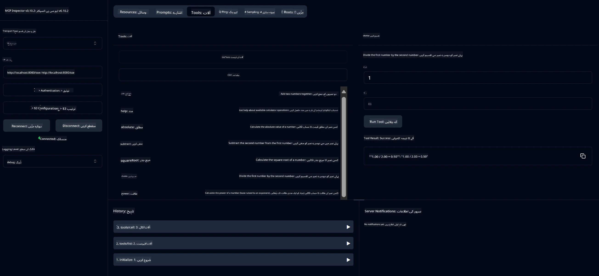

# بنیادی کیلکولیٹر MCP سروس

> [!NOTE]
> یہ جاوا حل پرانا HTTP+SSE ٹرانسپورٹ استعمال کرتا ہے اور MCP `2025-11-25` کے ساتھ مطابقت رکھنے والے SDK کو ہدف بناتا ہے۔
> اسے کورس کے کوڈ سے مماثلت کے لیے برقرار رکھا گیا ہے؛
> نئے ریموٹ سرورز کو `2026-07-28` اسٹریم ایبل HTTP سپورٹ استعمال کرنی چاہیے۔

یہ سروس ماڈل کانٹیکسٹ پروٹوکول (MCP) کے ذریعے بنیادی کیلکولیٹر آپریشنز فراہم کرتی ہے جس میں Spring Boot کے ساتھ WebFlux ٹرانسپورٹ استعمال ہوتا ہے۔ یہ MCP نفاذ سیکھنے والے ابتدائیوں کے لیے ایک آسان مثال کے طور پر ڈیزائن کیا گیا ہے۔

مزید معلومات کے لیے، دیکھیں [MCP Server Boot Starter](https://docs.spring.io/spring-ai/reference/api/mcp/mcp-server-boot-starter-docs.html) کی حوالہ دستاویزات۔


## سروس کا استعمال

یہ سروس MCP پروٹوکول کے ذریعے درج ذیل API اینڈپوائنٹس فراہم کرتی ہے:

- `add(a, b)`: دو نمبروں کا مجموعہ کرنا
- `subtract(a, b)`: دوسرے نمبر کو پہلے نمبر سے تفریق کرنا
- `multiply(a, b)`: دو نمبروں کو ضرب دینا
- `divide(a, b)`: پہلے نمبر کو دوسرے سے تقسیم کرنا (زیرو چیک کے ساتھ)
- `power(base, exponent)`: کسی نمبر کی طاقت کا حساب لگانا
- `squareRoot(number)`: مربع جذر کا حساب لگانا (منفی نمبر کے چیک کے ساتھ)
- `modulus(a, b)`: تقسیم کے دوران باقی بچنے والا حساب لگانا
- `absolute(number)`: عدد کی مطلق قیمت کا حساب لگانا

## انحصارات

اس پراجیکٹ کو درج ذیل اہم انحصارات درکار ہیں:

```xml
<dependency>
    <groupId>org.springframework.ai</groupId>
    <artifactId>spring-ai-starter-mcp-server-webflux</artifactId>
</dependency>
```

## پراجیکٹ کی تعمیر

Maven استعمال کرکے پراجیکٹ بنائیں:
```bash
./mvnw clean install -DskipTests
```

## سرور کو چلانا

### جاوا کا استعمال

```bash
java -jar target/calculator-server-0.0.1-SNAPSHOT.jar
```

### MCP Inspector کا استعمال

MCP Inspector MCP سروسز کے ساتھ رابطہ کرنے کا ایک معاون آلہ ہے۔ اس کیلکولیٹر سروس کے ساتھ استعمال کرنے کے لیے:

1. **MCP Inspector انسٹال اور چلائیں** نئی ٹرمینل ونڈو میں:
   ```bash
   npx @modelcontextprotocol/inspector
   ```

2. **ویب UI تک رسائی حاصل کریں** اس URL پر کلک کرکے جو ایپ دکھاتی ہے (عام طور پر http://localhost:6274)

3. **کنکشن ترتیب دیں**:
   - ٹرانسپورٹ کی قسم "SSE" پر سیٹ کریں
   - URL کو اپنے چلتے ہوئے سرور کے SSE اینڈپوائنٹ پر سیٹ کریں: `http://localhost:8080/sse`
   - "Connect" پر کلک کریں

4. **آلات کا استعمال کریں**:
   - "List Tools" پر کلک کریں تاکہ دستیاب کیلکولیٹر آپریشنز دیکھ سکیں
   - کسی ٹول کو منتخب کریں اور "Run Tool" پر کلک کرکے آپریشن انجام دیں



---

<!-- CO-OP TRANSLATOR DISCLAIMER START -->
**ڈس کلیمر**:
یہ دستاویز AI ترجمہ سروس [Co-op Translator](https://github.com/Azure/co-op-translator) کے ذریعے ترجمہ کی گئی ہے۔ جبکہ ہم درستگی کے لیے کوشاں ہیں، براہ کرم اس بات سے آگاہ رہیں کہ خودکار ترجمے میں غلطیاں یا عدم درستیاں ہو سکتی ہیں۔ اصل دستاویز اپنے مادری زبان میں مستند ماخذ سمجھی جائے گی۔ حساس معلومات کے لیے پیشہ ور انسانی ترجمہ کی سفارش کی جاتی ہے۔ اس ترجمے کے استعمال سے پیدا ہونے والی کسی بھی غلط فہمی یا غلط تشریح کی ذمہ داری ہم قبول نہیں کرتے۔
<!-- CO-OP TRANSLATOR DISCLAIMER END -->