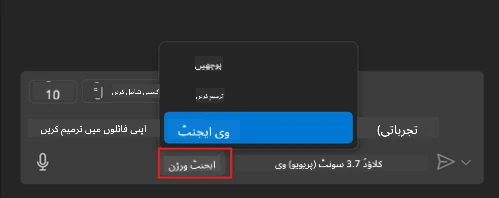
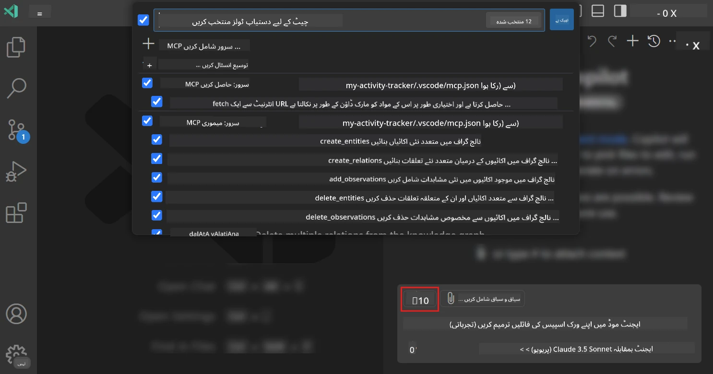
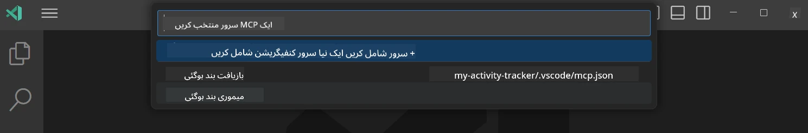
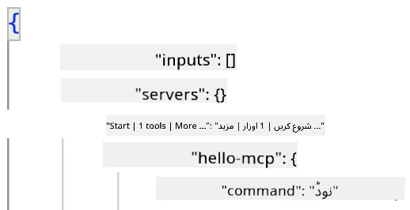
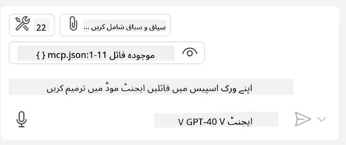
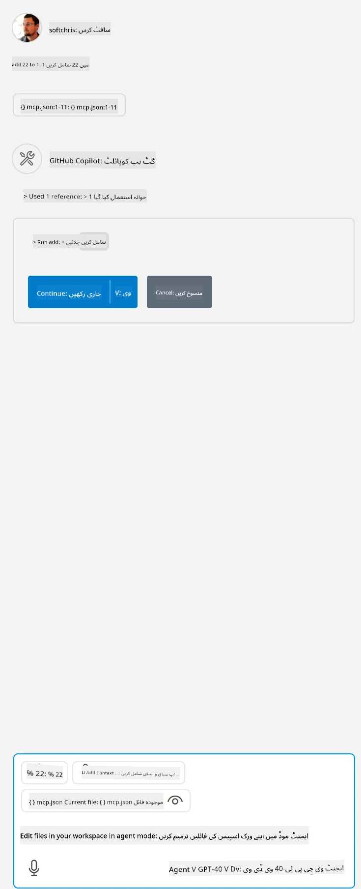

# GitHub Copilot ایجنٹ موڈ سے سرور کا استعمال کرنا

Visual Studio Code اور GitHub Copilot بطور کلائنٹ کام کر سکتے ہیں اور MCP سرور کو استعمال کر سکتے ہیں۔ آپ پوچھ سکتے ہیں کہ ہم ایسا کیوں کرنا چاہیں گے؟ تو اس کا مطلب یہ ہے کہ MCP سرور کی جو خصوصیات ہیں وہ اب آپ کے IDE کے اندر سے استعمال کی جا سکتی ہیں۔ فرض کریں آپ نے GitHub کا MCP سرور شامل کیا، یہ GitHub کو ٹرمینل میں مخصوص کمانڈز ٹائپ کیے بغیر پرامپٹس کے ذریعے کنٹرول کرنے کی سہولت دے گا۔ یا عام طور پر کوئی بھی چیز جو آپ کے ڈیولپر تجربے کو بہتر بنا سکتی ہے اور سب کچھ قدرتی زبان سے کنٹرول ہوتا ہے۔ اب آپ جیت دیکھنا شروع کر دیں گے، ٹھیک ہے؟

## جائزہ

یہ سبق Visual Studio Code اور GitHub Copilot کے ایجنٹ موڈ کو MCP سرور کے لیے کلائنٹ کے طور پر کیسے استعمال کیا جائے اس پر محیط ہے۔

## تعلیمی مقاصد

اس سبق کے اختتام تک، آپ قابل ہوں گے کہ:

- Visual Studio Code کے ذریعے MCP سرور استعمال کریں۔
- GitHub Copilot کے ذریعے ٹولز جیسی خصوصیات چلائیں۔
- Visual Studio Code کو MCP سرور تلاش کرنے اور اسے منظم کرنے کے لیے ترتیب دیں۔

## استعمال

آپ MCP سرور کو دو مختلف طریقوں سے کنٹرول کر سکتے ہیں:

- یوزر انٹرفیس، اس باب میں بعد میں آپ دیکھیں گے کہ یہ کیسے کیا جاتا ہے۔
- ٹرمینل، ٹرمینل سے `code` executable کا استعمال کر کے چیزیں کنٹرول کی جا سکتی ہیں:

  اپنے یوزر پروفائل میں MCP سرور شامل کرنے کے لیے --add-mcp کمانڈ لائن آپشن استعمال کریں، اور JSON سرور کنفیگریشن فراہم کریں جس کی شکل کچھ یوں ہو {\"name\":\"server-name\",\"command\":...}۔

  ```
  code --add-mcp "{\"name\":\"my-server\",\"command\": \"uvx\",\"args\": [\"mcp-server-fetch\"]}"
  ```

### اسکرین شاٹس





آئیں اگلے حصوں میں بصری انٹرفیس کو استعمال کرنے کے بارے میں مزید بات کرتے ہیں۔

## طریقہ کار

یہاں وہ طریقہ کار ہے جسے ہمیں اعلیٰ سطح پر اپنانا ہے:

- ایک فائل ترتیب دیں تاکہ ہمارا MCP سرور مل جائے۔
- سرور شروع کریں / جڑیں تاکہ اس کی خصوصیات کی فہرست حاصل ہو سکے۔
- GitHub Copilot چیٹ انٹرفیس کے ذریعے ان خصوصیات کو استعمال کریں۔

شاباش، اب جب ہم سلسلہ سمجھ گئے ہیں، آئیں Visual Studio Code کے ذریعے ایک مشق کے ذریعے MCP سرور استعمال کرنے کی کوشش کرتے ہیں۔

## مشق: سرور کا استعمال کرنا

اس مشق میں، ہم Visual Studio Code کو آپ کے MCP سرور کو تلاش کرنے کے لیے ترتیب دیں گے تاکہ اسے GitHub Copilot چیٹ انٹرفیس سے استعمال کیا جا سکے۔

### -0- ابتدائی قدم، MCP سرور کی دریافت کو فعال کریں

آپ کو ممکنہ طور پر MCP سرورز کی دریافت کو فعال کرنے کی ضرورت ہوگی۔

1. Visual Studio Code میں جائیں `File -> Preferences -> Settings`۔

1. "MCP" تلاش کریں اور settings.json فائل میں `chat.mcp.discovery.enabled` کو فعال کریں۔

### -1- کنفیگریشن فائل بنائیں

اپنے پروجیکٹ روٹ میں ایک کنفیگریشن فائل بنانا شروع کریں، آپ کو *MCP.json* نامی فائل کی ضرورت ہوگی اور اسے .vscode فولڈر میں رکھنا ہوگا۔ اس کی شکل کچھ یوں ہونی چاہیے:

```text
.vscode
|-- mcp.json
```

آگے، دیکھتے ہیں کہ ہم سرور کا اندراج کیسے شامل کر سکتے ہیں۔

### -2- سرور کو ترتیب دیں

*mcp.json* میں درج ذیل مواد شامل کریں:

```json
{
    "inputs": [],
    "servers": {
       "hello-mcp": {
           "command": "node",
           "args": [
               "build/index.js"
           ]
       }
    }
}
```

اوپر ایک سادہ مثال دی گئی ہے کہ Node.js میں لکھے گئے سرور کو کیسے شروع کیا جائے، دوسرے رن ٹائمز کے لیے `command` اور `args` استعمال کرتے ہوئے سرور شروع کرنے کا مناسب کمانڈ دیں۔

### -3- سرور شروع کریں

اب جب آپ نے ایک اندراج شامل کر لیا ہے، تو سرور شروع کریں:

1. *mcp.json* میں اپنے اندراج کو تلاش کریں اور دیکھیں کہ "play" آئیکن نظر آ رہا ہے:

    

1. "play" آئیکن پر کلک کریں، آپ کو GitHub Copilot چیٹ میں ٹولز کا آئیکن نظر آئے گا جس سے دستیاب ٹولز کی تعداد میں اضافہ ہو گا۔ اگر آپ اس ٹولز آئیکن پر کلک کریں گے، تو رجسٹرڈ ٹولز کی فہرست نظر آئے گی۔ آپ ہر ٹول کو چیک/ان چیک کر سکتے ہیں کہ آیا آپ چاہتے ہیں کہ GitHub Copilot انہیں سیاق و سباق کے طور پر استعمال کرے:

  

1. ٹول چلانے کے لیے، ایسا پرامپٹ ٹائپ کریں جسے آپ جانتے ہیں کہ آپ کے ٹولز کی وضاحت سے میل کھاتا ہو، مثلاً اس طرح کا پرامپٹ "1 میں 22 جمع کریں":

  

  آپ کو جواب میں 23 دکھائی دے گا۔

## اسائنمنٹ

اپنی *mcp.json* فائل میں ایک سرور اندراج شامل کرنے کی کوشش کریں اور یقینی بنائیں کہ آپ سرور کو شروع/روک سکتے ہیں۔ اس بات کو بھی یقینی بنائیں کہ آپ اپنے سرور کے ٹولز کے ساتھ GitHub Copilot چیٹ انٹرفیس کے ذریعے رابطہ کر سکتے ہیں۔

## حل

[حل](./solution/README.md)

## اہم نکات

اس باب کے اہم نکات یہ ہیں:

- Visual Studio Code ایک بہترین کلائنٹ ہے جو آپ کو متعدد MCP سرورز اور ان کے ٹولز استعمال کرنے دیتا ہے۔
- GitHub Copilot چیٹ انٹرفیس وہ طریقہ ہے جس سے آپ سرورز کے ساتھ بات چیت کرتے ہیں۔
- آپ یوزر سے ان پٹ کے لیے پرامپٹ کر سکتے ہیں جیسے API کیز، جو *mcp.json* فائل میں سرور اندراج کی ترتیب کے وقت MCP سرور کو منتقل کی جا سکتی ہیں۔

## نمونے

- [جاوا کیلکولیٹر](../samples/java/calculator/README.md)
- [.Net کیلکولیٹر](../../../../03-GettingStarted/samples/csharp)
- [جاوا اسکرپٹ کیلکولیٹر](../samples/javascript/README.md)
- [ٹائپ اسکرپٹ کیلکولیٹر](../samples/typescript/README.md)
- [پائتھن کیلکولیٹر](../../../../03-GettingStarted/samples/python)

## اضافی مواد

- [Visual Studio دستاویزات](https://code.visualstudio.com/docs/copilot/chat/mcp-servers)

## آگے کیا ہے

- اگلا: [stdio سرور بنانا](../05-stdio-server/README.md)

---

<!-- CO-OP TRANSLATOR DISCLAIMER START -->
**ڈس کلیمر**:
یہ دستاویز AI ترجمہ سروس [Co-op Translator](https://github.com/Azure/co-op-translator) کے ذریعے ترجمہ کی گئی ہے۔ جبکہ ہم درستگی کے لیے کوشاں ہیں، براہ کرم اس بات سے آگاہ رہیں کہ خودکار ترجمے میں غلطیاں یا عدم درستیاں ہو سکتی ہیں۔ اصل دستاویز اپنے مادری زبان میں مستند ماخذ سمجھی جائے گی۔ حساس معلومات کے لیے پیشہ ور انسانی ترجمہ کی سفارش کی جاتی ہے۔ اس ترجمے کے استعمال سے پیدا ہونے والی کسی بھی غلط فہمی یا غلط تشریح کی ذمہ داری ہم قبول نہیں کرتے۔
<!-- CO-OP TRANSLATOR DISCLAIMER END -->