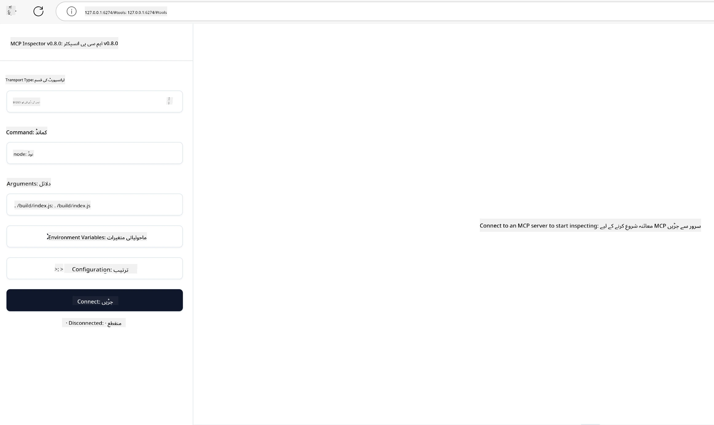

## ٹیسٹنگ اور ڈیبگنگ

اپنے MCP سرور کی ٹیسٹنگ شروع کرنے سے پہلے، دستیاب ٹولز اور ڈیبگنگ کے بہترین طریقوں کو سمجھنا ضروری ہے۔ مؤثر ٹیسٹنگ یہ یقینی بناتی ہے کہ آپ کا سرور متوقع طریقے سے کام کرے اور آپ جلدی سے مسائل کی نشاندہی اور حل کر سکیں۔ ذیل کا سیکشن آپ کی MCP عمل درآمد کی توثیق کے لیے تجویز کردہ طریقے بیان کرتا ہے۔

## جائزہ

اس سبق میں صحیح ٹیسٹنگ طریقہ کار اور سب سے مؤثر ٹیسٹنگ ٹول منتخب کرنے کا احاطہ کیا گیا ہے۔

## سیکھنے کے مقاصد

اس سبق کے اختتام تک، آپ قادر ہوں گے:

- ٹیسٹنگ کے مختلف طریقے بیان کریں۔
- اپنے کوڈ کی مؤثر ٹیسٹنگ کے لیے مختلف ٹولز استعمال کریں۔


## MCP سرورز کی ٹیسٹنگ

MCP آپ کے سرورز کی ٹیسٹ اور ڈیبگ کرنے میں مدد دینے کے لیے ٹولز فراہم کرتا ہے:

- **MCP انسیکٹر**: ایک کمانڈ لائن ٹول جو CLI ٹول اور بصری ٹول دونوں کے طور پر چلایا جا سکتا ہے۔
- **مینول ٹیسٹنگ**: آپ curl جیسے ٹول کا استعمال کر کے ویب درخواستیں چلا سکتے ہیں، لیکن کوئی بھی ایسا ٹول جو HTTP چلا سکے کام کرے گا۔
- **یونٹ ٹیسٹنگ**: آپ اپنے پسندیدہ ٹیسٹنگ فریم ورک کو دونوں سرور اور کلائنٹ کی خصوصیات ٹیسٹ کرنے کے لیے استعمال کر سکتے ہیں۔

### MCP انسیکٹر کا استعمال

ہم نے اس ٹول کے استعمال کو پچھلے اسباق میں بیان کیا ہے لیکن آئیے اس کی تھوڑی اعلی سطح پر بات کرتے ہیں۔ یہ ٹول Node.js میں بنایا گیا ہے اور آپ اسے `npx` اجرائیہ کال کر کے استعمال کر سکتے ہیں جو خود ٹول کو عارضی طور پر ڈاؤن لوڈ، انسٹال کرے گا اور آپ کی درخواست چلانے کے بعد خود کو صاف کر دے گا۔

[MCP انسیکٹر](https://github.com/modelcontextprotocol/inspector) آپ کی مدد کرتا ہے:

- **سرور کی صلاحیتوں کا پتہ لگائیں**: دستیاب ذرائع، ٹولز، اور پرامپٹس کو خودکار طریقے سے دریافت کریں
- **ٹولز کی عمل کاری کی جانچ کریں**: مختلف پیرامیٹرز آزما کر فوری ردعمل دیکھیں
- **سرور میٹا ڈیٹا دیکھیں**: سرور کی معلومات، اسکیمے، اور کنفیگریشنز کا معائنہ کریں

ٹول کا ایک معمول کا اجرا کچھ یوں ہوتا ہے:

```bash
npx @modelcontextprotocol/inspector node build/index.js
```

اوپر والا کمانڈ MCP اور اس کا بصری انٹرفیس شروع کرتا ہے اور آپ کے براؤزر میں ایک مقامی ویب انٹرفیس لانچ کرتا ہے۔ آپ ایک ڈیش بورڈ دیکھنے کی توقع رکھ سکتے ہیں جو آپ کے رجسٹرڈ MCP سرورز، ان کے دستیاب ٹولز، ذرائع، اور پرامپٹس دکھاتا ہے۔ انٹرفیس آپ کو انٹرایکٹو طریقے سے ٹول کی عمل کاری کی جانچ، سرور میٹا ڈیٹا کی تفتیش، اور حقیقی وقت میں جوابات دیکھنے کی اجازت دیتا ہے، جس سے آپ کے MCP سرور کی عمل درآمد کی تصدیق اور ڈیبگنگ آسان ہو جاتی ہے۔

یہ کچھ یوں دکھ سکتا ہے: 

آپ اسے CLI موڈ میں بھی چلا سکتے ہیں جس کے لیے `--cli` صفت شامل کریں۔ یہاں ایک مثال ہے کہ ٹول "CLI" موڈ میں کیسے چلایا جاتا ہے جو سرور پر موجود تمام ٹولز کی فہرست دکھاتا ہے:

```sh
npx @modelcontextprotocol/inspector --cli node build/index.js --method tools/list
```

### مینول ٹیسٹنگ

انسیکٹر ٹول چلانے کے علاوہ، ایک اور مماثل طریقہ یہ ہے کہ HTTP استعمال کرنے والے کلائنٹ کو چلایا جائے جیسے کہ curl۔

curl کے ساتھ، آپ MCP سرورز کو براہ راست HTTP درخواستوں سے ٹیسٹ کر سکتے ہیں:

```bash
# مثال: ٹیسٹ سرور میٹا ڈیٹا
curl http://localhost:3000/v1/metadata

# مثال: ایک ٹول چلائیں
curl -X POST http://localhost:3000/v1/tools/execute \
  -H "Content-Type: application/json" \
  -d '{"name": "calculator", "parameters": {"expression": "2+2"}}'
```

جیسا کہ آپ curl کے اوپر استعمال سے دیکھ سکتے ہیں، آپ POST درخواست استعمال کرتے ہیں تاکہ ٹول کو اس کے نام اور پیرامیٹرز پر مشتمل پیلوڈ کے ساتھ کال کیا جا سکے۔ وہ طریقہ استعمال کریں جو آپ کے لیے بہتر ہو۔ CLI ٹولز عام طور پر تیز تر ہوتے ہیں اور انہیں اسکرپٹ کیا جا سکتا ہے جو CI/CD ماحول میں مفید ہو سکتا ہے۔

### یونٹ ٹیسٹنگ

اپنے ٹولز اور ذرائع کے لیے یونٹ ٹیسٹ بنائیں تاکہ یہ یقینی بنایا جا سکے کہ وہ متوقع طریقے سے کام کرتے ہیں۔ یہاں کچھ مثال کے ٹیسٹنگ کوڈ ہیں۔

```python
import pytest

from mcp.server.fastmcp import FastMCP
from mcp.shared.memory import (
    create_connected_server_and_client_session as create_session,
)

# پورے ماڈیول کو async ٹیسٹ کے لیے نشان زد کریں
pytestmark = pytest.mark.anyio


async def test_list_tools_cursor_parameter():
    """Test that the cursor parameter is accepted for list_tools.

    Note: FastMCP doesn't currently implement pagination, so this test
    only verifies that the cursor parameter is accepted by the client.
    """

 server = FastMCP("test")

    # چند ٹیسٹ ٹولز بنائیں
    @server.tool(name="test_tool_1")
    async def test_tool_1() -> str:
        """First test tool"""
        return "Result 1"

    @server.tool(name="test_tool_2")
    async def test_tool_2() -> str:
        """Second test tool"""
        return "Result 2"

    async with create_session(server._mcp_server) as client_session:
        # کرسر پیرامیٹر کے بغیر ٹیسٹ کریں (چھوڑ دیا گیا)
        result1 = await client_session.list_tools()
        assert len(result1.tools) == 2

        # cursor=None کے ساتھ ٹیسٹ کریں
        result2 = await client_session.list_tools(cursor=None)
        assert len(result2.tools) == 2

        # کرسر کو سٹرنگ کے طور پر ٹیسٹ کریں
        result3 = await client_session.list_tools(cursor="some_cursor_value")
        assert len(result3.tools) == 2

        # خالی سٹرنگ کرسر کے ساتھ ٹیسٹ کریں
        result4 = await client_session.list_tools(cursor="")
        assert len(result4.tools) == 2
    
```

پچھلا کوڈ درج ذیل کام کرتا ہے:

- pytest فریم ورک کا استعمال کرتا ہے جو آپ کو فنکشنز کی صورت میں ٹیسٹ بنانے اور assert بیانات استعمال کرنے دیتا ہے۔
- دو مختلف ٹولز کے ساتھ MCP سرور بناتا ہے۔
- `assert` بیان استعمال کرتا ہے تاکہ چیک کرے کہ مخصوص حالات پورے ہوتے ہیں۔

[مکمل فائل یہاں دیکھیں](https://github.com/modelcontextprotocol/python-sdk/blob/main/tests/client/test_list_methods_cursor.py)

مذکورہ فائل کی بنیاد پر، آپ اپنے سرور کی ٹیسٹنگ کر سکتے ہیں تاکہ یہ یقینی بنایا جا سکے کہ صلاحیتیں درست طریقے سے بنائی گئی ہیں۔

تمام اہم SDKs میں مشابہہ ٹیسٹنگ سیکشنز موجود ہیں لہٰذا آپ اپنے منتخب کردہ رن ٹائم کے مطابق ایڈجسٹ کر سکتے ہیں۔

## نمونہ جات 

- [جاوا کیلکولیٹر](../samples/java/calculator/README.md)
- [.Net کیلکولیٹر](../../../../03-GettingStarted/samples/csharp)
- [جاوا اسکرپٹ کیلکولیٹر](../samples/javascript/README.md)
- [ٹائپ اسکرپٹ کیلکولیٹر](../samples/typescript/README.md)
- [پائتھون کیلکولیٹر](../../../../03-GettingStarted/samples/python) 

## اضافی وسائل

- [پائتھون SDK](https://github.com/modelcontextprotocol/python-sdk)

## اگلا کیا ہے

- اگلا: [ڈیپلائمنٹ](../09-deployment/README.md)

---

<!-- CO-OP TRANSLATOR DISCLAIMER START -->
**ڈس کلیمر**:
یہ دستاویز AI ترجمہ سروس [Co-op Translator](https://github.com/Azure/co-op-translator) کے ذریعے ترجمہ کی گئی ہے۔ جبکہ ہم درستگی کے لیے کوشاں ہیں، براہ کرم اس بات سے آگاہ رہیں کہ خودکار ترجمے میں غلطیاں یا عدم درستیاں ہو سکتی ہیں۔ اصل دستاویز اپنے مادری زبان میں مستند ماخذ سمجھی جائے گی۔ حساس معلومات کے لیے پیشہ ور انسانی ترجمہ کی سفارش کی جاتی ہے۔ اس ترجمے کے استعمال سے پیدا ہونے والی کسی بھی غلط فہمی یا غلط تشریح کی ذمہ داری ہم قبول نہیں کرتے۔
<!-- CO-OP TRANSLATOR DISCLAIMER END -->