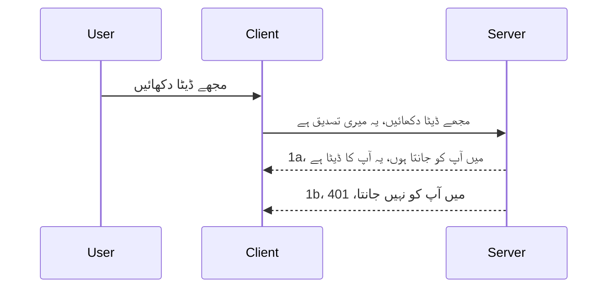

# سادہ توثیق

MCP SDKs OAuth 2.1 کے استعمال کی حمایت کرتے ہیں جو کہ ایک کافی پیچیدہ عمل ہے جس میں auth سرور، resource سرور، credentials بھیجنا، ایک کوڈ حاصل کرنا، کوڈ کو بیئرر ٹوکن میں تبدیل کرنا شامل ہے جب تک کہ آپ آخرکار اپنے resource data تک رسائی حاصل نہ کر لیں۔ اگر آپ OAuth کے عادی نہیں ہیں جو کہ نافذ کرنے کے لیے ایک بہترین چیز ہے، تو بہتر ہے کہ آپ کچھ بنیادی سطح کی توثیق سے شروع کریں اور بہتر اور بہتر سیکیورٹی کی طرف بڑھیں۔ اسی لیے یہ باب موجود ہے، تاکہ آپ کو زیادہ جدید توثیق کی طرف بڑھایا جا سکے۔

## توثیق، مراد کیا ہے؟

توثیق authetication اور authorization کا مخفف ہے۔ خیال یہ ہے کہ ہمیں دو کام کرنے ہوتے ہیں:

- **Authentication**، جو کہ یہ جانچنے کا عمل ہے کہ آیا ہم کسی شخص کو اپنے گھر میں داخل ہونے دیں، یعنی ان کے پاس "یہاں" ہونے کا حق ہے یعنی ہمارے resource سرور تک رسائی ہے جہاں ہمارا MCP Server کے خصوصیات موجود ہیں۔
- **Authorization**، یہ معلوم کرنے کا عمل ہے کہ آیا صارف کو ان مخصوص resources تک رسائی ہونی چاہیے جو وہ مانگ رہے ہیں، مثلاً یہ آرڈرز یا یہ مصنوعات یا کیا وہ مواد پڑھنے کے قابل ہیں لیکن حذف کرنے کی اجازت نہیں ہے جیسا کہ ایک اور مثال۔

## اسناد: ہم نظام کو کیسے بتاتے ہیں کہ ہم کون ہیں

زیادہ تر ویب ڈیولپرز عام طور پر سرور کو credential فراہم کرنے کے بارے میں سوچنا شروع کرتے ہیں، عام طور پر ایک راز جو کہ یہ بتاتا ہے کہ آیا انہیں یہاں "Authentication" ہونے کی اجازت ہے۔ یہ credential عموماً username اور password کا base64 انکوڈ شدہ ورژن ہوتا ہے یا ایک API key جو کسی مخصوص صارف کی منفرد شناخت کرتا ہے۔

اسے "Authorization" ہیڈر کے ذریعے بھیجنا ہوتا ہے، جیسا کہ:

```json
{ "Authorization": "secret123" }
```


اسے عام طور پر basic authentication کہا جاتا ہے۔ پھر مجموعی فلو کچھ یوں کام کرتا ہے:



اب جب کہ ہم سمجھ چکے ہیں کہ یہ فلو کے لحاظ سے کیسے کام کرتا ہے، اسے ہم کیسے نافذ کریں؟ زیادہ تر ویب سرورز میں middleware کا تصور ہوتا ہے، ایسا کوڈ کا ٹکڑا جو درخواست کا حصہ ہوتا ہے جو credentials کی تصدیق کر سکتا ہے، اور اگر credentials درست ہوں تو درخواست کو آگے جانے دیتا ہے۔ اگر درخواست میں درست credentials نہیں ہیں تو آپ کو auth error ملے گا۔ آئیے دیکھتے ہیں کہ اسے کیسے نافذ کیا جا سکتا ہے:

**Python**

```python
class AuthMiddleware(BaseHTTPMiddleware):
    async def dispatch(self, request, call_next):

        has_header = request.headers.get("Authorization")
        if not has_header:
            print("-> Missing Authorization header!")
            return Response(status_code=401, content="Unauthorized")

        if not valid_token(has_header):
            print("-> Invalid token!")
            return Response(status_code=403, content="Forbidden")

        print("Valid token, proceeding...")
       
        response = await call_next(request)
        # کوئی کسٹمر ہیڈرز شامل کریں یا جواب میں کسی طرح کی تبدیلی کریں
        return response


starlette_app.add_middleware(CustomHeaderMiddleware)
```

یہاں ہمارے پاس ہے:

- ایک middleware بنایا گیا جسے `AuthMiddleware` کہا گیا ہے جہاں اس کا `dispatch` میتھڈ ویب سرور کے ذریعے بلایا جاتا ہے۔
- middleware کو ویب سرور میں شامل کیا گیا:

    ```python
    starlette_app.add_middleware(AuthMiddleware)
    ```

- وہ validation logic لکھی گئی جو چیک کرتی ہے کہ آیا Authorization ہیڈر موجود ہے اور بھیجا گیا راز درست ہے یا نہیں:

    ```python
    has_header = request.headers.get("Authorization")
    if not has_header:
        print("-> Missing Authorization header!")
        return Response(status_code=401, content="Unauthorized")

    if not valid_token(has_header):
        print("-> Invalid token!")
        return Response(status_code=403, content="Forbidden")
    ```

اگر راز موجود اور درست ہو تو ہم درخواست کو `call_next` کو کال کر کے آگے جانے دیتے ہیں اور جواب واپس کرتے ہیں۔

    ```python
    response = await call_next(request)
    # جو بھی کسٹمر ہیڈرز شامل کریں یا جواب میں کسی طرح کی تبدیلی کریں
    return response
    ```

یہ اس طرح کام کرتا ہے کہ اگر سرور کی طرف کوئی ویب درخواست آتی ہے تو middleware کو بلایا جائے گا اور اپنی عملدرآمد کی بنیاد پر وہ درخواست کو گزرنے دے گا یا ایک ایسی غلطی واپس کرے گا جو بتاتی ہے کہ کلائنٹ کو آگے جانے کی اجازت نہیں ہے۔

**TypeScript**

یہاں ہم Express کے مشہور فریم ورک کے ساتھ middleware بناتے ہیں اور درخواست کو MCP Server تک پہنچنے سے پہلے روک لیتے ہیں۔ اس کا کوڈ کچھ یوں ہے:

```typescript
function isValid(secret) {
    return secret === "secret123";
}

app.use((req, res, next) => {
    // 1. کیا اجازت نامہ ہیڈر موجود ہے؟
    if(!req.headers["Authorization"]) {
        res.status(401).send('Unauthorized');
    }
    
    let token = req.headers["Authorization"];

    // 2. درستگی چیک کریں۔
    if(!isValid(token)) {
        res.status(403).send('Forbidden');
    }

   
    console.log('Middleware executed');
    // 3. درخواست کو درخواست پائپ لائن کے اگلے مرحلے تک منتقل کرتا ہے۔
    next();
});
```

اس کوڈ میں ہم:

1. چیک کرتے ہیں کہ آیا Authorization ہیڈر موجود ہے، اگر نہیں تو 401 ایرر بھیجتے ہیں۔
2. یقینی بناتے ہیں کہ credential/token درست ہے، اگر نہیں تو 403 ایرر بھیجتے ہیں۔
3. آخر میں درخواست کو ریکوئسٹ پائپ لائن میں آگے بھیجتے ہیں اور مانگا گیا resource فراہم کرتے ہیں۔

## مشق: توثیق نافذ کریں

آئیے اپنی معلومات کا استعمال کرتے ہوئے اسے نافذ کرنے کی کوشش کرتے ہیں۔ منصوبہ درج ذیل ہے:

سرور

- ایک ویب سرور اور MCP کا انسٹانس بنائیں۔
- سرور کے لیے middleware نافذ کریں۔

کلائنٹ 

- ویب درخواست بھیجیں، credential کے ساتھ، ہیڈر کے ذریعے۔

### -1- ویب سرور اور MCP انسٹانس بنائیں

اپنے پہلے قدم میں، ہمیں ویب سرور اور MCP سرور کا انسٹانس بنانا ہوگا۔

**Python**

یہاں ہم MCP سرور کا انسٹانس بنائیں گے، ایک starlette ویب ایپ بنائیں گے اور اسے uvicorn کے ذریعے ہوسٹ کریں گے۔

```python
# ایم سی پی سرور بنا رہے ہیں

app = FastMCP(
    name="MCP Resource Server",
    instructions="Resource Server that validates tokens via Authorization Server introspection",
    host=settings["host"],
    port=settings["port"],
    debug=True
)

# اسٹارلیٹ ویب ایپ بنا رہے ہیں
starlette_app = app.streamable_http_app()

# uvicorn کے ذریعہ ایپ سرور کر رہے ہیں
async def run(starlette_app):
    import uvicorn
    config = uvicorn.Config(
            starlette_app,
            host=app.settings.host,
            port=app.settings.port,
            log_level=app.settings.log_level.lower(),
        )
    server = uvicorn.Server(config)
    await server.serve()

run(starlette_app)
```

اس کوڈ میں ہم:

- MCP سرور کو بناتے ہیں۔
- MCP سرور سے starlette ویب ایپ بناتے ہیں، `app.streamable_http_app()`.
- uvicorn `server.serve()` کے ذریعے ویب ایپ کو ہوسٹ اور سرور کرتے ہیں۔

**TypeScript**

یہاں ہم MCP سرور کا انسٹانس بناتے ہیں۔

```typescript
const server = new McpServer({
      name: "example-server",
      version: "1.0.0"
    });

    // ... سرور کے وسائل، ٹولز، اور پرامپٹس ترتیب دیں ...
```

یہ MCP سرور بنانے کا عمل ہمارے POST /mcp روٹ کی تعریف کے اندر ہونا چاہیے، لہٰذا ہم اوپر کا کوڈ اس طرح منتقل کرتے ہیں:

```typescript
import express from "express";
import { randomUUID } from "node:crypto";
import { McpServer } from "@modelcontextprotocol/sdk/server/mcp.js";
import { StreamableHTTPServerTransport } from "@modelcontextprotocol/sdk/server/streamableHttp.js";
import { isInitializeRequest } from "@modelcontextprotocol/sdk/types.js"

const app = express();
app.use(express.json());

// نشست کے ID کے ذریعہ ٹرانسپورٹ کو محفوظ کرنے کے لیے نقشہ
const transports: { [sessionId: string]: StreamableHTTPServerTransport } = {};

// کلائنٹ سے سرور کے درمیان مواصلات کے لیے POST درخواستوں کو سنبھالیں
app.post('/mcp', async (req, res) => {
  // موجودہ نشست ID کی جانچ کریں
  const sessionId = req.headers['mcp-session-id'] as string | undefined;
  let transport: StreamableHTTPServerTransport;

  if (sessionId && transports[sessionId]) {
    // موجودہ ٹرانسپورٹ کو دوبارہ استعمال کریں
    transport = transports[sessionId];
  } else if (!sessionId && isInitializeRequest(req.body)) {
    // نئی آغاز کی درخواست
    transport = new StreamableHTTPServerTransport({
      sessionIdGenerator: () => randomUUID(),
      onsessioninitialized: (sessionId) => {
        // نشست ID کے ذریعہ ٹرانسپورٹ کو ذخیرہ کریں
        transports[sessionId] = transport;
      },
      // DNS ری بانڈنگ کی حفاظت ڈیفالٹ کے طور پر فعال نہیں ہے تاکہ پرانی حمایت بحال رہے۔ اگر آپ یہ سرور
      // مقامی طور پر چلا رہے ہیں، تو یقینی بنائیں کہ درج ذیل سیٹ کریں:
      // enableDnsRebindingProtection: true,
      // allowedHosts: ['127.0.0.1'],
    });

    // بند ہونے پر ٹرانسپورٹ کی صفائی کریں
    transport.onclose = () => {
      if (transport.sessionId) {
        delete transports[transport.sessionId];
      }
    };
    const server = new McpServer({
      name: "example-server",
      version: "1.0.0"
    });

    // ... سرور کے وسائل، آلات، اور پرامپٹس ترتیب دیں ...

    // MCP سرور سے جڑیں
    await server.connect(transport);
  } else {
    // غلط درخواست
    res.status(400).json({
      jsonrpc: '2.0',
      error: {
        code: -32000,
        message: 'Bad Request: No valid session ID provided',
      },
      id: null,
    });
    return;
  }

  // درخواست کو سنبھالیں
  await transport.handleRequest(req, res, req.body);
});

// GET اور DELETE درخواستوں کے لیے قابل استعمال ہینڈلر
const handleSessionRequest = async (req: express.Request, res: express.Response) => {
  const sessionId = req.headers['mcp-session-id'] as string | undefined;
  if (!sessionId || !transports[sessionId]) {
    res.status(400).send('Invalid or missing session ID');
    return;
  }
  
  const transport = transports[sessionId];
  await transport.handleRequest(req, res);
};

// SSE کے ذریعے سرور سے کلائنٹ کو نوٹیفیکیشنز کے لیے GET درخواستوں کو سنبھالیں
app.get('/mcp', handleSessionRequest);

// نشست کے خاتمے کے لیے DELETE درخواستوں کو سنبھالیں
app.delete('/mcp', handleSessionRequest);

app.listen(3000);
```

اب آپ دیکھ سکتے ہیں کہ MCP سرور بنانے کو `app.post("/mcp")` کے اندر منتقل کیا گیا ہے۔

اب middleware بنانے کے اگلے قدم کی طرف بڑھتے ہیں تاکہ آنے والے credential کی تصدیق کر سکیں۔

### -2- سرور کے لیے middleware نافذ کریں

اب ہم middleware والے حصے پر آتے ہیں۔ یہاں ہم ایسا middleware بنائیں گے جو `Authorization` ہیڈر میں ایک credential تلاش کرے اور اس کی تصدیق کرے۔ اگر یہ قبول ہے تو درخواست آگے بڑھ کر وہ کام کرے گا جو اسے کرنا ہے (جیسے ٹولز کی فہرست بنانا، resource پڑھنا یا جو بھی MCP کی فعالیت کلائنٹ مانگ رہا ہو)۔

**Python**

middleware بنانے کے لیے، ہمیں ایک کلاس بنانی ہوگی جو `BaseHTTPMiddleware` سے وراثت حاصل کرے۔ دو دلچسپ چیزیں ہیں:

- درخواست `request`، جس سے ہم ہیڈر کی معلومات پڑھتے ہیں۔
- `call_next` وہ کال بیک ہے جسے ہمیں کال کرنا ہوتا ہے اگر کلائنٹ نے کوئی قابل قبول credential لایا ہو۔

سب سے پہلے، ہمیں یہ ہینڈل کرنا ہے کہ اگر `Authorization` ہیڈر موجود نہ ہو:

```python
has_header = request.headers.get("Authorization")

# کوئی ہیڈر موجود نہیں، 401 کے ساتھ ناکام ہو، ورنہ آگے بڑھیں۔
if not has_header:
    print("-> Missing Authorization header!")
    return Response(status_code=401, content="Unauthorized")
```

یہاں ہم 401 unauthorized پیغام بھیجتے ہیں کیونکہ کلائنٹ authentication میں ناکام ہو رہا ہے۔

اگلا، اگر credential جمع کرایا گیا، تو اس کی درستگی چیک کریں جیسے:

```python
 if not valid_token(has_header):
    print("-> Invalid token!")
    return Response(status_code=403, content="Forbidden")
```

اوپر 403 forbidden پیغام بھیجا گیا ہے۔ مکمل middleware دیکھیں جو اوپر بیان کیے گئے تمام پہلوؤں کو نافذ کرتا ہے:

```python
class AuthMiddleware(BaseHTTPMiddleware):
    async def dispatch(self, request, call_next):

        has_header = request.headers.get("Authorization")
        if not has_header:
            print("-> Missing Authorization header!")
            return Response(status_code=401, content="Unauthorized")

        if not valid_token(has_header):
            print("-> Invalid token!")
            return Response(status_code=403, content="Forbidden")

        print("Valid token, proceeding...")
        print(f"-> Received {request.method} {request.url}")
        response = await call_next(request)
        response.headers['Custom'] = 'Example'
        return response

```

بہت اچھا، لیکن `valid_token` فنکشن کیا ہے؟ یہ ذیل میں ہے:

```python
# پروڈکشن کے لیے استعمال نہ کریں - اسے بہتر بنائیں !!
def valid_token(token: str) -> bool:
    # "Bearer " کا سابقہ ہٹا دیں
    if token.startswith("Bearer "):
        token = token[7:]
        return token == "secret-token"
    return False
```

یہ واضح طور پر بہتر بنایا جا سکتا ہے۔

اہم: آپ کو کبھی بھی کوڈ میں ایسے راز رکھنا نہیں چاہئیں۔ بہتر یہ ہے کہ آپ یہ قدریں کسی ڈیٹا سورس یا IDP (identity service provider) سے حاصل کریں یا بہتر یہ ہے کہ IDP خود تصدیق کرے۔

**TypeScript**

Express کے ساتھ اس کو نافذ کرنے کے لیے، ہمیں `use` میتھڈ کو کال کرنا ہوگا جو middleware فنکشنز لیتا ہے۔

ہمیں کرنا ہے:

- درخواست متغیر کے ساتھ تعامل کرنا تاکہ `Authorization` پراپرٹی میں دی گئی credential چیک کریں۔
- credential کی تصدیق کریں، اور اگر صحیح ہو تو درخواست کو آگے بڑھنے دیں اور کلائنٹ کی MCP درخواست وہ کام کرے جو اسے کرنا ہے (جیسے ٹولز کی فہرست بنانا، resource پڑھنا یا کچھ اور MCP سے متعلق)۔

یہاں ہم چیک کر رہے ہیں کہ `Authorization` ہیڈر موجود ہے یا نہیں، اور اگر نہیں ہے تو درخواست کو روک دیتے ہیں:

```typescript
if(!req.headers["authorization"]) {
    res.status(401).send('Unauthorized');
    return;
}
```

اگر ہیڈر پہلی جگہ بھیجا ہی نہ جائے تو آپ کو 401 ملے گا۔

اگلا، ہم چیک کرتے ہیں کہ credential درست ہے یا نہیں، اگر نہیں تو درخواست روک دیتے ہیں مگر ایک مختلف پیغام کے ساتھ:

```typescript
if(!isValid(token)) {
    res.status(403).send('Forbidden');
    return;
} 
```

اب آپ کو 403 ایرر مل رہا ہے۔

یہاں مکمل کوڈ ہے:

```typescript
app.use((req, res, next) => {
    console.log('Request received:', req.method, req.url, req.headers);
    console.log('Headers:', req.headers["authorization"]);
    if(!req.headers["authorization"]) {
        res.status(401).send('Unauthorized');
        return;
    }
    
    let token = req.headers["authorization"];

    if(!isValid(token)) {
        res.status(403).send('Forbidden');
        return;
    }  

    console.log('Middleware executed');
    next();
});
```

ہم نے ویب سرور کو ایسے middleware کی اجازت دی ہے جو کلائنٹ کی طرف سے بھیجی گئی credential کی جانچ کرے۔ اب کلائنٹ کی باری ہے۔

### -3- ہیڈر کے ذریعے credential کے ساتھ ویب درخواست بھیجیں

ہمیں یقینی بنانا ہوگا کہ کلائنٹ credential ہیڈر کے ذریعے بھیج رہا ہے۔ چونکہ ہم MCP کلائنٹ استعمال کرنے جا رہے ہیں، ہمیں جاننا ہوگا کہ یہ کیسے کیا جاتا ہے۔

**Python**

کلائنٹ کے لیے، ہمیں اپنے credential کے ساتھ ہیڈر پاس کرنا ہوگا، جیسا کہ:

```python
# قیمت کو ہارڈ کوڈ نہ کریں، اسے کم از کم ایک ماحول کے متغیر یا زیادہ محفوظ ذخیرہ میں رکھیں
token = "secret-token"

async with streamablehttp_client(
        url = f"http://localhost:{port}/mcp",
        headers = {"Authorization": f"Bearer {token}"}
    ) as (
        read_stream,
        write_stream,
        session_callback,
    ):
        async with ClientSession(
            read_stream,
            write_stream
        ) as session:
            await session.initialize()
      
            # کرنے کے لئے، آپ کلائنٹ میں کیا چاہتے ہیں، جیسے اوزار کی فہرست، اوزار کال کرنا وغیرہ۔
```

دیکھیں کہ ہم `headers` پراپرٹی کو اس طرح بھر رہے ہیں `headers = {"Authorization": f"Bearer {token}"}`۔

**TypeScript**

ہم اسے دو مراحل میں حل کر سکتے ہیں:

1. ایک configuration object بنائیں اور اس میں credential ڈالیں۔
2. configuration object کو transport کو دیں۔

```typescript

// ویلیو کو یہاں دکھائے گئے طریقے سے ہارڈ کوڈ مت کریں۔ کم از کم اسے ایک env ویریبل کے طور پر رکھیں اور dev موڈ میں dotenv جیسی چیز استعمال کریں۔
let token = "secret123"

// کلائنٹ ٹرانسپورٹ آپشن آبجیکٹ کی تعریف کریں
let options: StreamableHTTPClientTransportOptions = {
  sessionId: sessionId,
  requestInit: {
    headers: {
      "Authorization": "secret123"
    }
  }
};

// آپشنز آبجیکٹ کو ٹرانسپورٹ میں پاس کریں
async function main() {
   const transport = new StreamableHTTPClientTransport(
      new URL(serverUrl),
      options
   );
```

اوپر آپ دیکھ سکتے ہیں کہ ہمیں ایک `options` آبجیکٹ بنانا پڑا اور اپنے ہیڈرز کو `requestInit` پراپرٹی کے تحت رکھنا پڑا۔

اہم: اسے یہاں سے کیسے بہتر بنایا جائے؟ موجودہ نفاذ کچھ مسائل رکھتا ہے۔ سب سے پہلی بات، credential اس طرح بھیجنا خطرناک ہے جب تک کہ آپ کے پاس کم از کم HTTPS نہ ہو۔ اگرچہ پھر بھی credential چوری ہو سکتا ہے لہٰذا آپ کو ایسا نظام چاہیے جہاں آپ آسانی سے ٹوکن کو منسوخ کر سکیں اور اضافی چیکز لگا سکیں جیسے کہ ٹوکن دنیا کے کس حصے سے آ رہا ہے، کیا درخواست بہت زیادہ بار ہو رہی ہے (بوٹ جیسا رویہ)، مختصراً بہت سی تشویشیں ہیں۔

یہ بات کہی جا سکتی ہے کہ بہت سادہ APIs کے لیے جہاں آپ نہیں چاہتے کہ کوئی بھی بغیر توثیق کے آپ کی API کال کرے، یہ ایک اچھا آغاز ہے۔

اب ہم سیکیورٹی کو مضبوط کرنے کی کوشش کرتے ہیں JSON Web Token (JWT) جیسی معیاری شکل کا استعمال کرتے ہوئے، جسے "JOT" ٹوکن بھی کہا جاتا ہے۔

## JSON Web Tokens، JWT

تو، ہم بہت سادہ credentials بھیجنے سے بہتر بنانے کی کوشش کر رہے ہیں۔ JWT اپنانے کے فوری فوائد کیا ہیں؟

- **سیکیورٹی میں بہتری۔** basic auth میں، آپ بار بار username اور password کو base64 انکوڈ ٹوکن (یا API key) بھیجتے ہیں جو خطرہ بڑھاتا ہے۔ JWT کے ساتھ، آپ username اور password بھیجتے ہیں اور بدلے میں ایک ٹوکن حاصل کرتے ہیں جو وقت کے لحاظ سے محدود ہوتا ہے یعنی یہ ختم ہو جاتا ہے۔ JWT آپ کو رولز، scopes اور permissions کا استعمال کرتے ہوئے باریک بینی سے رسائی کنٹرول آسانی سے کرنے دیتا ہے۔
- **بے ریاستی اور قابل پیمائش۔** JWT خود مختار ہوتے ہیں، تمام صارف معلومات ساتھ رکھتے ہیں اور سرور سائیڈ سیشن اسٹوریج کی ضرورت ختم کرتے ہیں۔ ٹوکن کو مقامی طور پر بھی تصدیق کیا جا سکتا ہے۔
- **انٹرآپریبیلیٹی اور فیڈریشن۔** JWT Open ID Connect کا مرکز ہے اور معروف identity providers جیسے Entra ID، Google Identity اور Auth0 کے ساتھ استعمال ہوتا ہے۔ یہ سنگل سائن آن اور بہت کچھ ممکن بناتے ہیں جو اسے انٹرپرائز معیار کا بناتے ہیں۔
- **ماڈیولیریٹی اور لچک۔** JWT API گیٹ ویز جیسے Azure API Management، NGINX وغیرہ کے ساتھ بھی استعمال ہو سکتے ہیں۔ یہ استعمال کی توثیق کے منظرنامے اور سرور سے سروس کے رابطے سمیت امپرسونیشن اور ڈیلیگیشن منظرنامے بھی سپورٹ کرتے ہیں۔
- **کارکردگی اور کیشنگ۔** JWT کو ڈی کوڈ کرنے کے بعد کیش کیا جا سکتا ہے جو پارسنگ کی ضرورت کو کم کرتا ہے۔ یہ خاص طور پر ہائی ٹریفک ایپس کے لئے مفید ہے کیونکہ یہ تھرو پٹ بہتر کرتا ہے اور آپ کی منتخب شدہ انفراسٹرکچر پر بوجھ کم کرتا ہے۔
- **جدید خصوصیات۔** اس میں introspection (سرور پر درستگی چیک کرنا) اور revocation (ٹوکن کو غیر فعال کرنا) بھی شامل ہے۔

ان تمام فوائد کے ساتھ، آئیں دیکھتے ہیں کہ ہم اپنی نفاذ کو کیسے اگلے درجے پر لے جا سکتے ہیں۔

## basic auth کو JWT میں تبدیل کرنا

تو، ہمیں جو تبدیلیاں کرنی ہیں وہ درج ذیل سطح پر ہیں:

- **JWT ٹوکن بنانا سیکھیں** اور اسے کلائنٹ سے سرور تک بھیجنے کے لیے تیار کریں۔
- **JWT ٹوکن کی تصدیق کریں** اور اگر درست ہو تو کلائنٹ کو ہمارے resources تک رسائی دیں۔
- **ٹوکن کی محفوظ ذخیرہ اندوزی۔** ہم اس ٹوکن کو کیسے ذخیرہ کریں۔
- **روٹس کی حفاظت۔** ہمیں اپنے روٹس اور مخصوص MCP خصوصیات کی حفاظت کرنی ہوگی۔
- **ریفریش ٹوکن شامل کریں۔** یقینی بنائیں کہ ہم ایسے ٹوکن بنائیں جو مختصر مدت کے لیے ہوں لیکن طویل مدتی ریفریش ٹوکن بھی ہوں جو میعاد ختم ہونے پر نئے ٹوکن حاصل کرنے کے لیے استعمال ہوں۔ یہ بھی یقینی بنائیں کہ ریفریش اینڈپوائنٹ اور روٹیشن حکمت عملی موجود ہو۔

### -1- JWT ٹوکن بنائیں

سب سے پہلے، JWT ٹوکن کے درج ذیل حصے ہوتے ہیں:

- **ہیڈر،** استعمال شدہ الگوردم اور ٹوکن کی قسم۔
- **پیلوڈ،** دعوے، جیسے sub (وہ صارف یا ادارہ جس کی نمائندگی ٹوکن کرتا ہے۔ auth منظرنامے میں عموماً یہ userid ہوتا ہے)، exp (میعاد ختم ہونے کا وقت)، رول (کردار)
- **دستخط،** راز یا پرائیویٹ کی کے ساتھ دستخط شدہ۔

اس کے لیے، ہمیں ہیڈر، پیلوڈ اور انکوڈ شدہ ٹوکن بنانا ہوگا۔

**Python**

```python

import jwt
import jwt
from jwt.exceptions import ExpiredSignatureError, InvalidTokenError
import datetime

# JWT پر دستخط کرنے کے لیے استعمال ہونے والا خفیہ کلید
secret_key = 'your-secret-key'

header = {
    "alg": "HS256",
    "typ": "JWT"
}

# صارف کی معلومات اور اس کے دعوے اور اختتامی وقت
payload = {
    "sub": "1234567890",               # موضوع (صارف کی شناخت)
    "name": "User Userson",                # حسب ضرورت دعویٰ
    "admin": True,                     # حسب ضرورت دعویٰ
    "iat": datetime.datetime.utcnow(),# جاری کیا گیا
    "exp": datetime.datetime.utcnow() + datetime.timedelta(hours=1)  # اختتام
}

# اسے انکوڈ کریں
encoded_jwt = jwt.encode(payload, secret_key, algorithm="HS256", headers=header)
```

اوپر کے کوڈ میں ہم نے:

- HS256 الگوردم استعمال کرتے ہوئے اور type کو JWT رکھتے ہوئے ہیڈر تعریف کیا۔
- ایک پیلوڈ بنایا جس میں subject یا صارف کی شناخت، یوزر نیم، رول، جاری ہونے کا وقت اور میعاد ختم ہونے کا وقت شامل ہے، جس سے پہلے ذکر کیے گئے وقت کی حد کا نفاذ ہوتا ہے۔

**TypeScript**

یہاں ہمیں کچھ dependencies چاہئے جو JWT ٹوکن بنانے میں مدد دیں گی۔

Dependencies

```sh

npm install jsonwebtoken
npm install --save-dev @types/jsonwebtoken
```

اب جب یہ تیار ہے، آئیں ہیڈر، پیلوڈ بنائیں اور اس کے ذریعے انکوڈ شدہ ٹوکن بنائیں۔

```typescript
import jwt from 'jsonwebtoken';

const secretKey = 'your-secret-key'; // پیداوار میں env vars کا استعمال کریں

// پیلوڈ کی تعریف کریں
const payload = {
  sub: '1234567890',
  name: 'User usersson',
  admin: true,
  iat: Math.floor(Date.now() / 1000), // جاری کردہ وقت
  exp: Math.floor(Date.now() / 1000) + 60 * 60 // 1 گھنٹے میں ختم ہو جائے گا
};

// ہیڈر کی تعریف کریں (اختیاری، jsonwebtoken ڈیفالٹس سیٹ کرتا ہے)
const header = {
  alg: 'HS256',
  typ: 'JWT'
};

// ٹوکن بنائیں
const token = jwt.sign(payload, secretKey, {
  algorithm: 'HS256',
  header: header
});

console.log('JWT:', token);
```

یہ ٹوکن:

HS256 سے دستخط شدہ ہے
1 گھنٹے کے لیے درست ہے
جیسے sub, name, admin, iat, اور exp وغیرہ دعوے شامل ہیں۔

### -2- ٹوکن کی تصدیق کریں

ہمیں ٹوکن کی تصدیق کرنا بھی ہو گی، یہ سرور پر کرنا چاہیے تاکہ اس بات کو یقینی بنایا جا سکے کہ کلائنٹ واقعی جو بھیج رہا ہے وہ درست ہے۔ ہمیں کئی چیک کرنا ہوں گے، ساخت کی تصدیق سے لے کر اس کی درستگی تک۔ آپ کو ترغیب دی جاتی ہے کہ مزید چیکز کریں کہ آیا صارف ہمارے نظام میں موجود ہے اور مزید۔

ٹوکن کی تصدیق کے لیے، ہمیں اسے ڈی کوڈ کرنا ہوگا تاکہ ہم اسے پڑھ سکیں اور پھر اس کی درستگی جانچنا شروع کریں:

**Python**

```python

# JWT کو ڈیکوڈ کریں اور تصدیق کریں
try:
    decoded = jwt.decode(token, secret_key, algorithms=["HS256"])
    print("✅ Token is valid.")
    print("Decoded claims:")
    for key, value in decoded.items():
        print(f"  {key}: {value}")
except ExpiredSignatureError:
    print("❌ Token has expired.")
except InvalidTokenError as e:
    print(f"❌ Invalid token: {e}")

```

اس کوڈ میں ہم `jwt.decode` کال کرتے ہیں، ٹوکن، راز کی اور منتخب شدہ الگوردم کے ساتھ۔ نوٹ کریں کہ ہم try-catch کا استعمال کر رہے ہیں کیونکہ ناکام تصدیق پر ایرر ہوتا ہے۔

**TypeScript**

یہاں ہمیں `jwt.verify` کال کرنا ہے تاکہ ٹوکن کا ڈی کوڈ کیا ہوا ورژن حاصل کریں جس کا ہم مزید تجزیہ کر سکیں۔ اگر یہ کال ناکام ہو جاتی ہے تو اس کا مطلب ہے کہ ٹوکن کی ساخت غلط ہے یا وہ اب درست نہیں رہا۔

```typescript

try {
  const decoded = jwt.verify(token, secretKey);
  console.log('Decoded Payload:', decoded);
} catch (err) {
  console.error('Token verification failed:', err);
}
```

نوٹ: جیسا کہ پہلے بتایا گیا، آپ کو اضافی چیک کرنا چاہیے کہ یہ ٹوکن ہمارے نظام میں صارف کی نشاندہی کرتا ہے اور اس بات کو یقینی بنائیں کہ صارف کے پاس دعوی کردہ حقوق موجود ہیں۔

اب، آئیں رول کی بنیاد پر رسائی کنٹرول، یعنی RBAC کے بارے میں دیکھیں۔
## رول کی بنیاد پر رسائی کنٹرول شامل کرنا

خیال یہ ہے کہ ہم ظاہر کرنا چاہتے ہیں کہ مختلف کرداروں کے مختلف اجازت نامے ہوتے ہیں۔ مثال کے طور پر، ہم فرض کرتے ہیں کہ ایڈمن سب کچھ کر سکتا ہے اور عام صارفین پڑھنے/لکھنے کر سکتے ہیں اور مہمان صرف پڑھ سکتا ہے۔ لہٰذا، یہاں کچھ ممکنہ اجازت کی سطحیں ہیں:

- Admin.Write  
- User.Read  
- Guest.Read  

آئیے دیکھتے ہیں کہ ہم کس طرح مڈل ویئر کے ساتھ ایسی کنٹرول کو نافذ کر سکتے ہیں۔ مڈل ویئر کو ہر راستے کے لیے اور تمام راستوں کے لیے بھی شامل کیا جا سکتا ہے۔

**پائتھون**

```python
from starlette.middleware.base import BaseHTTPMiddleware
from starlette.responses import JSONResponse
import jwt

# کوڈ میں راز نہ رکھیں، یہ صرف نمائش کے مقاصد کے لیے ہے۔ اسے کسی محفوظ جگہ سے پڑھیں۔
SECRET_KEY = "your-secret-key" # اسے انوائرنمنٹ ویری ایبل میں رکھیں۔
REQUIRED_PERMISSION = "User.Read"

class JWTPermissionMiddleware(BaseHTTPMiddleware):
    async def dispatch(self, request, call_next):
        auth_header = request.headers.get("Authorization")
        if not auth_header or not auth_header.startswith("Bearer "):
            return JSONResponse({"error": "Missing or invalid Authorization header"}, status_code=401)

        token = auth_header.split(" ")[1]
        try:
            decoded = jwt.decode(token, SECRET_KEY, algorithms=["HS256"])
        except jwt.ExpiredSignatureError:
            return JSONResponse({"error": "Token expired"}, status_code=401)
        except jwt.InvalidTokenError:
            return JSONResponse({"error": "Invalid token"}, status_code=401)

        permissions = decoded.get("permissions", [])
        if REQUIRED_PERMISSION not in permissions:
            return JSONResponse({"error": "Permission denied"}, status_code=403)

        request.state.user = decoded
        return await call_next(request)


```
  
مندرجہ ذیل کئی طریقے ہیں جن سے مڈل ویئر کو شامل کیا جا سکتا ہے:

```python

# متبادل 1: اسٹارلیٹ ایپ بنانے کے دوران مڈل ویئر شامل کریں
middleware = [
    Middleware(JWTPermissionMiddleware)
]

app = Starlette(routes=routes, middleware=middleware)

# متبادل 2: اسٹارلیٹ ایپ پہلے سے بننے کے بعد مڈل ویئر شامل کریں
starlette_app.add_middleware(JWTPermissionMiddleware)

# متبادل 3: ہر راستے کے لیے مڈل ویئر شامل کریں
routes = [
    Route(
        "/mcp",
        endpoint=..., # ہینڈلر
        middleware=[Middleware(JWTPermissionMiddleware)]
    )
]
```
  
**ٹائپ اسکرپٹ**

ہم `app.use` اور ایک مڈل ویئر استعمال کر سکتے ہیں جو تمام درخواستوں کے لیے چلتا ہے۔

```typescript
app.use((req, res, next) => {
    console.log('Request received:', req.method, req.url, req.headers);
    console.log('Headers:', req.headers["authorization"]);

    // 1. چیک کریں کہ کیا اجازت نامہ سرخی بھیجی گئی ہے

    if(!req.headers["authorization"]) {
        res.status(401).send('Unauthorized');
        return;
    }
    
    let token = req.headers["authorization"];

    // 2. چیک کریں کہ ٹوکن درست ہے یا نہیں
    if(!isValid(token)) {
        res.status(403).send('Forbidden');
        return;
    }  

    // 3. چیک کریں کہ ٹوکن کا صارف ہمارے نظام میں موجود ہے
    if(!isExistingUser(token)) {
        res.status(403).send('Forbidden');
        console.log("User does not exist");
        return;
    }
    console.log("User exists");

    // 4. یقین دہانی کریں کہ ٹوکن کے پاس درست اجازت نامے ہیں
    if(!hasScopes(token, ["User.Read"])){
        res.status(403).send('Forbidden - insufficient scopes');
    }

    console.log("User has required scopes");

    console.log('Middleware executed');
    next();
});

```
  
ہم مڈل ویئر سے کچھ چیزیں کروا سکتے ہیں اور مڈل ویئر کو یقینی طور پر یہ کرنا چاہیے، یعنی:

1. چیک کریں کہ آیا اجازت دینے والا ہیڈر موجود ہے  
2. چیک کریں کہ ٹوکن درست ہے، ہم `isValid` کال کرتے ہیں جو ایک طریقہ ہے جو ہم نے لکھا ہے جو JWT ٹوکن کی سالمیت اور درستگی چیک کرتا ہے۔  
3. یقینی بنائیں کہ صارف ہمارے نظام میں موجود ہے، ہمیں یہ جانچنا چاہیے۔

   ```typescript
    // ڈی بی میں صارفین
   const users = [
     "user1",
     "User usersson",
   ]

   function isExistingUser(token) {
     let decodedToken = verifyToken(token);

     // کرنے کا کام، چیک کریں کہ آیا صارف ڈی بی میں موجود ہے
     return users.includes(decodedToken?.name || "");
   }
   ```
  
   اوپر، ہم نے ایک بہت سادہ `users` کی فہرست بنائی ہے، جو واضح طور پر ڈیٹا بیس میں ہونی چاہیے۔

4. اضافی طور پر، ہمیں یہ بھی چیک کرنا چاہیے کہ ٹوکن کے پاس درست اجازت نامے ہیں۔

   ```typescript
   if(!hasScopes(token, ["User.Read"])){
        res.status(403).send('Forbidden - insufficient scopes');
   }
   ```
  
   اوپر اس مڈل ویئر کے کوڈ میں، ہم چیک کرتے ہیں کہ ٹوکن میں User.Read اجازت موجود ہے، اگر نہیں تو ہم 403 خطا بھیج دیتے ہیں۔ نیچے `hasScopes` مددگار طریقہ ہے۔

   ```typescript
   function hasScopes(scope: string, requiredScopes: string[]) {
     let decodedToken = verifyToken(scope);
    return requiredScopes.every(scope => decodedToken?.scopes.includes(scope));
  }  
   ```

Have a think which additional checks you should be doing, but these are the absolute minimum of checks you should be doing.

Using Express as a web framework is a common choice. There are helpers library when you use JWT so you can write less code.

- `express-jwt`, helper library that provides a middleware that helps decode your token.
- `express-jwt-permissions`, this provides a middleware `guard` that helps check if a certain permission is on the token.

Here's what these libraries can look like when used:

```typescript
const express = require('express');
const jwt = require('express-jwt');
const guard = require('express-jwt-permissions')();

const app = express();
const secretKey = 'your-secret-key'; // put this in env variable

// Decode JWT and attach to req.user
app.use(jwt({ secret: secretKey, algorithms: ['HS256'] }));

// Check for User.Read permission
app.use(guard.check('User.Read'));

// multiple permissions
// app.use(guard.check(['User.Read', 'Admin.Access']));

app.get('/protected', (req, res) => {
  res.json({ message: `Welcome ${req.user.name}` });
});

// Error handler
app.use((err, req, res, next) => {
  if (err.code === 'permission_denied') {
    return res.status(403).send('Forbidden');
  }
  next(err);
});

```
  
اب آپ نے دیکھا کہ مڈل ویئر کا استعمال توثیق اور اجازت دونوں کے لیے کس طرح کیا جا سکتا ہے، لیکن MCP کے بارے میں کیا، کیا یہ ہمارے توثیق کے طریقے کو بدلتا ہے؟ آئیں اگلے سیکشن میں جانتے ہیں۔

### -3- MCP میں RBAC شامل کرنا

اب تک آپ نے دیکھا کہ آپ مڈل ویئر کے ذریعے RBAC کیسے شامل کر سکتے ہیں، تاہم MCP کے لیے کسی فیچر پر RBAC شامل کرنے کا آسان طریقہ نہیں ہے، تو ہم کیا کرتے ہیں؟ ہم بس ایسی کوڈ شامل کرتے ہیں جو اس کیس میں چیک کرے کہ کلائنٹ کے پاس مخصوص ٹول کال کرنے کے حقوق ہیں:

آپ کے پاس فیچر پر RBAC کو پورا کرنے کے کچھ مختلف انتخاب ہیں، یہاں کچھ:

- ہر ٹول، وسائل، اور پرامپٹ کے لیے چیک شامل کریں جہاں آپ کو اجازت کی سطح چیک کرنی ہو۔

   **پائتھون**

   ```python
   @tool()
   def delete_product(id: int):
      try:
          check_permissions(role="Admin.Write", request)
      catch:
        pass # کلائنٹ کی اجازت ناکام ہو گئی، اجازت کی خرابی اٹھائیں
   ```
  
   **ٹائپ اسکرپٹ**

   ```typescript
   server.registerTool(
    "delete-product",
    {
      title: Delete a product",
      description: "Deletes a product",
      inputSchema: { id: z.number() }
    },
    async ({ id }) => {
      
      try {
        checkPermissions("Admin.Write", request);
        // کرنے کے لیے، آئی ڈی productService اور remote entry کو بھیجیں
      } catch(Exception e) {
        console.log("Authorization error, you're not allowed");  
      }

      return {
        content: [{ type: "text", text: `Deletected product with id ${id}` }]
      };
    }
   );
   ```
  

- جدید سرور طریقہ استعمال کریں اور ریکویسٹ ہینڈلرز تاکہ آپ کو چیک کرنے کی جگہوں کی تعداد کم ہو۔

   **پائتھون**

   ```python
   
   tool_permission = {
      "create_product": ["User.Write", "Admin.Write"],
      "delete_product": ["Admin.Write"]
   }

   def has_permission(user_permissions, required_permissions) -> bool:
      # صارف کی اجازتیں: صارف کی اجازتوں کی فہرست
      # مطلوبہ اجازتیں: ٹول کے لیے مطلوبہ اجازتوں کی فہرست
      return any(perm in user_permissions for perm in required_permissions)

   @server.call_tool()
   async def handle_call_tool(
     name: str, arguments: dict[str, str] | None
   ) -> list[types.TextContent]:
    # فرض کریں کہ request.user.permissions صارف کی اجازتوں کی فہرست ہے
     user_permissions = request.user.permissions
     required_permissions = tool_permission.get(name, [])
     if not has_permission(user_permissions, required_permissions):
        # خرابی ظاہر کریں "آپ کو ٹول {name} کال کرنے کی اجازت نہیں ہے"
        raise Exception(f"You don't have permission to call tool {name}")
     # جاری رکھیں اور ٹول کال کریں
     # ...
   ```   
      

   **ٹائپ اسکرپٹ**

   ```typescript
   function hasPermission(userPermissions: string[], requiredPermissions: string[]): boolean {
       if (!Array.isArray(userPermissions) || !Array.isArray(requiredPermissions)) return false;
       // اگر صارف کے پاس کم از کم ایک مطلوبہ اجازت ہو تو درست لوٹائیں
       
       return requiredPermissions.some(perm => userPermissions.includes(perm));
   }
  
   server.setRequestHandler(CallToolRequestSchema, async (request) => {
      const { params: { name } } = request;
  
      let permissions = request.user.permissions;
  
      if (!hasPermission(permissions, toolPermissions[name])) {
         return new Error(`You don't have permission to call ${name}`);
      }
  
      // جاری رکھیں..
   });
   ```
  
   نوٹ کریں، آپ کو یہ یقینی بنانا ہوگا کہ آپ کا مڈل ویئر ریکویسٹ کے user پراپرٹی کو ڈیکوڈ شدہ ٹوکن اسائن کرتا ہے تاکہ اوپر کا کوڈ آسان ہو۔

### خلاصہ

اب جب کہ ہم نے عمومی طور پر اور خاص طور پر MCP کے لیے RBAC شامل کرنے پر بات کی ہے، تو یہ وقت ہے کہ آپ خود مثال کے طور پر سیکیورٹی نافذ کرنے کی کوشش کریں تاکہ یہ یقینی بنایا جا سکے کہ آپ نے سمجھا ہے جو تصورات آپ کو پیش کیے گئے ہیں۔

## اسائنمنٹ 1: بنیادی توثیق کے ساتھ mcp سرور اور mcp کلائنٹ بنائیں

یہاں آپ جو سیکھ چکے ہیں، اس کو سرخیاں بھیجنے کے متعلق عملی طور پر آزمانے کا موقع ہے۔

## حل 1

[Solution 1](./code/basic/README.md)

## اسائنمنٹ 2: اسائنمنٹ 1 کے حل کو JWT کے لیے اپ گریڈ کریں

پہلا حل لیں لیکن اس بار، اسے بہتر بنائیں۔

بنیادی توثیق کی بجائے، JWT استعمال کریں۔

## حل 2

[Solution 2](./solution/jwt-solution/README.md)

## چیلنج

ہر ٹول کے لیے RBAC شامل کریں جیسا کہ سیکشن "MCP میں RBAC شامل کریں" میں بیان کیا گیا ہے۔

## خلاصہ

امید ہے آپ نے اس باب میں بہت کچھ سیکھا، مکمل سیکیورٹی نہ ہونے سے لے کر بنیادی سیکیورٹی، JWT اور کس طرح اسے MCP میں شامل کیا جا سکتا ہے۔

ہم نے کسٹم JWTs کے ساتھ ایک مضبوط بنیاد بنائی ہے، لیکن جیسے جیسے ہم بڑھتے ہیں، ہم ایک معیاری شناختی ماڈل کی طرف جا رہے ہیں۔ Entra یا Keycloak جیسے IdP کو اپنانا ہمیں ٹوکن جاری کرنے، تصدیق کرنے، اور لائف سائیکل مینجمنٹ کو ایک قابل اعتماد پلیٹ فارم پر منتقل کرنے دیتا ہے — تاکہ ہم ایپ کی منطق اور صارف کے تجربے پر توجہ مرکوز کر سکیں۔

اس کے لیے، ہمارے پاس ایک مزید [ایڈوانسڈ باب Entra پر](../../05-AdvancedTopics/mcp-security-entra/README.md) موجود ہے۔

## آگے کیا ہے

- اگلا: [MCP ہوسٹس کو ترتیب دینا](../12-mcp-hosts/README.md)

---

<!-- CO-OP TRANSLATOR DISCLAIMER START -->
**دارآمد**:
یہ دستاویز AI ترجمہ سروس [Co-op Translator](https://github.com/Azure/co-op-translator) کا استعمال کرتے ہوئے ترجمہ کی گئی ہے۔ اگرچہ ہم درستگی کی کوشش کرتے ہیں، براہ کرم یہ بات ذہن میں رکھیں کہ خودکار تراجم میں غلطیاں یا کمی بیشی ہو سکتی ہے۔ اصل دستاویز اپنی مادری زبان میں مستند ماخذ سمجھی جانی چاہیے۔ اہم معلومات کے لیے، پیشہ ور انسانی ترجمہ کی سفارش دی جاتی ہے۔ ہم اس ترجمہ کے استعمال سے پیدا ہونے والی کسی بھی غلط فہمی یا غلط تعبیر کے لیے ذمہ دار نہیں ہیں۔
<!-- CO-OP TRANSLATOR DISCLAIMER END -->