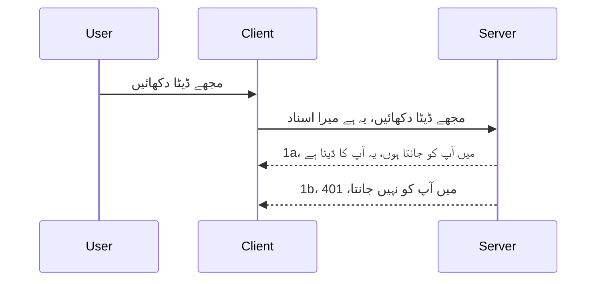

# سادہ تصدیق

MCP SDKs OAuth 2.1 کے استعمال کی حمایت کرتے ہیں جو کہ ایک کافی پیچیدہ عمل ہے جس میں تصدیقی سرور، وسائل سرور، اسناد بھیجنے، کوڈ حاصل کرنے، کوڈ کو بیئرر ٹوکن میں تبدیل کرنے کے تصورات شامل ہیں جب تک کہ آپ آخر میں اپنے وسائل کا ڈیٹا حاصل نہ کر سکیں۔ اگر آپ OAuth سے ناواقف ہیں جو کہ ایک شاندار چیز ہے نافذ کرنے کے لیے، تو بہتر ہے کہ آپ کسی بنیادی سطح کی تصدیق سے شروع کریں اور بہتر اور بہتر سیکیورٹی کی طرف بڑھیں۔ اسی لیے یہ باب موجود ہے، تاکہ آپ کو زیادہ ترقی یافتہ تصدیق کی طرف لے جا سکے۔

## تصدیق سے ہمارا کیا مطلب ہے؟

تصدیق اور اجازت کا مختصر لفظ ہے۔ ہماری دو چیزیں کرنے کی ضرورت ہے:

- **تصدیق**، یعنی یہ معلوم کرنا کہ آیا ہم کسی شخص کو اپنے گھر میں داخل ہونے دیں، یعنی کیا ان کے پاس "یہاں" ہونے کا حق ہے، یعنی ہمارے وسائل سرور تک رسائی ہے جہاں ہمارے MCP سرور کی خصوصیات موجود ہیں۔
- **اجازت**، یہ معلوم کرنے کا عمل ہے کہ کیا صارف کو درکار مخصوص وسائل تک رسائی حاصل ہونی چاہیے، مثلاً یہ آرڈرز یا یہ مصنوعات، یا آیا انہیں مواد پڑھنے کی اجازت ہے لیکن حذف کرنے کی اجازت نہیں جیسا کہ ایک اور مثال ہے۔

## اسناد: ہم سسٹم کو کیسے بتاتے ہیں کہ ہم کون ہیں

زیادہ تر ویب ڈیولپرز سرور کو ایک اسناد فراہم کرنے پر سوچتے ہیں، عموماً ایک راز جو بتاتا ہے کہ آیا انہیں یہاں ہونے کی اجازت ہے "تصدیق"۔ یہ سند عموماً یوزر نیم اور پاس ورڈ کا بیس64 انکوڈڈ ورژن یا ایک API کی ہوتی ہے جو خاص صارف کی شناخت کرتی ہے۔

یہ "Authorization" نامی ہیڈر کے ذریعے بھیجی جاتی ہے، اس طرح:

```json
{ "Authorization": "secret123" }
```

اسے عام طور پر بنیادی تصدیق کہا جاتا ہے۔ کل فلو کچھ اس طرح کام کرتا ہے:


```mermaid
sequenceDiagram
   participant User
   participant Client
   participant Server

   User->>Client: مجھے ڈیٹا دکھائیں
   Client->>Server: مجھے ڈیٹا دکھائیں، یہ ہے میرا اسناد
   Server-->>Client: 1a، میں آپ کو جانتا ہوں، یہ آپ کا ڈیٹا ہے
   Server-->>Client: 1b، میں آپ کو نہیں جانتا، 401 
```

اب جب کہ ہم فلو کی صورت حال کو سمجھ چکے ہیں، ہم اسے کیسے نافذ کریں؟ زیادہ تر ویب سرورز کے پاس مڈل ویئر کا تصور ہوتا ہے، ایک کوڈ کا ٹکڑا جو درخواست کے حصے کے طور پر چلتا ہے جو اسناد کی تصدیق کر سکتا ہے، اور اگر اسناد درست ہوں تو درخواست کو گزرنے دیتا ہے۔ اگر درخواست میں درست اسناد نہیں ہوں تو آپ کو تصدیقی غلطی ملتی ہے۔ آئیے دیکھتے ہیں کہ اسے کیسے نافذ کیا جا سکتا ہے:

**پائتھن**

```python
class AuthMiddleware(BaseHTTPMiddleware):
    async def dispatch(self, request, call_next):

        has_header = request.headers.get("Authorization")
        if not has_header:
            print("-> Missing Authorization header!")
            return Response(status_code=401, content="Unauthorized")

        if not valid_token(has_header):
            print("-> Invalid token!")
            return Response(status_code=403, content="Forbidden")

        print("Valid token, proceeding...")
       
        response = await call_next(request)
        # کوئی بھی کسٹمر ہیڈرز شامل کریں یا جواب میں کسی طرح کی تبدیلی کریں
        return response


starlette_app.add_middleware(CustomHeaderMiddleware)
```

یہاں ہمارے پاس:

- `AuthMiddleware` نامی مڈل ویئر بنایا گیا جہاں اس کا `dispatch` میتھڈ ویب سرور سے کال ہوتا ہے۔
- مڈل ویئر کو ویب سرور میں شامل کیا گیا:

    ```python
    starlette_app.add_middleware(AuthMiddleware)
    ```

- تصدیق کی منطق لکھی گئی جو چیک کرتی ہے کہ آیا Authorization ہیڈر موجود ہے اور بھیجا گیا راز درست ہے یا نہیں:

    ```python
    has_header = request.headers.get("Authorization")
    if not has_header:
        print("-> Missing Authorization header!")
        return Response(status_code=401, content="Unauthorized")

    if not valid_token(has_header):
        print("-> Invalid token!")
        return Response(status_code=403, content="Forbidden")
    ```

    اگر راز موجود اور درست ہو تو ہم `call_next` کو کال کر کے درخواست کو گزرنے دیتے ہیں اور جواب واپس کرتے ہیں۔

    ```python
    response = await call_next(request)
    # کسی بھی کسٹمر ہیڈر کو شامل کریں یا جواب میں کسی طرح کی تبدیلی کریں
    return response
    ```

کام کرنے کا طریقہ یہ ہے کہ اگر ویب درخواست سرور کی طرف کی جاتی ہے تو مڈل ویئر کو کال کیا جائے گا اور اس کی تنفیذ کے مطابق وہ یا تو درخواست کو گزرنے دے گا یا ایسی غلطی واپس کرے گا جو بتاتی ہے کہ کلائنٹ کو آگے بڑھنے کی اجازت نہیں ہے۔

**ٹائپ اسکرپٹ**

یہاں ہم مشہور فریم ورک Express کے ساتھ ایک مڈل ویئر بناتے ہیں اور MCP سرور تک پہنچنے سے پہلے درخواست کو روک لیتے ہیں۔ کوڈ کچھ یوں ہے:

```typescript
function isValid(secret) {
    return secret === "secret123";
}

app.use((req, res, next) => {
    // 1. کیا اجازت نامہ ہیڈر موجود ہے؟
    if(!req.headers["Authorization"]) {
        res.status(401).send('Unauthorized');
    }
    
    let token = req.headers["Authorization"];

    // 2. درستگی چیک کریں۔
    if(!isValid(token)) {
        res.status(403).send('Forbidden');
    }

   
    console.log('Middleware executed');
    // 3. درخواست کو درخواست کے پائپ لائن کے اگلے مرحلے تک بھیجتا ہے۔
    next();
});
```

اس کوڈ میں ہم:

1. چیک کرتے ہیں کہ Authorization ہیڈر موجود ہے یا نہیں، اگر نہیں تو 401 ایرر بھیجتے ہیں۔
2. یقین دہانی کرتے ہیں کہ اسناد/ٹوکن درست ہے، اگر نہیں تو 403 ایرر بھیجتے ہیں۔
3. آخر میں درخواست کو درخواست کے پائپ لائن میں آگے بھیجتے ہیں اور مطلوبہ وسائل واپس کرتے ہیں۔

## مشق: تصدیق نافذ کریں

آئیے اپنے علم کو لے کر اسے نافذ کرنے کی کوشش کرتے ہیں۔ منصوبہ یہ ہے:

سرور

- ایک ویب سرور اور MCP مثال بنائیں۔
- سرور کے لیے ایک مڈل ویئر نافذ کریں۔

کلائنٹ

- ویب درخواست بھیجیں، اسناد کے ساتھ، ہیڈر کے ذریعے۔

### -1- ویب سرور اور MCP مثال بنائیں

> [!WARNING]
> نیچے والا ٹائپ اسکرپٹ مثال MCP `2025-11-25` کو ہدف بناتا ہے۔ یہ `mcp-session-id` کے ذریعہ ٹرانسپورٹس کو ٹریک کرتا ہے
> اور موجودہ `2026-07-28` ٹرانسپورٹ مثال نہیں ہے۔ MCP
> `2026-07-28` `initialize` ہینڈشیک اور پروٹوکول سیشن ID کو ختم کرتا ہے؛ نئی
> تنفیذات خود مختار درخواستیں استعمال کرتی ہیں۔ دیکھیں
> [MCP میں کیا تبدیل ہوا: 2026-07-28 وضاحت](../../01-CoreConcepts/mcp-2026-07-28.md)۔

ہمارے پہلے مرحلے میں، ہمیں ویب سرور کا ایک مثال اور MCP سرور بنانا ہے۔

**پائتھن**

یہاں ہم ایک MCP سرور مثال بناتے ہیں، اسٹارلیٹ ویب ایپ بناتے ہیں اور اسے uvicorn کے ساتھ ہوسٹ کرتے ہیں۔

```python
# ایم سی پی سرور بنا رہا ہے

app = FastMCP(
    name="MCP Resource Server",
    instructions="Resource Server that validates tokens via Authorization Server introspection",
    host=settings["host"],
    port=settings["port"],
    debug=True
)

# اسٹارلیٹ ویب ایپ بنا رہا ہے
starlette_app = app.streamable_http_app()

# یوویکورن کے ذریعہ ایپ فراہم کر رہا ہے
async def run(starlette_app):
    import uvicorn
    config = uvicorn.Config(
            starlette_app,
            host=app.settings.host,
            port=app.settings.port,
            log_level=app.settings.log_level.lower(),
        )
    server = uvicorn.Server(config)
    await server.serve()

run(starlette_app)
```

اس کوڈ میں ہم:

- MCP سرور بناتے ہیں۔
- MCP سرور سے اسٹارلیٹ ویب ایپ بناتے ہیں، `app.streamable_http_app()`۔
- uvicorn `server.serve()` کے ساتھ ویب ایپ کو ہوسٹ اور سرور کرتے ہیں۔

**ٹائپ اسکرپٹ**

یہاں ہم ایک MCP سرور کی مثال بناتے ہیں۔

```typescript
const server = new McpServer({
      name: "example-server",
      version: "1.0.0"
    });

    // ... سرور کے وسائل، اوزار، اور پرامپٹس ترتیب دیں ...
```

یہ MCP سرور کی تخلیق ہمارے POST /mcp روٹ کی تعریف کے اندر ہونی چاہیے، تو آئیے اوپر دیا گیا کوڈ لے کر اسے یوں منتقل کرتے ہیں:

```typescript
import express from "express";
import { randomUUID } from "node:crypto";
import { McpServer } from "@modelcontextprotocol/sdk/server/mcp.js";
import { StreamableHTTPServerTransport } from "@modelcontextprotocol/sdk/server/streamableHttp.js";
import { isInitializeRequest } from "@modelcontextprotocol/sdk/types.js"

const app = express();
app.use(express.json());

// سیشن ID کے ذریعے ٹرانسپورٹس کو محفوظ کرنے کا نقشہ
const transports: { [sessionId: string]: StreamableHTTPServerTransport } = {};

// کلائنٹ سے سرور تک مواصلات کے لئے POST درخواستوں کو سنبھالیں
app.post('/mcp', async (req, res) => {
  // موجودہ سیشن ID کی جانچ کریں
  const sessionId = req.headers['mcp-session-id'] as string | undefined;
  let transport: StreamableHTTPServerTransport;

  if (sessionId && transports[sessionId]) {
    // موجودہ ٹرانسپورٹ کو دوبارہ استعمال کریں
    transport = transports[sessionId];
  } else if (!sessionId && isInitializeRequest(req.body)) {
    // نئی ابتداء کی درخواست
    transport = new StreamableHTTPServerTransport({
      sessionIdGenerator: () => randomUUID(),
      onsessioninitialized: (sessionId) => {
        // سیشن ID کے ذریعے ٹرانسپورٹ محفوظ کریں
        transports[sessionId] = transport;
      },
      // DNS ریبائنڈنگ کی حفاظت ڈیفالٹ کے طور پر پچھلی مطابقت کے لیے غیر فعال ہے۔ اگر آپ یہ سرور لوکل چلا رہے ہیں
      // تو یقین دہانی کریں کہ آپ نے سیٹ کیا ہے:
      // enableDnsRebindingProtection: true,
      // allowedHosts: ['127.0.0.1'],
    });

    // بند ہونے پر ٹرانسپورٹ کو صاف کریں
    transport.onclose = () => {
      if (transport.sessionId) {
        delete transports[transport.sessionId];
      }
    };
    const server = new McpServer({
      name: "example-server",
      version: "1.0.0"
    });

    // ... سرور وسائل، آلات، اور پرامپٹس کو ترتیب دیں ...

    // MCP سرور سے جڑیں
    await server.connect(transport);
  } else {
    // غیر معتبر درخواست
    res.status(400).json({
      jsonrpc: '2.0',
      error: {
        code: -32000,
        message: 'Bad Request: No valid session ID provided',
      },
      id: null,
    });
    return;
  }

  // درخواست کو سنبھالیں
  await transport.handleRequest(req, res, req.body);
});

// GET اور DELETE درخواستوں کے لیے دوبارہ استعمال ہونے والا ہینڈلر
const handleSessionRequest = async (req: express.Request, res: express.Response) => {
  const sessionId = req.headers['mcp-session-id'] as string | undefined;
  if (!sessionId || !transports[sessionId]) {
    res.status(400).send('Invalid or missing session ID');
    return;
  }
  
  const transport = transports[sessionId];
  await transport.handleRequest(req, res);
};

// SSE کے ذریعے سرور سے کلائنٹ نوٹیفیکیشنز کے لیے GET درخواستوں کو سنبھالیں
app.get('/mcp', handleSessionRequest);

// سیشن ختم کرنے کے لیے DELETE درخواستوں کو سنبھالیں
app.delete('/mcp', handleSessionRequest);

app.listen(3000);
```

اب آپ نے دیکھا کہ MCP سرور کی تخلیق `app.post("/mcp")` کے اندر منتقل کر دی گئی۔

آئیے اگلے مرحلے کی طرف بڑھتے ہیں کہ مڈل ویئر بنائیں تاکہ آنے والی اسناد کی تصدیق کر سکیں۔

### -2- سرور کے لیے مڈل ویئر نافذ کریں

آئیے اب مڈل ویئر کے حصے پر آتے ہیں۔ یہاں ہم ایک مڈل ویئر بنائیں گے جو `Authorization` ہیڈر میں اسناد تلاش کرے گا اور اس کی تصدیق کرے گا۔ اگر قابل قبول ہو تو درخواست آگے بڑھ کر جو بھی کام کرنا ہو کرے گی (جیسے ٹولز کی فہرست، وسائل پڑھنا یا MCP کی جو بھی فعالیت کلائنٹ مانگ رہا ہو)۔

**پائتھن**

مڈل ویئر بنانے کے لیے، ہمیں ایک کلاس بنانی ہوگی جو `BaseHTTPMiddleware` سے وراثت حاصل کرتی ہو۔ دو دلچسپ چیزیں ہیں:

- درخواست `request`، جس سے ہم ہیڈر کی معلومات پڑھتے ہیں۔
- `call_next` کال بیک، جسے ہم اس وقت کال کریں گے جب کلائنٹ نے قابل قبول اسناد فراہم کی ہوں۔

پہلے، ہمیں اس صورت کو سنبھالنا ہے جب `Authorization` ہیڈر موجود نہ ہو:

```python
has_header = request.headers.get("Authorization")

# کوئی ہیڈر موجود نہیں، 401 کے ساتھ ناکام ہوجائیں، ورنہ آگے بڑھیں۔
if not has_header:
    print("-> Missing Authorization header!")
    return Response(status_code=401, content="Unauthorized")
```

یہاں ہم 401 غیر مجاز کا پیغام بھیجتے ہیں کیونکہ کلائنٹ تصدیق میں ناکام ہو رہا ہے۔

اگلا، اگر اسناد جمع کرا دی گئی ہوں، تو ہمیں ان کی درستگی اس طرح چیک کرنی ہوگی:

```python
 if not valid_token(has_header):
    print("-> Invalid token!")
    return Response(status_code=403, content="Forbidden")
```

اوپر 403 ممنوع کا پیغام بھیجنے کو دھیان دیں۔ آئیے نیچے مکمل مڈل ویئر دیکھیں جو ہم نے سب کچھ نافذ کیا ہے:

```python
class AuthMiddleware(BaseHTTPMiddleware):
    async def dispatch(self, request, call_next):

        has_header = request.headers.get("Authorization")
        if not has_header:
            print("-> Missing Authorization header!")
            return Response(status_code=401, content="Unauthorized")

        if not valid_token(has_header):
            print("-> Invalid token!")
            return Response(status_code=403, content="Forbidden")

        print("Valid token, proceeding...")
        print(f"-> Received {request.method} {request.url}")
        response = await call_next(request)
        response.headers['Custom'] = 'Example'
        return response

```

بہت اچھا، لیکن `valid_token` فنکشن کے بارے میں کیا؟ یہ نیچے دیا گیا ہے:

```python
# پیداوار کے لیے استعمال نہ کریں - اسے بہتر بنائیں !!
def valid_token(token: str) -> bool:
    # "Bearer " پیش لفظ کو حذف کریں
    if token.startswith("Bearer "):
        token = token[7:]
        return token == "secret-token"
    return False
```

اسے واضح طور پر بہتر بنایا جانا چاہیے۔

اہم: آپ کو کبھی بھی کوڈ میں ایسے راز نہیں رکھنے چاہئیں۔ بہتر یہ ہے کہ آپ موازنہ کے لیے قیمت ڈیٹا ماخذ یا IDP (شناختی فراہم کنندہ) سے حاصل کریں یا بہتر یہ کہ IDP ہی تصدیق کرے۔

**ٹائپ اسکرپٹ**

اسے Express کے ساتھ نافذ کرنے کے لیے، ہمیں `use` میتھڈ کال کرنی ہوگی جو مڈل ویئر فنکشنز لیتا ہے۔


ہمیں چاہیے کہ:

- درخواست ویری ایبل کے ساتھ بات چیت کریں تاکہ `Authorization` پراپرٹی میں دی گئی اسناد کو چیک کیا جا سکے۔
- اسناد کی تصدیق کریں، اور اگر یہ درست ہوں تو درخواست کو جاری رہنے دیں اور کلائنٹ کی MCP درخواست کو وہ کرنے دیں جو اسے کرنا چاہیے (مثلاً آلات کی فہرست بنانا، وسائل پڑھنا یا MCP سے متعلق کوئی اور کام)۔

یہاں، ہم چیک کر رہے ہیں کہ آیا `Authorization` ہیڈر موجود ہے، اور اگر نہیں تو ہم درخواست کو آگے جانے سے روک دیتے ہیں:

```typescript
if(!req.headers["authorization"]) {
    res.status(401).send('Unauthorized');
    return;
}
```

اگر ہیڈر شروع میں ہی بھیجا نہ گیا ہو، تو آپ کو 401 موصول ہوتا ہے۔

اگلا، ہم چیک کرتے ہیں کہ اسناد درست ہیں یا نہیں، اگر نہیں تو پھر سے درخواست کو روک دیتے ہیں لیکن ایک تھوڑی مختلف پیغام کے ساتھ:

```typescript
if(!isValid(token)) {
    res.status(403).send('Forbidden');
    return;
} 
```

غور کریں کہ اب آپ کو 403 کی خرابی ملتی ہے۔

یہاں مکمل کوڈ ہے:

```typescript
app.use((req, res, next) => {
    console.log('Request received:', req.method, req.url, req.headers);
    console.log('Headers:', req.headers["authorization"]);
    if(!req.headers["authorization"]) {
        res.status(401).send('Unauthorized');
        return;
    }
    
    let token = req.headers["authorization"];

    if(!isValid(token)) {
        res.status(403).send('Forbidden');
        return;
    }  

    console.log('Middleware executed');
    next();
});
```

ہم نے ویب سرور کو اس قابل بنایا ہے کہ وہ ایک مڈل ویئر قبول کرے جو کلائنٹ کی بھیجی گئی اسناد کی جانچ کرے۔ خود کلائنٹ کا کیا؟

### -3- اسناد کے ساتھ ہیڈر کے ذریعے ویب درخواست بھیجیں

ہمیں یہ یقینی بنانا ہے کہ کلائنٹ اسناد ہیڈر کے ذریعہ بھیج رہا ہے۔ چونکہ ہم ایک MCP کلائنٹ استعمال کرنے والے ہیں، ہمیں سمجھنا ہوگا کہ یہ کیسے کیا جاتا ہے۔

**Python**

کلائنٹ کے لیے، ہمیں اپنی اسناد کے ساتھ ایک ہیڈر پاس کرنا ہوگا جیسے:

```python
# قیمت کو ہارڈ کوڈ نہ کریں، کم از کم اسے ایک ماحول کے متغیر یا زیادہ محفوظ ذخیرے میں رکھیں
token = "secret-token"

async with streamablehttp_client(
        url = f"http://localhost:{port}/mcp",
        headers = {"Authorization": f"Bearer {token}"}
    ) as (
        read_stream,
        write_stream,
        session_callback,
    ):
        async with ClientSession(
            read_stream,
            write_stream
        ) as session:
            await session.initialize()
      
            # TODO, آپ کلائنٹ میں کیا کرنا چاہتے ہیں، جیسے ٹولز کی فہرست بنانا، ٹولز کو کال کرنا وغیرہ۔
```

غور کریں کہ ہم نے `headers` پراپرٹی کو اس طرح بھرا ہے ` headers = {"Authorization": f"Bearer {token}"}`۔

**TypeScript**

ہم اسے دو مراحل میں حل کر سکتے ہیں:

1. ایک کنفیگریشن آبجیکٹ کو ہماری اسناد سے پُر کریں۔
2. کنفیگریشن آبجیکٹ کو ٹرانسپورٹ کو پاس کریں۔

```typescript

// یہاں دکھائے گئے جیسا ویلیو کو ہارڈکوڈ نا کریں۔ کم از کم اسے ایک اینوائرمنٹ ویری ایبل کے طور پر رکھیں اور کچھ اس طرح کا استعمال کریں جیسے dotenv (ڈیولپمنٹ موڈ میں)۔
let token = "secret123"

// کلائنٹ ٹرانسپورٹ آپشن آبجیکٹ کی وضاحت کریں
let options: StreamableHTTPClientTransportOptions = {
  sessionId: sessionId,
  requestInit: {
    headers: {
      "Authorization": "secret123"
    }
  }
};

// آپشنز آبجیکٹ کو ٹرانسپورٹ میں پاس کریں
async function main() {
   const transport = new StreamableHTTPClientTransport(
      new URL(serverUrl),
      options
   );
```

یہاں اوپر آپ نے دیکھا کہ ہمیں ایک `options` آبجیکٹ بنانا پڑا اور اپنے ہیڈرز کو `requestInit` پراپرٹی کے تحت رکھنا پڑا۔

اہم: لیکن یہاں سے ہم اسے کیسے بہتر بنائیں؟ درحقیقت موجودہ نفاذ میں کچھ مسائل ہیں۔ سب سے پہلے، ایسی اسناد بھیجنا کافی خطرناک ہے جب تک کہ آپ کے پاس کم از کم HTTPS نہ ہو۔ اس کے باوجود، اسناد چوری ہو سکتی ہیں لہٰذا آپ کو ایک ایسا نظام چاہیے جہاں آپ آسانی سے ٹوکن کو منسوخ کرسکیں اور اضافی چیکس شامل کریں جیسے کہ یہ دنیا کے کس حصے سے آ رہا ہے، آیا درخواست بہت زیادہ ہو رہی ہے (بوٹ جیسا رویہ)، اور مختصراً، بہت سے خدشات موجود ہیں۔

پھر بھی کہا جا سکتا ہے کہ بہت سادہ APIs کے لیے جہاں آپ نہیں چاہتے کہ کوئی غیر مستند درخواست آپ کے API کو کال کرے، جو ہمارے پاس ہے وہ ایک اچھا آغاز ہے۔

یہ کہتے ہوئے، آئیے سیکیورٹی کو تھوڑا سخت کرتے ہیں اور JSON Web Token جیسے معیاری فارمیٹ کا استعمال کریں، جسے JWT یا "JOT" ٹوکن بھی کہا جاتا ہے۔

## JSON Web Tokens, JWT

تو، ہم بہت سادہ اسناد بھیجنے سے بہتر بنانے کی کوشش کر رہے ہیں۔ JWT اپنانے سے فوری فائدے کیا ہیں؟

- **سیکیورٹی میں بہتری**۔ بنیادی تصدیق میں، آپ بار بار بیس64 انکوڈڈ ٹوکن یا API کی بھیجتے ہیں جو خطرہ بڑھاتا ہے۔ JWT آپ کو صارف نام اور پاس ورڈ بھیج کر ایک وقت محدود ٹوکن دیتا ہے۔ JWT ذرائع، اسکوپس اور اجازتوں کے ذریعے باریک بینی سے رسائی کنٹرول کو آسان بناتا ہے۔
- **بغیر حالت اور توسیع پذیری**۔ JWTs خودمختار ہوتے ہیں، یہ تمام صارف کی معلومات رکھتے ہیں اور سرور سائیڈ سیشن اسٹوریج کی ضرورت ختم کر دیتے ہیں۔ ٹوکن کو مقامی طور پر بھی تصدیق کیا جا سکتا ہے۔
- **تعاون اور وفاقیت**۔ JWTs Open ID Connect کا مرکزی حصہ ہیں اور معروف شناخت فراہم کنندگان جیسے Entra ID، Google Identity اور Auth0 کے ساتھ استعمال ہوتے ہیں۔ یہ سنگل سائن آن اور مزید کی سہولت بھی فراہم کرتے ہیں جو اسے انٹرپرائز گریڈ بناتے ہیں۔
- **ماڈیولیریٹی اور لچک**۔ JWTs API گیٹ ویز جیسے Azure API Management، NGINX اور مزید کے ساتھ بھی استعمال ہو سکتے ہیں۔ یہ استعمال کی تصدیق کے اسنیریوز اور سرور سے خدمت کے مواصلات جیسے امپرسنیشن اور ڈیلگیشن حالات کو بھی سپورٹ کرتے ہیں۔
- **کارکردگی اور کیشنگ**۔ JWTs کو ڈی کوڈ کرنے کے بعد کیش کیا جا سکتا ہے جو تجزیہ کی ضرورت کو کم کرتا ہے۔ یہ خاص طور پر زیادہ ٹریفک والی ایپس کے لیے فائدہ مند ہے کیونکہ یہ تھروپٹ بڑھاتا ہے اور آپ کے منتخب کردہ انفراسٹرکچر پر بوجھ کم کرتا ہے۔
- **ترقی یافتہ خصوصیات**۔ یہ انٹروسپکشن (سرور پر معتبریت کی جانچ) اور ریووکیشن (ٹوکن کو غیر معتبر بنانا) کو بھی سپورٹ کرتا ہے۔

ان تمام فوائد کے ساتھ، آئیے دیکھتے ہیں کہ ہم اپنی نفاذ کو اگلے درجے تک کیسے لے جا سکتے ہیں۔

## بنیادی تصدیق کو JWT میں تبدیل کرنا

تو، وہ بڑی سطح پر تبدیلیاں جو ہمیں کرنی ہیں وہ یہ ہیں:

- **JWT ٹوکن بنانے کا طریقہ سیکھیں** اور اسے کلائنٹ سے سرور بھیجنے کے لیے تیار کریں۔
- **JWT ٹوکن کی تصدیق کریں**، اور اگر درست ہو تو کلائنٹ کو ہمارے وسائل تک رسائی دیں۔
- **ٹوکن کی محفوظ ذخیرہ اندوزی**۔ اس ٹوکن کو کیسے محفوظ رکھا جائے۔
- **راستوں کا تحفظ**۔ ہمیں راستوں اور مخصوص MCP خصوصیات کو محفوظ کرنا ہے۔
- **ریفریش ٹوکنز شامل کریں**۔ اس بات کو یقینی بنائیں کہ ہم مختصر مدت کے ٹوکن بنائیں لیکن طویل عمر کے ریفریش ٹوکنز بھی جو نئے ٹوکن حاصل کرنے کے لیے استعمال ہوں اگر وہ ختم ہو جائیں۔ اس کے علاوہ، ایک ریفریش اینڈ پوائنٹ اور گردش کی حکمت عملی بھی یقینی بنائیں۔

### -1- JWT ٹوکن بنانا

سب سے پہلے، ایک JWT ٹوکن میں درج ذیل حصے ہوتے ہیں:

- **ہیڈر**، استعمال ہونے والا الگورتھم اور ٹوکن کی قسم۔
- **پیلوڈ**، دعوے، جیسے سب (جو صارف یا ادارہ ٹوکن کی نمائندگی کرتا ہے۔ تصدیق کے منظر نامے میں یہ عام طور پر صارف کا ID ہوتا ہے)، exp (اختتام کی تاریخ)، رول (کردار)
- **دستخط**، خفیہ یا پرائیویٹ کی کے ساتھ دستخط شدہ۔

اس کے لیے، ہمیں ہیڈر، پیلوڈ اور انکوڈڈ ٹوکن کو بنانا ہوگا۔

**Python**

```python

import jwt
import jwt
from jwt.exceptions import ExpiredSignatureError, InvalidTokenError
import datetime

# JWT پر دستخط کرنے کے لیے خفیہ کلید
secret_key = 'your-secret-key'

header = {
    "alg": "HS256",
    "typ": "JWT"
}

# صارف کی معلومات اور اس کے دعوے اور میعاد ختم ہونے کا وقت
payload = {
    "sub": "1234567890",               # موضوع (صارف کا شناختی نمبر)
    "name": "User Userson",                # حسبِ خواہش دعویٰ
    "admin": True,                     # حسبِ خواہش دعویٰ
    "iat": datetime.datetime.utcnow(),# جاری کیا گیا وقت
    "exp": datetime.datetime.utcnow() + datetime.timedelta(hours=1)  # میعاد ختم ہونے کا وقت
}

# اسے کوڈ کریں
encoded_jwt = jwt.encode(payload, secret_key, algorithm="HS256", headers=header)
```

اوپر دیے گئے کوڈ میں ہم نے:

- ایک ہیڈر متعین کیا ہے جس میں الگورتھم HS256 اور قسم JWT ہے۔
- ایک پیلوڈ بنایا ہے جس میں سبجیکٹ یا یوزر ID، یوزر نام، کردار، جاری کرنے کی تاریخ اور ختم ہونے کا وقت شامل ہے، جس سے وقت کی حد والی خصوصیت نافذ ہوتی ہے جیسا کہ ہم نے پہلے ذکر کیا تھا۔

**TypeScript**

یہاں ہمیں کچھ ڈیپینڈیسیز کی ضرورت ہوگی جو JWT ٹوکن بنانے میں مدد کریں گی۔

Dependencies

```sh

npm install jsonwebtoken
npm install --save-dev @types/jsonwebtoken
```

اب جب یہ جگہ پر ہے، آئیے ہیڈر، پیلوڈ بنائیں اور اس کے ذریعے انکوڈڈ ٹوکن تخلیق کریں۔

```typescript
import jwt from 'jsonwebtoken';

const secretKey = 'your-secret-key'; // پروڈکشن میں env vars استعمال کریں

// پی لوڈ کی تعریف کریں
const payload = {
  sub: '1234567890',
  name: 'User usersson',
  admin: true,
  iat: Math.floor(Date.now() / 1000), // جاری کردہ وقت
  exp: Math.floor(Date.now() / 1000) + 60 * 60 // 1 گھنٹے میں ختم ہو جائے گا
};

// ہیڈر کی تعریف کریں (اختیاری، jsonwebtoken ڈیفالٹ سیٹ کرتا ہے)
const header = {
  alg: 'HS256',
  typ: 'JWT'
};

// ٹوکن بنائیں
const token = jwt.sign(payload, secretKey, {
  algorithm: 'HS256',
  header: header
});

console.log('JWT:', token);
```

یہ ٹوکن:

HS256 کے ذریعے دستخط شدہ
ایک گھنٹے کے لیے معتبر
دعوے شامل ہیں جیسے سب، نام، ایڈمن، iat، اور exp۔

### -2- ٹوکن کی تصدیق کریں

ہمیں ایک ٹوکن کی تصدیق بھی کرنی ہوگی، یہ وہ کام ہے جو ہمیں سرور پر کرنا چاہیے تاکہ یہ یقینی بنایا جا سکے کہ جو کلائنٹ ہمیں بھیج رہا ہے وہ واقعی درست ہے۔ یہاں بہت سے چیکس کرنے چاہئیں، ساخت کی تصدیق سے لے کر درستگی تک۔ آپ کو یہ بھی ترغیب دی جاتی ہے کہ آپ مزید چیکس شامل کریں جیسے کہ صارف آپ کے نظام میں موجود ہے یا نہیں اور دیگر۔

ایک ٹوکن کی تصدیق کے لیے، ہمیں اسے ڈی کوڈ کرنا ہوگا تاکہ ہم اسے پڑھ سکیں اور پھر اس کی درستگی کو چیک کرنا شروع کریں:

**Python**

```python

# JSON Web Token کو ڈی کوڈ کریں اور تصدیق کریں
try:
    decoded = jwt.decode(token, secret_key, algorithms=["HS256"])
    print("✅ Token is valid.")
    print("Decoded claims:")
    for key, value in decoded.items():
        print(f"  {key}: {value}")
except ExpiredSignatureError:
    print("❌ Token has expired.")
except InvalidTokenError as e:
    print(f"❌ Invalid token: {e}")

```


اس کوڈ میں، ہم `jwt.decode` کو ٹوکن، راز کی کلید اور منتخب کردہ الگورتھم کو ان پٹ کے طور پر استعمال کرتے ہوئے کال کرتے ہیں۔ نوٹ کریں کہ ہم ایک try-catch ترکیب استعمال کرتے ہیں کیونکہ ناکام تصدیق کے نتیجے میں ایک ایرر اٹھایا جاتا ہے۔

**TypeScript**

یہاں ہمیں `jwt.verify` کو کال کرنا ہے تاکہ ٹوکن کا ایک ڈیکوڈ شدہ ورژن حاصل کیا جا سکے جس کا ہم مزید تجزیہ کر سکیں۔ اگر یہ کال ناکام ہو جائے تو اس کا مطلب ہے کہ ٹوکن کی ساخت غلط ہے یا یہ اب مزید درست نہیں ہے۔

```typescript

try {
  const decoded = jwt.verify(token, secretKey);
  console.log('Decoded Payload:', decoded);
} catch (err) {
  console.error('Token verification failed:', err);
}
```

نوٹ: جیسا کہ پہلے ذکر کیا گیا ہے، ہمیں اضافی چیک کرنے چاہیے تاکہ یہ یقینی بنایا جا سکے کہ یہ ٹوکن ہمارے سسٹم میں ایک صارف کی نشاندہی کرتا ہے اور صارف کے پاس وہ حقوق ہیں جو وہ دعویٰ کرتا ہے۔

اگلے، آئیے رول بیسڈ ایکسیس کنٹرول، جسے RBAC بھی کہتے ہیں، کو دیکھیں۔

## رول بیسڈ ایکسیس کنٹرول شامل کرنا

خیال یہ ہے کہ ہم ظاہر کرنا چاہتے ہیں کہ مختلف رولز کے مختلف اختیارات ہوتے ہیں۔ مثال کے طور پر، ہم فرض کرتے ہیں کہ ایک ایڈمن سب کچھ کر سکتا ہے اور ایک عام صارف پڑھ/لکھ سکتا ہے اور ایک مہمان صرف پڑھ سکتا ہے۔ لہٰذا، یہاں کچھ ممکنہ اجازت کی سطحیں ہیں:

- Admin.Write 
- User.Read
- Guest.Read

آئیے دیکھتے ہیں کہ ہم اس طرح کے کنٹرول کو مڈل ویئر کے ساتھ کیسے نافذ کر سکتے ہیں۔ مڈل ویئرز کو ہر راستے کے لیے یا تمام راستوں کے لیے شامل کیا جا سکتا ہے۔

**Python**

```python
from starlette.middleware.base import BaseHTTPMiddleware
from starlette.responses import JSONResponse
import jwt

# کوڈ میں خفیہ معلومات نہ رکھیں، یہ صرف نمائش کے مقاصد کے لیے ہے۔ اسے کسی محفوظ جگہ سے پڑھیں۔
SECRET_KEY = "your-secret-key" # اسے ماحولیاتی متغیر میں رکھیں
REQUIRED_PERMISSION = "User.Read"

class JWTPermissionMiddleware(BaseHTTPMiddleware):
    async def dispatch(self, request, call_next):
        auth_header = request.headers.get("Authorization")
        if not auth_header or not auth_header.startswith("Bearer "):
            return JSONResponse({"error": "Missing or invalid Authorization header"}, status_code=401)

        token = auth_header.split(" ")[1]
        try:
            decoded = jwt.decode(token, SECRET_KEY, algorithms=["HS256"])
        except jwt.ExpiredSignatureError:
            return JSONResponse({"error": "Token expired"}, status_code=401)
        except jwt.InvalidTokenError:
            return JSONResponse({"error": "Invalid token"}, status_code=401)

        permissions = decoded.get("permissions", [])
        if REQUIRED_PERMISSION not in permissions:
            return JSONResponse({"error": "Permission denied"}, status_code=403)

        request.state.user = decoded
        return await call_next(request)


```

مڈل ویئر کو شامل کرنے کے چند مختلف طریقے درج ذیل ہیں:

```python

# Alt 1: اسٹارلیٹ ایپ بنانے کے دوران مڈل ویئر شامل کریں
middleware = [
    Middleware(JWTPermissionMiddleware)
]

app = Starlette(routes=routes, middleware=middleware)

# Alt 2: اسٹارلیٹ ایپ کے بن جانے کے بعد مڈل ویئر شامل کریں
starlette_app.add_middleware(JWTPermissionMiddleware)

# Alt 3: ہر راوٹ کے لیے مڈل ویئر شامل کریں
routes = [
    Route(
        "/mcp",
        endpoint=..., # ہینڈلر
        middleware=[Middleware(JWTPermissionMiddleware)]
    )
]
```

**TypeScript**

ہم `app.use` استعمال کر سکتے ہیں اور ایک مڈل ویئر جو تمام درخواستوں کے لیے چلتا ہے۔

```typescript
app.use((req, res, next) => {
    console.log('Request received:', req.method, req.url, req.headers);
    console.log('Headers:', req.headers["authorization"]);

    // 1. چیک کریں کہ آیا اجازت نامہ ہیڈر بھیجا گیا ہے

    if(!req.headers["authorization"]) {
        res.status(401).send('Unauthorized');
        return;
    }
    
    let token = req.headers["authorization"];

    // 2. چیک کریں کہ ٹوکن درست ہے
    if(!isValid(token)) {
        res.status(403).send('Forbidden');
        return;
    }  

    // 3. چیک کریں کہ ٹوکن صارف ہمارے نظام میں موجود ہے
    if(!isExistingUser(token)) {
        res.status(403).send('Forbidden');
        console.log("User does not exist");
        return;
    }
    console.log("User exists");

    // 4. تصدیق کریں کہ ٹوکن کے پاس صحیح اجازتیں ہیں
    if(!hasScopes(token, ["User.Read"])){
        res.status(403).send('Forbidden - insufficient scopes');
    }

    console.log("User has required scopes");

    console.log('Middleware executed');
    next();
});

```

ایسی کئی چیزیں ہیں جو ہم اپنے مڈل ویئر کو انجام دے سکتے ہیں اور جنہیں کرنا چاہیے، یعنی:

1. چیک کریں کہ کیا authorization ہیڈر موجود ہے
2. چیک کریں کہ کیا ٹوکن درست ہے، ہم `isValid` کو کال کرتے ہیں جو ایک طریقہ ہے جو ہم نے لکھا ہے اور جو JWT ٹوکن کی سالمیت اور درستگی کو چیک کرتا ہے۔
3. تصدیق کریں کہ صارف ہمارے نظام میں موجود ہے، ہمیں یہ چیک کرنا چاہیے۔

   ```typescript
    // ڈی بی میں صارفین
   const users = [
     "user1",
     "User usersson",
   ]

   function isExistingUser(token) {
     let decodedToken = verifyToken(token);

     // کرنا ہے، چیک کریں کہ صارف ڈی بی میں موجود ہے یا نہیں
     return users.includes(decodedToken?.name || "");
   }
   ```

   اوپر، ہم نے بہت سادہ `users` کی فہرست بنائی ہے، جو ظاہر ہے کہ ایک ڈیٹا بیس میں ہونی چاہیے۔

4. اضافی طور پر، ہمیں یہ بھی چیک کرنا چاہیے کہ ٹوکن کے پاس صحیح اجازتیں ہیں۔

   ```typescript
   if(!hasScopes(token, ["User.Read"])){
        res.status(403).send('Forbidden - insufficient scopes');
   }
   ```

   اوپر کے اس کوڈ میں جو مڈل ویئر سے ہے، ہم چیک کرتے ہیں کہ ٹوکن میں User.Read کی اجازت ہے، اگر نہیں تو ہم 403 ایرر بھیجتے ہیں۔ نیچے `hasScopes` معاون طریقہ ہے۔

   ```typescript
   function hasScopes(scope: string, requiredScopes: string[]) {
     let decodedToken = verifyToken(scope);
    return requiredScopes.every(scope => decodedToken?.scopes.includes(scope));
  }
   ```

Have a think which additional checks you should be doing, but these are the absolute minimum of checks you should be doing.

Using Express as a web framework is a common choice. There are helpers library when you use JWT so you can write less code.

- `express-jwt`, helper library that provides a middleware that helps decode your token.
- `express-jwt-permissions`, this provides a middleware `guard` that helps check if a certain permission is on the token.

Here's what these libraries can look like when used:

```typescript
const express = require('express');
const jwt = require('express-jwt');
const guard = require('express-jwt-permissions')();

const app = express();
const secretKey = 'your-secret-key'; // put this in env variable

// Decode JWT and attach to req.user
app.use(jwt({ secret: secretKey, algorithms: ['HS256'] }));

// Check for User.Read permission
app.use(guard.check('User.Read'));

// multiple permissions
// app.use(guard.check(['User.Read', 'Admin.Access']));

app.get('/protected', (req, res) => {
  res.json({ message: `Welcome ${req.user.name}` });
});

// Error handler
app.use((err, req, res, next) => {
  if (err.code === 'permission_denied') {
    return res.status(403).send('Forbidden');
  }
  next(err);
});

```

اب آپ نے دیکھا کہ مڈل ویئر کو تصدیق اور اجازت دونوں کے لیے استعمال کیا جا سکتا ہے، MCP کے بارے میں کیا خیال ہے، کیا یہ ہمارے طریقہ کار کو بدلتا ہے؟ آئیے اگلے سیکشن میں جانتے ہیں۔

### -3- MCP میں RBAC شامل کرنا

آپ نے اب تک دیکھا ہے کہ آپ RBAC کو مڈل ویئر کے ذریعے کیسے شامل کر سکتے ہیں، تاہم MCP کے لیے فیچر کے حساب سے RBAC شامل کرنے کا کوئی آسان طریقہ نہیں ہے، تو ہم کیا کریں؟ بس، ہمیں ایسا کوڈ شامل کرنا ہوتا ہے جو اس صورت میں چیک کرے کہ کلائنٹ کو کسی خاص ٹول کو کال کرنے کے حقوق ہیں یا نہیں:

آپ کے پاس فیچر کے حساب سے RBAC کو مکمل کرنے کے چند مختلف اختیارات ہیں، یہاں کچھ ہیں:

- ہر ٹول، ریسورس، پرامپٹ کے لیے ایک چیک شامل کریں جہاں آپ کو اجازت کی سطح چیک کرنی ہو۔

   **python**

   ```python
   @tool()
   def delete_product(id: int):
      try:
          check_permissions(role="Admin.Write", request)
      catch:
        pass # کلائنٹ کی اجازت ناکام ہو گئی، اجازت کی خرابی اٹھائیں
   ```

   **typescript**

   ```typescript
   server.registerTool(
    "delete-product",
    {
      title: Delete a product",
      description: "Deletes a product",
      inputSchema: { id: z.number() }
    },
    async ({ id }) => {
      
      try {
        checkPermissions("Admin.Write", request);
        // کرنا ہے، شناخت کو productService اور ریموٹ اینٹری کو بھیجنا ہے
      } catch(Exception e) {
        console.log("Authorization error, you're not allowed");  
      }

      return {
        content: [{ type: "text", text: `Deletected product with id ${id}` }]
      };
    }
   );
   ```


- اعلیٰ سطحی سرور اپروچ اور درخواست ہینڈلرز استعمال کریں تاکہ آپ کو کم سے کم مقامات پر چیک کرنا پڑے۔

   **Python**

   ```python
   
   tool_permission = {
      "create_product": ["User.Write", "Admin.Write"],
      "delete_product": ["Admin.Write"]
   }

   def has_permission(user_permissions, required_permissions) -> bool:
      # صارف کی اجازتیں: صارف کی اجازتوں کی فہرست
      # مطلوبہ اجازتیں: ٹول کے لئے مطلوبہ اجازتوں کی فہرست
      return any(perm in user_permissions for perm in required_permissions)

   @server.call_tool()
   async def handle_call_tool(
     name: str, arguments: dict[str, str] | None
   ) -> list[types.TextContent]:
    # فرض کریں کہ request.user.permissions صارف کی اجازتوں کی فہرست ہے
     user_permissions = request.user.permissions
     required_permissions = tool_permission.get(name, [])
     if not has_permission(user_permissions, required_permissions):
        # خرابی ظاہر کریں "آپ کو ٹول {name} کال کرنے کی اجازت نہیں ہے"
        raise Exception(f"You don't have permission to call tool {name}")
     # جاری رکھیں اور ٹول کال کریں
     # ...
   ```   
   

   **TypeScript**

   ```typescript
   function hasPermission(userPermissions: string[], requiredPermissions: string[]): boolean {
       if (!Array.isArray(userPermissions) || !Array.isArray(requiredPermissions)) return false;
       // اگر صارف کے پاس کم از کم ایک مطلوبہ اجازت ہو تو true واپس کریں
       
       return requiredPermissions.some(perm => userPermissions.includes(perm));
   }
  
   server.setRequestHandler(CallToolRequestSchema, async (request) => {
      const { params: { name } } = request;
  
      let permissions = request.user.permissions;
  
      if (!hasPermission(permissions, toolPermissions[name])) {
         return new Error(`You don't have permission to call ${name}`);
      }
  
      // جاری رکھیں..
   });
   ```

   نوٹ کریں، آپ کو یقینی بنانا ہوگا کہ آپ کی مڈل ویئر درخواست کی user پراپرٹی کو ایک ڈیکوڈ شدہ ٹوکن تفویض کرتی ہے تاکہ اوپر والا کوڈ آسانی سے کام کرے۔

### خلاصہ

اب جب کہ ہم نے عمومی طور پر اور خاص طور پر MCP کے لیے RBAC شامل کرنے پر بات کی، اب وقت ہے کہ آپ خود سیکورٹی نافذ کرنے کی کوشش کریں تاکہ آپ نے جو تصورات سیکھے ہیں انہیں آپ سمجھ سکیں۔

## اسائنمنٹ 1: بنیادی توثیق کے ذریعے ایک mcp سرور اور mcp کلائنٹ بنائیں

یہاں آپ وہ سیکھیں گے جو آپ نے ہیڈرز کے ذریعے اعتماد نامے بھیجنے کے حوالے سے سیکھا ہے۔

## حل 1

[حل 1](./code/basic/README.md)

## اسائنمنٹ 2: اسائنمنٹ 1 کے حل کو JWT استعمال کرنے کے لیے اپ گریڈ کریں

پہلا حل لیں لیکن اس بار، آیے اسے بہتر کرتے ہیں۔

بیسک آتھ کی بجائے، ہم JWT استعمال کریں گے۔

## حل 2

[حل 2](./solution/jwt-solution/README.md)

## چیلنج

"MCP میں RBAC شامل کریں" والے سیکشن میں بیان کردہ فیچر کے حساب سے RBAC شامل کریں۔

## خلاصہ

امید ہے کہ آپ نے اس باب میں بہت کچھ سیکھا ہے، بالکل بغیر سیکورٹی سے لے کر بنیادی سیکورٹی تک، JWT تک اور اسے MCP میں کیسے شامل کیا جا سکتا ہے۔

ہم نے کسٹم JWTs کے ساتھ ایک مضبوط بنیاد بنائی ہے، لیکن جیسے جیسے ہم پیمانے پر جاتے ہیں، ہم ایک معیاری شناختی ماڈل کی طرف بڑھ رہے ہیں۔ IdP جیسے Entra یا Keycloak اپنانا ہمیں ٹوکن اجراء، تصدیق اور لائف سائیکل مینجمنٹ کو ایک معتبر پلیٹ فارم کو منتقل کرنے کی اجازت دیتا ہے — جس سے ہم اپنی توجہ ایپ کے منطق اور صارف کے تجربے پر مرکوز کر سکتے ہیں۔

اس کے لیے، ہمارے پاس Entra پر ایک زیادہ [اعلیٰ درجے کا باب](../../05-AdvancedTopics/mcp-security-entra/README.md) ہے۔

## اگلا کیا ہے

- اگلا: [MCP میزبان سیٹ کرنا](../12-mcp-hosts/README.md)

---

<!-- CO-OP TRANSLATOR DISCLAIMER START -->
**ڈس کلیمر**:
یہ دستاویز AI ترجمہ سروس [Co-op Translator](https://github.com/Azure/co-op-translator) کے ذریعے ترجمہ کی گئی ہے۔ جبکہ ہم درستگی کے لیے کوشاں ہیں، براہ کرم اس بات سے آگاہ رہیں کہ خودکار ترجمے میں غلطیاں یا عدم درستیاں ہو سکتی ہیں۔ اصل دستاویز اپنے مادری زبان میں مستند ماخذ سمجھی جائے گی۔ حساس معلومات کے لیے پیشہ ور انسانی ترجمہ کی سفارش کی جاتی ہے۔ اس ترجمے کے استعمال سے پیدا ہونے والی کسی بھی غلط فہمی یا غلط تشریح کی ذمہ داری ہم قبول نہیں کرتے۔
<!-- CO-OP TRANSLATOR DISCLAIMER END -->