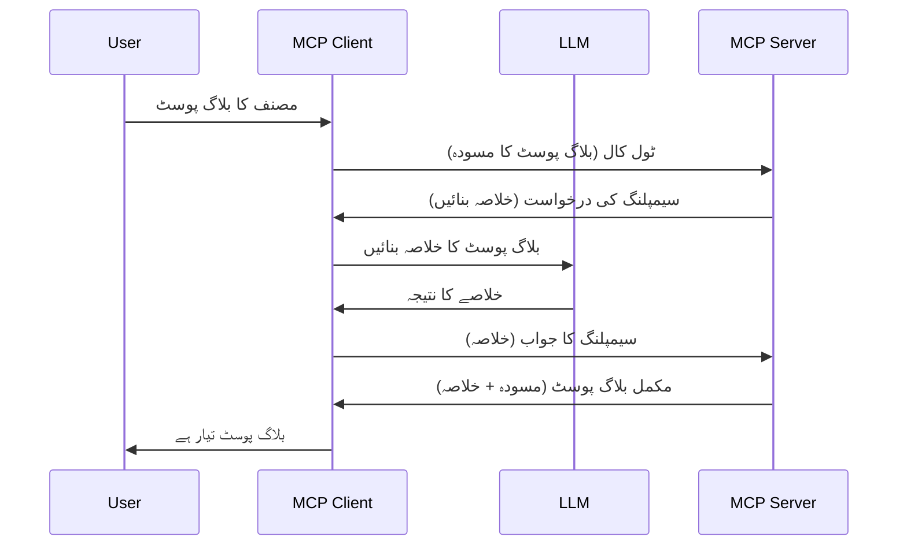

> [!WARNING]
> MCP `2026-07-28` میں سیمپلنگ کی حوصلہ شکنی کی گئی ہے۔ یہ سبق 
> پرانے نفاذ کے لیے برقرار رکھا گیا ہے۔ نئے سرورز کو براہ راست LLM
> فراہم کنندہ API کے ساتھ انضمام کرنا چاہیے۔

# سیمپلنگ - کلائنٹ کو فیچرز تفویض کرنا

> `2026-07-28` کے موافقت کے لیے سیمپلنگ ابھی بھی موجود ہے اور یہ
> پہلی نظرثانی میں جو 28 جولائی، 2027 کے بعد جاری ہوگی، ختم کی جا سکتی ہے۔
> اس سبق میں مثالیں SDK APIs استعمال کر سکتی ہیں جو `2025-11-25` کو نافذ کرتی ہیں۔
> دیکھیں [MCP میں کیا بدلا ہے: 2026-07-28 مواصفات](../../01-CoreConcepts/mcp-2026-07-28.md)۔

پرانے نفاذات میں، سیمپلنگ MCP سرور کو LLM سے مدد طلب کرنے دیتی ہے
جو کلائنٹ کے ذریعے منظم ہوتا ہے۔ نئے نفاذات کے لیے، منتخب شدہ LLM فراہم کنندہ کو
براہ راست کال کریں۔

آئیں ہم کچھ استعمال کے معاملات کا جائزہ لیں اور سیمپلنگ سے متعلق حل کیسے بنائیں۔

## جائزہ

اس سبق میں، ہم سیمپلنگ کب اور کہاں استعمال کرنی ہے اور اسے کیسے ترتیب دینا ہے، پر توجہ دیں گے۔

## سیکھنے کے مقاصد

اس باب میں، ہم:

- بتائیں گے کہ سیمپلنگ کیا ہے اور کب استعمال کرنی چاہیے۔
- دکھائیں گے کہ MCP میں سیمپلنگ کو کیسے ترتیب دیا جائے۔
- سیمپلنگ کے عملی مثالیں فراہم کریں گے۔

## سیمپلنگ کیا ہے اور اسے کیوں استعمال کریں؟

سیمپلنگ ایک جدید فیچر ہے جو درج ذیل طریقے سے کام کرتا ہے:



### سیمپلنگ درخواست

ٹھیک ہے، اب ہمارے پاس ایک قابل اعتبار منظر نامے کا ایک عمومی جائزہ ہے، آئیے بات کرتے ہیں اس سیمپلنگ درخواست کی جو سرور کلائنٹ کو بھیجتا ہے۔ JSON-RPC فارمیٹ میں ایسی درخواست کچھ یوں دکھائی دے سکتی ہے:

```json
{
  "jsonrpc": "2.0",
  "id": 1,
  "method": "sampling/createMessage",
  "params": {
    "messages": [
      {
        "role": "user",
        "content": {
          "type": "text",
          "text": "Create a blog post summary of the following blog post: <BLOG POST>"
        }
      }
    ],
    "modelPreferences": {
      "hints": [
        {
          "name": "claude-3-sonnet"
        }
      ],
      "intelligencePriority": 0.8,
      "speedPriority": 0.5
    },
    "systemPrompt": "You are a helpful assistant.",
    "maxTokens": 100
  }
}
```

یہاں چند چیزیں نمایاں کرنے کے لائق ہیں:

- پرامپٹ، content -> text کے تحت، ہمارا پرامپٹ ہے جو LLM کو بلاگ پوسٹ کا خلاصہ بنانے کی ہدایت دیتا ہے۔

- **modelPreferences**۔ یہ سیکشن صرف ایک پسند ہے، LLM کے ساتھ استعمال کے لیے سفارش کی گئی ترتیب۔ صارف فیصلہ کر سکتا ہے کہ وہ ان سفارشات کو اپنائے یا تبدیل کرے۔ اس صورت میں ماڈل استعمال کرنے، رفتار اور ذہانت کی ترجیح پر سفارشات موجود ہیں۔
- **systemPrompt**، یہ آپ کا معمول کا سسٹم پرامپٹ ہے جو آپ کے LLM کو شخصیت دیتا ہے اور ہدایت نامہ شامل کرتا ہے۔
- **maxTokens**، یہ ایک اور پراپرٹی ہے جو بتاتی ہے کہ اس کام کے لیے کتنے ٹوکنز استعمال کرنے کی سفارش کی گئی ہے۔

### سیمپلنگ جواب

یہ جواب MCP کلائنٹ کی طرف سے MCP سرور کو بھیجا جاتا ہے اور یہ کلائنٹ کے LLM کو کال کرنے، جواب کا انتظار کرنے اور پھر یہ پیغام ترتیب دینے کا نتیجہ ہوتا ہے۔ JSON-RPC میں یہ کچھ یوں ہو سکتا ہے:

```json
{
  "jsonrpc": "2.0",
  "id": 1,
  "result": {
    "role": "assistant",
    "content": {
      "type": "text",
      "text": "Here's your abstract <ABSTRACT>"
    },
    "model": "gpt-5",
    "stopReason": "endTurn"
  }
}
```

دیکھیں کہ جواب بلاگ پوسٹ کا خلاصہ ہے جیسا کہ ہم نے درخواست کی تھی۔ اور نوٹ کریں کہ استعمال شدہ `model` وہ نہیں ہے جو ہم نے مانگا تھا بلکہ "gpt-5" ہے "claude-3-sonnet" کی جگہ۔ یہ ظاہر کرنے کے لیے ہے کہ صارف اپنا فیصلہ بدل سکتا ہے اور آپ کی سیمپلنگ درخواست ایک سفارش ہے۔

اچھا، اب جب کہ ہم مرکزی بہاؤ سمجھ گئے ہیں، اور ایک مفید کام "بلاگ پوسٹ تخلیق + خلاصہ" کے لیے اسے استعمال کرنے کا، آئیے دیکھیں ہمیں اسے کام میں لانے کے لیے کیا کرنا ہوگا۔

### پیغام کی اقسام

سیمپلنگ پیغامات صرف متن تک محدود نہیں ہیں بلکہ آپ تصویریں اور آڈیو بھی بھیج سکتے ہیں۔ JSON-RPC میں یہ یوں مختلف نظر آتا ہے:

**متن**

```json
{
  "type": "text",
  "text": "The message content"
}
```

**تصویری مواد**

```json
{
  "type": "image",
  "data": "base64-encoded-image-data",
  "mimeType": "image/jpeg"
}
```

**آڈیو مواد**

```json
{
  "type": "audio",
  "data": "base64-encoded-audio-data",
  "mimeType": "audio/wav"
}
```

> نوٹ: موجودہ صورتحال اور ہجرتی رہنمائی کے لیے دیکھیں
> [موقوف شدہ سیمپلنگ کی دستاویزات](https://modelcontextprotocol.io/specification/2026-07-28/client/sampling)۔

## کلائنٹ میں سیمپلنگ کیسے ترتیب دیں

> نوٹ: اگر آپ صرف سرور بنا رہے ہیں، تو یہاں زیادہ کچھ کرنے کی ضرورت نہیں ہے۔

کلائنٹ میں، آپ کو درج ذیل فیچر اس طرح سے مخصوص کرنا ہوگا:

```json
{
  "capabilities": {
    "sampling": {}
  }
}
```

جب آپ کا منتخب کردہ کلائنٹ سرور کے ساتھ شروع ہوگا تو یہ فیچر اٹھایا جائے گا۔

## سیمپلنگ کی عملی مثال - ایک بلاگ پوسٹ تخلیق کریں

چلیں ایک سیمپلنگ سرور کوڈ کرتے ہیں، ہمیں درج ذیل کرنا ہوگا:

1. سرور پر ایک ٹول بنائیں۔
1. یہ ٹول ایک سیمپلنگ درخواست بنائے۔
1. ٹول کو کلائنٹ کی سیمپلنگ درخواست کے جواب کا انتظار کرنا چاہیے۔
1. پھر ٹول کا نتیجہ بنایا جائے۔

آئیے مرحلہ وار کوڈ دیکھتے ہیں:

### -1- ٹول بنائیں

**python**

```python
@mcp.tool()
async def create_blog(title: str, content: str, ctx: Context[ServerSession, None]) -> str:
    """Create a blog post and generate a summary"""

```

### -2- سیمپلنگ درخواست بنائیں

اپنے ٹول میں درج ذیل کوڈ شامل کریں:

**python**

```python
post = BlogPost(
        id=len(posts) + 1,
        title=title,
        content=content,
        abstract=""
    )

prompt = f"Create an abstract of the following blog post: title: {title} and draft: {content} "

result = await ctx.session.create_message(
        messages=[
            SamplingMessage(
                role="user",
                content=TextContent(type="text", text=prompt),
            )
        ],
        max_tokens=100,
)

```

### -3- جواب کا انتظار کریں اور جواب واپس کریں

**python**

```python
post.abstract = result.content.text

posts.append(post)

# مکمل مصنوع واپس کریں
return json.dumps({
    "id": post.title,
    "abstract": post.abstract
})
```

### -4- مکمل کوڈ

**python**

```python
from starlette.applications import Starlette
from starlette.routing import Mount, Host

from mcp.server.fastmcp import Context, FastMCP

from mcp.server.session import ServerSession
from mcp.types import SamplingMessage, TextContent

import json


from uuid import uuid4
from typing import List
from pydantic import BaseModel


mcp = FastMCP("Blog post generator")

# ایپ = FastAPI()

posts = []

class BlogPost(BaseModel):
    id: int
    title: str
    content: str
    abstract: str

posts: List[BlogPost] = []

@mcp.tool()
async def create_blog(title: str, content: str, ctx: Context[ServerSession, None]) -> str:
    """Create a blog post and generate a summary"""

    post = BlogPost(
        id=len(posts) + 1,
        title=title,
        content=content,
        abstract=""
    )

    prompt = f"Create an abstract of the following blog post: title: {title} and draft: {content} "

    result = await ctx.session.create_message(
        messages=[
            SamplingMessage(
                role="user",
                content=TextContent(type="text", text=prompt),
            )
        ],
        max_tokens=100,
    )

    post.abstract = result.content.text

    posts.append(post)

    # مکمل بلاگ پوسٹ واپس کریں
    return json.dumps({
        "id": post.title,
        "abstract": post.abstract
    })

if __name__ == "__main__":
    print("Starting server...")
    # mcp چلائیں()
    mcp.run(transport="streamable-http")

# ایپ چلائیں: python server.py
```

### -5- Visual Studio Code میں اسے ٹیسٹ کریں

Visual Studio Code میں اسے ٹیسٹ کرنے کے لیے، درج ذیل کریں:

1. ٹرمینل میں سرور شروع کریں۔
1. اسے *mcp.json* میں شامل کریں (اور یقینی بنائیں کہ یہ شروع ہو چکا ہے) جیسا کہ کچھ یوں:

   ```json
   "servers": {
      "blog-server": {
        "type": "http",
        "url": "http://localhost:8000/mcp"
      }
   }
   ```

1. ایک پرامپٹ ٹائپ کریں:

   ```text
   create a blog post named "Where Python comes from", the content is "Python is actually named after Monty Python Flying Circus"
   ```

1. سیمپلنگ کو ہونے دیں۔ پہلی بار جب آپ اسے ٹیسٹ کریں گے تو آپ کو اضافی ڈائیلاگ نظر آئے گی جسے آپ کو قبول کرنا ہوگا، پھر معمول کی ڈائیلاگ نظر آئے گی جو آپ سے ٹول چلانے کی اجازت مانگے گی۔

1. نتائج کا جائزہ لیں۔ آپ نتائج کو GitHub Copilot Chat میں خوبصورتی سے دکھائے ہوئے دیکھیں گے، لیکن آپ خام JSON جواب بھی دیکھ سکتے ہیں۔

**اضافی فائدہ**۔ Visual Studio Code کے ٹولنگ میں سیمپلنگ کے لیے بہترین سپورٹ موجود ہے۔ آپ اپنے نصب شدہ سرور پر سیمپلنگ کی رسائی کو اس طرح ترتیب دے سکتے ہیں:

1. ایکسٹینشن سیکشن پر جائیں۔
1. "MCP SERVERS - INSTALLED" سیکشن میں اپنے نصب شدہ سرور کے لیے کاغ آئیکن منتخب کریں۔
1 "Configure Model Access" منتخب کریں، یہاں آپ منتخب کر سکتے ہیں کہ GitHub Copilot کو سیمپلنگ کرتے وقت کون سے ماڈلز استعمال کرنے کی اجازت ہے۔ آپ تمام حالیہ سیمپلنگ درخواستیں بھی دیکھ سکتے ہیں "Show Sampling requests" منتخب کر کے۔

## اسائنمنٹ

اس اسائنمنٹ میں، آپ تھوڑی مختلف سیمپلنگ بنائیں گے، یعنی ایک سیمپلنگ انٹیگریشن جو پروڈکٹ کی وضاحت تیار کرنے کی حمایت کرتی ہے۔ آپ کا منظر نامہ یہ ہے:

**منظر نامہ**: ای کامرس کے بیک آفس کارکن کو مدد کی ضرورت ہے، پروڈکٹ کی وضاحتیں تیار کرنے میں بہت زیادہ وقت لگتا ہے۔ اس لیے آپ کو ایک ایسا حل بنانا ہے جہاں آپ "create_product" نامی ٹول کو "title" اور "keywords" دلائل کے ساتھ کال کریں اور یہ مکمل پروڈکٹ تیار کرے جس میں "description" فیلڈ ہو جو کلائنٹ کے LLM سے بھرا جائے۔

مشورہ: وہی سبق جو پہلے سیکھا، اسے استعمال کرتے ہوئے یہ سرور اور اس کا ٹول سیمپلنگ درخواست کے ذریعے بنائیں۔

## حل

[حل](./solution/README.md)

## اہم نکات


سیمپلنگ ایک طاقتور خصوصیت ہے جو سرور کو مواقع فراہم کرتی ہے کہ جب اسے LLM کی مدد درکار ہو تو وہ ٹاسک کلائنٹ کو سونپ سکے۔

## آگے کیا ہے

- [باب 4 - عملی نفاذ](../../04-PracticalImplementation/README.md)

---

<!-- CO-OP TRANSLATOR DISCLAIMER START -->
**ڈس کلیمر**:
یہ دستاویز AI ترجمہ سروس [Co-op Translator](https://github.com/Azure/co-op-translator) کے ذریعے ترجمہ کی گئی ہے۔ جبکہ ہم درستگی کے لیے کوشاں ہیں، براہ کرم اس بات سے آگاہ رہیں کہ خودکار ترجمے میں غلطیاں یا عدم درستیاں ہو سکتی ہیں۔ اصل دستاویز اپنے مادری زبان میں مستند ماخذ سمجھی جائے گی۔ حساس معلومات کے لیے پیشہ ور انسانی ترجمہ کی سفارش کی جاتی ہے۔ اس ترجمے کے استعمال سے پیدا ہونے والی کسی بھی غلط فہمی یا غلط تشریح کی ذمہ داری ہم قبول نہیں کرتے۔
<!-- CO-OP TRANSLATOR DISCLAIMER END -->