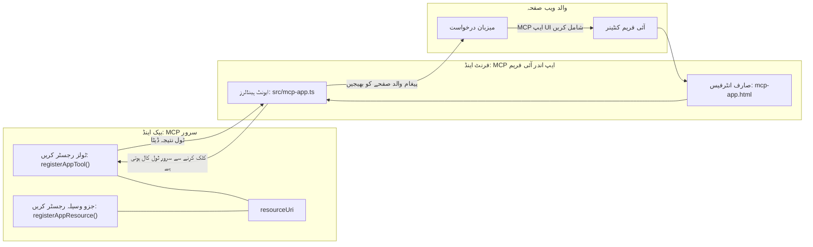
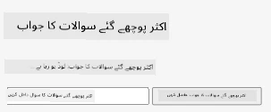
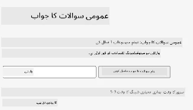
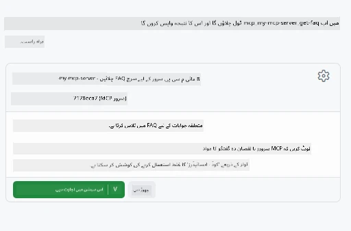

# MCP ایپس

MCP ایپس MCP میں ایک نیا تصور ہے۔ نظریہ یہ ہے کہ آپ صرف ٹول کال سے ڈیٹا کا جواب ہی نہیں دیتے، بلکہ اس معلومات کے ساتھ یہ بھی فراہم کرتے ہیں کہ اس معلومات کے ساتھ کس طرح تعامل کرنا چاہیے۔ اس کا مطلب ہے کہ اب ٹول کے نتائج UI کی معلومات بھی شامل کر سکتے ہیں۔ لیکن ہمیں یہ کیوں چاہیے؟ اچھی بات ہے کہ آج آپ کیسے کام کرتے ہیں۔ آپ ممکنہ طور پر MCP سرور کے نتائج ایک فرنٹ اینڈ کے ذریعے استعمال کر رہے ہیں، جو کوڈ آپ کو لکھنا اور برقرار رکھنا ہوتا ہے۔ بعض اوقات یہی آپ چاہتے ہیں، لیکن بعض اوقات یہ بہت اچھا ہوگا اگر آپ ایک ایسی معلومات کا ٹکڑا لا سکیں جو خود میں مکمل ہو، جس میں ڈیٹا سے لے کر یوزر انٹرفیس تک سب کچھ شامل ہو۔

## جائزہ

یہ سبق MCP ایپس پر عملی رہنمائی فراہم کرتا ہے، کیسے اسے شروع کیا جائے اور اپنی موجودہ ویب ایپس میں کیسے شامل کیا جائے۔ MCP ایپس MCP اسٹینڈرڈ میں ایک بہت نیا اضافہ ہے۔

## سیکھنے کے مقاصد

اس سبق کے آخر میں، آپ قابل ہو جائیں گے:

- یہ بیان کرنا کہ MCP ایپس کیا ہیں۔
- MCP ایپس کب استعمال کریں۔
- اپنی خود کی MCP ایپس بنائیں اور شامل کریں۔

## MCP ایپس - یہ کیسے کام کرتی ہیں

MCP ایپس کے خیال کے مطابق، ایک جواب فراہم کرنا جو بنیادی طور پر ایک کمپونینٹ ہوتا ہے جو رینڈر کیا جائے گا۔ ایسا کمپونینٹ بصری اور تعاملاتی دونوں ہو سکتا ہے، مثلاً بٹن کلکس، صارف کا ان پٹ اور مزید۔ آئیے سرور سائیڈ اور ہمارے MCP سرور سے شروع کرتے ہیں۔ MCP ایپ کمپونینٹ بنانے کے لیے آپ کو ایک ٹول اور ایک اپلیکیشن ریسورس دونوں بنانے کی ضرورت ہے۔ یہ دو حصے resourceUri کے ذریعے مربوط ہوتے ہیں۔

یہاں ایک مثال ہے۔ آئیے دیکھتے ہیں کہ کیا شامل ہے اور کون سے حصے کیا کرتے ہیں:

```text
server.ts -- responsible for registering tools and the component as a UI component
src/
  mcp-app.ts -- wiring up event handlers
mcp-app.html -- the user interface
```

یہ بصری کمپونینٹ بنانے اور اس کی منطق کی فن تعمیر کو ظاہر کرتا ہے۔


آئیے اگلے حصے میں بیک اینڈ اور فرنٹ اینڈ کی ذمہ داریوں کو بیان کریں۔

### بیک اینڈ

یہاں دو کام کرنے ہیں:

- وہ ٹولز رجسٹر کرنا جن کے ساتھ تعامل کرنا ہے۔
- کمپونینٹ کی تعریف کرنا۔

**ٹول رجسٹر کرنا**

```typescript
registerAppTool(
    server,
    "get-time",
    {
      title: "Get Time",
      description: "Returns the current server time.",
      inputSchema: {},
      _meta: { ui: { resourceUri } }, // اس ٹول کو اس کے UI وسائل سے جوڑتا ہے
    },
    async () => {
      const time = new Date().toISOString();
      return { content: [{ type: "text", text: time }] };
    },
  );

```

مندرجہ بالا کوڈ اس برتاو کو بیان کرتا ہے، جہاں `get-time` نامی ٹول کو ظاہر کیا گیا ہے۔ یہ کوئی ان پٹ قبول نہیں کرتا لیکن موجودہ وقت پیدا کرتا ہے۔ ہمارے پاس `inputSchema` کو بھی ڈیفائن کرنے کی صلاحیت ہے اگر ہمیں صارف کا ان پٹ قبول کرنا ہو۔

**کمپونینٹ رجسٹر کرنا**

اسی فائل میں، ہمیں کمپونینٹ کو بھی رجسٹر کرنا ہوگا:

```typescript
const resourceUri = "ui://get-time/mcp-app.html";

// وسائل کو رجسٹر کریں، جو UI کے لیے بنڈل شدہ HTML/JavaScript واپس کرتا ہے۔
registerAppResource(
  server,
  resourceUri,
  resourceUri,
  { mimeType: RESOURCE_MIME_TYPE },
  async () => {
    const html = await fs.readFile(path.join(DIST_DIR, "mcp-app.html"), "utf-8");

    return {
    contents: [
        { uri: resourceUri, mimeType: RESOURCE_MIME_TYPE, text: html },
    ],
    };
  },
);
```

نوٹ کریں کہ ہم `resourceUri` کا ذکر کرتے ہیں تاکہ کمپونینٹ کو اس کے ٹولز سے جوڑا جا سکے۔ دلچسپی کا مقام وہ کال بیک بھی ہے جہاں ہم UI فائل لوڈ کرتے ہیں اور کمپونینٹ واپس کرتے ہیں۔

### کمپونینٹ فرنٹ اینڈ

بیک اینڈ کی طرح، یہاں بھی دو حصے ہیں:

- خالص HTML میں لکھا گیا فرنٹ اینڈ۔
- کوڈ جو ایونٹس کو ہینڈل کرتا ہے اور کیا کرنا ہے، مثلاً ٹولز کال کرنا یا پیرنٹ ونڈو سے پیغام رسانی کرنا۔

**یوزر انٹرفیس**

آئیے یوزر انٹرفیس دیکھتے ہیں۔

```html
<!-- mcp-app.html -->
<!DOCTYPE html>
<html lang="en">
  <head>
    <meta charset="UTF-8" />
    <title>Get Time App</title>
  </head>
  <body>
    <p>
      <strong>Server Time:</strong> <code id="server-time">Loading...</code>
    </p>
    <button id="get-time-btn">Get Server Time</button>
    <script type="module" src="/src/mcp-app.ts"></script>
  </body>
</html>
```

**ایونٹ وائر اپ**

آخری حصہ ایونٹ وائر اپ ہے۔ اس کا مطلب ہے کہ ہم UI میں کون سا حصہ ایونٹ ہینڈلرز کی ضرورت ہے اور ایونٹ ہونے پر کیا کرنا ہے:

```typescript
// mcp-app.ts

import { App } from "@modelcontextprotocol/ext-apps";

// عناصر کے حوالہ جات حاصل کریں
const serverTimeEl = document.getElementById("server-time")!;
const getTimeBtn = document.getElementById("get-time-btn")!;

// ایپ کا انسٹانس بنائیں
const app = new App({ name: "Get Time App", version: "1.0.0" });

// سرور سے ٹول کے نتائج کو ہینڈل کریں۔ `app.connect()` سے پہلے سیٹ کریں تاکہ
// ابتدائی ٹول کے نتیجے کو مس نہ کریں۔
app.ontoolresult = (result) => {
  const time = result.content?.find((c) => c.type === "text")?.text;
  serverTimeEl.textContent = time ?? "[ERROR]";
};

// بٹن کلک کو جوڑیں
getTimeBtn.addEventListener("click", async () => {
  // `app.callServerTool()` UI کو سرور سے تازہ ڈیٹا طلب کرنے دیتا ہے
  const result = await app.callServerTool({ name: "get-time", arguments: {} });
  const time = result.content?.find((c) => c.type === "text")?.text;
  serverTimeEl.textContent = time ?? "[ERROR]";
});

// ہوسٹ سے جڑیں
app.connect();
```

جیسا کہ آپ اوپر دیکھ سکتے ہیں، یہ عام کوڈ ہے جو DOM عناصر کو ایونٹس سے جوڑتا ہے۔ خاص طور پر واہ کرنا یہ ہے کہ `callServerTool` کو کال کیا گیا ہے جو بیک اینڈ پر ٹول کو کال کرتا ہے۔

## صارف کے ان پٹ سے نمٹنا

اب تک، ہم نے ایک کمپونینٹ دیکھا ہے جس میں ایک بٹن ہے جو کلک کرنے پر ٹول کال کرتا ہے۔ آئیے دیکھتے ہیں کہ کیا ہم اور UI عناصر جیسے ان پٹ فیلڈ شامل کر سکتے ہیں اور کیا ہم ٹول کو دلائل بھیج سکتے ہیں۔ آئیے ایک FAQ فنکشنالٹی بنائیں۔ کام یوں ہونا چاہیے:

- ایک بٹن اور ایک ان پٹ عنصر ہونا چاہیے جہاں صارف "Shipping" جیسے کلیدی لفظ کو تلاش کرنے کے لیے ٹائپ کرے۔ یہ بیک اینڈ پر ایک ٹول کو کال کرے گا جو FAQ ڈیٹا میں تلاش کرتا ہے۔
- ایک ٹول جو مذکورہ FAQ تلاش کی حمایت کرتا ہو۔

آئیے پہلے بیک اینڈ میں ضروری حمایت شامل کریں:

```typescript
const faq: { [key: string]: string } = {
    "shipping": "Our standard shipping time is 3-5 business days.",
    "return policy": "You can return any item within 30 days of purchase.",
    "warranty": "All products come with a 1-year warranty covering manufacturing defects.",
  }

registerAppTool(
    server,
    "get-faq",
    {
      title: "Search FAQ",
      description: "Searches the FAQ for relevant answers.",
      inputSchema: zod.object({
        query: zod.string().default("shipping"),
      }),
      _meta: { ui: { resourceUri: faqResourceUri } }, // اس ٹول کو اس کے UI وسائل سے مربوط کرتا ہے
    },
    async ({ query }) => {
      const answer: string = faq[query.toLowerCase()] || "Sorry, I don't have an answer for that.";
      return { content: [{ type: "text", text: answer }] };
    },
  );
```

یہاں ہم دیکھ رہے ہیں کہ ہم `inputSchema` کو کیسے بھر رہے ہیں اور اسے `zod` اسکیمہ دے رہے ہیں:

```typescript
inputSchema: zod.object({
  query: zod.string().default("shipping"),
})
```

اوپر کے اسکیمہ میں ہم بتاتے ہیں کہ ہمارے پاس `query` نامی ایک ان پٹ پیرامیٹر ہے اور یہ اختیاری ہے جس کی ڈیفالٹ ویلیو "shipping" ہے۔

اچھا، اب چلیں *mcp-app.html* دیکھتے ہیں کہ ہمیں کون سا UI بنانا ہے:

```html
<div class="faq">
    <h1>FAQ response</h1>
    <p>FAQ Response: <code id="faq-response">Loading...</code></p>
    <input type="text" id="faq-query" placeholder="Enter FAQ query" />
    <button id="get-faq-btn">Get FAQ Response</button>
  </div>
```

زبردست، اب ہمارے پاس ان پٹ عنصر اور بٹن ہے۔ اب *mcp-app.ts* پر چلتے ہیں تاکہ ان ایونٹس کو کوڈ سے جوڑیں:

```typescript
const getFaqBtn = document.getElementById("get-faq-btn")!;
const faqQueryInput = document.getElementById("faq-query") as HTMLInputElement;

getFaqBtn.addEventListener("click", async () => {
  const query = faqQueryInput.value;
  const result = await app.callServerTool({ name: "get-faq", arguments: { query } });
  const faq = result.content?.find((c) => c.type === "text")?.text;
  faqResponseEl.textContent = faq ?? "[ERROR]";
});
```

اوپر کے کوڈ میں ہم:

- دلچسپ UI عناصر کے حوالہ جات بناتے ہیں۔
- بٹن کلک کو ہینڈل کرتے ہیں تاکہ ان پٹ عنصر کی قدر کو پارس کریں اور ہم `app.callServerTool()` کو `name` اور `arguments` کے ساتھ کال کرتے ہیں جہاں مؤخر الذکر `query` کو ویلیو کے طور پر بھیج رہا ہے۔

عملاً جب آپ `callServerTool` کو کال کرتے ہیں تو یہ پیرنٹ ونڈو کو میسج بھیجتا ہے اور وہ ونڈو آخر کار MCP سرور کو کال کرتی ہے۔

### آزمائیں

اسے آزمانے پر ہمیں درج ذیل دیکھنا چاہیے:



اور یہاں ہم اسے "warranty" جیسے ان پٹ کے ساتھ آزما رہے ہیں:



اس کوڈ کو چلانے کے لیے، [کوڈ سیکشن](./code/README.md) پر جائیں۔

## Visual Studio Code میں ٹیسٹنگ

Visual Studio Code MVP ایپس کے لیے بہترین سپورٹ رکھتا ہے اور آپ کی MCP ایپس ٹیسٹ کرنے کے سب سے آسان طریقوں میں سے ایک ہے۔ Visual Studio Code استعمال کرنے کے لیے، *mcp.json* میں ایک سرور انٹری شامل کریں، جیسا کہ:

```json
"my-mcp-server-7178eca7": {
    "url": "http://localhost:3001/mcp",
    "type": "http"
  }
```

پھر سرور شروع کریں، آپ کو چیٹ ونڈو کے ذریعے اپنی MVP ایپ سے بات چیت کرنے کے قابل ہونا چاہیے بشرطیکہ آپ نے GitHub Copilot انسٹال کیا ہو۔

جیسے آپ پرامپٹ کے ذریعے اسے چلاتے ہیں، مثلاً "#get-faq":



اور جیسا کہ آپ نے ویب براؤزر کے ذریعے چلایا، یہ ویسا ہی UI رینڈر کرتا ہے:


## اسائنمنٹ

ایک راک پیپر سیزر گیم بنائیں۔ اس میں درج ذیل چیزیں شامل ہونی چاہئیں:

UI:

- اختیارات کے ساتھ ایک ڈراپ ڈاؤن لسٹ
- انتخاب جمع کروانے کے لیے ایک بٹن
- ایک لیبل جو دکھائے کہ کس نے کیا منتخب کیا اور کون جیتا

سرور:

- ایک راک پیپر سیزر ٹول ہونا چاہیے جو "choice" کو ان پٹ کے طور پر لیتا ہو۔ اسے کمپیوٹر کا انتخاب بھی رینڈر کرنا ہوگا اور فاتح کا تعین کرنا ہوگا۔

## حل

[حل](./assignment/README.md)

## خلاصہ

ہم نے اس نئے تصور MCP ایپس کے بارے میں سیکھا۔ یہ ایک نیا تصور ہے جو MCP سرورز کو صرف ڈیٹا ہی نہیں بلکہ اس بات پر بھی رائے دیتا ہے کہ یہ ڈیٹا کس طرح پیش کیا جائے۔

مزید یہ کہ ہم نے سیکھا کہ یہ MCP ایپس ایک آئی فریم میں ہوسٹ کی جاتی ہیں اور MCP سرورز کے ساتھ بات چیت کے لیے انہیں پیرنٹ ویب ایپ کو پیغامات بھیجنے کی ضرورت ہوتی ہے۔ مختلف لائبریریاں موجود ہیں، چاہے خالص جاوا اسکرپٹ کے لیے ہوں یا ریئکٹ کے لیے، جو اس بات چیت کو آسان بناتی ہیں۔

## اہم نکات

یہاں آپ نے کیا سیکھا:

- MCP ایپس ایک نیا اسٹینڈرڈ ہے جو اس وقت مفید ہو سکتا ہے جب آپ ڈیٹا اور UI فیچرز دونوں بھیجنا چاہتے ہوں۔
- یہ قسم کی ایپس سیکیورٹی وجوہات کی بنا پر آئی فریم میں چلتی ہیں۔

## آگے کیا ہے

- [باب 4](../../04-PracticalImplementation/README.md)

---

<!-- CO-OP TRANSLATOR DISCLAIMER START -->
**دستخطی وضاحت**:  
یہ دستاویز AI ترجمہ سروس [Co-op Translator](https://github.com/Azure/co-op-translator) کے ذریعے ترجمہ کی گئی ہے۔ ہم درستگی کے لیے کوشاں ہیں، لیکن براہ کرم آگاہ رہیں کہ خودکار ترجمے میں غلطیاں یا کمیاں ہو سکتی ہیں۔ اصل دستاویز اپنی مادری زبان میں معتبر ماخذ سمجھی جانی چاہیے۔ انتہائی اہم معلومات کے لیے پیشہ ور انسانی ترجمہ تجویز کیا جاتا ہے۔ ہم اس ترجمے کے استعمال سے پیدا ہونے والی کسی بھی غلط فہمی یا غلط تشریح کے ذمہ دار نہیں ہیں۔
<!-- CO-OP TRANSLATOR DISCLAIMER END -->