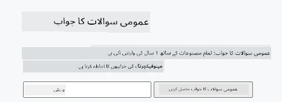
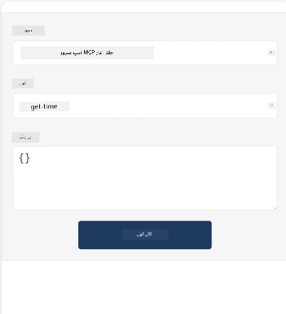
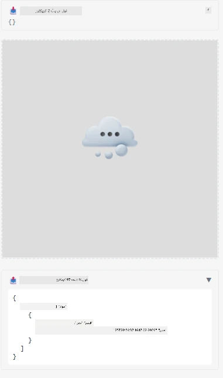

یہاں MCP ایپ کی نمونہ پیش کی گئی ہے

## انسٹال کریں

1. *mcp-app* فولڈر پر جائیں
1. `npm install` چلائیں، اس سے فرنٹ اینڈ اور بیک اینڈ کی انحصاریاں انسٹال ہونی چاہئیں

بیک اینڈ کے مرتب ہونے کی تصدیق کرنے کے لیے یہ چلائیں:

```sh
npx tsc --noEmit
```

اگر سب کچھ ٹھیک ہوا تو کوئی آؤٹ پٹ نہیں آنا چاہیے۔

## بیک اینڈ چلائیں

> اگر آپ ونڈوز مشین پر ہیں تو یہ تھوڑا زیادہ کام لیتا ہے کیونکہ MCP ایپس کے حل میں `concurrently` لائبریری استعمال ہوتی ہے جسے چلانے کے لیے آپ کو اس کا متبادل تلاش کرنا ہوگا۔ یہاں MCP ایپ کے *package.json* کی متنازع لائن ہے:

    ```json
    "start": "concurrently \"cross-env NODE_ENV=development INPUT=mcp-app.html vite build --watch\" \"tsx watch main.ts\""
    ```

یہ ایپ دو حصوں پر مشتمل ہے، ایک بیک اینڈ حصہ اور ایک ہوسٹ حصہ۔

بیک اینڈ کو شروع کرنے کے لیے یہ چلائیں:

```sh
npm start
```

اس سے بیک اینڈ `http://localhost:3001/mcp` پر شروع ہو جانا چاہیے۔

> نوٹ کریں، اگر آپ Codespace میں ہیں تو آپ کو پورٹ کی نمائش کو پبلک پر سیٹ کرنا پڑسکتا ہے۔ چیک کریں کہ آپ اینڈ پوائنٹ کو براؤزر میں https://<name of Codespace>.app.github.dev/mcp کے ذریعے پہنچ سکتے ہیں۔

## انتخاب -1- Visual Studio Code میں ایپ کی جانچ کریں

Visual Studio Code میں حل کی جانچ کرنے کے لیے، درج ذیل کریں:

- `mcp.json` میں ایک سرور اندراج شامل کریں جیسا کہ:

    ```json
    {
        "servers": {
            "my-mcp-server-7178eca7": {
                "url": "http://localhost:3001/mcp",
                "type": "http"
            }
        },
        "inputs": []
    }
    ```

1. *mcp.json* میں "start" بٹن پر کلک کریں
1. یقینی بنائیں کہ چیٹ ونڈو کھلی ہوئی ہے اور `get-faq` ٹائپ کریں، آپ کو مندرجہ ذیل نتیجہ نظر آنا چاہیے:

    

## انتخاب -2- ہوسٹ کے ساتھ ایپ کی جانچ کریں

ریپو <https://github.com/modelcontextprotocol/ext-apps> میں متعدد مختلف ہوسٹس موجود ہیں جنہیں آپ اپنے MVP ایپس کی جانچ کے لیے استعمال کر سکتے ہیں۔

ہم آپ کو یہاں دو مختلف اختیارات پیش کریں گے:

### لوکل مشین

- ریپو کلون کرنے کے بعد *ext-apps* پر جائیں۔

- انحصاریات انسٹال کریں

   ```sh
   npm install
   ```

- ایک علیحدہ ٹرمینل ونڈو میں، *ext-apps/examples/basic-host* پر جائیں

    > اگر آپ Codespace میں ہیں، تو آپ کو serve.ts فائل کی لائن 27 میں جانا ہوگا اور http://localhost:3001/mcp کی جگہ اپنے Codespace URL کا استعمال کرنا ہوگا، مثلاً https://psychic-xylophone-657rpjgvxpc5g64-3001.app.github.dev/mcp

- ہوسٹ چلائیں:

    ```sh
    npm start
    ```

    اس سے ہوسٹ بیک اینڈ سے جڑ جائے گا اور آپ کو ایپ اس طرح چلتی ہوئی نظر آئے گی:

    

### Codespace

Codespace ماحول کو چلانا کچھ زیادہ محنت طلب ہوتا ہے۔ Codespace کے ذریعے ہوسٹ استعمال کرنے کے لیے:

- *ext-apps* ڈائریکٹری دیکھیے اور *examples/basic-host* پر جائیں۔
- `npm install` چلائیں تاکہ انحصاریاں انسٹال ہوں
- `npm start` چلائیں تاکہ ہوسٹ شروع ہو جائے۔

## ایپ کو آزمانا

ایپ کو درج ذیل طریقے سے آزمائیں:

- "Call Tool" بٹن منتخب کریں اور آپ کو نتائج اس طرح نظر آئیں گے:

    

زبردست، سب کچھ ٹھیک چل رہا ہے۔

---

<!-- CO-OP TRANSLATOR DISCLAIMER START -->
**اعلانِ ذمہ داری**:
یہ دستاویز AI ترجمہ سروس [Co-op Translator](https://github.com/Azure/co-op-translator) کے ذریعے ترجمہ کی گئی ہے۔ اگرچہ ہم درستگی کے لیے کوشاں ہیں، براہِ مہربانی ذہن میں رکھیں کہ خودکار ترجمے میں غلطیاں یا نواقص ہو سکتے ہیں۔ اصل دستاویز اپنی مادری زبان میں معتبر ذریعہ سمجھا جانا چاہیے۔ اہم معلومات کے لیے پیشہ ور انسانی ترجمہ کی سفارش کی جاتی ہے۔ ہم اس ترجمے کے استعمال سے پیدا ہونے والی کسی بھی غلط فہمی یا غلط تشریح کے ذمہ دار نہیں ہیں۔
<!-- CO-OP TRANSLATOR DISCLAIMER END -->