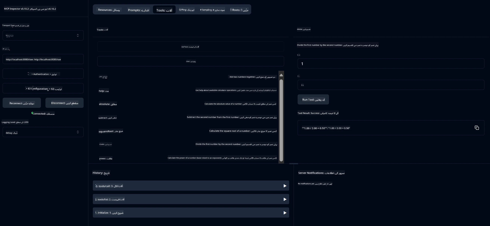

# بنیادی کیلکولیٹر MCP سروس

> [!NOTE]
> یہ نمونہ پرانا HTTP+SSE ٹرانسپورٹ استعمال کرتا ہے اور MCP `2025-11-25` کے ساتھ مطابقت رکھنے والے SDK کو ہدف بناتا ہے۔
> نئے ریموٹ سروروں کو `2026-07-28` Streamable HTTP سپورٹ استعمال کرنا چاہیے۔


- SSE (سرور سے بھیجے گئے ایونٹس) کی حمایت
- Spring AI کے `@Tool` تشریح کا استعمال کرتے ہوئے خودکار ٹول رجسٹریشن
- بنیادی کیلکولیٹر کے فنکشنز:
  - جمع، تفریق، ضرب، تقسیم
  - طاقت کا حساب اور جذر مربع
  - باقی (مدولس) اور مطلق قدر
  - آپریشن کی وضاحت کے لیے مدد کا فنکشن


   - دو نمبروں کا جمع کرنا
   - ایک نمبر سے دوسرے نمبر کو منفی کرنا
   - دو نمبروں کا ضرب دینا
   - ایک نمبر کو دوسرے سے تقسیم کرنا (صفر تقسیم کی جانچ کے ساتھ)


   - طاقت کا حساب (بیس کو ایک ایکسپونینٹ تک بڑھانا)
   - جذر مربع کا حساب (منفی نمبر کی جانچ کے ساتھ)
   - مدولس (باقی) کا حساب
   - مطلق قدر کا حساب


   - بلٹ ان مدد کا فنکشن جو دستیاب تمام آپریشنز کی وضاحت کرتا ہے


- `subtract(a, b)`: دوسرے نمبر کو پہلے نمبر سے منفی کریں
- `multiply(a, b)`: دو نمبروں کو ضرب دیں
- `divide(a, b)`: پہلے نمبر کو دوسرے سے تقسیم کریں (صفر کی جانچ کے ساتھ)
- `power(base, exponent)`: کسی نمبر کی طاقت کا حساب لگائیں
- `squareRoot(number)`: جذر مربع کا حساب لگائیں (منفی نمبر کی جانچ کے ساتھ)
- `modulus(a, b)`: تقسیم کے دوران باقی کا حساب لگائیں
- `absolute(number)`: مطلق قدر کا حساب لگائیں
- `help()`: دستیاب آپریشنز کے بارے میں معلومات حاصل کریں


   
   GitHub کے AI ماڈلز (مثلاً phi-4) استعمال کرنے کے لیے، آپ کو GitHub پرسنل ایکسیس ٹوکن چاہیے:


   
   b. "Generate new token" → "Generate new token (classic)" پر کلک کریں
   
   c. اپنے ٹوکن کو ایک وضاحتی نام دیں
   
   d. درج ذیل اسکوپس منتخب کریں:
      - `repo` (پرائیویٹ ریپوزٹریز پر مکمل کنٹرول)
      - `read:org` (آرگ اور ٹیم کی ممبرشپ پڑھنا، آرگ پروجیکٹس پڑھنا)
      - `gist` (گیسٹس بنانا)
      

      - `user:email` (صارف کے ای میل پتے تک رسائی حاصل کریں (صرف پڑھنے کے لیے))
   
   e. "Generate token" پر کلک کریں اور اپنا نیا ٹوکن نقل کریں
   
   f. اسے بطور ماحولیاتی متغیر سیٹ کریں:
      
      ونڈوز پر:
      ```
      set GITHUB_TOKEN=your-github-token
      ```
      
      میک او ایس/لینکس پر:
      ```bash
      export GITHUB_TOKEN=your-github-token
      ```

   g. مستقل سیٹ اپ کے لیے، اسے نظام کی ترتیبات کے ذریعے اپنے ماحول کے متغیرات میں شامل کریں

2. اپنے پروجیکٹ میں LangChain4j GitHub انحصار شامل کریں (جو پہلے سے pom.xml میں شامل ہے):
   ```xml
   <dependency>
       <groupId>dev.langchain4j</groupId>
       <artifactId>langchain4j-github</artifactId>
       <version>${langchain4j.version}</version>
   </dependency>
   ```

3. اس بات کو یقینی بنائیں کہ کیلکولیٹر سرور `localhost:8080` پر چل رہا ہے

### LangChain4j کلائنٹ چلانا

یہ مثال دکھاتی ہے:
- SSE ٹرانسپورٹ کے ذریعے کیلکولیٹر MCP سرور سے رابطہ قائم کرنا
- LangChain4j استعمال کرتے ہوئے ایک چیٹ بوٹ بنانا جو کیلکولیٹر آپریشنز کو استعمال کرتا ہے
- GitHub AI ماڈلز کے ساتھ انضمام (اب phi-4 ماڈل استعمال کر رہا ہے)

کلائنٹ درج ذیل نمونہ سوالات بھیجتا ہے تاکہ فعالیت کو ظاہر کیا جا سکے:
1. دو نمبرز کا مجموعہ حساب کرنا
2. کسی نمبر کی مربع جڑ تلاش کرنا
3. دستیاب کیلکولیٹر آپریشنز کے بارے میں مدد کی معلومات حاصل کرنا

مثال چلائیں اور کنسول آؤٹ پٹ دیکھیں کہ AI ماڈل کس طرح کیلکولیٹر ٹولز کو استعمال کرتے ہوئے سوالات کا جواب دیتا ہے۔

### GitHub ماڈل کی ترتیب

LangChain4j کلائنٹ GitHub کے phi-4 ماڈل کو درج ذیل ترتیبات کے ساتھ استعمال کرنے کے لیے ترتیب دیا گیا ہے:

```java
ChatLanguageModel model = GitHubChatModel.builder()
    .apiKey(System.getenv("GITHUB_TOKEN"))
    .timeout(Duration.ofSeconds(60))
    .modelName("phi-4")
    .logRequests(true)
    .logResponses(true)
    .build();
```

مختلف GitHub ماڈلز استعمال کرنے کے لیے، `modelName` پیرامیٹر کو کسی دوسرے معاون ماڈل سے بدل دیں (مثلاً "claude-3-haiku-20240307"، "llama-3-70b-8192"، وغیرہ)۔

## انحصارات

پروجیکٹ کو درج ذیل کلیدی انحصارات کی ضرورت ہے:

```xml
<!-- For MCP Server -->
<dependency>
    <groupId>org.springframework.ai</groupId>
    <artifactId>spring-ai-starter-mcp-server-webflux</artifactId>
</dependency>

<!-- For LangChain4j integration -->
<dependency>
    <groupId>dev.langchain4j</groupId>
    <artifactId>langchain4j-mcp</artifactId>
    <version>${langchain4j.version}</version>
</dependency>

<!-- For GitHub models support -->
<dependency>
    <groupId>dev.langchain4j</groupId>
    <artifactId>langchain4j-github</artifactId>
    <version>${langchain4j.version}</version>
</dependency>
```

## پروجیکٹ بنانا

Maven استعمال کرتے ہوئے پروجیکٹ بنائیں:
```bash
./mvnw clean install -DskipTests
```

## سرور چلانا

### جاوا استعمال کرنا

```bash
java -jar target/calculator-server-0.0.1-SNAPSHOT.jar
```

### MCP انسپکٹر استعمال کرنا

MCP انسپکٹر MCP سروسز کے ساتھ تعامل کے لیے ایک مفید ٹول ہے۔ اس کیلکولیٹر سروس کے ساتھ اسے استعمال کرنے کے لیے:

1. **MCP انسپکٹر انسٹال اور چلائیں** ایک نئی ٹرمینل ونڈو میں:
   ```bash
   npx @modelcontextprotocol/inspector
   ```

2. **ویب UI تک رسائی حاصل کریں** ایپ کی جانب سے دکھائی گئی URL پر کلک کرکے (عام طور پر http://localhost:6274)

3. **کنکشن کو ترتیب دیں**:
   - ٹرانسپورٹ کی قسم "SSE" سیٹ کریں
   - URL کو اپنے چلتے ہوئے سرور کے SSE اینڈ پوائنٹ پر سیٹ کریں: `http://localhost:8080/sse`
   - "Connect" پر کلک کریں

4. **ٹولز استعمال کریں**:
   - "List Tools" پر کلک کریں تاکہ دستیاب کیلکولیٹر آپریشنز دیکھ سکیں
   - کسی ٹول کو منتخب کریں اور "Run Tool" پر کلک کریں تاکہ آپریشن انجام دیں



### ڈوکر استعمال کرنا

پروجیکٹ میں کنٹینر تعیناتی کے لیے Dockerfile شامل ہے:

1. **ڈوکر امیج بنائیں**:
   ```bash
   docker build -t calculator-mcp-service .
   ```

2. **ڈوکر کنٹینر چلائیں**:
   ```bash
   docker run -p 8080:8080 calculator-mcp-service
   ```

اس سے:
- Maven 3.9.9 اور Eclipse Temurin 24 JDK کے ساتھ ایک کثیر مرحلہ ڈوکر امیج بنانا
- ایک بہتر کنٹینر امیج بنانا
- پورٹ 8080 پر سروس کو ایکسپوز کرنا
- کنٹینر کے اندر MCP کیلکولیٹر سروس شروع کرنا

جب کنٹینر چل رہا ہو تو آپ `http://localhost:8080` پر سروس تک رسائی حاصل کر سکتے ہیں۔

## مسائل کا حل

### GitHub ٹوکن کے عام مسائل


1. **ٹوکن اجازت کے مسائل**: اگر آپ کو 403 ممنوعہ خرابی ملے، تو چیک کریں کہ آپ کے ٹوکن کے پاس مطلوبہ اجازتیں موجود ہیں جیسا کہ پری ریکوائرمنٹس میں بیان کیا گیا ہے۔

2. **ٹوکن نہیں ملا**: اگر آپ کو "کوئی API کلید نہیں ملی" کی خرابی ہو، تو اس بات کو یقینی بنائیں کہ GITHUB_TOKEN ماحول کا متغیر صحیح طریقے سے سیٹ ہے۔

3. **ریٹ لمٹنگ**: GitHub API پر ریٹ لمٹس ہوتے ہیں۔ اگر آپ کو ریٹ لمٹ کی خرابی (حالت کوڈ 429) کا سامنا ہو، تو دوبارہ کوشش کرنے سے پہلے چند منٹ انتظار کریں۔

4. **ٹوکن کی میعاد ختم ہونا**: GitHub ٹوکن کی میعاد ختم ہو سکتی ہے۔ اگر کچھ وقت بعد آپ کو توثیق کی خرابی ملے، تو نیا ٹوکن بنائیں اور اپنے ماحول کے متغیر کو اپ ڈیٹ کریں۔

اگر آپ کو مزید مدد کی ضرورت ہو، تو [LangChain4j دستاویزات](https://github.com/langchain4j/langchain4j) یا [GitHub API دستاویزات](https://docs.github.com/en/rest) دیکھیں۔

---

<!-- CO-OP TRANSLATOR DISCLAIMER START -->
**ڈس کلیمر**:
یہ دستاویز AI ترجمہ سروس [Co-op Translator](https://github.com/Azure/co-op-translator) کے ذریعے ترجمہ کی گئی ہے۔ جبکہ ہم درستگی کے لیے کوشاں ہیں، براہ کرم اس بات سے آگاہ رہیں کہ خودکار ترجمے میں غلطیاں یا عدم درستیاں ہو سکتی ہیں۔ اصل دستاویز اپنے مادری زبان میں مستند ماخذ سمجھی جائے گی۔ حساس معلومات کے لیے پیشہ ور انسانی ترجمہ کی سفارش کی جاتی ہے۔ اس ترجمے کے استعمال سے پیدا ہونے والی کسی بھی غلط فہمی یا غلط تشریح کی ذمہ داری ہم قبول نہیں کرتے۔
<!-- CO-OP TRANSLATOR DISCLAIMER END -->