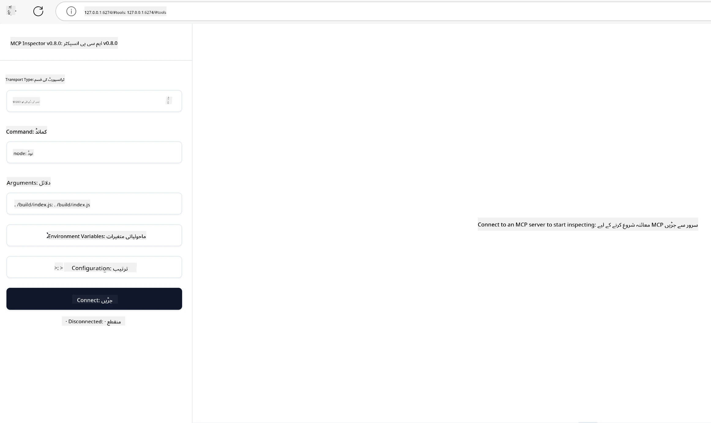

# عملی نفاذ

[](https://youtu.be/vCN9-mKBDfQ)

_(نیچے دی گئی تصویر پر کلک کریں تاکہ اس سبق کی ویڈیو دیکھ سکیں)_

عملی نفاذ وہ جگہ ہے جہاں ماڈل کانٹیکسٹ پروٹوکول (MCP) کی طاقت محسوس کی جا سکتی ہے۔ اگرچہ MCP کے نظریہ اور فن تعمیر کو سمجھنا اہم ہے، اصل قدر اس وقت سامنے آتی ہے جب آپ ان تصورات کو حقیقی دنیا کے مسائل کو حل کرنے والے حل تیار کرنے، پرکھنے، اور تعینات کرنے کے لیے استعمال کرتے ہیں۔ یہ باب تصوری علم اور عملی ترقی کے درمیان پل فراہم کرتا ہے، اور آپ کی رہنمائی کرتا ہے تاکہ MCP پر مبنی ایپس کو زندگی میں لایا جا سکے۔

چاہے آپ ذہین معاونین تیار کر رہے ہوں، کاروباری ورک فلو میں AI کو مربوط کر رہے ہوں، یا ڈیٹا پروسیسنگ کے لیے حسب ضرورت آلات بنا رہے ہوں، MCP ایک لچکدار بنیاد فراہم کرتا ہے۔ اس کا زبان سے آزاد ڈیزائن اور مقبول پروگرامنگ زبانوں کے لیے سرکاری SDKs اسے وسیع پیمانے پر ڈویلپرز کے لیے قابل رسائی بناتے ہیں۔ ان SDKs کا استعمال کرتے ہوئے، آپ جلدی سے پروٹوٹائپ بنا سکتے ہیں، بار بار تبدیل کر سکتے ہیں، اور اپنے حل مختلف پلیٹ فارمز اور ماحولیات پر اسکیل کر سکتے ہیں۔

آئندہ حصوں میں، آپ کو عملی مثالیں، نمونہ کوڈ، اور تعیناتی کی حکمت عملیاں ملیں گی جو یہ دکھاتی ہیں کہ C#، جاوا وِد اسپرنگ، ٹائپ اسکرپٹ، جاوا اسکرپٹ، اور پائتھن میں MCP کو کیسے نافذ کیا جائے۔ آپ سیکھیں گے کہ MCP سرورز کو کیسے ڈی بگ اور ٹیسٹ کریں، APIs کو کیسے منظم کریں، اور Azure کا استعمال کرتے ہوئے کلاؤڈ پر حل کیسے تعینات کریں۔ یہ عملی وسائل آپ کے سیکھنے کو تیز کرنے اور آپ کو مضبوط، پیداواری MCP ایپس بنانے میں اعتماد دینے کے لیے ڈیزائن کیے گئے ہیں۔

## جائزہ

یہ سبق MCP نفاذ کے عملی پہلوؤں پر توجہ دیتا ہے جو متعدد پروگرامنگ زبانوں میں شامل ہیں۔ ہم دیکھیں گے کہ MCP SDKs کو C#, جاوا وِد اسپرنگ، ٹائپ اسکرپٹ، جاوا اسکرپٹ، اور پائتھن میں استعمال کر کے مضبوط ایپس کیسے بنائی جائیں، MCP سرورز کو کیسے ڈی بگ اور ٹیسٹ کیا جائے، اور قابلِ استعمال وسائل، پرامپٹس، اور آلات کیسے تخلیق کیے جائیں۔

## سیکھنے کے مقاصد

اس سبق کے اختتام تک، آپ قابل ہوں گے:

- مختلف پروگرامنگ زبانوں میں سرکاری SDKs کا استعمال کرتے ہوئے MCP حل نافذ کرنا
- MCP سرورز کو منظم طریقے سے ڈی بگ اور ٹیسٹ کرنا
- سرور کی خصوصیات (وسائل، پرامپٹس، اور آلات) بنانا اور استعمال کرنا
- پیچیدہ کاموں کے لیے موثر MCP ورک فلو تیار کرنا
- کارکردگی اور اعتبار کے لیے MCP نفاذ کو بہتر بنانا

## سرکاری SDK وسائل

ماڈل کانٹیکسٹ پروٹوکول کئی زبانوں کے لیے سرکاری SDKs پیش کرتا ہے (جو [MCP Specification 2025-11-25](https://spec.modelcontextprotocol.io/specification/2025-11-25/) کے مطابق ہیں):

- [C# SDK](https://github.com/modelcontextprotocol/csharp-sdk)
- [جاوا وِد اسپرنگ SDK](https://github.com/modelcontextprotocol/java-sdk) **نوٹ:** اس کے لئے [Project Reactor](https://projectreactor.io) پر منحصر ہونا ضروری ہے۔ (دیکھیں [ڈسکشن منصوبہ 246](https://github.com/orgs/modelcontextprotocol/discussions/246).)
- [ٹائپ اسکرپٹ SDK](https://github.com/modelcontextprotocol/typescript-sdk)
- [پائتھن SDK](https://github.com/modelcontextprotocol/python-sdk)
- [کوٹلین SDK](https://github.com/modelcontextprotocol/kotlin-sdk)
- [گو SDK](https://github.com/modelcontextprotocol/go-sdk)

## MCP SDKs کے ساتھ کام کرنا

یہ سیکشن متعدد پروگرامنگ زبانوں میں MCP نفاذ کی عملی مثالیں فراہم کرتا ہے۔ آپ `samples` ڈائریکٹری میں زبان کے مطابق منظم نمونہ کوڈ پا سکتے ہیں۔

### دستیاب نمونے

اس ریپوزیٹری میں درج ذیل زبانوں میں [نمونہ نفاذ](../../../04-PracticalImplementation/samples) شامل ہیں:

- [C#](./samples/csharp/README.md)
- [جاوا وِد اسپرنگ](./samples/java/containerapp/README.md)
- [ٹائپ اسکرپٹ](./samples/typescript/README.md)
- [جاوا اسکرپٹ](./samples/javascript/README.md)
- [پائتھن](./samples/python/README.md)

ہر نمونہ مخصوص زبان اور ماحولیاتی نظام کے لیے MCP کے کلیدی تصورات اور نفاذ کے انداز دکھاتا ہے۔

### عملی رہنما

MCP نفاذ کے مزید عملی رہنما:

- [پیجینیشن اور بڑے رزلٹ سیٹس](./pagination/README.md) - آلات، وسائل، اور بڑے ڈیٹاسیٹس کے لیے کرسر پر مبنی پیجینیشن کو سنبھالیں

## بنیادی سرور خصوصیات

MCP سرورز ان خصوصیات کا کوئی بھی امتزاج نافذ کر سکتے ہیں:

### وسائل

وسائل صارف یا AI ماڈل کو استعمال کے لیے کانٹیکسٹ اور ڈیٹا فراہم کرتے ہیں:

- دستاویزات کے ذخائر
- علم کے ذخیرے
- منظم ڈیٹا ذرائع
- فائل سسٹمز

### پرامپٹس

پرامپٹس صارفین کے لیے قالب بند پیغامات اور ورک فلوز ہوتے ہیں:

- پہلے سے معین بات چیت کے قالب
- رہنمائی کردہ تعامل کے نمونے
- مخصوص مکالماتی ساختیں

### آلات

آلات AI ماڈل کے لیے چلانے والے فنکشنز ہوتے ہیں:

- ڈیٹا پروسیسنگ کے آلات
- بیرونی API انضمام
- حسابی صلاحیتیں
- تلاش کی خصوصیات

## نمونہ نفاذ: C# نفاذ

سرکاری C# SDK ریپوزیٹری میں مختلف پہلوؤں کو ظاہر کرنے والے کئی نمونہ نفاذ موجود ہیں:

- **بنیادی MCP کلائنٹ**: ایک سادہ مثال جو دکھاتی ہے کہ MCP کلائنٹ کیسے بنایا جائے اور آلات کو کال کیا جائے
- **بنیادی MCP سرور**: بنیادی آلے کی رجسٹریشن کے ساتھ کم سے کم سرور نفاذ
- **اعلیٰ MCP سرور**: مکمل خصوصیات والا سرور جس میں آلے کی رجسٹریشن، توثیق، اور غلطی سنبھالنا شامل ہے
- **ASP.NET انضمام**: ASP.NET کور کے ساتھ انضمام دکھانے والی مثالیں
- **آلے کے نفاذ کے انداز**: مختلف پیچیدگی کی سطحوں کے ساتھ آلات نافذ کرنے کے مختلف انداز

MCP C# SDK پیش نظارہ میں ہے اور APIs میں تبدیلیاں ہو سکتی ہیں۔ ہم اس بلاگ کو SDK کی ترقی کے ساتھ مسلسل اپ ڈیٹ کرتے رہیں گے۔

### کلیدی خصوصیات

- [C# MCP Nuget ModelContextProtocol](https://www.nuget.org/packages/ModelContextProtocol)
- اپنا [پہلا MCP سرور بنائیں](https://devblogs.microsoft.com/dotnet/build-a-model-context-protocol-mcp-server-in-csharp/)۔

مکمل C# نفاذ نمونہ جات کے لیے، [سرکاری C# SDK نمونہ جات ریپوزیٹری](https://github.com/modelcontextprotocol/csharp-sdk) ملاحظہ کریں۔

## نمونہ نفاذ: جاوا وِد اسپرنگ نفاذ

جاوا وِد اسپرنگ SDK انٹرپرائز گریڈ خصوصیات کے ساتھ مضبوط MCP نفاذ کے اختیارات فراہم کرتا ہے۔

### کلیدی خصوصیات

- اسپرنگ فریم ورک انضمام
- مضبوط ٹائپ سیفٹی
- ری ایکٹیو پروگرامنگ کی حمایت
- جامع غلطی سنبھالنا

مکمل جاوا وِد اسپرنگ نفاذ نمونہ کے لیے، نمونہ جات ڈائریکٹری میں [جاوا وِد اسپرنگ نمونہ](samples/java/containerapp/README.md) دیکھیں۔

## نمونہ نفاذ: جاوا اسکرپٹ نفاذ

جاوا اسکرپٹ SDK MCP نفاذ کے لیے ہلکا اور لچکدار طریقہ فراہم کرتا ہے۔

### کلیدی خصوصیات

- Node.js اور براؤزر کی حمایت
- وعدہ پر مبنی API
- Express اور دیگر فریم ورک کے ساتھ آسان انضمام
- اسٹریمنگ کے لیے WebSocket سپورٹ

مکمل جاوا اسکرپٹ نفاذ نمونہ کے لیے، نمونہ جات ڈائریکٹری میں [جاوا اسکرپٹ نمونہ](samples/javascript/README.md) دیکھیں۔

## نمونہ نفاذ: پائتھن نفاذ

پائتھن SDK ایک پائتھونک طریقہ فراہم کرتا ہے جس میں بہترین ML فریم ورک انضمام موجود ہیں۔

### کلیدی خصوصیات

- asyncio کے ساتھ Async/await کی حمایت
- FastAPI انضمام
- سادہ آلے کی رجسٹریشن
- مقبول ML لائبریریوں کے ساتھ قدرتی انضمام

مکمل پائتھن نفاذ نمونہ کے لیے، نمونہ جات ڈائریکٹری میں [پائتھن نمونہ](samples/python/README.md) دیکھیں۔

## API مینجمنٹ

Azure API مینجمنٹ ایک بہترین جواب ہے کہ ہم MCP سرورز کو کیسے محفوظ بنا سکتے ہیں۔ خیال یہ ہے کہ آپ اپنے MCP سرور کے سامنے Azure API مینجمنٹ کا ایک انسٹنس رکھیں اور یہ مندرجہ ذیل خصوصیات کا انتظام کرے جو آپ چاہتے ہیں:

- ریٹ لمیٹنگ
- ٹوکن مینجمنٹ
- مانیٹرنگ
- لوڈ بیلنسنگ
- سیکیورٹی

### Azure نمونہ

یہاں ایک Azure نمونہ ہے جو بالکل یہی کرتا ہے، یعنی [MCP سرور بنانا اور اسے Azure API مینجمنٹ سے محفوظ کرنا](https://github.com/Azure-Samples/remote-mcp-apim-functions-python)۔

نیچے کی تصویر میں آپ دیکھ سکتے ہیں کہ اجازت کا عمل کیسے ہوتا ہے:


پیش کی گئی تصویر میں، مندرجہ ذیل ہوتا ہے:

- توثیق / اجازت Microsoft Entra کا استعمال کرتے ہوئے ہوتی ہے۔
- Azure API مینجمنٹ گیٹ وے کا کردار ادا کرتا ہے اور پالیسیوں کے ذریعے ٹریفک کو ہدایت اور منظم کرتا ہے۔
- Azure Monitor تمام درخواستوں کا لاگ تجزیے کے لیے رکھتا ہے۔

#### اجازت کا عمل

آئیے اجازت کے عمل کو مزید تفصیل سے دیکھتے ہیں:


#### MCP اجازت کی تفصیلات

[MCP Authorization specification](https://spec.modelcontextprotocol.io/specification/2025-11-25/basic/authorization/) کے بارے میں مزید جانیں۔

## ریموٹ MCP سرور کو Azure پر تعینات کریں

چلیے دیکھتے ہیں کہ ہم پہلے ذکر کردہ نمونہ کو تعینات کر سکتے ہیں یا نہیں:

1. ریپوزیٹری کو کلون کریں

    ```bash
    git clone https://github.com/Azure-Samples/remote-mcp-apim-functions-python.git
    cd remote-mcp-apim-functions-python
    ```

1. `Microsoft.App` ریسورس پرووائیڈر کو رجسٹر کریں۔

   - اگر آپ Azure CLI استعمال کر رہے ہیں تو `az provider register --namespace Microsoft.App --wait` چلائیں۔
   - اگر آپ Azure PowerShell استعمال کر رہے ہیں تو `Register-AzResourceProvider -ProviderNamespace Microsoft.App` چلائیں۔ پھر کچھ وقت بعد `(Get-AzResourceProvider -ProviderNamespace Microsoft.App).RegistrationState` چلا کر دیکھیں کہ رجسٹریشن مکمل ہوئی یا نہیں۔

1. یہ [azd](https://aka.ms/azd) کمانڈ چلائیں تاکہ API مینجمنٹ سروس، فنکشن ایپ (کوڈ کے ساتھ) اور دیگر مطلوبہ Azure وسائل کو فراہم کیا جا سکے

    ```shell
    azd up
    ```

    یہ کمانڈز Azure پر تمام کلاؤڈ وسائل تعینات کریں گے

### MCP انسپکٹر کے ساتھ اپنا سرور آزمانا

1. **نئے ٹرمینل ونڈو** میں MCP انسپکٹر انسٹال کریں اور چلائیں

    ```shell
    npx @modelcontextprotocol/inspector
    ```

    آپ کو ایک انٹرفیس دکھائی دے گا جیسا کہ:

    

1. CTRL کلک کر کے MCP انسپکٹر ویب ایپ کو اس URL سے لوڈ کریں جو ایپ دکھا رہی ہے (مثلاً [http://127.0.0.1:6274/#resources](http://127.0.0.1:6274/#resources))
1. ٹرانسپورٹ کی قسم `SSE` سیٹ کریں
1. URL کو اپنے چلتے ہوئے API مینجمنٹ SSE اینڈپوائنٹ پر سیٹ کریں جو `azd up` کے بعد دکھائی گیا اور **Connect** کریں:

    ```shell
    https://<apim-servicename-from-azd-output>.azure-api.net/mcp/sse
    ```

1. **لسٹ ٹولز**۔ کسی ٹول پر کلک کریں اور **Run Tool** کریں۔

اگر تمام مراحل کامیاب ہوئے، تو آپ اب MCP سرور سے جڑے ہوں گے اور آپ نے ایک ٹول کو کال کرنے میں کامیابی حاصل کی ہے۔

## Azure کے لیے MCP سرورز

[Remote-mcp-functions](https://github.com/Azure-Samples/remote-mcp-functions-dotnet): یہ ریپوزیٹریز Azure Functions کا استعمال کرتے ہوئے Python، C# .NET، یا Node/TypeScript میں حسب ضرورت ریموٹ MCP (Model Context Protocol) سرورز بنانے اور تعینات کرنے کے لیے کوئیک اسٹارٹ ٹیمپلیٹ ہیں۔

نمونہ جات ایک مکمل حل فراہم کرتے ہیں جو ڈویلپرز کو اجازت دیتا ہے کہ وہ:

- مقامی طور پر بنائیں اور چلائیں: MCP سرور کی مقامی مشین پر ترقی اور ڈی بگ کریں
- Azure پر تعینات کریں: ایک آسان `azd up` کمانڈ سے کلاؤڈ پر آسانی سے تعینات کریں
- کلائنٹس سے جڑیں: مختلف کلائنٹس سے MCP سرور سے جڑیں، بشمول VS Code کے کوپائلٹ ایجنٹ موڈ اور MCP انسپکٹر ٹول

### کلیدی خصوصیات

- ڈیزائن کے لحاظ سے سیکیورٹی: MCP سرور کلیدوں اور HTTPS کے ذریعے محفوظ ہوتا ہے
- توثیق کے اختیارات: بلٹ ان آتھ اور/یا API مینجمنٹ کے ذریعے OAuth کی حمایت کرتا ہے
- نیٹ ورک علیحدگی: Azure ورچوئل نیٹ ورکس (VNETs) کے ذریعے نیٹ ورک علیحدگی کی اجازت دیتا ہے
- سرور لیس فن تعمیر: Azure Functions کا فائدہ اٹھاتا ہے جو اسکالیبل، ایونٹ پر مبنی عملدرآمد فراہم کرتا ہے
- مقامی ترقی: مکمل مقامی ترقی اور ڈی بگنگ کی حمایت
- آسان تعیناتی: Azure پر آسان تعیناتی کا عمل

ریپو میں تمام ضروری کنفیگریشن فائلز، سورس کوڈ، اور انفراسٹرکچر ڈیفینیشنز شامل ہیں تاکہ آپ جلدی سے پیداواری MCP سرور نفاذ شروع کر سکیں۔

- [Azure Remote MCP Functions Python](https://github.com/Azure-Samples/remote-mcp-functions-python) - Azure Functions کا استعمال کرتے ہوئے Python میں MCP کی نمونہ نفاذ

- [Azure Remote MCP Functions .NET](https://github.com/Azure-Samples/remote-mcp-functions-dotnet) - Azure Functions کا استعمال کرتے ہوئے C# .NET میں MCP کی نمونہ نفاذ

- [Azure Remote MCP Functions Node/Typescript](https://github.com/Azure-Samples/remote-mcp-functions-typescript) - Azure Functions کا استعمال کرتے ہوئے Node/TypeScript میں MCP کی نمونہ نفاذ۔

## اہم نکات

- MCP SDKs مخصوص زبانوں کے آلات مہیا کرتے ہیں تاکہ مضبوط MCP حل نافذ کیے جا سکیں
- ڈی بگنگ اور ٹیسٹنگ کا عمل قابلِ اعتماد MCP ایپلیکیشنز کے لیے ناگزیر ہے
- قابلِ استعمال پرامپٹ ٹیمپلیٹس تسلسل کے ساتھ AI تعاملات کو ممکن بناتی ہیں
- اچھی طرح ڈیزائن کیے گئے ورک فلو پیچیدہ کاموں کو کئی آلات کے ذریعے منظم کر سکتے ہیں
- MCP حل نافذ کرتے وقت سیکیورٹی، کارکردگی، اور غلطی سنبھالنے کو مدنظر رکھنا ضروری ہے

## مشق

ایک عملی MCP ورک فلو ڈیزائن کریں جو آپ کے شعبہ میں حقیقی مسئلہ حل کرے:

1. 3-4 آلات کی نشاندہی کریں جو اس مسئلہ کو حل کرنے کے لیے مفید ہوں
2. ایک ورک فلو ڈایگرام بنائیں جو دکھائے کہ یہ آلات کس طرح باہم تعامل کرتے ہیں
3. اپنی پسند کی زبان استعمال کرتے ہوئے ان میں سے کسی ایک آلے کا بنیادی ورژن نافذ کریں
4. ایک پرامپٹ ٹیمپلیٹ بنائیں جو ماڈل کو آپ کے آلے کو مؤثر طریقے سے استعمال کرنے میں مدد دے

## اضافی وسائل

---

## آگے کیا ہے

آگے: [اعلیٰ موضوعات](../05-AdvancedTopics/README.md)

---

<!-- CO-OP TRANSLATOR DISCLAIMER START -->
**دستخطی بیان**:
اس دستاویز کا ترجمہ AI ترجمہ سروس [Co-op Translator](https://github.com/Azure/co-op-translator) کے ذریعے کیا گیا ہے۔ اگرچہ ہم درستگی کے لیے کوشاں ہیں، براہ کرم آگاہ رہیں کہ خودکار ترجمے میں غلطیاں یا عدم صحت ہو سکتی ہے۔ اصل دستاویز اپنی مادری زبان میں ہی معتبر ماخذ سمجھا جانا چاہیے۔ اہم معلومات کے لیے پیشہ ورانہ انسانی ترجمہ تجویز کیا جاتا ہے۔ ہم اس ترجمے کے استعمال سے پیدا ہونے والی کسی بھی غلط فہمی یا غلط تشریح کے ذمہ دار نہیں ہیں۔
<!-- CO-OP TRANSLATOR DISCLAIMER END -->