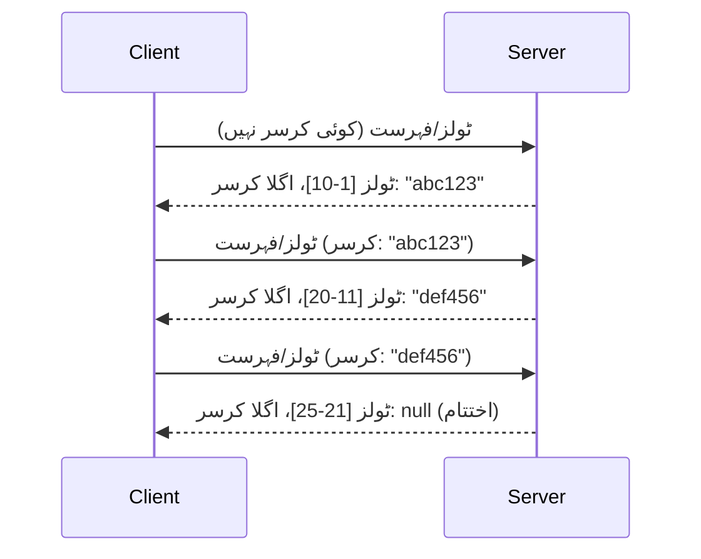

# MCP میں صف بندی اور بڑے نتائج کے مجموعے

جب آپ کا MCP سرور بڑے ڈیٹا سیٹس کو ہینڈل کرتا ہے - چاہے ہزاروں فائلوں کی فہرست ہو، ڈیٹا بیس ریکارڈز ہوں، یا تلاش کے نتائج - تو آپ کو میموری کو مؤثر طریقے سے منظم کرنے اور صارف کے تجربات کو تیز بنانے کے لیے صف بندی کی ضرورت ہوتی ہے۔ یہ رہنما MCP میں صف بندی کو نافذ کرنے اور استعمال کرنے کا طریقہ کار بیان کرتا ہے۔

## صف بندی کیوں اہم ہے

بغیر صف بندی کے، بڑے جوابات مندرجہ ذیل مسائل کا سبب بن سکتے ہیں:

- **میموری ختم ہونا** - ایک بار میں لاکھوں ریکارڈز لوڈ کرنا
- **ردعمل کا سست ہونا** - تمام ڈیٹا لوڈ ہونے تک صارفین کو انتظار کرنا پڑتا ہے
- **ٹائم آؤٹ کی غلطیاں** - درخواستیں وقت کی حد پار کرجاتی ہیں
- **خراب AI کارکردگی** - بڑے سیاق و سباق کے ساتھ LLMs کو دشواری ہوتی ہے

MCP نتائج کے مجموعوں میں قابل اعتماد، مستقل صف بندی کے لیے **کرسر پر مبنی صف بندی** استعمال کرتا ہے۔

---

## MCP میں صف بندی کیسے کام کرتی ہے

### کرسر کا تصور

ایک **کرسر** ایک مبہم سٹرنگ ہے جو نتائج کے مجموعے میں آپ کے مقام کو نشان زد کرتی ہے۔ اسے ایک لمبی کتاب میں بوک مارک سمجھیں۔



### MCP کے طریقوں میں صف بندی

یہ MCP کے طریقے صف بندی کی حمایت کرتے ہیں:

| طریقہ | واپسی | کرسر کی حمایت |
|--------|---------|----------------|
| `tools/list` | ٹول کی تفصیلات | ✅ |
| `resources/list` | وسائل کی تفصیلات | ✅ |
| `prompts/list` | پرامپٹ کی تفصیلات | ✅ |
| `resources/templates/list` | وسائل کے ٹیمپلیٹس | ✅ |

---

## سرور کی نفاذ

### پائتھون (FastMCP)

```python
from mcp.server import Server
from mcp.types import Tool, ListToolsResult
import math

app = Server("paginated-server")

# تقلیبی بڑا ڈیٹا سیٹ
ALL_TOOLS = [
    Tool(name=f"tool_{i}", description=f"Tool number {i}", inputSchema={})
    for i in range(100)
]

PAGE_SIZE = 10

@app.list_tools()
async def list_tools(cursor: str | None = None) -> ListToolsResult:
    """List tools with pagination support."""
    
    # شروعاتی انڈیکس حاصل کرنے کے لیے کرسر کو ڈی کوڈ کریں
    start_index = 0
    if cursor:
        try:
            start_index = int(cursor)
        except ValueError:
            start_index = 0
    
    # نتائج کا صفحہ حاصل کریں
    end_index = min(start_index + PAGE_SIZE, len(ALL_TOOLS))
    page_tools = ALL_TOOLS[start_index:end_index]
    
    # اگلے کرسر کا حساب لگائیں
    next_cursor = None
    if end_index < len(ALL_TOOLS):
        next_cursor = str(end_index)
    
    return ListToolsResult(
        tools=page_tools,
        nextCursor=next_cursor
    )
```

### ٹائپ اسکرپٹ

```typescript
import { Server } from "@modelcontextprotocol/sdk/server/index.js";
import { ListToolsResultSchema } from "@modelcontextprotocol/sdk/types.js";

const server = new Server({
  name: "paginated-server",
  version: "1.0.0"
});

// مصنوعی بڑا ڈیٹا سیٹ
const ALL_TOOLS = Array.from({ length: 100 }, (_, i) => ({
  name: `tool_${i}`,
  description: `Tool number ${i}`,
  inputSchema: { type: "object", properties: {} }
}));

const PAGE_SIZE = 10;

server.setRequestHandler(ListToolsResultSchema, async (request) => {
  // کرسر کو ڈی کوڈ کریں
  let startIndex = 0;
  if (request.params?.cursor) {
    startIndex = parseInt(request.params.cursor, 10) || 0;
  }
  
  // نتائج کا صفحہ حاصل کریں
  const endIndex = Math.min(startIndex + PAGE_SIZE, ALL_TOOLS.length);
  const pageTools = ALL_TOOLS.slice(startIndex, endIndex);
  
  // اگلے کرسر کا حساب لگائیں
  const nextCursor = endIndex < ALL_TOOLS.length ? String(endIndex) : undefined;
  
  return {
    tools: pageTools,
    nextCursor
  };
});
```

### جاوا (Spring MCP)

```java
@Service
public class PaginatedToolService {
    
    private static final int PAGE_SIZE = 10;
    private final List<Tool> allTools;
    
    public PaginatedToolService() {
        // بڑے ڈیٹا سیٹ کو شروع کریں
        this.allTools = IntStream.range(0, 100)
            .mapToObj(i -> new Tool("tool_" + i, "Tool number " + i, Map.of()))
            .collect(Collectors.toList());
    }
    
    @McpMethod("tools/list")
    public ListToolsResult listTools(@Param("cursor") String cursor) {
        // کرسر کو ڈی کوڈ کریں
        int startIndex = 0;
        if (cursor != null && !cursor.isEmpty()) {
            try {
                startIndex = Integer.parseInt(cursor);
            } catch (NumberFormatException e) {
                startIndex = 0;
            }
        }
        
        // نتائج کا صفحہ حاصل کریں
        int endIndex = Math.min(startIndex + PAGE_SIZE, allTools.size());
        List<Tool> pageTools = allTools.subList(startIndex, endIndex);
        
        // اگلے کرسر کا حساب لگائیں
        String nextCursor = endIndex < allTools.size() ? String.valueOf(endIndex) : null;
        
        return new ListToolsResult(pageTools, nextCursor);
    }
}
```

---

## کلائنٹ کی نفاذ

### پائتھون کلائنٹ

```python
from mcp import ClientSession

async def get_all_tools(session: ClientSession) -> list:
    """Fetch all tools using pagination."""
    all_tools = []
    cursor = None
    
    while True:
        result = await session.list_tools(cursor=cursor)
        all_tools.extend(result.tools)
        
        if result.nextCursor is None:
            break
        cursor = result.nextCursor
    
    return all_tools

# استعمال
async with client_session as session:
    tools = await get_all_tools(session)
    print(f"Found {len(tools)} tools")
```

### ٹائپ اسکرپٹ کلائنٹ

```typescript
import { Client } from "@modelcontextprotocol/sdk/client/index.js";

async function getAllTools(client: Client): Promise<Tool[]> {
  const allTools: Tool[] = [];
  let cursor: string | undefined = undefined;
  
  do {
    const result = await client.listTools({ cursor });
    allTools.push(...result.tools);
    cursor = result.nextCursor;
  } while (cursor);
  
  return allTools;
}

// استعمال
const tools = await getAllTools(client);
console.log(`Found ${tools.length} tools`);
```

### سُست لوڈنگ کا نمونہ

بہت بڑے ڈیٹا سیٹس کے لیے، صفحات کو ضرورت کے مطابق لوڈ کریں:

```python
class PaginatedToolIterator:
    """Lazily iterate through paginated tools."""
    
    def __init__(self, session: ClientSession):
        self.session = session
        self.cursor = None
        self.buffer = []
        self.exhausted = False
    
    async def __anext__(self):
        # اگر دستیاب ہو تو بفر سے واپس کریں
        if self.buffer:
            return self.buffer.pop(0)
        
        # چیک کریں کہ آیا ہم نے تمام صفحات ختم کر دیے ہیں
        if self.exhausted:
            raise StopAsyncIteration
        
        # اگلا صفحہ حاصل کریں
        result = await self.session.list_tools(cursor=self.cursor)
        self.buffer = list(result.tools)
        self.cursor = result.nextCursor
        
        if self.cursor is None:
            self.exhausted = True
        
        if not self.buffer:
            raise StopAsyncIteration
        
        return self.buffer.pop(0)
    
    def __aiter__(self):
        return self

# استعمال - بڑے ڈیٹا سیٹ کے لیے میموری موثر
async for tool in PaginatedToolIterator(session):
    process_tool(tool)
```

---

## وسائل کے لیے صف بندی

وسائل کو عموماً ڈائریکٹریز یا بڑے ڈیٹا سیٹس کے لیے صف بندی کی ضرورت ہوتی ہے:

```python
from mcp.server import Server
from mcp.types import Resource, ListResourcesResult
import os

app = Server("file-server")

@app.list_resources()
async def list_resources(cursor: str | None = None) -> ListResourcesResult:
    """List files in directory with pagination."""
    
    directory = "/data/files"
    all_files = sorted(os.listdir(directory))
    
    # کرسر کو ڈی کوڈ کریں (فائل کا انڈیکس)
    start_index = int(cursor) if cursor else 0
    page_size = 20
    end_index = min(start_index + page_size, len(all_files))
    
    # اس صفحے کے لیے وسائل کی فہرست بنائیں
    resources = []
    for filename in all_files[start_index:end_index]:
        filepath = os.path.join(directory, filename)
        resources.append(Resource(
            uri=f"file://{filepath}",
            name=filename,
            mimeType="application/octet-stream"
        ))
    
    # اگلے کرسر کا حساب لگائیں
    next_cursor = str(end_index) if end_index < len(all_files) else None
    
    return ListResourcesResult(
        resources=resources,
        nextCursor=next_cursor
    )
```

---

## کرسر ڈیزائن کی حکمت عملیاں

### حکمت عملی 1: انڈیکس پر مبنی (سادہ)

```python
# کرسر محض اشاریہ ہے
cursor = "50"  # آئٹم ۵۰ سے شروع کریں
```

**فوائد:** سادہ، بغیر حالت کے
**نقصانات:** اگر آئٹمز شامل یا حذف ہوں تو نتائج تبدیل ہو سکتے ہیں

### حکمت عملی 2: ID پر مبنی (مستحکم)

```python
# کرسر آخری دیکھی گئی شناخت ہے
cursor = "item_abc123"  # اس آئٹم کے بعد شروع کریں
```

**فوائد:** چاہے آئٹمز بدلیں تو بھی مستحکم
**نقصانات:** ترتیب شدہ IDs کی ضرورت ہوتی ہے

### حکمت عملی 3: اینکوڈڈ حالت (پیچیدہ)

```python
import base64
import json

def encode_cursor(state: dict) -> str:
    return base64.b64encode(json.dumps(state).encode()).decode()

def decode_cursor(cursor: str) -> dict:
    return json.loads(base64.b64decode(cursor).decode())

# کرسر میں متعدد حالت کے میدان شامل ہیں
cursor = encode_cursor({
    "offset": 50,
    "filter": "active",
    "sort": "name"
})
```

**فوائد:** پیچیدہ حالت کو اینکوڈ کر سکتا ہے
**نقصانات:** زیادہ پیچیدہ، کرسر سٹرنگز بڑے ہوتے ہیں

---

## بہترین طریقے

### 1. مناسب صفحہ کے سائز منتخب کریں

```python
# ڈیٹا کا حجم غور کریں
PAGE_SIZE_SMALL_ITEMS = 100   # سادہ میٹا ڈیٹا
PAGE_SIZE_MEDIUM_ITEMS = 20   # زیادہ جامع اشیاء
PAGE_SIZE_LARGE_ITEMS = 5     # پیچیدہ مواد
```

### 2. غلط کرسرز کو نرم دلی سے سنبھالیں

```python
@app.list_tools()
async def list_tools(cursor: str | None = None) -> ListToolsResult:
    try:
        start_index = int(cursor) if cursor else 0
        if start_index < 0 or start_index >= len(ALL_TOOLS):
            start_index = 0  # ابتدا پر ری سیٹ کریں
    except (ValueError, TypeError):
        start_index = 0  # ناقابل استعمال کرسر، تازہ آغاز کریں
    # ...
```

### 3. کل تعداد شامل کریں (اختیاری)

```python
return ListToolsResult(
    tools=page_tools,
    nextCursor=next_cursor,
    # کچھ نفاذ UI پیش رفت کے لیے کل شامل کرتے ہیں
    _meta={"total": len(ALL_TOOLS)}
)
```

### 4. ایج کیسز کی جانچ کریں

```python
async def test_pagination():
    # خالی نتیجہ سیٹ
    result = await session.list_tools()
    assert result.tools == []
    assert result.nextCursor is None
    
    # ایک صفحہ
    result = await session.list_tools()
    assert len(result.tools) <= PAGE_SIZE
    
    # غیر معتبر کرسر
    result = await session.list_tools(cursor="invalid")
    assert result.tools  # پہلے صفحہ واپس کرنا چاہیے
```

---

## عام غلطیاں

### ❌ تمام نتائج واپس کرنا پھر کلائنٹ سائڈ پر صف بندی کرنا

```python
# خراب: سب کچھ میموری میں لوڈ کرتا ہے
@app.list_tools()
async def list_tools() -> ListToolsResult:
    all_tools = load_all_tools()  # ایک ملین اوزار!
    return ListToolsResult(tools=all_tools)
```

### ✅ ڈیٹا سورس پر صف بندی کریں

```python
# اچھا: صرف جو کچھ ضروری ہو لوڈ کرتا ہے
@app.list_tools()
async def list_tools(cursor: str | None = None) -> ListToolsResult:
    offset = int(cursor) if cursor else 0
    tools = await db.query_tools(offset=offset, limit=PAGE_SIZE)
    return ListToolsResult(tools=tools, nextCursor=...)
```

---

## اگلا کیا ہے

- [ماڈیول 5.14 - سیاق و سباق کی انجینئرنگ](../../05-AdvancedTopics/mcp-contextengineering/README.md)
- [ماڈیول 8 - بہترین طریقے](../../08-BestPractices/README.md)
- [3.8 - اپنے MCP سرور کی جانچ](../../03-GettingStarted/08-testing/README.md)

---

## اضافی وسائل

- [MCP وضاحت - صف بندی](https://modelcontextprotocol.io/specification/2026-07-28/)
- [کرسر پر مبنی صف بندی کی وضاحت](https://slack.engineering/evolving-api-pagination-at-slack/)
- [پائتھون SDK صف بندی کی جانچ](https://github.com/modelcontextprotocol/python-sdk/blob/main/tests/client/test_list_methods_cursor.py)

---

<!-- CO-OP TRANSLATOR DISCLAIMER START -->
**ڈس کلیمر**:
یہ دستاویز AI ترجمہ سروس [Co-op Translator](https://github.com/Azure/co-op-translator) کے ذریعے ترجمہ کی گئی ہے۔ جبکہ ہم درستگی کے لیے کوشاں ہیں، براہ کرم اس بات سے آگاہ رہیں کہ خودکار ترجمے میں غلطیاں یا عدم درستیاں ہو سکتی ہیں۔ اصل دستاویز اپنے مادری زبان میں مستند ماخذ سمجھی جائے گی۔ حساس معلومات کے لیے پیشہ ور انسانی ترجمہ کی سفارش کی جاتی ہے۔ اس ترجمے کے استعمال سے پیدا ہونے والی کسی بھی غلط فہمی یا غلط تشریح کی ذمہ داری ہم قبول نہیں کرتے۔
<!-- CO-OP TRANSLATOR DISCLAIMER END -->