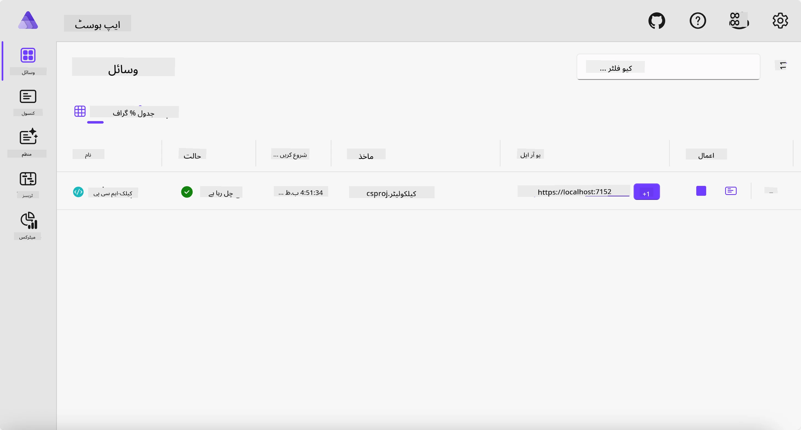
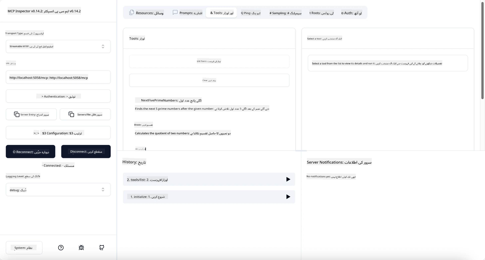
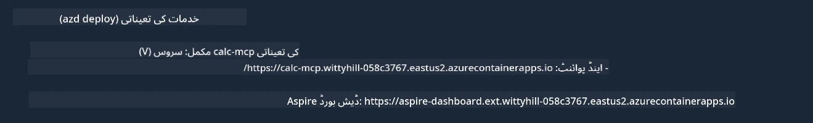

# نمونہ

پچھلا مثال دکھاتا ہے کہ لوکل .NET پروجیکٹ کو `stdio` قسم کے ساتھ کیسے استعمال کیا جائے۔ اور کیسے سرور کو کنٹینر میں مقامی طور پر چلایا جائے۔ یہ کئی حالات میں ایک اچھا حل ہے۔ تاہم، سرور کو ریموٹلی چلانا مفید ہو سکتا ہے، جیسے کہ کلاؤڈ ماحول میں۔ یہاں `http` قسم کا استعمال آتا ہے۔

`04-PracticalImplementation` فولڈر میں حل کو دیکھنے پر، یہ پچھلے سے کہیں زیادہ پیچیدہ لگ سکتا ہے۔ لیکن حقیقت میں ایسا نہیں ہے۔ اگر آپ پروجیکٹ `src/Calculator` کو قریب سے دیکھیں تو آپ دیکھیں گے کہ یہ زیادہ تر پچھلے مثال کا ہی کوڈ ہے۔ واحد فرق یہ ہے کہ ہم HTTP درخواستوں کو سنبھالنے کے لیے ایک مختلف لائبریری `ModelContextProtocol.AspNetCore` استعمال کر رہے ہیں۔ اور ہم نے طریقہ `IsPrime` کو پرائیویٹ بنا دیا ہے تاکہ دکھایا جا سکے کہ آپ اپنے کوڈ میں پرائیویٹ طریقے رکھ سکتے ہیں۔ باقی کوڈ پہلے جیسا ہی ہے۔

باقی پروجیکٹس [Aspire](https://aspire.dev/get-started/what-is-aspire/) سے ہیں۔ صورت حال میں Aspire کا ہونا ڈویلپر کے تجربے کو بہتر بنائے گا جبکہ وہ ترقی اور جانچ کر رہا ہو اور مشاہدے میں بھی مدد کرے گا۔ سرور چلانے کے لیے ضروری نہیں، لیکن اسے اپنے حل میں رکھنا ایک اچھی عادت ہے۔

## سرور کو مقامی طور پر شروع کریں

1. VS Code (C# DevKit ایکسٹینشن کے ساتھ) میں `04-PracticalImplementation/samples/csharp` ڈائریکٹری پر جائیں۔
1. سرور شروع کرنے کے لیے درج ذیل کمانڈ چلائیں:

   ```bash
    dotnet watch run --project ./src/AppHost
   ```

1. جب ویب براؤزر Aspire ڈیش بورڈ کھولے، نوٹ کریں `http` URL کو۔ یہ کچھ اس طرح ہونا چاہیے `http://localhost:5058/`.

   

## MCP انسپکٹر کے ساتھ Streamable HTTP کا ٹیسٹ کریں

اگر آپ کے پاس Node.js 22.7.5 اور اس سے اوپر ہے، تو آپ MCP انسپکٹر استعمال کر کے اپنے سرور کا ٹیسٹ کر سکتے ہیں۔

سرور شروع کریں اور ٹرمینل میں درج ذیل کمانڈ چلائیں:

```bash
npx @modelcontextprotocol/inspector http://localhost:5058
```



- نقل و حمل کی قسم کے طور پر `Streamable HTTP` منتخب کریں۔
- URL فیلڈ میں پہلے نوٹ کردہ سرور کا URL درج کریں، اور `/mcp` شامل کریں۔ یہ `http` (نه کہ `https`) ہونا چاہیے، کچھ اس طرح `http://localhost:5058/mcp`۔
- کنیکٹ بٹن منتخب کریں۔

انسپکٹر کی ایک اچھی بات یہ ہے کہ یہ جو ہو رہا ہے اس پر اچھی نظر فراہم کرتا ہے۔

- دستیاب آلات کی فہرست بنانے کی کوشش کریں
- ان میں سے کچھ آزما کر دیکھیں، یہ پہلے کی طرح کام کرنا چاہیے۔

## VS Code میں GitHub Copilot Chat کے ساتھ MCP سرور کا ٹیسٹ کریں

Streamable HTTP ٹرانسپورٹ کو GitHub Copilot Chat کے ساتھ استعمال کرنے کے لیے، پہلے بنائے گئے `calc-mcp` سرور کی ترتیب اس طرح تبدیل کریں:

```jsonc
// .vscode/mcp.json
{
  "servers": {
    "calc-mcp": {
      "type": "http",
      "url": "http://localhost:5058/mcp"
    }
  }
}
```

کچھ ٹیسٹ کریں:

- پوچھیں "3 prime numbers after 6780". نوٹ کریں کہ Copilot نئے آلات `NextFivePrimeNumbers` استعمال کرے گا اور صرف پہلے 3 prime numbers واپس کرے گا۔
- پوچھیں "7 prime numbers after 111"، یہ دیکھنے کے لیے کہ کیا ہوتا ہے۔
- پوچھیں "John has 24 lollies and wants to distribute them all to his 3 kids. How many lollies does each kid have?", یہ دیکھنے کے لیے کہ کیا ہوتا ہے۔

## سرور کو Azure پر تعینات کریں

آئیے سرور کو Azure پر تعینات کرتے ہیں تاکہ زیادہ لوگ اسے استعمال کر سکیں۔

ایک ٹرمینل سے، `04-PracticalImplementation/samples/csharp` فولڈر میں جائیں اور درج ذیل کمانڈ چلائیں:

```bash
azd up
```

تعیناتی کے مکمل ہونے پر، آپ کو اس طرح کا پیغام نظر آنا چاہیے:



URL حاصل کریں اور اسے MCP انسپکٹر اور GitHub Copilot Chat میں استعمال کریں۔

```jsonc
// .vscode/mcp.json
{
  "servers": {
    "calc-mcp": {
      "type": "http",
      "url": "https://calc-mcp.gentleriver-3977fbcf.australiaeast.azurecontainerapps.io/mcp"
    }
  }
}
```

## آگے کیا ہے؟

ہم مختلف ٹرانسپورٹ اقسام اور جانچ کے آلات آزمانے کی کوشش کرتے ہیں۔ ہم آپ کے MCP سرور کو Azure پر بھی تعینات کرتے ہیں۔ لیکن اگر ہمارے سرور کو نجی وسائل تک رسائی کی ضرورت ہو تو کیا ہوگا؟ مثال کے طور پر، ایک ڈیٹا بیس یا نجی API؟ اگلے باب میں، ہم دیکھیں گے کہ ہم اپنے سرور کی سیکیورٹی کو کیسے بہتر بنا سکتے ہیں۔

---

<!-- CO-OP TRANSLATOR DISCLAIMER START -->
**ڈس کلیمر**:
یہ دستاویز AI ترجمہ سروس [Co-op Translator](https://github.com/Azure/co-op-translator) کے ذریعے ترجمہ کی گئی ہے۔ جبکہ ہم درستگی کے لیے کوشاں ہیں، براہ کرم اس بات سے آگاہ رہیں کہ خودکار ترجمے میں غلطیاں یا عدم درستیاں ہو سکتی ہیں۔ اصل دستاویز اپنے مادری زبان میں مستند ماخذ سمجھی جائے گی۔ حساس معلومات کے لیے پیشہ ور انسانی ترجمہ کی سفارش کی جاتی ہے۔ اس ترجمے کے استعمال سے پیدا ہونے والی کسی بھی غلط فہمی یا غلط تشریح کی ذمہ داری ہم قبول نہیں کرتے۔
<!-- CO-OP TRANSLATOR DISCLAIMER END -->