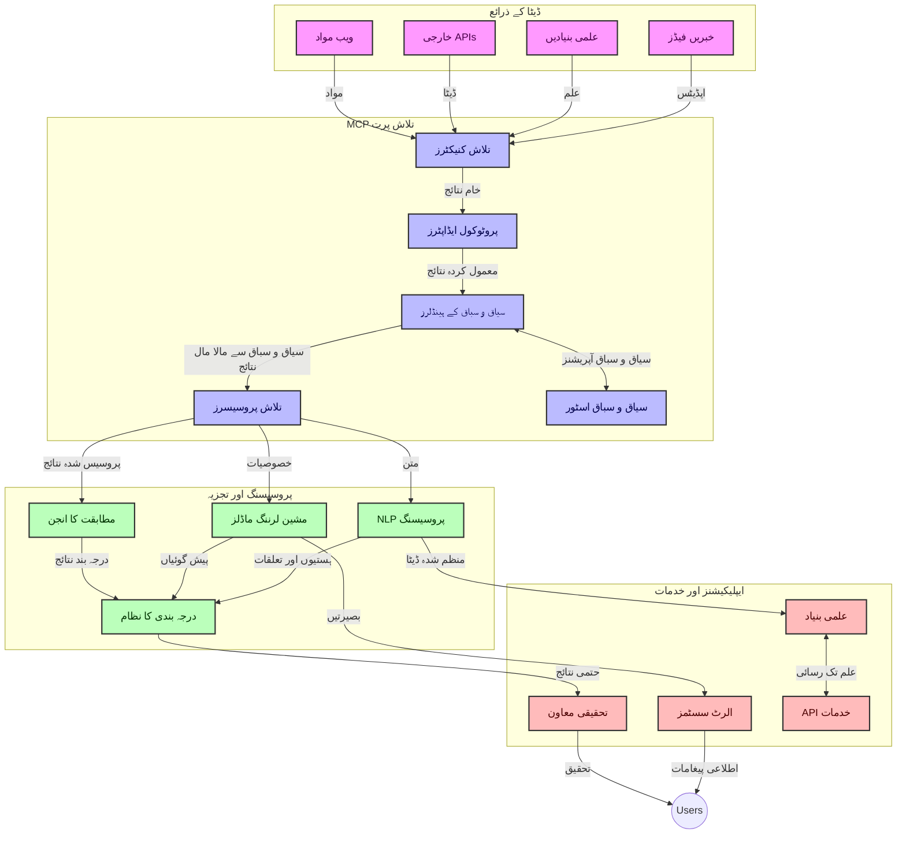
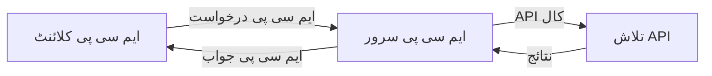
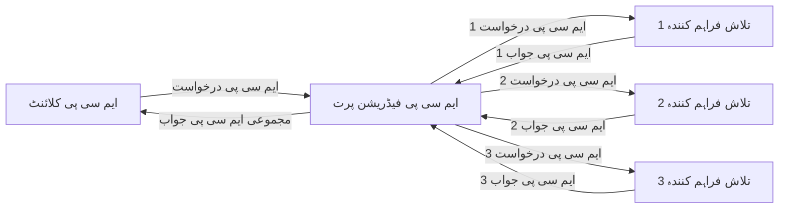
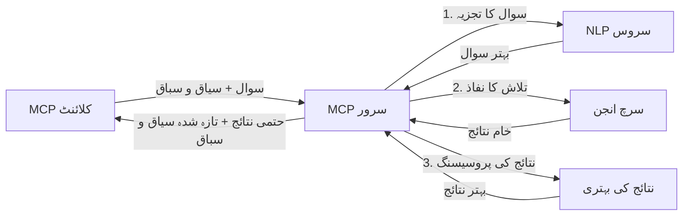

# حقیقی وقت ویب تلاش کے لیے ماڈل کانٹیکسٹ پروٹوکول  

## جائزہ  

حقیقی وقت کی ویب تلاش آج کے معلوماتی ماحول میں ضروری بن چکی ہے، جہاں ایپلیکیشنز کو انٹرنیٹ پر تازہ ترین معلومات تک فوری رسائی کی ضرورت ہوتی ہے تاکہ متعلقہ اور بروقت جوابات فراہم کیے جا سکیں۔ ماڈل کانٹیکسٹ پروٹوکول (MCP) ان حقیقی وقت کی تلاش کے عمل کو بہتر بنانے میں ایک اہم پیش رفت کی نمائندگی کرتا ہے، تلاش کی کارکردگی کو بڑھاتا ہے، کانٹیکسٹ کی سالمیت کو برقرار رکھتا ہے، اور مجموعی نظام کی کارکردگی کو بہتر بناتا ہے۔  

یہ ماڈیول اس بات کا جائزہ لیتا ہے کہ MCP کس طرح حقیقی وقت کی ویب تلاش کو AI ماڈلز، سرچ انجنز، اور ایپلیکیشنز کے درمیان کانٹیکسٹ مینجمنٹ کے لئے ایک معیاری طریقہ فراہم کرکے تبدیل کرتا ہے۔  

### آپ کیا سیکھیں گے  

اس جامع رہنما میں، آپ دریافت کریں گے:  

- MCP کس طرح AI ماڈلز اور حقیقی وقت کی ویب تلاش کی صلاحیتوں کے درمیان ایک بے جوڑ پل تخلیق کرتا ہے  
- MCP کے ساتھ موثر اور توسیعی تلاش حل نافذ کرنے کے لیے معماری نمونے  
- متعدد سوالات اور تعاملات کے دوران تلاش کے کانٹیکسٹ کو برقرار رکھنے کی تکنیک  
- مختلف تلاش کے منظرناموں کے لیے Python اور JavaScript میں عملی کوڈ امپلیمینٹیشنز  
- MCP سے چلنے والے تلاش نظاموں میں مطابقت، تازگی، اور کارکردگی کو متوازن کرنے کے طریقے  

## حقیقی وقت کی ویب تلاش کا تعارف  

حقیقی وقت کی ویب تلاش ایک تکنیکی طریقہ ہے جو ویب پر مبنی معلومات کی مسلسل پوچھ گچھ، پروسیسنگ، اور تجزیہ کو ممکن بناتا ہے جیسا کہ یہ شائع یا اپ ڈیٹ ہوتی ہے، جس سے نظام تازہ اور متعلقہ معلومات کم سے کم تاخیر کے ساتھ فراہم کر سکتے ہیں۔ روایتی تلاش کے نظاموں کے برعکس جو انڈیکس شدہ ڈیٹا پر کام کرتے ہیں جو کئی گھنٹے یا دن پرانا ہو سکتا ہے، حقیقی وقت کی تلاش ویب سے جیتے جاگتے ڈیٹا کو استعمال کرتی ہے، ایسی بصیرتیں اور معلومات فراہم کرتی ہے جو آن لائن مواد کی موجودہ حالت کی عکاسی کرتی ہیں۔  

### حقیقی وقت کی ویب تلاش کے بنیادی تصورات:  

- **مسلسل سوالات کی پروسیسنگ**: تلاش کے سوالات مسلسل اپ ڈیٹ ہونے والے ڈیٹا ذرائع کے خلاف پروسیس کیے جاتے ہیں  
- **تازگی کو ترجیح دینا**: نظام تازہ ترین معلومات کو ترجیح دینے کے لیے ڈیزائن کیے گئے ہیں  
- **مطابقت کا توازن**: مطابقت اور تازگی کے درمیان توازن برقرار رکھنا  
- **توسیع پذیر معماری**: نظام کو مختلف سوالات کے بوجھ اور ڈیٹا والیوم کو سنبھالنا چاہیے  
- **سیاق و سباق کی سمجھ بوجھ**: تلاش کے ادوار کے دوران صارف کا کانٹیکسٹ برقرار رکھنا معنی خیز نتائج کے لیے ضروری ہے  
- **متحرک سوالات کی ازسر نو تشکیل**: سیاق و سباق اور پچھلے نتائج کی بنیاد پر سوالات کو خود مختار طریقے سے ایڈجسٹ کرنا  
- **متعدد ذرائع کا انضمام**: متعدد تلاش فراہم کنندگان اور ویب ذرائع کے نتائج کو یکجا کرنا  
- **معنوی سمجھ بوجھ**: صرف کلیدی الفاظ پر نہیں بلکہ معنی کی بنیاد پر سوالات اور مواد کی پروسیسنگ  
- **حقیقی وقت کی درجہ بندی**: نئی معلومات دستیاب ہوتے ہی نتائج کی درجہ بندی کو مسلسل ایڈجسٹ کرنا  

### ماڈل کانٹیکسٹ پروٹوکول اور حقیقی وقت کی ویب تلاش  

ماڈل کانٹیکسٹ پروٹوکول (MCP) حقیقی وقت کی ویب تلاش کے ماحول میں کئی اہم چیلنجز کو حل کرتا ہے:  

1. **تلاش کے کانٹیکسٹ کی حفاظت**: MCP اس بات کو معیاری بناتا ہے کہ تلاش کے منتشر اجزاء کے درمیان کانٹیکسٹ کیسے برقرار رکھا جائے، یہ یقینی بناتے ہوئے کہ AI ماڈلز اور پروسیسنگ نوڈز متعلقہ سوالات کی تاریخ اور صارف کی ترجیحات تک رسائی رکھتے ہیں۔  

2. **موثر سوالات کا انتظام**: کانٹیکسٹ کی ترسیل کے لیے منظم طریقے فراہم کرکے، MCP ہر تلاش کے دور میں کانٹیکسٹ کو دہرائے جانے کے اوور ہیڈ کو کم کرتا ہے۔  

3. **تعاملی صلاحیت**: MCP مختلف تلاش کی ٹیکنالوجیوں اور AI ماڈلز کے درمیان کانٹیکسٹ شئیر کرنے کی ایک مشترکہ زبان تخلیق کرتا ہے، جو مزید لچکدار اور توسیعی معماری کو ممکن بناتا ہے۔  

4. **تلاش کے لیے بہتر کانٹیکسٹ**: MCP کی عمل آوری یہ ترجیح دے سکتی ہے کہ کون سے کانٹیکسٹ عناصر مؤثر تلاش کے لیے سب سے زیادہ متعلقہ ہیں، کارکردگی اور درستگی دونوں کے لیے بہتر بنانا۔  

5. **موافق تلاش کی پروسیسنگ**: MCP کے ذریعے مناسب کانٹیکسٹ مینجمنٹ کے ساتھ، تلاش کے نظام صارف کی بدلتی ہوئی ضروریات اور معلوماتی منظرناموں کی بنیاد پر پروسیسنگ کو متحرک طور پر ایڈجسٹ کر سکتے ہیں۔  

جدید ایپلیکیشنز میں، خبر کے مجموعہ سے لے کر تحقیقی معاونین تک، MCP کا ویب تلاش کی ٹیکنالوجیوں کے ساتھ انضمام مزید ذہین، کانٹیکسٹ سے واقف تلاش کو ممکن بناتا ہے جو صارف کے تعاملات جاری رہنے کے ساتھ زیادہ متعلقہ نتائج فراہم کر سکتی ہے۔  

## سیکھنے کے مقاصد  

اس سبق کے آخر تک، آپ قابل ہوں گے:  

- حقیقی وقت کی ویب تلاش کے اصول اور جدید ایپلیکیشنز میں اس کے چیلنجز کو سمجھیں  
- وضاحت کریں کہ ماڈل کانٹیکسٹ پروٹوکول (MCP) حقیقی وقت کی ویب تلاش کی صلاحیتوں کو کس طرح بڑھاتا ہے  
- MCP پر مبنی تلاش حل کو مقبول فریم ورکس اور APIs کے ذریعے نافذ کریں  
- MCP کے ساتھ قابل توسیع، اعلی کارکردگی تلاش کی معماریوں کا ڈیزائن اور تعینات کریں  
- MCP کے تصورات کو مختلف استعمال کے معاملات میں لاگو کریں جن میں معنوی تلاش، تحقیقی معاونت، اور AI سے مزین براؤزنگ شامل ہیں  
- MCP پر مبنی تلاش کی ٹیکنالوجیز میں ابھرتے ہوئے رجحانات اور مستقبل کی جدتوں کا جائزہ لیں  
- صارف کے تعاملات سے سیکھنے والے کانٹیکسٹ کے آگاہ تلاش کے نظام تیار کریں  
- معیاری MCP پروٹوکولز کا استعمال کرتے ہوئے AI معاونین میں ویب تلاش کی صلاحیتوں کو ضم کریں  
- متعدد مراحل پر مشتمل تلاش کی پائپ لائنز تیار کریں جو کانٹیکسٹ کی بنیاد پر نتائج کو بتدریج بہتر بنائیں  
- جامع کانٹیکسٹ کی آگاہی برقرار رکھتے ہوئے تلاش کی کارکردگی کو بہتر بنائیں  

### تعریف اور اہمیت  

حقیقی وقت کی ویب تلاش ویب پر مبنی معلومات کی مسلسل پوچھ گچھ، بازیافت، اور کم سے کم تاخیر کے ساتھ فراہمی شامل ہے۔ روایتی تلاش کے انجنوں کے برعکس جو وقفے وقفے سے ویب کو کرال اور انڈیکس کرتے ہیں، حقیقی وقت کی تلاش معلومات کو جیسے ہی دستیاب ہو ظہور میں لاتی ہے، جو تازہ ترین مواد تک فوری رسائی ممکن بناتی ہے۔  

حقیقی وقت کی ویب تلاش کی چند اہم خصوصیات میں شامل ہیں:  

- **تازگی**: حالیہ مواد اور اپڈیٹس کو ترجیح دینا  
- **مسلسل پروسیسنگ**: نئی معلومات کی مسلسل نگرانی  
- **سوالات کا تطابق**: سیاق و سباق اور رائے کی بنیاد پر تلاش کے سوالات کو بہتر بنانا  
- **فوری فراہمی**: انتہائی کم تاخیر کے ساتھ تلاش کے نتائج فراہم کرنا  
- **کانٹیکسٹ کا تحفظ**: بہتر مطابقت کے لیے پچھلے سوالات کی بنیاد پر تعمیر کرنا  

### روایتی ویب تلاش میں چیلنجز  

حقیقی وقت کے منظرناموں پر لاگو ہونے پر روایتی ویب تلاش کے طریقوں کو کئی حدود کا سامنا ہے:  

1. **کانٹیکسٹ کی بکھراؤ**: متعدد سوالات میں تلاش کا کانٹیکسٹ برقرار رکھنے میں دشواری  
2. **معلومات کی تازگی**: تازہ ترین معلومات تک رسائی اور اسے ترجیح دینے میں مشکلات  
3. **انضمام کی پیچیدگی**: تلاش کے نظاموں اور ایپلیکیشنز کے درمیان تعاملی صلاحیت کے مسائل  
4. **تاخیر کے مسائل**: جامع تلاش کو ردعمل کے وقت کی ضروریات کے ساتھ توازن میں رکھنا  
5. **مطابقت کی ترتیب**: تازگی کو ترجیح دیتے ہوئے درستگی اور مطابقت کو یقینی بنانا  

## تلاش کے لیے ماڈل کانٹیکسٹ پروٹوکول (MCP) کی تفہیم  

### تلاش کے کانٹیکسٹ میں MCP کیا ہے؟  

ماڈل کانٹیکسٹ پروٹوکول (MCP) ایک معیاری مواصلاتی پروٹوکول ہے جو AI ماڈلز اور ایپلیکیشنز کے درمیان مؤثر تعامل کو آسان بناتا ہے۔ حقیقی وقت کی ویب تلاش کے سیاق و سباق میں، MCP ایک ایسا فریم ورک فراہم کرتا ہے:  

- تلاش کے سلسلہ وار سوالات کے دوران کانٹیکسٹ کو محفوظ رکھنا  
- تلاش کے سوالات اور نتائج کے فارمیٹس کو معیاری بنانا  
- تلاش کے پیرامیٹرز اور نتائج کی ترسیل کو بہتر بنانا  
- ماڈل سے سرچ انجن کے درمیان رابطہ کاری کو بڑھانا  

### بنیادی اجزاء اور معماری  

حقیقی وقت کی ویب تلاش کے لیے MCP کی معماری میں کئی کلیدی اجزاء شامل ہوتے ہیں:  

1. **سوالات کے کانٹیکسٹ ہینڈلرز**: متعدد سوالات میں تلاش کے کانٹیکسٹ کا انتظام اور نگہداشت کرتے ہیں  
2. **تلاش پروسیسرز**: کانٹیکسٹ سینسٹو تکنیک استعمال کرتے ہوئے آنے والی تلاش کی درخواستوں کو پروسیس کرتے ہیں  
3. **پروٹوکول ایڈیپٹرز**: مختلف تلاش APIs کے مابین کانٹیکسٹ کو برقرار رکھتے ہوئے تبدیلی کرتے ہیں  
4. **کانٹیکسٹ اسٹور**: تلاش کی تاریخ اور ترجیحات کو مؤثر طریقے سے ذخیرہ اور بازیافت کرتے ہیں  
5. **تلاش کنیکٹرز**: مختلف تلاش انجنز اور ویب APIs سے کنیکٹ کرتے ہیں  



### MCP حقیقی وقت کی ویب تلاش کو کیسے بہتر بناتا ہے  

MCP روایتی ویب تلاش کے چیلنجز کو درج ذیل طریقوں سے حل کرتا ہے:  

- **سیاق و سباق کی تسلسل**: پوری تلاش کے سیشن میں سوالات کے درمیان تعلقات کو برقرار رکھنا  
- **ترسیل کی بہتری**: ذہین کانٹیکسٹ مینجمنٹ کے ذریعے تلاش کے پیرامیٹرز میں تکرار کو کم کرنا  
- **معیاری انٹرفیسز**: تلاش کے اجزاء کے لیے مستقل APIs فراہم کرنا  
- **کم شدہ تاخیر**: مؤثر کانٹیکسٹ ہینڈلنگ کے ذریعے پروسیسنگ اوور ہیڈ کو کم کرنا  
- **بہتری ہوئی مطابقت**: متعدد سوالات میں صارف کی نیت کو محفوظ رکھ کر تلاش کی مطابقت کو بہتر بنانا  


## انضمام اور نفاذ

حقیقی وقت کی ویب سرچ نظاموں کے لیے کارکردگی اور سیاق و سباق کی سالمیت دونوں کو برقرار رکھنے کے لیے محتاط معماری ڈیزائن اور نفاذ ضروری ہیں۔ ماڈل کانٹیکسٹ پروٹوکول ایک معیاری طریقہ فراہم کرتا ہے جو AI ماڈلز اور سرچ ٹیکنالوجیز کو مربوط کرتا ہے، تاکہ مزید پیچیدہ، سیاق و سباق حساس تلاش کے پائپ لائنز ممکن ہو سکیں۔

### تلاش کے معماری ڈھانچوں میں MCP کا جائزہ

حقیقی وقت کی ویب سرچ ماحول میں MCP کو نافذ کرنے کے دوران کئی اہم خیالات شامل ہوتے ہیں:

1. **تلاش کے سیاق و سباق کی سیریلائزیشن**: MCP تلاش کی درخواستوں میں سیاق و سباق کی معلومات کو کوڈ کرنے کے لیے مؤثر طریقے فراہم کرتا ہے، تاکہ ضروری سیاق تلاش کے پورے عمل کے دوران سوال کے ساتھ چلے۔ اس میں تلاش سے متعلق میٹا ڈیٹا کے لیے معیاری سیریلائزیشن فارمیٹس شامل ہیں۔

2. **ریاستی تلاش کی پروسیسنگ**: MCP زیادہ ذہین ریاستی پروسیسنگ کو ممکن بناتا ہے تاکہ تلاش کے مراحل میں مستقل سیاق کی نمائندگی برقرار رہے۔ یہ خاص طور پر کثیر مرحلہ تلاش پائپ لائنز میں قیمتی ہے جہاں سیاق و سباق کی بہتری نتائج کو بہتر بناتی ہے۔

3. **سوال کی توسیع اور اصلاح**: تلاش کی نظاموں میں MCP کی نفاذ جمع شدہ سیاق کی بنیاد پر پیچیدہ سوال کی توسیع اور اصلاح کی سہولت فراہم کر سکتا ہے، جو تلاش کے سیشن کے دوران زیادہ متعلقہ نتائج کی اجازت دیتا ہے۔

4. **نتائج کی کیشنگ اور ترجیح**: سیاق و سباق کے ہینڈلنگ کو معیاری بنا کر، MCP نتائج کی کیشنگ اور ترجیح کو سنبھالنے میں مدد دیتا ہے، جس سے اجزاء کو بدلتے ہوئے تلاش کے سیاق کے مطابق ڈھالنے کی اجازت ملتی ہے۔

5. **تلاش کا فیڈریشن اور اجتماع**: MCP تلاش کے سیاق کی ساختہ نمائندگیاں فراہم کر کے متعدد بیک اینڈز پر زیادہ اعلیٰ درجے کی تلاش کے فیڈریشن کو آسان بناتا ہے، جس سے مختلف ذرائع سے نتائج کا زیادہ بامعنی اجتماع ممکن ہوتا ہے۔

مختلف تلاش کی ٹیکنالوجیز میں MCP کے نفاذ سے سیاق و سباق کے انتظام کے لیے ایک متحدہ طریقہ کار پیدا ہوتا ہے، جو حسب ضرورت انضمام کوڈ کی ضرورت کو کم کرتا ہے اور تلاش کے سوالات کے ارتقاء کے دوران نظام کی معنادار سیاق کو برقرار رکھنے کی صلاحیت کو بڑھاتا ہے۔

### مختلف ویب تلاش کی نفاذ میں MCP

یہ مثالیں موجودہ MCP وضاحت کی پیروی کرتی ہیں جو JSON-RPC پر مبنی پروٹوکول اور مختلف ٹرانسپورٹ میکانزمز پر مرکوز ہے۔ کوڈ دکھاتا ہے کہ آپ کس طرح حسب ضرورت تلاش انضمامات کو انجام دے سکتے ہیں جبکہ MCP پروٹوکول کے ساتھ مکمل مطابقت برقرار رکھتے ہیں۔


<details>
<summary>جنرل سرچ API کے ساتھ Python نفاذ</summary>

```python
import asyncio
import json
import aiohttp
from typing import Dict, Any, Optional, List
from contextlib import asynccontextmanager
from collections.abc import AsyncIterator

# معیاری MCP لائبریریاں درآمد کریں
from mcp.client.session import ClientSession
from mcp.client.streamable_http import streamablehttp_client
from mcp.types import TextContent, CreateMessageRequestParams, CreateMessageResult
from mcp.server.fastmcp import FastMCP

# ویب سرچ کے لیے FastMCP سرور بنائیں
search_server = FastMCP("WebSearch")

# ویب سرچ آپریشنز کو سنبھالنے کے لیے کلاس
class WebSearchHandler:
    def __init__(self, api_endpoint: str, api_key: str):
        self.api_endpoint = api_endpoint
        self.api_key = api_key
        self.session = None
        
    async def initialize(self):
        """Initialize the HTTP session"""
        self.session = aiohttp.ClientSession(
            headers={"Authorization": f"Bearer {self.api_key}"}
        )
    
    async def close(self):
        """Close the HTTP session"""
        if self.session:
            await self.session.close()
            
    async def perform_search(self, query: str, max_results: int = 5, 
                           include_domains: List[str] = None, 
                           exclude_domains: List[str] = None,
                           time_period: str = "any") -> Dict[str, Any]:
        """Perform web search using the search API"""
        # تلاش کے پیرامیٹرز تیار کریں
        search_params = {
            "q": query,
            "limit": max_results,
            "time": time_period
        }
        
        if include_domains:
            search_params["site"] = ",".join(include_domains)
            
        if exclude_domains:
            search_params["exclude_site"] = ",".join(exclude_domains)
        
        # تلاش کی درخواست انجام دیں
        try:
            async with self.session.get(
                self.api_endpoint,
                params=search_params
            ) as response:
                if response.status != 200:
                    error_text = await response.text()
                    raise Exception(f"Search API error: {response.status} - {error_text}")
                
                search_data = await response.json()
                
                # API-خصوصی ردعمل کو معیاری فارمٹ میں تبدیل کریں
                results = []
                for item in search_data.get("results", []):
                    results.append({
                        "title": item.get("title", ""),
                        "url": item.get("url", ""),
                        "snippet": item.get("snippet", ""),
                        "date": item.get("published_date", ""),
                        "source": item.get("source", "")
                    })
                
                return {
                    "query": query,
                    "totalResults": len(results),
                    "results": results
                }
        except Exception as e:
            print(f"Search API request error: {e}")
            raise

# سرچ ہینڈلر کو انیشیالائز کریں
search_handler = WebSearchHandler(
    api_endpoint="https://api.search-service.example/search",
    api_key="your-api-key-here"
)

# تلاش ہینڈلر کے انتظام کے لیے lifespan سیٹ کریں
@asyncio.asynccontextmanager
async def app_lifespan(server: FastMCP):
    """Manage application lifecycle"""
    await search_handler.initialize()
    try:
        yield {"search_handler": search_handler}
    finally:
        await search_handler.close()

# سرور کے لیے lifespan مقرر کریں
search_server = FastMCP("WebSearch", lifespan=app_lifespan)

# ویب سرچ ٹول رجسٹر کریں
@search_server.tool()
async def web_search(query: str, max_results: int = 5, 
                   include_domains: List[str] = None,
                   exclude_domains: List[str] = None,
                   time_period: str = "any") -> Dict[str, Any]:
    """
    Search the web for information
    
    Args:
        query: The search query
        max_results: Maximum number of results to return (default: 5)
        include_domains: List of domains to include in search results
        exclude_domains: List of domains to exclude from search results
        time_period: Time period for results ("day", "week", "month", "any")
        
    Returns:
        Dictionary containing search results
    """
    ctx = search_server.get_context()
    search_handler = ctx.request_context.lifespan_context["search_handler"]
    
    results = await search_handler.perform_search(
        query=query,
        max_results=max_results,
        include_domains=include_domains,
        exclude_domains=exclude_domains,
        time_period=time_period
    )
    
    return results

# کلائنٹ کے استعمال کی مثال
async def client_example():
    # Streamable HTTP ٹرانسپورٹ کا استعمال کرتے ہوئے سرچ سرور سے کنیکٹ کریں
    async with streamablehttp_client("http://localhost:8000/mcp") as (read, write, _):
        async with ClientSession(read, write) as session:
            # کنکشن کو انیشیالائز کریں
            await session.initialize()
            
            # ویب_سرچ ٹول کو کال کریں
            search_results = await session.call_tool(
                "web_search", 
                {
                    "query": "latest developments in AI and Model Context Protocol",
                    "max_results": 5,
                    "time_period": "day",
                    "include_domains": ["github.com", "microsoft.com"]
                }
            )
            
            print(f"Search results: {search_results}")

# سرور کے اجرا کی مثال
if __name__ == "__main__":
    # Streamable HTTP ٹرانسپورٹ کے ساتھ سرور چلائیں
    search_server.run(transport="streamable-http")
```
</details> 

<details>
<summary>براوزر پر مبنی تلاش کے ساتھ JavaScript نفاذ</summary>


```javascript
// ویب سرچ کے لئے MCP سرور کا نفاذ
import { McpServer, ResourceTemplate } from '@modelcontextprotocol/sdk/server/mcp.js';
import { StreamableHTTPServerTransport } from '@modelcontextprotocol/sdk/server/streamableHttp.js';
import { z } from 'zod';

// ویب سرچ کے لیے ایک MCP سرور بنائیں
const searchServer = new McpServer({
    name: "BrowserSearch",
    description: "A server that provides web search capabilities"
});

// سرچ سروس کلاس
class SearchService {
    constructor(searchApiUrl, apiKey) {
        this.searchApiUrl = searchApiUrl;
        this.apiKey = apiKey;
    }

    async performSearch(parameters) {
        const {
            query = '',
            maxResults = 5,
            includeDomains = [],
            excludeDomains = [],
            timePeriod = 'any'
        } = parameters;
        
        // پیرا میٹرز کے ساتھ سرچ URL بنائیں
        const url = new URL(this.searchApiUrl);
        url.searchParams.append('q', query);
        url.searchParams.append('limit', maxResults);
        url.searchParams.append('time', timePeriod);
        
        if (includeDomains.length > 0) {
            url.searchParams.append('site', includeDomains.join(','));
        }
        
        if (excludeDomains.length > 0) {
            url.searchParams.append('exclude_site', excludeDomains.join(','));
        }
        
        try {
            const response = await fetch(url.toString(), {
                method: 'GET',
                headers: {
                    'Authorization': `Bearer ${this.apiKey}`,
                    'Content-Type': 'application/json'
                }
            });
            
            if (!response.ok) {
                const errorText = await response.text();
                throw new Error(`Search API error: ${response.status} - ${errorText}`);
            }
            
            const searchData = await response.json();
            
            // API مخصوص جواب کو معیاری فارمیٹ میں تبدیل کریں
            const results = searchData.results?.map(item => ({
                title: item.title || '',
                url: item.url || '',
                snippet: item.snippet || '',
                date: item.published_date || '',
                source: item.source || ''
            })) || [];
            
            return {
                query,
                totalResults: results.length,
                results
            };
        } catch (error) {
            console.error('Search API request error:', error);
            throw error;
        }
    }
}

// سرچ سروس کو شروع کریں
const searchService = new SearchService(
    'https://api.search-service.example/search',
    'your-api-key-here'
);

// سرور کے لیے کانٹیکسٹ پرووائیڈر سیٹ کریں
searchServer.setContextProvider(() => {
    return {
        searchService
    };
});

// ویب سرچ ٹول کو رجسٹر کریں
searchServer.tool({
    name: 'web_search',
    description: 'Search the web for information',
    parameters: {
        type: 'object',
        properties: {
            query: {
                type: 'string',
                description: 'The search query'
            },
            maxResults: {
                type: 'integer',
                description: 'Maximum number of results to return',
                default: 5
            },
            includeDomains: {
                type: 'array',
                items: { type: 'string' },
                description: 'List of domains to include in search results'
            },
            excludeDomains: {
                type: 'array',
                items: { type: 'string' },
                description: 'List of domains to exclude from search results'
            },
            timePeriod: {
                type: 'string',
                description: 'Time period for results',
                enum: ['day', 'week', 'month', 'any'],
                default: 'any'
            }
        },
        required: ['query']
    },
    handler: async (params, context) => {
        const { searchService } = context;
        return await searchService.performSearch(params);
    }
});

// سرچ سرور سے کنیکٹ کرنے کے لیے کلائنٹ کوڈ کی مثال
import { Client } from '@modelcontextprotocol/sdk/client/index.js';
import { StreamableHTTPClientTransport } from '@modelcontextprotocol/sdk/client/streamableHttp.js';

async function connectToSearchServer() {
    // سرچ سرور سے کنیکٹ کریں
    const transport = new StreamableHTTPClientTransport(
        new URL('http://localhost:8000/mcp')
    );
    
    const client = new Client({
        name: 'search-client',
        version: '1.0.0'
    });
    
    await client.connect(transport);
    
    // سرچ ٹول کو چلائیں
    const searchResults = await client.callTool({
        name: 'web_search',
        arguments: {
            query: 'Model Context Protocol implementation examples',
            maxResults: 10,
            timePeriod: 'week',
            includeDomains: ['github.com', 'docs.microsoft.com']
        }
    });
    
    console.log('Search results:', searchResults);
    
    // صفائی کریں
    await client.disconnect();
}

// سرور شروع کریں
const transport = new StreamableHTTPServerTransport();
await searchServer.connect(transport);
console.log('Search server running at http://localhost:8000/mcp');

// ایک الگ پروسیس میں یا سرور شروع ہونے کے بعد
// connectToSearchServer().catch(console.error);
```
</details> 


## کوڈ کی مثالوں کا انکشاف

> **اہم نوٹ**: نیچے دی گئی کوڈ کی مثالیں ماڈل کانٹیکسٹ پروٹوکول (MCP) کو ویب سرچ فعالیت کے ساتھ مربوط کرنے کا مظاہرہ کرتی ہیں۔ اگرچہ یہ سرکاری MCP SDKs کے نمونوں اور ڈھانچوں کی پیروی کرتی ہیں، مگر تعلیمی مقاصد کے لیے انہیں آسان بنایا گیا ہے۔
> 
> یہ مثالیں دکھاتی ہیں:
> 
> 1. **Python نفاذ**: FastMCP سرور کا نفاذ جو ویب سرچ ٹول فراہم کرتا ہے اور بیرونی سرچ API سے جڑتا ہے۔ یہ مثال مناسب زندگی کے دورانیے کے انتظام، سیاق و سباق کے انتظام، اور ٹول کے نفاذ کو سرکاری MCP Python SDK کے نمونوں کے مطابق ظاہر کرتی ہے۔ سرور تجویز کردہ Streamable HTTP ٹرانسپورٹ استعمال کرتا ہے جو پروڈکشن تعینات میں پرانے SSE ٹرانسپورٹ کی جگہ لے چکا ہے۔
> 
> 2. **JavaScript نفاذ**: TypeScript/JavaScript نفاذ جو سرکاری MCP TypeScript SDK سے FastMCP انداز کا استعمال کرتا ہے تاکہ ایک سرچ سرور بنایا جا سکے جس میں مناسب ٹول تعاریف اور کلائنٹ کنیکشنز شامل ہوں۔ یہ سیشن انتظام اور سیاق و سباق کے تحفظ کے لیے تازہ ترین تجویز کردہ نمونوں کی پیروی کرتا ہے۔
> 
> ان مثالوں کو پروڈکشن استعمال کے لیے اضافی غلطی ہینڈلنگ، توثیق، اور مخصوص API انضمام کوڈ کی ضرورت ہوگی۔ دکھائے گئے سرچ API اینڈ پوائنٹس (`https://api.search-service.example/search`) نمائندہ ہیں اور انہیں اصل سرچ سروس کے اینڈ پوائنٹس کے ساتھ تبدیل کرنے کی ضرورت ہوگی۔
> 
> مکمل نفاذ کی تفصیلات اور تازہ ترین طریقہ کار کے لیے، براہ کرم سرکاری MCP وضاحت ([official MCP specification](https://spec.modelcontextprotocol.io/)) اور SDK دستاویزات کو دیکھیں۔

## بنیادی تصورات

### ماڈل کانٹیکسٹ پروٹوکول (MCP) فریم ورک

بنیادی طور پر، ماڈل کانٹیکسٹ پروٹوکول AI ماڈلز، ایپلیکیشنز، اور خدمات کے درمیان سیاق و سباق کے تبادلے کے لیے ایک معیاری طریقہ فراہم کرتا ہے۔ حقیقی وقت کی ویب سرچ میں، یہ فریم ورک مربوط، کثیر-مرحلتی تلاش کے تجربات بنانے کے لیے ضروری ہے۔ کلیدی اجزاء میں شامل ہیں:

1. **کلائنٹ-سرور فن تعمیر**: MCP تلاش کے کلائنٹس (درخواست کنندہ) اور تلاش کے سرورز (فراہم کنندہ) کے درمیان واضح تفریق قائم کرتا ہے، جس سے لچکدار تعیناتی ماڈلز ممکن ہوتے ہیں۔

2. **JSON-RPC مواصلات**: پروٹوکول پیغام کے تبادلے کے لیے JSON-RPC استعمال کرتا ہے، جو ویب ٹیکنالوجیز کے ساتھ مطابقت رکھتا ہے اور مختلف پلیٹ فارمز پر آسانی سے نافذ کیا جا سکتا ہے۔

3. **سیاق و سباق کا انتظام**: MCP متعدد تعاملات میں تلاش کے سیاق و سباق کو برقرار رکھنے، اپ ڈیٹ کرنے، اور فائدہ اٹھانے کے لیے منظم طریقے متعین کرتا ہے۔

4. **ٹول کی تعریفیں**: تلاش کی صلاحیتیں معیاری ٹولز کے طور پر ظاہر کی جاتی ہیں جن کے واضح پیرامیٹرز اور واپسی کی اقدار ہوتی ہیں۔

5. **اسٹریمنگ کی حمایت**: پروٹوکول اسٹریمنگ کے نتائج کی حمایت کرتا ہے، جو حقیقی وقت کی تلاش کے لیے ضروری ہے جہاں نتائج بتدریج موصول ہو سکتے ہیں۔

### ویب سرچ انضمام پیٹرنز

جب MCP کو ویب سرچ کے ساتھ مربوط کیا جاتا ہے تو کئی پیٹرنز سامنے آتے ہیں:

#### 1. براہ راست سرچ فراہم کنندہ کا انضمام



اس پیٹرن میں، MCP سرور براہ راست ایک یا زیادہ سرچ APIs کے ساتھ رابطہ کرتا ہے، MCP درخواستوں کو API مخصوص کالز میں ترجمہ کرتا ہے اور نتائج کو MCP جوابات کے طور پر فارمیٹ کرتا ہے۔

#### 2. سیاق کے تحفظ کے ساتھ وفاقی تلاش



یہ پیٹرن تلاش کے سوالات کو متعدد MCP مطابقت پذیر تلاش فراہم کنندگان میں تقسیم کرتا ہے، جو ہر ایک مختلف قسم کے مواد یا تلاش کی صلاحیتوں میں مہارت رکھتا ہو سکتا ہے، جبکہ متحدہ سیاق کو برقرار رکھتا ہے۔

#### 3. سیاق میں بہتری کے ساتھ تلاش کی زنجیر



اس پیٹرن میں، تلاش کا عمل متعدد مراحل میں تقسیم کیا جاتا ہے، ہر مرحلے پر سیاق کو بڑھایا جاتا ہے، جس کے نتیجے میں بتدریج زیادہ متعلقہ نتائج حاصل ہوتے ہیں۔

### تلاش کے سیاق و سباق کے اجزاء

MCP پر مبنی ویب تلاش میں، سیاق عمومًا شامل ہوتا ہے:

- **سوالات کی تاریخ**: سیشن میں پچھلے تلاش کے سوالات
- **صارف کی ترجیحات**: زبان، علاقہ، محفوظ تلاش کی ترتیبات
- **تعامل کی تاریخ**: کون سے نتائج پر کلک کیا گیا، نتائج پر گزارا گیا وقت
- **تلاش کے پیرامیٹرز**: فلٹرز، ترتیب کے قواعد، اور دیگر تلاش کے ماڈیفائرز
- **ڈومین علم**: تلاش کے متعلق موضوع مخصوص سیاق
- **عارضی سیاق**: وقت سے متعلق اہمیت کے عوامل
- **ذرائع کی ترجیحات**: معتبر یا ترجیحی معلومات کے ذرائع

## استعمال کے معاملات اور اطلاقات

### تحقیق اور معلومات کی جمع آوری

MCP تحقیق کے عملی بہاؤ کو بڑھاتا ہے:

- تلاش کے سیشنز میں تحقیقی سیاق کو محفوظ رکھنا
- زیادہ پیچیدہ اور سیاق پر مبنی متعلقہ سوالات کو ممکن بنانا
- کثیر ماخذ تلاش کے فیڈریشن کی حمایت کرنا
- تلاش کے نتائج سے علم نکالنے کی آسانی

### حقیقی وقت کی خبریں اور رجحانات کی نگرانی

MCP سے چلنے والی تلاش خبریں مانیٹر کرنے میں فائدے پیش کرتی ہے:

- ابھرتی ہوئی خبروں کی کہانیوں کی قریب حقیقی وقت دریافت
- متعلقہ معلومات کی سیاقی فلٹرنگ
- متعدد ذرائع پر موضوع اور اکائی کی نگرانی
- صارف کے سیاق کی بنیاد پر ذاتی نوعیت کی خبروں کی اطلاع

### AI سے اضافہ شدہ براؤزنگ اور تحقیق

MCP AI سے اضافہ شدہ براؤزنگ کے نئے امکانات پیدا کرتا ہے:

- موجودہ براؤزر کی سرگرمی کی بنیاد پر سیاقی تلاش کی تجاویز
- LLM سے چلنے والے معاونین کے ساتھ ویب سرچ کا بامعنی انضمام
- برقرار رکھتے ہوئے کثیر مرحلہ تلاش کی اصلاح
- بہتر شدہ حقائق کی جانچ اور معلومات کی تصدیق

## مستقبل کے رجحانات اور جدتیں

### ویب تلاش میں MCP کی ترقی

آگے دیکھتے ہوئے، ہم توقع کرتے ہیں کہ MCP ان امور پر ترقی کرے گا:


- **کثیرالطریقہ تلاش**: متن، تصویر، آڈیو، اور ویڈیو تلاش کو مربوط کرتے ہوئے متصل سیاق و سباق کو برقرار رکھنا  
- **مرکزی نہیں تلاش**: تقسیم شدہ اور وفاقی تلاش کے ماحولیاتی نظام کی حمایت  
- **تلاش کی رازداری**: سیاق و سباق سے آگاہ، رازداری کو برقرار رکھنے والے تلاش کے طریقہ کار  
- **سوالات کی سمجھ**: قدرتی زبان کے تلاش والے سوالات کی گہری معنوی تشریح  

### ٹیکنالوجی میں ممکنہ ترقیات  

ابھرتی ہوئی تکنالوجیاں جو MCP تلاش کے مستقبل کی تشکیل دیں گی:  

1. **نیورل سرچ آرکیٹیکچرز**: ایمبیڈنگ پر مبنی تلاش کے نظام جو MCP کے لئے بہتر بنائے گئے ہیں  
2. **ذاتی نوعیت کی تلاش کا سیاق و سباق**: وقت کے ساتھ انفرادی صارف کے تلاش کے نمونوں کو سیکھنا  
3. **علمی گراف انضمام**: ڈومین مخصوص علمی گراف کے ذریعے سیاقی تلاش کی بہتری  
4. **کراس-موڈل سیاق و سباق**: مختلف تلاش کے طریقوں کے درمیان سیاق و سباق کو برقرار رکھنا  

## عملی مشقیں  

### مشق 1: ایک بنیادی MCP تلاش کی پائپ لائن کی ترتیب  

اس مشق میں، آپ سیکھیں گے کہ:  
- ایک بنیادی MCP تلاش ماحول کی تشکیل  
- ویب تلاش کے لئے سیاق ہینڈلرز کا نفاذ  
- تلاش کے مختلف ادوار میں سیاق و سباق کی حفاظت کی جانچ اور تصدیق  

### مشق 2: MCP تلاش کے ساتھ ایک تحقیقی معاون کی تعمیر  

ایک مکمل ایپلیکیشن بنائیں جو:  
- قدرتی زبان میں تحقیقی سوالات کو پراسیس کرے  
- سیاق و سباق سے واقف ویب تلاش کرے  
- متعدد ذرائع سے معلومات کو ملائے  
- منظم تحقیقاتی نتائج پیش کرے  

### مشق 3: MCP کے ساتھ ملٹی سورس تلاش فیڈریشن کا نفاذ  

اعلی درجے کی مشق جس میں شامل ہے:  
- متعدد تلاش انجنز کو سیاق و سباق سے آگاہ سوالات بھیجنا  
- نتائج کی درجہ بندی اور اجتماع  
- تلاش کے نتائج کا سیاقی دہرائو ختم کرنا  
- منبع مخصوص میٹا ڈیٹا کا انتظام  

## اضافی وسائل  

- [Model Context Protocol Specification](https://spec.modelcontextprotocol.io/) - سرکاری MCP وضاحت اور تفصیلی پروٹوکول دستاویزات  
- [Model Context Protocol Documentation](https://modelcontextprotocol.io/) - تفصیلی ٹیوٹوریلز اور نفاذ گائیڈز  
- [MCP Python SDK](https://github.com/modelcontextprotocol/python-sdk) - MCP پروٹوکول کا سرکاری پائتھون نفاذ  
- [MCP TypeScript SDK](https://github.com/modelcontextprotocol/typescript-sdk) - MCP پروٹوکول کا سرکاری ٹائپ اسکرپٹ نفاذ  
- [MCP Reference Servers](https://github.com/modelcontextprotocol/servers) - MCP سرورز کی حوالہ جاتی تنفیذات  
- [Bing Web Search API Documentation](https://learn.microsoft.com/en-us/bing/search-apis/bing-web-search/overview) - مائیکروسافٹ کا ویب تلاش API  
- [Google Custom Search JSON API](https://developers.google.com/custom-search/v1/overview) - گوگل کا پروگرام ایبل تلاش انجن  
- [SerpAPI Documentation](https://serpapi.com/search-api) - تلاش انجن کے نتائج کے صفحہ کا API  
- [Meilisearch Documentation](https://www.meilisearch.com/docs) - اوپن سورس تلاش انجن  
- [Elasticsearch Documentation](https://www.elastic.co/guide/index.html) - تقسیم شدہ تلاش اور تجزیاتی انجن  
- [LangChain Documentation](https://python.langchain.com/docs/get_started/introduction) - LLMs کے ساتھ ایپلیکیشنز کی تعمیر  

## سیکھنے کے نتائج  

اس ماڈیول کو مکمل کر کے، آپ قابل ہوں گے:  

- حقیقی وقت کی ویب تلاش کے بنیادی اصولوں اور چیلنجز کو سمجھنا  
- وضاحت کرنا کہ کس طرح Model Context Protocol (MCP) حقیقی وقت کی ویب تلاش کی صلاحیتوں کو بہتر بناتا ہے  
- معروف فریم ورکس اور APIs کا استعمال کرتے ہوئے MCP پر مبنی تلاش کے حل نافذ کرنا  
- MCP کے ساتھ قابل توسیع، اعلی کارکردگی تلاش آرکیٹیکچرز کی ڈیزائن اور تعیناتی  
- MCP کے تصورات کو مختلف استعمال کے معاملات میں لاگو کرنا، بشمول معنوی تلاش، تحقیقی معاونت، اور AI کی معاون براؤزنگ  
- MCP پر مبنی تلاش تکنالوجیوں میں ابھرتے ہوئے رجحانات اور مستقبل کی جدتوں کا جائزہ لینا  


### اعتماد اور حفاظت کے پہلو  

MCP پر مبنی ویب تلاش کے حل نافذ کرتے وقت، MCP وضاحت سے درج ذیل اہم اصول یاد رکھیں:  

1. **صارف کی رضامندی اور کنٹرول**: صارفین کو تمام ڈیٹا تک رسائی اور آپریشنز کی صراحتاً رضامندی دینی چاہیے اور وہ اسے سمجھیں۔ یہ خاص طور پر ویب تلاش کی تنفیذات کے لئے اہم ہے جو بیرونی ڈیٹا ذرائع تک رسائی ممکن بناتی ہیں۔  

2. **ڈیٹا کی رازداری**: تلاش کے سوالات اور نتائج کے مناسب ہینڈلنگ کو یقینی بنائیں، خاص طور پر جب وہ حساس معلومات پر مشتمل ہو سکتے ہیں۔ صارف کے ڈیٹا کی حفاظت کے لئے مناسب رسائی کنٹرول نافذ کریں۔  

3. **ٹول کی حفاظت**: تلاش کے اوزار کے لئے مناسب اجازت اور تصدیق کا نفاذ کریں، کیونکہ یہ غیر مجاز کوڈ کے نفاذ کے ذریعے ممکنہ حفاظتی خطرات پیش کرتے ہیں۔ ٹول کے رویے کی وضاحت کو تب تک غیر معتبر سمجھیں جب تک کہ وہ کسی قابل اعتماد سرور سے حاصل نہ کی جائے۔  

4. **واضح دستاویزات**: MCP وضاحت کے نفاذ رہنما اصولوں کی پیروی کرتے ہوئے، اپنے MCP پر مبنی تلاش کے نفاذ کی صلاحیتوں، حدود، اور حفاظتی پہلوؤں کے بارے میں واضح دستاویزات فراہم کریں۔  

5. **مضبوط رضامندی کے عمل**: ایسے مضبوط رضامندی اور اجازت جات کے عمل بنائیں جو ہر ٹول کے استعمال کی اجازت سے پہلے واضح طور پر بتائیں کہ وہ کیا کرتا ہے، خاص طور پر ایسے ٹولز کے لئے جو بیرونی ویب ذرائع سے تعامل کرتے ہیں۔  

MCP سیکیورٹی اور اعتماد کے پہلوؤں کی مکمل تفصیلات کے لئے، [سرکاری دستاویزات](https://modelcontextprotocol.io/specification/2025-11-25/basic/security_best_practices) ملاحظہ کریں۔  

## آگے کیا ہے  

- [5.12 Entra ID Authentication for Model Context Protocol Servers](../mcp-security-entra/README.md)  

---

<!-- CO-OP TRANSLATOR DISCLAIMER START -->
**ڈس کلیمر**:
یہ دستاویز AI ترجمہ سروس [Co-op Translator](https://github.com/Azure/co-op-translator) کے ذریعے ترجمہ کی گئی ہے۔ جبکہ ہم درستگی کے لیے کوشاں ہیں، براہ کرم اس بات سے آگاہ رہیں کہ خودکار ترجمے میں غلطیاں یا عدم درستیاں ہو سکتی ہیں۔ اصل دستاویز اپنے مادری زبان میں مستند ماخذ سمجھی جائے گی۔ حساس معلومات کے لیے پیشہ ور انسانی ترجمہ کی سفارش کی جاتی ہے۔ اس ترجمے کے استعمال سے پیدا ہونے والی کسی بھی غلط فہمی یا غلط تشریح کی ذمہ داری ہم قبول نہیں کرتے۔
<!-- CO-OP TRANSLATOR DISCLAIMER END -->