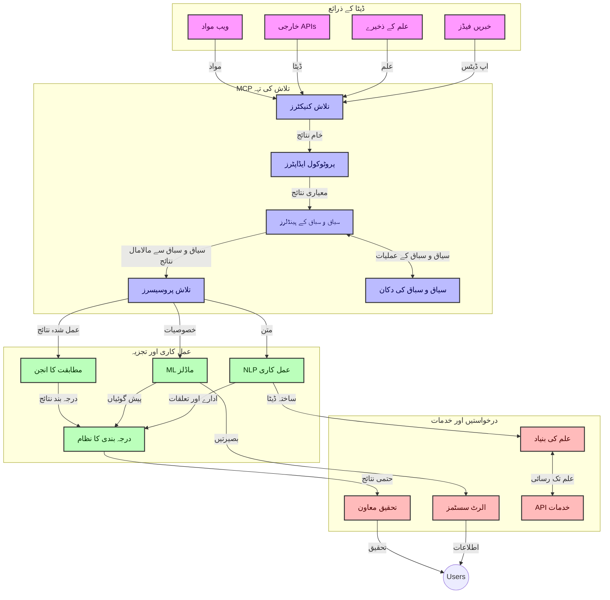
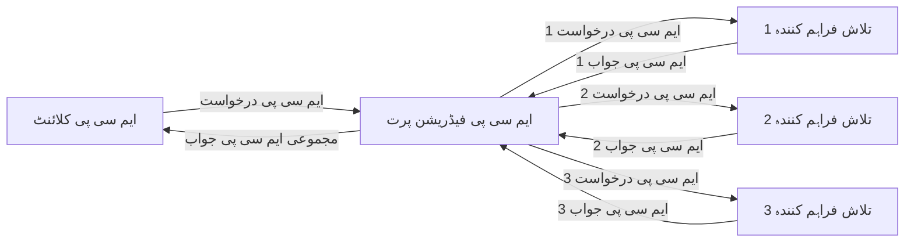
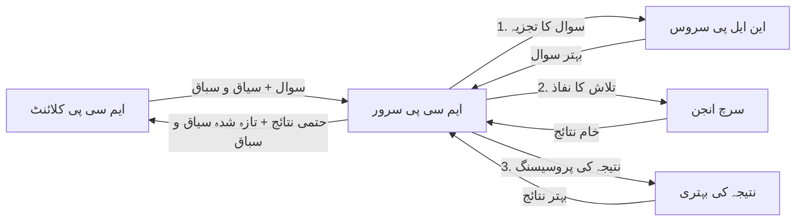

# حقیقی وقت ویب تلاش کے لیے ماڈل کانٹیکسٹ پروٹوکول

## جائزہ

حقیقی وقت ویب تلاش آج کے معلومات پر مبنی ماحول میں لازمی ہو گئی ہے، جہاں ایپلیکیشنز کو انٹرنیٹ پر تازہ ترین معلومات تک فوری رسائی کی ضرورت ہوتی ہے تاکہ متعلقہ اور بروقت جوابات فراہم کیے جا سکیں۔ ماڈل کانٹیکسٹ پروٹوکول (MCP) ان حقیقی وقت کے تلاش کے عمل کو بہتر بنانے میں ایک اہم پیش رفت کی نمائندگی کرتا ہے، تلاش کی کارکردگی کو بڑھاتا ہے، سیاق و سباق کی صحت کو برقرار رکھتا ہے، اور مجموعی نظام کی کارکردگی کو بہتر بناتا ہے۔

یہ ماڈیول اس بات کو دریافت کرتا ہے کہ MCP کس طرح AI ماڈلز، تلاش کے انجنز، اور ایپلیکیشنز کے درمیان سیاق و سباق کے انتظام کے لیے ایک معیاری طریقہ فراہم کر کے حقیقی وقت کی ویب تلاش کو تبدیل کرتا ہے۔

### آپ کیا سیکھیں گے

اس جامع گائیڈ میں، آپ دریافت کریں گے:

- MCP کس طرح AI ماڈلز اور حقیقی وقت ویب تلاش کی صلاحیتوں کے درمیان ایک ہموار پل بناتا ہے
- MCP کے ساتھ موثر اور توسیع پذیر تلاش کے حل نافذ کرنے کے لیے طرز تعمیر کے نمونے
- متعدد سوالات اور تعاملات کے دوران تلاش کے سیاق و سباق کو محفوظ رکھنے کی تکنیکیں
- مختلف تلاش کے منظرناموں کے لیے Python اور JavaScript میں عملی کوڈ کی تعمیل
- MCP کی طاقت سے چلنے والے تلاش کے نظاموں میں مطابقت، تازگی، اور کارکردگی کے توازن کے طریقے

## حقیقی وقت ویب تلاش کا تعارف

حقیقی وقت ویب تلاش ایک تکنیکی طریقہ ہے جو ویب پر مبنی معلومات کو اس وقت شائع یا اپ ڈیٹ ہوتے ہی مسلسل سوالات، عمل کاری، اور تجزیہ کرنا ممکن بناتا ہے، جس سے نظام کم سے کم تاخیر کے ساتھ تازہ اور متعلقہ معلومات فراہم کر سکتے ہیں۔ روایتی تلاش کے نظاموں کے برعکس جو انڈیکس شدہ ڈیٹا پر کام کرتے ہیں جو گھنٹوں یا دنوں پرانا ہو سکتا ہے، حقیقی وقت کی تلاش ویب سے live ڈیٹا پروسیس کرتی ہے، جو آن لائن مواد کی موجودہ حالت کی نمائندگی کرتی ہے۔

### حقیقی وقت ویب تلاش کے بنیادی تصورات:

- **مسلسل سوالات کی پروسیسنگ**: تلاش کے سوالات مستقل اپ ڈیٹ ہوتے ہوئے ڈیٹا ذرائع کے خلاف پروسیس کیے جاتے ہیں
- **تازگی کو ترجیح دینا**: نظام تازہ معلومات کو اولین ترجیح دیتے ہیں
- **مطابقت کا توازن**: مطابقت اور تازگی کے درمیان توازن برقرار رکھنا
- **قابل توسیع فن تعمیر**: نظام متغیر سوال کے بوجھ اور ڈیٹا حجم کو سنبھال سکتے ہیں
- **سیاق و سباق کی تفہیم**: تلاش کے دوران صارف کے سیاق و سباق کو برقرار رکھنا معنی خیز نتائج کے لیے ضروری ہے
- **متحرک سوال کی اصلاح**: سیاق و سباق اور پچھلے نتائج کی بنیاد پر سوالات کو ڈھالنا
- **متعدد ماخذ انضمام**: متعدد تلاش فراہم کنندگان اور ویب ذرائع سے نتائج کو یکجا کرنا
- **معنوی تفہیم**: صرف کلیدی الفاظ کی بجائے معنی کی بنیاد پر سوالات اور مواد کو پروسیس کرنا
- **حقیقی وقت درجہ بندی**: نئی معلومات دستیاب ہونے پر مسلسل نتائج کی درجہ بندی کو ایڈجسٹ کرنا

### ماڈل کانٹیکسٹ پروٹوکول اور حقیقی وقت ویب تلاش

ماڈل کانٹیکسٹ پروٹوکول (MCP) حقیقی وقت ویب تلاش کے ماحول میں کئی اہم چیلنجز کا حل پیش کرتا ہے:

1. **تلاش کے سیاق و سباق کا تحفظ**: MCP معیار کے مطابق اس بات کو یقینی بناتا ہے کہ AI ماڈلز اور پراسیسنگ نوڈز کو متعلقہ سوالات کی تاریخ اور صارف کی ترجیحات تک رسائی حاصل ہو۔

2. **موثر سوالات کا انتظام**: سیاق و سباق کی منتقلی کے لیے ساختی میکانزم فراہم کر کے، MCP ہر تلاش کے مرحلے میں سیاق و سباق کو دہرانے کے اضافی بوجھ کو کم کرتا ہے۔

3. **ہم آہنگی**: MCP مختلف تلاش کی ٹیکنالوجیز اور AI ماڈلز کے درمیان سیاق و سباق کے اشتراک کے لیے ایک مشترکہ زبان تخلیق کرتا ہے، جس سے زیادہ لچکدار اور قابل توسیع فن تعمیرات ممکن ہوتے ہیں۔

4. **تلاش کی بہترین سیاق و سباق**: MCP کے نفاذ ان سیاق و سباق کے عناصر کو ترجیح دے سکتے ہیں جو موثر تلاش کے لیے سب سے زیادہ متعلقہ ہوں، کارکردگی اور درستگی دونوں کا بہتر استعمال کرتے ہوئے۔

5. **متحرک تلاش کی پروسیسنگ**: MCP کے ذریعے مناسب سیاق و سباق کے انتظام کے ساتھ، تلاش کے نظام صارف کی بدلتی ضروریات اور معلومات کے ماحول کی بنیاد پر پروسیسنگ کو متحرک طور پر ایڈجسٹ کر سکتے ہیں۔

جدید ایپلیکیشنز میں، جیسے کہ نیوز ایگریگیشن سے لے کر تحقیقی معاونت تک، MCP کو ویب تلاش ٹیکنالوجیز کے ساتھ جوڑنا زیادہ ذہین، سیاق و سباق سے آگاہ تلاش کو ممکن بناتا ہے جو صارف کے تعاملات کے جاری رہنے پر زیادہ متعلقہ نتائج فراہم کر سکتا ہے۔

## سیکھنے کے مقاصد

اس سبق کے آخر تک، آپ کرنے کے قابل ہوں گے:

- حقیقی وقت ویب تلاش کے بنیادی اصول اور جدید ایپلیکیشنز میں اس کے چیلنجز کو سمجھیں
- وضاحت کریں کہ ماڈل کانٹیکسٹ پروٹوکول (MCP) کس طرح حقیقی وقت کی ویب تلاش کی صلاحیتوں کو بڑھاتا ہے
- مقبول فریم ورکس اور APIs کا استعمال کرتے ہوئے MCP پر مبنی تلاش کے حل نافذ کریں
- MCP کے ساتھ توسیع پذیر، زیادہ کارکردگی والے تلاش کے فن تعمیر کو ڈیزائن اور نافذ کریں
- MCP کے تصورات کو مختلف استعمال کے معاملات بشمول معنوی تلاش، تحقیقی معاونت، اور AI سے مدد یافتہ براؤزنگ پر لاگو کریں
- MCP پر مبنی تلاش کی ٹیکنالوجیز میں ابھرتے ہوئے رجحانات اور مستقبل کے اختراعات کا جائزہ لیں
- صارف کے تعاملات سے سیکھنے والے سیاق و سباق سے آگاہ تلاش کے نظام تیار کریں
- معیاری MCP پروٹوکولز کا استعمال کرتے ہوئے AI معاونین میں ویب تلاش کی صلاحیتوں کو مربوط کریں
- متعدد مراحل کی تلاش کی پائپ لائنز تخلیق کریں جو سیاق و سباق کی بنیاد پر بتدریج نتائج کو بہتر بنائیں
- تلاش کی کارکردگی کو بہتر بنائیں جبکہ جامع سیاق و سباق کی آگاہی برقرار رکھیں

### تعریف اور اہمیت

حقیقی وقت ویب تلاش میں ویب پر مبنی معلومات کی مسلسل سوالات، حاصل کرنے، اور بروقت فراہمی شامل ہے۔ روایتی تلاش انجنز جو وقفے وقفے سے ویب کو کرال اور انڈیکس کرتے ہیں کے برعکس، حقیقی وقت تلاش معلومات کو فوری طور پر فراہم کرنے کی کوشش کرتی ہے جیسے ہی وہ دستیاب ہوں۔

حقیقی وقت ویب تلاش کی کلیدی خصوصیات میں شامل ہیں:

- **تازگی**: حالیہ مواد اور اپ ڈیٹس کو ترجیح دینا
- **مسلسل عمل کاری**: نئے معلومات کی مسلسل نگرانی
- **سوال کی اصلاح**: سیاق و سباق اور فیڈبیک کی بنیاد پر تلاش کے سوالات کو بہتر بنانا
- **فوری فراہمی**: کم سے کم تاخیر کے ساتھ تلاش کے نتائج فراہم کرنا
- **سیاق و سباق کا تحفظ**: بہتر مطابقت کے لیے پچھلے سوالات پر تعمیر کرنا

### روایتی ویب تلاش میں چیلنجز

روایتی ویب تلاش کے طریقے حقیقی وقت کے منظرناموں پر لاگو ہونے پر کئی محدودیتوں کا سامنا کرتے ہیں:

1. **سیاق و سباق کا ٹوٹنا**: متعدد سوالات کے دوران تلاش کے سیاق و سباق کو برقرار رکھنے میں دشواری
2. **معلومات کی تازگی**: سب سے حالیہ معلومات تک رسائی اور ترجیح میں چیلنجز
3. **انضمام کی پیچیدگی**: تلاش کے نظاموں اور ایپلیکیشنز کے درمیان ہم آہنگی کے مسائل
4. **تاخیر کے مسائل**: جامع تلاش کو ردعمل کے وقت کی ضروریات کے ساتھ متوازن کرنا
5. **مطابقت کی ترتیب**: تازگی کو ترجیح دیتے ہوئے درستگی اور مطابقت کو یقینی بنانا

## تلاش کے لیے ماڈل کانٹیکسٹ پروٹوکول (MCP) کو سمجھنا

### تلاش کے سیاق و سباق میں MCP کیا ہے؟

ماڈل کانٹیکسٹ پروٹوکول (MCP) ایک معیاری مواصلاتی پروٹوکول ہے جو AI ماڈلز اور ایپلیکیشنز کے درمیان موثر تعامل کو آسان بنانے کے لیے تیار کیا گیا ہے۔ حقیقی وقت ویب تلاش کے سیاق میں، MCP ایک فریم ورک فراہم کرتا ہے:

- تلاش کے سیاق و سباق کو سوالات کے تسلسل کے دوران محفوظ رکھنا
- تلاش کے سوالات اور نتائج کے فارمیٹس کو معیاری بنانا
- تلاش کے پیرا میٹرز اور نتائج کی ترسیل کو بہتر بنانا
- ماڈل سے تلاش کے انجن کے مابین مواصلت کو بڑھانا

### بنیادی اجزاء اور فن تعمیر

حقیقی وقت ویب تلاش کے لیے MCP فن تعمیر کئی کلیدی اجزاء پر مشتمل ہے:

1. **سوال سیاق و سباق ہینڈلرز**: متعدد سوالات کے دوران تلاش کے سیاق و سباق کا انتظام اور حفاظت
2. **تلاش پروسیسرز**: سیاق و سباق سے باخبر تکنیکوں کا استعمال کرتے ہوئے آنے والی تلاش کی درخواستوں کو پروسیس کرنا
3. **پروٹوکول اڈاپٹرز**: مختلف تلاش APIs کے درمیان سیاق و سباق کو برقرار رکھتے ہوئے تبدیلی کرنا
4. **سیاق و سباق اسٹور**: تلاش کی تاریخ اور ترجیحات کو مؤثر طریقے سے ذخیرہ کرنا اور بازیافت کرنا
5. **تلاش کنیکٹرز**: مختلف تلاش انجنز اور ویب APIs سے رابطہ قائم کرنا



### MCP کیسے حقیقی وقت ویب تلاش کو بہتر بناتا ہے

MCP روایتی ویب تلاش کے چیلنجوں کو درج ذیل طریقوں سے حل کرتا ہے:

- **سیاق و سباق کی تسلسل**: پورے تلاش سیشن میں سوالات کے درمیان تعلقات کو برقرار رکھنا
- **بہتر ترسیل**: ذہین سیاق و سباق کے انتظام کے ذریعے تلاش کے پیرا میٹرز میں تکرار کو کم کرنا
- **معیاری انٹرفیسز**: تلاش کے عناصر کے لیے مستحکم APIs فراہم کرنا
- **کم کی گئی تاخیر**: موثر سیاق و سباق کی ہینڈلنگ کے ذریعے عمل کاری کا بوجھ کم کرنا
- **بہتر مطابقت**: متعدد سوالات کے دوران صارف کے ارادے کو محفوظ کرکے تلاش کی مطابقت کو بہتر بنانا

## انضمام اور عمل درآمد

حقیقی وقت کی ویب تلاش کے نظاموں کو کارکردگی اور سیاق و سباق کی صحت دونوں کو برقرار رکھنے کے لیے محتاط فن تعمیراتی ڈیزائن اور عمل درآمد کی ضرورت ہوتی ہے۔ ماڈل کانٹیکسٹ پروٹوکول AI ماڈلز اور تلاش کی ٹیکنالوجیز کے انضمام کے لیے ایک معیاری طریقہ فراہم کرتا ہے، جس سے زیادہ ترقی یافتہ، سیاق و سباق سے آگاہ تلاش کی پائپ لائنز ممکن ہوتی ہیں۔

### تلاش کے فن تعمیر میں MCP کے انضمام کا جائزہ

حقیقی وقت ویب تلاش کے ماحول میں MCP کا نفاذ کئی کلیدی پہلوؤں پر انحصار کرتا ہے:

1. **تلاش کے سیاق و سباق کی سیریلائزیشن**: MCP تلاش کی درخواستوں میں سیاق و سباق کی معلومات کو مؤثر طریقے سے انکوڈ کرنے کے لیے میکانزم فراہم کرتا ہے، اس بات کو یقینی بناتے ہوئے کہ ضروری سیاق و سباق پورے پروسیسنگ پائپ لائن کے دوران سوال کے ساتھ چلتا ہے۔ اس میں تلاش سے متعلق میٹا ڈیٹا کے لیے معیاری سیریلائزیشن فارمیٹس شامل ہیں جو بہتر کارکردگی کے لیے ترتیب دیے گئے ہیں۔

2. **اسٹیٹ فل تلاش کی پروسیسنگ**: MCP زیادہ ذہین اسٹیٹ فل پروسیسنگ کی اجازت دیتا ہے کیونکہ یہ تلاش کے ہر مرحلے کے دوران مستقل سیاق و سباق کی نمائندگی کو برقرار رکھتا ہے۔ یہ خاص طور پر کئی مراحل کی تلاش کی پائپ لائنز میں مفید ہے جہاں سیاق و سباق کی بہتر کاری نتائج کو بہتر بناتی ہے۔

3. **سوال کی توسیع اور بہتر کاری**: MCP کے نفاذ تلاش کے نظاموں میں جمع شدہ سیاق و سباق کی بنیاد پر پیچیدہ سوال کی توسیع اور بہتر کاری کو سہولت فراہم کر سکتے ہیں، جس سے تلاش کے سیشن کے دوران مزید متعلقہ نتائج حاصل ہوتے ہیں۔

4. **نتائج کی کیشنگ اور ترجیح**: سیاق و سباق کے انتظام کو معیاری بنا کر، MCP کیشنگ اور ترجیح کے انتظام میں مدد دیتا ہے، جو مختلف عناصر کو بدلتے ہوئے تلاش کے سیاق و سباق کے مطابق ڈھالنے کی اجازت دیتا ہے۔

5. **تلاش فیڈریشن اور تجمیع**: MCP متعدد بیک اینڈز میں تلاش کی زیادہ پیچیدہ فیڈریشن کو سہولت فراہم کرتا ہے، تلاش کے سیاق و سباق کی ساختی نمائندگی فراہم کرکے، جو مختلف ذرائع سے نتائج کے زیادہ معنی خیز تجمیع کو ممکن بناتا ہے۔

مختلف تلاش کی ٹیکنالوجیز میں MCP کا نفاذ سیاق و سباق کے انتظام کا ایک متحدہ طریقہ تخلیق کرتا ہے، جو کسٹم انضمام کوڈ کی ضرورت کو کم کرتے ہوئے نظام کی صلاحیت کو بہتر بناتا ہے کہ وہ تلاش کے سوالات کے ارتقاء کے دوران معنی خیز سیاق و سباق برقرار رکھ سکے۔

### مختلف ویب تلاش کے نفاذ میں MCP

یہ مثالیں موجودہ MCP وضاحت کی پیروی کرتی ہیں جو JSON-RPC پر مبنی پروٹوکول اور مختلف ٹرانسپورٹ میکانزم پر توجہ دیتی ہے۔ کوڈ دکھاتا ہے کہ آپ کس طرح کسٹم تلاش کے انضمامات نافذ کر سکتے ہیں جبکہ MCP پروٹوکول کے ساتھ مکمل مطابقت برقرار رکھتے ہیں۔


<details>
<summary>عام تلاش API کے ساتھ Python نفاذ</summary>

```python
import asyncio
import json
import aiohttp
from typing import Dict, Any, Optional, List
from contextlib import asynccontextmanager
from collections.abc import AsyncIterator

# معیاری MCP لائبریریاں درآمد کریں
from mcp.client.session import ClientSession
from mcp.client.streamable_http import streamablehttp_client
from mcp.types import TextContent, CreateMessageRequestParams, CreateMessageResult
from mcp.server.fastmcp import FastMCP

# ویب سرچ کے لیے FastMCP سرور بنائیں
search_server = FastMCP("WebSearch")

# ویب سرچ آپریشنز کو سنبھالنے کے لیے کلاس
class WebSearchHandler:
    def __init__(self, api_endpoint: str, api_key: str):
        self.api_endpoint = api_endpoint
        self.api_key = api_key
        self.session = None
        
    async def initialize(self):
        """Initialize the HTTP session"""
        self.session = aiohttp.ClientSession(
            headers={"Authorization": f"Bearer {self.api_key}"}
        )
    
    async def close(self):
        """Close the HTTP session"""
        if self.session:
            await self.session.close()
            
    async def perform_search(self, query: str, max_results: int = 5, 
                           include_domains: List[str] = None, 
                           exclude_domains: List[str] = None,
                           time_period: str = "any") -> Dict[str, Any]:
        """Perform web search using the search API"""
        # تلاش کے پیرامیٹرز تشکیل دیں
        search_params = {
            "q": query,
            "limit": max_results,
            "time": time_period
        }
        
        if include_domains:
            search_params["site"] = ",".join(include_domains)
            
        if exclude_domains:
            search_params["exclude_site"] = ",".join(exclude_domains)
        
        # تلاش کی درخواست انجام دیں
        try:
            async with self.session.get(
                self.api_endpoint,
                params=search_params
            ) as response:
                if response.status != 200:
                    error_text = await response.text()
                    raise Exception(f"Search API error: {response.status} - {error_text}")
                
                search_data = await response.json()
                
                # API مخصوص جواب کو معیاری شکل میں تبدیل کریں
                results = []
                for item in search_data.get("results", []):
                    results.append({
                        "title": item.get("title", ""),
                        "url": item.get("url", ""),
                        "snippet": item.get("snippet", ""),
                        "date": item.get("published_date", ""),
                        "source": item.get("source", "")
                    })
                
                return {
                    "query": query,
                    "totalResults": len(results),
                    "results": results
                }
        except Exception as e:
            print(f"Search API request error: {e}")
            raise

# سرچ ہینڈلر کو شروع کریں
search_handler = WebSearchHandler(
    api_endpoint="https://api.search-service.example/search",
    api_key="your-api-key-here"
)

# سرچ ہینڈلر کو منظم کرنے کے لیے عمر سیٹ کریں
@asyncio.asynccontextmanager
async def app_lifespan(server: FastMCP):
    """Manage application lifecycle"""
    await search_handler.initialize()
    try:
        yield {"search_handler": search_handler}
    finally:
        await search_handler.close()

# سرور کے لیے عمر طے کریں
search_server = FastMCP("WebSearch", lifespan=app_lifespan)

# ایک ویب سرچ ٹول رجسٹر کریں
@search_server.tool()
async def web_search(query: str, max_results: int = 5, 
                   include_domains: List[str] = None,
                   exclude_domains: List[str] = None,
                   time_period: str = "any") -> Dict[str, Any]:
    """
    Search the web for information
    
    Args:
        query: The search query
        max_results: Maximum number of results to return (default: 5)
        include_domains: List of domains to include in search results
        exclude_domains: List of domains to exclude from search results
        time_period: Time period for results ("day", "week", "month", "any")
        
    Returns:
        Dictionary containing search results
    """
    ctx = search_server.get_context()
    search_handler = ctx.request_context.lifespan_context["search_handler"]
    
    results = await search_handler.perform_search(
        query=query,
        max_results=max_results,
        include_domains=include_domains,
        exclude_domains=exclude_domains,
        time_period=time_period
    )
    
    return results

# کلائنٹ کے استعمال کی مثال
async def client_example():
    # Streamable HTTP ٹرانسپورٹ استعمال کرتے ہوئے سرچ سرور سے جڑیں
    async with streamablehttp_client("http://localhost:8000/mcp") as (read, write, _):
        async with ClientSession(read, write) as session:
            # کنکشن کو شروع کریں
            await session.initialize()
            
            # web_search ٹول کو کال کریں
            search_results = await session.call_tool(
                "web_search", 
                {
                    "query": "latest developments in AI and Model Context Protocol",
                    "max_results": 5,
                    "time_period": "day",
                    "include_domains": ["github.com", "microsoft.com"]
                }
            )
            
            print(f"Search results: {search_results}")

# سرور چلانے کی مثال
if __name__ == "__main__":
    # Streamable HTTP ٹرانسپورٹ کے ساتھ سرور چلائیں
    search_server.run(transport="streamable-http")
```
</details> 

<details>
<summary>براؤزر پر مبنی تلاش کے ساتھ JavaScript نفاذ</summary>


```javascript
// ویب سرچ کے لیے MCP سرور کا نفاذ
import { McpServer, ResourceTemplate } from '@modelcontextprotocol/sdk/server/mcp.js';
import { StreamableHTTPServerTransport } from '@modelcontextprotocol/sdk/server/streamableHttp.js';
import { z } from 'zod';

// ویب سرچ کے لیے MCP سرور بنائیں
const searchServer = new McpServer({
    name: "BrowserSearch",
    description: "A server that provides web search capabilities"
});

// سرچ سروس کلاس
class SearchService {
    constructor(searchApiUrl, apiKey) {
        this.searchApiUrl = searchApiUrl;
        this.apiKey = apiKey;
    }

    async performSearch(parameters) {
        const {
            query = '',
            maxResults = 5,
            includeDomains = [],
            excludeDomains = [],
            timePeriod = 'any'
        } = parameters;
        
        // پیرامیٹرز کے ساتھ سرچ URL بنائیں
        const url = new URL(this.searchApiUrl);
        url.searchParams.append('q', query);
        url.searchParams.append('limit', maxResults);
        url.searchParams.append('time', timePeriod);
        
        if (includeDomains.length > 0) {
            url.searchParams.append('site', includeDomains.join(','));
        }
        
        if (excludeDomains.length > 0) {
            url.searchParams.append('exclude_site', excludeDomains.join(','));
        }
        
        try {
            const response = await fetch(url.toString(), {
                method: 'GET',
                headers: {
                    'Authorization': `Bearer ${this.apiKey}`,
                    'Content-Type': 'application/json'
                }
            });
            
            if (!response.ok) {
                const errorText = await response.text();
                throw new Error(`Search API error: ${response.status} - ${errorText}`);
            }
            
            const searchData = await response.json();
            
            // API مخصوص جواب کو معیاری شکل میں تبدیل کریں
            const results = searchData.results?.map(item => ({
                title: item.title || '',
                url: item.url || '',
                snippet: item.snippet || '',
                date: item.published_date || '',
                source: item.source || ''
            })) || [];
            
            return {
                query,
                totalResults: results.length,
                results
            };
        } catch (error) {
            console.error('Search API request error:', error);
            throw error;
        }
    }
}

// سرچ سروس کو ابتدائی شکل دیں
const searchService = new SearchService(
    'https://api.search-service.example/search',
    'your-api-key-here'
);

// سرور کے لیے کانٹیکسٹ پرووائیڈر سیٹ اپ کریں
searchServer.setContextProvider(() => {
    return {
        searchService
    };
});

// ویب سرچ ٹول رجسٹر کریں
searchServer.tool({
    name: 'web_search',
    description: 'Search the web for information',
    parameters: {
        type: 'object',
        properties: {
            query: {
                type: 'string',
                description: 'The search query'
            },
            maxResults: {
                type: 'integer',
                description: 'Maximum number of results to return',
                default: 5
            },
            includeDomains: {
                type: 'array',
                items: { type: 'string' },
                description: 'List of domains to include in search results'
            },
            excludeDomains: {
                type: 'array',
                items: { type: 'string' },
                description: 'List of domains to exclude from search results'
            },
            timePeriod: {
                type: 'string',
                description: 'Time period for results',
                enum: ['day', 'week', 'month', 'any'],
                default: 'any'
            }
        },
        required: ['query']
    },
    handler: async (params, context) => {
        const { searchService } = context;
        return await searchService.performSearch(params);
    }
});

// سرچ سرور سے جڑنے کے لیے مثال کلائنٹ کوڈ
import { Client } from '@modelcontextprotocol/sdk/client/index.js';
import { StreamableHTTPClientTransport } from '@modelcontextprotocol/sdk/client/streamableHttp.js';

async function connectToSearchServer() {
    // سرچ سرور سے جڑیں
    const transport = new StreamableHTTPClientTransport(
        new URL('http://localhost:8000/mcp')
    );
    
    const client = new Client({
        name: 'search-client',
        version: '1.0.0'
    });
    
    await client.connect(transport);
    
    // سرچ ٹول کو چلائیں
    const searchResults = await client.callTool({
        name: 'web_search',
        arguments: {
            query: 'Model Context Protocol implementation examples',
            maxResults: 10,
            timePeriod: 'week',
            includeDomains: ['github.com', 'docs.microsoft.com']
        }
    });
    
    console.log('Search results:', searchResults);
    
    // صفائی کریں
    await client.disconnect();
}

// سرور شروع کریں
const transport = new StreamableHTTPServerTransport();
await searchServer.connect(transport);
console.log('Search server running at http://localhost:8000/mcp');

// الگ عمل میں یا سرور شروع ہونے کے بعد
// connectToSearchServer().catch(console.error);
```
</details> 


## کوڈ کی مثالوں کی ڈس کلیمر

> **اہم نوٹ**: نیچے دی گئی کوڈ کی مثالیں ماڈل کانٹیکسٹ پروٹوکول (MCP) کو ویب تلاش کی صلاحیت کے ساتھ مربوط کرنے کا مظاہرہ کرتی ہیں۔ اگرچہ یہ آفیشل MCP SDKs کے نمونوں اور ساختوں کی پیروی کرتی ہیں، انہیں تعلیمی مقاصد کے لیے آسان بنایا گیا ہے۔
> 
> یہ مثالیں دکھاتی ہیں:
> 
> 1. **Python نفاذ**: ایک FastMCP سرور نفاذ جو ویب تلاش کا آلہ فراہم کرتا ہے اور ایک خارجی تلاش API سے جڑتا ہے۔ یہ مثال عمر کے انتظام، سیاق و سباق کے انتظام، اور آلہ کی تعمیل کو مناسب طریقے سے ظاہر کرتی ہے جو [دفتر MCP Python SDK](https://github.com/modelcontextprotocol/python-sdk) کے نمونوں کی پیروی کرتی ہے۔ سرور سفارش کردہ Streamable HTTP ٹرانسپورٹ استعمال کرتا ہے جو پرانے SSE ٹرانسپورٹ کی جگہ لے چکا ہے۔
> 
> 2. **JavaScript نفاذ**: FastMCP پیٹرن کا استعمال کرتے ہوئے TypeScript/JavaScript نفاذ جو [دفتر MCP TypeScript SDK](https://github.com/modelcontextprotocol/typescript-sdk) سے مربوط ہے تاکہ ایک تلاش سرور تخلیق کیا جا سکے جس میں مناسب آلہ کی تعریف اور کلائنٹ کنکشن شامل ہیں۔ یہ سیشن مینجمنٹ اور سیاق و سباق کے تحفظ کے لیے تازہ ترین سفارش کردہ نمونوں کی پیروی کرتا ہے۔
> 
> ان مثالوں میں پیداوار کے استعمال کے لیے اضافی ایرر ہینڈلنگ، تصدیق، اور مخصوص API انضمام کوڈ کی ضرورت ہو گی۔ دکھائے گئے تلاش API اینڈپوائنٹس (`https://api.search-service.example/search`) پلیس ہولڈرز ہیں اور انہیں اصل تلاش سروس کے اینڈپوائنٹس سے تبدیل کرنے کی ضرورت ہوگی۔
> 
> مکمل عمل درآمد کی تفصیلات اور تازہ ترین طریقوں کے لیے،
> [دفتر MCP وضاحت](https://modelcontextprotocol.io/specification/2026-07-28/)
> اور SDK دستاویزات سے رجوع کریں۔

## بنیادی تصورات

### ماڈل کانٹیکسٹ پروٹوکول (MCP) فریم ورک

بنیادی طور پر، ماڈل کانٹیکسٹ پروٹوکول AI ماڈلز، ایپلیکیشنز، اور خدمات کے درمیان سیاق و سباق کے تبادلے کا ایک معیاری طریقہ فراہم کرتا ہے۔ حقیقی وقت ویب تلاش میں، یہ فریم ورک مربوط، متعدد دور کے تلاش کے تجربات بنانے کے لیے ضروری ہے۔ کلیدی اجزاء میں شامل ہیں:

1. **کلائنٹ-سرور فن تعمیر**: MCP تلاش کے کلائنٹس (درخواست دہندگان) اور تلاش کے سرورز (فراہم کنندگان) کے درمیان واضح تفریق قائم کرتا ہے، جس سے لچکدار نفاذ کے ماڈلز ممکن ہوتے ہیں۔

2. **JSON-RPC مواصلات**: یہ پروٹوکول JSON-RPC کا استعمال کرتا ہے جو پیغام کے تبادلے کے لیے ہے، جس سے یہ ویب ٹیکنالوجیز کے ساتھ موافق ہوتا ہے اور مختلف پلیٹ فارمز پر آسانی سے نافذ کیا جا سکتا ہے۔

3. **سیاق و سباق کا انتظام**: MCP متعدد تعاملات کے دوران تلاش کے سیاق و سباق کو برقرار رکھنے، اپ ڈیٹ کرنے، اور استعمال کرنے کے لیے ساختی طریقے متعین کرتا ہے۔

4. **آلہ کی تعریفیں**: تلاش کی صلاحیتیں معیاری آلہ کی حیثیت سے فراہم کی جاتی ہیں جن کے واضح پیرا میٹرز اور واپسی کی قدریں ہوتی ہیں۔

5. **اسٹریمنگ کی حمایت**: پروٹوکول اسٹریمنگ نتائج کی حمایت کرتا ہے، جو حقیقی وقت کی تلاش میں ضروری ہے جہاں نتائج تدریجی طور پر آ سکتے ہیں۔

### ویب تلاش کے انضمامی نمونے

جب MCP کو ویب تلاش کے ساتھ شامل کیا جاتا ہے، تو کئی نمونے ابھرتے ہیں:

#### 1. براہ راست تلاش فراہم کنندہ انضمام


اس نمونے میں، MCP سرور براہ راست ایک یا زیادہ تلاش APIs کے ساتھ مربوط ہوتا ہے، MCP درخواستوں کو API مخصوص کالز میں ترجمہ کرتا ہے اور نتائج کو MCP جوابات کی شکل دیتا ہے۔

#### 2. سیاق و سباق کے تحفظ کے ساتھ فیڈریٹڈ تلاش



یہ نمونہ متعدد MCP-مطابق تلاش فراہم کنندگان میں تلاش کے سوالات تقسیم کرتا ہے، ہر ایک ممکنہ طور پر مختلف قسم کے مواد یا تلاش کی صلاحیتوں میں مہارت رکھتا ہے، جبکہ یکساں سیاق و سباق کو برقرار رکھتا ہے۔

#### 3. سیاق و سباق میں اضافے کے ساتھ تلاش کی فہرست



اس نمونے میں، تلاش کے عمل کو متعدد مراحل میں تقسیم کیا جاتا ہے، ہر قدم پر سیاق و سباق کو بڑھایا جاتا ہے، جس کے نتیجے میں بتدریج زیادہ متعلقہ نتائج حاصل ہوتے ہیں۔

### تلاش کے سیاق و سباق کے اجزاء

MCP پر مبنی ویب تلاش میں، سیاق و سباق عام طور پر شامل ہوتا ہے:

- **سوالات کی تاریخ**: سیشن میں پچھلے تلاش کے سوالات
- **صارف کی ترجیحات**: زبان، علاقہ، محفوظ تلاش کے سیٹنگز
- **تعامل کی تاریخ**: کون سے نتائج پر کلک کیا گیا، نتائج پر گزارا گیا وقت
- **تلاش کے پیرامیٹرز**: فلٹرز، ترتیب کے احکام، اور دیگر تلاش میں ترامیم
- **ڈومین کا علم**: تلاش کے لیے متعلقہ مخصوص موضوع کا سیاق و سباق
- **وقتی سیاق و سباق**: وقت کی بنیاد پر متعلقہ عوامل
- **ذرائع کی ترجیحات**: قابل اعتماد یا ترجیحی معلومات کے ذرائع

## استعمال کے معاملات اور ایپلیکیشنز

### تحقیق اور معلومات کی جمع آوری

MCP تحقیقی ورک فلو کو بہتر بناتا ہے:

- تحقیقاتی سیشنز کے دوران سیاق و سباق کو محفوظ رکھنا
- زیادہ پیچیدہ اور سیاق و سباق سے متعلق سوالات کو ممکن بنانا
- متعدد ذرائع سے تلاش کی فیڈریشن کی حمایت
- تلاش کے نتائج سے معلومات نکالنے کو آسان بنانا

### حقیقی وقت کی خبریں اور رجحانات کی نگرانی

MCP سے چلنے والی تلاش خبروں کی نگرانی کے لیے فائدے پیش کرتی ہے:

- ابھرتی ہوئی خبری کہانیوں کی قریب حقیقی وقت میں دریافت
- متعلقہ معلومات کی سیاق و سباق کی فلٹرنگ
- متعدد ذرائع پر موضوع اور ادارے کی نگرانی
- صارف کے سیاق و سباق کی بنیاد پر ذاتی نوعیت کی خبری انتباہات

### AI سے مدد یافتہ براؤزنگ اور تحقیق

MCP AI سے مدد یافتہ براؤزنگ کے لیے نئی ممکنات پیدا کرتا ہے:

- موجودہ براؤزر کی سرگرمی کی بنیاد پر سیاق و سباق سے متعلق تلاش کی تجاویز
- LLM سے چلنے والے معاونین کے ساتھ ویب تلاش کا بغیر رکاوٹ انضمام
- برقرار سیاق و سباق کے ساتھ متعدد دور کی تلاش کی بہتری
- بہتر حقائق کی جانچ اور معلومات کی تصدیق

## مستقبل کے رجحانات اور اختراعات

### ویب تلاش میں MCP کی ترقی

آگے دیکھتے ہوئے، ہم توقع کرتے ہیں کہ MCP مندرجہ ذیل مسائل کو حل کرنے کے لیے ترقی کرے گا:


- **کئی ذرائع سے تلاش**: متن، تصویر، آڈیو، اور ویڈیو تلاش کو مربوط کرنا اور سیاق و سباق کو محفوظ رکھنا
- **مرکزی نہیں کی گئی تلاش**: تقسیم شدہ اور وفاقی تلاش کے ماحولیاتی نظام کی حمایت
- **تلاش کی رازداری**: سیاق و سباق سے آگاہ رازداری کی حفاظت کرنے والے تلاش کے طریقے
- **سوالات کی سمجھ**: قدرتی زبان کے تلاش سوالات کی گہری معنوی تجزیہ

### ٹیکنالوجی میں ممکنہ ترقی

ابھرتی ہوئی ٹیکنالوجیز جو MCP تلاش کے مستقبل کی تشکیل دیں گی:

1. **نیورل تلاش کے معماری ڈھانچے**: MCP کے لیے بہتر بنائی گئی ایمبیڈنگ پر مبنی تلاش کے نظام
2. **ذاتی نوعیت کا تلاش کا سیاق و سباق**: وقت کے ساتھ انفرادی صارف کے تلاش کے نمونے سیکھنا
3. **علمی گراف انضمام**: مخصوص شعبے کے علمی گراف سے بہتر بنایا گیا سیاق و سباق کی تلاش
4. **بین المودالی سیاق و سباق**: مختلف تلاش موڈالیٹیز کے درمیان سیاق و سباق کو قائم رکھنا

## عملی مشقیں

### مشق 1: ایک بنیادی MCP تلاش پائپ لائن قائم کرنا

اس مشق میں، آپ سیکھیں گے کہ:
- ایک بنیادی MCP تلاش ماحول ترتیب دینا
- ویب تلاش کے لیے سیاق و سباق کے ہینڈلرز نافذ کرنا
- تلاش کی بار بار کوششوں کے دوران سیاق و سباق کی حفاظت کی جانچ اور توثیق کرنا

### مشق 2: MCP تلاش کے ساتھ ایک تحقیقی معاون تیار کرنا

ایک مکمل درخواست بنائیں جو:
- قدرتی زبان کے تحقیقی سوالات کو پراسیس کرتی ہے
- سیاق و سباق سے آگاہ ویب تلاشیں انجام دیتی ہے
- متعدد ذرائع سے معلومات کا ترکیب کرتی ہے
- منظم تحقیقی نتائج پیش کرتی ہے

### مشق 3: MCP کے ساتھ کثیر ماخذ تلاش وفاقی نظام کی عملداری

جدید مشق میں شامل ہیں:
- متعدد تلاش انجنوں کو سیاق و سباق سے آگاہ سوالات بھیجنا
- نتائج کی درجہ بندی اور اجتماع
- تلاش کے نتائج کی سیاقی نقل دوری
- ماخذ مخصوص میٹاڈیٹا کا انتظام

## اضافی وسائل

- [Model Context Protocol Specification](https://modelcontextprotocol.io/specification/2026-07-28/) - سرکاری MCP وضاحت اور تفصیلی پروٹوکول دستاویزات
- [Model Context Protocol Documentation](https://modelcontextprotocol.io/) - تفصیلی ٹیوٹوریلز اور عمل درآمد کے رہنما
- [MCP Python SDK](https://github.com/modelcontextprotocol/python-sdk) - MCP پروٹوکول کا سرکاری پائتھن نفاذ
- [MCP TypeScript SDK](https://github.com/modelcontextprotocol/typescript-sdk) - MCP پروٹوکول کا سرکاری ٹائپ اسکرپٹ نفاذ
- [MCP Reference Servers](https://github.com/modelcontextprotocol/servers) - MCP سرورز کے حوالہ نفاذ
- [Bing Web Search API Documentation](https://learn.microsoft.com/en-us/bing/search-apis/bing-web-search/overview) - مائیکروسافٹ کا ویب تلاش API
- [Google Custom Search JSON API](https://developers.google.com/custom-search/v1/overview) - گوگل کا پروگرام ایبل تلاش انجن
- [SerpAPI Documentation](https://serpapi.com/search-api) - تلاش کے نتائج کے صفحے کا API
- [Meilisearch Documentation](https://www.meilisearch.com/docs) - اوپن سورس تلاش انجن
- [Elasticsearch Documentation](https://www.elastic.co/guide/index.html) - تقسیم شدہ تلاش اور تجزیاتی انجن
- [LangChain Documentation](https://python.langchain.com/docs/get_started/introduction) - LLMs کے ساتھ ایپلیکیشنز بنانا

## سیکھنے کے نتائج

اس ماڈیول کو مکمل کرکے، آپ قابل ہوں گے کہ:

- حقیقی وقت کی ویب تلاش اور اس کے چیلنجز کی بنیادی باتوں کو سمجھیں
- وضاحت کریں کہ ماڈل کانٹیکسٹ پروٹوکول (MCP) کس طرح حقیقی وقت کی ویب تلاش کی صلاحیتوں کو بہتر بناتا ہے
- مقبول فریم ورکس اور APIs کا استعمال کرتے ہوئے MCP پر مبنی تلاش کے حل نافذ کریں
- MCP کے ساتھ اسکالیبل، زیادہ کارکردگی والے تلاش کے معماری ڈھانچے ڈیزائن اور نافذ کریں
- مختلف حالات استعمال مثلاً معنوی تلاش، تحقیقی معاونت، اور مصنوعی ذہانت سے مدد یافتہ براؤزنگ میں MCP تصورات کا اطلاق کریں
- MCP پر مبنی تلاش ٹیکنالوجیز میں ابھرتے ہوئے رجحانات اور مستقبل کی جدتوں کا جائزہ لیں


### اعتماد اور سلامتی کے پہلو

جب MCP پر مبنی ویب تلاش کے حل نافذ کریں، تو MCP وضاحت کی ان اہم اصولوں کو یاد رکھیں:

1. **صارف کی رضا مندی اور کنٹرول**: صارفین کو تمام ڈیٹا تک رسائی اور آپریشنز کی واضح رضا مندی دینی چاہیے اور سمجھنا چاہیے۔ یہ خاص طور پر ویب تلاش کی نفاذ میں اہم ہے جو بیرونی ڈیٹا ذرائع تک رسائی حاصل کر سکتے ہیں۔

2. **ڈیٹا کی رازداری**: تلاش کے سوالات اور نتائج کے مناسب ہینڈلنگ کو یقینی بنائیں، خاص طور پر جب وہ حساس معلومات پر مشتمل ہو سکتے ہیں۔ صارف کے ڈیٹا کی حفاظت کے لیے مناسب رسائی کنٹرول نافذ کریں۔

3. **آلات کی سلامتی**: تلاش کے آلات کے لیے مناسب اجازت اور توثیق نافذ کریں، کیونکہ وہ اپنی مرضی کے مطابق کوڈ چلانے کے ذریعے ممکنہ سلامتی کے خطرات پیش کرتے ہیں۔ آلات کے رویے کی تفصیلات کو غیر معتبر سمجھیں جب تک کہ انہیں معتبر سرور سے حاصل نہ کیا جائے۔

4. **واضح دستاویزات**: اپنی MCP پر مبنی تلاش کی نفاذ کی صلاحیتوں، حدود اور سلامتی کے پہلوؤں کے بارے میں واضح دستاویز فراہم کریں، MCP وضاحت کی عمل درآمد کے رہنما خطوط کی پیروی کرتے ہوئے۔

5. **مضبوط رضا مندی کے بہاؤ**: مضبوط رضامندی اور اجازت کے بہاؤ تعمیر کریں جو ہر آلے کے استعمال کی اجازت دینے سے پہلے اس کا واضح وضاحت کریں، خصوصاً ایسے آلات کے لیے جو بیرونی ویب وسائل کے ساتھ تعامل کرتے ہیں۔

MCP سلامتی اور اعتماد کے پہلوؤں کی مکمل تفصیلات کے لیے، ملاحظہ کریں
[سرکاری دستاویزات](https://modelcontextprotocol.io/specification/2026-07-28/basic/security_best_practices)۔

## اگلا کیا ہے

- [5.12 انٹرا ID تصدیق برائے Model Context Protocol سرورز](../mcp-security-entra/README.md)

---

<!-- CO-OP TRANSLATOR DISCLAIMER START -->
**ڈس کلیمر**:
یہ دستاویز AI ترجمہ سروس [Co-op Translator](https://github.com/Azure/co-op-translator) کے ذریعے ترجمہ کی گئی ہے۔ جبکہ ہم درستگی کے لیے کوشاں ہیں، براہ کرم اس بات سے آگاہ رہیں کہ خودکار ترجمے میں غلطیاں یا عدم درستیاں ہو سکتی ہیں۔ اصل دستاویز اپنے مادری زبان میں مستند ماخذ سمجھی جائے گی۔ حساس معلومات کے لیے پیشہ ور انسانی ترجمہ کی سفارش کی جاتی ہے۔ اس ترجمے کے استعمال سے پیدا ہونے والی کسی بھی غلط فہمی یا غلط تشریح کی ذمہ داری ہم قبول نہیں کرتے۔
<!-- CO-OP TRANSLATOR DISCLAIMER END -->