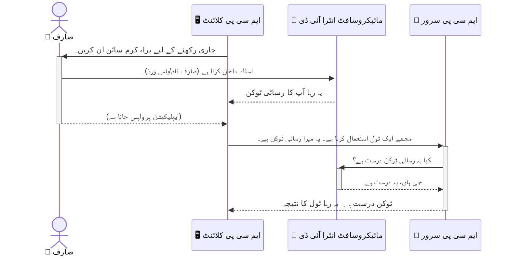

# AI ورک فلو کی حفاظت: ماڈل کانٹیکسٹ پروٹوکول سرورز کے لیے Entra ID کی تصدیق

> [!NOTE]
> اس سبق میں ریموٹ سرور کوڈ پرانے `/sse` اور `/message` اینڈ پوائنٹس کی حفاظت کرتا ہے
> اور MCP `2025-11-25` کو ہدف بناتا ہے۔ اس کی شناخت اور ٹوکن کی تصدیق کے طریقے رکھیں،
> لیکن نئی تعمیل کے لیے `2026-07-28`-مطابق Streamable HTTP ٹرانسپورٹ استعمال کریں۔


## تعارف
اپنے ماڈل کانٹیکسٹ پروٹوکول (MCP) سرور کی حفاظت کرنا اتنا ہی اہم ہے جتنا کہ اپنے گھر کے دروازے کو بند کرنا۔ MCP سرور کو کھلا چھوڑنا آپ کے ٹولز اور ڈیٹا کو غیر مجاز رسائی کے لیے کھلا چھوڑ دیتا ہے، جو سیکیورٹی میں خلل کا باعث بن سکتا ہے۔ مائیکروسافٹ Entra ID ایک مضبوط کلاؤڈ بیسڈ شناخت اور رسائی کا انتظام فراہم کرتا ہے، جو یقینی بناتا ہے کہ صرف مجاز صارفین اور ایپلیکیشنز ہی آپ کے MCP سرور سے رابطہ کر سکیں۔ اس حصے میں، آپ سیکھیں گے کہ کیسے Entra ID کی تصدیق کے ذریعے اپنے AI ورک فلو کی حفاظت کی جائے۔

## سیکھنے کے مقاصد
اس حصے کے اختتام تک، آپ قادر ہوں گے:

- MCP سرورز کی حفاظت کی اہمیت کو سمجھیں۔
- مائیکروسافٹ Entra ID اور OAuth 2.0 کی تصدیق کے بنیادی اصول بیان کریں۔
- پبلک اور کنفیڈنشل کلائنٹس کے درمیان فرق پہچانیں۔
- Entra ID کی تصدیق کو لوکل (پبلک کلائنٹ) اور ریموٹ (کنفیڈنشل کلائنٹ) MCP سرور کے منظرناموں میں نافذ کریں۔
- AI ورک فلو کی ترقی کے دوران حفاظتی بہترین طریقے اپنائیں۔

## MCP اور سیکیورٹی

جیسے آپ اپنے گھر کا سامنے والا دروازہ کھلا نہیں چھوڑتے، ویسے ہی آپ کو اپنے MCP سرور کو بھی ہر کسی کے لیے کھلا نہیں چھوڑنا چاہیے۔ اپنے AI ورک فلو کو محفوظ بنانا مضبوط، قابل اعتماد اور محفوظ ایپلیکیشنز بنانے کے لیے ناگزیر ہے۔ یہ باب آپ کو مائیکروسافٹ Entra ID کے استعمال سے MCP سرور کی حفاظت کا تعارف کرائے گا، تاکہ صرف مجاز صارفین اور ایپلیکیشنز ہی آپ کے ٹولز اور ڈیٹا سے رابطہ کر سکیں۔

## MCP سرورز کے لیے سیکیورٹی کی اہمیت

تصور کریں کہ آپ کے MCP سرور میں ایک ایسا ٹول ہے جو ای میلز بھیج سکتا ہے یا صارفین کے ڈیٹا بیس تک رسائی حاصل کر سکتا ہے۔ ایک غیر محفوظ سرور کا مطلب ہو گا کہ کوئی بھی یہ ٹول استعمال کر سکتا ہے، جس سے غیر مجاز ڈیٹا تک رسائی، اسپام یا دیگر نقصان دہ سرگرمیاں ہو سکتی ہیں۔

تصدیق نافذ کرکے، آپ یقین دلاتے ہیں کہ ہر درخواست کی جانچ پڑتال ہو، جس سے درخواست کرنے والے صارف یا ایپلیکیشن کی شناخت کی تصدیق ہو جاتی ہے۔ یہ آپ کے AI ورک فلو کی حفاظت کے لیے پہلا اور سب سے اہم قدم ہے۔

## مائیکروسافٹ Entra ID کا تعارف

[**مائیکروسافٹ Entra ID**](https://adoption.microsoft.com/microsoft-security/entra/) ایک کلاؤڈ بیسڈ شناخت اور رسائی مینجمنٹ سروس ہے۔ اسے اپنے ایپلیکیشنز کے لیے ایک عالمی سیکورٹی گارڈ سمجھیں۔ یہ صارف کی شناخت کی جانچ (تصدیق) اور ان کے اختیارات (اجازت) کا پیچیدہ عمل سنبھالتا ہے۔

Entra ID سے آپ یہ کر سکتے ہیں:

- صارفین کے لیے محفوظ سائن ان کو فعال کریں۔
- APIs اور سروسز کی حفاظت کریں۔
- مرکزی جگہ سے رسائی کی پالیسیاں منظم کریں۔

MCP سرورز کے لیے، Entra ID ایک مضبوط اور وسیع طور پر قابلِ اعتماد حل فراہم کرتا ہے جو یہ تعین کرتا ہے کہ کون آپ کے سرور کی صلاحیتوں تک رسائی حاصل کر سکتا ہے۔

---

## Entra ID کی تصدیق کیسے کام کرتی ہے: جادو کو سمجھنا

Entra ID تصدیق کے لیے اوپن اسٹینڈرڈز جیسے **OAuth 2.0** استعمال کرتا ہے۔ تفصیلات پیچیدہ ہو سکتی ہیں، لیکن بنیادی خیال آسان ہے اور ایک مثال کے ذریعے سمجھا جا سکتا ہے۔

### OAuth 2.0 کا ہلکا تعارف: ویلیٹ کی چابی

OAuth 2.0 کو گاڑی کے لیے ویلیٹ سروس سمجھیں۔ جب آپ ریسٹورنٹ پہنچتے ہیں، تو آپ ویلیٹ کو اپنی ماسٹر کی نہیں دیتے۔ بلکہ آپ ایک **ویلیٹ کی** دیتے ہیں جس کی محدود اجازت ہوتی ہے—یہ گاڑی شروع کر سکتا ہے اور دروازے بند کر سکتا ہے، مگر ٹرنک یا گلوو کمپارٹمنٹ نہیں کھول سکتا۔

اس مثال میں:

- **آپ** ہیں **صارف**۔
- **آپ کی گاڑی** ہے **MCP سرور** جس میں قیمتی ٹولز اور ڈیٹا ہے۔
- **ویلیٹ** ہے **مائیکروسافٹ Entra ID**۔
- **پارکنگ اٹینڈنٹ** ہے **MCP کلائنٹ** (وہ ایپلیکیشن جو سرور تک رسائی کی کوشش کر رہی ہے)۔
- **ویلیٹ کی** ہے **رسائی کا ٹوکن**۔

رسائی کا ٹوکن ایک محفوظ متن کی سٹرنگ ہوتی ہے جو MCP کلائنٹ Entra ID سے سائن ان کے بعد حاصل کرتا ہے۔ کلائنٹ پھر یہ ٹوکن ہر درخواست کے ساتھ MCP سرور کو پیش کرتا ہے۔ سرور ٹوکن کی تصدیق کر سکتا ہے کہ درخواست جائز ہے اور کلائنٹ کے پاس ضروری اجازتیں ہیں، بغیر آپ کے اصل اسناد (جیسے پاسورڈ) کو سنبھالے۔

### تصدیق کا بہاؤ

عمل کار طریقہ کار کچھ یوں ہے:



### مائیکروسافٹ آتھینٹیکیشن لائبریری (MSAL) کا تعارف

کوڈ میں آنے سے پہلے، ایک اہم جزو سے واقف ہونا ضروری ہے جو آپ مثالوں میں دیکھیں گے: **مائیکروسافٹ آتھینٹیکیشن لائبریری (MSAL)**۔

MSAL مائیکروسافٹ کی تیار کردہ لائبریری ہے جو ڈویلپرز کے لیے تصدیق ہینڈل کرنا آسان بناتی ہے۔ آپ کو سیکیورٹی ٹوکنز، سائن ان کا انتظام، اور سیشنز ریفریش کے لیے پیچیدہ کوڈ لکھنے کی ضرورت نہیں پڑتی، MSAL یہ سب خود سنبھال لیتا ہے۔

MSAL کا استعمال انتہائی سفارش کی جاتی ہے کیونکہ:

- **یہ محفوظ ہے:** یہ صنعت کے معیار کے پروٹوکولز اور سیکیورٹی بہترین طریقے اپناتا ہے، جس سے آپ کے کوڈ میں کمزوریوں کا خطرہ گھٹ جاتا ہے۔
- **یہ ترقی کو آسان بناتا ہے:** یہ OAuth 2.0 اور OpenID Connect کی پیچیدگیوں کو چھپا دیتا ہے، جس سے آپ چند لائنوں میں مضبوط تصدیق شامل کر سکتے ہیں۔
- **یہ مینیج کیا جاتا ہے:** مائیکروسافٹ MSAL کو خود اپ ڈیٹ کرتا ہے تاکہ نئے سیکیورٹی خطرات اور پلیٹ فارم تبدیلیوں سے نمٹا جا سکے۔

MSAL بہت ساری زبانوں اور ایپلیکیشن فریم ورک کو سپورٹ کرتا ہے، جیسے .NET، JavaScript/TypeScript، Python، Java، Go اور موبائل پلیٹ فارمز جیسے iOS اور Android۔ اس کا مطلب ہے کہ آپ اپنے پورے ٹیکنالوجی اسٹیک میں ایک جیسا تصدیقی پیٹرن استعمال کر سکتے ہیں۔

MSAL کے متعلق مزید جاننے کے لیے، آپ سرکاری [MSAL کا جائزہ دستاویزات](https://learn.microsoft.com/entra/identity-platform/msal-overview) دیکھ سکتے ہیں۔

---

## Entra ID کے ساتھ اپنے MCP سرور کو محفوظ بنانا: ایک مرحلہ وار رہنما

اب، چلیں دیکھتے ہیں کہ کیسے Entra ID کے ذریعہ ایک لوکل MCP سرور (جو `stdio` کے ذریعے رابطہ کرتا ہے) کو محفوظ کریں۔ اس مثال میں ایک **پبلک کلائنٹ** استعمال ہوتا ہے، جو صارف کے کمپیوٹر پر چلنے والی ایپلیکیشنز جیسے ڈیسک ٹاپ ایپ یا لوکل ڈیولپمنٹ سرور کے لیے موزوں ہے۔

### منظرنامہ 1: لوکل MCP سرور کی حفاظت (پبلک کلائنٹ کے ساتھ)

اس منظرنامے میں، ہم ایسے MCP سرور کو دیکھیں گے جو لوکل چلتا ہے، `stdio` کے ذریعے بات چیت کرتا ہے اور Entra ID کے ذریعے صارف کی تصدیق کرتا ہے تاکہ اسے اپنے ٹولز تک رسائی کی اجازت دے۔ سرور ایک واحد ٹول رکھتا ہے جو Microsoft Graph API سے صارف کی پروفائل معلومات لاتا ہے۔

#### 1. Entra ID میں ایپلیکیشن کی رجسٹریشن

کوڈ لکھنے سے پہلے، آپ کو مائیکروسافٹ Entra ID میں اپنی ایپلیکیشن رجسٹر کرنی ہوگی۔ یہ Entra ID کو آپ کی ایپلیکیشن کے بارے میں بتاتا ہے اور اسے تصدیقی سروس استعمال کرنے کی اجازت دیتا ہے۔

1. **[Microsoft Entra پورٹل](https://entra.microsoft.com/)** پر جائیں۔
2. **App registrations** میں جائیں اور **New registration** پر کلک کریں۔
3. اپنی ایپلیکیشن کو ایک نام دیں (مثلاً "میرا لوکل MCP سرور")۔
4. **Supported account types** کے لیے، **Accounts in this organizational directory only** منتخب کریں۔
5. اس مثال کے لیے **Redirect URI** خالی چھوڑ سکتے ہیں۔
6. **Register** پر کلک کریں۔

رجسٹر کرنے کے بعد، **Application (client) ID** اور **Directory (tenant) ID** نوٹ کر لیں۔ آپ کو کوڈ میں ان کی ضرورت ہوگی۔

#### 2. کوڈ: ایک جائزہ

آئیے تصدیق کو سنبھالنے والے کوڈ کے اہم حصوں کو دیکھتے ہیں۔ اس مثال کا مکمل کوڈ [Entra ID - Local - WAM](https://github.com/Azure-Samples/mcp-auth-servers/tree/main/src/entra-id-local-wam) فولڈر میں دستیاب ہے جو [mcp-auth-servers GitHub repository](https://github.com/Azure-Samples/mcp-auth-servers) کا حصہ ہے۔

**`AuthenticationService.cs`**

یہ کلاس Entra ID کے ساتھ تعامل کا ذمہ دار ہے۔

- **`CreateAsync`**: یہ طریقہ MSAL (مائیکروسافٹ آتھینٹیکیشن لائبریری) سے `PublicClientApplication` کو انیشیالائز کرتا ہے۔ یہ آپ کی ایپلیکیشن کے `clientId` اور `tenantId` کے ساتھ کنفیگر ہوتا ہے۔
- **`WithBroker`**: یہ بروکر (جیسے Windows Web Account Manager) کے استعمال کو فعال کرتا ہے، جو زیادہ محفوظ اور روانی سے سنگل سائن آن تجربہ فراہم کرتا ہے۔
- **`AcquireTokenAsync`**: یہ بنیادی طریقہ ہے۔ یہ پہلے خاموشی سے ٹوکن حاصل کرنے کی کوشش کرتا ہے (یعنی اگر صارف کے پاس پہلے سے سیشن ہے تو اسے دوبارہ سائن ان کرنے کی ضرورت نہیں)۔ اگر خاموشی سے ٹوکن حاصل نہ ہو سکے، تو یہ صارف کو انٹرایکٹو سائن ان کے لیے کہتا ہے۔

```csharp
// Simplified for clarity
public static async Task<AuthenticationService> CreateAsync(ILogger<AuthenticationService> logger)
{
    var msalClient = PublicClientApplicationBuilder
        .Create(_clientId) // Your Application (client) ID
        .WithAuthority(AadAuthorityAudience.AzureAdMyOrg)
        .WithTenantId(_tenantId) // Your Directory (tenant) ID
        .WithBroker(new BrokerOptions(BrokerOptions.OperatingSystems.Windows))
        .Build();

    // ... cache registration ...

    return new AuthenticationService(logger, msalClient);
}

public async Task<string> AcquireTokenAsync()
{
    try
    {
        // Try silent authentication first
        var accounts = await _msalClient.GetAccountsAsync();
        var account = accounts.FirstOrDefault();

        AuthenticationResult? result = null;

        if (account != null)
        {
            result = await _msalClient.AcquireTokenSilent(_scopes, account).ExecuteAsync();
        }
        else
        {
            // If no account, or silent fails, go interactive
            result = await _msalClient.AcquireTokenInteractive(_scopes).ExecuteAsync();
        }

        return result.AccessToken;
    }
    catch (Exception ex)
    {
        _logger.LogError(ex, "An error occurred while acquiring the token.");
        throw; // Optionally rethrow the exception for higher-level handling
    }
}
```

**`Program.cs`**

یہاں MCP سرور سیٹ اپ کیا جاتا ہے اور آتھینٹیکیشن سروس شامل کی جاتی ہے۔

- **`AddSingleton<AuthenticationService>`**: یہ `AuthenticationService` کو ڈپینڈنسی انجیکشن کنٹینر میں رجسٹر کرتا ہے تاکہ ایپلیکیشن کے دیگر حصے اس کا استعمال کر سکیں (جیسے ہمارا ٹول)۔
- **`GetUserDetailsFromGraph` ٹول**: اس ٹول کو `AuthenticationService` کی ضرورت ہوتی ہے۔ اسے کچھ کرنے سے پہلے `authService.AcquireTokenAsync()` کال کر کے درست رسائی ٹوکن حاصل کرتا ہے۔ اگر تصدیق کامیاب ہو جاتی ہے، تو یہ ٹوکن استعمال کر کے Microsoft Graph API سے صارف کی تفصیلات لاتا ہے۔

```csharp
// Simplified for clarity
[McpServerTool(Name = "GetUserDetailsFromGraph")]
public static async Task<string> GetUserDetailsFromGraph(
    AuthenticationService authService)
{
    try
    {
        // This will trigger the authentication flow
        var accessToken = await authService.AcquireTokenAsync();

        // Use the token to create a GraphServiceClient
        var graphClient = new GraphServiceClient(
            new BaseBearerTokenAuthenticationProvider(new TokenProvider(authService)));

        var user = await graphClient.Me.GetAsync();

        return System.Text.Json.JsonSerializer.Serialize(user);
    }
    catch (Exception ex)
    {
        return $"Error: {ex.Message}";
    }
}
```

#### 3. یہ سب کیسے مل کر کام کرتا ہے

1. جب MCP کلائنٹ `GetUserDetailsFromGraph` ٹول استعمال کرنے کی کوشش کرتا ہے، تو ٹول سب سے پہلے `AcquireTokenAsync` کو کال کرتا ہے۔
2. `AcquireTokenAsync` MSAL لائبریری کو درست ٹوکن چیک کرنے کا کہتا ہے۔
3. اگر کوئی ٹوکن نہیں ملتا، تو MSAL، بروکر کے ذریعے، صارف کو Entra ID اکاؤنٹ سے سائن ان کرنے کو کہتا ہے۔
4. صارف کے سائن ان ہونے پر، Entra ID ایک رسائی ٹوکن جاری کرتا ہے۔
5. ٹول اس ٹوکن کو حاصل کرتا ہے اور محفوظ Microsoft Graph API کال کرتا ہے۔
6. صارف کی تفصیلات MCP کلائنٹ کو واپس کی جاتی ہیں۔

یہ عمل یقینی بناتا ہے کہ صرف تصدیق شدہ صارف ہی ٹول استعمال کر سکتا ہے، اس طرح آپ کا لوکل MCP سرور محفوظ ہوتا ہے۔

### منظرنامہ 2: ریموٹ MCP سرور کی حفاظت (کنفیڈنشل کلائنٹ کے ساتھ)

جب آپ کا MCP سرور ریموٹ مشین (جیسے کلاؤڈ سرور) پر چل رہا ہو اور HTTP Streaming جیسے پروٹوکول سے بات چیت کرتا ہو، تو سیکیورٹی کی ضروریات مختلف ہوتی ہیں۔ اس صورت میں، آپ کو **کنفیڈنشل کلائنٹ** اور **Authorization Code فلو** استعمال کرنا چاہیے۔ یہ ایک زیادہ محفوظ طریقہ ہے کیونکہ ایپلیکیشن کے راز کبھی بھی براؤزر کے سامنے نہیں آتے۔

یہ مثال ایک TypeScript-based MCP سرور دکھاتی ہے جو Express.js کا استعمال HTTP درخواستوں کو ہینڈل کرنے کے لیے کرتا ہے۔

#### 1. Entra ID میں ایپلیکیشن کی رجسٹریشن

Entra ID میں سیٹ اپ پبلک کلائنٹ کی طرح ہے، مگر ایک اہم فرق کے ساتھ: آپ کو **کلائنٹ سیکریٹ** بنانا ہوگا۔

1. **[Microsoft Entra پورٹل](https://entra.microsoft.com/)** پر جائیں۔
2. اپنی ایپ رجسٹریشن میں، **Certificates & secrets** ٹیب پر جائیں۔
3. **New client secret** پر کلک کریں، ایک وضاحت دیں، اور **Add** پر کلک کریں۔
4. **اہم:** سیکریٹ ویلیو کو فوراً کاپی کریں۔ آپ اسے دوبارہ نہیں دیکھ سکیں گے۔
5. آپ کو ایک **Redirect URI** بھی کنفیگر کرنا ہوگا۔ **Authentication** ٹیب میں جائیں، **Add a platform** پر کلک کریں، **Web** منتخب کریں، اور اپنی ایپلیکیشن کا Redirect URI درج کریں (مثلاً `http://localhost:3001/auth/callback`)۔

> **⚠️ اہم حفاظتی نوٹ:** پروڈکشن ایپلیکیشنز کے لیے، مائیکروسافٹ سختی سے سفارش کرتا ہے کہ **کلائنٹ سیکریٹس** کی بجائے **secretless authentication** طریقے جیسے **Managed Identity** یا **Workload Identity Federation** استعمال کیے جائیں۔ کلائنٹ سیکریٹس سیکیورٹی کے خطرات رکھتے ہیں کیونکہ ان کا انکشاف یا کمپرو مائز ہو سکتا ہے۔ Managed Identities ایک زیادہ محفوظ طریقہ فراہم کرتی ہیں کیونکہ آپ کو اسناد کو کوڈ یا کنفیگریشن میں رکھنے کی ضرورت نہیں ہوتی۔
>
> Managed identities کے بارے میں مزید معلومات اور ان کو کیسے نافذ کیا جائے، دیکھیں [Managed identities for Azure resources overview](https://learn.microsoft.com/entra/identity/managed-identities-azure-resources/overview)۔

#### 2. کوڈ: ایک جائزہ

یہ مثال سیشن پر مبنی طریقہ استعمال کرتی ہے۔ جب صارف تصدیق کرتا ہے، سرور اکسیس ٹوکن اور ریفریش ٹوکن سیشن میں رکھتا ہے اور صارف کو ایک سیشن ٹوکن دیتا ہے۔ یہ سیشن ٹوکن بعد کی درخواستوں کے لیے استعمال ہوتا ہے۔ اس مثال کا مکمل کوڈ [Entra ID - Confidential client](https://github.com/Azure-Samples/mcp-auth-servers/tree/main/src/entra-id-cca-session) فولڈر میں دستیاب ہے جو [mcp-auth-servers GitHub repository](https://github.com/Azure-Samples/mcp-auth-servers) کا حصہ ہے۔

**`Server.ts`**

یہ فائل Express سرور اور MCP ٹرانسپورٹ لئیر کو سیٹ اپ کرتی ہے۔

- **`requireBearerAuth`**: یہ ایک مڈل ویئر ہے جو `/sse` اور `/message` اینڈ پوائنٹس کو محفوظ بناتا ہے۔ یہ درخواست کے `Authorization` ہیڈر میں درست بیئرر ٹوکن چیک کرتا ہے۔
- **`EntraIdServerAuthProvider`**: یہ کسٹم کلاس ہے جو `McpServerAuthorizationProvider` انٹرفیس کو نافذ کرتی ہے۔ یہ OAuth 2.0 فلو سنبھالنے کی ذمہ دار ہے۔
- **`/auth/callback`**: یہ اینڈ پوائنٹ صارف کی تصدیق کے بعد Entra ID سے ری ڈائریکٹ کو ہینڈل کرتا ہے۔ یہ authorization code کو اکسیس ٹوکن اور ریفریش ٹوکن میں تبدیل کرتا ہے۔

```typescript
// وضاحت کے لیے آسان بنایا گیا
const app = express();
const { server } = createServer();
const provider = new EntraIdServerAuthProvider();

// SSE اینڈپوائنٹ کی حفاظت کریں
app.get("/sse", requireBearerAuth({
  provider,
  requiredScopes: ["User.Read"]
}), async (req, res) => {
  // ... ٹرانسپورٹ سے جڑیں ...
});

// میسج اینڈپوائنٹ کی حفاظت کریں
app.post("/message", requireBearerAuth({
  provider,
  requiredScopes: ["User.Read"]
}), async (req, res) => {
  // ... میسج کو سنبھالیں ...
});

// OAuth 2.0 کال بیک کو سنبھالیں
app.get("/auth/callback", (req, res) => {
  provider.handleCallback(req.query.code, req.query.state)
    .then(result => {
      // ... کامیابی یا ناکامی کو سنبھالیں ...
    });
});
```

**`Tools.ts`**

یہ فائل وہ ٹولز ڈیفائن کرتی ہے جو MCP سرور فراہم کرتا ہے۔ `getUserDetails` ٹول پچھلی مثال کی طرح ہے، مگر یہ سیشن سے اکسیس ٹوکن حاصل کرتا ہے۔

```typescript
// وضاحت کے لیے آسان بنایا گیا
server.setRequestHandler(CallToolRequestSchema, async (request) => {
  const { name } = request.params;
  const context = request.params?.context as { token?: string } | undefined;
  const sessionToken = context?.token;

  if (name === ToolName.GET_USER_DETAILS) {
    if (!sessionToken) {
      throw new AuthenticationError("Authentication token is missing or invalid. Ensure the token is provided in the request context.");
    }

    // سیشن اسٹور سے Entra ID ٹوکن حاصل کریں
    const tokenData = tokenStore.getToken(sessionToken);
    const entraIdToken = tokenData.accessToken;

    const graphClient = Client.init({
      authProvider: (done) => {
        done(null, entraIdToken);
      }
    });

    const user = await graphClient.api('/me').get();

    // ... صارف کی تفصیلات واپس کریں ...
  }
});
```

**`auth/EntraIdServerAuthProvider.ts`**

یہ کلاس مندرجہ ذیل لاجک کا انتظام کرتی ہے:

- صارف کو Entra ID سائن ان پیج پر ری ڈائریکٹ کرنا۔
- authorization code کو اکسیس ٹوکن میں تبدیل کرنا۔
- ٹوکنز کو `tokenStore` میں محفوظ کرنا۔
- جب اکسیس ٹوکن کی میعاد ختم ہو جائے، تو اسے ریفریش کرنا۔


#### 3. یہ سب کیسے ایک ساتھ کام کرتا ہے

1. جب کوئی صارف پہلی بار MCP سرور سے کنیکٹ کرنے کی کوشش کرتا ہے تو `requireBearerAuth` مڈل ویئر دیکھے گا کہ ان کے پاس کوئی درست سیشن نہیں ہے اور انہیں Entra ID کے سائن ان صفحے پر ری ڈائریکٹ کر دے گا۔
2. صارف اپنے Entra ID اکاؤنٹ سے سائن ان کرتا ہے۔
3. Entra ID صارف کو ایک اجازت نامہ کوڈ کے ساتھ `/auth/callback` اینڈپوائنٹ پر واپس ری ڈائریکٹ کرتا ہے۔
4. سرور کوڈ کو ایکسیس ٹوکن اور ریفریش ٹوکن کے ساتھ تبدیل کرتا ہے، انہیں ذخیرہ کرتا ہے، اور ایک سیشن ٹوکن بناتا ہے جو کلائنٹ کو بھیجا جاتا ہے۔
5. کلائنٹ اب اس سیشن ٹوکن کو `Authorization` ہیڈر میں استعمال کر سکتا ہے تمام مستقبل کی درخواستوں کے لیے MCP سرور کو۔
6. جب `getUserDetails` ٹول کال کیا جاتا ہے، یہ سیشن ٹوکن کا استعمال کرتے ہوئے Entra ID ایکسیس ٹوکن تلاش کرتا ہے اور پھر Microsoft Graph API کو کال کرتا ہے۔

یہ فلو پبلک کلائنٹ فلو سے زیادہ پیچیدہ ہے، لیکن انٹرنیٹ کے سامنے آؤٹ پوائنٹس کے لیے ضروری ہے۔ چونکہ ریموٹ MCP سرورز پبلک انٹرنیٹ کے ذریعے دستیاب ہیں، انہیں غیر مجاز رسائی اور ممکنہ حملوں سے بچانے کے لیے مضبوط سیکیورٹی تدابیر کی ضرورت ہے۔


## سیکیورٹی کے بہترین طریقے

- **ہمیشہ HTTPS استعمال کریں**: کلائنٹ اور سرور کے درمیان مواصلات کو انکرپٹ کریں تاکہ ٹوکنز کو مداخلت سے بچایا جا سکے۔
- **رول بیسڈ ایکسیس کنٹرول (RBAC) نافذ کریں**: صرف یہ نہ دیکھیں کہ صارف مصدقہ ہے یا نہیں؛ یہ دیکھیں کہ وہ کیا کرنے کے مجاز ہیں۔ آپ Entra ID میں رولز متعین کر سکتے ہیں اور اپنے MCP سرور میں ان کی جانچ کر سکتے ہیں۔
- **نگرانی اور آڈٹ کریں**: تمام توثیقی واقعات کو لاگ کریں تاکہ مشتبہ سرگرمی کا پتہ لگا سکیں اور اس کا جواب دے سکیں۔
- **ریٹ لمٹنگ اور تھروٹلنگ کو سنبھالیں**: Microsoft Graph اور دیگر APIs ریٹ لمٹنگ نافذ کرتے ہیں تاکہ غلط استعمال سے بچا جا سکے۔ اپنے MCP سرور میںایکسپونینشل بیک آف اور ریٹری لاجک نافذ کریں تاکہ HTTP 429 (بہت زیادہ درخواستیں) جوابات کو حسن سلوک کے ساتھ سنبھالا جا سکے۔ اکثر استعمال ہونے والے ڈیٹا کو کیش کرنا بھی API کالز کو کم کر سکتا ہے۔
- **محفوظ ٹوکن اسٹوریج**: ایکسیس ٹوکنز اور ریفریش ٹوکنز کو محفوظ طریقے سے ذخیرہ کریں۔ لوکل ایپلیکیشنز کے لیے سسٹم کے محفوظ اسٹوریج میکانزم استعمال کریں۔ سرور ایپلیکیشنز کے لیے انکرپٹڈ اسٹوریج یا Azure Key Vault جیسے محفوظ کلید مینجمنٹ سروسز استعمال کرنے پر غور کریں۔
- **ٹوکن کی میعاد ختم ہونے کو سنبھالیں**: ایکسیس ٹوکنز کی محدود مدت ہوتی ہے۔ ریفریش ٹوکنز کے ذریعے خودکار ٹوکن ریفریش نافذ کریں تاکہ صارف کو بغیر دوبارہ توثیق کے سلسلہ وار تجربہ فراہم کیا جا سکے۔
- **Azure API Management کے استعمال پر غور کریں**: حالانکہ MCP سرور میں براہ راست سیکیورٹی نافذ کرنے سے آپ کو باریک بینی سے کنٹرول ملتا ہے، API گیٹ ویز جیسے Azure API Management بہت سے سیکیورٹی مسائل جیسے توثیق، اجازت، ریٹ لمٹنگ، اور نگرانی خود بخود سنبھال سکتے ہیں۔ یہ ایک مرکزی سیکیورٹی پرت فراہم کرتے ہیں جو آپ کے کلائنٹس اور MCP سرورز کے درمیان واقع ہوتی ہے۔ MCP کے ساتھ API گیٹ ویز کے استعمال کی مزید تفصیلات کے لیے دیکھیں [Azure API Management Your Auth Gateway For MCP Servers](https://techcommunity.microsoft.com/blog/integrationsonazureblog/azure-api-management-your-auth-gateway-for-mcp-servers/4402690)۔


## اہم نکات

- اپنے MCP سرور کی سیکیورٹی کے لیے حفاظت کرنا آپ کے ڈیٹا اور ٹولز کی حفاظت کے لیے بہت اہم ہے۔
- Microsoft Entra ID ایک مضبوط اور قابل توسیع حل فراہم کرتا ہے توثیق اور اجازت کے لیے۔
- لوکل ایپلیکیشنز کے لیے **پبلک کلائنٹ** اور ریموٹ سرورز کے لیے **کنفیڈینشل کلائنٹ** استعمال کریں۔
- ویب ایپلیکیشنز کے لیے **Authorization Code Flow** سب سے محفوظ اختیار ہے۔


## مشق

1. اس بارے میں سوچیں کہ آپ کون سا MCP سرور بنا سکتے ہیں۔ کیا یہ لوکل سرور ہوگا یا ریموٹ سرور؟
2. اپنی جواب کی بنیاد پر، کیا آپ پبلک کلائنٹ استعمال کریں گے یا کنفیڈینشل کلائنٹ؟
3. آپ کا MCP سرور Microsoft Graph کے خلاف کارروائیاں کرنے کے لیے کونسی اجازت طلب کرے گا؟


## عملی مشقیں

### مشق 1: Entra ID میں ایک ایپلیکیشن رجسٹر کریں
Microsoft Entra پورٹل پر جائیں۔
اپنے MCP سرور کے لیے ایک نئی ایپلیکیشن رجسٹر کریں۔
ایپلیکیشن (کلائنٹ) ID اور ڈائریکٹری (ٹیننٹ) ID ریکارڈ کریں۔

### مشق 2: لوکل MCP سرور کو محفوظ بنائیں (پبلک کلائنٹ)
- صارف کی توثیق کے لیے MSAL (Microsoft Authentication Library) کو ضم کرنے کے لیے کوڈ کی مثال پر عمل کریں۔
- Microsoft Graph سے صارف کی تفصیلات حاصل کرنے والے MCP ٹول کو کال کر کے تصدیقی فلو کی جانچ کریں۔

### مشق 3: ریموٹ MCP سرور کو محفوظ بنائیں (کنفیڈینشل کلائنٹ)
- Entra ID میں ایک کنفیڈینشل کلائنٹ رجسٹر کریں اور ایک کلائنٹ سیکریٹ بنائیں۔
- اپنے Express.js MCP سرور کو Authorization Code Flow استعمال کرنے کے لیے کنفیگر کریں۔
- محفوظ اینڈپوائنٹس کی جانچ کریں اور ٹوکن کی بنیاد پر رسائی کی تصدیق کریں۔

### مشق 4: سیکیورٹی کے بہترین طریقے نافذ کریں
- اپنے لوکل یا ریموٹ سرور کے لیے HTTPS فعال کریں۔
- اپنے سرور کے لاجک میں رول بیسڈ ایکسیس کنٹرول (RBAC) نافذ کریں۔
- ٹوکن کی میعاد ختم ہونے کا انتظام کریں اور محفوظ ٹوکن اسٹوریج کریں۔

## وسائل

1. **MSAL کا جائزہ دستاویزات**  
   جانیں کہ Microsoft Authentication Library (MSAL) کس طرح مختلف پلیٹ فارمز پر محفوظ ٹوکن حاصل کرنے کو ممکن بناتا ہے:  
   [MSAL Overview on Microsoft Learn](https://learn.microsoft.com/en-gb/entra/msal/overview)

2. **Azure-Samples/mcp-auth-servers GitHub ذخیرہ**  
   MCP سرورز کی توثیقی فلو کی مثالیں:  
   [Azure-Samples/mcp-auth-servers on GitHub](https://github.com/Azure-Samples/mcp-auth-servers)

3. **Azure وسائل کے لیے Managed Identities کا جائزہ**  
   سسٹم یا یوزر-اسائنڈ منیجڈ آئیڈینٹٹیز استعمال کر کے سیکریٹس کا خاتمہ سمجھیں:  
   [Managed Identities Overview on Microsoft Learn](https://learn.microsoft.com/en-us/entra/identity/managed-identities-azure-resources/)

4. **Azure API Management: MCP سرورز کے لیے آپ کا آتھ گیٹ وے**  
   MCP سرورز کے لیے APIM کو محفوظ OAuth2 گیٹ وے کے طور پر استعمال کرنے کا تفصیلی جائزہ:  
   [Azure API Management Your Auth Gateway For MCP Servers](https://techcommunity.microsoft.com/blog/integrationsonazureblog/azure-api-management-your-auth-gateway-for-mcp-servers/4402690)

5. **Microsoft Graph اجازت نامے کا حوالہ**  
   Microsoft Graph کے لیے تفویض شدہ اور ایپلیکیشن اجازت ناموں کی مکمل فہرست:  
   [Microsoft Graph Permissions Reference](https://learn.microsoft.com/zh-tw/graph/permissions-reference)


## سیکھنے کے نتائج
اس سیکشن کو مکمل کرنے کے بعد، آپ کر سکیں گے:

- وضاحت کریں گے کہ MCP سرورز اور AI ورک فلو کے لیے توثیق کیوں ضروری ہے۔
- Entra ID توثیق کو لوکل اور ریموٹ MCP سرور کے دونوں منظرناموں کے لیے سیٹ اپ اور کنفیگر کریں۔
- اپنے سرور کی تعیناتی کی بنیاد پر مناسب کلائنٹ قسم (پبلک یا کنفیڈینشل) کا انتخاب کریں۔
- محفوظ کوڈنگ کے طریقے نافذ کریں، بشمول ٹوکن اسٹوریج اور رول بیسڈ اجازت۔
- اپنے MCP سرور اور اس کے ٹولز کو غیر مجاز رسائی سے مؤثر طریقے سے محفوظ کریں۔

## آگے کیا ہے

- [5.13 ماڈل کانٹیکسٹ پروٹوکول (MCP) کی Microsoft Foundry کے ساتھ انٹیگریشن](../mcp-foundry-agent-integration/README.md)

---

<!-- CO-OP TRANSLATOR DISCLAIMER START -->
**ڈس کلیمر**:
یہ دستاویز AI ترجمہ سروس [Co-op Translator](https://github.com/Azure/co-op-translator) کے ذریعے ترجمہ کی گئی ہے۔ جبکہ ہم درستگی کے لیے کوشاں ہیں، براہ کرم اس بات سے آگاہ رہیں کہ خودکار ترجمے میں غلطیاں یا عدم درستیاں ہو سکتی ہیں۔ اصل دستاویز اپنے مادری زبان میں مستند ماخذ سمجھی جائے گی۔ حساس معلومات کے لیے پیشہ ور انسانی ترجمہ کی سفارش کی جاتی ہے۔ اس ترجمے کے استعمال سے پیدا ہونے والی کسی بھی غلط فہمی یا غلط تشریح کی ذمہ داری ہم قبول نہیں کرتے۔
<!-- CO-OP TRANSLATOR DISCLAIMER END -->