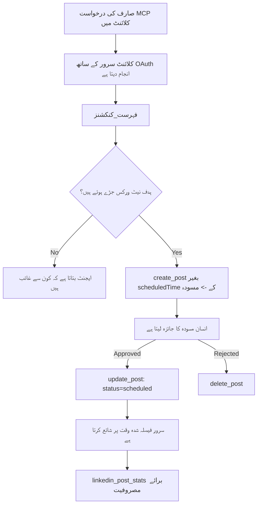

# کیس اسٹڈی: ایک ایجنٹ سے سوشل نیٹ ورکس پر پبلیشنگ، ریموٹ MCP سرور کے ساتھ

> **دستیابی:** متعدد خدمات اور اوپن سورس پروجیکٹس سوشل نیٹ ورکس پر پبلیش کر سکتے ہیں، اور ایک ٹیم ہر نیٹ ورک کے API کو براہ راست ضم بھی کر سکتی ہے۔ نیچے دیا گیا منظر نامہ ایک کام کرنے والا مثال کے طور پر فراہم کیا گیا ہے کہ کس طرح ایک **تحریر کے قابل ریموٹ MCP سرور** کو ڈیزائن اور استعمال کیا جا سکتا ہے۔ Publora ایک تجارتی خدمت ہے جس میں مفت سطح موجود ہے؛ یہاں بیان کیے گئے نمونے کسی بھی MCP سرور پر لاگو ہوتے ہیں جو صارف کی جانب سے ناقابل واپسی عمل انجام دیتا ہے۔

## جائزہ

ایجنٹس مواد کا مسودہ تیار کرنے میں اچھے ہوتے ہیں لیکن اسے پہنچانے میں کمزور۔ ایک ماڈل چند سیکنڈز میں ریلیز کا اعلان لکھ سکتا ہے، اور پھر کام رک جاتا ہے: اسے شائع کرنے کے لیے ہر نیٹ ورک کا API، ہر نیٹ ورک کا OAuth ایپ، اور ہر ایک کے لیے مختلف میڈیا قواعد درکار ہوتے ہیں۔ زیادہ تر ٹیمیں یہ مسئلہ ہاتھ سے متن کو براؤزر میں کاپی کرکے حل کرتی ہیں۔

یہ کیس اسٹڈی دیکھتی ہے کہ یہ آخری مرحلہ کیسے ایک واحد ریموٹ MCP سرور سے بند کیا جاتا ہے، اور — جو کوئی ایک بنا رہا ہو اس کے لیے زیادہ مفید — وہ ڈیزائن کے فیصلے جو ایک **تحریر کے قابل** سرور کو درست لینے ہوتے ہیں۔ ڈیٹا پڑھنا معاف کرنے والا ہوتا ہے۔ پبلیش کرنا نہیں: ایک غلط ٹول کال سامعین کے سامنے ظاہر ہوتی ہے اور اسے واپس نہیں لیا جا سکتا۔

## منظر نامہ

ایک چھوٹی ڈویلپر-ریلیشنز ٹیم ایجنٹ میں پوسٹس کا مسودہ تیار کرتی ہے (Claude، VS Code، Cursor — کلائنٹ اہم نہیں ہے)۔ وہ چاہتے ہیں کہ ایجنٹ:

- دیکھے کہ ٹیم نے کون سے سوشل اکاؤنٹس کو جوڑا ہے،
- ایک پوسٹ کا مسودہ بنائے اور اسے انسانی منظوری کے لیے مسودہ کے طور پر رکھے،
- ایک تصویر منسلک کرے،
- اسے منتخب شدہ وقت پر کئی نیٹ ورکس پر شیڈول کرے،
- اور بعد میں رپورٹ کرے کہ اس نے کیسا مظاہرہ کیا۔

خاص طور پر، وہ چاہتے ہیں کہ ایجنٹ تجربہ کر رہا ہو تو وہ غلطی سے پبلیش نہ کر سکے۔

## استعمال شدہ اوزار

- [Publora MCP Server](https://github.com/publora/mcp-server) — ایک ریموٹ MCP سرور (`streamable-http`) جو پبلیشنگ، شیڈولنگ، میڈیا اور لنکڈ ان تجزیاتی اوزار فراہم کرتا ہے۔ سرکاری MCP رجسٹری میں `com.publora/mcp-server` کے طور پر رجسٹر ہے۔

## مرحلہ بہ مرحلہ ورک فلو

1. **سرور سے کنیکٹ کریں۔** کلائنٹس جو OAuth بولتے ہیں وہ سرور کی اپنی اجازت اسکرین کے خلاف PKCE کے ساتھ آتھورائزیشن کوڈ کا عمل مکمل کرتے ہیں؛ جو کلائنٹس نہیں کرتے، جیسے کہ ہیڈلیس CLI، وہ ہیڈر میں Publora API کلید استعمال کرتے ہیں۔ دونوں راستے سپورٹ کیے جاتے ہیں، اور آپ کو کون سا ملتا ہے یہ کلائنٹ پر منحصر ہے، سرور پر نہیں۔
2. **کنیکشنز کی فہرست بنائیں۔** ایجنٹ `list_connections` کال کرتا ہے اور جوڑے گئے اکاؤنٹس ان کے شناخت کاروں کے ساتھ وصول کرتا ہے۔
3. **مسودہ تیار کریں۔** ایجنٹ بغیر شیڈول شدہ وقت کے `create_post` کال کرتا ہے۔ پوسٹ مسودہ کے طور پر محفوظ ہوتی ہے — کچھ بھی شائع نہیں ہوتا۔
4. **میڈیا منسلک کریں۔** پبلک تصویر کے URLs اسی کال میں دیے جاتے ہیں؛ سرور انہیں ڈاؤن لوڈ اور تصدیق کرتا ہے۔
5. **شیڈول کریں۔** انسان کی منظوری کے بعد، `update_post` پوسٹ کی حیثیت کو ISO 8601 وقت کے ساتھ شیڈول شدہ مقرر کرتا ہے۔
6. **ماپیں۔** LinkedIn کے لیے، `linkedin_post_stats` پوسٹ لائیو ہونے کے بعد انگیجمنٹ واپس کرتا ہے۔

## مثال کا پرامپٹ

```text
Which social accounts do I have connected?
Draft a post announcing our new changelog page, attach the screenshot at
https://example.com/changelog.png, and keep it as a draft — do not publish it.
Once I approve, schedule it to LinkedIn and Bluesky for tomorrow at 09:00 UTC.
```

## مرمیڈ فلوچارٹ



## تکنیکی عمل درآمد

نیچے دی گئی اسباق اس کیس اسٹڈی کے منتقل کیے جانے والے حصے ہیں۔

### کھلا انکشاف، تصدیق شدہ عمل درآمد

`tools/list` بغیر کریڈینشلز کے فراہم کیا جاتا ہے؛ ہر `tools/call` کے لیے ٹوکن ضروری ہے اور ورنہ `401` کے ساتھ `WWW-Authenticate` ہیڈر واپس آتا ہے جو محفوظ-resource میٹاڈیٹا کو ظاہر کرتا ہے۔ (سرور ایسی غیر تصدیق شدہ `initialize` کا بھی جواب دیتا ہے، جو صرف ان کلائنٹس کے لیے اہم ہے جو `2026-07-28` سے پہلے کے پروٹوکول ورژنز پر ہیں؛ اس نظرثانی نے ہینڈشیک کو مکمل طور پر ہٹا دیا۔)

یہ تفریق عمل میں اہم ہے۔ رجسٹریز، کیٹلاگز اور کلائنٹس ٹول کی سطح — نام، اسکیمے، تشریحات — کو راز رکھے بغیر انسپکٹ کر سکتے ہیں، جب کہ کچھ بھی گمنام طور پر *چلایا* نہیں جا سکتا۔ ایک سرور جو `initialize` کے لیے ٹوکن کا تقاضا کرتا ہے وہ ٹولنگ کے لیے مؤثر طور پر غیر مرئی ہوتا ہے؛ ایک سرور جو گمنام `tools/call` کی اجازت دیتا ہے وہ ذمہ داری کا حامل ہے۔

### رجسٹریشن: متحرک کلائنٹ رجسٹریشن، اور جو اس کی جگہ لیتا ہے

سرور `/.well-known/oauth-protected-resource` اور `/.well-known/oauth-authorization-server` کا اشتہار دیتا ہے، اور PKCE (`S256`) کے ساتھ آتھورائزیشن کوڈ فلو، ریفریش ٹوکنز، اور **متحرک کلائنٹ رجسٹریشن** کو سپورٹ کرتا ہے۔

متحرک رجسٹریشن دستی مرحلہ ختم کر دیتا ہے: اس کے بغیر ہر کلائنٹ کو پہلے سے جاری کردہ `client_id` چاہیے، جس کا مطلب ہر نئے کلائنٹ کے لیے وینڈر کو آف لائن درخواست دینا ہے۔

اسے مطابقت سلوک سمجھیں نہ کہ نقل کرنے کا ڈیزائن۔ وضاحت کی  `2026-07-28` نظرثانی متحرک کلائنٹ رجسٹریشن کو کلائنٹ ID میٹاڈیٹا ڈاکومنٹس کی طرف موقوف کرتی ہے، جہاں کلائنٹ ایک میٹاڈیٹا ڈاکومنٹ ایک مستحکم HTTPS  URL پر ہوست کرتا ہے اور وہ URL ہی `client_id` ہوتا ہے۔ DCR اب بھی کام کرتا ہے، لیکن آج بننے والا سرور CIMD کے لیے منصوبہ بندی کرے اور DCR کو صرف پرانے کلائنٹس کے لیے رکھے۔

### ٹول کی تشریحات صرف سجاوٹ نہیں

ہر ٹول ایک `title` اور قابل اطلاق اشارے رکھتا ہے: `readOnlyHint`, `destructiveHint`, `idempotentHint`, `openWorldHint`۔

ان میں سرمایہ کاری کے دو وجوہات۔ پہلی، کلائنٹس اشاروں کو استعمال کرتے ہیں تاکہ صارف سے کیا تصدیق کرنی ہے فیصلہ کریں — ایک کلائنٹ پڑھائی کے لیے خودکار طور پر لوک اپ کر سکتا ہے اور حذف کرنے سے پہلے منظوری کے لیے روک سکتا ہے۔ وضاحت واضح کرتی ہے کہ تشریحات غیر معتبر اشارے ہیں، اجازت کا طریقہ کار نہیں: یہ بتاتے ہیں کہ کلائنٹ کیا کرنے کا ارادہ رکھتا ہے، سرور پر کچھ نہیں روکتے، اور سرور کو اپنے قواعد پر عمل کرنا پڑتا ہے۔ دوسری، بڑے کنیکٹر ڈائریکٹریاں اب جائزے کے لیے ان کی *ضرورت* رکھتی ہیں؛ ایک سرور جس کے ٹولز میں عنوانات اور اشارے نہیں ہوں گے اس کو اس کی کارکردگی سے قطع نظر واپس بھیج دیا جائے گا۔

### شناخت کار ناقابل خیالی بنائیں

پلیٹ فارم شناخت کار مبہم تار ہوتے ہیں جو `list_connections` سے واپس آتے ہیں، اور اسکیمہ وضاحت واضح طور پر کہتی ہے کہ انہیں حرف بہ حرف نقل کیا جانا چاہیے اور کبھی قیاس نہیں کیا جانا چاہیے۔ سرور کسی اور چیز کو مسترد کر دیتا ہے۔

ماڈلز فلوئینٹ قیاس خوان ہوتے ہیں۔ کوئی بھی تحریر کے قابل سرور فرض کرے کہ ایک شناخت کار بالآخر خیالی ہو گا اور اسے بلند آواز اور جلد ناکام ہونا چاہیے، بجائے کہ ایک معقول معلوم ہونے والی قدر پر عمل کرنے کے۔

### پبلیش کرنے سے پہلے ناکام ہو، ایک قابل عمل پیغام کے ساتھ

کچھ نیٹ ورکس صرف متن پوسٹ کرنے سے انکار کرتے ہیں اور تصویر یا ویڈیو کی ضرورت ہوتی ہے۔ یہ جب پوسٹ شیڈول کی جاتی ہے تصدیق کیا جاتا ہے، اور غلطی میں پلیٹ فارم اور مطلوبہ چیز شامل ہوتی ہے۔

ایجنٹ "انسٹاگرام میڈیا کا تقاضا کرتا ہے — ایک تصویر یا ویڈیو منسلک کریں" سے دوبارہ سفر کیے بغیر بچ سکتا ہے۔ عام `400` سے نہیں بچ سکتا۔

### آزمائش کو محفوظ بنائیں

دو ٹولز جو مواد بناتے ہیں، `create_post` اور `update_post`, یکسانیت کلید قبول کرتے ہیں: اسے ایک ہی درخواست کے ساتھ دوبارہ استعمال کرنا اصل جواب کو دہرائے گا بجائے کہ دوسرا پوسٹ بنائے۔ ایجنٹ رن ٹائم ٹائم آؤٹ پر ری ٹرائی کرتے ہیں؛ یکسانیت کے بغیر، سست جواب نقل اشاعت بن جاتا ہے۔ دوسرے تحریری ٹولز — حذف، میڈیا کے مراحل، لنکڈ ان ردعمل اور تبصرے — ایک کلید نہیں لیتے، اس لیے وہاں ری ٹرائی خودکار طور پر محفوظ نہیں۔ یہ جاننا فائدہ مند ہے کہ آپ کی اپنی تبدیلیاں کون سی محفوظ اور کون سی نہیں۔

### ایک ایسا طریقہ فراہم کریں جو کچھ بھی شائع نہ کرے

سرور ایک مخصوص ہدف، `publora-playground` قبول کرتا ہے، جس کی تصدیق اور اعتراف حقیقی منزل کی طرح کی جاتی ہے اور پھر اسے ترک کر دیا جاتا ہے — کچھ بھی کسی لائیو اکاؤنٹ تک نہیں پہنچتا۔ اسے ٹول اسکیمہ میں خود بیان کیا گیا ہے، جسے کوئی بھی کلائنٹ بغیر اسناد کے پڑھ سکتا ہے: `create_post` کے  `platforms` فیلڈ میں اسے "ایک کنکشن ٹیسٹ ہدف جو حقیقی کنکشن کا تقاضا نہیں کرتا — پوسٹ کو تسلیم کیا جاتا ہے اور خارج کر دیا جاتا ہے، کچھ بھی شائع نہیں ہوتا" کے طور پر دستاویزی کیا گیا ہے۔ اسے واحد انٹری کے طور پر پاس کریں: `platforms: ["publora-playground"]`۔

یہ پورے سطح کی سب سے مفید تفصیلات میں سے ایک ثابت ہوا۔ کنیکٹر ڈائریکٹریوں کے جائزہ لینے والے، کنٹریبیوٹرز اور CI بغیر حقیقی سامعین کے خطرہ کے مکمل تحریری راستہ مکمل کر سکتے ہیں۔ کوئی بھی MCP سرور جس کے ناقابل واپسی عمل ہوں ایک دستاویزی نو-آپ ہدف سے فائدہ اٹھاتا ہے۔

## نتائج اور اثرات

- پبلیشنگ کا مرحلہ براؤزر سے اس ہی گفتگو میں منتقل ہو گیا جہاں مواد لکھا جاتا ہے، اور مسودہ-اول عادت ایک انسان کو عمل میں رکھتی ہے۔ اس کی درست وضاحت کریں: مسودہ ایک رواج ہے، سرحد نہیں۔ وہی سند ایک شیڈول یا پبلیش کر سکتی ہے، اس لیے جو واقعی منظوری کی ضرورت ہو اسے ٹول سطح کے باہر نافذ کرنا چاہیے — الگ اسناد، یا سرور کے سامنے ایک پالیسی پرت۔
- ہر نیٹ ورک کے فرق — میڈیا کی ضروریات، تھریڈنگ، جواب کنٹرول — کو ایک بار سرور میں سنبھالا جاتا ہے نہ کہ ہر ایجنٹ میں جو اس سے بات کرتا ہے۔
- وہی سرور کئی MCP کلائنٹس کو بغیر کلائنٹ مخصوص کام کے سپورٹ کرتا ہے، کیونکہ دریافت کھلی ہے اور رجسٹریشن متحرک ہے۔
- اوپر کے ڈیزائن پابندیاں کنیکٹر ڈائریکٹری جائزوں اور صارفین دونوں کی طرف سے تشکیل دی گئیں: تشریحات، OAuth اور ایک محفوظ ٹیسٹ ہدف ہر ایک کو کم از کم ایک نے لازمی قرار دیا تھا۔

## حوالہ جات

- [Publora MCP Server (ماخذ)](https://github.com/publora/mcp-server)
- [Publora API اور MCP دستاویزات](https://docs.publora.com)
- [MCP رجسٹری اندراج: `com.publora/mcp-server`](https://registry.modelcontextprotocol.io/v0/servers?search=com.publora/mcp-server)
- [MCP وضاحت — اجازت](https://modelcontextprotocol.io/specification/draft/basic/authorization)
- [MCP وضاحت — ٹول تشریحات](https://modelcontextprotocol.io/docs/concepts/tools)

## آگے کیا ہے

- جو MCP سرور آپ بنا رہے ہیں اسے لے کر یہاں تین سب سے سستے فائدے چیک کریں: ہر ٹول پر تشریحات، ہر تحریر پر یکسانیت کی کلید، اور ایک دستاویزی نو-آپ ہدف۔
- کھلا انکشاف تقسیم آزمائیں: بغیر اسناد کے کسی عوامی ریموٹ سرور پر `tools/list` کال کریں، پھر ایک ٹول کال کریں اور `401` چیلنج کا جائزہ لیں۔
- غور کریں کہ آپ کے ڈومین میں "undo" کیا معنی رکھتا ہے۔ پبلیشنگ میں مسودے اور حذف شامل ہیں؛ اگر آپ کے اعمال کا کوئی مساوی نہیں ہے، تو تصدیق ٹول ڈیزائن میں ہونی چاہیے، پرامپٹ میں نہیں۔

---

<!-- CO-OP TRANSLATOR DISCLAIMER START -->
**ڈس کلیمر**:
یہ دستاویز AI ترجمہ سروس [Co-op Translator](https://github.com/Azure/co-op-translator) کے ذریعے ترجمہ کی گئی ہے۔ جبکہ ہم درستگی کے لیے کوشاں ہیں، براہ کرم اس بات سے آگاہ رہیں کہ خودکار ترجمے میں غلطیاں یا عدم درستیاں ہو سکتی ہیں۔ اصل دستاویز اپنے مادری زبان میں مستند ماخذ سمجھی جائے گی۔ حساس معلومات کے لیے پیشہ ور انسانی ترجمہ کی سفارش کی جاتی ہے۔ اس ترجمے کے استعمال سے پیدا ہونے والی کسی بھی غلط فہمی یا غلط تشریح کی ذمہ داری ہم قبول نہیں کرتے۔
<!-- CO-OP TRANSLATOR DISCLAIMER END -->