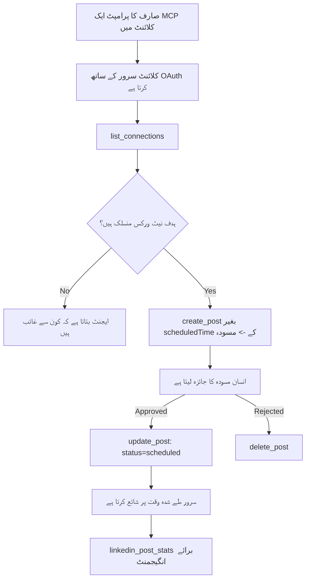

# کیس اسٹڈی: ایک ایجنٹ سے سوشل نیٹ ورکس پر ریموٹ MCP سرور کے ذریعے اشاعت

> **دستبرداری:** کئی سروسز اور اوپن سورس پروجیکٹس سوشل نیٹ ورکس پر اشاعت کر سکتے ہیں، اور ایک ٹیم ہر نیٹ ورک کے API کو براہ راست بھی ضم کر سکتی ہے۔ نیچے دیا گیا منظرنامہ اس بات کی ایک عملی مثال کے طور پر فراہم کیا گیا ہے کہ ایک **لکھنے کے قابل ریموٹ MCP سرور** کو کیسے ڈیزائن اور استعمال کیا جا سکتا ہے۔ Publora ایک تجارتی سروس ہے جس میں مفت طبقہ بھی شامل ہے؛ یہاں بیان کردہ پیٹرنز کسی بھی MCP سرور پر لاگو ہوتے ہیں جو صارف کی جانب سے ناقابل واپسی اعمال انجام دیتا ہے۔

## جائزہ

ایجنٹس مواد کا مسودہ تیار کرنے میں ماہر ہوتے ہیں لیکن اس کی ترسیل میں ناکام۔ ایک ماڈل سیکنڈوں میں ایک ریلیز کا اعلان لکھ سکتا ہے، اور پھر کام رک جاتا ہے: اسے ہر نیٹ ورک کے لیے ایک API، ہر نیٹ ورک کے لیے ایک OAuth ایپ، اور ہر ایک کے لیے مختلف میڈیا قواعد کی ضرورت ہوتی ہے۔ زیادہ تر ٹیمیں اس مسئلے کو ہاتھ سے براؤزر میں متن کاپی کر کے حل کرتی ہیں۔

یہ کیس اسٹڈی دیکھتی ہے کہ یہ آخری مرحلہ ایک ریموٹ MCP سرور کے ذریعے کس طرح مکمل کیا جاتا ہے، اور — ان کے لیے جو ایسا سرور بنا رہے ہیں — ان ڈیزائن کے فیصلوں پر جو ایک **لکھنے کے قابل** سرور کو درست کرنے ہوتے ہیں۔ ڈیٹا پڑھنا معاف کرنے والا ہے۔ اشاعت نہیں: غلط ٹول کال سامعین کے سامنے ظاہر ہوتی ہے اور اسے واپس نہیں لیا جا سکتا۔

## منظرنامہ

ایک چھوٹی ڈویلپر ریلیشنز ٹیم ایجنٹ (Claude، VS Code، Cursor — کلائنٹ سے کوئی فرق نہیں پڑتا) کے اندر پوسٹس کا مسودہ تیار کرتی ہے۔ وہ چاہتے ہیں کہ ایجنٹ:

- دیکھے کہ ٹیم نے کون سے سوشل اکاؤنٹس کو جوڑا ہے،
- ایک پوسٹ کا مسودہ تیار کرے اور اسے ایک مسودہ کے طور پر رکھے تاکہ انسان منظوری دے سکے،
- ایک تصویر منسلک کرے،
- اسے منتخب کردہ وقت پر کئی نیٹ ورکس پر شیڈول کرے،
- اور بعد میں رپورٹ کرے کہ اس کی کارکردگی کیسی رہی۔

بہت اہم بات یہ ہے کہ وہ چاہتے ہیں کہ ایجنٹ تجربے کے دوران غلطی سے شائع کرنے سے *قاصر* رہے۔

## استعمال شدہ ٹولز

- [Publora MCP Server](https://github.com/publora/mcp-server) — ایک ریموٹ MCP سرور (`streamable-http`) جو اشاعت، شیڈولنگ، میڈیا، اور LinkedIn انالٹکس ٹولز فراہم کرتا ہے۔ سرکاری MCP رجسٹری میں `com.publora/mcp-server` کے طور پر رجسٹرڈ ہے۔

## مرحلہ وار ورک فلو

1. **سرور سے کنکٹ کریں۔** OAuth بولنے والے کلائنٹس PKCE کے ساتھ سرور کی اپنی منظوری اسکرین کے خلاف authorization-code فلو مکمل کرتے ہیں؛ جو کلائنٹس ایسا نہیں کرتے، جیسے ہیڈ لیس CLI، وہ ایک ہیدر میں Publora API کلید استعمال کرتے ہیں۔ دونوں راستے مدد یافتہ ہیں، اور آپ کون سا حاصل کرتے ہیں یہ کلائنٹ پر منحصر ہے، سرور پر نہیں۔
2. **کنکشن کی فہرست حاصل کریں۔** ایجنٹ `list_connections` کال کرتا ہے اور منسلک اکاؤنٹس اپنے شناخت کنندگان کے ساتھ وصول کرتا ہے۔
3. **مسودہ تیار کریں۔** ایجنٹ بغیر شیڈول کردہ وقت کے `create_post` کال کرتا ہے۔ پوسٹ کو مسودے کے طور پر محفوظ کیا جاتا ہے — کچھ شائع نہیں ہوتا۔
4. **میڈیا منسلک کریں۔** پبلک تصویر کے لنکس ایک ہی کال میں پاس کیے جاتے ہیں؛ سرور انہیں ڈاؤن لوڈ اور تصدیق کرتا ہے۔
5. **شیڈول کریں۔** انسانی منظوری کے بعد، `update_post` حالت کو شیڈول شدہ ISO 8601 وقت کے ساتھ سیٹ کرتا ہے۔
6. **کارکردگی ماپیں۔** LinkedIn کے لیے، `linkedin_post_stats` پوسٹ لائیو ہونے پر انگیجمنٹ واپس کرتا ہے۔

## مثال پرامپٹ

```text
Which social accounts do I have connected?
Draft a post announcing our new changelog page, attach the screenshot at
https://example.com/changelog.png, and keep it as a draft — do not publish it.
Once I approve, schedule it to LinkedIn and Bluesky for tomorrow at 09:00 UTC.
```

## مرمیڈ فلوچارٹ



## تکنیکی نفاذ

نیچے دی گئی باتیں اس کیس اسٹڈی کا قابلِ منتقلی حصہ ہیں۔

### کھلی دریافت، مستند عمل درآمد

`tools/list` کو بغیر اسناد کے پیش کیا جاتا ہے؛ ہر `tools/call` کو ایک ٹوکن کی ضرورت ہوتی ہے
اور ورنہ یہ `401` واپس کرتا ہے جس میں `WWW-Authenticate` ہیڈر ہوتا ہے جو
محفوظ شدہ وسائل کے میٹا ڈیٹا کی طرف اشارہ کرتا ہے۔ سرور کا پرانا اینڈ پوائنٹ بھی غیر مستند
`initialize` کا جواب دیتا ہے پروٹوکول ورژنز سے پہلے کے کلائنٹس کے لیے
`2026-07-28`; موجودہ کلائنٹس اس ہینڈشییک کو استعمال نہیں کرتے۔

یہ سرور مخصوص تقسیم رجسٹریز، کیٹلاگز اور کلائنٹس کو بغیر راز کے ٹول کے
نام، اسکیمیں اور وضاحتیں دیکھنے دیتا ہے جبکہ گمنام عمل درآمد کو روکتا ہے۔
کھلی دریافت ایک تعیناتی کا انتخاب ہے، MCP کی شرط نہیں؛
محفوظ تعیناتی میں `tools/list` کے لیے بھی اجازت درکار ہو سکتی ہے۔

### رجسٹریشن: متحرک کلائنٹ رجسٹریشن، اور اس کی جگہ کیا لے رہا ہے

سرور `/.well-known/oauth-protected-resource` اور `/.well-known/oauth-authorization-server` کی تشہیر کرتا ہے، اور PKCE (`S256`) کے ساتھ authorization-code فلو، ریفریش ٹوکنز، اور **متحرک کلائنٹ رجسٹریشن** کی حمایت کرتا ہے۔

متحرک رجسٹریشن نے پرانے کلائنٹس کے لیے دستی قدم ختم کر دیا: اس کے بغیر،
ہر کلائنٹ کو وینڈر سے پہلے سے جاری کردہ `client_id` کی ضرورت تھی۔

اسے مطابقت پذیری رویے کے طور پر دیکھیں نہ کہ نقل کرنے کے لیے ڈیزائن کے طور پر۔ `2026-07-28` کی وضاحت میں متحرک کلائنٹ رجسٹریشن کو کلائنٹ ID میٹا ڈیٹا دستاویزات کے حق میں ختم کیا گیا ہے، جہاں کلائنٹ ایک مستحکم HTTPS URL پر میٹا ڈیٹا دستاویز میزبان کرتا ہے اور وہ URL *خود* `client_id` ہوتا ہے۔ DCR اب بھی کام کرتا ہے، لیکن آج بنایا جا رہا سرور CIMD کی تیاری کرے اور DCR صرف پرانے کلائنٹس کے لیے رکھے۔

### ٹول کی تشریحات صرف سجاوٹ نہیں ہیں

ہر ٹول کے ساتھ ایک `title` ہوتا ہے اور متعلقہ اشارے: `readOnlyHint`, `destructiveHint`, `idempotentHint`, `openWorldHint`۔

ان میں سرمایہ کاری کے دو اسباب۔ اول، کلائنٹس اشاروں کو دیکھ کر صارف سے تصدیق طلب کرتے ہیں — ایک کلائنٹ پڑھنے کے لیے خودکار تلاش کر سکتا ہے اور حذف کرنے سے پہلے منظوری روک سکتا ہے۔ وضاحت واضح کرتی ہے کہ تشریحات غیر معتبر اشارے ہیں، اجازت کی نہیں: وہ کلائنٹ کے کرنے کے طریقہ کو ظاہری شکل دیتے ہیں، سرور پر کچھ نہیں روکیں، اور سرور کو اپنے قواعد خود نافذ کرنے ہوتے ہیں۔ دوم، بڑے کنیکٹر ڈائریکٹریز اب ان کی جائزہ کے لیے *ضرورت* کرتے ہیں؛ ایسے سرور جن کے ٹولز کے عنوانات اور اشارے نہیں ہوتے، انہیں کام کی خوبی سے قطع نظر واپس بھیج دیا جاتا ہے۔

### شناخت کنندگان کو جعل سازی سے بچائیں

پلیٹ فارم شناخت کنندگان `list_connections` سے opaque strings میں واپس آتے ہیں، اور اسکیمہ وضاحت واضح طور پر کہتی ہے کہ انہیں عین مطابق نقل کیا جانا چاہیے اور کبھی اندازہ نہیں لگانا چاہیے۔ سرور کچھ اور قبول نہیں کرتا۔

ماڈلز آسان اندازہ زن ہوتے ہیں۔ ہر لکھنے کے قابل سرور کو فرض کرنا چاہیے کہ شناخت کنندہ بالآخر تشکیل دیئے ہوئے ہوسکتے ہیں اور اس مسیر کو بلند آواز سے جلد ناکام بنانا چاہیے، بجائے کہ کسی ممکنہ قدر پر عمل کرے۔

### اشاعت سے پہلے ناکام ہو جائیں، قابل عمل پیغام کے ساتھ

کچھ نیٹ ورکس صرف متن کی پوسٹس کو مسترد کرتے ہیں اور تصویر یا ویڈیو چاہتے ہیں۔ یہ اس وقت تصدیق کیا جاتا ہے جب پوسٹ شیڈول کی جاتی ہے، اور غلطی میں پلیٹ فارم اور گمشدہ ضرورت کا نام شامل ہوتا ہے۔

ایک ایجنٹ "انسٹاگرام کو میڈیا چاہیے — ایک تصویر یا ویڈیو منسلک کریں" سے بغیر دوبارہ سفر کے صحت یاب ہو سکتا ہے۔ یہ عام `400` سے صحت یاب نہیں ہو سکتا۔

### دوبارہ کوششیں محفوظ بنائیں

جو دو ٹولز مواد تخلیق کرتے ہیں، `create_post` اور `update_post`، وہ ایک idempotency کی قبول کرتے ہیں: اسے ایک ہی درخواست کے ساتھ دوبارہ استعمال کرنا اصل جواب دوبارہ دیتا ہے نہ کہ دوسری پوسٹ بناتا ہے۔ ایجنٹ رن ٹائم وقت ختم ہونے پر دوبارہ کوشش کرتے ہیں؛ بغیر idempotency کے، سست جواب ڈوپلیکٹ اشاعت بن جاتا ہے۔ باقی لکھنے والے ٹولز — حذف کرنا، میڈیا مراحل، LinkedIn ردعمل اور تبصرے — idempotency قبول نہیں کرتے، اس لیے وہاں دوبارہ کوشش خود بخود محفوظ نہیں۔ جاننا ضروری ہے کہ آپ کے اپنے کتنے ترامیم محفوظ ہیں اور کتنے نہیں۔

### ایسی آزمائش فراہم کریں جو کچھ نہ شائع کرے

سرور ایک مخصوص ہدف، `publora-playground` قبول کرتا ہے، جس کی تصدیق اور قبولیت ایک حقیقی منزل کی طرح ہوتی ہے اور پھر اسے ترک کر دیا جاتا ہے — کچھ بھی اصل اکاؤنٹ تک نہیں پہنچتا۔ یہ خود ٹول اسکیمہ میں بیان ہے، جسے کوئی بھی کلائنٹ بغیر اسناد کے پڑھ سکتا ہے: `create_post` کے `platforms` فیلڈ میں اسے "ایک کنکشن-ٹیسٹ ہدف کے طور پر دستاویزی کیا گیا ہے جو حقیقی کنکشن کی ضرورت نہیں — پوسٹ کو تسلیم کیا جاتا ہے اور ترک کر دیا جاتا ہے، کچھ شائع نہیں ہوتا"۔ اسے واحد اندراج کے طور پر پاس کریں: `platforms: ["publora-playground"]`۔

یہ پورے دائرہ کار کی سب سے زیادہ مفید تفصیلات میں سے ایک نکلا۔ کنیکٹر ڈائریکٹریز کے جائزہ نگار، تعاون کار اور CI مکمل لکھنے کے راستے کو بغیر کسی حقیقی خطرے کے ختم تک آزمائیں۔ کوئی بھی MCP سرور جو ناقابل واپسی اعمال کرتا ہے ایک دستاویزی no-op ہدف سے فائدہ اٹھاتا ہے۔

## نتائج اور اثرات

- اشاعت کا مرحلہ براؤزر سے اسی گفتگو میں منتقل ہو گیا جہاں مواد لکھا جاتا ہے، اور ایک مسودہ-پہلے کی عادت انسان کو عمل میں رکھتی ہے۔ واضح کریں کہ مسودہ کیا ہے: ایک مسودہ ایک رسم ہے، حد نہیں۔ ایک ہی سند شیڈول یا اشاعت کر سکتی ہے، اس لیے جو کوئی حقیقی منظوری کا دروازہ چاہتا ہے اسے ٹول سطح کے باہر نافذ کرنا ہوگا — الگ اسناد، یا سرور کے سامنے ایک پالیسی پرت۔
- ہر نیٹ ورک کے اختلافات — میڈیا کی ضروریات، تھریڈنگ، جواب کنٹرول — کو سرور میں ایک بار سنبھالا جاتا ہے بجائے ہر ایجنٹ کے جو اس سے بات کرتا ہے۔
- ایک ہی سرور کئی MCP کلائنٹس کی پشت پناہی کرتا ہے بغیر پہلے سے جاری کردہ اسناد کے۔
    موجودہ کلائنٹس Client ID Metadata Documents استعمال کر سکتے ہیں؛ DCR بطور بیک اپ رہتا ہے
    پرانے کلائنٹس کے لیے۔
- مذکورہ بالا ڈیزائن پابندیاں کنیکٹر ڈائریکٹری کے جائزوں سے جتنی یوزرز سے متأثر ہوئیں، اتنی ہی: تشریحات، OAuth، اور ایک محفوظ ٹیسٹ ہدف ہر ایک کم از کم ایک سے مانگا گیا تھا۔

## حوالہ جات

- [Publora MCP Server (ماخذ)](https://github.com/publora/mcp-server)
- [Publora API اور MCP دستاویزات](https://docs.publora.com)
- [MCP رجسٹری اندراج: `com.publora/mcp-server`](https://registry.modelcontextprotocol.io/v0/servers?search=com.publora/mcp-server)
- [MCP وضاحت — اجازت](https://modelcontextprotocol.io/specification/2026-07-28/basic/authorization)
- [MCP وضاحت — ٹول تشریحات](https://modelcontextprotocol.io/docs/concepts/tools)

## اگلا کیا ہے

- ایک MCP سرور لیں جو آپ بنا رہے ہیں اور یہاں تین سب سے آسان فتوحات چیک کریں: ہر ٹول پر تشریحات، ہر لکھنے پر idempotency کی، اور ایک دستاویزی no-op ہدف۔
- کھلی دریافت کی تقسیم آزمایں: بغیر اسناد کے ایک پبلک ریموٹ سرور کے خلاف `tools/list` کال کریں، پھر ایک ٹول کال کریں اور `401` چیلنج کو دیکھیں۔
- غور کریں کہ "undo" کا آپ کے دائرہ کار میں کیا مطلب ہے۔ اشاعت کے پاس مسودے اور حذف کرنا شامل ہیں؛ اگر آپ کے اعمال کا کوئی متبادل نہیں، تو تصدیق ٹول ڈیزائن میں ہو، پرامپٹ میں نہیں۔

---

<!-- CO-OP TRANSLATOR DISCLAIMER START -->
**ڈس کلیمر**:
یہ دستاویز AI ترجمہ سروس [Co-op Translator](https://github.com/Azure/co-op-translator) کے ذریعے ترجمہ کی گئی ہے۔ جبکہ ہم درستگی کے لیے کوشاں ہیں، براہ کرم اس بات سے آگاہ رہیں کہ خودکار ترجمے میں غلطیاں یا عدم درستیاں ہو سکتی ہیں۔ اصل دستاویز اپنے مادری زبان میں مستند ماخذ سمجھی جائے گی۔ حساس معلومات کے لیے پیشہ ور انسانی ترجمہ کی سفارش کی جاتی ہے۔ اس ترجمے کے استعمال سے پیدا ہونے والی کسی بھی غلط فہمی یا غلط تشریح کی ذمہ داری ہم قبول نہیں کرتے۔
<!-- CO-OP TRANSLATOR DISCLAIMER END -->