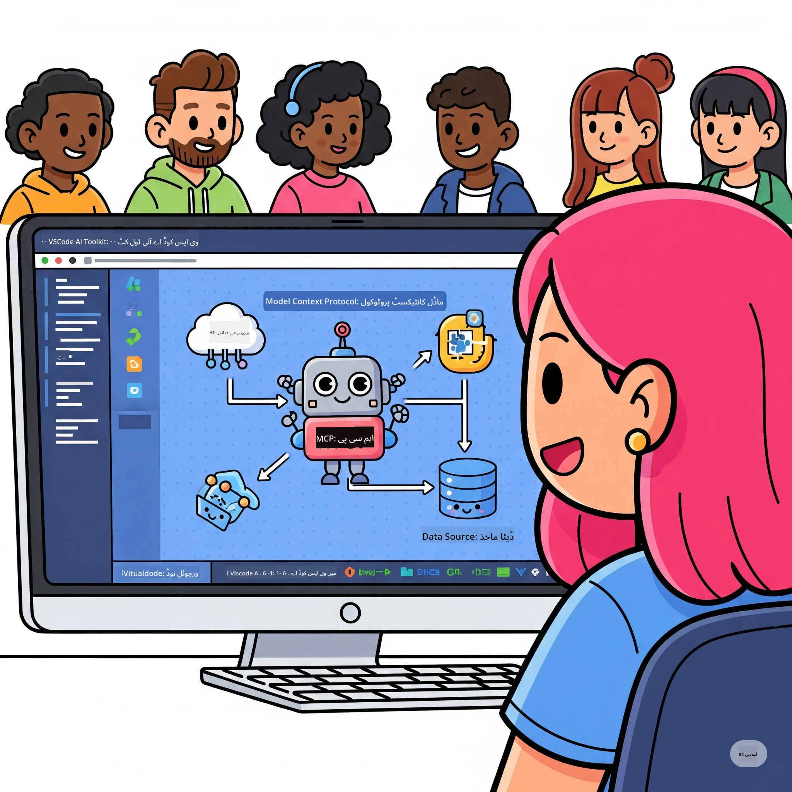

# اے آئی ورک فلو کو ہموار کرنا: مائیکروسافٹ فاؤنڈری ٹول کٹ کے ساتھ MCP سرور بنانا

## 🎯 جائزہ

_(اس سبق کی ویڈیو دیکھنے کے لیے اوپر تصویر پر کلک کریں)_

آپ کو **ماڈل کانٹیکسٹ پروٹوکول (MCP) ورکشاپ** میں خوش آمدید کہا جاتا ہے! یہ جامع عملی ورکشاپ دو جدید ٹیکنالوجیز کو یکجا کرتی ہے تاکہ AI ایپلیکیشن کی ترقی میں انقلاب برپا کیا جا سکے:

> **مطابقت کا نوٹ:** ورکشاپ کا کوڈ MCP
> `2025-11-25` کے ساتھ بنایا اور جانچا گیا ہے، جیسا کہ اوپر بیج میں دکھایا گیا ہے۔ استعمال کریں
> [موجودہ `2026-07-28` وضاحت](https://modelcontextprotocol.io/specification/2026-07-28/)
> نئے پروٹوکول کے نفاذ کے لیے اور SDK کے ریلیز نوٹس کا جائزہ لیں
> لیبارٹریوں کو منتقل کرنے سے پہلے۔

- **🔗 ماڈل کانٹیکسٹ پروٹوکول (MCP)**: AI ٹول انٹیگریشن کے لیے ایک کھلا معیار
- **🛠️ مائیکروسافٹ فاؤنڈری ٹول کٹ ایکسٹینشن برائے VS کوڈ**: مائیکروسافٹ کی طاقتور AI ڈویلپمنٹ ایکسٹینشن

### 🎓 آپ کیا سیکھیں گے

اس ورکشاپ کے آخر تک، آپ ذہین ایپلیکیشنز بنانے کا فن سیکھ جائیں گے جو AI ماڈلز کو حقیقی دنیا کے ٹولز اور سروسز کے ساتھ مربوط کریں گی۔ خودکار ٹیسٹنگ سے لے کر کسٹم API انٹیگریشن تک، آپ پیچیدہ کاروباری چیلنجز حل کرنے کے عملی مہارتیں حاصل کریں گے۔

## 🏗️ ٹیکنالوجی اسٹیک

### 🔌 ماڈل کانٹیکسٹ پروٹوکول (MCP)

MCP "AI کے لیے USB-C" ہے - ایک یونیورسل معیار جو AI ماڈلز کو بیرونی ٹولز اور ڈیٹا ذرائع سے جوڑتا ہے۔

**✨ اہم خصوصیات:**

- 🔄 **معیاری انٹیگریشن**: AI ٹول کنکشنز کے لیے یونیورسل انٹرفیس
- 🏛️ **لچکدار آرکیٹیکچر**: مقامی اور ریموٹ سرورز stdio/SSE ٹرانسپورٹ کے ذریعے
- 🧰 **رچ ایکو سسٹم**: ایک ہی پروٹوکول میں ٹولز، پرامپٹس، اور وسائل
- 🔒 **انٹرپرائز-ریڈی**: بلٹ ان سیکیورٹی اور قابل اعتماد

**🎯 MCP کی اہمیت:**
بالکل USB-C کی طرح جس نے کیبل کے الجھن کو ختم کیا، MCP AI انٹیگریشن کی پیچیدگی کو ختم کرتا ہے۔ ایک پروٹوکول، لامتناہی امکانات۔

### 🤖 مائیکروسافٹ فاؤنڈری ٹول کٹ ایکسٹینشن برائے VS کوڈ

مائیکروسافٹ کی نمایاں AI ترقی کی ایکسٹینشن جو VS کوڈ کو AI پاور ہاؤس میں تبدیل کرتی ہے۔

**🚀 بنیادی صلاحیتیں:**

- 📦 **ماڈل کیٹلاگ**: Azure AI، GitHub، Hugging Face، اور Ollama سے ماڈلز تک رسائی
- ⚡ **مقامی انفیرینس**: ONNX-آپٹمائزڈ CPU/GPU/NPU ایکزیکیشن
- 🏗️ **ایجنٹ بلڈر**: MCP انٹیگریشن کے ساتھ بصری AI ایجنٹ کی ترقی
- 🎭 **کثیرالطریقہ**: متن، وژن، اور ساختہ آؤٹ پٹ کی حمایت

**💡 ترقی کے فائدے:**

- زیرو-کنفیگریشن ماڈل تعیناتی
- بصری پرامپٹ انجینئرنگ
- حقیقی وقت کا ٹیسٹنگ پلیگراونڈ
- ہموار MCP سرور انٹیگریشن

## 📚 سیکھنے کا سفر

### [🚀 ماڈیول 1: مائیکروسافٹ فاؤنڈری ٹول کٹ کے بنیادی اصول](./lab1/README.md)

**دورانیہ**: 15 منٹ

- 🛠️ VS کوڈ کے لیے مائیکروسافٹ فاؤنڈری ٹول کٹ انسٹال کریں اور ترتیبات کریں
- 🗂️ ماڈل کیٹلاگ (GitHub، ONNX، OpenAI، Anthropic، Google کے 100+ ماڈلز) دریافت کریں
- 🎮 حقیقی وقت ماڈل ٹیسٹنگ کے لیے انٹریکٹو پلیگراونڈ میں مہارت حاصل کریں
- 🤖 ایجنٹ بلڈر کے ذریعے اپنا پہلا AI ایجنٹ بنائیں
- 📊 بلٹ ان میٹرکس (F1، مطابقت، مماثلت، مطابقت) کے ساتھ ماڈل کی کارکردگی کا جائزہ لیں
- ⚡ بیچ پروسیسنگ اور کثیرالطریقہ حمایت کی صلاحیتیں سیکھیں

**🎯 سیکھنے کا نتیجہ**: مائیکروسافٹ فاؤنڈری ٹول کٹ کی صلاحیتوں کی مکمل سمجھ کے ساتھ ایک فعال AI ایجنٹ بنائیں

### [🌐 ماڈیول 2: مائیکروسافٹ فاؤنڈری ٹول کٹ کے ساتھ MCP کی بنیادی باتیں](./lab2/README.md)

**دورانیہ**: 20 منٹ

- 🧠 ماڈل کانٹیکسٹ پروٹوکول (MCP) کے آرکیٹیکچر اور تصورات میں مہارت حاصل کریں
- 🌐 مائیکروسافٹ کے MCP سرور ایکو سسٹم کو دریافت کریں
- 🤖 Playwright MCP سرور کا استعمال کرتے ہوئے براؤزر آٹومیشن ایجنٹ بنائیں
- 🔧 MCP سرورز کو مائیکروسافٹ فاؤنڈری ٹول کٹ ایجنٹ بلڈر کے ساتھ انٹیگریٹ کریں
- 📊 اپنے ایجنٹس میں MCP ٹولز کو ترتیب دیں اور ٹیسٹ کریں
- 🚀 MCP سے چلنے والے ایجنٹس کو پروڈکشن میں برآمد اور تعینات کریں

**🎯 سیکھنے کا نتیجہ**: MCP کے ذریعے بیرونی ٹولز کے ساتھ طاقتور AI ایجنٹ تعینات کریں

### [🔧 ماڈیول 3: مائیکروسافٹ فاؤنڈری ٹول کٹ کے ساتھ اعلی درجے کی MCP ترقی](./lab3/README.md)

**دورانیہ**: 20 منٹ

- 💻 مائیکروسافٹ فاؤنڈری ٹول کٹ کا استعمال کرتے ہوئے تخصیصی MCP سرورز بنائیں
- 🐍 جدید ترین MCP Python SDK (v1.9.3) ترتیب دیں اور استعمال کریں
- 🔍 ڈیبگنگ کے لیے MCP انسپیکٹر سیٹ اپ اور استعمال کریں
- 🛠️ پیشہ ورانہ ڈیبگنگ ورک فلو کے ساتھ ایک ویڈر MCP سرور بنائیں
- 🧪 ایجنٹ بلڈر اور انسپیکٹر ماحولیات دونوں میں MCP سرورز کی خرابیوں کو دور کریں

**🎯 سیکھنے کا نتیجہ**: جدید ٹولنگ کے ساتھ تخصیصی MCP سرورز تیار کریں اور ڈیبگ کریں

### [🐙 ماڈیول 4: عملی MCP ترقی - کسٹم GitHub کلون سرور](./lab4/README.md)

**دورانیہ**: 30 منٹ

- 🏗️ حقیقی دنیا کے GitHub کلون MCP سرور کو ترقیاتی ورک فلو کے لیے بنائیں
- 🔄 اسمارٹ ریپوزیٹری کلوننگ اور تصدیق اور ایرر ہینڈلنگ کا نفاذ کریں
- 📁 ذہین ڈائریکٹری مینجمنٹ اور VS کوڈ انٹیگریشن تخلیق کریں
- 🤖 کسٹم MCP ٹولز کے ساتھ GitHub کوپائلٹ ایجنٹ موڈ استعمال کریں
- 🛡️ پروڈکشن-ریڈی قابل اعتماد اور کراس-پلیٹ فارم مطابقت لاگو کریں

**🎯 سیکھنے کا نتیجہ**: ایک پروڈکشن-ریڈی MCP سرور تعینات کریں جو حقیقت کے ترقیاتی ورک فلو کو ہموار کرے

## 💡 حقیقی دنیا کی ایپلیکیشنز اور اثر

### 🏢 ادارہ جاتی استعمال کے کیسز

#### 🔄 ڈیواپس آٹومیشن

اپنے ترقیاتی ورک فلو کو ذہین آٹومیشن کے ساتھ تبدیل کریں:

- **اسمارٹ ریپوزیٹری مینجمنٹ**: AI پر مبنی کوڈ ریویو اور مرج کے فیصلے
- **ذہین CI/CD**: کوڈ تبدیلیوں کی بنیاد پر خودکار پائپ لائن کی اصلاح
- **مسئلہ کی ترجیح بندی**: خودکار بگ کی درجہ بندی اور تفویض

#### 🧪 کوالٹی ایشورنس میں انقلاب

AI-چلائے گئے آٹومیشن کے ساتھ ٹیسٹنگ کو بلند کریں:

- **ذہین ٹیسٹ جنریشن**: خودکار مکمل ٹیسٹ سوٹ بنائیں
- **بصری ریگریشن ٹیسٹنگ**: AI سے چلنے والا UI تبدیلی کا پتہ لگانا
- **کارکردگی کی نگرانی**: فعال مسئلہ شناخت اور حل

#### 📊 ڈیٹا پائپ لائن انٹیلی جنس

ذہین ڈیٹا پروسیسنگ ورک فلو بنائیں:

- **ایڈاپٹو ای ٹی ایل پروسیسز**: خود کو بہتر بنانے والے ڈیٹا تبدیلیاں
- **انوکھا پن کی شناخت**: حقیقی وقت میں ڈیٹا کی معیار کی نگرانی
- **ذہین راستہ سازی**: اسمارٹ ڈیٹا فلو مینجمنٹ

#### 🎧 صارف کے تجربے میں بہتری

غیر معمولی صارف تعاملات پیدا کریں:

- **سیاق و سباق سے آگاہ سپورٹ**: AI ایجنٹس جنہیں صارف کی تاریخ تک رسائی حاصل ہے
- **پیشگی مسئلہ حل کرنا**: پیش گوئی پر مبنی صارف خدمت
- **کثیر چینل انضمام**: تمام پلیٹ فارمز پر متحد AI تجربہ

## 🛠️ ضروریات اور سیٹ اپ

### 💻 نظام کی ضروریات

| جزو | ضرورت | نوٹس |
|-----------|-------------|-------|
| **آپریٹنگ سسٹم** | ونڈوز 10+, میک او ایس 10.15+, لینکس | کوئی بھی جدید OS |
| **ویژول اسٹوڈیو کوڈ** | جدید مستحکم ورژن | مائیکروسافٹ فاؤنڈری ٹول کٹ کے لیے ضروری |
| **نوڈ.جے ایس** | v18.0+ اور npm | MCP سرور کی ترقی کے لیے |
| **پائتھون** | 3.10+ | پائتھون MCP سرورز کے لیے اختیاری |
| **میموری** | کم از کم 8GB ریم | مقامی ماڈلز کے لیے 16GB سفارش کی گئی |

### 🔧 ترقیاتی ماحول

#### سفارش کردہ وی ایس کوڈ ایکسٹینشنز

- **مائیکروسافٹ فاؤنڈری ٹول کٹ** (ms-windows-ai-studio.windows-ai-studio)
- **پائتھون** (ms-python.python)
- **پائتھون ڈی بگر** (ms-python.debugpy)
- **گٹ ہب کوپائلٹ** (GitHub.copilot) - اختیاری مگر مددگار

#### اختیاری ٹولز

- **uv**: جدید پائتھون پیکیج مینیجر
- **MCP انسپکٹر**: MCP سرورز کے لیے بصری ڈی بگنگ ٹول
- **پلے رائٹ**: ویب آٹومیشن کی مثالوں کے لیے

## 🎖️ سیکھنے کے نتائج اور تصدیقی راستہ

### 🏆 مہارت کی چیک لسٹ

اس ورکشاپ کو مکمل کر کے، آپ درج ذیل مہارت حاصل کر لیں گے:

#### 🎯 بنیادی صلاحیتیں

- [ ] **MCP پروٹوکول مہارت**: فن تعمیر اور نفاذ کے نمونوں کی گہری سمجھ
- [ ] **مائیکروسافٹ فاؤنڈری ٹول کٹ کی مہارت**: تیز ترقی کے لیے ماہر سطح کا استعمال
- [ ] **کسٹم سرور کی ترقی**: تیارکردہ MCP سرورز کی تعمیر، تعیناتی، اور دیکھ بھال
- [ ] **ٹول انضمام میں مہارت**: AI کو موجودہ ترقیاتی ورک فلو کے ساتھ یکجا کرنا
- [ ] **مسئلہ حل کرنے کی درخواست**: سیکھی ہوئی مہارتوں کو حقیقی کاروباری مسائل پر نافذ کرنا

#### 🔧 تکنیکی مہارتیں

- [ ] VS کوڈ میں مائیکروسافٹ فاؤنڈری ٹول کٹ کو سیٹ اپ اور تشکیل دینا
- [ ] کسٹم MCP سرورز کی ڈیزائن اور نفاذ
- [ ] MCP فن تعمیر کے ساتھ GitHub ماڈلز کا انضمام
- [ ] پلے رائٹ کے ساتھ خودکار ٹیسٹنگ ورک فلو بنانا
- [ ] پیداوار کے لیے AI ایجنٹس کی تعیناتی
- [ ] MCP سرور کی کارکردگی کی ڈی بگنگ اور بہتر بنانا

#### 🚀 اعلی صلاحیتیں

- [ ] انٹرپرائز پیمانے پر AI انضمام کی فن تعمیر
- [ ] AI ایپلیکیشنز کے لیے بہترین حفاظتی طریقہ کار کا نفاذ
- [ ] پیمانے پر قابل MCP سرور فن تعمیر کی ڈیزائن
- [ ] مخصوص شعبوں کے لیے کسٹم ٹول چینز بنانا
- [ ] AI-نیٹو ترقی میں دوسروں کی رہنمائی کرنا

## 📖 اضافی وسائل

- [MCP وضاحت (2026-07-28)](https://modelcontextprotocol.io/specification/2026-07-28/)
- [مائیکروسافٹ فاؤنڈری ٹول کٹ کا GitHub ریپوزیٹری](https://github.com/microsoft/vscode-ai-toolkit)
- [نمونہ MCP سرورز کا مجموعہ](https://github.com/modelcontextprotocol/servers)
- [بہترین طریقوں کی رہنمائی](https://modelcontextprotocol.io/docs/best-practices)
- [OWASP MCP ٹاپ 10](https://microsoft.github.io/mcp-azure-security-guide/mcp/) - حفاظتی بہترین طریقے

---

**🚀 کیا آپ اپنے AI ترقیاتی ورک فلو کو انقلابی بنانے کے لیے تیار ہیں؟**

آئیے MCP اور مائیکروسافٹ فاؤنڈری ٹول کٹ کے ساتھ ذہین ایپلیکیشنز کے مستقبل کو مل کر تعمیر کریں!

## آگے کیا ہے

جاری رکھیں: [ماڈیول 11: MCP سرور ہینڈز-آن لیبز](../11-MCPServerHandsOnLabs/README.md)

---

<!-- CO-OP TRANSLATOR DISCLAIMER START -->
**ڈس کلیمر**:
یہ دستاویز AI ترجمہ سروس [Co-op Translator](https://github.com/Azure/co-op-translator) کے ذریعے ترجمہ کی گئی ہے۔ جبکہ ہم درستگی کے لیے کوشاں ہیں، براہ کرم اس بات سے آگاہ رہیں کہ خودکار ترجمے میں غلطیاں یا عدم درستیاں ہو سکتی ہیں۔ اصل دستاویز اپنے مادری زبان میں مستند ماخذ سمجھی جائے گی۔ حساس معلومات کے لیے پیشہ ور انسانی ترجمہ کی سفارش کی جاتی ہے۔ اس ترجمے کے استعمال سے پیدا ہونے والی کسی بھی غلط فہمی یا غلط تشریح کی ذمہ داری ہم قبول نہیں کرتے۔
<!-- CO-OP TRANSLATOR DISCLAIMER END -->