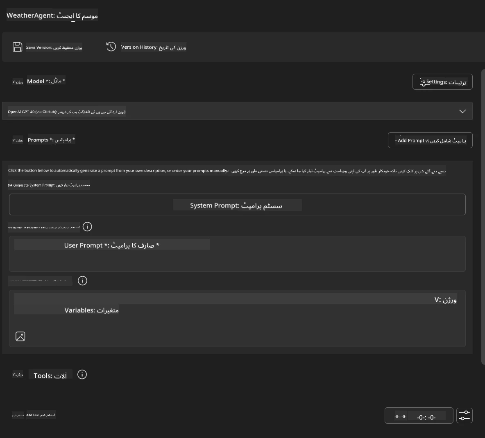
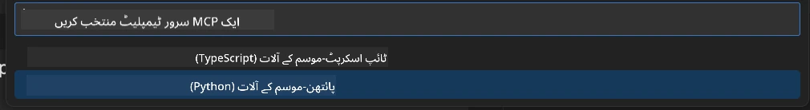
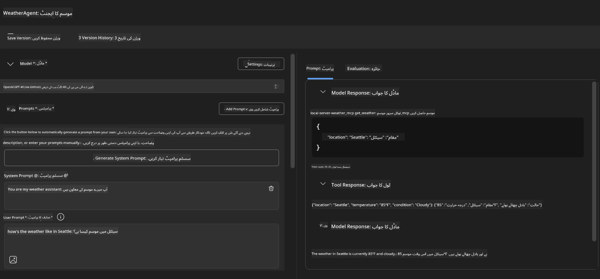
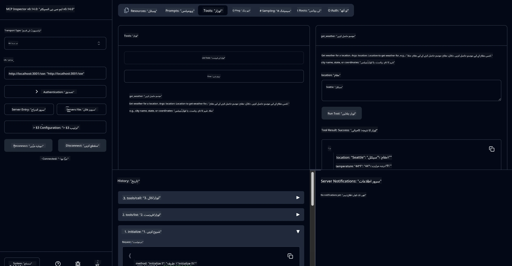

# 🔧 ماڈیول 3: Microsoft Foundry Toolkit کے ساتھ پیش رفت MCP ڈویلپمنٹ

> [!NOTE]
> اس لیب میں انسکپٹر URLs پراچین `/sse` اینڈ پوائنٹ استعمال کرتے ہیں اور منتخب MCP SDK `1.9.3` اور انسکپٹر `0.14.0` انحصار کو ہدف بناتے ہیں۔ یہ موجودہ `2026-07-28` اسٹریم ایبل HTTP مثالیں نہیں ہیں۔
> 
> 


## 🎯 سیکھنے کے مقاصد

اس لیب کے آخر تک، آپ کر سکیں گے:

- ✅ Microsoft Foundry Toolkit کا استعمال کرتے ہوئے کسٹم MCP سرورز بنائیں
- ✅ جدید ترین MCP پائتھن SDK (v1.9.3) کی ترتیب اور استعمال
- ✅ ڈیبگنگ کے لئے MCP انسکپٹر سیٹ اپ اور استعمال کریں
- ✅ ایجنٹ بلڈر اور انسکپٹر دونوں ماحول میں MCP سرورز کی خرابی تلاش کریں
- ✅ اعلی درجے کے MCP سرور ڈویلپمنٹ ورک فلو کو سمجھیں

## 📋 ضروریات برائے مڤلقہ

- لیب 2 (MCP بنیادیات) کی تکمیل
- VS کوڈ میں Microsoft Foundry Toolkit ایکسٹینشن نصب
- پائتھن 3.10+ ماحول
- انسکپٹر سیٹ اپ کے لئے Node.js اور npm

## 🏗️ آپ کیا بنائیں گے

اس لیب میں، آپ ایک **موسمیاتی MCP سرور** بنائیں گے جو درج ذیل کی نمائش کرتا ہے:
- کسٹم MCP سرور نفاذ
- Microsoft Foundry Toolkit ایجنٹ بلڈر کے ساتھ انضمام
- پروفیشنل ڈیبگنگ ورک فلو
- جدید MCP SDK استعمال کے انداز

---

## 🔧 بنیادی اجزاء کا جائزہ

### 🐍 MCP پائتھن SDK
ماڈل کانٹیکسٹ پروٹوکول پائتھن SDK کسٹم MCP سرورز بنانے کے لئے بنیاد فراہم کرتا ہے۔ آپ ورژن 1.9.3 استعمال کریں گے جس میں بہتر ڈیبگنگ صلاحیتیں ہیں۔

### 🔍 MCP انسکپٹر
ایک طاقتور ڈیبگنگ ٹول جو فراہم کرتا ہے:
- حقیقی وقت سرور کی نگرانی
- ٹول کی عمل درآمد کی وضاحت
- نیٹ ورک درخواست/جواب کی جانچ
- انٹرایکٹو ٹیسٹنگ ماحول

---

## 📖 مرحلہ وار عملدرآمد

### مرحلہ 1: ایجنٹ بلڈر میں WeatherAgent بنائیں

1. **VS کوڈ میں Microsoft Foundry Toolkit ایکسٹینشن کے ذریعہ ایجنٹ بلڈر شروع کریں**
2. **مندرجہ ذیل ترتیب کے ساتھ نیا ایجنٹ بنائیں:**
   - ایجنٹ کا نام: `WeatherAgent`



### مرحلہ 2: MCP سرور پروجیکٹ کا آغاز کریں

1. **ایجنٹ بلڈر میں Tools → Add Tool پر جائیں**
2. **دستیاب اختیارات میں سے "MCP Server" منتخب کریں**
3. **"Create A new MCP Server" منتخب کریں**
4. **`python-weather` ٹیمپلیٹ منتخب کریں**
5. **اپنے سرور کا نام رکھیں:** `weather_mcp`



### مرحلہ 3: پروجیکٹ کھولیں اور جائزہ لیں

1. **بنائے گئے پروجیکٹ کو VS کوڈ میں کھولیں**
2. **پروجیکٹ کی ساخت کا جائزہ لیں:**
   ```
   weather_mcp/
   ├── src/
   │   ├── __init__.py
   │   └── server.py
   ├── inspector/
   │   ├── package.json
   │   └── package-lock.json
   ├── .vscode/
   │   ├── launch.json
   │   └── tasks.json
   ├── pyproject.toml
   └── README.md
   ```

### مرحلہ 4: جدید MCP SDK پر اپ گریڈ کریں

> **🔍 کیوں اپ گریڈ کریں؟** ہم جدید MCP SDK (v1.9.3) اور انسکپٹر سروس (0.14.0) استعمال کرنا چاہتے ہیں تاکہ بہتر خصوصیات اور بہتر ڈیبگنگ صلاحیتیں حاصل ہوں۔

#### 4a. پائتھن انحصار کو اپ ڈیٹ کریں

**`pyproject.toml` میں ترمیم کریں:** [./code/weather_mcp/pyproject.toml](../../../../10-StreamliningAIWorkflowsBuildingAnMCPServerWithAIToolkit/lab3/code/weather_mcp/pyproject.toml) کو اپ ڈیٹ کریں


#### 4b. انسکپٹر کی ترتیب اپ ڈیٹ کریں

**`inspector/package.json` میں ترمیم کریں:** [./code/weather_mcp/inspector/package.json](../../../../10-StreamliningAIWorkflowsBuildingAnMCPServerWithAIToolkit/lab3/code/weather_mcp/inspector/package.json) کو اپ ڈیٹ کریں

#### 4c. انسکپٹر انحصار اپ ڈیٹ کریں

**`inspector/package-lock.json` میں ترمیم کریں:** [./code/weather_mcp/inspector/package-lock.json](../../../../10-StreamliningAIWorkflowsBuildingAnMCPServerWithAIToolkit/lab3/code/weather_mcp/inspector/package-lock.json) کو اپ ڈیٹ کریں

> **📝 نوٹ:** یہ فائل وسیع انحصار کی تعریفیں رکھتی ہے۔ نیچے ضروری ساخت دی گئی ہے - مکمل مواد صحیح انحصار کی وضاحت کے لئے ہے۔


> **⚡ مکمل پیکج لاک:** مکمل package-lock.json میں تقریباً 3000 لائنز کی انحصار کی تعریفیں شامل ہیں۔ اوپر کی ساخت کلیدی ہے - مکمل انحصار کی وضاحت کے لیے فراہم کردہ فائل استعمال کریں۔

### مرحلہ 5: VS کوڈ ڈیبگنگ ترتیب دیں

*نوٹ: براہ کرم مخصوص راستے میں فائل کو کاپی کریں تاکہ متعلقہ مقامی فائل کی جگہ لے سکے*

#### 5a. لانچ کنفیگریشن اپ ڈیٹ کریں

**`.vscode/launch.json` میں ترمیم کریں:**

```json
{
  "version": "0.2.0",
  "configurations": [
    {
      "name": "Attach to Local MCP",
      "type": "debugpy",
      "request": "attach",
      "connect": {
        "host": "localhost",
        "port": 5678
      },
      "presentation": {
        "hidden": true
      },
      "internalConsoleOptions": "neverOpen",
      "postDebugTask": "Terminate All Tasks"
    },
    {
      "name": "Launch Inspector (Edge)",
      "type": "msedge",
      "request": "launch",
      "url": "http://localhost:6274?timeout=60000&serverUrl=http://localhost:3001/sse#tools",
      "cascadeTerminateToConfigurations": [
        "Attach to Local MCP"
      ],
      "presentation": {
        "hidden": true
      },
      "internalConsoleOptions": "neverOpen"
    },
    {
      "name": "Launch Inspector (Chrome)",
      "type": "chrome",
      "request": "launch",
      "url": "http://localhost:6274?timeout=60000&serverUrl=http://localhost:3001/sse#tools",
      "cascadeTerminateToConfigurations": [
        "Attach to Local MCP"
      ],
      "presentation": {
        "hidden": true
      },
      "internalConsoleOptions": "neverOpen"
    }
  ],
  "compounds": [
    {
      "name": "Debug in Agent Builder",
      "configurations": [
        "Attach to Local MCP"
      ],
      "preLaunchTask": "Open Agent Builder",
    },
    {
      "name": "Debug in Inspector (Edge)",
      "configurations": [
        "Launch Inspector (Edge)",
        "Attach to Local MCP"
      ],
      "preLaunchTask": "Start MCP Inspector",
      "stopAll": true
    },
    {
      "name": "Debug in Inspector (Chrome)",
      "configurations": [
        "Launch Inspector (Chrome)",
        "Attach to Local MCP"
      ],
      "preLaunchTask": "Start MCP Inspector",
      "stopAll": true
    }
  ]
}
```

**`.vscode/tasks.json` میں ترمیم کریں:**

```
{
  "version": "2.0.0",
  "tasks": [
    {
      "label": "Start MCP Server",
      "type": "shell",
      "command": "python -m debugpy --listen 127.0.0.1:5678 src/__init__.py sse",
      "isBackground": true,
      "options": {
        "cwd": "${workspaceFolder}",
        "env": {
          "PORT": "3001"
        }
      },
      "problemMatcher": {
        "pattern": [
          {
            "regexp": "^.*$",
            "file": 0,
            "location": 1,
            "message": 2
          }
        ],
        "background": {
          "activeOnStart": true,
          "beginsPattern": ".*",
          "endsPattern": "Application startup complete|running"
        }
      }
    },
    {
      "label": "Start MCP Inspector",
      "type": "shell",
      "command": "npm run dev:inspector",
      "isBackground": true,
      "options": {
        "cwd": "${workspaceFolder}/inspector",
        "env": {
          "CLIENT_PORT": "6274",
          "SERVER_PORT": "6277",
        }
      },
      "problemMatcher": {
        "pattern": [
          {
            "regexp": "^.*$",
            "file": 0,
            "location": 1,
            "message": 2
          }
        ],
        "background": {
          "activeOnStart": true,
          "beginsPattern": "Starting MCP inspector",
          "endsPattern": "Proxy server listening on port"
        }
      },
      "dependsOn": [
        "Start MCP Server"
      ]
    },
    {
      "label": "Open Agent Builder",
      "type": "shell",
      "command": "echo ${input:openAgentBuilder}",
      "presentation": {
        "reveal": "never"
      },
      "dependsOn": [
        "Start MCP Server"
      ],
    },
    {
      "label": "Terminate All Tasks",
      "command": "echo ${input:terminate}",
      "type": "shell",
      "problemMatcher": []
    }
  ],
  "inputs": [
    {
      "id": "openAgentBuilder",
      "type": "command",
      "command": "ai-mlstudio.agentBuilder",
      "args": {
        "initialMCPs": [ "local-server-weather_mcp" ],
        "triggeredFrom": "vsc-tasks"
      }
    },
    {
      "id": "terminate",
      "type": "command",
      "command": "workbench.action.tasks.terminate",
      "args": "terminateAll"
    }
  ]
}
```


---

## 🚀 اپنے MCP سرور کو چلانا اور جانچنا

### مرحلہ 6: انحصار انسٹال کریں

ترتیب کی تبدیلی کے بعد، درج ذیل کمانڈز چلائیں:

**پائتھن انحصار انسٹال کریں:**
```bash
uv sync
```

**انسکپٹر انحصار انسٹال کریں:**
```bash
cd inspector
npm install
```

### مرحلہ 7: ایجنٹ بلڈر کے ساتھ ڈیبگ کریں

1. **F5 دبائیں** یا **"Debug in Agent Builder"** کنفیگریشن استعمال کریں
2. **ڈیبگ پینل سے مرکب کنفیگریشن منتخب کریں**
3. **سرور کے شروع ہونے اور ایجنٹ بلڈر کے کھلنے کا انتظار کریں**
4. **قدرتی زبان کے سوالات کے ساتھ اپنے موسمی MCP سرور کی جانچ کریں**

اس طرح کا ان پٹ پرامپٹ دیں

SYSTEM_PROMPT

```
You are my weather assistant
```

USER_PROMPT

```
How's the weather like in Seattle
```



### مرحلہ 8: MCP انسکپٹر کے ساتھ ڈیبگ کریں

1. **"Debug in Inspector"** کنفیگریشن استعمال کریں (Edge یا Chrome)
2. **انسکپٹر انٹرفیس کو `http://localhost:6274` پر کھولیں**
3. **انٹرایکٹو ٹیسٹنگ ماحول کو دریافت کریں:**
   - دستیاب ٹولز دیکھیں
   - ٹول عمل درآمد کی جانچ کریں
   - نیٹ ورک درخواستوں کی نگرانی کریں
   - سرور کے جوابات کی خرابی تلاش کریں



---

## 🎯 کلیدی سیکھنے کے نتائج

اس لیب کو مکمل کر کے، آپ نے:

- [x] **Microsoft Foundry Toolkit ٹیمپلیٹس کا استعمال کرتے ہوئے کسٹم MCP سرور بنایا**
- [x] **جدید MCP SDK (v1.9.3) پر اپ گریڈ کیا** بہتر فعالیت کے لیے
- [x] **ایجنٹ بلڈر اور انسکپٹر دونوں کے لئے پیشہ ورانہ ڈیبگنگ ورک فلو ترتیب دیا**
- [x] **MCP انسکپٹر سیٹ اپ کیا** انٹرایکٹو سرور ٹیسٹنگ کے لیے
- [x] **MCP ڈویلپمنٹ کے لیے VS کوڈ ڈیبگنگ کنفیگریشنز پر عبور حاصل کیا**

## 🔧 دریافت کردہ جدید خصوصیات

| خصوصیت | وضاحت | استعمال کا کیس |
|---------|-------------|----------|
| **MCP پائتھن SDK v1.9.3** | جدید ترین پروٹوکول نفاذ | جدید سرور ڈویلپمنٹ |
| **MCP انسکپٹر 0.14.0** | انٹرایکٹو ڈیبگنگ ٹول | حقیقی وقت سرور ٹیسٹنگ |
| **VS کوڈ ڈیبگنگ** | مربوط ترقیاتی ماحول | پیشہ ورانہ ڈیبگنگ ورک فلو |
| **ایجنٹ بلڈر انٹیگریشن** | Microsoft Foundry Toolkit سے براہ راست کنکشن | مکمل ایجنٹ ٹیسٹنگ |

## 📚 اضافی وسائل

- [MCP پائتھن SDK دستاویزات](https://modelcontextprotocol.io/docs/sdk/python)
- [Microsoft Foundry Toolkit ایکسٹینشن گائیڈ](https://code.visualstudio.com/docs/ai/ai-toolkit)
- [VS کوڈ ڈیبگنگ دستاویزات](https://code.visualstudio.com/docs/editor/debugging)
- [ماڈل کانٹیکسٹ پروٹوکول وضاحت](https://modelcontextprotocol.io/docs/concepts/architecture)

---

**🎉 مبارک ہو!** آپ نے کامیابی سے لیب 3 مکمل کر لی ہے اور اب آپ پیشہ ور ڈویلپمنٹ ورک فلو کے ذریعے کسٹم MCP سرورز بنا سکتے، ڈیبگ کر سکتے اور تعینات کر سکتے ہیں۔

### 🔜 اگلے ماڈیول پر جاری رکھیں

کیا آپ اپنے MCP مہارتوں کو حقیقی دنیا کے ڈویلپمنٹ ورک فلو پر لاگو کرنے کے لیے تیار ہیں؟ جاری رکھیں **[ماڈیول 4: عملی MCP ڈویلپمنٹ - کسٹم GitHub کلون سرور](../lab4/README.md)** جہاں آپ:
- پروڈکشن تیار MCP سرور بنائیں گے جو GitHub ریپوزٹری آپریشنز کو خودکار کرے گا
- MCP کے ذریعے GitHub ریپوزٹری کلوننگ فنکشنالٹی نافذ کریں گے
- VS کوڈ اور GitHub Copilot Agent Mode کے ساتھ کسٹم MCP سرورز مربوط کریں گے
- پروڈکشن ماحول میں کسٹم MCP سرورز کی جانچ اور تعیناتی کریں گے
- ڈویلپرز کے لیے عملی ورک فلو آٹومیشن سیکھیں گے

---

<!-- CO-OP TRANSLATOR DISCLAIMER START -->
**ڈس کلیمر**:
یہ دستاویز AI ترجمہ سروس [Co-op Translator](https://github.com/Azure/co-op-translator) کے ذریعے ترجمہ کی گئی ہے۔ جبکہ ہم درستگی کے لیے کوشاں ہیں، براہ کرم اس بات سے آگاہ رہیں کہ خودکار ترجمے میں غلطیاں یا عدم درستیاں ہو سکتی ہیں۔ اصل دستاویز اپنے مادری زبان میں مستند ماخذ سمجھی جائے گی۔ حساس معلومات کے لیے پیشہ ور انسانی ترجمہ کی سفارش کی جاتی ہے۔ اس ترجمے کے استعمال سے پیدا ہونے والی کسی بھی غلط فہمی یا غلط تشریح کی ذمہ داری ہم قبول نہیں کرتے۔
<!-- CO-OP TRANSLATOR DISCLAIMER END -->