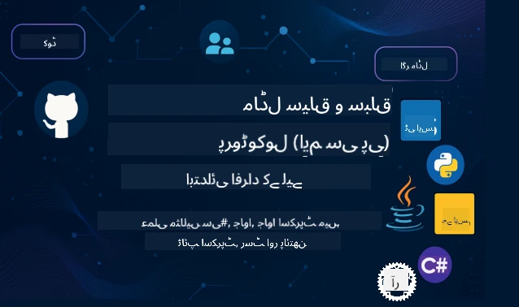

 

[](https://GitHub.com/microsoft/mcp-for-beginners/graphs/contributors)
[](https://GitHub.com/microsoft/mcp-for-beginners/issues)
[](https://GitHub.com/microsoft/mcp-for-beginners/pulls)
[](http://makeapullrequest.com)

[](https://GitHub.com/microsoft/mcp-for-beginners/watchers)
[](https://GitHub.com/microsoft/mcp-for-beginners/fork)
[](https://GitHub.com/microsoft/mcp-for-beginners/stargazers)


[](https://discord.gg/nTYy5BXMWG)

ان وسائل کو استعمال شروع کرنے کے لیے درج ذیل مراحل پر عمل کریں:
1. **ریپوزیٹری کو فورک کریں**: کلک کریں [](https://GitHub.com/microsoft/mcp-for-beginners/fork)
2. **ریپوزیٹری کو کلون کریں**:   `git clone https://github.com/microsoft/mcp-for-beginners.git`
3. **شامل ہوں** [](https://discord.gg/nTYy5BXMWG)


### 🌐 ملٹی زبان کی حمایت

#### GitHub ایکشن کے ذریعے سپورٹ (خودکار اور ہمیشہ تازہ ترین)

<!-- CO-OP TRANSLATOR LANGUAGES TABLE START -->
[Arabic](../ar/README.md) | [Bengali](../bn/README.md) | [Bulgarian](../bg/README.md) | [Burmese (Myanmar)](../my/README.md) | [Chinese (Simplified)](../zh-CN/README.md) | [Chinese (Traditional, Hong Kong)](../zh-HK/README.md) | [Chinese (Traditional, Macau)](../zh-MO/README.md) | [Chinese (Traditional, Taiwan)](../zh-TW/README.md) | [Croatian](../hr/README.md) | [Czech](../cs/README.md) | [Danish](../da/README.md) | [Dutch](../nl/README.md) | [Estonian](../et/README.md) | [Finnish](../fi/README.md) | [French](../fr/README.md) | [German](../de/README.md) | [Greek](../el/README.md) | [Hebrew](../he/README.md) | [Hindi](../hi/README.md) | [Hungarian](../hu/README.md) | [Indonesian](../id/README.md) | [Italian](../it/README.md) | [Japanese](../ja/README.md) | [Kannada](../kn/README.md) | [Korean](../ko/README.md) | [Lithuanian](../lt/README.md) | [Malay](../ms/README.md) | [Malayalam](../ml/README.md) | [Marathi](../mr/README.md) | [Nepali](../ne/README.md) | [Nigerian Pidgin](../pcm/README.md) | [Norwegian](../no/README.md) | [Persian (Farsi)](../fa/README.md) | [Polish](../pl/README.md) | [Portuguese (Brazil)](../pt-BR/README.md) | [Portuguese (Portugal)](../pt-PT/README.md) | [Punjabi (Gurmukhi)](../pa/README.md) | [Romanian](../ro/README.md) | [Russian](../ru/README.md) | [Serbian (Cyrillic)](../sr/README.md) | [Slovak](../sk/README.md) | [Slovenian](../sl/README.md) | [Spanish](../es/README.md) | [Swahili](../sw/README.md) | [Swedish](../sv/README.md) | [Tagalog (Filipino)](../tl/README.md) | [Tamil](../ta/README.md) | [Telugu](../te/README.md) | [Thai](../th/README.md) | [Turkish](../tr/README.md) | [Ukrainian](../uk/README.md) | [Urdu](./README.md) | [Vietnamese](../vi/README.md)

> **کیا آپ مقامی طور پر کلون کرنا پسند کریں گے؟**

> اس ریپوزیٹری میں 50+ زبانوں کے تراجم شامل ہیں جو ڈاؤن لوڈ سائز کو نمایاں طور پر بڑھاتے ہیں۔ تراجم کے بغیر کلون کرنے کے لیے sparse checkout استعمال کریں:
> ```bash
> git clone --filter=blob:none --sparse https://github.com/microsoft/mcp-for-beginners.git
> cd mcp-for-beginners
> git sparse-checkout set --no-cone '/*' '!translations' '!translated_images'
> ```
> اس سے آپ کو کورس مکمل کرنے کے لیے ہر چیز ملے گی اور ڈاؤن لوڈ بھی بہت تیز ہوگا۔
<!-- CO-OP TRANSLATOR LANGUAGES TABLE END -->

# 🚀 ماڈل کانٹیکسٹ پروٹوکول (MCP) نصاب برائے مبتدی

## **C#, Java, JavaScript, Rust, Python، اور TypeScript میں عملی کوڈ کی مثالوں کے ساتھ MCP سیکھیں**

## 🧠 ماڈل کانٹیکسٹ پروٹوکول نصاب کا جائزہ  
ماڈل کانٹیکسٹ پروٹوکول میں آپ کے سفر میں خوش آمدید! اگر کبھی آپ نے سوچا ہے کہ AI ایپلیکیشنز مختلف آلات اور خدمات کے ساتھ کیسے بات چیت کرتی ہیں، تو آپ ایک نفیس حل دریافت کرنے والے ہیں جو ڈویلپرز کو ذہین نظام بنانے کا طریقہ بدل رہا ہے۔

MCP کو AI ایپلیکیشنز کے لیے ایک عالمی مترجم سمجھیں — بالکل ویسا ہی جیسے USB پورٹس آپ کو کسی بھی ڈیوائس کو اپنے کمپیوٹر سے جوڑنے دیتے ہیں، ویسے ہی MCP AI ماڈلز کو کسی بھی ٹول یا سروس سے معیاری انداز میں منسلک ہونے دیتا ہے۔ چاہے آپ اپنا پہلا چیٹ بوٹ بنا رہے ہوں یا پیچیدہ AI ورکس فلو پر کام کر رہے ہوں، MCP کو سمجھنا آپ کو زیادہ قابل اور لچکدار ایپلیکیشنز تخلیق کرنے کی طاقت دے گا۔

یہ نصاب آپ کے تعلیمی سفر کے لیے صبر و احتیاط سے تیار کیا گیا ہے۔ ہم سادہ تصورات سے شروع کریں گے جو آپ پہلے سے جانتے ہیں اور آہستہ آہستہ آپ کی مہارتوں کو آپ کی پسندیدہ پروگرامنگ زبان میں عملی مشق کے ذریعے بڑھائیں گے۔ ہر مرحلہ میں واضح وضاحتیں، عملی مثالیں، اور بھرپور حوصلہ افزائی شامل ہوگی۔

جب آپ یہ سفر مکمل کر لیں گے، تو آپ خود اپنے MCP سرورز بنانے، انہیں مقبول AI پلیٹ فارمز کے ساتھ ضم کرنے، اور اس ٹیکنالوجی کے ذریعے AI ڈیولپمنٹ کے مستقبل کو شکل دینے کے طریقہ کار کو سمجھنے کے قابل ہو جائیں گے۔ آئیے اس دلچسپ مہم کا آغاز کریں!

### سرکاری دستاویزات اور مواصفات

یہ وسائل آپ کی سمجھ بوجھ بڑھنے کے ساتھ زیادہ قیمتی ہو جاتے ہیں، لیکن فوراً سب کچھ پڑھنے کا دباؤ محسوس نہ کریں۔ ان جگہوں سے شروع کریں جو آپ کی دلچسپی کے زیادہ قریب ہوں!
- 📘 [MCP دستاویزات](https://modelcontextprotocol.io/) – یہ آپ کا مرحلہ وار سبق اور صارف رہنما کے لیے بنیادی ذریعہ ہے۔ یہ دستاویزات ابتدائی افراد کے لیے لکھی گئی ہیں، جن میں آپ آسانی سے اپنے حساب سے واضح مثالیں دیکھ سکتے ہیں۔
- 📜 [MCP مواصفات](https://modelcontextprotocol.io/docs/) – اسے اپنے جامع حوالہ جاتی دستی کے طور پر سوچیں۔ نصاب کے دوران، آپ مخصوص تفصیلات دیکھنے اور اعلی خصوصیات کو سمجھنے کے لیے یہاں بار بار جائیں گے۔
- 📜 [اصلی MCP مواصفات](https://modelcontextprotocol.io/specification/versioning) – اس میں اضافی تکنیکی تفصیلات شامل ہیں جو ترقی یافتہ نفاذات کے لیے مدد گار ہو سکتی ہیں۔ جب ضرورت ہو تب دیکھیں، شروع میں اس کی کوئی فکر نہ کریں۔
- 🧑‍💻 [MCP GitHub ریپوزیٹری](https://github.com/modelcontextprotocol) – یہاں آپ کو SDKs، ٹولز، اور کوڈ کے نمونے مختلف پروگرامنگ زبانوں میں ملیں گے۔ یہ عملی مثالوں اور تیار جزو جات کا خزانہ ہے۔
- 🌐 [MCP کمیونٹی](https://github.com/orgs/modelcontextprotocol/discussions) – دوسرے سیکھنے والوں اور تجربہ کار ڈویلپرز کے ساتھ MCP پر گفتگو میں شامل ہوں۔ یہ ایک معاون کمیونٹی ہے جہاں سوالات خوش آمدید ہیں اور علم آزادانہ طور پر بانٹا جاتا ہے۔
  
## سیکھنے کے مقاصد

اس نصاب کے آخر میں، آپ اپنے نئے ہنر پر پراعتماد اور متحرک محسوس کریں گے۔ یہ وہ چیزیں ہیں جو آپ حاصل کریں گے:

• **MCP کی بنیادی باتوں کو سمجھنا**: آپ سمجھ سکیں گے کہ ماڈل کانٹیکسٹ پروٹوکول کیا ہے اور کیوں یہ AI ایپلیکیشنز کے ساتھ کام کرنے کے انداز کو انقلابی بنا رہا ہے، ایسے استعارے اور مثالوں کے ساتھ جو آپ کے لیے قابل فہم ہوں۔

• **اپنا پہلا MCP سرور بنائیں**: آپ اپنی پسندیدہ پروگرامنگ زبان میں ایک کام کرنے والا MCP سرور بنائیں گے، آسان مثالوں سے شروع کر کے آہستہ آہستہ مہارتیں بڑھائیں گے۔

• **AI ماڈلز کو حقیقی ٹولز سے منسلک کریں**: آپ سیکھیں گے کہ AI ماڈلز اور اصلی خدمات کے درمیان پل کیسے بنائیں، تاکہ آپ کی ایپلیکیشنز کو طاقتور نئی صلاحیتیں مل سکیں۔

• **سیکورٹی کی بہترین مشقوں کو نافذ کریں**: آپ سمجھیں گے کہ اپنے MCP نفاذ کو محفوظ کیسے رکھنا ہے، اپنی ایپلیکیشنز اور صارفین کی حفاظت کیسے کرنی ہے۔

• **پراعتماد تعیناتی**: آپ جانیں گے کہ MCP پروجیکٹس کو ترقی سے پروڈکشن تک کیسے لے جانا ہے، عملی تعیناتی کی حکمت عملیوں کے ساتھ جو حقیقی دنیا میں کام کرتی ہیں۔

• **MCP کمیونٹی میں شامل ہوں**: آپ ایسے بڑھتے ہوئے برداری کا حصہ بنیں گے جو AI ایپلیکیشن ڈیولپمنٹ کے مستقبل کی تشکیل دے رہی ہے۔ 

## ضروری پس منظر

MCP کی مخصوص باتوں میں داخل ہونے سے پہلے، آئیے یقینی بنائیں کہ آپ کچھ بنیادی تصورات میں آرام دہ ہیں۔ اگر آپ ان میدانوں میں ماہر نہیں ہیں تو پریشان نہ ہوں — ہم آپ کو چلتے چلتے ہر چیز سمجھائیں گے!

### پروٹوکولز کو سمجھنا (بنیاد)

پروٹوکول کو ایک گفتگو کے قواعد کی طرح سمجھیں۔ جب آپ کسی دوست کو کال کرتے ہیں، تو دونوں جانتے ہیں کہ جواب میں "ہیلو" کہنا ہے، باری باری بات کرنی ہے، اور جب ختم ہو جائے تو "الوداع" کہنا ہے۔ کمپیوٹر پروگراموں کو بھی موثر بات چیت کے لیے ایسے قواعد کی ضرورت ہوتی ہے۔

MCP ایک پروٹوکول ہے — قواعد کا ایک مجموعہ جو AI ماڈلز اور ایپلیکیشنز کو ٹولز اور خدمات کے ساتھ تعمیری "گفتگو" کرنے میں مدد دیتا ہے۔ بالکل ویسے ہی جیسے بات چیت کے قواعد انسانی رابطے کو آسان اور موثر بناتے ہیں، MCP AI ایپلیکیشنز کی بات چیت کو زیادہ قابل اعتماد اور طاقتور بناتا ہے۔

### کلائنٹ-سرور تعلقات (پروگرامز کیسے ساتھ کام کرتے ہیں)

آپ روزانہ کلائنٹ-سرور تعلقات استعمال کرتے ہیں! جب آپ ویب براؤزر (کلائنٹ) سے ویب سائٹ دیکھتے ہیں، تو آپ ویب سرور سے جڑتے ہیں جو صفحہ کا مواد بھیجتا ہے۔ براؤزر کو معلوم ہے کہ معلومات کیسے مانگنی ہے، اور سرور کو معلوم ہے کہ کس طرح جواب دینا ہے۔

MCP میں بھی ایسا ہی تعلق ہے: AI ماڈلز کلائنٹس کی طرح ہیں جو معلومات یا عمل کی درخواست کرتے ہیں، جبکہ MCP سرورز یہ صلاحیتیں فراہم کرتے ہیں۔ یہ ایسے ہے جیسے AI کے پاس ایک مددگار اسسٹنٹ (سرور) ہو جو مخصوص کام کرنے کے لیے کہا جا سکتا ہے۔

### معیار بندی کیوں ضروری ہے (چیزوں کو ساتھ کام کرنے کے قابل بنانا)

تصور کریں اگر ہر کار بنانے والا الگ شکل کے پمپ استعمال کرے - آپ کو ہر کار کے لیے مختلف اڈاپٹر درکار ہوگا! معیار بندی کا مطلب ہے کہ عام طریقوں پر اتفاق رائے ہو تاکہ چیزیں بخوبی ایک ساتھ کام کریں۔

MCP AI ایپلیکیشنز کے لیے یہ معیار بندی فراہم کرتا ہے۔ ہر AI ماڈل کو ہر ٹول کے لیے الگ کوڈ لکھنے کی بجائے، MCP ایک عالمی طریقہ فراہم کرتا ہے جس سے وہ بات چیت کر سکیں۔ اس کا مطلب ہے کہ ڈویلپرز ایک بار ٹول بنا کر اسے بہت سے مختلف AI سسٹمز کے ساتھ استعمال کر سکتے ہیں۔

## 🧭 آپ کے سیکھنے کے راستے کا جائزہ

آپ کا MCP سفر محتاط طریقے سے اس طرح ترتیب دیا گیا ہے کہ آپ کا اعتماد اور مہارتیں بتدریج فروغ پائیں۔ ہر مرحلہ نئے تصورات متعارف کراتا ہے جبکہ پہلے سیکھے ہوئے مواد کو پختہ کرتا ہے۔

### 🌱 بنیاد کا مرحلہ: بنیادی باتوں کو سمجھنا (ماڈیولز 0-2)

یہاں سے آپ کا سفر شروع ہوتا ہے! ہم MCP کے تصورات کو مانوس استعاروں اور آسان مثالوں کے ذریعے متعارف کرائیں گے۔ آپ سمجھ پائیں گے کہ MCP کیا ہے، یہ کیوں موجود ہے، اور AI کی دنیا میں اس کا مقام کیا ہے۔

• **ماڈیول 0 - MCP کا تعارف**: ہم یہ دریافت کریں گے کہ MCP کیا ہے اور جدید AI ایپلیکیشنز کے لیے یہ کیوں اہم ہے۔ آپ MCP کی حقیقی دنیا کی مثالیں دیکھیں گے اور جانیں گے کہ یہ عام مسائل کو کیسے حل کرتا ہے۔

• **ماڈیول 1 - بنیادی تصورات کی وضاحت**: یہاں آپ MCP کے لازمی اجزاء سیکھیں گے۔ ہم بہت سے استعارے اور بصری مثالیں استعمال کریں گے تاکہ یہ تصورات آپ کے لیے آسان اور واضح ہو جائیں۔

• **ماڈیول 2 - MCP میں سیکورٹی**: سیکورٹی سن کر شاید آپ گھبرائیں، لیکن ہم دکھائیں گے کہ MCP میں بلٹ ان حفاظتی خصوصیات شامل ہیں اور آپ کو بہترین طریقے سکھائیں گے جو آپ کی ایپلیکیشنز کی حفاظت کریں۔

### 🔨 تعمیری مرحلہ: اپنی پہلی عملی مثالیں بنانا (ماڈیول 3)

اب اصل مزہ شروع ہوتا ہے! آپ ہاتھوں ہاتھ MCP سرورز اور کلائنٹس بنانے کا تجربہ حاصل کریں گے۔ پریشان نہ ہوں — ہم آسان سے شروع کریں گے اور ہر قدم پر رہنمائی کریں گے۔

اس ماڈیول میں آپ کو اپنی پسندیدہ پروگرامنگ زبان میں عملی گائیڈ دیے جائیں گے۔ آپ اپنا پہلا سرور بنائیں گے، ایک کلائنٹ بنائیں گے جو اس سے جڑے گا، اور VS Code جیسے مقبول ڈیولپمنٹ ٹولز کے ساتھ انضمام بھی کریں گے۔
ہر گائیڈ میں مکمل کوڈ کے مثالیں، مسائل کے حل کے نکات، اور وضاحتیں شامل ہیں کہ ہم مخصوص ڈیزائن کے انتخاب کیوں کرتے ہیں۔ اس مرحلے کے آخر تک، آپ کے پاس کام کرنے والی MCP تنصیبات ہوں گی جن پر آپ فخر کر سکیں گے!

### 🚀 ترقی کا مرحلہ: اعلیٰ تصورات اور حقیقی دنیا کی درخواست (ماڈیول 4-5)

بنیادی باتیں سمجھنے کے بعد، آپ مزید پیچیدہ MCP خصوصیات کو دریافت کرنے کے لئے تیار ہیں۔ ہم عملی نفاذ کی حکمت عملیوں، ڈیبگنگ کی تکنیکوں، اور ملٹی موڈل AI انضمام جیسے پیچیدہ موضوعات کا احاطہ کریں گے۔

آپ یہ بھی سیکھیں گے کہ اپنی MCP تنصیبات کو پروڈکشن کے استعمال کے لئے کس طرح اسکال کریں اور Azure جیسے کلاؤڈ پلیٹ فارمز کے ساتھ انضمام کریں۔ یہ ماڈیولز آپ کو ایسی MCP حل بنانے کے لئے تیار کرتے ہیں جو حقیقی دنیا کی ضروریات کو پورا کر سکیں۔

### 🌟 مہارت کا مرحلہ: کمیونٹی اور تخصص (ماڈیول 6-11)

آخری مرحلہ MCP کمیونٹی میں شامل ہونے اور ان شعبوں میں تخصص پر مرکوز ہے جو آپ کی سب سے زیادہ دلچسپی رکھتے ہیں۔ آپ سیکھیں گے کہ اوپن سورس MCP منصوبوں میں تعاون کیسے کیا جائے، اعلیٰ درجے کے تصدیقی پیٹرن نافذ کیے جائیں، اور جامع ڈیٹا بیس سے مربوط حل تیار کیے جائیں۔

ماڈیول 11 خاص ذکر کا مستحق ہے - یہ ایک مکمل 13-لیب ہاتھ سے سیکھنے کا راستہ ہے جو آپ کو PostgreSQL انضمام کے ساتھ پروڈکشن کے لئے تیار MCP سرورز بنانے کی تعلیم دیتا ہے۔ یہ ایک کیپ اسٹون پروجیکٹ کی طرح ہے جو آپ نے جو کچھ سیکھا ہے اسے یکجا کرتا ہے!

### 📚 مکمل نصاب کا ڈھانچہ

| ماڈیول | موضوع | وضاحت | لنک |
|--------|-------|-------------|------|
| **ماڈیول 1-3: بنیادی باتیں** | | | |
| 00 | MCP کا تعارف | ماڈل کانٹیکسٹ پروٹوکول کا جائزہ اور AI پائپ لائنز میں اس کی اہمیت | [مزید پڑھیں](./00-Introduction/README.md) |
| 01 | بنیادی تصورات کی وضاحت | MCP کے بنیادی تصورات کی گہرائی میں جانچ | [مزید پڑھیں](./01-CoreConcepts/README.md) |
| 02 | MCP میں سیکیورٹی | سیکیورٹی کے خطرات اور بہترین طریقے | [مزید پڑھیں](./02-Security/README.md) |
| 03 | MCP کے ساتھ شروعات | ماحول کی تیاری، بنیادی سرور/کلائنٹ، انضمام | [مزید پڑھیں](./03-GettingStarted/README.md) |
| **ماڈیول 3: اپنا پہلا سرور اور کلائنٹ بنانا** | | | |
| 3.1 | پہلا سرور | اپنا پہلا MCP سرور بنائیں | [رہنمائی](./03-GettingStarted/01-first-server/README.md) |
| 3.2 | پہلا کلائنٹ | ایک بنیادی MCP کلائنٹ تیار کریں | [رہنمائی](./03-GettingStarted/02-client/README.md) |
| 3.3 | LLM کے ساتھ کلائنٹ | بڑے زبان کے ماڈلز کو ضم کریں | [رہنمائی](./03-GettingStarted/03-llm-client/README.md) |
| 3.4 | VS Code انضمام | VS Code میں MCP سرورز کا استعمال کریں | [رہنمائی](./03-GettingStarted/04-vscode/README.md) |
| 3.5 | stdio سرور | stdio ٹرانسپورٹ کے ذریعے سرور بنائیں | [رہنمائی](./03-GettingStarted/05-stdio-server/README.md) |
| 3.6 | HTTP اسٹریمنگ | MCP میں HTTP اسٹریمنگ نافذ کریں | [رہنمائی](./03-GettingStarted/06-http-streaming/README.md) |
| 3.7 | AI ٹول کٹ | MCP کے ساتھ AI ٹول کٹ استعمال کریں | [رہنمائی](./03-GettingStarted/07-aitk/README.md) |
| 3.8 | جانچ | اپنی MCP سرور کی تنصیب کی جانچ کریں | [رہنمائی](./03-GettingStarted/08-testing/README.md) |
| 3.9 | تعیناتی | MCP سرورز کو پروڈکشن میں تعینات کریں | [رہنمائی](./03-GettingStarted/09-deployment/README.md) |
| 3.10 | اعلیٰ درجے کے سرور استعمال | اعلیٰ خصوصیات کے استعمال اور بہتر فن تعمیر کے لیے اعلیٰ سرورز کا استعمال کریں | [رہنمائی](./03-GettingStarted/10-advanced/README.md) |
| 3.11 | سادہ تصدیق | ایک باب جو ابتداء سے آپ کو تصدیق اور RBAC دکھاتا ہے | [رہنمائی](./03-GettingStarted/11-simple-auth/README.md) |
| **ماڈیول 4-5: عملی اور اعلیٰ درجے** | | | |
| 04 | عملی نفاذ | SDKs، ڈیبگنگ، جانچ، دوبارہ استعمال کے قابل پرومپٹ ٹیمپلیٹس | [مزید پڑھیں](./04-PracticalImplementation/README.md) |
| 05 | MCP میں اعلیٰ موضوعات | ملٹی موڈل AI، سکالنگ، انٹرپرائز استعمال | [مزید پڑھیں](./05-AdvancedTopics/README.md) |
| 5.1 | Azure انضمام | MCP کا Azure کے ساتھ انضمام | [رہنمائی](./05-AdvancedTopics/mcp-integration/README.md) |
| 5.2 | ملٹی موڈالٹی | متعدد موڈالٹیز کے ساتھ کام کرنا | [رہنمائی](./05-AdvancedTopics/mcp-multi-modality/README.md) |
| 5.3 | OAuth2 ڈیمو | OAuth2 تصدیق نافذ کریں | [رہنمائی](./05-AdvancedTopics/mcp-oauth2-demo/README.md) |
| 5.4 | روٹ کانٹیکسٹ | روٹ کانٹیکسٹس کو سمجھیں اور نافذ کریں | [رہنمائی](./05-AdvancedTopics/mcp-root-contexts/README.md) |
| 5.5 | روٹنگ | MCP روٹنگ کی حکمت عملیاں | [رہنمائی](./05-AdvancedTopics/mcp-routing/README.md) |
| 5.6 | سیمپلنگ | MCP میں سیمپلنگ تکنیکیں | [رہنمائی](./05-AdvancedTopics/mcp-sampling/README.md) |
| 5.7 | سکالنگ | MCP تنصیبات کو اسکال کریں | [رہنمائی](./05-AdvancedTopics/mcp-scaling/README.md) |
| 5.8 | سیکیورٹی | اعلیٰ سیکیورٹی کے مسائل | [رہنمائی](./05-AdvancedTopics/mcp-security/README.md) |
| 5.9 | ویب سرچ | ویب سرچ صلاحیتیں نافذ کریں | [رہنمائی](./05-AdvancedTopics/web-search-mcp/README.md) |
| 5.10 | ریئل ٹائم اسٹریمنگ | ریئل ٹائم اسٹریمنگ کی فعالیت بنائیں | [رہنمائی](./05-AdvancedTopics/mcp-realtimestreaming/README.md) |
| 5.11 | ریئل ٹائم سرچ | ریئل ٹائم سرچ نافذ کریں | [رہنمائی](./05-AdvancedTopics/mcp-realtimesearch/README.md) |
| 5.12 | انٹرا ID کی تصدیق | Microsoft Entra ID کے ساتھ تصدیق | [رہنمائی](./05-AdvancedTopics/mcp-security-entra/README.md) |
| 5.13 | فاؤنڈری انضمام | Azure AI Foundry کے ساتھ انضمام | [رہنمائی](./05-AdvancedTopics/mcp-foundry-agent-integration/README.md) |
| 5.14 | کانٹیکسٹ انجینئرنگ | مؤثر کانٹیکسٹ انجینئرنگ کی تکنیکیں | [رہنمائی](./05-AdvancedTopics/mcp-contextengineering/README.md) |
| 5.15 | MCP کسٹم ٹرانسپورٹ | کسٹم ٹرانسپورٹ کی تنصیبات | [رہنمائی](./05-AdvancedTopics/mcp-transport/README.md) |
| **ماڈیول 6-10: کمیونٹی اور بہترین طریقے** | | | |
| 06 | کمیونٹی میں تعاون | MCP ماحولیاتی نظام میں تعاون کیسے کریں | [رہنمائی](./06-CommunityContributions/README.md) |
| 07 | ابتدائی اپنانے سے بصیرتیں | حقیقی دنیا کی نفاذ کہانیاں | [رہنمائی](./07-LessonsFromEarlyAdoption/README.md) |
| 08 | MCP کے لیے بہترین طریقے | کارکردگی، فالٹ ٹولرنس، مضبوطی | [رہنمائی](./08-BestPractices/README.md) |
| 09 | MCP کیس اسٹڈیز | عملی نفاذ کی مثالیں | [رہنمائی](./09-CaseStudy/README.md) |
| 10 | عملی ورکشاپ | AI ٹول کٹ کے ساتھ MCP سرور بنانا | [لیب](./10-StreamliningAIWorkflowsBuildingAnMCPServerWithAIToolkit/README.md) |
| **ماڈیول 11: MCP سرور ہاتھوں پر لیب** | | | |
| 11 | MCP سرور ڈیٹا بیس انضمام | PostgreSQL انضمام کے لیے جامع 13-لیب ہاتھوں پر سیکھنے کا راستہ | [لیبس](./11-MCPServerHandsOnLabs/README.md) |
| 11.1 | تعارف | MCP کا جائزہ، ڈیٹا بیس انضمام اور ریٹیل اینالٹکس کیس کا استعمال | [لیب 00](./11-MCPServerHandsOnLabs/00-Introduction/README.md) |
| 11.2 | بنیادی فن تعمیر | MCP سرور فن تعمیر، ڈیٹا بیس کی پرتیں، اور سیکیورٹی پیٹرن کی سمجھ | [لیب 01](./11-MCPServerHandsOnLabs/01-Architecture/README.md) |
| 11.3 | سیکیورٹی اور ملٹی ٹیننسی | رو لیول سیکیورٹی، تصدیق، اور ملٹی ٹیننٹ ڈیٹا رسائی | [لیب 02](./11-MCPServerHandsOnLabs/02-Security/README.md) |
| 11.4 | ماحول کی تیاری | ترقیاتی ماحول کی تیاری، ڈوکر، Azure وسائل | [لیب 03](./11-MCPServerHandsOnLabs/03-Setup/README.md) |
| 11.5 | ڈیٹا بیس ڈیزائن | PostgreSQL سیٹ اپ، ریٹیل اسکیمہ ڈیزائن، اور نمونہ ڈیٹا | [لیب 04](./11-MCPServerHandsOnLabs/04-Database/README.md) |
| 11.6 | MCP سرور نفاذ | FastMCP سرور کی تعمیر ڈیٹا بیس انضمام کے ساتھ | [لیب 05](./11-MCPServerHandsOnLabs/05-MCP-Server/README.md) |
| 11.7 | ٹول کی ترقی | ڈیٹا بیس کوئری ٹولز اور اسکیمہ انٹروسپیکشن بنانا | [لیب 06](./11-MCPServerHandsOnLabs/06-Tools/README.md) |
| 11.8 | سیمنٹک سرچ | Azure OpenAI اور pgvector کے ساتھ ویکٹر ایمبیڈڈز نافذ کرنا | [لیب 07](./11-MCPServerHandsOnLabs/07-Semantic-Search/README.md) |
| 11.9 | جانچ اور ڈیبگنگ | جانچ کی حکمت عملیاں، ڈیبگنگ ٹولز اور توثیقی طریقے | [لیب 08](./11-MCPServerHandsOnLabs/08-Testing/README.md) |
| 11.10 | VS Code انضمام | VS Code MCP انضمام اور AI چیٹ کا استعمال ترتیب دینا | [لیب 09](./11-MCPServerHandsOnLabs/09-VS-Code/README.md) |
| 11.11 | تعیناتی کی حکمت عملیاں | ڈوکر تعیناتی، Azure کنٹینر ایپس، اور اسکیلنگ کے امور | [لیب 10](./11-MCPServerHandsOnLabs/10-Deployment/README.md) |
| 11.12 | مانیٹرنگ | اپلیکیشن انسائٹس، لاگنگ، کارکردگی کی نگرانی | [لیب 11](./11-MCPServerHandsOnLabs/11-Monitoring/README.md) |
| 11.13 | بہترین طریقے | کارکردگی کی بہتر سازی، سیکیورٹی سختی، اور پروڈکشن نکات | [لیب 12](./11-MCPServerHandsOnLabs/12-Best-Practices/README.md) |

### 💻 نمونہ کوڈ پروجیکٹس

MCP سیکھنے کا ایک سب سے دلچسپ حصہ آپ کی کوڈنگ مہارتوں کا تدریجی ارتقاء دیکھنا ہے۔ ہم نے اپنے کوڈ مثالوں کو اس طرح ڈیزائن کیا ہے کہ وہ آسان سے شروع ہوں اور جیسے جیسے آپ کی سمجھ بڑھے، مزید پیچیدہ ہو جائیں۔ یہاں یہ ہے کہ ہم تصورات کو کیسے متعارف کراتے ہیں - ایسے کوڈ کے ساتھ جو سمجھنے میں آسان ہے لیکن حقیقی MCP اصولوں کو ظاہر کرتا ہے، آپ نہ صرف یہ سمجھیں گے کہ یہ کوڈ کیا کرتا ہے، بلکہ یہ بھی کہ یہ کیوں اس طرح ترتیب دیا گیا ہے اور یہ بڑے MCP درخواستوں میں کیسے فٹ بیٹھتا ہے۔

#### بنیادی MCP کیلکولیٹر کے نمونے

| زبان | وضاحت | لنک |
|----------|-------------|------|
| C# | MCP سرور کی مثال | [کوڈ دیکھیں](./03-GettingStarted/samples/csharp/README.md) |
| Java | MCP کیلکولیٹر | [کوڈ دیکھیں](./03-GettingStarted/samples/java/calculator/README.md) |
| JavaScript | MCP ڈیمو | [کوڈ دیکھیں](./03-GettingStarted/samples/javascript/README.md) |
| Python | MCP سرور | [کوڈ دیکھیں](../../03-GettingStarted/samples/python/mcp_calculator_server.py) |
| TypeScript | MCP مثال | [کوڈ دیکھیں](./03-GettingStarted/samples/typescript/README.md) |
| Rust | MCP مثال | [کوڈ دیکھیں](./03-GettingStarted/samples/rust/README.md) |

#### اعلیٰ درجے کی MCP تنصیبات

| زبان | وضاحت | لنک |
|----------|-------------|------|
| C# | اعلیٰ نمونہ | [کوڈ دیکھیں](./04-PracticalImplementation/samples/csharp/README.md) |
| Java with Spring | کنٹینر ایپ کی مثال | [کوڈ دیکھیں](./04-PracticalImplementation/samples/java/containerapp/README.md) |
| JavaScript | اعلیٰ نمونہ | [کوڈ دیکھیں](./04-PracticalImplementation/samples/javascript/README.md) |
| Python | پیچیدہ نفاذ | [کوڈ دیکھیں](../../04-PracticalImplementation/samples/python/READMEmd) |
| TypeScript | کنٹینر نمونہ | [کوڈ دیکھیں](./04-PracticalImplementation/samples/typescript/README.md) |


## 🎯 MCP سیکھنے کے لئے ضروریات

اس نصاب سے زیادہ سے زیادہ فائدہ اٹھانے کے لئے، آپ کے پاس ہونا چاہئے:

- کم از کم ایک زبان میں بنیادی پروگرامنگ کی معلومات: C#، Java، JavaScript، Python، یا TypeScript
- کلائنٹ-سرور ماڈل اور API کی سمجھ
- REST اور HTTP تصورات سے واقفیت
- (اختیاری) AI/ML تصورات کا پس منظر

- ہمارے کمیونٹی مباحثوں میں شامل ہونا تاکہ مدد حاصل کریں

## 📚 مطالعے کی رہنما اور وسائل

یہ مخزن کئی وسائل شامل کرتا ہے تاکہ آپ کو مؤثر طریقے سے راستہ تلاش کرنے اور سیکھنے میں مدد ملے:

### مطالعے کی رہنما

ایک جامع [مطالعے کی رہنما](./study_guide.md) دستیاب ہے جو آپ کو اس مخزن کو مؤثر طریقے سے دریافت کرنے میں مدد دیتی ہے۔ یہ بصری نصاب کا نقشہ دکھاتا ہے کہ تمام موضوعات کیسے جڑے ہوئے ہیں اور نمونہ پروجیکٹس کو مؤثر طریقے سے استعمال کرنے کی رہنمائی فراہم کرتا ہے۔ یہ خاص طور پر ان لوگوں کے لئے مفید ہے جو بڑے منظرنامے کو دیکھنا پسند کرتے ہیں۔

رہنما میں شامل ہے:
- تمام موضوعات کا بصری نصاب کا نقشہ
- ہر مخزن کے سیکشن کا تفصیلی تجزیہ
- نمونہ پروجیکٹس کو استعمال کرنے کی رہنمائی
- مختلف مہارت کی سطحوں کے لئے تجویز کردہ سیکھنے کے راستے
- آپ کی سیکھنے کی سفر کو مکمل کرنے کے لئے اضافی وسائل

### تبدیلی کی فہرست

ہم ایک تفصیلی [تبدیلی کی فہرست](./changelog.md) برقرار رکھتے ہیں جو نصاب کے مواد میں تمام اہم اپ ڈیٹس کو ٹریک کرتی ہے، تاکہ آپ تازہ ترین بہتریوں اور اضافوں سے ہر وقت باخبر رہ سکیں۔
- مواد میں نئے اضافے
- ساختی تبدیلیاں
- خصوصیات میں بہتریاں
- دستاویزات کی تازہ کاری

## 🛠️ اس نصاب کو مؤثر طریقے سے کیسے استعمال کریں

اس گائیڈ میں ہر سبق میں شامل ہوتا ہے:
1. MCP تصورات کی واضح وضاحتیں  
2. متعدد زبانوں میں لائیو کوڈ کے مثالیں  
3. حقیقی MCP ایپلیکیشنز بنانے کی مشقیں  
4. ترقی یافتہ سیکھنے والوں کے لیے اضافی وسائل

## ضرورت پر مبنی مواد 

### [MCP ڈیولپر دن جولائی 2025](https://developer.microsoft.com/en-us/reactor/series/S-1563/)
#### [➡️ضرورت پڑنے پر دیکھیں - MCP ڈیولپر دن](https://developer.microsoft.com/en-us/reactor/series/S-1563/)
MCP ڈیولپر دن کی تیاری کریں، دو دن کا گہرا تکنیکی بصیرت، کمیونٹی سے رابطہ، اور عملی سیکھنے کا ورچوئل ایونٹ، جو ماڈل کانٹیکسٹ پروٹوکول (MCP) — جو ابھرتا ہوا معیار ہے جو AI ماڈلز اور ان کے استعمال ہونے والے آلات کے درمیان پل بناتا ہے، کے لیے وقف ہے۔  
آپ MCP ڈیولپر دن کو ہمارے ایونٹ پیج پر رجسٹریشن کرکے دیکھ سکتے ہیں: https://aka.ms/mcpdevdays.

#### [دن 1: MCP پیداواریت، ڈویلپمنٹ ٹولز، اور کمیونٹی:](https://developer.microsoft.com/en-us/reactor/series/S-1563/)

یہ سارا مقصد ہے ڈویلپرز کو MCP کو اپنے ڈویلپر ورک فلو میں استعمال کرنے کا اختیار دینا اور شاندار MCP کمیونٹی کا جشن منانا۔ ہم کمیونٹی کے ارکان اور شراکت داروں جیسے آرکیڈ، بلاک، اوکتا، اور نیون کے ساتھ مل کر دیکھیں گے کہ وہ مائیکروسافٹ کے ساتھ مل کر کیسے ایک کھلا، توسیعی MCP ماحولیاتی نظام تشکیل دے رہے ہیں۔  
VS کوڈ، وژوئل اسٹوڈیو، گٹ ہب کوپائلٹ، اور مقبول کمیونٹی ٹولز میں حقیقی دنیا کی نمائشیں  
عملی، سیاق و سباق پر مبنی ڈویلپمنٹ ورک فلو  
کمیونٹی کی رہنمائی میں سیشنز اور بصیرتیں  
چاہے آپ MCP کے ساتھ ابھی شروع کر رہے ہوں یا پہلے ہی اسے استعمال کر رہے ہوں، دن 1 آپ کو حوصلہ افزائی اور کار آمد نکات کے ساتھ بنیاد فراہم کرے گا۔

#### [دن 2: اعتماد کے ساتھ MCP سرورز بنائیں](https://developer.microsoft.com/en-us/reactor/series/S-1563/)

یہ MCP بنانے والوں کے لیے ہے۔ ہم MCP سرورز بنانے اور انہیں AI ورک فلو میں ایکسپوز کرنے کی حکمت عملیاں اور بہترین طریقے گہرائی میں سکھائیں گے۔

#### موضوعات درج ذیل ہیں:

- MCP سرورز بنانا اور انہیں ایجنٹ تجربات میں شامل کرنا  
- پرامپٹ سے متعلق ڈویلپمنٹ  
- سیکیورٹی کے بہترین طریقے  
- فنکشنز، ACA، اور API مینجمنٹ جیسے تعمیراتی بلاکس کا استعمال  
- رجسٹری الائنمنٹ اور ٹولز (1P + 3P)

اگر آپ ڈویلپر، ٹول بلڈر، یا AI مصنوعات کے حکمت عملی ساز ہیں، تو یہ دن آپ کے لیے اہم بصیرتوں سے بھرپور ہے تاکہ آپ قابل توسیع، محفوظ، اور مستقبل کے لیے تیار MCP حل بنا سکیں۔

### MCP بوٹ کیمپ اگست 2025
مضبوط ویڈیو سیشنز میں سیکھیں کہ کیسے MCP سرورز بنائیں، VS کوڈ کے ساتھ مربوط کریں، اور Azure پر پیشہ ورانہ طریقے سے ڈپلائے کریں، یہ مواد MCP فار بیگنرز نصاب پر مبنی ہے۔ عام صنعتی کمپنیوں کی طرح ایک ٹیکنالوجی میں عملی مہارت حاصل کریں۔

#### [➡️ضرورت پڑنے پر MCP بوٹ کیمپ دیکھیں | انگریزی](https://developer.microsoft.com/en-us/reactor/series/s-1568/)
#### [➡️ضرورت پڑنے پر MCP بوٹ کیمپ دیکھیں | برازیل](https://developer.microsoft.com/en-us/reactor/series/S-1566/)
#### [➡️ضرورت پڑنے پر MCP بوٹ کیمپ دیکھیں | ہسپانوی](https://developer.microsoft.com/en-us/reactor/series/S-1567/)

### آئیے C# کے ساتھ MCP سیکھیں - ٹیوٹوریل سیریز
آئیے ماڈل کانٹیکسٹ پروٹوکول (MCP) کو سیکھیں، ایک جدید فریم ورک جو AI ماڈلز اور کلائنٹ ایپلیکیشنز کے درمیان تعاملات کو معیاری بنانے کے لیے ڈیزائن کیا گیا ہے۔ اس ابتدائی سطح کے سیشن میں، ہم آپ کو MCP سے متعارف کرائیں گے اور آپ کی پہلی MCP سرور بنانے میں رہنمائی کریں گے۔  
#### C#: [https://aka.ms/letslearnmcp-csharp](https://aka.ms/letslearnmcp-csharp)  
#### جاوا: [https://aka.ms/letslearnmcp-java](https://aka.ms/letslearnmcp-java)  
#### جاوا اسکرپٹ: [https://aka.ms/letslearnmcp-javascript](https://aka.ms/letslearnmcp-javascript)  
#### پائتھن: [https://aka.ms/letslearnmcp-python](https://aka.ms/letslearnmcp-python)  

## 🎓 آپ کا MCP سفر شروع ہوتا ہے

مبارک ہو! آپ نے ایک دلچسپ سفر کا پہلا قدم اٹھایا ہے جو آپ کی پروگرامنگ صلاحیتوں کو بڑھائے گا اور آپ کو AI ڈیولپمنٹ کی جدید ترین دنیا سے جوڑے گا۔

### جو آپ نے پہلے ہی حاصل کیا ہے

اس تعارف کو پڑھ کر، آپ نے اپنے MCP کے علمی بنیاد بنانے کا آغاز کر دیا ہے۔ آپ سمجھتے ہیں کہ MCP کیا ہے، یہ کیوں اہم ہے، اور یہ نصاب آپ کی سیکھنے کے سفر کی کیسے مدد کرے گا۔ یہ ایک اہم کامیابی ہے اور اس اہم ٹیکنالوجی میں آپ کی مہارت کی شروعات ہے۔

### مزید پیش رفت

جیسے جیسے آپ ماڈیولز میں آگے بڑھیں گے، یاد رکھیں کہ ہر ماہر کبھی نوآموز تھا۔ جو تصورات اب پیچیدہ لگتے ہیں، وہ مشق اور اطلاق کے ساتھ آپ کے لیے دوسری فطرت بن جائیں گے۔ ہر چھوٹا قدم ایسی طاقتور صلاحیتوں کی تعمیر کرتا ہے جو آپ کی ساری ڈیولپمنٹ کیریئر میں کام آئیں گی۔

### آپ کی مدد کا نیٹ ورک

آپ ایسے سیکھنے والوں اور ماہرین کی کمیونٹی کا حصہ بن رہے ہیں جو MCP کے بارے میں پرجوش ہیں اور دوسروں کی کامیابی میں مدد کے لیے تیار ہیں۔ چاہے آپ کسی کوڈنگ چیلنج میں پھنسے ہوں یا کوئی نیا حل شیئر کرنا چاہتے ہوں، کمیونٹی آپ کے سفر کی حمایت کے لیے موجود ہے۔

اگر آپ کو پھنسنے یا AI ایپس بنانے کے بارے میں سوالات ہوں، تو MCP کے بارے میں تبادلہ خیال کرنے کے لیے دیگر سیکھنے والوں اور تجربہ کار ڈویلپرز میں شامل ہوں۔ یہ ایک معاون کمیونٹی ہے جہاں سوالات کا خیرمقدم کیا جاتا ہے اور علم کھلے دل سے شیئر کیا جاتا ہے۔

[](https://discord.gg/nTYy5BXMWG)

اگر آپ کے پاس مصنوعات کے بارے میں تاثرات یا تعمیر کے وقت غلطیاں ہوں تو یہاں جائیں:

[](https://aka.ms/foundry/forum)

### شروع کرنے کے لیے تیار ہیں؟

آپ کا MCP کا سفر اب شروع ہوتا ہے! ماڈیول 0 سے شروع کریں تاکہ اپنی پہلی عملی MCP تجربات میں غوطہ لگائیں، یا نمونہ پروجیکٹس کو دریافت کریں کہ آپ کیا بنائیں گے۔ یاد رکھیں - ہر ماہر نے بالکل اسی مقام سے شروعات کی تھی جہاں آپ اب ہیں، اور صبر و مشق سے آپ حیران رہ جائیں گے کہ آپ کیا حاصل کر سکتے ہیں۔

ماڈل کانٹیکسٹ پروٹوکول ڈیولپمنٹ کی دنیا میں خوش آمدید۔ آئیے مل کر کچھ شاندار بنائیں!

## 🤝 سیکھنے والی کمیونٹی میں تعاون

یہ نصاب آپ جیسے سیکھنے والوں کی شراکت سے مضبوط ہوتا ہے! چاہے آپ ٹائپوز ٹھیک کر رہے ہوں، وضاحت کو واضح کر رہے ہوں، یا نیا مثال شامل کر رہے ہوں، آپ کی شراکتیں دیگر نوآموزوں کی کامیابی میں مدد دیتی ہیں۔

مائیکروسافٹ کے قدر دان پروفیشنل [شوام گوئل](https://www.linkedin.com/in/shivam2003/) کا شکریہ جنہوں نے کوڈ کے نمونے فراہم کیے۔

شراکت کاری کا عمل خوش آمدید اور معاون ہے۔ زیادہ تر شراکتوں کے لیے کنٹریبیوٹر لائسنس ایگریمنٹ (CLA) درکار ہوتا ہے، لیکن خودکار ٹولز آپ کو حسنِ اطلاق کے ساتھ رہنمائی فراہم کریں گے۔

## 📜 اوپن سورس لرننگ

یہ پورا نصاب MIT [LICENSE](../../LICENSE) کے تحت دستیاب ہے، جس کا مطلب ہے کہ آپ اسے آزادانہ طور پر استعمال، ترمیم، اور شیئر کر سکتے ہیں۔ یہ ہماری مشن کی حمایت کرتا ہے کہ MCP کا علم ہر جگہ ڈویلپرز کے لیے قابل رسائی ہو۔

## 🤝 شراکت کے اصول و ضوابط

یہ پروجیکٹ شراکتوں اور تجاویز کا خیرمقدم کرتا ہے۔ زیادہ تر شراکتوں کے لیے ضروری ہے کہ آپ  
کنٹریبیوٹر لائسنس ایگریمنٹ (CLA) پر رضامند ہوں جس میں آپ یہ اعلان کریں کہ آپ کے پاس اس بات کا حق ہے، اور حقیقت میں آپ ہمیں اپنی شراکت استعمال کرنے کے حقوق دیتے ہیں۔ تفصیلات کے لیے ملاحظہ کریں <https://cla.opensource.microsoft.com>۔

جب آپ پل ریکوئسٹ جمع کروائیں گے، ایک CLA بوٹ خود بخود یہ طے کرے گا کہ آیا آپ کو CLA فراہم کرنے کی ضرورت ہے اور PR کو مناسب طریقے سے نشان زد کرے گا (مثلاً، اسٹیٹس چیک، تبصرہ)۔ بس بوٹ کی دی ہوئی ہدایات پر عمل کریں۔ آپ کو یہ عمل ساری ریپوز کے لیے صرف ایک بار کرنا ہوگا جو ہمارا CLA استعمال کرتے ہیں۔

یہ پروجیکٹ نے [Microsoft Open Source Code of Conduct](https://opensource.microsoft.com/codeofconduct/) کو اپنایا ہے۔  
مزید معلومات کے لیے دیکھیں [Code of Conduct FAQ](https://opensource.microsoft.com/codeofconduct/faq/) یا  
کسی اضافی سوالات یا تبصروں کے لیے [opencode@microsoft.com](mailto:opencode@microsoft.com) سے رابطہ کریں۔

---

*اپنا MCP سفر شروع کرنے کے لیے تیار ہیں؟ شروع کریں [Module 00 - MCP تعارف](./00-Introduction/README.md) سے اور ماڈل کانٹیکسٹ پروٹوکول ڈیولپمنٹ کی دنیا میں اپنے پہلے قدم اٹھائیں!*


## 🎒 دیگر کورسز
ہماری ٹیم دیگر کورسز بھی تیار کرتی ہے! دیکھیں:

<!-- CO-OP TRANSLATOR OTHER COURSES START -->
### LangChain
[](https://aka.ms/langchain4j-for-beginners)
[](https://aka.ms/langchainjs-for-beginners?WT.mc_id=m365-94501-dwahlin)

---

### Azure / Edge / MCP / Agents
[](https://github.com/microsoft/AZD-for-beginners?WT.mc_id=academic-105485-koreyst)
[](https://github.com/microsoft/edgeai-for-beginners?WT.mc_id=academic-105485-koreyst)
[](https://github.com/microsoft/mcp-for-beginners?WT.mc_id=academic-105485-koreyst)
[](https://github.com/microsoft/ai-agents-for-beginners?WT.mc_id=academic-105485-koreyst)

---
 
### جنریٹو AI سیریز
[](https://github.com/microsoft/generative-ai-for-beginners?WT.mc_id=academic-105485-koreyst)
[-9333EA?style=for-the-badge&labelColor=E5E7EB&color=9333EA)](https://github.com/microsoft/Generative-AI-for-beginners-dotnet?WT.mc_id=academic-105485-koreyst)
[-C084FC?style=for-the-badge&labelColor=E5E7EB&color=C084FC)](https://github.com/microsoft/generative-ai-for-beginners-java?WT.mc_id=academic-105485-koreyst)
[-E879F9?style=for-the-badge&labelColor=E5E7EB&color=E879F9)](https://github.com/microsoft/generative-ai-with-javascript?WT.mc_id=academic-105485-koreyst)

---
 
### بنیادی تعلیم
[](https://aka.ms/ml-beginners?WT.mc_id=academic-105485-koreyst)
[](https://aka.ms/datascience-beginners?WT.mc_id=academic-105485-koreyst)
[](https://aka.ms/ai-beginners?WT.mc_id=academic-105485-koreyst)
[](https://github.com/microsoft/Security-101?WT.mc_id=academic-96948-sayoung)
[](https://aka.ms/webdev-beginners?WT.mc_id=academic-105485-koreyst)
[](https://aka.ms/iot-beginners?WT.mc_id=academic-105485-koreyst)
[](https://github.com/microsoft/xr-development-for-beginners?WT.mc_id=academic-105485-koreyst)

---
 
### کوپائلٹ سیریز
[](https://aka.ms/GitHubCopilotAI?WT.mc_id=academic-105485-koreyst)
[](https://github.com/microsoft/mastering-github-copilot-for-dotnet-csharp-developers?WT.mc_id=academic-105485-koreyst)
[](https://github.com/microsoft/CopilotAdventures?WT.mc_id=academic-105485-koreyst)
<!-- CO-OP TRANSLATOR OTHER COURSES END -->

---

<!-- CO-OP TRANSLATOR DISCLAIMER START -->
**ڈسکلیمر**:  
اس دستاویز کا ترجمہ AI ترجمانی سروس [Co-op Translator](https://github.com/Azure/co-op-translator) کے ذریعے کیا گیا ہے۔ اگرچہ ہم درستگی کے لیے کوشاں ہیں، لیکن براہ کرم یہ بات ذہن میں رکھیں کہ خودکار تراجم میں غلطیاں یا عدم درستگیاں ہو سکتی ہیں۔ اصل دستاویز اپنی مادری زبان میں ہی معتبر ماخذ سمجھی جانی چاہیے۔ اہم معلومات کے لیے پیشہ ور انسانی ترجمہ کی سفارش کی جاتی ہے۔ اس ترجمے کے استعمال سے پیدا ہونے والے کسی بھی غلط فہمی یا غلط تشریح کے لیے ہم ذمہ دار نہیں ہیں۔
<!-- CO-OP TRANSLATOR DISCLAIMER END -->