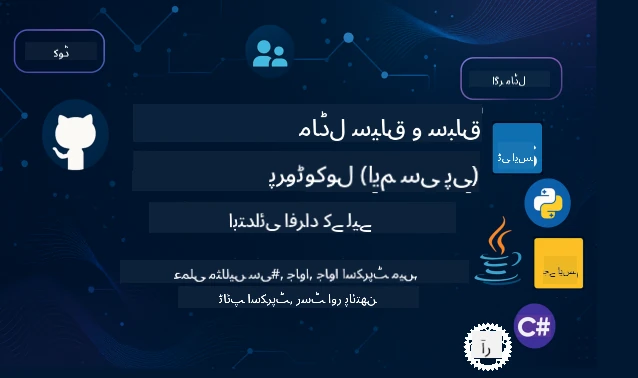

 

[](https://GitHub.com/microsoft/mcp-for-beginners/graphs/contributors)
[](https://GitHub.com/microsoft/mcp-for-beginners/issues)
[](https://GitHub.com/microsoft/mcp-for-beginners/pulls)
[](http://makeapullrequest.com)

[](https://GitHub.com/microsoft/mcp-for-beginners/watchers)
[](https://GitHub.com/microsoft/mcp-for-beginners/fork)
[](https://GitHub.com/microsoft/mcp-for-beginners/stargazers)


[](https://discord.gg/nTYy5BXMWG)

ان وسائل کو استعمال کرنے کے لیے درج ذیل مراحل پر عمل کریں:
1. **ریپوزیٹری کو فورک کریں**: کلک کریں [](https://GitHub.com/microsoft/mcp-for-beginners/fork)
2. **ریپوزیٹری کو کلون کریں**: `git clone https://github.com/microsoft/mcp-for-beginners.git`
3. **شامل ہوں** [](https://discord.gg/nTYy5BXMWG)


### 🌐 کثیر الزبان تعاون

#### GitHub Action کے ذریعے حمایت یافتہ (خودکار اور ہمیشہ تازہ ترین)

<!-- CO-OP TRANSLATOR LANGUAGES TABLE START -->
[Arabic](../ar/README.md) | [Bengali](../bn/README.md) | [Bulgarian](../bg/README.md) | [Burmese (Myanmar)](../my/README.md) | [Chinese (Simplified)](../zh-CN/README.md) | [Chinese (Traditional, Hong Kong)](../zh-HK/README.md) | [Chinese (Traditional, Macau)](../zh-MO/README.md) | [Chinese (Traditional, Taiwan)](../zh-TW/README.md) | [Croatian](../hr/README.md) | [Czech](../cs/README.md) | [Danish](../da/README.md) | [Dutch](../nl/README.md) | [Estonian](../et/README.md) | [Finnish](../fi/README.md) | [French](../fr/README.md) | [German](../de/README.md) | [Greek](../el/README.md) | [Hebrew](../he/README.md) | [Hindi](../hi/README.md) | [Hungarian](../hu/README.md) | [Indonesian](../id/README.md) | [Italian](../it/README.md) | [Japanese](../ja/README.md) | [Kannada](../kn/README.md) | [Korean](../ko/README.md) | [Lithuanian](../lt/README.md) | [Malay](../ms/README.md) | [Malayalam](../ml/README.md) | [Marathi](../mr/README.md) | [Nepali](../ne/README.md) | [Nigerian Pidgin](../pcm/README.md) | [Norwegian](../no/README.md) | [Persian (Farsi)](../fa/README.md) | [Polish](../pl/README.md) | [Portuguese (Brazil)](../pt-BR/README.md) | [Portuguese (Portugal)](../pt-PT/README.md) | [Punjabi (Gurmukhi)](../pa/README.md) | [Romanian](../ro/README.md) | [Russian](../ru/README.md) | [Serbian (Cyrillic)](../sr/README.md) | [Slovak](../sk/README.md) | [Slovenian](../sl/README.md) | [Spanish](../es/README.md) | [Swahili](../sw/README.md) | [Swedish](../sv/README.md) | [Tagalog (Filipino)](../tl/README.md) | [Tamil](../ta/README.md) | [Telugu](../te/README.md) | [Thai](../th/README.md) | [Turkish](../tr/README.md) | [Ukrainian](../uk/README.md) | [Urdu](./README.md) | [Vietnamese](../vi/README.md)

> **مقامی طور پر کلون کرنا پسند کریں گے؟**
>
> اس ریپوزیٹری میں 50+ زبانوں کے تراجم شامل ہیں جو ڈاؤن لوڈ کے سائز میں نمایاں اضافہ کرتے ہیں۔ بغیر تراجم کے کلون کرنے کے لیے sparse checkout استعمال کریں:
>
> **Bash / macOS / Linux:**
> ```bash
> git clone --filter=blob:none --sparse https://github.com/microsoft/mcp-for-beginners.git
> cd mcp-for-beginners
> git sparse-checkout set --no-cone '/*' '!translations' '!translated_images'
> ```
>
> **CMD (Windows):**
> ```cmd
> git clone --filter=blob:none --sparse https://github.com/microsoft/mcp-for-beginners.git
> cd mcp-for-beginners
> git sparse-checkout set --no-cone "/*" "!translations" "!translated_images"
> ```
>
> اس سے آپ کے پاس کورس مکمل کرنے کے لیے ہر چیز ہوگی، اور ڈاؤن لوڈ بہت تیز ہوگا۔
<!-- CO-OP TRANSLATOR LANGUAGES TABLE END -->

# 🚀 ماڈل کونٹیکسٹ پروٹوکول (MCP) نصاب برائے ابتدائی

## **C#, Java, JavaScript, Rust, Python, اور TypeScript میں عملی کوڈ مثالوں کے ساتھ MCP سیکھیں**

## 🧠 ماڈل کونٹیکسٹ پروٹوکول نصاب کا جائزہ
ماڈل کونٹیکسٹ پروٹوکول کی اپنی سفر میں خوش آمدید! اگر آپ نے کبھی سوچا ہے کہ AI ایپلیکیشنز مختلف ٹولز اور سروسز سے کیسے بات چیت کرتی ہیں، تو آپ ایک خوبصورت حل دریافت کرنے جا رہے ہیں جو ڈیولپرز کے لیے ذہین نظام بنانے کے طریقے بدل رہا ہے۔

MCP کو AI ایپلیکیشنز کے لیے ایک یونیورسل ٹرانسلیٹر سمجھیں — جس طرح USB پورٹس آپ کو کسی بھی ڈیوائس کو کمپیوٹر سے جوڑنے دیتی ہیں، ویسے ہی MCP AI ماڈلز کو کسی بھی ٹول یا سروس سے معیاری انداز میں کنیکٹ کرنے دیتا ہے۔ چاہے آپ اپنی پہلی چیٹ بوٹ بنا رہے ہوں یا پیچیدہ AI ورک فلو پر کام کر رہے ہوں، MCP کو سمجھنا آپ کو زیادہ قابل اور لچکدار ایپلیکیشنز بنانے کی طاقت دے گا۔

یہ نصاب آپ کی سیکھنے کی راہ میں صبر اور توجہ سے ڈیزائن کیا گیا ہے۔ ہم آپ کو پہلے سے معلوم آسان تصورات سے شروع کریں گے اور آپ کی مہارت کو آپ کی پسندیدہ پروگرامنگ زبان میں عملی مشقوں کے ذریعے بتدریج فروغ دیں گے۔ ہر مرحلے میں واضح وضاحت، عملی مثالیں، اور بہت حوصلہ افزائی شامل ہے۔

جب آپ یہ سفر مکمل کر لیں گے، تو آپ کو اپنے MCP سرورز بنانے، انہیں مقبول AI پلیٹ فارمز کے ساتھ ضم کرنے، اور اس ٹیکنالوجی کے AI کی ترقی کے مستقبل کو کیسے تبدیل کر رہی ہے سمجھنے کا اعتماد حاصل ہوگا۔ آئیے اس دلچسپ مہم کا آغاز کریں!

### سرکاری دستاویزات اور وضاحتیں

یہ نصاب **MCP اسپیسفیکیشن 2025-11-25** (تازہ ترین مستحکم ورژن) کے مطابق ترتیب دیا گیا ہے۔ MCP وضاحت تاریخ کی بنیاد پر ورژننگ (YYYY-MM-DD فارمیٹ) استعمال کرتی ہے تاکہ پروٹوکول ورژن کا واضح سراغ لگانا ممکن ہو۔

یہ وسائل آپ کی سمجھ بوجھ میں اضافے کے ساتھ زیادہ قیمتی ہو جائیں گے، لیکن فوراً سب کچھ پڑھنے کا دباؤ محسوس نہ کریں۔ سب سے زیادہ دلچسپی والے حصوں سے شروع کریں!
- 📘 [MCP دستاویزات](https://modelcontextprotocol.io/) – یہ آپ کے لیے مرحلہ وار ٹیوٹوریلز اور صارف گائیڈز کا بہترین ذریعہ ہے۔ دستاویزات خاص طور پر ابتدائیوں کے لیے لکھی گئی ہیں، جن میں واضح مثالیں شامل ہیں جن کے ذریعے آپ اپنے لحاظ سے آگے بڑھ سکتے ہیں۔
- 📜 [MCP وضاحت](https://modelcontextprotocol.io/specification/2025-11-25) – اسے آپ کا مکمل حوالہ جاتی دستی سمجھیں۔ نصاب کے دوران، آپ مخصوص تفصیلات دیکھنے اور ترقی یافتہ خصوصیات کو دریافت کرنے کے لیے یہاں بار بار آنا چاہیں گے۔
- 📜 [MCP وضاحت ورژننگ](https://modelcontextprotocol.io/specification/versioning) – اس میں پروٹوکول ورژن کی تاریخ اور اس بات کی معلومات شامل ہے کہ MCP تاریخ کی بنیاد پر ورژننگ (YYYY-MM-DD فارمیٹ) کیسے استعمال کرتا ہے۔
- 🧑‍💻 [MCP GitHub ریپوزیٹری](https://github.com/modelcontextprotocol) – یہاں آپ کو متعدد پروگرامنگ زبانوں میں SDKs، ٹولز، اور کوڈ کی مثالیں ملیں گی۔ یہ عملی مثالوں اور استعمال کے لیے تیار کمپونینٹس کا خزانہ ہے۔
- 🌐 [MCP کمیونٹی](https://github.com/orgs/modelcontextprotocol/discussions) – دوسرے سیکھنے والوں اور تجربہ کار ڈیولپرز کے ساتھ MCP کے بارے میں بحث میں شامل ہوں۔ یہ ایک سپورٹیو کمیونٹی ہے جہاں سوالات خوش آمدید کہے جاتے ہیں اور علم با آسانی شیئر کیا جاتا ہے۔
  
## سیکھنے کے مقاصد

اس نصاب کے آخر تک، آپ کو اپنی نئی صلاحیتوں پر اعتماد اور جوش محسوس ہوگا۔ آپ جو حاصل کریں گے درج ذیل ہے:

• **MCP کی بنیادیں سمجھنا**: آپ سمجھ جائیں گے کہ ماڈل کونٹیکسٹ پروٹوکول کیا ہے اور یہ AI ایپلیکیشنز کے ساتھ کام کرنے کے طریقے کو کیوں انقلابیت دے رہا ہے، مثالوں اور تشبیہوں کے ذریعے جو آپ کو سمجھ میں آ جائیں۔

• **اپنا پہلا MCP سرور بنائیں**: آپ اپنی پسند کی پروگرامنگ زبان میں ایک کام کرنے والا MCP سرور بنائیں گے، آسان مثالوں سے شروع کر کے قدم بہ قدم اپنی مہارت بڑھائیں گے۔

• **AI ماڈلز کو حقیقی ٹولز سے جوڑیں**: آپ سیکھیں گے کہ AI ماڈلز اور حقیقی خدمات کے درمیان پل کیسے بنایا جاتا ہے، تاکہ آپ کی ایپلیکیشنز میں زبردست صلاحیتیں آئیں۔

• **حفاظتی بہترین طریقے نافذ کریں**: آپ سمجھیں گے کہ MCP کی تنفیذات کو محفوظ کیسے رکھا جائے، اپنے ایپلیکیشنز اور صارفین دونوں کی حفاظت کرتے ہوئے۔

• **بے ڈر تعیناتی کریں**: آپ جانیں گے کہ اپنے MCP پروجیکٹس کو ترقی سے پیداواری مرحلے میں کیسے لے جانا ہے، عملی تعیناتی کی حکمت عملیوں کے ساتھ جو حقیقی دنیا میں کام کرتی ہیں۔

• **MCP کمیونٹی میں شامل ہوں**: آپ اس بڑھتی ہوئی کمیونٹی کا حصہ بنیں گے جو AI ایپلیکیشنز کی ترقی کے مستقبل کو تشکیل دے رہی ہے۔ 

## ضروری پس منظر

MCP کی مخصوص باتوں میں جانے سے پہلے، آئیے یقینی بنائیں کہ آپ کچھ بنیادی تصورات میں آرام دہ ہیں۔ پریشان نہ ہوں اگر آپ ان علاقوں میں ماہر نہیں – ہم آپ کو آگے چلتے چلتے ہر چیز سمجھائیں گے!

### پروٹوکولز کو سمجھنا (بنیاد)

پروٹوکول کو یوں سمجھیں جیسے بات چیت کے قواعد۔ جب آپ دوست کو کال کرتے ہیں، تو دونوں جانتے ہیں کہ جواب میں "ہیلو" کہنا ہے، باری باری بات کرنی ہے، اور ختم ہوتے وقت "خدا حافظ" کہنا ہے۔ کمپیوٹر پروگرامز کو بھی مؤثر بات چیت کے لیے ایسے ہی قواعد کی ضرورت ہوتی ہے۔

MCP ایک پروٹوکول ہے — یعنی ایک مخصوص اصولوں کا مجموعہ جو AI ماڈلز اور ایپلیکیشنز کو ٹولز اور خدمات کے ساتھ نتیجہ خیز "بات چیت" کرنے میں مدد دیتا ہے۔ جیسے باتچیت کے قواعد انسانوں کے درمیان رابطے کو آسان بناتے ہیں، ویسے ہی MCP AI ایپلیکیشنز کی بات چیت کو زیادہ قابلِ اعتماد اور طاقتور بناتا ہے۔

### کلائنٹ-سرور تعلقات (پروگرامز ایک ساتھ کیسے کام کرتے ہیں)

آپ روزانہ کلائنٹ-سرور تعلقات استعمال کرتے ہیں! جب آپ ویب براؤزر (کلائنٹ) سے ویب سائٹ پر جاتے ہیں، تو آپ ایک ویب سرور سے جڑتے ہیں جو آپ کو صفحے کا مواد بھیجتا ہے۔ براؤزر جانتا ہے کہ معلومات کیسے درخواست کریں، اور سرور جانتا ہے کہ جواب کیسے دینا ہے۔

MCP میں ایسا ہی تعلق ہے: AI ماڈلز کلائنٹ کے طور پر کام کرتے ہیں جو معلومات یا عمل کی درخواست کرتے ہیں، جبکہ MCP سرور آف کرتا ہے وہ صلاحیتیں۔ یہ ایسے ہے جیسے AI کی مدد کے لیے ایک معاون (سرور) ہو جس سے AI مخصوص کام کروا سکے۔

### معیاری بنانے کی اہمیت (چیزوں کو ساتھ کام کرنے کے قابل بنانا)

تصور کریں اگر ہر گاڑی بنانے والے کا گیس پمپ مختلف شکل کا ہو — آپ کو ہر گاڑی کے لیے الگ ایڈاپٹر چاہیے ہوگا! معیاری بنانے کا مطلب ہے مشترکہ طریقوں پر اتفاق کرنا تاکہ چیزیں بغیر رکاوٹ ایک ساتھ کام کریں۔

MCP AI ایپلیکیشنز کے لیے یہی معیاری بناتا ہے۔ اس کے بجائے کہ ہر AI ماڈل کو ہر ٹول کے لیے خصوصی کوڈ لکھنا پڑے، MCP ایک یونیورسل طریقہ فراہم کرتا ہے جس سے وہ بات کر سکتے ہیں۔ اس کا مطلب ہے کہ ڈیولپرز ایک بار ٹول بنا کر اسے کئی AI سسٹمز کے ساتھ کام کرنے کے قابل بنا سکتے ہیں۔

## 🧭 آپ کے سیکھنے کے راستے کا جائزہ

آپ کا MCP سفر غور و فکر سے ترتیب دیا گیا ہے تاکہ آپ کا اعتماد اور مہارت مرحلہ وار بڑھے۔ ہر مرحلہ نئے تصورات متعارف کراتا ہے اور جو کچھ آپ نے پہلے سیکھا ہے اسے مضبوط کرتا ہے۔

### 🌱 بنیاد کا مرحلہ: بنیادی باتوں کو سمجھنا (ماڈیول 0-2)

یہاں سے آپ کا سفر شروع ہوتا ہے! ہم آپ کو MCP تفکرات سے واقف کروائیں گے، مشہور تشبیہوں اور آسان مثالوں کے ذریعے۔ آپ سمجھیں گے کہ MCP کیا ہے، یہ کیوں موجود ہے، اور یہ AI ڈیولپمنٹ کی بڑی دنیا میں کیسے فٹ بیٹھتا ہے۔

• **ماڈیول 0 - MCP کا تعارف**: ہم شروع میں دیکھیں گے کہ MCP کیا ہے اور جدید AI ایپلیکیشنز کے لیے یہ کیوں اتنا اہم ہے۔ آپ MCP کے حقیقی دنیا کے استعمالات دیکھیں گے اور سمجھیں گے کہ یہ ڈیولپرز کو درپیش عام مسائل کو کیسے حل کرتا ہے۔

• **ماڈیول 1 - بنیادی تصورات کی وضاحت**: یہاں آپ MCP کے بنیادی عناصر سیکھیں گے۔ بہت سی تشبیہیں اور تصویری مثالیں استعمال کریں گے تاکہ یہ تصورات آپ کو فطری اور سمجھنے میں آسان لگیں۔

• **ماڈیول 2 - MCP میں سیکورٹی**: سیکورٹی سن کر خوفزدہ نہ ہوں، ہم دکھائیں گے کہ MCP میں محفوظ خصوصیات شامل ہیں اور آپ کو بہترین طریقے سکھائیں گے جو آپ کی ایپلیکیشنز کو شروع سے محفوظ رکھتے ہیں۔

### 🔨 تعمیری مرحلہ: اپنی پہلی تنفیذات بنانا (ماڈیول 3)

اب اصل مزہ شروع ہوتا ہے! آپ کو عملی تجربہ حاصل ہوگا، حقیقی MCP سرورز اور کلائنٹس بنانے کا موقع ملے گا۔ فکر نہ کریں — ہم سادہ آغاز کر کے آپ کو ہر قدم پر رہنمائی فراہم کریں گے۔
یہ ماڈیول کئی عملی رہنما شامل کرتا ہے جو آپ کو آپ کی پسندیدہ پروگرامنگ زبان میں پریکٹس کرنے کی اجازت دیتے ہیں۔ آپ اپنا پہلا سرور بنائیں گے، اس سے جڑنے کے لیے ایک کلائنٹ تیار کریں گے، اور یہاں تک کہ VS کوڈ جیسے مقبول ترقیاتی آلات کے ساتھ بھی انضمام کریں گے۔

ہر رہنما میں مکمل کوڈ مثالیں، مسئلہ حل کرنے کے نکات، اور وضاحتیں شامل ہیں کہ ہم مخصوص ڈیزائن انتخاب کیوں کرتے ہیں۔ اس مرحلے کے آخر تک، آپ کے پاس کام کرنے والی MCP نافذ کی گئی ہوں گی جن پر آپ فخر کر سکتے ہیں!

### 🚀 ترقیاتی مرحلہ: جدید تصورات اور حقیقی دنیا کی ایپلیکیشن (ماڈیول 4-5)

بنیادی باتوں پر عبور حاصل کرنے کے بعد، آپ مزید پیچیدہ MCP خصوصیات کو دریافت کرنے کے لیے تیار ہیں۔ ہم عملی نفاذ کی حکمت عملیوں، ڈیبگنگ تکنیکوں، اور ملٹی موڈل AI انضمام جیسے جدید موضوعات کا احاطہ کریں گے۔

آپ یہ بھی سیکھیں گے کہ MCP نفاذ کو پیداوار کے لیے کیسے اسکیل کیا جائے اور Azure جیسے کلاؤڈ پلیٹ فارمز کے ساتھ انضمام کیسے کریں۔ یہ ماڈیولز آپ کو ایسی MCP حل بنانے کی تیاری کرتے ہیں جو حقیقی دنیا کی ضروریات کو سنبھال سکیں۔

### 🌟 مہارت کا مرحلہ: کمیونٹی اور خصوصی مہارت (ماڈیول 6-11)

آخری مرحلہ MCP کمیونٹی میں شامل ہونے اور ان شعبوں میں مہارت حاصل کرنے پر مرکوز ہے جو آپ کو سب سے زیادہ دلچسپ لگتے ہیں۔ آپ یہ سیکھیں گے کہ اوپن سورس MCP پروجیکٹس میں کیسے تعاون کریں، جدید توثیقی پیٹرنز implement کریں، اور جامع ڈیٹا بیس انضمام حل تیار کریں۔

ماڈیول 11 خصوصی ذکر کا مستحق ہے - یہ مکمل 13 لیبز پر مشتمل عملی سیکھنے کا راستہ ہے جو آپ کو PostgreSQL انضمام کے ساتھ پیداوار کے لیے تیار MCP سرورز بنانے کی تعلیم دیتا ہے۔ یہ ایک کیپ اسٹون پروجیکٹ کی طرح ہے جو آپ نے جو کچھ سیکھا ہے اسے یکجا کرتا ہے!

### 📚 مکمل نصاب کی ساخت

| ماڈیول | موضوع | تفصیل | لنک |
|--------|-------|-------------|------|
| **ماڈیول 0-3: بنیادی باتیں** | | | |
| 00 | MCP کا تعارف | ماڈل کانٹیکسٹ پروٹوکول اور AI پائپ لائنز میں اس کی اہمیت کا جائزہ | [مزید پڑھیں](./00-Introduction/README.md) |
| 01 | بنیادی تصورات کی وضاحت | MCP کے بنیادی تصورات کی تفصیلی دریافت | [مزید پڑھیں](./01-CoreConcepts/README.md) |
| 02 | MCP میں سیکیورٹی | سیکیورٹی خطرات اور بہترین طریقے | [مزید پڑھیں](./02-Security/README.md) |
| 03 | MCP کے ساتھ شروعات | ماحول کی ترتیب، بنیادی سرورز/کلائنٹس، انضمام | [مزید پڑھیں](./03-GettingStarted/README.md) |
| **ماڈیول 3: اپنا پہلا سرور اور کلائنٹ بنانا** | | | |
| 3.1 | پہلا سرور | اپنا پہلا MCP سرور بنائیں | [رہنما](./03-GettingStarted/01-first-server/README.md) |
| 3.2 | پہلا کلائنٹ | ایک بنیادی MCP کلائنٹ تیار کریں | [رہنما](./03-GettingStarted/02-client/README.md) |
| 3.3 | LLM کے ساتھ کلائنٹ | بڑے زبان ماڈلز کا انضمام کریں | [رہنما](./03-GettingStarted/03-llm-client/README.md) |
| 3.4 | VS کوڈ انضمام | VS کوڈ میں MCP سرورز استعمال کریں | [رہنما](./03-GettingStarted/04-vscode/README.md) |
| 3.5 | stdio سرور | stdio ٹرانسپورٹ استعمال کرتے ہوئے سرور بنائیں | [رہنما](./03-GettingStarted/05-stdio-server/README.md) |
| 3.6 | HTTP سٹریمنگ | MCP میں HTTP سٹریمنگ نافذ کریں | [رہنما](./03-GettingStarted/06-http-streaming/README.md) |
| 3.7 | AI ٹول کٹ | MCP کے ساتھ AI ٹول کٹ استعمال کریں | [رہنما](./03-GettingStarted/07-aitk/README.md) |
| 3.8 | ٹیسٹنگ | اپنے MCP سرور کے نفاذ کی جانچ کریں | [رہنما](./03-GettingStarted/08-testing/README.md) |
| 3.9 | تعیناتی | MCP سرورز کو پروڈکشن میں تعینات کریں | [رہنما](./03-GettingStarted/09-deployment/README.md) |
| 3.10 | جدید سرور استعمال | جدید خصوصیات کے استعمال اور بہتر آرکیٹیکچر کے لیے جدید سرورز استعمال کریں | [رہنما](./03-GettingStarted/10-advanced/README.md) |
| 3.11 | سادہ توثیق | ایک باب جو آپ کو ابتدا سے توثیق اور RBAC دکھاتا ہے | [رہنما](./03-GettingStarted/11-simple-auth/README.md) |
| 3.12 | MCP میزبان | کلاؤڈ ڈیسک ٹاپ، کرسر، کلائن، اور دیگر MCP میزبانوں کی تشکیل | [رہنما](./03-GettingStarted/12-mcp-hosts/README.md) |
| 3.13 | MCP انسپیٹر | انسپیٹر ٹول کے ساتھ MCP سرورز کی ڈیبگنگ اور جانچ | [رہنما](./03-GettingStarted/13-mcp-inspector/README.md) |
| 3.14 | سیمپلنگ | کلائنٹ کے ساتھ تعاون کے لیے سیمپلنگ استعمال کریں | [رہنما](./03-GettingStarted/14-sampling/README.md) |
| 3.15 | MCP ایپس | MCP ایپس بنائیں | [رہنما](./03-GettingStarted/15-mcp-apps/README.md) |

| **ماڈیول 4-5: عملی اور جدید** | | | |
| 04 | عملی نفاذ | SDKs، ڈیبگنگ، ٹیسٹنگ، قابلِ استعمال پرامپٹ ٹیمپلیٹس | [مزید پڑھیں](./04-PracticalImplementation/README.md) |
| 4.1 | صفحہ بندی | کرسر پر مبنی صفحہ بندی کے ساتھ بڑے نتیجہ سیٹ سنبھالیں | [رہنما](./04-PracticalImplementation/pagination/README.md) |
| 05 | MCP میں جدید موضوعات | ملٹی موڈل AI، اسکیلنگ، انٹرپرائز استعمال | [مزید پڑھیں](./05-AdvancedTopics/README.md) |
| 5.1 | Azure انضمام | Azure کے ساتھ MCP انضمام | [رہنما](./05-AdvancedTopics/mcp-integration/README.md) |
| 5.2 | ملٹی موڈلٹی | متعدد موڈالٹیز کے ساتھ کام کرنا | [رہنما](./05-AdvancedTopics/mcp-multi-modality/README.md) |
| 5.3 | OAuth2 ڈیمو | OAuth2 توثیق نافذ کریں | [رہنما](./05-AdvancedTopics/mcp-oauth2-demo/README.md) |
| 5.4 | روٹ کانٹیکسٹس | روٹ کانٹیکسٹس کو سمجھیں اور نافذ کریں | [رہنما](./05-AdvancedTopics/mcp-root-contexts/README.md) |
| 5.5 | راؤٹنگ | MCP راؤٹنگ حکمت عملی | [رہنما](./05-AdvancedTopics/mcp-routing/README.md) |
| 5.6 | سیمپلنگ | MCP میں سیمپلنگ تکنیکیں | [رہنما](./05-AdvancedTopics/mcp-sampling/README.md) |
| 5.7 | اسکیلنگ | MCP نفاذ کو اسکیل کریں | [رہنما](./05-AdvancedTopics/mcp-scaling/README.md) |
| 5.8 | سیکیورٹی | جدید سیکیورٹی کے پہلو | [رہنما](./05-AdvancedTopics/mcp-security/README.md) |
| 5.9 | ویب سرچ | ویب سرچ کی صلاحیتیں نافذ کریں | [رہنما](./05-AdvancedTopics/web-search-mcp/README.md) |
| 5.10 | حقیقی وقت کی سٹریمنگ | حقیقی وقت کی سٹریمنگ کی فعالیت بنائیں | [رہنما](./05-AdvancedTopics/mcp-realtimestreaming/README.md) |
| 5.11 | حقیقی وقت کی تلاش | حقیقی وقت کی تلاش نافذ کریں | [رہنما](./05-AdvancedTopics/mcp-realtimesearch/README.md) |
| 5.12 | Entra ID توثیق | Microsoft Entra ID کے ساتھ توثیق | [رہنما](./05-AdvancedTopics/mcp-security-entra/README.md) |
| 5.13 | Foundry انضمام | Azure AI Foundry کے ساتھ انضمام | [رہنما](./05-AdvancedTopics/mcp-foundry-agent-integration/README.md) |
| 5.14 | کانٹیکسٹ انجینئرنگ | موثر کانٹیکسٹ انجینئرنگ کی تکنیکیں | [رہنما](./05-AdvancedTopics/mcp-contextengineering/README.md) |
| 5.15 | MCP کسٹم ٹرانسپورٹ | کسٹم ٹرانسپورٹ نفاذ | [رہنما](./05-AdvancedTopics/mcp-transport/README.md) |
| 5.16 | پروٹوکول خصوصیات | پیش رفت کی اطلاعات، کینسلیشن، وسائل کے ٹیمپلیٹس | [رہنما](./05-AdvancedTopics/mcp-protocol-features/README.md) |
| **ماڈیول 6-10: کمیونٹی اور بہترین طریقے** | | | |
| 06 | کمیونٹی تعاون | MCP ماحولیاتی نظام میں حصہ ڈالنا کیسے ہے | [رہنما](./06-CommunityContributions/README.md) |
| 07 | ابتدائی اپنانے سے بصیرتیں | حقیقی دنیا کی نفاذ کہانیاں | [رہنما](./07-LessonsfromEarlyAdoption/README.md) |
| 08 | MCP کے لیے بہترین طریقے | کارکردگی، نقص برداشت، لچک | [رہنما](./08-BestPractices/README.md) |
| 09 | MCP کیس اسٹڈیز | عملی نفاذ کی مثالیں | [رہنما](./09-CaseStudy/README.md) |
| 10 | عملی ورکشاپ | AI ٹول کٹ کے ساتھ MCP سرور کی تعمیر | [لیب](./10-StreamliningAIWorkflowsBuildingAnMCPServerWithAIToolkit/README.md) |
| **ماڈیول 11: MCP سرور عملی لیب** | | | |
| 11 | MCP سرور ڈیٹا بیس انضمام | PostgreSQL انضمام کے لیے مکمل 13 لیبز پر مشتمل عملی سیکھنے کا راستہ | [لیبز](./11-MCPServerHandsOnLabs/README.md) |
| 11.1 | تعارف | MCP کا ڈیٹا بیس انضمام اور ریٹیل اینالٹکس استعمال کیس کا جائزہ | [لیب 00](./11-MCPServerHandsOnLabs/00-Introduction/README.md) |
| 11.2 | بنیادی آرکیٹیکچر | MCP سرور آرکیٹیکچر، ڈیٹا بیس لیئرز، اور سیکیورٹی پیٹرنز کی سمجھ | [لیب 01](./11-MCPServerHandsOnLabs/01-Architecture/README.md) |
| 11.3 | سیکیورٹی اور ملٹی ٹیننسی | رو لیول سیکیورٹی، توثیق، اور ملٹی ٹیننٹ ڈیٹا تک رسائی | [لیب 02](./11-MCPServerHandsOnLabs/02-Security/README.md) |
| 11.4 | ماحول کی ترتیب | ترقیاتی ماحول، ڈاکر، Azure وسائل کی ترتیب | [لیب 03](./11-MCPServerHandsOnLabs/03-Setup/README.md) |
| 11.5 | ڈیٹا بیس ڈیزائن | PostgreSQL سیٹ اپ، ریٹیل اسکیمہ ڈیزائن، اور نمونہ ڈیٹا | [لیب 04](./11-MCPServerHandsOnLabs/04-Database/README.md) |
| 11.6 | MCP سرور نفاذ | ڈیٹا بیس انضمام کے ساتھ FastMCP سرور بنانا | [لیب 05](./11-MCPServerHandsOnLabs/05-MCP-Server/README.md) |
| 11.7 | اوزار کی ترقی | ڈیٹا بیس کویری اوزار اور اسکیمہ انٹروسپیکشن تیار کرنا | [لیب 06](./11-MCPServerHandsOnLabs/06-Tools/README.md) |
| 11.8 | سمینٹک سرچ | Azure OpenAI اور pgvector کے ساتھ ویکٹر ایمبیڈنگز نافذ کرنا | [لیب 07](./11-MCPServerHandsOnLabs/07-Semantic-Search/README.md) |
| 11.9 | ٹیسٹنگ اور ڈیبگنگ | ٹیسٹنگ حکمت عملیاں، ڈیبگنگ ٹولز، اور تصدیقی طریقے | [لیب 08](./11-MCPServerHandsOnLabs/08-Testing/README.md) |
| 11.10 | VS کوڈ انضمام | VS کوڈ MCP انضمام اور AI چیٹ کے استعمال کی تشکیل | [لیب 09](./11-MCPServerHandsOnLabs/09-VS-Code/README.md) |
| 11.11 | تعیناتی کی حکمت عملیاں | ڈاکر تعیناتی، Azure کنٹینر ایپس، اور اسکیلنگ کے پہلو | [لیب 10](./11-MCPServerHandsOnLabs/10-Deployment/README.md) |
| 11.12 | نگرانی | ایپلیکیشن انسائٹس، لاگنگ، کارکردگی کی نگرانی | [لیب 11](./11-MCPServerHandsOnLabs/11-Monitoring/README.md) |
| 11.13 | بہترین طریقے | کارکردگی میں بہتری، سیکیورٹی ہارڈننگ، اور پروڈکشن کے نکات | [لیب 12](./11-MCPServerHandsOnLabs/12-Best-Practices/README.md) |

### 💻 نمونہ کوڈ پراجیکٹس

MCP سیکھنے کے سب سے دلچسپ حصوں میں سے ایک یہ ہے کہ آپ کی کوڈنگ مہارت بتدریج کیسے ترقی کرتی ہے۔ ہم نے اپنی کوڈ مثالوں کو اس طرح ڈیزائن کیا ہے کہ وہ آسان سے شروع ہوں اور جیسے جیسے آپ کی سمجھ بڑھے، زیادہ پیچیدہ ہوتی جائیں۔ یہاں ہم تصورات کو ایسے طریقے سے متعارف کراتے ہیں — ایسے کوڈ کے ساتھ جو سمجھنے میں آسان ہے لیکن حقیقی MCP اصول دکھاتا ہے، آپ نہ صرف سمجھیں گے کہ یہ کوڈ کیا کرتا ہے بلکہ کیوں یہ اس طرح ساختہ ہے اور یہ بڑے MCP اطلاقات میں کیسے فٹ ہوتا ہے۔

#### بنیادی MCP کیلکولیٹر نمونے

| زبان | تفصیل | لنک |
|----------|-------------|------|
| C# | MCP سرور کی مثال | [کوڈ دیکھیں](./03-GettingStarted/samples/csharp/README.md) |
| Java | MCP کیلکولیٹر | [کوڈ دیکھیں](./03-GettingStarted/samples/java/calculator/README.md) |
| JavaScript | MCP ڈیمو | [کوڈ دیکھیں](./03-GettingStarted/samples/javascript/README.md) |
| Python | MCP سرور | [کوڈ دیکھیں](../../03-GettingStarted/samples/python/mcp_calculator_server.py) |
| TypeScript | MCP مثال | [کوڈ دیکھیں](./03-GettingStarted/samples/typescript/README.md) |
| Rust | MCP مثال | [کوڈ دیکھیں](./03-GettingStarted/samples/rust/README.md) |

#### جدید MCP نفاذ

| زبان | تفصیل | لنک |
|----------|-------------|------|
| C# | جدید نمونہ | [کوڈ دیکھیں](./04-PracticalImplementation/samples/csharp/README.md) |
| Java with Spring | کنٹینر ایپ کی مثال | [کوڈ دیکھیں](./04-PracticalImplementation/samples/java/containerapp/README.md) |
| JavaScript | جدید نمونہ | [کوڈ دیکھیں](./04-PracticalImplementation/samples/javascript/README.md) |
| Python | پیچیدہ نفاذ | [کوڈ دیکھیں](./04-PracticalImplementation/samples/python/README.md) |
| TypeScript | کنٹینر نمونہ | [کوڈ دیکھیں](./04-PracticalImplementation/samples/typescript/README.md) |


## 🎯 MCP سیکھنے کے لیے درکار شرائط

اس نصاب سے زیادہ سے زیادہ فائدہ اٹھانے کے لیے، آپ کے پاس ہونا چاہیے:
- کم از کم درج ذیل زبانوں میں سے کسی ایک میں پروگرامنگ کا بنیادی علم: C#، جاوا، جاوا اسکرپٹ، پائتھون، یا ٹائپ اسکرپٹ  
- کلائنٹ-سرور ماڈل اور APIs کی سمجھ  
- REST اور HTTP کے تصورات سے واقفیت  
- (اختیاری) AI/ML کے تصورات میں پس منظر  

- تعاون کے لیے ہماری کمیونٹی مباحثوں میں شامل ہونا  

## 📚 مطالعہ گائیڈ اور وسائل  

یہ ریپوزیٹری آپ کی مؤثر نیویگیشن اور سیکھنے میں مدد کے لیے متعدد وسائل پیش کرتی ہے:  

### مطالعہ گائیڈ  

ایک جامع [مطالعہ گائیڈ](./study_guide.md) دستیاب ہے جو آپ کو اس ریپوزیٹری میں مؤثر طریقے سے نیویگیٹ کرنے میں مدد دے گی۔ یہ بصری نصابی نقشہ دکھاتا ہے کہ تمام موضوعات کس طرح جڑے ہوئے ہیں اور نمونہ پروجیکٹس کو مؤثر طور پر استعمال کرنے کے لیے رہنمائی فراہم کرتا ہے۔ یہ خاص طور پر ان لوگوں کے لیے مددگار ہے جو بصری طور پر سیکھنا پسند کرتے ہیں اور بڑے منظرنامے کو دیکھنا چاہتے ہیں۔  

گائیڈ میں شامل ہیں:  
- تمام موضوعات کا بصری نصابی نقشہ  
- ہر سیکشن کی تفصیلی تقسیم  
- نمونہ پروجیکٹس کو استعمال کرنے کی رہنمائی  
- مختلف مہارت کی سطحوں کے لیے تجویز کردہ سیکھنے کے راستے  
- آپ کے تعلیمی سفر کی تکمیل کے لیے اضافی وسائل  

### تبدیلیوں کا لاگ  

ہم ایک تفصیلی [چینج لاگ](./changelog.md) برقرار رکھتے ہیں جو نصاب کے مواد میں تمام اہم اپ ڈیٹس کو ٹریک کرتا ہے تاکہ آپ جدید بہتریوں اور اضافوں سے باخبر رہ سکیں۔  
- نئے مواد کی شمولیت  
- ساختی تبدیلیاں  
- خصوصیات میں بہتری  
- دستاویزات کی تازہ کاری  

## 🛠️ اس نصاب کو مؤثر طریقے سے کیسے استعمال کریں  

اس گائیڈ کے ہر سبق میں شامل ہیں:  

1. MCP کے تصورات کی واضح وضاحتیں  
2. متعدد زبانوں میں لائیو کوڈ کے نمونے  
3. حقیقی MCP ایپلیکیشنز بنانے کی مشقیں  
4. اعلیٰ سطح کے سیکھنے والوں کے لیے اضافی وسائل  

### آئیے C# کے ساتھ MCP سیکھیں - ٹیوٹوریل سیریز  
آئیے ماڈل کانٹیکسٹ پروٹوکول (MCP) کے بارے میں سیکھتے ہیں، جو ایک جدید فریم ورک ہے جو AI ماڈلز اور کلائنٹ ایپلیکیشنز کے مابین تعاملات کو معیار بنانے کے لیے ڈیزائن کیا گیا ہے۔ اس ابتدائی سطح کے سیشن کے ذریعے، ہم آپ کو MCP سے متعارف کروائیں گے اور آپ کی رہنمائی کریں گے کہ آپ اپنا پہلا MCP سرور کیسے بنائیں۔  
#### C#: [https://aka.ms/letslearnmcp-csharp](https://aka.ms/letslearnmcp-csharp)  
#### جاوا: [https://aka.ms/letslearnmcp-java](https://aka.ms/letslearnmcp-java)  
#### جاوا اسکرپٹ: [https://aka.ms/letslearnmcp-javascript](https://aka.ms/letslearnmcp-javascript)  
#### پائتھون: [https://aka.ms/letslearnmcp-python](https://aka.ms/letslearnmcp-python)  

## 🎓 آپ کا MCP سفر شروع ہوتا ہے  

مبارک ہو! آپ نے ایک دلچسپ سفر کا پہلا قدم اٹھایا ہے جو آپ کی پروگرامنگ صلاحیتوں کو بڑھائے گا اور آپ کو AI کی ترقی کی جدید ترین سطح سے جوڑے گا۔  

### آپ نے جو پہلے ہی حاصل کیا ہے  

اس تعارف کو پڑھ کر، آپ نے پہلے ہی MCP کے علم کی بنیاد بنانا شروع کر دی ہے۔ آپ جانتے ہیں کہ MCP کیا ہے، کیوں اہم ہے، اور یہ نصاب آپ کے تعلیمی سفر کو کیسے سپورٹ کرے گا۔ یہ ایک اہم کامیابی ہے اور اس اہم ٹیکنالوجی میں آپ کی مہارت کی شروعات ہے۔  

### آگے کا سفر  

جب آپ ماڈیولز کے ذریعے آگے بڑھیں گے، یاد رکھیں کہ ہر ماہر کبھی نہ کبھی مبتدی تھا۔ وہ تصورات جو اب مشکل لگتے ہیں، مشق کرنے اور اطلاق کرنے سے فہم میں آسان ہو جائیں گے۔ ہر چھوٹا قدم آپ کی ترقی کیریئر کے دوران مضبوط صلاحیتوں کی بنیاد ہوگا۔  

### آپ کے مددگار نیٹ ورک  

آپ ایسی کمیونٹی کا حصہ بن رہے ہیں جو MCP کے بارے میں پرجوش ہے اور دوسروں کی کامیابی میں مدد کرنا چاہتی ہے۔ چاہے آپ کو کوڈنگ کے چیلنج میں مشکل پیش آئے یا آپ کو کوئی کامیابی شیئر کرنی ہو، کمیونٹی آپ کے سفر کی مدد کے لیے حاضر ہے۔  

اگر آپ پھنس جائیں یا AI ایپس بنانے کے بارے میں کوئی سوال ہو تو MCP پر مباحثوں میں شریک ہوں۔ یہ ایک معاون کمیونٹی ہے جہاں سوالات خوش آمدید ہیں اور علم کھلے دل سے شیئر کیا جاتا ہے۔  

[](https://discord.gg/nTYy5BXMWG)  

اگر آپ کو مصنوعاتی رائے یا غلطیاں درپیش ہوں تو اس لنک پر جائیں:  

[](https://aka.ms/foundry/forum)  

### شروع کرنے کے لیے تیار ہیں؟  

آپ کا MCP کا سفر ابھی شروع ہوتا ہے! ماڈیول 0 سے شروع کریں تاکہ آپ MCP کے پہلے عملی تجربات حاصل کر سکیں، یا نمونہ پروجیکٹس دیکھیں کہ آپ کیا بنائیں گے۔ یاد رکھیں - ہر ماہر نے بالکل آپ کی جگہ سے آغاز کیا، اور صبر اور مشق کے ساتھ آپ حیرت انگیز کامیابیاں حاصل کریں گے۔  

ماڈل کانٹیکسٹ پروٹوکول کی دنیا میں خوش آمدید۔ آئیں مل کر کچھ شاندار بنائیں!  

## 🤝 سیکھنے والی کمیونٹی میں شراکت داری  

یہ نصاب آپ جیسے سیکھنے والوں کی شراکت سے مضبوط ہوتا ہے! چاہے آپ ٹائپوز درست کر رہے ہوں، وضاحت میں بہتری تجویز کر رہے ہوں، یا نیا مثال شامل کر رہے ہوں، آپ کی شراکتیں دوسرے مبتدیوں کی کامیابی میں مدد کرتی ہیں۔  

شکریہ Microsoft Valued Professional [Shivam Goyal](https://www.linkedin.com/in/shivam2003/) کو کوڈ نمونوں میں تعاون دینے کے لیے۔  

شراکت کا عمل خوش آمدید اور معاون بنانے کے لیے ڈیزائن کیا گیا ہے۔ زیادہ تر شراکتوں کے لیے Contributor License Agreement (CLA) کی ضرورت ہوتی ہے، لیکن خودکار آلات آپ کو اس عمل میں آسانی سے رہنمائی کریں گے۔  

## 📜 اوپن سورس تعلیم  

یہ پورا نصاب MIT [LICENSE](../../LICENSE) کے تحت دستیاب ہے، جس کا مطلب ہے کہ آپ اسے آزادانہ طور پر استعمال، تبدیل اور شیئر کر سکتے ہیں۔ یہ ہمارا مقصد ہے کہ MCP کا علم ہر جگہ ڈیولپرز کے لیے قابل رسائی بنایا جائے۔  

## 🤝 شراکت کے اصول  

یہ پروجیکٹ شراکت اور تجاویز کا خیرمقدم کرتا ہے۔ زیادہ تر شراکت کے لیے آپ کو Contributor License Agreement (CLA) پر اتفاق کرنا ضروری ہوتا ہے، جس میں آپ یہ ظاہر کرتے ہیں کہ آپ کے پاس اپنے تعاون کے حقوق دینے کا حق اور اصل میں ان حقوق کا انعقاد ہے۔ تفصیلات کے لیے ملاحظہ کریں <https://cla.opensource.microsoft.com>۔  

جب آپ پل ریکوئسٹ جمع کرتے ہیں، تو CLA بوٹ خود بخود تعین کرے گا کہ آیا آپ کو CLA فراہم کرنا ہے اور PR کو مناسب طور پر نشان زد کرے گا (مثلاً، سٹیٹس چیک، تبصرہ)۔ صرف بوٹ کی ہدایات پر عمل کریں۔ آپ کو ہماری تمام ریپوز میں یہ صرف ایک بار کرنا ہوگا۔  

یہ پروجیکٹ نے [Microsoft Open Source Code of Conduct](https://opensource.microsoft.com/codeofconduct/) کو اپنایا ہے۔ مزید معلومات کے لیے [Code of Conduct FAQ](https://opensource.microsoft.com/codeofconduct/faq/) دیکھیں یا کسی اضافی سوال یا تبصرے کے لیے [opencode@microsoft.com](mailto:opencode@microsoft.com) سے رابطہ کریں۔  

---  

*کیا آپ اپنا MCP سفر شروع کرنے کے لیے تیار ہیں؟ [Module 00 - MCP کا تعارف](./00-Introduction/README.md) سے آغاز کریں اور ماڈل کانٹیکسٹ پروٹوکول کی دنیا میں اپنے پہلے قدم اٹھائیں!*  

## 🎒 دیگر کورسز  
ہماری ٹیم دیگر کورسز بھی تیار کرتی ہے! دیکھیں:  

<!-- CO-OP TRANSLATOR OTHER COURSES START -->  
### LangChain  
[](https://aka.ms/langchain4j-for-beginners)  
[](https://aka.ms/langchainjs-for-beginners?WT.mc_id=m365-94501-dwahlin)  
[](https://github.com/microsoft/langchain-for-beginners?WT.mc_id=m365-94501-dwahlin)  
---  

### Azure / Edge / MCP / Agents  
[](https://github.com/microsoft/AZD-for-beginners?WT.mc_id=academic-105485-koreyst)  
[](https://github.com/microsoft/edgeai-for-beginners?WT.mc_id=academic-105485-koreyst)  
[](https://github.com/microsoft/mcp-for-beginners?WT.mc_id=academic-105485-koreyst)  
[](https://github.com/microsoft/ai-agents-for-beginners?WT.mc_id=academic-105485-koreyst)  

---  
 
### Generative AI Series  
[](https://github.com/microsoft/generative-ai-for-beginners?WT.mc_id=academic-105485-koreyst)  
[-9333EA?style=for-the-badge&labelColor=E5E7EB&color=9333EA)](https://github.com/microsoft/Generative-AI-for-beginners-dotnet?WT.mc_id=academic-105485-koreyst)  
[-C084FC?style=for-the-badge&labelColor=E5E7EB&color=C084FC)](https://github.com/microsoft/generative-ai-for-beginners-java?WT.mc_id=academic-105485-koreyst)  
[-E879F9?style=for-the-badge&labelColor=E5E7EB&color=E879F9)](https://github.com/microsoft/generative-ai-with-javascript?WT.mc_id=academic-105485-koreyst)  

---  
 
### بنیادی تعلیم  
[](https://aka.ms/ml-beginners?WT.mc_id=academic-105485-koreyst)  
[](https://aka.ms/datascience-beginners?WT.mc_id=academic-105485-koreyst)  
[](https://aka.ms/ai-beginners?WT.mc_id=academic-105485-koreyst)  
[](https://github.com/microsoft/Security-101?WT.mc_id=academic-96948-sayoung)  
[](https://aka.ms/webdev-beginners?WT.mc_id=academic-105485-koreyst)  
[](https://aka.ms/iot-beginners?WT.mc_id=academic-105485-koreyst)  
[](https://github.com/microsoft/xr-development-for-beginners?WT.mc_id=academic-105485-koreyst)  

---  
 
### کوپائلٹ سیریز  
[](https://aka.ms/GitHubCopilotAI?WT.mc_id=academic-105485-koreyst)
[](https://github.com/microsoft/mastering-github-copilot-for-dotnet-csharp-developers?WT.mc_id=academic-105485-koreyst)
[](https://github.com/microsoft/CopilotAdventures?WT.mc_id=academic-105485-koreyst)
<!-- CO-OP TRANSLATOR OTHER COURSES END -->

---

<!-- CO-OP TRANSLATOR DISCLAIMER START -->
**تردید**:  
اس دستاویز کا ترجمہ AI ترجمہ سروس [Co-op Translator](https://github.com/Azure/co-op-translator) کے ذریعے کیا گیا ہے۔ اگرچہ ہم درستگی کی کوشش کرتے ہیں، براہ کرم آگاہ ہوں کہ خودکار ترجموں میں غلطیاں یا نقص ہو سکتے ہیں۔ اصل دستاویز اپنی مادری زبان میں ہی مستند ذریعہ تصور کی جانی چاہیے۔ اہم معلومات کے لیے پیشہ ور انسانی ترجمہ تجویز کیا جاتا ہے۔ ہم اس ترجمے کے استعمال سے پیدا ہونے والی کسی بھی غلط فہمی یا غلط تشریح کے ذمہ دار نہیں ہیں۔
<!-- CO-OP TRANSLATOR DISCLAIMER END -->