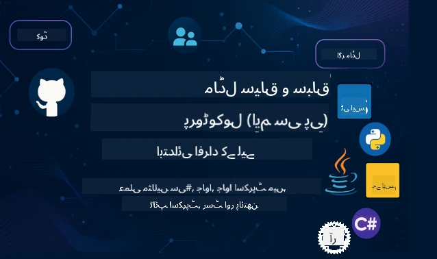

 

[](https://GitHub.com/microsoft/mcp-for-beginners/graphs/contributors)
[](https://GitHub.com/microsoft/mcp-for-beginners/issues)
[](https://GitHub.com/microsoft/mcp-for-beginners/pulls)
[](http://makeapullrequest.com)
[](https://mcptoplist.com/server/mcp.so%2Fmcp-for-beginners%2Fmicrosoft)

[](https://GitHub.com/microsoft/mcp-for-beginners/watchers)
[](https://GitHub.com/microsoft/mcp-for-beginners/fork)
[](https://GitHub.com/microsoft/mcp-for-beginners/stargazers)


[](https://discord.gg/nTYy5BXMWG)

ان وسائل کو استعمال کرنا شروع کرنے کے لیے درج ذیل مراحل پر عمل کریں:
1. **ریپوزیٹری کا فورک کریں**: کلک کریں [](https://GitHub.com/microsoft/mcp-for-beginners/fork)
2. **ریپوزیٹری کلون کریں**: `git clone https://github.com/microsoft/mcp-for-beginners.git`
3. **شمولیت اختیار کریں** [](https://discord.gg/nTYy5BXMWG)


### 🌐 کثیر الزبان معاونت

#### GitHub ایکشن کے ذریعے معاونت (خودکار اور ہمیشہ تازہ کاری)

<!-- CO-OP TRANSLATOR LANGUAGES TABLE START -->
[عربی](../ar/README.md) | [بنگالی](../bn/README.md) | [بلغاریائی](../bg/README.md) | [برمی (میانمار)](../my/README.md) | [چینی (سادہ)](../zh-CN/README.md) | [چینی (روایتی، ہانگ کانگ)](../zh-HK/README.md) | [چینی (روایتی، میکاؤ)](../zh-MO/README.md) | [چینی (روایتی، تائیوان)](../zh-TW/README.md) | [کروشیائی](../hr/README.md) | [جیک](../cs/README.md) | [ڈینش](../da/README.md) | [ڈچ](../nl/README.md) | [ایسٹونین](../et/README.md) | [فنیش](../fi/README.md) | [فرانسیسی](../fr/README.md) | [جرمن](../de/README.md) | [یونانی](../el/README.md) | [عبرانی](../he/README.md) | [ہندی](../hi/README.md) | [ہنگری](../hu/README.md) | [انڈونیشین](../id/README.md) | [اطالوی](../it/README.md) | [جاپانی](../ja/README.md) | [کنڑ](../kn/README.md) | [خمیر](../km/README.md) | [کوریائی](../ko/README.md) | [لتھوانین](../lt/README.md) | [مالے](../ms/README.md) | [مالایالیم](../ml/README.md) | [ماراٹی](../mr/README.md) | [نیپالی](../ne/README.md) | [نائجیریائی پڈگن](../pcm/README.md) | [ناروے](../no/README.md) | [فارسی (فارسی)](../fa/README.md) | [پولش](../pl/README.md) | [پرتگالی (برازیل)](../pt-BR/README.md) | [پرتگالی (پرتگال)](../pt-PT/README.md) | [پنجابی (گرمکھی)](../pa/README.md) | [رومنین](../ro/README.md) | [روسی](../ru/README.md) | [سربِیائی (سیریلک)](../sr/README.md) | [سلوواکی](../sk/README.md) | [سلووینیائی](../sl/README.md) | [ہسپانوی](../es/README.md) | [سواحلی](../sw/README.md) | [سویڈش](../sv/README.md) | [تگالوگ (فلپائنی)](../tl/README.md) | [تمل](../ta/README.md) | [تیلگو](../te/README.md) | [تھائی](../th/README.md) | [ترکی](../tr/README.md) | [یوکرائنی](../uk/README.md) | [اردو](./README.md) | [ویتنامی](../vi/README.md)

> **کیا آپ مقامی طور پر کلون کرنا پسند کریں گے؟**
>
> یہ ریپوزیٹری 50+ زبانوں کے ترجمے شامل کرتی ہے جو ڈاؤن لوڈ سائز کو کافی بڑھا دیتے ہیں۔ ترجمے کے بغیر کلون کرنے کے لیے sparse checkout استعمال کریں:
>
> **بش / میک او ایس / لینکس:**
> ```bash
> git clone --filter=blob:none --sparse https://github.com/microsoft/mcp-for-beginners.git
> cd mcp-for-beginners
> git sparse-checkout set --no-cone '/*' '!translations' '!translated_images'
> ```
>
> **CMD (ونڈوز):**
> ```cmd
> git clone --filter=blob:none --sparse https://github.com/microsoft/mcp-for-beginners.git
> cd mcp-for-beginners
> git sparse-checkout set --no-cone "/*" "!translations" "!translated_images"
> ```
>
> اس سے آپ کو کورس مکمل کرنے کے لیے سب کچھ مل جاتا ہے، اور ڈاؤن لوڈ بہت تیز ہو جاتا ہے۔
<!-- CO-OP TRANSLATOR LANGUAGES TABLE END -->

# 🚀 ماڈل کانٹیکسٹ پروٹوکول (MCP) کورس برائے مبتدی

## **MCP سیکھیں C#, جاوا، جاوا اسکرپٹ، رسٹ، پائتھون، اور ٹائپ اسکرپٹ میں عملی کوڈ مثالوں کے ساتھ**

## 🧠 ماڈل کانٹیکسٹ پروٹوکول کورس کا جائزہ
ماڈل کانٹیکسٹ پروٹوکول کی دنیا میں آپ کا خیرمقدم ہے! اگر آپ نے کبھی یہ سوچا ہے کہ AI ایپلی کیشنز مختلف ٹولز اور خدمات کے ساتھ کیسے بات چیت کرتی ہیں، تو آپ جلد ہی اس شاندار حل کو جانیں گے جو ڈیولپرز کو ذہین نظام بنانے کے طریقے کو بدل رہا ہے۔

MCP کو AI ایپلی کیشنز کے لیے ایک یونیورسل مترجم سمجھیں — جیسے یو ایس بی پورٹس آپ کو کسی بھی ڈیوائس کو کمپیوٹر سے جوڑنے دیتی ہیں، MCP AI ماڈلز کو کسی بھی ٹول یا سروس کے ساتھ ایک معیاری طریقے سے منسلک ہونے دیتا ہے۔ چاہے آپ اپنا پہلا چیٹ بوٹ بنا رہے ہوں یا پیچیدہ AI وورک فلو پر کام کر رہے ہوں، MCP کو سمجھنا آپ کو زیادہ قابل اور لچکدار ایپلی کیشنز بنانے کی طاقت دے گا۔

یہ نصاب آپ کی سیکھنے کی راہ میں صبر اور احتیاط کے ساتھ ڈیزائن کیا گیا ہے۔ ہم آسان تصورات سے شروع کریں گے جنہیں آپ پہلے سے سمجھتے ہیں اور آہستہ آہستہ آپ کی مہارتوں کو عملی مشق کے ذریعے بڑھائیں گے آپ کی پسندیدہ پروگرامنگ زبان میں۔ ہر مرحلے میں واضح وضاحتیں، عملی مثالیں، اور بھرپور حوصلہ افزائی شامل ہے۔

جب آپ یہ سفر مکمل کریں گے، تو آپ کو اپنے MCP سرور بنانے، انہیں مشہور AI پلیٹ فارمز کے ساتھ مربوط کرنے، اور سمجھنے کا اعتماد حاصل ہوگا کہ یہ ٹیکنالوجی AI ترقی کے مستقبل کو کس طرح بدل رہی ہے۔ آئیں اس دلچسپ مہم کا آغاز کریں!

### سرکاری دستاویزات اور مشخصات

یہ نصاب **MCP Specification 2025-11-25** (حالیہ مستحکم ریلیز) کے مطابق ہے۔ MCP مشخصات تاریخ پر مبنی ورژننگ (YYYY-MM-DD فارمیٹ) استعمال کرتی ہے تاکہ پروٹوکول ورژن کو واضح طور پر ٹریک کیا جا سکے۔

> **آیندہ نظر:** اگلے مشخصہ ورژن، **2026-07-28** کے لیے ریلیز امیدوار، 28 جولائی 2026 کو جاری ہونے کا شیڈیول ہے۔ یہ پروٹوکول کو نقل و حمل کی تہہ پر بے ریاست بناتا ہے، ایکسٹینشنز فریم ورک (MCP ایپلی کیشنز، ٹاسک) کو رسمی شکل دیتا ہے، اجازت کو سخت کرتا ہے، اور Roots، Sampling، اور Logging کو منسوخ کرتا ہے۔ مکمل تفصیل کے لیے [MCP میں تبدیلیاں: 2026-07-28 ریلیز امیدوار](./01-CoreConcepts/mcp-2026-07-28-release-candidate.md) دیکھیں۔

یہ وسائل آپ کی سمجھ کے بڑھنے کے ساتھ زیادہ قیمتی ہو جاتے ہیں، لیکن آپ کو فوراً سب کچھ پڑھنے کا دباؤ نہ لیں۔ اپنے پسندیدہ حصوں سے شروع کریں!
- 📘 [MCP دستاویزات](https://modelcontextprotocol.io/) – یہ آپ کا رہنما ذریعہ ہے جس میں قدم بہ قدم ٹیوٹوریلز اور صارف گائیڈز شامل ہیں۔ دستاویزات جدید مبتدیوں کو مدنظر رکھ کر لکھی گئی ہیں، واضح مثالیں فراہم کرتی ہیں جنہیں آپ اپنے حساب سے فالو کر سکتے ہیں۔
- 📜 [MCP مشخصات](https://modelcontextprotocol.io/specification/2025-11-25) – اسے اپنے مکمل حوالہ جاتی کتاب کے طور پر سمجھیں۔ نصاب کے دوران آپ مخصوص تفصیلات دیکھنے اور جدید خصوصیات دریافت کرنے کے لیے یہاں بار بار آئیں گے۔
- 📜 [MCP مشخصہ ورژننگ](https://modelcontextprotocol.io/specification/versioning) – یہ پروٹوکول ورژن کی تاریخ اور MCP کے تاریخ پر مبنی ورژننگ کے بارے میں معلومات فراہم کرتا ہے (YYYY-MM-DD فارمیٹ)۔
- 🧑‍💻 [MCP GitHub ریپوزیٹری](https://github.com/modelcontextprotocol) – یہاں آپ کو متعدد پروگرامنگ زبانوں میں SDKs، ٹولز، اور کوڈ نمونے ملیں گے۔ یہ عملی مثالوں اور استعمال کے لیے تیار اجزاء کا خزانہ ہے۔
- 🌐 [MCP کمیونٹی](https://github.com/orgs/modelcontextprotocol/discussions) – دیگر سیکھنے والوں اور تجربہ کار ڈیولپرز کے ساتھ MCP پر مباحثوں میں شامل ہوں۔ یہ ایک مددگار کمیونٹی ہے جہاں سوالات کا خیرمقدم ہوتا ہے اور معلومات آزادانہ طور پر شیئر کی جاتی ہے۔
  
## سیکھنے کے مقاصد

اس کورس کے آخر تک، آپ اپنی نئی صلاحیتوں کے بارے میں پراعتماد اور پرجوش ہوں گے۔ یہاں آپ کیا حاصل کریں گے:

• **MCP کی بنیادی باتیں سمجھیں**: آپ جانیں گے کہ ماڈل کانٹیکسٹ پروٹوکول کیا ہے اور یہ AI ایپلی کیشنز کے آپس میں کام کرنے کے طریقے کو کس طرح بدل رہا ہے، ایسی مثالوں اور تشبیہات کے ساتھ جو آسانی سے سمجھ آئیں۔

• **اپنا پہلا MCP سرور بنائیں**: آپ اپنی پسندیدہ پروگرامنگ زبان میں ایک چلنے والا MCP سرور تیار کریں گے، آسان مثالوں سے شروع کر کے آہستہ آہستہ اپنی مہارتوں کو بڑھائیں گے۔

• **AI ماڈلز کو حقیقی ٹولز سے جوڑیں**: آپ سیکھیں گے کہ AI ماڈلز اور حقیقی خدمات کے درمیان پل کیسے بنائیں، اور اپنی ایپلی کیشنز کو نئی طاقتور صلاحیتیں دیں۔

• **سیکورٹی کی بہترین مشقیں نافذ کریں**: آپ سمجھیں گے کہ اپنے MCP اطلاقات کو محفوظ کیسے رکھیں، جو آپ کی ایپلی کیشنز اور صارفین دونوں کا تحفظ کرے۔

• **اعتماد کے ساتھ تعینات کریں**: آپ جانے گے کہ اپنی MCP پروجیکٹس کو ترقی سے پیداوار تک کیسے لائیں، حقیقی دنیا میں کام کرنے والی تعیناتی کی حکمت عملیاں اپنائیں۔

• **MCP کمیونٹی کا حصہ بنیں**: آپ ان ڈیولپرز کی بڑھتی ہوئی کمیونٹی کا حصہ بنیں گے جو AI ایپلی کیشن ڈیولپمنٹ کے مستقبل کی تشکیل دے رہے ہیں۔

## ضروری پس منظر

MCP کی تفصیلات میں جانے سے پہلے، آئیے کچھ بنیادی تصورات میں آپ کو آرام دہ بنائیں۔ اگر آپ ان موضوعات میں ماہر نہیں ہیں، تو پریشان نہ ہوں — ہم آپ کو ہر چیز سمجھائیں گے جب ہم آگے بڑھیں گے!

### پروٹوکولز کو سمجھنا (بنیاد)

پروٹوکول کو ایسے سمجھیں جیسے کسی گفتگو کے اصول۔ جب آپ دوست کو کال کرتے ہیں، تو دونوں جانتے ہیں کہ جواب میں "ہیلو" کہیں، باری باری بات کریں، اور ختم ہوتے وقت "خدا حافظ" کہیں۔ کمپیوٹر پروگرامز کو بھی مؤثر بات چیت کے لیے ایسے اصولوں کی ضرورت ہوتی ہے۔

MCP ایک پروٹوکول ہے — اصولوں کا ایک مجموعہ جو AI ماڈلز اور ایپلی کیشنز کو ٹولز اور خدمات کے ساتھ مفید "بات چیت" کرنے میں مدد دیتا ہے۔ جیسا کہ گفتگو کے اصول انسانی بات چیت کو ہموار بناتے ہیں، MCP AI ایپلی کیشن کے رابطے کو زیادہ قابل اعتماد اور طاقتور بناتا ہے۔

### کلائنٹ-سرور تعلقات (پروگرام کیسے مل کر کام کرتے ہیں)

آپ روزانہ کلائنٹ-سرور تعلقات استعمال کرتے ہیں! جب آپ ویب براؤزر (کلائنٹ) سے کسی ویب سائٹ کا دورہ کرتے ہیں، تو آپ ایک ویب سرور سے جڑتے ہیں جو آپ کو صفحے کا مواد بھیجتا ہے۔ براؤزر جانتا ہے کہ معلومات کیسے مانگنی ہے، اور سرور جانتا ہے کہ جواب کیسے دینا ہے۔

MCP میں بھی ایسا ہی تعلق ہوتا ہے: AI ماڈلز وہ کلائنٹس ہوتے ہیں جو معلومات یا اعمال کی درخواست کرتے ہیں، جب کہ MCP سرورز وہ صلاحیتیں فراہم کرتے ہیں۔ یہ ایسے ہے جیسے ایک مددگار معاون (سرور) جو AI سے مخصوص کام کرانے کے لیے پوچھا جا سکتا ہے۔

### معیاری بنانے کی اہمیت (چیزوں کو ایک ساتھ کام کرنے کے قابل بنانا)

تصور کریں اگر ہر کار بنانے والے نے مختلف شکل کے گیس پمپ استعمال کیے — آپ کو ہر کار کے لیے الگ اڈاپٹر چاہیے ہوگا! معیاری بنانے کا مطلب ہے کہ سب ایک عام طریقہ کار پر متفق ہوں تاکہ چیزیں بغیر رکاوٹ کے کام کریں۔

MCP AI ایپلی کیشنز کے لیے یہ معیاری ترتیب فراہم کرتا ہے۔ ہر AI ماڈل کو ہر ٹول کے لیے حسب ضرورت کوڈ لکھنے کی بجائے، MCP ایک یونیورسل طریقہ بناتا ہے جس سے وہ بات کر سکیں۔ اس کا مطلب ہے کہ ڈیولپرز ایک بار ٹول بنا کر اسے مختلف AI سسٹمز کے ساتھ کام کروا سکتے ہیں۔

## 🧭 آپ کے سیکھنے کے راستے کا جائزہ

آپ کا MCP سفر احتیاط سے ترتیب دیا گیا ہے تاکہ آپ کا اعتماد اور مہارتیں بتدریج بڑھیں۔ ہر مرحلہ نئے تصورات متعارف کراتا ہے اور پہلے سے سیکھے ہوئے کو مضبوط کرتا ہے۔

### 🌱 بنیاد کا مرحلہ: بنیادیات کو سمجھنا (ماڈیولز 0-2)

یہاں سے آپ کی مہم شروع ہوتی ہے! ہم آپ کو MCP کے تصورات متعارف کروائیں گے جو آپ پہلے سے جانتے ہیں اور آسان مثالیں دیں گے۔ آپ سمجھیں گے MCP کیا ہے، یہ کیوں ہے، اور یہ AI ترقی کی بڑی دنیا میں کہاں فٹ بیٹھتا ہے۔


• **ماڈیول 0 - MCP کا تعارف**: ہم شروع کریں گے کہ MCP کیا ہے اور یہ جدید AI ایپلی کیشنز کے لیے کیوں اتنا اہم ہے۔ آپ MCP کے حقیقی دنیا میں کام کرنے والے مثالیں دیکھیں گے اور سمجھیں گے کہ یہ عام مسائل کو کس طرح حل کرتا ہے جن کا سامنا ڈیولپرز کو ہوتا ہے۔

• **ماڈیول 1 - بنیادی تصورات کی وضاحت**: یہاں آپ MCP کے لازمی تعمیراتی بلاکس سیکھیں گے۔ ہم بہت سی تمثیلات اور بصری مثالیں استعمال کریں گے تاکہ یہ تصورات آپ کے لیے فطری اور قابل فہم محسوس ہوں۔

• **ماڈیول 2 - MCP میں سیکیورٹی**: سیکیورٹی سن کر شاید آپ کو خوف آئے لیکن ہم آپ کو دکھائیں گے کہ MCP میں بلٹ ان حفاظت کی خصوصیات شامل ہیں اور آپ کو بہترین طریقے سکھائیں گے جو آپ کی ایپلی کیشنز کو شروع سے محفوظ رکھیں۔

### 🔨 بنانے کا مرحلہ: اپنی پہلی تنصیبات تیار کرنا (ماڈیول 3)

اب اصلی مزہ شروع ہوتا ہے! آپ کو حقیقی MCP سرورز اور کلائنٹس بنانے کا عملی تجربہ ملے گا۔ فکر نہ کریں - ہم آسانی سے شروع کریں گے اور ہر قدم پر رہنمائی کریں گے۔

یہ ماڈیول متعدد ہینڈز آن ہدایات شامل کرتا ہے جو آپ کو اپنی پسندیدہ پروگرامنگ زبان میں مشق کرنے دیتی ہیں۔ آپ اپنا پہلا سرور بنائیں گے، اس سے کنیکٹ ہونے کے لیے کلائنٹ تیار کریں گے، اور حتیٰ کہ VS کوڈ جیسے مشہور ڈیولپمنٹ ٹولز کے ساتھ انٹیگریٹ کریں گے۔

ہر گائیڈ میں مکمل کوڈ کی مثالیں، مسئلہ حل کرنے کے مشورے، اور وضاحتیں شامل ہیں کہ ہم مخصوص ڈیزائن کے انتخاب کیوں کرتے ہیں۔ اس مرحلے کے آخر تک، آپ کے پاس کام کرنے والی MCP تنصیبات ہوں گی جن پر آپ فخر کر سکتے ہیں!

### 🚀 بڑھنے کا مرحلہ: اعلیٰ تصورات اور حقیقی دنیا کی ایپلیکیشن (ماڈیولز 4-5)

بنیادی باتوں پر مہارت حاصل کرنے کے بعد، آپ مزید پیچیدہ MCP خصوصیات کو تلاش کرنے کے لیے تیار ہیں۔ ہم عملی عمل درآمد کی حکمت عملیاں، ڈیبگنگ تکنیکیں، اور اعلیٰ موضوعات جیسے کہ ملٹی موڈل AI انٹیگریشن کا احاطہ کریں گے۔

آپ یہ بھی سیکھیں گے کہ اپنی MCP تنصیبات کو پروڈکشن کے لیے کیسے اسکیل کیا جائے اور Azure جیسے کلاؤڈ پلیٹ فارمز کے ساتھ انٹیگریٹ کریں۔ یہ ماڈیولز آپ کو ایسے MCP حل بنانے کی تیاری کراتے ہیں جو حقیقی دنیا کی ضروریات کو سنبھال سکیں۔

### 🌟 مہارت کا مرحلہ: کمیونٹی اور تخصص (ماڈیولز 6-11)

آخری مرحلہ MCP کمیونٹی میں شامل ہونے اور آپ کی دلچسپی کے شعبوں میں تخصص پر مرکوز ہے۔ آپ سیکھیں گے کہ اوپن سورس MCP پروجیکٹس میں کیسے حصہ لیں، اعلیٰ درجے کے تصدیقی پیٹرنز نافذ کریں، اور جامع ڈیٹا بیس کے ساتھ مربوط حل تیار کریں۔

ماڈیول 11 کی خاص تعریف کی جانی چاہیے - یہ ایک مکمل 13 لیب ہینڈز آن لرننگ پاتھ ہے جو آپ کو PostgreSQL انٹیگریشن کے ساتھ پروڈکشن کے لیے تیار MCP سرور بنانے کی تربیت دیتا ہے۔ یہ ایک کیپسٹون پروجیکٹ کی مانند ہے جو آپ نے جو کچھ سیکھا ہے اسے یکجا کرتا ہے!

### 📚 مکمل نصاب کی ساخت

| ماڈیول | موضوع | وضاحت | لنک |
|--------|-------|-------------|------|
| **ماڈیول 0-3: بنیادیات** | | | |
| 00 | MCP کا تعارف | ماڈل کانٹیکسٹ پروٹوکول کا جائزہ اور AI پائپ لائنز میں اس کی اہمیت | [مزید پڑھیں](./00-Introduction/README.md) |
| 01 | بنیادی تصورات کی وضاحت | MCP کے بنیادی تصورات کی تفصیلی تشریح | [مزید پڑھیں](./01-CoreConcepts/README.md) |
| 1.1 | MCP میں کیا تبدیلی آ رہی ہے (2026-07-28 RC) | اسٹیٹ لیس پروٹوکول، ایکسٹینشنز فریم ورک، اور اگلے اسپیک ورژن میں فیچر کی تنسیخ | [گائیڈ](./01-CoreConcepts/mcp-2026-07-28-release-candidate.md) |
| 02 | MCP میں سیکیورٹی | سیکیورٹی خطرات اور بہترین طریقے | [مزید پڑھیں](./02-Security/README.md) |
| 03 | MCP کے ساتھ آغاز | ماحول کی ترتیب، بنیادی سرورز/کلائنٹس، انٹیگریشن | [مزید پڑھیں](./03-GettingStarted/README.md) |
| **ماڈیول 3: اپنا پہلا سرور اور کلائنٹ بنانا** | | | |
| 3.1 | پہلا سرور | اپنا پہلا MCP سرور بنائیں | [گائیڈ](./03-GettingStarted/01-first-server/README.md) |
| 3.2 | پہلا کلائنٹ | ایک بنیادی MCP کلائنٹ تیار کریں | [گائیڈ](./03-GettingStarted/02-client/README.md) |
| 3.3 | کلائنٹ کے ساتھ LLM | بڑے زبان کے ماڈلز کو انٹیگریٹ کریں | [گائیڈ](./03-GettingStarted/03-llm-client/README.md) |
| 3.4 | VS کوڈ انٹیگریشن | VS کوڈ میں MCP سرورز استعمال کریں | [گائیڈ](./03-GettingStarted/04-vscode/README.md) |
| 3.5 | stdio سرور | stdio ٹرانسپورٹ کا استعمال کرتے ہوئے سرور بنائیں | [گائیڈ](./03-GettingStarted/05-stdio-server/README.md) |
| 3.6 | HTTP اسٹریمنگ | MCP میں HTTP اسٹریمنگ نافذ کریں | [گائیڈ](./03-GettingStarted/06-http-streaming/README.md) |
| 3.7 | Microsoft Foundry Toolkit | MCP کے ساتھ Microsoft Foundry Toolkit استعمال کریں | [گائیڈ](./03-GettingStarted/07-aitk/README.md) |
| 3.8 | ٹیسٹنگ | اپنے MCP سرور کی تنصیب کی آزمائش کریں | [گائیڈ](./03-GettingStarted/08-testing/README.md) |
| 3.9 | ڈیپلائمنٹ | MCP سرورز کو پروڈکشن میں لانچ کریں | [گائیڈ](./03-GettingStarted/09-deployment/README.md) |
| 3.10 | اعلیٰ درجے کے سرور استعمال | اعلیٰ فیچر کی استعمال اور بہتر آرکیٹیکچر کے لیے اعلیٰ سرورز استعمال کریں | [گائیڈ](./03-GettingStarted/10-advanced/README.md) |
| 3.11 | سادہ توثیق | ایک باب جو آپ کو ابتدا سے آثنٹیکیشن اور RBAC دکھاتا ہے | [گائیڈ](./03-GettingStarted/11-simple-auth/README.md) |
| 3.12 | MCP ہوسٹس | Claude Desktop، Cursor، Cline، اور دیگر MCP ہوسٹس کی ترتیب | [گائیڈ](./03-GettingStarted/12-mcp-hosts/README.md) |
| 3.13 | MCP انسپیکٹر | MCP سرورز کو انسپیکٹر ٹول کے ساتھ ڈیبگ اور ٹیسٹ کریں | [گائیڈ](./03-GettingStarted/13-mcp-inspector/README.md) |
| 3.14 | سیمپلنگ | کلائنٹ کے ساتھ تعاون کے لیے سیمپلنگ استعمال کریں | [گائیڈ](./03-GettingStarted/14-sampling/README.md) |
| 3.15 | MCP ایپس | MCP ایپس بنائیں | [گائیڈ](./03-GettingStarted/15-mcp-apps/README.md) |
| **ماڈیول 4-5: عملی اور اعلیٰ درجے** | | | |
| 04 | عملی عمل درآمد | SDKs، ڈیبگنگ، ٹیسٹنگ، قابل استعمال پرامپٹ ٹیمپلیٹس | [مزید پڑھیں](./04-PracticalImplementation/README.md) |
| 4.1 | صف بندی | کرسر پر مبنی صف بندی کے ساتھ بڑے نتائج کا انتظام کریں | [گائیڈ](./04-PracticalImplementation/pagination/README.md) |
| 05 | MCP میں اعلیٰ موضوعات | ملٹی موڈل AI، اسکیلنگ، ادارہ جاتی استعمال | [مزید پڑھیں](./05-AdvancedTopics/README.md) |
| 5.1 | Azure انٹیگریشن | Azure کے ساتھ MCP انٹیگریشن | [گائیڈ](./05-AdvancedTopics/mcp-integration/README.md) |
| 5.2 | ملٹی موڈیلٹی | متعدد انداز کے ساتھ کام کرنا | [گائیڈ](./05-AdvancedTopics/mcp-multi-modality/README.md) |
| 5.3 | OAuth2 مظاہرہ | OAuth2 آثنٹیکیشن نافذ کریں | [گائیڈ](./05-AdvancedTopics/mcp-oauth2-demo/README.md) |
| 5.4 | روٹ کانٹیکسٹس | روٹ کانٹیکسٹس کو سمجھیں اور نافذ کریں | [گائیڈ](./05-AdvancedTopics/mcp-root-contexts/README.md) |
| 5.5 | راوٹنگ | MCP کی راوٹنگ حکمت عملیاں | [گائیڈ](./05-AdvancedTopics/mcp-routing/README.md) |
| 5.6 | سیمپلنگ | MCP میں سیمپلنگ کی تکنیک | [گائیڈ](./05-AdvancedTopics/mcp-sampling/README.md) |
| 5.7 | اسکیلنگ | MCP تنصیبات کو اسکیل کریں | [گائیڈ](./05-AdvancedTopics/mcp-scaling/README.md) |
| 5.8 | سیکیورٹی | اعلیٰ سیکیورٹی کے امور | [گائیڈ](./05-AdvancedTopics/mcp-security/README.md) |
| 5.9 | ویب سرچ | ویب سرچ صلاحیتیں نافذ کریں | [گائیڈ](./05-AdvancedTopics/web-search-mcp/README.md) |
| 5.10 | ریئل ٹائم اسٹریمنگ | ریئل ٹائم اسٹریمنگ کی فعالیت بنائیں | [گائیڈ](./05-AdvancedTopics/mcp-realtimestreaming/README.md) |
| 5.11 | ریئل ٹائم سرچ | ریئل ٹائم سرچ نافذ کریں | [گائیڈ](./05-AdvancedTopics/mcp-realtimesearch/README.md) |
| 5.12 | Entra ID آثنٹیکیشن | Microsoft Entra ID کے ساتھ آثنٹیکیشن | [گائیڈ](./05-AdvancedTopics/mcp-security-entra/README.md) |
| 5.13 | Foundry انٹیگریشن | Microsoft Foundry کے ساتھ انٹیگریٹ کریں | [گائیڈ](./05-AdvancedTopics/mcp-foundry-agent-integration/README.md) |
| 5.14 | کانٹیکسٹ انجینئرنگ | مؤثر کانٹیکسٹ انجینئرنگ کی تکنیکیں | [گائیڈ](./05-AdvancedTopics/mcp-contextengineering/README.md) |
| 5.15 | MCP کسٹم ٹرانسپورٹ | کسٹم ٹرانسپورٹ کی تنصیبات | [گائیڈ](./05-AdvancedTopics/mcp-transport/README.md) |
| 5.16 | پروٹوکول کی خصوصیات | پیش رفت کی اطلاعات، منسوخی، وسائل کے سانچے | [گائیڈ](./05-AdvancedTopics/mcp-protocol-features/README.md) |
| 5.17 | متنازعہ ملٹی ایجنٹ ریزننگ | دو ایجنٹ ایک ہی MCP ٹولز استعمال کرتے ہوئے مخالفانہ دلائل دیتے ہیں، جسے جج ایجنٹ جانچتا ہے | [گائیڈ](./05-AdvancedTopics/mcp-adversarial-agents/README.md) |
| **ماڈیول 6-10: کمیونٹی اور بہترین طریقے** | | | |
| 06 | کمیونٹی تعاون | MCP ماحولیاتی نظام میں حصہ کیسے ڈالیں | [گائیڈ](./06-CommunityContributions/README.md) |
| 07 | ابتدائی قبولیت کے تجربات | حقیقی دنیا کی عملی کہانیاں | [گائیڈ](./07-LessonsfromEarlyAdoption/README.md) |
| 08 | MCP کے لیے بہترین طریقے | کارکردگی، فالٹ ٹالرنس، مزاحمت | [گائیڈ](./08-BestPractices/README.md) |
| 09 | MCP کے کیس اسٹڈیز | عملی عمل درآمد کی مثالیں | [گائیڈ](./09-CaseStudy/README.md) |
| 10 | ہینڈز آن ورکشاپ | Microsoft Foundry Toolkit کے ساتھ MCP سرور بنانا | [لیب](./10-StreamliningAIWorkflowsBuildingAnMCPServerWithAIToolkit/README.md) |
| **ماڈیول 11: MCP سرور ہینڈز آن لیب** | | | |
| 11 | MCP سرور ڈیٹا بیس انٹیگریشن | PostgreSQL انٹیگریشن کے لیے مکمل 13 لیب ہینڈز آن لرننگ پاتھ | [لیبز](./11-MCPServerHandsOnLabs/README.md) |
| 11.1 | تعارف | MCP کا جائزہ، ڈیٹا بیس انٹیگریشن اور ریٹیل تجزیات کا کیس | [لیب 00](./11-MCPServerHandsOnLabs/00-Introduction/README.md) |
| 11.2 | بنیادی آرکیٹیکچر | MCP سرور آرکیٹیکچر، ڈیٹا بیس کی پرتیں، اور سیکیورٹی پیٹرنز کو سمجھنا | [لیب 01](./11-MCPServerHandsOnLabs/01-Architecture/README.md) |
| 11.3 | سیکیورٹی اور ملٹی ٹیننسی | رو لیول سیکیورٹی، آثنٹیکیشن، اور ملٹی ٹیننٹ ڈیٹا ایکسیس | [لیب 02](./11-MCPServerHandsOnLabs/02-Security/README.md) |
| 11.4 | ماحول کی ترتیب | ڈیولپمنٹ ماحول کی ترتیب، ڈاکر، Azure وسائل | [لیب 03](./11-MCPServerHandsOnLabs/03-Setup/README.md) |
| 11.5 | ڈیٹا بیس ڈیزائن | PostgreSQL سیٹ اپ، ریٹیل اسکیمہ ڈیزائن، اور سیمپل ڈیٹا | [لیب 04](./11-MCPServerHandsOnLabs/04-Database/README.md) |
| 11.6 | MCP سرور کی تنصیب | فاسٹ MCP سرور بنانا ڈیٹا بیس انٹیگریشن کے ساتھ | [لیب 05](./11-MCPServerHandsOnLabs/05-MCP-Server/README.md) |
| 11.7 | ٹول کی ترقی | ڈیٹا بیس کوئری ٹولز اور اسکیمہ انٹروسپیکشن بنانا | [لیب 06](./11-MCPServerHandsOnLabs/06-Tools/README.md) |
| 11.8 | سیمانٹک سرچ | Azure OpenAI اور pgvector کے ساتھ ویکٹر ایمبیڈنگز نافذ کرنا | [لیب 07](./11-MCPServerHandsOnLabs/07-Semantic-Search/README.md) |
| 11.9 | ٹیسٹنگ اور ڈیبگنگ | ٹیسٹنگ کی حکمت عملیاں، ڈیبگنگ ٹولز، اور ویلیڈیشن کے طریقے | [لیب 08](./11-MCPServerHandsOnLabs/08-Testing/README.md) |
| 11.10 | VS کوڈ انٹیگریشن | VS کوڈ MCP انٹیگریشن اور AI چیٹ کا استعمال مرتب کرنا | [لیب 09](./11-MCPServerHandsOnLabs/09-VS-Code/README.md) |
| 11.11 | تعیناتی کی حکمت عملیاں | ڈاکر تعیناتی، Azure کنٹینر ایپس، اور اسکیلنگ کے امور | [لیب 10](./11-MCPServerHandsOnLabs/10-Deployment/README.md) |
| 11.12 | نگرانی | اپلیکیشن انسائٹس، لاگنگ، کارکردگی کی نگرانی | [لیب 11](./11-MCPServerHandsOnLabs/11-Monitoring/README.md) |
| 11.13 | بہترین طریقے | کارکردگی کی بہتری، سیکیورٹی کی سختی، اور پیداوار کے مشورے | [لیب 12](./11-MCPServerHandsOnLabs/12-Best-Practices/README.md) |
| **ماڈیول 12: MCP ٹولنگ** | | | |
| 12.1 | ٹولنگ | Copilot ایپ میں MCP کا استعمال | [ گائیڈ ](./12-tooling/README.md) |

### 💻 سیمپل کوڈ پراجیکٹس

MCP سیکھنے کے سب سے دلچسپ حصّوں میں سے ایک ہے اپنے کوڈنگ کے ہنر کو تدريجي طور پر بہتر ہوتا دیکھنا۔ ہم نے اپنے کوڈ کی مثالیں آسان سے شروع کر کے آپ کی سمجھ بوجھ کے بڑھنے کے ساتھ زیادہ پیچیدہ بنائیں ہیں۔ یہاں ہم تصورات کیسے متعارف کراتے ہیں - ایسا کوڈ جو سمجھنے میں آسان ہو لیکن حقیقی MCP اصولوں کی وضاحت کرتا ہو؛ آپ نہ صرف یہ سمجھیں گے کہ یہ کوڈ کیا کرتا ہے بلکہ یہ بھی کہ یہ اس طرح کیوں مرتب کیا گیا ہے اور یہ بڑے MCP ایپلیکیشنز میں کیسے فٹ بیٹھتا ہے۔

#### بنیادی MCP کیلکولیٹر کے نمونے

| زبان | وضاحت | لنک |
|----------|-------------|------|

| C# | MCP سرور کی مثال | [کوڈ دیکھیں](./03-GettingStarted/samples/csharp/README.md) |
| Java | MCP کیلکولیٹر | [کوڈ دیکھیں](./03-GettingStarted/samples/java/calculator/README.md) |
| JavaScript | MCP ڈیمو | [کوڈ دیکھیں](./03-GettingStarted/samples/javascript/README.md) |
| Python | MCP سرور | [کوڈ دیکھیں](../../03-GettingStarted/samples/python/mcp_calculator_server.py) |
| TypeScript | MCP مثال | [کوڈ دیکھیں](./03-GettingStarted/samples/typescript/README.md) |
| Rust | MCP مثال | [کوڈ دیکھیں](./03-GettingStarted/samples/rust/README.md) |

#### جدید MCP نفاذ

| زبان | وضاحت | لنک |
|----------|-------------|------|
| C# | جدید مثال | [کوڈ دیکھیں](./04-PracticalImplementation/samples/csharp/README.md) |
| Java وِد Spring | کنٹینر ایپ کی مثال | [کوڈ دیکھیں](./04-PracticalImplementation/samples/java/containerapp/README.md) |
| JavaScript | جدید مثال | [کوڈ دیکھیں](./04-PracticalImplementation/samples/javascript/README.md) |
| Python | پیچیدہ نفاذ | [کوڈ دیکھیں](./04-PracticalImplementation/samples/python/README.md) |
| TypeScript | کنٹینر مثال | [کوڈ دیکھیں](./04-PracticalImplementation/samples/typescript/README.md) |


## 🎯 MCP سیکھنے کے لیے ضروریات

اس نصاب سے زیادہ سے زیادہ فائدہ اٹھانے کے لیے، آپ کے پاس درج ذیل ہونا چاہیے:

- کم از کم ایک زبان میں پروگرامنگ کا بنیادی علم: C#, Java, JavaScript, Python، یا TypeScript
- کلائنٹ-سرور ماڈل اور APIs کی سمجھ
- REST اور HTTP کے تصورات سے واقفیت
- (اختیاری) AI/ML تصورات کا پس منظر

- سپورٹ کے لیے ہماری کمیونٹی مباحثوں میں شامل ہونا

## 📚 مطالعہ کے لیے رہنما اور وسائل

یہ ذخیرہ متعدد وسائل شامل کرتا ہے جو آپ کی رہنمائی اور موثر سیکھنے میں مدد کرتے ہیں:

### مطالعہ کا رہنما

ایک جامع [مطالعہ کا رہنما](./study_guide.md) دستیاب ہے جو آپ کو اس ذخیرہ کو مؤثر طریقے سے نیویگیٹ کرنے میں مدد دیتا ہے۔ یہ بصری نصابی نقشہ دکھاتا ہے کہ تمام موضوعات کیسے جڑے ہوئے ہیں اور نمونہ پروجیکٹس کو مؤثر طریقے سے استعمال کرنے کی رہنمائی فراہم کرتا ہے۔ اگر آپ بصری سیکھنے والے ہیں جو بڑی تصویر دیکھنا پسند کرتے ہیں تو یہ خاص طور پر مددگار ہے۔

رہنما میں شامل ہیں:
- تمام موضوعات کا بصری نصابی نقشہ
- ہر ذخیرہ سیکشن کی تفصیلی تقسیم
- نمونہ پروجیکٹس کو استعمال کرنے کی رہنمائی
- مختلف مہارت کی سطحوں کے لیے تجویز کردہ تعلیمی راستے
- آپ کے تعلیمی سفر کو مکمل کرنے کے لیے اضافی وسائل

### تبدیلی کی تاریخ

ہم ایک تفصیلی [تبدیلی کی تاریخ](./changelog.md) رکھتے ہیں جو نصاب کے مواد میں تمام اہم تبدیلیوں کو ٹریک کرتی ہے، تاکہ آپ تازہ ترین بہتریوں اور اضافوں سے آگاہ رہیں۔
- نئے مواد میں اضافے
- ساختی تبدیلیاں
- خصوصیات میں بہتریاں
- دستاویزات کی تازہ کاری

## 🛠️ اس نصاب کو مؤثر طریقے سے کیسے استعمال کریں

اس رہنما کا ہر سبق شامل کرتا ہے:

1. MCP تصورات کی واضح وضاحتیں  
2. متعدد زبانوں میں لائیو کوڈ کی مثالیں  
3. حقیقی MCP ایپلیکیشنز بنانے کے مشقیں  
4. ترقی یافتہ سیکھنے والوں کے لیے اضافی وسائل

### چلیں C# کے ساتھ MCP سیکھتے ہیں - ٹیوٹوریل سیریز
ماڈل کانٹیکسٹ پروٹوکول (MCP) کے بارے میں سیکھیں، جو ایک جدید فریم ورک ہے جو AI ماڈلز اور کلائنٹ ایپلیکیشنز کے مابین تعاملات کو معیاری بنانے کے لیے ڈیزائن کیا گیا ہے۔ اس مبتدی دوست سیشن کے ذریعے، ہم آپ کو MCP سے متعارف کروائیں گے اور آپ کی پہلی MCP سرور بنانے میں مدد کریں گے۔
#### C#: [https://aka.ms/letslearnmcp-csharp](https://aka.ms/letslearnmcp-csharp)
#### Java: [https://aka.ms/letslearnmcp-java](https://aka.ms/letslearnmcp-java)
#### JavaScript: [https://aka.ms/letslearnmcp-javascript](https://aka.ms/letslearnmcp-javascript)
#### Python: [https://aka.ms/letslearnmcp-python](https://aka.ms/letslearnmcp-python)

## 🎓 آپ کا MCP سفر شروع ہوتا ہے

مبارک ہو! آپ نے ابھی ایک دلچسپ سفر کا پہلا قدم اٹھایا ہے جو آپ کی پروگرامنگ صلاحیتوں کو بڑھائے گا اور آپ کو AI کی ترقی کے اگلے درجے سے جوڑے گا۔

### آپ نے جو کچھ پہلے ہی حاصل کیا ہے

اس تعارف کو پڑھ کر، آپ نے پہلے ہی اپنے MCP علم کی بنیاد بنانا شروع کر دی ہے۔ آپ سمجھ چکے ہیں کہ MCP کیا ہے، یہ کیوں اہم ہے، اور یہ نصاب آپ کے تعلیمی سفر کی کس طرح مدد کرے گا۔ یہ ایک اہم کامیابی ہے اور اس اہم ٹیکنالوجی میں آپ کی مہارت کی شروعات ہے۔

### آگے کا سفر

جیسے جیسے آپ ماڈیولز سے گزرتے ہیں، یاد رکھیں کہ ہر ماہر کبھی مبتدی تھا۔ وہ تصورات جو اب پیچیدہ لگتے ہیں، مشق اور اطلاق کے ساتھ آپ کی دوسری فطرت بن جائیں گے۔ ہر چھوٹا قدم طاقتور صلاحیت کی طرف بڑھتا ہے جو آپ کے ترقیاتی کیریئر کے دوران آپ کی خدمت کرے گا۔

### آپ کا سپورٹ نیٹ ورک

آپ ایک سیکھنے والوں اور ماہرین کی کمیونٹی میں شامل ہو رہے ہیں جو MCP کے بارے میں پرجوش ہیں اور دوسروں کی کامیابی میں مدد کرنے کے لیے تیار ہیں۔ چاہے آپ کسی کوڈنگ چیلنج میں پھنسے ہوئے ہوں یا ایک کامیابی کا اشتراک کرنے کے لیے پرجوش ہوں، کمیونٹی آپ کے سفر کی حمایت کے لیے یہاں ہے۔

اگر آپ پھنس جائیں یا AI ایپس بنانے کے بارے میں کوئی سوالات ہوں، تو MCP کے متعلق بحث میں شامل ہوں۔ یہ ایک معاون کمیونٹی ہے جہاں سوالات کا خیرمقدم کیا جاتا ہے اور علم خوش دلی سے شیئر کیا جاتا ہے۔

[](https://discord.gg/nTYy5BXMWG)

اگر آپ کو مصنوعات کے متعلق فیڈبیک یا مسائل درپیش ہوں تو دیکھیں:

[](https://aka.ms/foundry/forum)

### شروع کرنے کے لیے تیار؟

آپ کا MCP سفر ابھی شروع ہوتا ہے! اپنے پہلے عملی MCP تجربات کے لیے ماڈیول 0 سے شروع کریں، یا نمونہ پروجیکٹس کو دریافت کریں کہ آپ کیا تعمیر کریں گے۔ یاد رکھیں - ہر ماہر نے بالکل آپ کی جگہ سے آغاز کیا تھا، اور صبر اور مشق کے ساتھ، آپ دیکھ کر حیران رہ جائیں گے کہ آپ کیا حاصل کر سکتے ہیں۔

ماڈل کانٹیکسٹ پروٹوکول کی دنیا میں خوش آمدید۔ آئیں مل کر کچھ حیرت انگیز بنائیں!

## 🤝 لرننگ کمیونٹی میں تعاون

یہ نصاب آپ جیسے سیکھنے والوں کی شراکت داری سے مضبوط ہوتا ہے! چاہے آپ کوئی ٹائپو درست کر رہے ہوں، وضاحت بہتر بنانے کی تجویز دے رہے ہوں، یا نیا مثال شامل کر رہے ہوں، آپ کی شراکتیں دوسرے مبتدیوں کی کامیابی میں مدد کرتی ہیں۔

مائیکروسافٹ ویلیوڈ پروفیشنل [Shivam Goyal](https://www.linkedin.com/in/shivam2003/) کا شکریہ جو کوڈ نمونے فراہم کر رہے ہیں۔

شراکت داری کا عمل خوش آمدید اور تعاون پر مبنی بنایا گیا ہے۔ زیادہ تر شراکتوں کو ایک کنٹریبیوٹر لائسنس معاہدے (CLA) کی ضرورت ہوتی ہے، لیکن خودکار آلات آپ کو اس عمل میں آسانی سے رہنمائی کریں گے۔

## 📜 اوپن سورس تعلیم

یہ پورا نصاب MIT [LICENSE](../../LICENSE) کے تحت دستیاب ہے، یعنی آپ اسے آزادانہ طور پر استعمال، ترمیم، اور شیئر کر سکتے ہیں۔ یہ ہمارے مشن کی حمایت کرتا ہے کہ MCP کا علم ہر جگہ ڈویلپرز کے لیے قابل رسائی ہو۔
## 🤝 تعاون کے رہنما اصول

یہ منصوبہ تعاون اور تجاویز کا خیرمقدم کرتا ہے۔ زیادہ تر تعاون کے لیے آپ کو ایک
کنٹریبیوٹر لائسنس معاہدے (CLA) پر رضامندی دینی ہوتی ہے کہ آپ کے پاس یہ حق ہے، اور آپ واقعی ہمیں
اپنی شراکت استعمال کرنے کا حق دیتے ہیں۔ تفصیلات کے لیے، ملاحظہ کریں <https://cla.opensource.microsoft.com>۔

جب آپ ایک پل ریکوئسٹ جمع کرواتے ہیں، تو ایک CLA بوٹ خود بخود تعین کرے گا کہ آیا آپ کو CLA فراہم کرنا ضروری ہے
اور PR کو مناسب طریقے سے سجا دے گا (مثلاً، اسٹیٹس چیک، تبصرہ)۔ بس بوٹ کی ہدایات پر عمل کریں۔
آپ کو یہ صرف ایک بار کرنا ہوگا تمام ریپوز میں ہمارے CLA استعمال کرنے والے۔

اس منصوبے نے [Microsoft اوپن سورس کوڈ آف کنڈکٹ](https://opensource.microsoft.com/codeofconduct/) کو اپنایا ہے۔
مزید معلومات کے لیے دیکھیں [کوڈ آف کنڈکٹ FAQ](https://opensource.microsoft.com/codeofconduct/faq/) یا
[opencode@microsoft.com](mailto:opencode@microsoft.com) سے رابطہ کریں اگر اضافی سوالات یا تبصرے ہوں۔

---

*اپنا MCP سفر شروع کرنے کے لیے تیار؟ [Module 00 - MCP کا تعارف](./00-Introduction/README.md) سے شروع کریں اور ماڈل کانٹیکسٹ پروٹوکول کی دنیا میں اپنے پہلے قدم اٹھائیں!*


## 🎒 دیگر کورسز
ہماری ٹیم دیگر کورسز بھی تیار کرتی ہے! دیکھیں:

<!-- CO-OP TRANSLATOR OTHER COURSES START -->
### LangChain
[](https://aka.ms/langchain4j-for-beginners)
[](https://aka.ms/langchainjs-for-beginners?WT.mc_id=m365-94501-dwahlin)
[](https://github.com/microsoft/langchain-for-beginners?WT.mc_id=m365-94501-dwahlin)
---

### Azure / Edge / MCP / Agents
[](https://github.com/microsoft/AZD-for-beginners?WT.mc_id=academic-105485-koreyst)
[](https://github.com/microsoft/edgeai-for-beginners?WT.mc_id=academic-105485-koreyst)
[](https://github.com/microsoft/mcp-for-beginners?WT.mc_id=academic-105485-koreyst)
[](https://github.com/microsoft/ai-agents-for-beginners?WT.mc_id=academic-105485-koreyst)

---
 
### جنریٹیو AI سیریز
[](https://github.com/microsoft/generative-ai-for-beginners?WT.mc_id=academic-105485-koreyst)
[-9333EA?style=for-the-badge&labelColor=E5E7EB&color=9333EA)](https://github.com/microsoft/Generative-AI-for-beginners-dotnet?WT.mc_id=academic-105485-koreyst)
[-C084FC?style=for-the-badge&labelColor=E5E7EB&color=C084FC)](https://github.com/microsoft/generative-ai-for-beginners-java?WT.mc_id=academic-105485-koreyst)
[-E879F9?style=for-the-badge&labelColor=E5E7EB&color=E879F9)](https://github.com/microsoft/generative-ai-with-javascript?WT.mc_id=academic-105485-koreyst)

---
 
### بنیادی تعلیم
[](https://aka.ms/ml-beginners?WT.mc_id=academic-105485-koreyst)
[](https://aka.ms/datascience-beginners?WT.mc_id=academic-105485-koreyst)
[](https://aka.ms/ai-beginners?WT.mc_id=academic-105485-koreyst)

[](https://github.com/microsoft/Security-101?WT.mc_id=academic-96948-sayoung)
[](https://aka.ms/webdev-beginners?WT.mc_id=academic-105485-koreyst)
[](https://aka.ms/iot-beginners?WT.mc_id=academic-105485-koreyst)
[](https://github.com/microsoft/xr-development-for-beginners?WT.mc_id=academic-105485-koreyst)

---
 
### کوپائلٹ سیریز
[](https://aka.ms/GitHubCopilotAI?WT.mc_id=academic-105485-koreyst)
[](https://github.com/microsoft/mastering-github-copilot-for-dotnet-csharp-developers?WT.mc_id=academic-105485-koreyst)
[](https://github.com/microsoft/CopilotAdventures?WT.mc_id=academic-105485-koreyst)
<!-- CO-OP TRANSLATOR OTHER COURSES END -->

---

<!-- CO-OP TRANSLATOR DISCLAIMER START -->
**ڈس کلیمر**:
یہ دستاویز AI ترجمہ سروس [Co-op Translator](https://github.com/Azure/co-op-translator) کے ذریعے ترجمہ کی گئی ہے۔ جبکہ ہم درستگی کے لیے کوشاں ہیں، براہ کرم اس بات سے آگاہ رہیں کہ خودکار ترجمے میں غلطیاں یا عدم درستیاں ہو سکتی ہیں۔ اصل دستاویز اپنے مادری زبان میں مستند ماخذ سمجھی جائے گی۔ حساس معلومات کے لیے پیشہ ور انسانی ترجمہ کی سفارش کی جاتی ہے۔ اس ترجمے کے استعمال سے پیدا ہونے والی کسی بھی غلط فہمی یا غلط تشریح کی ذمہ داری ہم قبول نہیں کرتے۔
<!-- CO-OP TRANSLATOR DISCLAIMER END -->