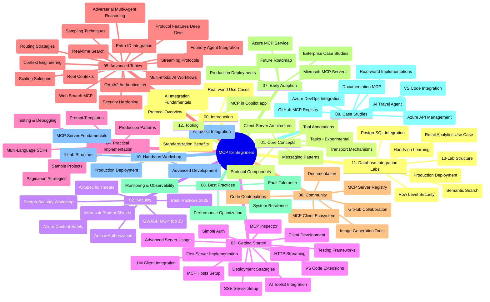

# ماڈل کانٹیکسٹ پروٹوکول (MCP) ابتدائیوں کے لیے - اسٹڈی گائیڈ

یہ اسٹڈی گائیڈ "ماڈل کانٹیکسٹ پروٹوکول (MCP) ابتدائیوں کے لیے" نصاب کی ریپوزیٹری ساخت اور مواد کا جائزہ فراہم کرتی ہے۔ اس گائیڈ کو ریپوزیٹری کو مؤثر طریقے سے نیویگیٹ کرنے اور دستیاب وسائل سے زیادہ سے زیادہ فائدہ اٹھانے کے لیے استعمال کریں۔

## ریپوزیٹری کا جائزہ

ماڈل کانٹیکسٹ پروٹوکول (MCP) ایک معیاری فریم ورک ہے جو AI ماڈلز اور کلائنٹ ایپلیکیشنز کے درمیان تعاملات کے لیے ہے۔ ابتدائی طور پر انثروپک نے اس کی تخلیق کی، اب MCP کو وسیع MCP کمیونٹی سرکاری GitHub تنظیم کے ذریعے برقرار رکھتی ہے۔ یہ ریپوزیٹری ایک جامع نصاب فراہم کرتی ہے جس میں C#، جاوا، جاوا اسکرپٹ، پائتھن، اور ٹائپ اسکرپٹ میں ہینڈز آن کوڈ مثالیں شامل ہیں، جو AI ڈویلپرز، سسٹم آرکیٹیکٹس، اور سافٹ ویئر انجینئرز کے لیے ڈیزائن کی گئی ہیں۔

## بصری نصاب کا نقشہ

## ریپوزیٹری کی ساخت

ریپوزیٹری بارہ اہم حصوں میں منظم ہے، ہر ایک MCP کے مختلف پہلوؤں پر مرکوز ہے:

1. **تعارف (00-Introduction/)**
   - ماڈل کانٹیکسٹ پروٹوکول کا جائزہ
   - AI پائپ لائنز میں معیاری بنانے کی اہمیت
   - عملی استعمال کے کیسز اور فوائد

2. **کور تصورات (01-CoreConcepts/)**
   - کلائنٹ-سرور آرکیٹیکچر
   - اہم پروٹوکول اجزاء
   - MCP میں پیغام رسانی کے پیٹرنز
   - موجودہ تفصیلات: [MCP میں کیا بدلا ہے: 2026-07-28 تفصیلات](./01-CoreConcepts/mcp-2026-07-28.md) — اسٹیٹ لیس پروٹوکول کور، ایکسٹینشنز فریم ورک، اور روٹس/ سیمپلنگ/ لاگنگ کی منسوخیاں

3. **سیکیورٹی (02-Security/)**
   - MCP پر مبنی نظاموں میں سیکیورٹی خطرات
   - نافذ کرنے کے لیے بہترین طریقے
   - توثیق اور اجازت حکمت عملی
   - ہاتھوں پر [CIMD اور DCR اجازت کی مثال](./02-Security/samples/cimd-dcr-auth/README.md)
   - **جامع سیکیورٹی دستاویزات**:
     - MCP سیکیورٹی بہترین طریقے
     - Azure مواد کی حفاظت کا نفاذ گائیڈ
     - MCP سیکیورٹی کنٹرولز اور تکنیکیں
     - MCP بہترین طریقے جلدی حوالہ
   - **اہم سیکیورٹی موضوعات**:
     - پرامپٹ انجیکشن اور ٹول زہریلا حملے
     - سیشن ہائی جیکنگ اور الجھی ہوئی نائب مسائل
     - ٹوکن پاس تھرو کمزوریاں
     - ضرورت سے زیادہ اجازتیں اور رسائی کنٹرول
     - AI اجزاء کے لیے سپلائی چین سیکیورٹی
     - مائیکروسافٹ پرامپٹ شیلڈز انضمام

4. **شروع کرنا (03-GettingStarted/)**
   - ماحول کی ترتیب اور کنفیگریشن
   - بنیادی MCP سرور اور کلائنٹس بنانا
   - موجودہ ایپلیکیشنز کے ساتھ انضمام
   - شامل ہیں:
     - پہلا سرور نفاذ
     - کلائنٹ ڈیولپمنٹ
     - LLM کلائنٹ انضمام
     - VS کوڈ انضمام
     - سرور-سینٹ ایونٹس (SSE) سرور
     - ایڈوانسڈ سرور استعمال
     - HTTP اسٹریمینگ
     - AI ٹول کٹ انضمام
     - ٹیسٹنگ حکمت عملی
     - تعیناتی رہنما خطوط

5. **عملی نفاذ (04-PracticalImplementation/)**
   - مختلف پروگرامنگ زبانوں کے SDKs کا استعمال
   - ڈی بگنگ، ٹیسٹنگ، اور بجلی کی توثیق کی تکنیکیں
   - قابلِ استعمال پرومپٹ ٹیمپلیٹس اور ورک فلو تیار کرنا
   - عمل درآمد کی مثالوں کے ساتھ نمونہ پروجیکٹس

6. **ایڈوانسڈ موضوعات (05-AdvancedTopics/)**
   - کانٹیکسٹ انجینئرنگ تکنیکیں
   - فاؤنڈری ایجنٹ انضمام
   - ملٹی موڈل AI ورک فلو 
   - OAuth2 توثیق ڈیموز
   - حقیقی وقت کی تلاش کی صلاحیتیں
   - حقیقی وقت کی اسٹریمینگ
   - روٹ کانٹیکسٹ کی نفاذ
   - روٹنگ حکمت عملیاں
   - سیمپلنگ تکنیکیں
   - اسکیلنگ طریقے
   - سیکیورٹی غور و فکر
   - اینٹرا ID سیکیورٹی انضمام
   - ویب تلاش انضمام
   - مخالف ملٹی ایجنٹ استدلال (مباحثہ پیٹرنز)

7. **کمیونٹی شراکتیں (06-CommunityContributions/)**
   - کوڈ اور دستاویزات میں تعاون کیسے کریں
   - GitHub کے ذریعے تعاون
   - کمیونٹی کے ذریعے بہتر بنانے اور تاثرات
   - مختلف MCP کلائنٹس کا استعمال (Claude ڈیسکٹاپ، Cline، VSCode)
   - مشہور MCP سرورز کے ساتھ کام کرنا بشمول امیج جنریشن

8. **ابتدائی اپنانے سے اسباق (07-LessonsfromEarlyAdoption/)**
   - حقیقی دنیا میں نفاذ اور کامیابی کی کہانیاں
   - MCP پر مبنی حل کی تعمیر اور تعیناتی
   - رجحانات اور مستقبل کا روڈ میپ
   - **مائیکروسافٹ MCP سرورز گائیڈ**: 10 پروڈکشن ریڈی مائیکروسافٹ MCP سرورز کے لیے جامع گائیڈ بشمول:
     - Microsoft Learn Docs MCP سرور
     - Azure MCP سرور (15+ خصوصی کنیکٹرز)
     - GitHub MCP سرور
     - Azure DevOps MCP سرور
     - MarkItDown MCP سرور
     - SQL Server MCP سرور
     - Playwright MCP سرور
     - Dev Box MCP سرور
     - Microsoft Foundry MCP سرور
     - Microsoft 365 Agents Toolkit MCP سرور

9. **بہترین طریقے (08-BestPractices/)**
   - کارکردگی کی ٹیوننگ اور اصلاح
   - غلطی برداشت کرنے والے MCP نظاموں کا ڈیزائن
   - ٹیسٹنگ اور مزاحمت کی حکمت عملیاں

10. **کیس اسٹڈیز (09-CaseStudy/)**
    - **سات جامع کیس اسٹڈیز** جو مختلف منظرناموں میں MCP کی مطابقت دکھاتی ہیں:
    - **Azure AI ٹریول ایجنٹس**: Azure OpenAI اور AI سرچ کے ساتھ ملٹی ایجنٹ آرکیسٹریشن
    - **Azure DevOps انضمام**: YouTube ڈیٹا اپڈیٹس کے ساتھ ورک فلو عمل کا خودکار کرنا
    - **حقیقی وقت دستاویز بازیافت**: پائتھن کنسول کلائنٹ کے ساتھ HTTP اسٹریمینگ
    - **انٹرایکٹو اسٹڈی پلان جنریٹر**: Chainlit ویب ایپ کے ساتھ مکالماتی AI
    - **ایڈیٹر میں دستاویزات**: GitHub کوپائلٹ ورک فلو کے ساتھ VS کوڈ انضمام
    - **Azure API مینجمنٹ**: MCP سرور تخلیق کے ساتھ انٹرپرائز API انضمام
    - **GitHub MCP رجسٹری**: ایکو سسٹم کی ترقی اور ایجنٹک انضمام پلیٹ فارم
    - انٹرپرائز انضمام، ڈویلپر پیداواریت، اور ایکو سسٹم ترقی پر محیط عمل درآمد کی مثالیں

11. **ہاتھوں پر ورکشاپ (10-StreamliningAIWorkflowsBuildingAnMCPServerWithAIToolkit/)**
    - MCP کو AI ٹول کٹ کے ساتھ ملانے والی جامع ہاتھوں پر ورکشاپ
    - ذہین ایپلیکیشنز کی تعمیر جو AI ماڈلز کو حقیقی دنیا کے اوزاروں سے جوڑتی ہیں
    - عملی ماڈیولز جو بنیادیات، کسٹم سرور ڈیولپمنٹ، اور پروڈکشن کی تعیناتی حکمت عملیاں کور کرتے ہیں
    - **لیب ساخت**:
      - لیب 1: MCP سرور کے بنیادیات
      - لیب 2: ایڈوانسڈ MCP سرور ڈیولپمنٹ
      - لیب 3: AI ٹول کٹ انضمام
      - لیب 4: پروڈکشن کی تعیناتی اور اسکیلنگ
    - مرحلہ وار ہدایات کے ساتھ لیب پر مبنی سیکھنے کا طریقہ

12. **MCP سرور ڈیٹا بیس انضمام لیبز (11-MCPServerHandsOnLabs/)**
    - PostgreSQL انضمام کے ساتھ پروڈکشن ریڈی MCP سرور بنانے کے لیے **جامع 13 لیب سیکھنے کا راستہ**
    - Zava ریٹیل استعمال کیس کے ذریعے **حقیقی دنیا کی ریٹیل اینالیٹکس نفاذ**
    - **انٹرپرائز گریڈ پیٹرنز** بشمول رو لیول سیکیورٹی (RLS)، سیمانٹک سرچ، اور ملٹی ٹینیٹ ڈیٹا رسائی
    - **مکمل لیب ساخت**:
      - **لیبز 00-03: بنیادیں** - تعارف، آرکیٹیکچر، سیکیورٹی، ماحول کی ترتیب
      - **لیبز 04-06: MCP سرور کی تعمیر** - ڈیٹا بیس ڈیزائن، MCP سرور نفاذ، ٹول ڈیولپمنٹ
      - **لیبز 07-09: ایڈوانسڈ خصوصیات** - سیمانٹک سرچ، ٹیسٹنگ اور ڈی بگنگ، VS کوڈ انضمام
      - **لیبز 10-12: پروڈکشن اور بہترین طریقے** - تعیناتی، مانیٹرنگ، اصلاح
    - **شامل تکنالوجیز**: FastMCP فریم ورک، PostgreSQL، Azure OpenAI، Azure Container Apps، Application Insights
    - **سیکھنے کے نتائج**: پروڈکشن ریڈی MCP سرور، ڈیٹا بیس انضمام پیٹرنز، AI سے چلنے والی اینالیٹکس، انٹرپرائز سیکیورٹی

13. **ٹولنگ (12-tooling/)**
    - MCP کو کوپائلٹ ایپ اور دیگر اوزار میں استعمال کرنا سیکھیں

## اضافی وسائل

ریپوزیٹری مددگار وسائل شامل کرتا ہے:

- **تصاویر کا فولڈر**: نصاب میں استعمال ہونے والے ڈایاگرامز اور تصاویر پر مشتمل
- **ترجمے**: دستاویزات کے خودکار کثیر زبانی ترجمے کے ساتھ
- **سرکاری MCP وسائل**:
  - [MCP دستاویزات](https://modelcontextprotocol.io/)
  - [MCP تفصیلات](https://modelcontextprotocol.io/specification/2026-07-28/)
  - [MCP GitHub ریپوزیٹری](https://github.com/modelcontextprotocol)

## اس ریپوزیٹری کا استعمال کیسے کریں

1. **متسلسل سیکھنا**: منظم سیکھنے کے لیے ابواب کو ترتیب سے پیروی کریں (00 سے 11 تک)۔
2. **زبان مخصوص توجہ**: اگر آپ کسی خاص پروگرامنگ زبان میں دلچسپی رکھتے ہیں، تو اپنی پسندیدہ زبان میں نفاذ کے لیے سیمپلز ڈائریکٹریز کو دریافت کریں۔
3. **عملی نفاذ**: اپنا ماحول سیٹ اپ کرنے اور اپنا پہلا MCP سرور اور کلائنٹ بنانے کے لیے "شروع کرنا" سیکشن سے شروع کریں۔
4. **ایڈوانسڈ دریافت**: بنیادیات پر عبور حاصل کرنے کے بعد، اپنے علم کو بڑھانے کے لیے ایڈوانسڈ موضوعات میں غوطہ لگائیں۔
5. **کمیونٹی انگیجمنٹ**: MCP کمیونٹی میں شامل ہوں GitHub مباحثوں اور Discord چینلز کے ذریعے تاکہ ماہرین اور دیگر ڈویلپرز کے ساتھ جڑ سکیں۔

## MCP کلائنٹس اور ٹولز

نصاب مختلف MCP کلائنٹس اور ٹولز کو کور کرتا ہے:

1. **سرکاری کلائنٹس**:
   - Visual Studio Code 
   - MCP ان Visual Studio Code میں
   - Claude ڈیسک ٹاپ
   - Claude in VSCode 
   - Claude API

2. **کمیونٹی کلائنٹس**:
   - Cline (ٹرمینل بیسڈ)
   - Cursor (کوڈ ایڈیٹر)
   - ChatMCP
   - Windsurf

3. **MCP مینجمنٹ ٹولز**:
   - MCP CLI
   - MCP Manager
   - MCP Linker
   - MCP Router

## مقبول MCP سرورز

ریپوزیٹری مختلف MCP سرورز متعارف کراتی ہے، بشمول:

1. **سرکاری مائیکروسافٹ MCP سرورز**:
   - Microsoft Learn Docs MCP سرور
   - Azure MCP سرور (15+ خصوصی کنیکٹرز)
   - GitHub MCP سرور
   - Azure DevOps MCP سرور
   - MarkItDown MCP سرور
   - SQL Server MCP سرور
   - Playwright MCP سرور
   - Dev Box MCP سرور
   - Microsoft Foundry MCP سرور
   - Microsoft 365 Agents Toolkit MCP سرور

2. **سرکاری حوالہ سرورز**:
   - فائل سسٹم
   - Fetch
   - میموری
   - سلسلہ وار تفکر

3. **تصویر پیداوار**:
   - Azure OpenAI DALL-E 3
   - Stable Diffusion WebUI
   - Replicate

4. **ڈیولپمنٹ ٹولز**:
   - Git MCP
   - ٹرمینل کنٹرول
   - کوڈ اسسٹنٹ

5. **مخصوص سرورز**:
   - Salesforce
   - Microsoft Teams
   - Jira & Confluence

## تعاون

یہ ریپوزیٹری کمیونٹی سے تعاون کو خوش آمدید کہتی ہے۔ MCP ایکو سسٹم میں مؤثر تعاون کے لیے کمیونٹی شراکتوں کے سیکشن کو دیکھیں۔

----

*یہ اسٹڈی گائیڈ آخری بار 9 ستمبر 2026 کو اپ ڈیٹ کیا گیا تھا۔ یہ MCP
تفصیلات `2026-07-28` کی عکاسی کرتا ہے، موجودہ پروٹوکول ریویژن۔ کچھ ہاتھوں پر
مثالیں واضح طور پر `2025-11-25` ورژن پر مبنی ہیں جبکہ ان کے SDKs اور ٹولز
اسٹیٹ لیس پروٹوکول APIs کو اپناتے ہیں۔*

---

<!-- CO-OP TRANSLATOR DISCLAIMER START -->
**ڈس کلیمر**:
یہ دستاویز AI ترجمہ سروس [Co-op Translator](https://github.com/Azure/co-op-translator) کے ذریعے ترجمہ کی گئی ہے۔ جبکہ ہم درستگی کے لیے کوشاں ہیں، براہ کرم اس بات سے آگاہ رہیں کہ خودکار ترجمے میں غلطیاں یا عدم درستیاں ہو سکتی ہیں۔ اصل دستاویز اپنے مادری زبان میں مستند ماخذ سمجھی جائے گی۔ حساس معلومات کے لیے پیشہ ور انسانی ترجمہ کی سفارش کی جاتی ہے۔ اس ترجمے کے استعمال سے پیدا ہونے والی کسی بھی غلط فہمی یا غلط تشریح کی ذمہ داری ہم قبول نہیں کرتے۔
<!-- CO-OP TRANSLATOR DISCLAIMER END -->