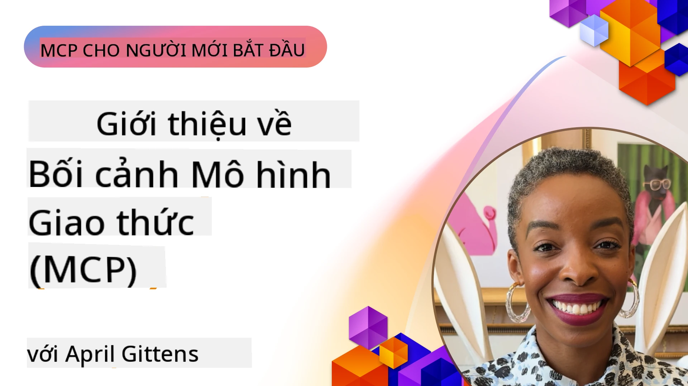
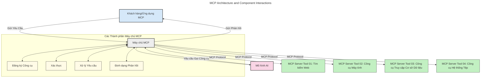
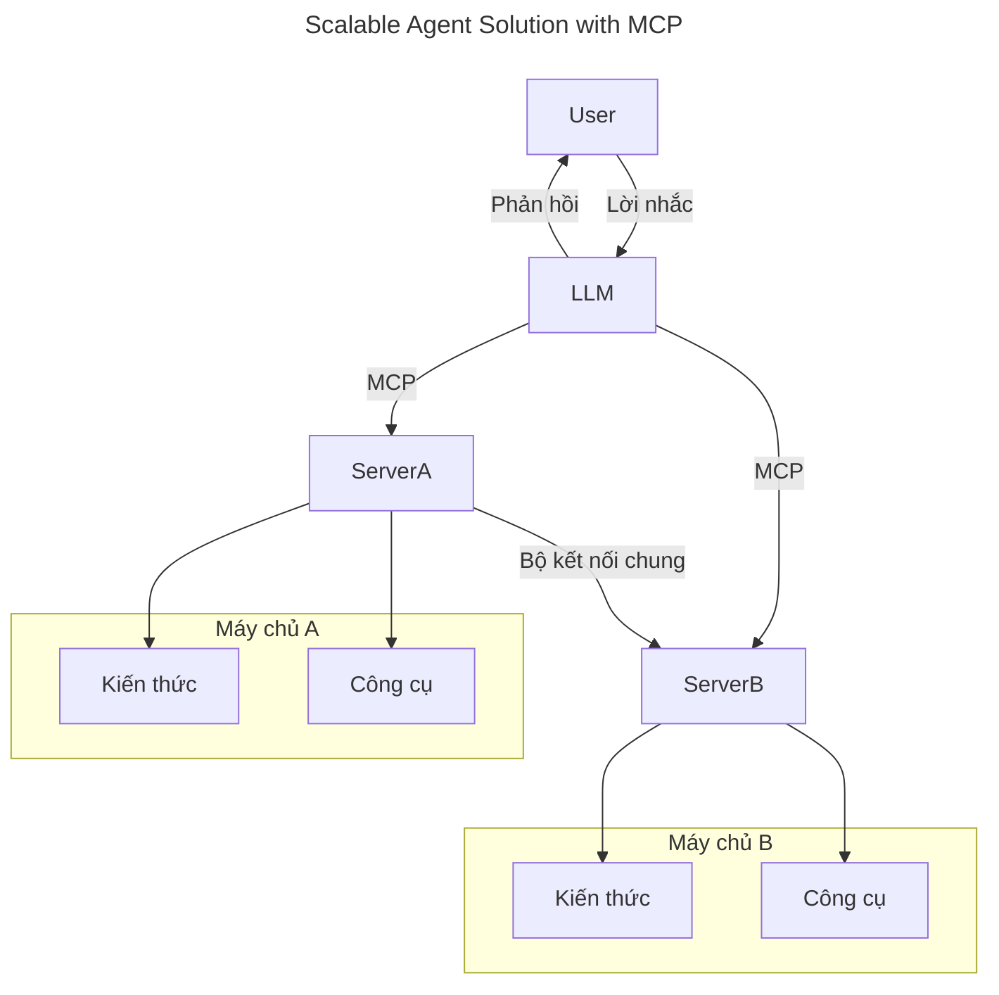
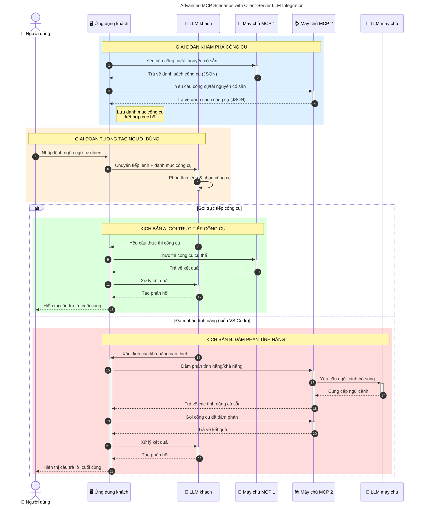

# Giới thiệu Giao thức Ngữ cảnh Mô hình (MCP): Tại sao nó quan trọng đối với Các Ứng dụng AI mở rộng quy mô

_(Nhấp vào hình ảnh trên để xem video bài học này)_

Các ứng dụng AI tạo sinh là một bước tiến lớn vì thường cho phép người dùng tương tác với ứng dụng bằng các lệnh ngôn ngữ tự nhiên. Tuy nhiên, khi đầu tư nhiều thời gian và tài nguyên vào các ứng dụng như vậy, bạn sẽ muốn chắc chắn rằng có thể dễ dàng tích hợp chức năng và tài nguyên sao cho dễ dàng mở rộng, ứng dụng của bạn có thể hỗ trợ hơn một mô hình được sử dụng, và xử lý các phức tạp của mô hình khác nhau. Nói tóm lại, xây dựng ứng dụng Gen AI thì dễ bắt đầu, nhưng khi phát triển và phức tạp hơn, bạn cần bắt đầu định nghĩa kiến trúc và có thể cần dựa vào một tiêu chuẩn để đảm bảo ứng dụng của bạn được xây dựng theo cách nhất quán. Đây chính là nơi MCP vào vai trò tổ chức và cung cấp một tiêu chuẩn.

---

## **🔍 Giao thức Ngữ cảnh Mô hình (MCP) là gì?**

**Giao thức Ngữ cảnh Mô hình (MCP)** là một **giao diện mở, tiêu chuẩn hóa** cho phép Các Mô hình Ngôn ngữ Lớn (LLMs) tương tác một cách liền mạch với các công cụ bên ngoài, API và nguồn dữ liệu. Nó cung cấp kiến trúc nhất quán để nâng cao chức năng mô hình AI vượt ra ngoài dữ liệu huấn luyện, cho phép hệ thống AI thông minh hơn, có thể mở rộng và phản hồi nhanh hơn.

---

## **🎯 Tại sao tiêu chuẩn hóa trong AI lại quan trọng**

Khi các ứng dụng AI tạo sinh trở nên phức tạp hơn, việc áp dụng các tiêu chuẩn để đảm bảo **khả năng mở rộng, khả năng mở rộng thêm, khả năng bảo trì** và **tránh bị khóa nhà cung cấp** là điều cần thiết. MCP giải quyết các nhu cầu này bằng cách:

- Thống nhất tích hợp mô hình-công cụ
- Giảm các giải pháp tùy chỉnh dễ vỡ, từng trường hợp một
- Cho phép nhiều mô hình từ các nhà cung cấp khác nhau cùng tồn tại trong một hệ sinh thái

**Lưu ý:** Mặc dù MCP tự xưng là một tiêu chuẩn mở, hiện không có kế hoạch tiêu chuẩn hóa MCP qua bất kỳ tổ chức tiêu chuẩn hiện có nào như IEEE, IETF, W3C, ISO hoặc bất kỳ tổ chức tiêu chuẩn nào khác.

---

## **📚 Mục tiêu học tập**

Khi kết thúc bài viết này, bạn sẽ có thể:

- Định nghĩa **Giao thức Ngữ cảnh Mô hình (MCP)** và các trường hợp sử dụng của nó
- Hiểu cách MCP tiêu chuẩn hóa giao tiếp giữa mô hình và công cụ
- Nhận diện các thành phần cốt lõi trong kiến trúc MCP
- Khám phá các ứng dụng thực tế của MCP trong ngữ cảnh doanh nghiệp và phát triển

---

## **💡 Tại sao Giao thức Ngữ cảnh Mô hình (MCP) là bước đột phá**

### **🔗 MCP giải quyết sự phân mảnh trong tương tác AI**

Trước MCP, tích hợp mô hình với công cụ đòi hỏi:

- Mã tùy chỉnh cho từng cặp mô hình-công cụ
- API không tiêu chuẩn cho từng nhà cung cấp
- Thường xuyên bị gián đoạn do cập nhật
- Khả năng mở rộng kém với nhiều công cụ hơn

### **✅ Lợi ích của việc tiêu chuẩn hóa MCP**

| **Lợi ích**              | **Mô tả**                                                                |
|--------------------------|-------------------------------------------------------------------------|
| Tương tác liên thông     | LLM làm việc liền mạch với các công cụ từ các nhà cung cấp khác nhau    |
| Tính nhất quán           | Hành vi đồng nhất trên các nền tảng và công cụ                          |
| Tái sử dụng              | Công cụ xây dựng một lần có thể dùng trên nhiều dự án và hệ thống       |
| Tăng tốc phát triển      | Giảm thời gian phát triển bằng cách sử dụng giao diện chuẩn, cắm và chạy|

---

## **🧱 Tổng quan kiến trúc MCP cấp cao**

MCP tuân theo mô hình **khách-chủ**, trong đó:

- **Máy chủ MCP** chạy các mô hình AI
- **Khách MCP** khởi tạo các yêu cầu
- **Máy chủ MCP** cung cấp ngữ cảnh, công cụ và khả năng

### **Các thành phần chính:**

- **Tài nguyên** – Dữ liệu tĩnh hoặc động cho mô hình  
- **Lệnh nhắc** – Các luồng công việc được định nghĩa sẵn để hướng dẫn tạo sinh  
- **Công cụ** – Chức năng có thể thực thi như tìm kiếm, tính toán  
- **Lấy mẫu** – Hành vi tác nhân qua các tương tác đệ quy (khai tử trong
    MCP `2026-07-28`; các triển khai mới nên tích hợp trực tiếp với nhà cung cấp LLM)

- **Gợi ý** – Yêu cầu do máy chủ khởi tạo để lấy thông tin người dùng
- **Gốc** – Vị trí hệ thống tập tin thông tin liên quan đến máy chủ
    (khai tử trong MCP `2026-07-28`; ưu tiên tham số công cụ, URI tài nguyên,
    hoặc cấu hình máy chủ)

### **Kiến trúc Giao thức:**

MCP sử dụng kiến trúc hai lớp:
- **Lớp Dữ liệu**: thông điệp JSON-RPC 2.0, siêu dữ liệu theo yêu cầu, khám phá và các nguyên thủy giao thức
- **Lớp Vận chuyển**: stdio cho tiến trình con địa phương và HTTP có thể stream cho máy chủ từ xa. HTTP có thể stream sử dụng đóng khung SSE cho phản hồi streaming, nhưng phương thức truyền HTTP+SSE cũ bị khai tử.

---

## Cách máy chủ MCP hoạt động

Máy chủ MCP hoạt động theo cách sau:

- **Luồng yêu cầu**:
    1. Yêu cầu được khởi đầu bởi người dùng cuối hoặc phần mềm thay mặt họ.
    2. **Khách MCP** gửi yêu cầu tới **Máy chủ MCP**, người quản lý runtime Mô hình AI.
    3. **Mô hình AI** nhận lệnh nhắc người dùng và có thể yêu cầu truy cập công cụ hoặc dữ liệu bên ngoài qua một hay nhiều lệnh gọi công cụ.
    4. **Máy chủ MCP**, chứ không phải mô hình trực tiếp, giao tiếp với **Máy chủ MCP** phù hợp sử dụng giao thức tiêu chuẩn.
- **Chức năng của Máy chủ MCP**:
    - **Đăng ký công cụ**: Duy trì danh mục công cụ có sẵn và khả năng của chúng.
    - **Xác thực**: Xác thực quyền truy cập công cụ.
    - **Xử lý yêu cầu**: Xử lý các yêu cầu công cụ đến từ mô hình.
    - **Định dạng phản hồi**: Cấu trúc đầu ra công cụ theo định dạng mô hình hiểu được.
- **Thực thi máy chủ MCP**:
    - **Máy chủ MCP** chuyển các lệnh gọi công cụ tới một hoặc nhiều **Máy chủ MCP**, mỗi máy chủ cung cấp chức năng chuyên biệt (ví dụ: tìm kiếm, tính toán, truy vấn cơ sở dữ liệu).
    - **Máy chủ MCP** thực thi các chức năng tương ứng và trả kết quả về cho **Máy chủ MCP** theo định dạng nhất quán.
    - **Máy chủ MCP** định dạng và chuyển tiếp kết quả này tới **Mô hình AI**.
- **Hoàn thiện phản hồi**:
    - **Mô hình AI** kết hợp đầu ra công cụ vào phản hồi cuối cùng.
    - **Máy chủ MCP** gửi phản hồi này trở lại cho **Khách MCP**, người chuyển tới người dùng cuối hoặc phần mềm gọi.
    

## 👨‍💻 Cách xây dựng một máy chủ MCP (Có ví dụ)

Máy chủ MCP cho phép bạn mở rộng khả năng LLM bằng cách cung cấp dữ liệu và chức năng.

Sẵn sàng thử chưa? Dưới đây là SDK cụ thể cho ngôn ngữ và/hoặc ngăn xếp cùng ví dụ tạo máy chủ MCP đơn giản ở các ngôn ngữ/ngăn xếp khác nhau:

- **SDK Python**: https://github.com/modelcontextprotocol/python-sdk

- **SDK TypeScript**: https://github.com/modelcontextprotocol/typescript-sdk

- **SDK Java**: https://github.com/modelcontextprotocol/java-sdk

- **SDK C#/.NET**: https://github.com/modelcontextprotocol/csharp-sdk

## 🌍 Các trường hợp sử dụng thực tế cho MCP

MCP cho phép phạm vi ứng dụng rộng lớn bằng cách mở rộng khả năng AI:

| **Ứng dụng**                   | **Mô tả**                                                                |
|-------------------------------|-------------------------------------------------------------------------|
| Tích hợp dữ liệu doanh nghiệp  | Kết nối LLM với cơ sở dữ liệu, CRM hoặc công cụ nội bộ                   |
| Hệ thống AI tác nhân           | Cho phép tác nhân tự chủ truy cập công cụ và quy trình ra quyết định    |
| Ứng dụng đa phương thức        | Kết hợp văn bản, hình ảnh và âm thanh trong một ứng dụng AI thống nhất  |
| Tích hợp dữ liệu thời gian thực | Đưa dữ liệu trực tiếp vào tương tác AI để có kết quả chính xác và cập nhật |

### 🧠 MCP = Tiêu chuẩn toàn cầu cho tương tác AI

Giao thức Ngữ cảnh Mô hình (MCP) hoạt động như một tiêu chuẩn toàn cầu cho các tương tác AI, tương tự như cách USB-C tiêu chuẩn hóa kết nối vật lý cho thiết bị. Trong thế giới AI, MCP cung cấp một giao diện nhất quán, cho phép các mô hình (khách) tích hợp liền mạch với các công cụ bên ngoài và nhà cung cấp dữ liệu (máy chủ). Điều này loại bỏ nhu cầu về các giao thức đa dạng, tùy chỉnh cho từng API hoặc nguồn dữ liệu.

Theo MCP, một công cụ tương thích MCP (gọi là máy chủ MCP) tuân theo tiêu chuẩn thống nhất. Những máy chủ này có thể liệt kê các công cụ hoặc hành động mà họ cung cấp và thực thi những hành động đó khi được yêu cầu bởi tác nhân AI. Nền tảng tác nhân AI hỗ trợ MCP có thể phát hiện các công cụ có sẵn từ các máy chủ và gọi chúng thông qua giao thức tiêu chuẩn này.

### 💡 Hỗ trợ truy cập kiến thức

Ngoài việc cung cấp công cụ, MCP còn hỗ trợ truy cập kiến thức. Nó cho phép ứng dụng cung cấp ngữ cảnh cho các mô hình ngôn ngữ lớn (LLMs) bằng cách liên kết họ với các nguồn dữ liệu khác nhau. Ví dụ, một máy chủ MCP có thể đại diện cho kho tài liệu của một công ty, cho phép tác nhân truy xuất thông tin liên quan theo yêu cầu. Một máy chủ khác có thể xử lý các hành động cụ thể như gửi email hoặc cập nhật hồ sơ. Từ góc nhìn của tác nhân, đây đơn giản chỉ là các công cụ mà nó có thể dùng - một số công cụ trả về dữ liệu (ngữ cảnh kiến thức), trong khi số khác thực hiện các hành động. MCP quản lý cả hai hiệu quả.

Một tác nhân kết nối với máy chủ MCP tự động học được khả năng có sẵn và dữ liệu truy cập của máy chủ thông qua định dạng tiêu chuẩn. Việc tiêu chuẩn hóa này cho phép công cụ có thể thay đổi động. Ví dụ, khi thêm một máy chủ MCP mới vào hệ thống tác nhân thì các chức năng của máy chủ đó sẽ ngay lập tức có thể sử dụng được mà không cần tùy chỉnh thêm hướng dẫn cho tác nhân.

Việc tích hợp liền mạch này tương thích với luồng mô tả trong sơ đồ sau, nơi các máy chủ cung cấp cả công cụ và kiến thức, đảm bảo sự hợp tác trơn tru giữa các hệ thống.

### 👉 Ví dụ: Giải pháp Tác nhân mở rộng quy mô

Trình Kết nối Toàn cầu cho phép các máy chủ MCP giao tiếp và chia sẻ khả năng với nhau, cho phép ServerA ủy nhiệm nhiệm vụ cho ServerB hoặc truy cập công cụ và kiến thức của nó. Điều này liên kết công cụ và dữ liệu giữa các máy chủ, hỗ trợ kiến trúc tác nhân mở rộng quy mô và mô-đun. Vì MCP tiêu chuẩn hóa việc phơi bày công cụ, các tác nhân có thể phát hiện động và chuyển hướng yêu cầu giữa các máy chủ mà không cần tích hợp cứng mã.

Liên kết công cụ và kiến thức: Công cụ và dữ liệu có thể truy cập qua các máy chủ, cho phép kiến trúc tác nhân mở rộng và mô-đun hơn.

### 🔄 Các kịch bản MCP nâng cao với tích hợp LLM phía khách

Ngoài kiến trúc cơ bản của MCP, còn có các kịch bản nâng cao nơi cả khách và máy chủ chứa LLM, cho phép tương tác phức tạp hơn. Trong sơ đồ sau, **Ứng dụng Khách** có thể là một IDE với một số công cụ MCP có sẵn cho người dùng bởi LLM:

## 🔐 Lợi ích thực tế của MCP

Dưới đây là lợi ích thực tế khi sử dụng MCP:

- **Sự mới mẻ**: Mô hình có thể truy cập thông tin cập nhật ngoài dữ liệu huấn luyện
- **Mở rộng khả năng**: Mô hình có thể tận dụng các công cụ chuyên biệt cho nhiệm vụ không được huấn luyện
- **Giảm ảo tưởng**: Nguồn dữ liệu bên ngoài cung cấp nền tảng thực tế
- **Bảo mật**: Dữ liệu nhạy cảm có thể giữ trong môi trường an toàn thay vì nhúng vào lệnh nhắc

## 📌 Những điểm chính cần nhớ

Dưới đây là những điểm chính cần nhớ khi sử dụng MCP:

- **MCP** tiêu chuẩn hóa cách các mô hình AI tương tác với công cụ và dữ liệu
- Thúc đẩy **khả năng mở rộng, tính nhất quán và tính tương tác**
- MCP giúp **giảm thời gian phát triển, cải thiện độ tin cậy và mở rộng khả năng mô hình**
- Kiến trúc khách-chủ **cho phép các ứng dụng AI linh hoạt và mở rộng**

## 🧠 Bài tập

Hãy suy nghĩ về một ứng dụng AI bạn quan tâm muốn xây dựng.

- Các **công cụ hoặc dữ liệu bên ngoài** nào có thể cải thiện khả năng của nó?
- MCP có thể làm cho việc tích hợp trở nên **đơn giản và tin cậy hơn** như thế nào?

## Tài nguyên bổ sung

- [Kho GitHub MCP](https://github.com/modelcontextprotocol)

## Tiếp theo

Tiếp theo: [Chương 1: Khái niệm cốt lõi](../01-CoreConcepts/README.md)

---

<!-- CO-OP TRANSLATOR DISCLAIMER START -->
**Tuyên bố miễn trừ trách nhiệm**:
Tài liệu này đã được dịch bằng dịch vụ dịch thuật AI [Co-op Translator](https://github.com/Azure/co-op-translator). Mặc dù chúng tôi cố gắng đảm bảo độ chính xác, xin lưu ý rằng bản dịch tự động có thể chứa lỗi hoặc sai sót. Tài liệu gốc bằng ngôn ngữ gốc nên được coi là nguồn tin chính thức. Đối với thông tin quan trọng, nên sử dụng dịch vụ dịch thuật chuyên nghiệp bởi con người. Chúng tôi không chịu trách nhiệm về bất kỳ hiểu lầm hoặc giải thích sai nào phát sinh từ việc sử dụng bản dịch này.
<!-- CO-OP TRANSLATOR DISCLAIMER END -->