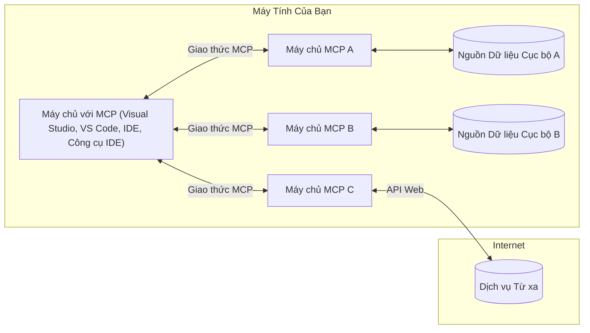

# Khái niệm cốt lõi MCP: Làm chủ Giao thức Ngữ cảnh Mô hình cho Tích hợp AI

[](https://youtu.be/earDzWGtE84)

_(Nhấp vào hình ảnh trên để xem video bài học này)_

[Giao thức Ngữ cảnh Mô hình (MCP)](https://github.com/modelcontextprotocol) là một khuôn khổ tiêu chuẩn mạnh mẽ giúp tối ưu hóa giao tiếp giữa Các Mô hình Ngôn ngữ Lớn (LLMs) và các công cụ, ứng dụng, nguồn dữ liệu bên ngoài. 
Hướng dẫn này sẽ dẫn bạn qua các khái niệm cốt lõi của MCP. Bạn sẽ tìm hiểu về kiến trúc máy khách-máy chủ, các thành phần thiết yếu, cơ chế giao tiếp và các thực hành tốt nhất trong triển khai.

- **Sự đồng ý rõ ràng của người dùng**: Tất cả việc truy cập dữ liệu và thao tác đều yêu cầu sự chấp thuận rõ ràng của người dùng trước khi thực hiện. Người dùng phải hiểu rõ dữ liệu nào sẽ được truy cập và các hành động sẽ được thực hiện, với quyền kiểm soát chi tiết về quyền hạn và ủy quyền.

- **Bảo vệ quyền riêng tư dữ liệu**: Dữ liệu người dùng chỉ được tiết lộ khi có sự đồng ý rõ ràng và phải được bảo vệ bằng các kiểm soát truy cập mạnh mẽ trong suốt vòng đời tương tác. Các triển khai phải ngăn chặn việc truyền dữ liệu trái phép và duy trì ranh giới riêng tư nghiêm ngặt.

- **An toàn khi thực thi công cụ**: Mỗi lần gọi công cụ đều yêu cầu sự đồng ý rõ ràng của người dùng với sự hiểu biết rõ ràng về chức năng, tham số và tác động tiềm năng của công cụ. Các ranh giới bảo mật mạnh mẽ phải ngăn chặn việc thực thi công cụ không mong muốn, không an toàn hoặc độc hại.

- **Bảo mật lớp truyền tải**: Tất cả các kênh giao tiếp nên sử dụng các cơ chế mã hóa và xác thực phù hợp. Kết nối từ xa nên triển khai các giao thức truyền tải an toàn và quản lý chứng thực đúng cách.

#### Hướng dẫn triển khai:

- **Quản lý quyền hạn**: Triển khai hệ thống quyền hạn chi tiết cho phép người dùng kiểm soát máy chủ, công cụ và tài nguyên được truy cập
- **Xác thực & Ủy quyền**: Sử dụng các phương pháp xác thực an toàn (OAuth, khóa API) với quản lý token và thời hạn hợp lý  
- **Xác thực đầu vào**: Kiểm tra tất cả tham số và dữ liệu đầu vào theo các sơ đồ định nghĩa để ngăn chặn các cuộc tấn công chèn mã
- **Ghi nhật ký kiểm toán**: Duy trì nhật ký toàn diện của tất cả các thao tác để giám sát bảo mật và tuân thủ

## Tổng quan

Bài học này khám phá kiến trúc cơ bản và các thành phần tạo nên hệ sinh thái Giao thức Ngữ cảnh Mô hình (MCP). Bạn sẽ tìm hiểu về kiến trúc máy khách-máy chủ, các thành phần chính và cơ chế giao tiếp thúc đẩy các tương tác MCP.

## Mục tiêu học tập chính

Kết thúc bài học này, bạn sẽ:

- Hiểu kiến trúc máy khách-máy chủ của MCP.
- Xác định vai trò và trách nhiệm của Hosts, Clients và Servers.
- Phân tích các tính năng cốt lõi làm cho MCP trở thành lớp tích hợp linh hoạt.
- Học cách thông tin chảy trong hệ sinh thái MCP.
- Thu được kiến thức thực tiễn qua các ví dụ mã trong .NET, Java, Python và JavaScript.

## Kiến trúc MCP: Cái nhìn sâu hơn

Hệ sinh thái MCP được xây dựng trên mô hình máy khách-máy chủ. Cấu trúc mô-đun này cho phép các ứng dụng AI tương tác hiệu quả với công cụ, cơ sở dữ liệu, API và tài nguyên ngữ cảnh. Hãy phân tích kiến trúc này thành các thành phần cốt lõi.

Về cơ bản, MCP tuân theo kiến trúc máy khách-máy chủ, nơi một ứng dụng host có thể kết nối với nhiều máy chủ:


- **MCP Hosts**: Các chương trình như VSCode, Claude Desktop, IDE hoặc công cụ AI muốn truy cập dữ liệu qua MCP
- **MCP Clients**: Các client giao thức duy trì kết nối 1:1 với các máy chủ
- **MCP Servers**: Các chương trình nhẹ mỗi cái cung cấp các khả năng cụ thể qua Giao thức Ngữ cảnh Mô hình tiêu chuẩn
- **Nguồn dữ liệu cục bộ**: Các tập tin, cơ sở dữ liệu và dịch vụ trên máy tính của bạn mà các MCP server có thể truy cập an toàn
- **Dịch vụ từ xa**: Các hệ thống bên ngoài có sẵn qua internet mà các MCP server có thể kết nối qua API.

Giao thức MCP là một tiêu chuẩn đang phát triển sử dụng phiên bản dựa trên ngày tháng (định dạng YYYY-MM-DD). Phiên bản giao thức hiện tại là **2025-11-25**. Bạn có thể xem các cập nhật mới nhất tại [đặc tả giao thức](https://modelcontextprotocol.io/specification/2025-11-25/)

### 1. Hosts

Trong Giao thức Ngữ cảnh Mô hình (MCP), **Hosts** là các ứng dụng AI đóng vai trò giao diện chính mà người dùng tương tác với giao thức. Hosts điều phối và quản lý các kết nối tới nhiều MCP server bằng cách tạo các MCP client riêng biệt cho mỗi kết nối máy chủ. Ví dụ về Hosts bao gồm:

- **Ứng dụng AI**: Claude Desktop, Visual Studio Code, Claude Code
- **Môi trường phát triển**: IDE và trình soạn thảo mã có tích hợp MCP  
- **Ứng dụng tùy chỉnh**: Các tác nhân AI và công cụ được xây dựng theo mục đích riêng

**Hosts** là các ứng dụng điều phối tương tác mô hình AI. Chúng:

- **Điều phối mô hình AI**: Thực thi hoặc tương tác với LLM để tạo phản hồi và điều phối quy trình AI
- **Quản lý kết nối client**: Tạo và duy trì một MCP client cho mỗi kết nối MCP server
- **Kiểm soát giao diện người dùng**: Xử lý luồng hội thoại, tương tác người dùng và trình bày phản hồi  
- **Thực thi bảo mật**: Kiểm soát quyền hạn, ràng buộc bảo mật và xác thực
- **Xử lý sự đồng ý của người dùng**: Quản lý sự chấp thuận của người dùng cho chia sẻ dữ liệu và thực thi công cụ


### 2. Clients

**Clients** là các thành phần thiết yếu duy trì các kết nối một-một chuyên dụng giữa Hosts và MCP servers. Mỗi MCP client được Host khởi tạo để kết nối tới một MCP server cụ thể, đảm bảo các kênh giao tiếp được tổ chức và an toàn. Nhiều client cho phép Hosts kết nối đồng thời với nhiều server.

**Clients** là các thành phần kết nối bên trong ứng dụng host. Chúng:

- **Giao tiếp giao thức**: Gửi các yêu cầu JSON-RPC 2.0 tới server với các lời nhắc và hướng dẫn
- **Đàm phán khả năng**: Thương lượng các tính năng và phiên bản giao thức được hỗ trợ với server trong quá trình khởi tạo
- **Thực thi công cụ**: Quản lý các yêu cầu thực thi công cụ từ mô hình và xử lý phản hồi
- **Cập nhật thời gian thực**: Xử lý thông báo và cập nhật thời gian thực từ server
- **Xử lý phản hồi**: Xử lý và định dạng phản hồi từ server để hiển thị cho người dùng

### 3. Servers

**Servers** là các chương trình cung cấp ngữ cảnh, công cụ và khả năng cho MCP clients. Chúng có thể chạy cục bộ (trên cùng máy với Host) hoặc từ xa (trên các nền tảng bên ngoài), chịu trách nhiệm xử lý yêu cầu client và cung cấp phản hồi có cấu trúc. Servers cung cấp các chức năng cụ thể qua Giao thức Ngữ cảnh Mô hình tiêu chuẩn.

**Servers** là các dịch vụ cung cấp ngữ cảnh và khả năng. Chúng:

- **Đăng ký tính năng**: Đăng ký và cung cấp các nguyên thủy có sẵn (tài nguyên, lời nhắc, công cụ) cho client
- **Xử lý yêu cầu**: Nhận và thực thi các cuộc gọi công cụ, yêu cầu tài nguyên và yêu cầu lời nhắc từ client
- **Cung cấp ngữ cảnh**: Cung cấp thông tin và dữ liệu ngữ cảnh để nâng cao phản hồi mô hình
- **Quản lý trạng thái**: Duy trì trạng thái phiên và xử lý các tương tác có trạng thái khi cần
- **Thông báo thời gian thực**: Gửi thông báo về thay đổi và cập nhật khả năng tới các client kết nối

Servers có thể được phát triển bởi bất kỳ ai để mở rộng khả năng mô hình với chức năng chuyên biệt, và hỗ trợ cả triển khai cục bộ và từ xa.

### 4. Nguyên thủy Server

Servers trong Giao thức Ngữ cảnh Mô hình (MCP) cung cấp ba **nguyên thủy** cốt lõi định nghĩa các khối xây dựng cơ bản cho các tương tác phong phú giữa client, host và mô hình ngôn ngữ. Các nguyên thủy này xác định các loại thông tin ngữ cảnh và hành động có sẵn qua giao thức.

MCP servers có thể cung cấp bất kỳ kết hợp nào trong ba nguyên thủy cốt lõi sau:

#### Tài nguyên

**Tài nguyên** là các nguồn dữ liệu cung cấp thông tin ngữ cảnh cho các ứng dụng AI. Chúng đại diện cho nội dung tĩnh hoặc động có thể nâng cao sự hiểu biết và ra quyết định của mô hình:

- **Dữ liệu ngữ cảnh**: Thông tin có cấu trúc và ngữ cảnh để mô hình AI sử dụng
- **Cơ sở tri thức**: Kho tài liệu, bài viết, hướng dẫn và bài nghiên cứu
- **Nguồn dữ liệu cục bộ**: Tập tin, cơ sở dữ liệu và thông tin hệ thống cục bộ  
- **Dữ liệu bên ngoài**: Phản hồi API, dịch vụ web và dữ liệu hệ thống từ xa
- **Nội dung động**: Dữ liệu thời gian thực cập nhật theo điều kiện bên ngoài

Tài nguyên được xác định bằng URI và hỗ trợ khám phá qua phương thức `resources/list` và truy xuất qua `resources/read`:

```text
file://documents/project-spec.md
database://production/users/schema
api://weather/current
```

#### Lời nhắc

**Lời nhắc** là các mẫu tái sử dụng giúp cấu trúc các tương tác với mô hình ngôn ngữ. Chúng cung cấp các mẫu tương tác tiêu chuẩn và quy trình làm việc theo mẫu:

- **Tương tác dựa trên mẫu**: Các thông điệp và câu mở đầu hội thoại được cấu trúc sẵn
- **Mẫu quy trình làm việc**: Chuỗi tiêu chuẩn cho các tác vụ và tương tác phổ biến
- **Ví dụ ít mẫu**: Mẫu dựa trên ví dụ để hướng dẫn mô hình
- **Lời nhắc hệ thống**: Lời nhắc nền tảng định nghĩa hành vi và ngữ cảnh mô hình
- **Mẫu động**: Lời nhắc có tham số hóa thích ứng với ngữ cảnh cụ thể

Lời nhắc hỗ trợ thay thế biến và có thể được khám phá qua `prompts/list` và truy xuất với `prompts/get`:

```markdown
Generate a {{task_type}} for {{product}} targeting {{audience}} with the following requirements: {{requirements}}
```

#### Công cụ

**Công cụ** là các hàm có thể thực thi mà mô hình AI có thể gọi để thực hiện các hành động cụ thể. Chúng đại diện cho "động từ" trong hệ sinh thái MCP, cho phép mô hình tương tác với các hệ thống bên ngoài:

- **Hàm có thể thực thi**: Các thao tác rời rạc mà mô hình có thể gọi với các tham số cụ thể
- **Tích hợp hệ thống bên ngoài**: Gọi API, truy vấn cơ sở dữ liệu, thao tác tập tin, tính toán
- **Định danh duy nhất**: Mỗi công cụ có tên, mô tả và sơ đồ tham số riêng biệt
- **I/O có cấu trúc**: Công cụ nhận tham số đã được xác thực và trả về phản hồi có cấu trúc, kiểu dữ liệu rõ ràng
- **Khả năng hành động**: Cho phép mô hình thực hiện các hành động thực tế và truy xuất dữ liệu trực tiếp

Công cụ được định nghĩa bằng JSON Schema để xác thực tham số và được khám phá qua `tools/list` và thực thi qua `tools/call`:

```typescript
server.tool(
  "search_products", 
  {
    query: z.string().describe("Search query for products"),
    category: z.string().optional().describe("Product category filter"),
    max_results: z.number().default(10).describe("Maximum results to return")
  }, 
  async (params) => {
    // Thực hiện tìm kiếm và trả về kết quả có cấu trúc
    return await productService.search(params);
  }
);
```

## Nguyên thủy Client

Trong Giao thức Ngữ cảnh Mô hình (MCP), **clients** có thể cung cấp các nguyên thủy cho phép servers yêu cầu các khả năng bổ sung từ ứng dụng host. Các nguyên thủy phía client này cho phép các triển khai server phong phú hơn, tương tác nhiều hơn và có thể truy cập các khả năng mô hình AI cũng như tương tác người dùng.

### Lấy mẫu

**Lấy mẫu** cho phép servers yêu cầu các hoàn thành mô hình ngôn ngữ từ ứng dụng AI của client. Nguyên thủy này cho phép servers truy cập khả năng LLM mà không cần nhúng các phụ thuộc mô hình riêng:

- **Truy cập độc lập mô hình**: Servers có thể yêu cầu hoàn thành mà không cần bao gồm SDK LLM hoặc quản lý truy cập mô hình
- **AI do server khởi xướng**: Cho phép servers tự động tạo nội dung sử dụng mô hình AI của client
- **Tương tác LLM đệ quy**: Hỗ trợ các kịch bản phức tạp nơi servers cần trợ giúp AI để xử lý
- **Tạo nội dung động**: Cho phép servers tạo phản hồi ngữ cảnh sử dụng mô hình của host

Lấy mẫu được khởi tạo qua phương thức `sampling/complete`, nơi servers gửi yêu cầu hoàn thành tới clients.

### Yêu cầu thông tin  

**Yêu cầu thông tin** cho phép servers yêu cầu thêm thông tin hoặc xác nhận từ người dùng qua giao diện client:

- **Yêu cầu nhập liệu người dùng**: Servers có thể hỏi thêm thông tin khi cần cho việc thực thi công cụ
- **Hộp thoại xác nhận**: Yêu cầu sự chấp thuận của người dùng cho các thao tác nhạy cảm hoặc có tác động lớn
- **Quy trình tương tác**: Cho phép servers tạo các tương tác người dùng theo từng bước
- **Thu thập tham số động**: Thu thập các tham số thiếu hoặc tùy chọn trong quá trình thực thi công cụ

Yêu cầu thông tin được thực hiện qua phương thức `elicitation/request` để thu thập đầu vào người dùng qua giao diện client.

### Ghi nhật ký

**Ghi nhật ký** cho phép servers gửi các thông điệp nhật ký có cấu trúc tới clients để gỡ lỗi, giám sát và tăng khả năng quan sát hoạt động:

- **Hỗ trợ gỡ lỗi**: Cho phép servers cung cấp nhật ký thực thi chi tiết để xử lý sự cố
- **Giám sát vận hành**: Gửi cập nhật trạng thái và số liệu hiệu suất tới clients
- **Báo cáo lỗi**: Cung cấp ngữ cảnh lỗi chi tiết và thông tin chẩn đoán
- **Theo dõi kiểm toán**: Tạo nhật ký toàn diện về các thao tác và quyết định của server

Các thông điệp ghi nhật ký được gửi tới clients để cung cấp sự minh bạch trong hoạt động server và hỗ trợ gỡ lỗi.

## Luồng thông tin trong MCP

Giao thức Ngữ cảnh Mô hình (MCP) định nghĩa luồng thông tin có cấu trúc giữa hosts, clients, servers và mô hình. Hiểu luồng này giúp làm rõ cách các yêu cầu người dùng được xử lý và cách các công cụ, dữ liệu bên ngoài được tích hợp vào phản hồi mô hình.

- **Host khởi tạo kết nối**  
  Ứng dụng host (chẳng hạn như IDE hoặc giao diện chat) thiết lập kết nối tới MCP server, thường qua STDIO, WebSocket hoặc một phương thức truyền tải được hỗ trợ khác.

- **Đàm phán khả năng**  
  Client (nhúng trong host) và server trao đổi thông tin về các tính năng, công cụ, tài nguyên và phiên bản giao thức được hỗ trợ. Điều này đảm bảo cả hai bên hiểu các khả năng có sẵn cho phiên làm việc.

- **Yêu cầu người dùng**  
  Người dùng tương tác với host (ví dụ nhập lời nhắc hoặc lệnh). Host thu thập đầu vào này và chuyển cho client xử lý.

- **Sử dụng tài nguyên hoặc công cụ**  
  - Client có thể yêu cầu thêm ngữ cảnh hoặc tài nguyên từ server (như tập tin, mục cơ sở dữ liệu hoặc bài viết trong cơ sở tri thức) để làm giàu sự hiểu biết của mô hình.
  - Nếu mô hình xác định cần công cụ (ví dụ để lấy dữ liệu, thực hiện tính toán hoặc gọi API), client gửi yêu cầu gọi công cụ tới server, chỉ định tên công cụ và tham số.

- **Thực thi server**  
  Server nhận yêu cầu tài nguyên hoặc công cụ, thực thi các thao tác cần thiết (như chạy hàm, truy vấn cơ sở dữ liệu hoặc lấy tập tin), và trả kết quả cho client dưới dạng có cấu trúc.

- **Tạo phản hồi**  
  Client tích hợp phản hồi của server (dữ liệu tài nguyên, kết quả công cụ, v.v.) vào tương tác mô hình đang diễn ra. Mô hình sử dụng thông tin này để tạo phản hồi toàn diện và phù hợp ngữ cảnh.

- **Trình bày kết quả**  
  Host nhận đầu ra cuối cùng từ client và trình bày cho người dùng, thường bao gồm cả văn bản do mô hình tạo và bất kỳ kết quả nào từ thực thi công cụ hoặc tra cứu tài nguyên.

Luồng này cho phép MCP hỗ trợ các ứng dụng AI tiên tiến, tương tác và nhận biết ngữ cảnh bằng cách kết nối liền mạch mô hình với các công cụ và nguồn dữ liệu bên ngoài.

## Kiến trúc & Các lớp giao thức

MCP bao gồm hai lớp kiến trúc riêng biệt hoạt động cùng nhau để cung cấp một khuôn khổ giao tiếp hoàn chỉnh:

### Lớp dữ liệu

**Lớp dữ liệu** triển khai giao thức MCP cốt lõi sử dụng **JSON-RPC 2.0** làm nền tảng. Lớp này định nghĩa cấu trúc thông điệp, ngữ nghĩa và mẫu tương tác:

#### Thành phần cốt lõi:

- **Giao thức JSON-RPC 2.0**: Tất cả giao tiếp sử dụng định dạng thông điệp JSON-RPC 2.0 tiêu chuẩn cho các cuộc gọi phương thức, phản hồi và thông báo
- **Quản lý vòng đời**: Xử lý khởi tạo kết nối, đàm phán khả năng và kết thúc phiên giữa khách hàng và máy chủ  
- **Nguyên thủy máy chủ**: Cho phép máy chủ cung cấp chức năng cốt lõi thông qua công cụ, tài nguyên và lời nhắc  
- **Nguyên thủy khách hàng**: Cho phép máy chủ yêu cầu lấy mẫu từ LLM, gợi ý đầu vào người dùng và gửi thông điệp nhật ký  
- **Thông báo thời gian thực**: Hỗ trợ thông báo không đồng bộ cho các cập nhật động mà không cần truy vấn liên tục  

#### Tính năng chính:

- **Đàm phán phiên bản giao thức**: Sử dụng phiên bản dựa trên ngày tháng (YYYY-MM-DD) để đảm bảo tương thích  
- **Khám phá khả năng**: Khách hàng và máy chủ trao đổi thông tin tính năng được hỗ trợ trong quá trình khởi tạo  
- **Phiên trạng thái**: Duy trì trạng thái kết nối qua nhiều tương tác để đảm bảo liên tục ngữ cảnh  

### Lớp Giao Thức Vận Chuyển

**Lớp Giao Thức Vận Chuyển** quản lý các kênh giao tiếp, đóng khung thông điệp và xác thực giữa các thành viên MCP:

#### Cơ chế vận chuyển được hỗ trợ:

1. **Vận chuyển STDIO**:  
   - Sử dụng luồng nhập/xuất chuẩn để giao tiếp trực tiếp giữa các tiến trình  
   - Tối ưu cho các tiến trình cục bộ trên cùng một máy mà không có chi phí mạng  
   - Thường dùng cho các triển khai máy chủ MCP cục bộ  

2. **Vận chuyển HTTP có thể truyền luồng**:  
   - Sử dụng HTTP POST cho thông điệp từ khách hàng đến máy chủ  
   - Tùy chọn Server-Sent Events (SSE) để truyền luồng từ máy chủ đến khách hàng  
   - Cho phép giao tiếp máy chủ từ xa qua mạng  
   - Hỗ trợ xác thực HTTP tiêu chuẩn (token bearer, khóa API, header tùy chỉnh)  
   - MCP khuyến nghị OAuth cho xác thực token an toàn  

#### Trừu tượng vận chuyển:

Lớp vận chuyển trừu tượng hóa chi tiết giao tiếp khỏi lớp dữ liệu, cho phép cùng định dạng thông điệp JSON-RPC 2.0 trên tất cả cơ chế vận chuyển. Trừu tượng này giúp ứng dụng chuyển đổi mượt mà giữa máy chủ cục bộ và từ xa.

### Cân nhắc về Bảo mật

Các triển khai MCP phải tuân thủ nhiều nguyên tắc bảo mật quan trọng để đảm bảo tương tác an toàn, đáng tin cậy và bảo mật trong toàn bộ hoạt động giao thức:

- **Sự đồng ý và kiểm soát của người dùng**: Người dùng phải cung cấp sự đồng ý rõ ràng trước khi bất kỳ dữ liệu nào được truy cập hoặc thao tác được thực hiện. Họ cần có quyền kiểm soát rõ ràng về dữ liệu được chia sẻ và các hành động được ủy quyền, được hỗ trợ bởi giao diện người dùng trực quan để xem xét và phê duyệt hoạt động.

- **Bảo mật dữ liệu**: Dữ liệu người dùng chỉ được tiết lộ khi có sự đồng ý rõ ràng và phải được bảo vệ bằng các kiểm soát truy cập thích hợp. Các triển khai MCP phải ngăn chặn việc truyền dữ liệu trái phép và đảm bảo quyền riêng tư được duy trì trong suốt các tương tác.

- **An toàn công cụ**: Trước khi gọi bất kỳ công cụ nào, cần có sự đồng ý rõ ràng của người dùng. Người dùng cần hiểu rõ chức năng của từng công cụ, và các ranh giới bảo mật mạnh mẽ phải được thực thi để ngăn chặn việc thực thi công cụ không mong muốn hoặc không an toàn.

Bằng cách tuân thủ các nguyên tắc bảo mật này, MCP đảm bảo sự tin tưởng, quyền riêng tư và an toàn của người dùng được duy trì trong toàn bộ tương tác giao thức đồng thời cho phép tích hợp AI mạnh mẽ.

## Ví dụ Mã: Các Thành Phần Chính

Dưới đây là các ví dụ mã trong một số ngôn ngữ lập trình phổ biến minh họa cách triển khai các thành phần máy chủ MCP và công cụ chính.

### Ví dụ .NET: Tạo Máy Chủ MCP Đơn Giản với Công Cụ

Dưới đây là ví dụ mã .NET thực tế minh họa cách triển khai một máy chủ MCP đơn giản với các công cụ tùy chỉnh. Ví dụ này trình bày cách định nghĩa và đăng ký công cụ, xử lý yêu cầu và kết nối máy chủ sử dụng Giao Thức Ngữ Cảnh Mô Hình.

```csharp
using System;
using System.Threading.Tasks;
using ModelContextProtocol.Server;
using ModelContextProtocol.Server.Transport;
using ModelContextProtocol.Server.Tools;

public class WeatherServer
{
    public static async Task Main(string[] args)
    {
        // Create an MCP server
        var server = new McpServer(
            name: "Weather MCP Server",
            version: "1.0.0"
        );
        
        // Register our custom weather tool
        server.AddTool<string, WeatherData>("weatherTool", 
            description: "Gets current weather for a location",
            execute: async (location) => {
                // Call weather API (simplified)
                var weatherData = await GetWeatherDataAsync(location);
                return weatherData;
            });
        
        // Connect the server using stdio transport
        var transport = new StdioServerTransport();
        await server.ConnectAsync(transport);
        
        Console.WriteLine("Weather MCP Server started");
        
        // Keep the server running until process is terminated
        await Task.Delay(-1);
    }
    
    private static async Task<WeatherData> GetWeatherDataAsync(string location)
    {
        // This would normally call a weather API
        // Simplified for demonstration
        await Task.Delay(100); // Simulate API call
        return new WeatherData { 
            Temperature = 72.5,
            Conditions = "Sunny",
            Location = location
        };
    }
}

public class WeatherData
{
    public double Temperature { get; set; }
    public string Conditions { get; set; }
    public string Location { get; set; }
}
```

### Ví dụ Java: Thành Phần Máy Chủ MCP

Ví dụ này minh họa cùng máy chủ MCP và đăng ký công cụ như ví dụ .NET ở trên, nhưng được triển khai bằng Java.

```java
import io.modelcontextprotocol.server.McpServer;
import io.modelcontextprotocol.server.McpToolDefinition;
import io.modelcontextprotocol.server.transport.StdioServerTransport;
import io.modelcontextprotocol.server.tool.ToolExecutionContext;
import io.modelcontextprotocol.server.tool.ToolResponse;

public class WeatherMcpServer {
    public static void main(String[] args) throws Exception {
        // Tạo một máy chủ MCP
        McpServer server = McpServer.builder()
            .name("Weather MCP Server")
            .version("1.0.0")
            .build();
            
        // Đăng ký một công cụ thời tiết
        server.registerTool(McpToolDefinition.builder("weatherTool")
            .description("Gets current weather for a location")
            .parameter("location", String.class)
            .execute((ToolExecutionContext ctx) -> {
                String location = ctx.getParameter("location", String.class);
                
                // Lấy dữ liệu thời tiết (đơn giản hóa)
                WeatherData data = getWeatherData(location);
                
                // Trả về phản hồi đã định dạng
                return ToolResponse.content(
                    String.format("Temperature: %.1f°F, Conditions: %s, Location: %s", 
                    data.getTemperature(), 
                    data.getConditions(), 
                    data.getLocation())
                );
            })
            .build());
        
        // Kết nối máy chủ sử dụng giao thức stdio
        try (StdioServerTransport transport = new StdioServerTransport()) {
            server.connect(transport);
            System.out.println("Weather MCP Server started");
            // Giữ máy chủ chạy cho đến khi tiến trình bị kết thúc
            Thread.currentThread().join();
        }
    }
    
    private static WeatherData getWeatherData(String location) {
        // Triển khai sẽ gọi API thời tiết
        // Đơn giản hóa cho mục đích ví dụ
        return new WeatherData(72.5, "Sunny", location);
    }
}

class WeatherData {
    private double temperature;
    private String conditions;
    private String location;
    
    public WeatherData(double temperature, String conditions, String location) {
        this.temperature = temperature;
        this.conditions = conditions;
        this.location = location;
    }
    
    public double getTemperature() {
        return temperature;
    }
    
    public String getConditions() {
        return conditions;
    }
    
    public String getLocation() {
        return location;
    }
}
```

### Ví dụ Python: Xây Dựng Máy Chủ MCP

Ví dụ này sử dụng fastmcp, vui lòng đảm bảo bạn đã cài đặt nó trước:

```python
pip install fastmcp
```
Mẫu Mã:

```python
#!/usr/bin/env python3
import asyncio
from fastmcp import FastMCP
from fastmcp.transports.stdio import serve_stdio

# Tạo một máy chủ FastMCP
mcp = FastMCP(
    name="Weather MCP Server",
    version="1.0.0"
)

@mcp.tool()
def get_weather(location: str) -> dict:
    """Gets current weather for a location."""
    return {
        "temperature": 72.5,
        "conditions": "Sunny",
        "location": location
    }

# Cách tiếp cận thay thế sử dụng một lớp
class WeatherTools:
    @mcp.tool()
    def forecast(self, location: str, days: int = 1) -> dict:
        """Gets weather forecast for a location for the specified number of days."""
        return {
            "location": location,
            "forecast": [
                {"day": i+1, "temperature": 70 + i, "conditions": "Partly Cloudy"}
                for i in range(days)
            ]
        }

# Đăng ký các công cụ lớp
weather_tools = WeatherTools()

# Khởi động máy chủ
if __name__ == "__main__":
    asyncio.run(serve_stdio(mcp))
```

### Ví dụ JavaScript: Tạo Máy Chủ MCP

Ví dụ này cho thấy cách tạo máy chủ MCP bằng JavaScript và cách đăng ký hai công cụ liên quan đến thời tiết.

```javascript
// Sử dụng SDK chính thức của Model Context Protocol
import { McpServer } from "@modelcontextprotocol/sdk/server/mcp.js";
import { StdioServerTransport } from "@modelcontextprotocol/sdk/server/stdio.js";
import { z } from "zod"; // Để xác thực tham số

// Tạo một máy chủ MCP
const server = new McpServer({
  name: "Weather MCP Server",
  version: "1.0.0"
});

// Định nghĩa một công cụ thời tiết
server.tool(
  "weatherTool",
  {
    location: z.string().describe("The location to get weather for")
  },
  async ({ location }) => {
    // Thông thường sẽ gọi API thời tiết
    // Đơn giản hóa để trình diễn
    const weatherData = await getWeatherData(location);
    
    return {
      content: [
        { 
          type: "text", 
          text: `Temperature: ${weatherData.temperature}°F, Conditions: ${weatherData.conditions}, Location: ${weatherData.location}` 
        }
      ]
    };
  }
);

// Định nghĩa một công cụ dự báo
server.tool(
  "forecastTool",
  {
    location: z.string(),
    days: z.number().default(3).describe("Number of days for forecast")
  },
  async ({ location, days }) => {
    // Thông thường sẽ gọi API thời tiết
    // Đơn giản hóa để trình diễn
    const forecast = await getForecastData(location, days);
    
    return {
      content: [
        { 
          type: "text", 
          text: `${days}-day forecast for ${location}: ${JSON.stringify(forecast)}` 
        }
      ]
    };
  }
);

// Các hàm trợ giúp
async function getWeatherData(location) {
  // Mô phỏng gọi API
  return {
    temperature: 72.5,
    conditions: "Sunny",
    location: location
  };
}

async function getForecastData(location, days) {
  // Mô phỏng gọi API
  return Array.from({ length: days }, (_, i) => ({
    day: i + 1,
    temperature: 70 + Math.floor(Math.random() * 10),
    conditions: i % 2 === 0 ? "Sunny" : "Partly Cloudy"
  }));
}

// Kết nối máy chủ sử dụng giao thức stdio
const transport = new StdioServerTransport();
server.connect(transport).catch(console.error);

console.log("Weather MCP Server started");
```

Ví dụ JavaScript này minh họa cách tạo một khách hàng MCP kết nối đến máy chủ, gửi lời nhắc và xử lý phản hồi bao gồm cả các cuộc gọi công cụ đã thực hiện.

## Bảo mật và Ủy quyền

MCP bao gồm một số khái niệm và cơ chế tích hợp để quản lý bảo mật và ủy quyền trong toàn bộ giao thức:

1. **Kiểm soát quyền công cụ**:  
   Khách hàng có thể chỉ định công cụ nào mô hình được phép sử dụng trong phiên làm việc. Điều này đảm bảo chỉ các công cụ được ủy quyền rõ ràng mới có thể truy cập, giảm thiểu rủi ro thao tác không mong muốn hoặc không an toàn. Quyền có thể được cấu hình động dựa trên sở thích người dùng, chính sách tổ chức hoặc ngữ cảnh tương tác.

2. **Xác thực**:  
   Máy chủ có thể yêu cầu xác thực trước khi cấp quyền truy cập công cụ, tài nguyên hoặc thao tác nhạy cảm. Điều này có thể bao gồm khóa API, token OAuth hoặc các phương thức xác thực khác. Xác thực đúng đảm bảo chỉ khách hàng và người dùng đáng tin cậy mới có thể gọi các khả năng phía máy chủ.

3. **Xác thực tham số**:  
   Việc xác thực tham số được thực thi cho tất cả các cuộc gọi công cụ. Mỗi công cụ định nghĩa kiểu, định dạng và ràng buộc mong đợi cho tham số của nó, và máy chủ xác thực các yêu cầu đến tương ứng. Điều này ngăn chặn đầu vào sai định dạng hoặc độc hại đến các triển khai công cụ và giúp duy trì tính toàn vẹn của các thao tác.

4. **Giới hạn tốc độ**:  
   Để ngăn chặn lạm dụng và đảm bảo sử dụng công bằng tài nguyên máy chủ, các máy chủ MCP có thể thực thi giới hạn tốc độ cho các cuộc gọi công cụ và truy cập tài nguyên. Giới hạn có thể áp dụng theo người dùng, phiên làm việc hoặc toàn cục, giúp bảo vệ chống lại các cuộc tấn công từ chối dịch vụ hoặc tiêu thụ tài nguyên quá mức.

Bằng cách kết hợp các cơ chế này, MCP cung cấp nền tảng bảo mật để tích hợp mô hình ngôn ngữ với công cụ và nguồn dữ liệu bên ngoài, đồng thời cho phép người dùng và nhà phát triển kiểm soát chi tiết quyền truy cập và sử dụng.

## Thông điệp Giao thức & Luồng Giao tiếp

Giao tiếp MCP sử dụng các thông điệp **JSON-RPC 2.0** có cấu trúc để tạo điều kiện cho các tương tác rõ ràng và đáng tin cậy giữa máy chủ, khách hàng và máy chủ. Giao thức định nghĩa các mẫu thông điệp cụ thể cho các loại thao tác khác nhau:

### Các loại thông điệp cốt lõi:

#### **Thông điệp Khởi tạo**
- Yêu cầu **`initialize`**: Thiết lập kết nối và đàm phán phiên bản giao thức cùng khả năng  
- Phản hồi **`initialize`**: Xác nhận các tính năng được hỗ trợ và thông tin máy chủ  
- **`notifications/initialized`**: Báo hiệu khởi tạo hoàn tất và phiên sẵn sàng  

#### **Thông điệp Khám phá**
- Yêu cầu **`tools/list`**: Khám phá các công cụ có sẵn từ máy chủ  
- Yêu cầu **`resources/list`**: Liệt kê các tài nguyên (nguồn dữ liệu) có sẵn  
- Yêu cầu **`prompts/list`**: Lấy các mẫu lời nhắc có sẵn  

#### **Thông điệp Thực thi**  
- Yêu cầu **`tools/call`**: Thực thi một công cụ cụ thể với tham số cung cấp  
- Yêu cầu **`resources/read`**: Lấy nội dung từ một tài nguyên cụ thể  
- Yêu cầu **`prompts/get`**: Lấy mẫu lời nhắc với tham số tùy chọn  

#### **Thông điệp phía khách hàng**
- Yêu cầu **`sampling/complete`**: Máy chủ yêu cầu hoàn thành LLM từ khách hàng  
- **`elicitation/request`**: Máy chủ yêu cầu đầu vào người dùng qua giao diện khách hàng  
- Thông điệp ghi nhật ký: Máy chủ gửi thông điệp nhật ký có cấu trúc đến khách hàng  

#### **Thông điệp Thông báo**
- **`notifications/tools/list_changed`**: Máy chủ thông báo khách hàng về thay đổi công cụ  
- **`notifications/resources/list_changed`**: Máy chủ thông báo khách hàng về thay đổi tài nguyên  
- **`notifications/prompts/list_changed`**: Máy chủ thông báo khách hàng về thay đổi lời nhắc  

### Cấu trúc Thông điệp:

Tất cả thông điệp MCP tuân theo định dạng JSON-RPC 2.0 với:  
- **Thông điệp Yêu cầu**: Bao gồm `id`, `method` và tùy chọn `params`  
- **Thông điệp Phản hồi**: Bao gồm `id` và `result` hoặc `error`  
- **Thông điệp Thông báo**: Bao gồm `method` và tùy chọn `params` (không có `id` hoặc phản hồi)  

Giao tiếp có cấu trúc này đảm bảo các tương tác đáng tin cậy, có thể truy vết và mở rộng, hỗ trợ các kịch bản nâng cao như cập nhật thời gian thực, chuỗi công cụ và xử lý lỗi mạnh mẽ.

## Những điểm chính cần ghi nhớ

- **Kiến trúc**: MCP sử dụng kiến trúc khách hàng - máy chủ, nơi máy chủ quản lý nhiều kết nối khách hàng đến máy chủ  
- **Thành phần tham gia**: Hệ sinh thái bao gồm máy chủ (ứng dụng AI), khách hàng (kết nối giao thức) và máy chủ (cung cấp khả năng)  
- **Cơ chế vận chuyển**: Giao tiếp hỗ trợ STDIO (cục bộ) và HTTP có thể truyền luồng với SSE tùy chọn (từ xa)  
- **Nguyên thủy cốt lõi**: Máy chủ cung cấp công cụ (hàm thực thi), tài nguyên (nguồn dữ liệu) và lời nhắc (mẫu)  
- **Nguyên thủy khách hàng**: Máy chủ có thể yêu cầu lấy mẫu (hoàn thành LLM), gợi ý (đầu vào người dùng) và ghi nhật ký từ khách hàng  
- **Nền tảng giao thức**: Xây dựng trên JSON-RPC 2.0 với phiên bản dựa trên ngày tháng (hiện tại: 2025-11-25)  
- **Khả năng thời gian thực**: Hỗ trợ thông báo cho cập nhật động và đồng bộ thời gian thực  
- **Ưu tiên bảo mật**: Đồng ý rõ ràng của người dùng, bảo vệ quyền riêng tư dữ liệu và vận chuyển an toàn là yêu cầu cốt lõi  

## Bài tập

Thiết kế một công cụ MCP đơn giản có ích trong lĩnh vực của bạn. Định nghĩa:  
1. Tên công cụ sẽ là gì  
2. Các tham số nó sẽ chấp nhận  
3. Kết quả đầu ra nó sẽ trả về  
4. Cách một mô hình có thể sử dụng công cụ này để giải quyết vấn đề người dùng  

---

## Tiếp theo

Tiếp theo: [Chương 2: Bảo mật](../02-Security/README.md)

---

<!-- CO-OP TRANSLATOR DISCLAIMER START -->
**Tuyên bố từ chối trách nhiệm**:  
Tài liệu này đã được dịch bằng dịch vụ dịch thuật AI [Co-op Translator](https://github.com/Azure/co-op-translator). Mặc dù chúng tôi cố gắng đảm bảo độ chính xác, xin lưu ý rằng bản dịch tự động có thể chứa lỗi hoặc không chính xác. Tài liệu gốc bằng ngôn ngữ gốc của nó nên được coi là nguồn chính xác và đáng tin cậy. Đối với các thông tin quan trọng, nên sử dụng dịch vụ dịch thuật chuyên nghiệp do con người thực hiện. Chúng tôi không chịu trách nhiệm về bất kỳ sự hiểu lầm hoặc giải thích sai nào phát sinh từ việc sử dụng bản dịch này.
<!-- CO-OP TRANSLATOR DISCLAIMER END -->