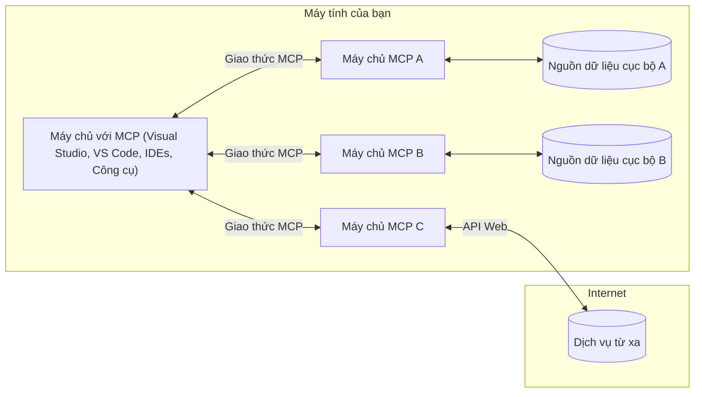

# Các Khái Niệm Cốt Lõi MCP: Làm Chủ Giao Thức Ngữ Cảnh Mô Hình để Tích Hợp AI

[](https://youtu.be/earDzWGtE84)

_(Nhấn vào hình trên để xem video bài học này)_

[Giao Thức Ngữ Cảnh Mô Hình (Model Context Protocol - MCP)](https://github.com/modelcontextprotocol) là một khung chuẩn mạnh mẽ giúp tối ưu hóa giao tiếp giữa Mô Hình Ngôn Ngữ Lớn (LLMs) với các công cụ, ứng dụng, và nguồn dữ liệu bên ngoài.
Hướng dẫn này sẽ đưa bạn qua các khái niệm cốt lõi của MCP. Bạn sẽ học về kiến trúc khách - máy chủ, các thành phần thiết yếu, cơ chế giao tiếp, và các phương pháp triển khai tốt nhất.

- **Kiểm soát và Đồng ý của Người dùng**: Chủ máy chủ nên rõ ràng hiển thị dữ liệu và công cụ mà máy chủ cung cấp, cho phép người dùng từ chối thao tác, và lấy được xác nhận rõ ràng cho các hành động nhạy cảm hoặc quan trọng. MCP không yêu cầu hộp thoại xác nhận trước mỗi lần gọi công cụ.


- **Bảo vệ Quyền riêng tư Dữ liệu**: Dữ liệu người dùng chỉ được tiết lộ khi có sự đồng ý rõ ràng và phải được bảo vệ bằng các biện pháp kiểm soát truy cập nghiêm ngặt trong suốt vòng đời tương tác. Triển khai cần ngăn chặn việc truyền dữ liệu trái phép và duy trì ranh giới quyền riêng tư chặt chẽ.

- **An toàn Thực thi Công cụ**: Chủ máy chủ cần làm cho các cuộc gọi công cụ có thể nhận biết được và giữ cho con người có thể từ chối chúng. Các thao tác nhạy cảm cần hiển thị đầu vào công cụ và tác động trước khi thực thi, với các ranh giới bảo mật để ngăn chặn các hành động sai hoặc độc hại.


- **Bảo mật Giao thức Vận chuyển**: Kết nối từ xa nên sử dụng HTTPS và mô hình ủy quyền MCP. Máy chủ stdio tại chỗ dựa trên tách biệt tiến trình, cấu hình tin cậy, và xử lý an toàn thông tin xác thực kế thừa.


#### Hướng dẫn Triển khai:

- **Quản lý Quyền hạn**: Triển khai hệ thống quyền hạn chi tiết cho phép người dùng kiểm soát các máy chủ, công cụ và tài nguyên có thể truy cập
- **Xác thực & Ủy quyền**: Sử dụng các phương pháp xác thực an toàn (OAuth, khóa API) kèm quản lý token và thời hạn hợp lý  
- **Kiểm tra Đầu vào**: Xác thực tất cả các tham số và đầu vào dữ liệu theo lược đồ định nghĩa để ngăn chặn tấn công chèn mã
- **Ghi nhật ký Kiểm toán**: Duy trì nhật ký toàn diện mọi hoạt động để giám sát an ninh và tuân thủ

## Tổng quan

Bài học này khám phá kiến trúc cơ bản và các thành phần tạo nên hệ sinh thái Giao thức Ngữ cảnh Mô hình (MCP). Bạn sẽ học về kiến trúc khách - máy chủ, các thành phần chủ chốt, và cơ chế giao tiếp vận hành tương tác MCP.

## Mục tiêu Học tập Chính

Đến cuối bài học, bạn sẽ:

- Hiểu kiến trúc khách - máy chủ của MCP.
- Xác định vai trò và trách nhiệm của Chủ máy, Khách, và Máy chủ.
- Phân tích các tính năng cốt lõi làm MCP trở thành lớp tích hợp linh hoạt.
- Học cách luồng thông tin hoạt động trong hệ sinh thái MCP.
- Thu nhận hiểu biết thực tiễn qua ví dụ mã trong .NET, Java, Python, và JavaScript.

## Kiến trúc MCP: Khám phá Sâu hơn

Hệ sinh thái MCP được xây dựng trên mô hình khách - máy chủ. Cấu trúc mô-đun này cho phép các ứng dụng AI tương tác hiệu quả với công cụ, cơ sở dữ liệu, API, và tài nguyên theo ngữ cảnh. Hãy cùng phân tích kiến trúc này thành các thành phần cốt lõi.

Về cơ bản, MCP tuân theo kiến trúc khách - máy chủ nơi một ứng dụng chủ có thể kết nối với nhiều máy chủ:


```mermaid
flowchart LR
    subgraph "Máy tính của bạn"
        Host["Máy chủ với MCP (Visual Studio, VS Code, IDEs, Công cụ)"]
        S1["Máy chủ MCP A"]
        S2["Máy chủ MCP B"]
        S3["Máy chủ MCP C"]
        Host <-->|"Giao thức MCP"| S1
        Host <-->|"Giao thức MCP"| S2
        Host <-->|"Giao thức MCP"| S3
        S1 <--> D1[("Nguồn dữ liệu cục bộ A")]
        S2 <--> D2[("Nguồn dữ liệu cục bộ B")]
    end
    subgraph "Internet"
        S3 <-->|"API Web"| D3[("Dịch vụ từ xa")]
    end
```

- **Chủ MCP**: Các chương trình như VSCode, Claude Desktop, IDEs, hoặc công cụ AI muốn truy cập dữ liệu qua MCP
- **Khách MCP**: Các thành phần giao thức duy trì một quan hệ logic với một máy chủ; các yêu cầu MCP `2026-07-28` không dựa vào kết nối hoặc phiên duy trì liên tục


- **Máy chủ MCP**: Các chương trình nhẹ mỗi cái cung cấp các khả năng cụ thể thông qua Giao thức Ngữ cảnh Mô hình tiêu chuẩn hóa
- **Nguồn Dữ liệu Cục bộ**: Các tệp, cơ sở dữ liệu và dịch vụ trên máy tính của bạn mà máy chủ MCP có thể truy cập một cách an toàn
- **Dịch vụ Từ xa**: Các hệ thống bên ngoài có thể truy cập qua internet mà máy chủ MCP có thể kết nối thông qua API.

Giao thức MCP là một tiêu chuẩn đang phát triển sử dụng phiên bản dựa trên ngày tháng
(định dạng NĂM-THÁNG-NGÀY). Phiên bản giao thức hiện tại là **2026-07-28**. Xem
[đặc tả giao thức 2026-07-28](https://modelcontextprotocol.io/specification/2026-07-28/).

> **Phiên bản hiện tại:** MCP `2026-07-28` làm cho giao thức không trạng thái ở
> tầng truyền tải bằng cách loại bỏ bắt tay `initialize` và các ID phiên ở cấp giao thức.
> Nó cũng chính thức hóa một khung Mở rộng và loại bỏ
> Roots, Sampling, và Logging để ủng hộ các mẫu mới hơn. Xem
> [Những thay đổi trong MCP: Đặc tả 2026-07-28](./mcp-2026-07-28.md)
> để biết phân tích đầy đủ và hướng dẫn di chuyển. Các ví dụ nhắm mục tiêu rõ ràng
> `2025-11-25` được giữ lại như bài học tương thích kế thừa.

### 1. Máy chủ

Trong Giao thức Ngữ cảnh Mô hình (MCP), **Máy chủ** là các ứng dụng AI đóng vai trò là giao diện chính qua đó người dùng tương tác với giao thức. Máy chủ điều phối và quản lý kết nối đến nhiều máy chủ MCP bằng cách tạo các khách hàng MCP riêng biệt cho mỗi kết nối máy chủ. Ví dụ về các Máy chủ bao gồm:

- **Ứng dụng AI**: Claude Desktop, Visual Studio Code, Claude Code
- **Môi trường Phát triển**: IDE và các trình soạn thảo mã với tích hợp MCP  
- **Ứng dụng Tùy chỉnh**: Các tác nhân và công cụ AI được xây dựng theo mục đích riêng

**Máy chủ** là các ứng dụng điều phối tương tác mô hình AI. Chúng:

- **Điều phối Mô hình AI**: Thực thi hoặc tương tác với LLM để tạo phản hồi và điều phối quy trình AI
- **Quản lý Quan hệ Khách hàng**: Tạo và quản lý một khách hàng MCP cho mỗi máy chủ MCP
  mà máy chủ sử dụng
- **Kiểm soát Giao diện Người dùng**: Xử lý luồng trò chuyện, tương tác người dùng và trình bày phản hồi  
- **Thực thi An ninh**: Kiểm soát quyền, ràng buộc bảo mật và xác thực
- **Xử lý Sự đồng ý của Người dùng**: Quản lý sự phê duyệt của người dùng đối với việc chia sẻ dữ liệu và thực thi công cụ


### 2. Khách hàng

**Khách hàng** là các thành phần giao thức được tạo bởi một máy chủ cho các
máy chủ MCP cụ thể. Đây là mối quan hệ một-một hợp lý, không phải là yêu cầu cho một
kết nối mạng liên tục. Trong MCP `2026-07-28`, mỗi yêu cầu là
tự chứa và có thể được xử lý bởi bất kỳ thể hiện máy chủ nào.

**Khách hàng** là các thành phần kết nối bên trong ứng dụng máy chủ. Chúng:

- **Giao tiếp Giao thức**: Gửi các yêu cầu JSON-RPC 2.0 đến máy chủ với các prompt và chỉ dẫn
- **Khám phá Khả năng**: Sử dụng `server/discover` để tìm hiểu các phiên bản giao thức, khả năng và phần mở rộng được máy chủ hỗ trợ

- **Thực thi Công cụ**: Quản lý các yêu cầu thực thi công cụ từ mô hình và xử lý phản hồi
- **Cập nhật Theo thời gian Thực**: Xử lý các thông báo và cập nhật theo thời gian thực từ máy chủ
- **Xử lý Phản hồi**: Xử lý và định dạng phản hồi từ máy chủ để hiển thị cho người dùng

### 3. Máy chủ


**Máy chủ** là các chương trình cung cấp ngữ cảnh, công cụ và khả năng cho các khách hàng MCP. Chúng có thể thực thi cục bộ (trên cùng máy với Máy chủ) hoặc từ xa (trên các nền tảng bên ngoài), và chịu trách nhiệm xử lý các yêu cầu của khách hàng và cung cấp các phản hồi có cấu trúc. Máy chủ cung cấp chức năng cụ thể thông qua Giao thức Ngữ cảnh Mô hình tiêu chuẩn.

**Máy chủ** là các dịch vụ cung cấp ngữ cảnh và khả năng. Chúng:


- **Đăng ký Tính năng**: Đăng ký và công khai các nguyên thủy có sẵn (tài nguyên, lời nhắc, công cụ) cho khách hàng
- **Xử lý Yêu cầu**: Nhận và thực thi các cuộc gọi công cụ, yêu cầu tài nguyên, và yêu cầu lời nhắc từ khách hàng
- **Cung cấp Ngữ cảnh**: Cung cấp thông tin và dữ liệu ngữ cảnh nhằm nâng cao phản hồi của mô hình
- **Quản lý Trạng thái**: Duy trì trạng thái ứng dụng với các tay cầm rõ ràng được truyền trong yêu cầu khi cần thiết; MCP `2026-07-28` không có các phiên cấp giao thức

- **Thông báo Thời gian Thực**: Gửi thông báo về thay đổi và cập nhật khả năng đến các khách hàng đang kết nối

Các máy chủ có thể được phát triển bởi bất kỳ ai để mở rộng khả năng mô hình với các chức năng chuyên biệt, và chúng hỗ trợ cả các kịch bản triển khai cục bộ và từ xa.

### 4. Nguyên thủy của Máy chủ

Các máy chủ trong Giao thức Ngữ cảnh Mô hình (MCP) cung cấp ba **nguyên thủy** cốt lõi định nghĩa các khối xây dựng cơ bản cho các tương tác phong phú giữa khách hàng, máy chủ, và các mô hình ngôn ngữ. Các nguyên thủy này chỉ định các loại thông tin ngữ cảnh và hành động có sẵn thông qua giao thức.

Các máy chủ MCP có thể công khai bất kỳ sự kết hợp nào của ba nguyên thủy cốt lõi sau:

#### Tài nguyên 

**Tài nguyên** là các nguồn dữ liệu cung cấp thông tin ngữ cảnh cho các ứng dụng AI. Chúng đại diện cho nội dung tĩnh hoặc động có thể nâng cao sự hiểu biết và ra quyết định của mô hình:

- **Dữ liệu Ngữ cảnh**: Thông tin cấu trúc và ngữ cảnh để mô hình AI tiêu thụ
- **Cơ sở Tri thức**: Kho tài liệu, bài viết, hướng dẫn, và bài nghiên cứu
- **Nguồn Dữ liệu Cục bộ**: Tệp, cơ sở dữ liệu, và thông tin hệ thống cục bộ  
- **Dữ liệu Bên ngoài**: Phản hồi API, dịch vụ web, và dữ liệu hệ thống từ xa
- **Nội dung Động**: Dữ liệu thời gian thực cập nhật dựa trên điều kiện bên ngoài

Tài nguyên được xác định bằng URI và hỗ trợ khám phá qua phương thức `resources/list` và truy xuất qua `resources/read`:

```text
file://documents/project-spec.md
database://production/users/schema
api://weather/current
```

#### Lời nhắc

**Lời nhắc** là các mẫu có thể tái sử dụng giúp cấu trúc các tương tác với mô hình ngôn ngữ. Chúng cung cấp các mẫu tương tác chuẩn hóa và quy trình làm việc theo mẫu:

- **Tương tác Dựa trên Mẫu**: Tin nhắn có cấu trúc sẵn và các câu mở đầu cuộc trò chuyện
- **Mẫu Quy trình Làm việc**: Các chuỗi chuẩn hóa cho các tác vụ và tương tác thường gặp
- **Ví dụ Few-shot**: Mẫu dựa trên ví dụ dùng để hướng dẫn mô hình
- **Lời nhắc Hệ thống**: Lời nhắc nền tảng định nghĩa hành vi và ngữ cảnh mô hình
- **Mẫu Động**: Lời nhắc tham số hóa thích nghi với các ngữ cảnh cụ thể

Lời nhắc hỗ trợ thay thế biến và có thể được khám phá qua `prompts/list` và truy xuất bằng `prompts/get`:

```markdown
Generate a {{task_type}} for {{product}} targeting {{audience}} with the following requirements: {{requirements}}
```

#### Công cụ

**Công cụ** là các hàm thực thi mà mô hình AI có thể gọi để thực hiện các hành động cụ thể. Chúng đại diện cho “động từ” trong hệ sinh thái MCP, cho phép mô hình tương tác với hệ thống bên ngoài:

- **Hàm Có thể Thực thi**: Các thao tác riêng biệt mà mô hình có thể gọi với các tham số cụ thể
- **Tích hợp Hệ thống Bên ngoài**: Các cuộc gọi API, truy vấn cơ sở dữ liệu, thao tác tệp, tính toán
- **Định danh Riêng biệt**: Mỗi công cụ có tên, mô tả, và sơ đồ tham số riêng biệt
- **Nhập/Xuất Có cấu trúc**: Công cụ chấp nhận tham số được xác thực và trả về phản hồi có cấu trúc, kiểu dữ liệu rõ ràng
- **Khả năng Hành động**: Cho phép mô hình thực hiện các hành động thực tế và truy xuất dữ liệu trực tiếp

Công cụ được định nghĩa với JSON Schema để xác thực tham số và được khám phá qua `tools/list` và thực thi qua `tools/call`. Công cụ cũng có thể bao gồm **biểu tượng** như siêu dữ liệu bổ sung để trình bày giao diện người dùng tốt hơn.

**Chú thích Công cụ**: Công cụ hỗ trợ các chú thích hành vi (ví dụ, `readOnlyHint`, `destructiveHint`) mô tả việc công cụ là chỉ đọc hay có tính phá hủy, giúp khách hàng đưa ra quyết định sáng suốt về việc thực thi công cụ.

Ví dụ về định nghĩa công cụ:

```typescript
server.tool(
  "search_products", 
  {
    query: z.string().describe("Search query for products"),
    category: z.string().optional().describe("Product category filter"),
    max_results: z.number().default(10).describe("Maximum results to return")
  }, 
  async (params) => {
    // Thực hiện tìm kiếm và trả về kết quả có cấu trúc
    return await productService.search(params);
  }
);
```

## Nguyên thủy của Khách hàng

Trong Giao thức Ngữ cảnh Mô hình (MCP), **khách hàng** có thể công khai nguyên thủy cho phép máy chủ yêu cầu các khả năng bổ sung từ ứng dụng máy chủ. Các nguyên thủy phía khách hàng này cho phép triển khai máy chủ giàu tính tương tác hơn, có thể truy cập các khả năng mô hình AI và tương tác người dùng.

### Lấy mẫu

> **Không còn sử dụng trong MCP `2026-07-28`:** Lấy mẫu vẫn còn dùng được để
> tương thích, nhưng các triển khai mới nên tích hợp trực tiếp với API nhà cung cấp LLM.
> Nó đủ điều kiện bị loại bỏ trong phiên bản đặc tả đầu tiên
> phát hành vào hoặc sau ngày 28 tháng 7 năm 2027. Xem
> [Có gì thay đổi trong MCP: Đặc tả 2026-07-28](./mcp-2026-07-28.md).

**Lấy mẫu** cho phép máy chủ yêu cầu hoàn chỉnh mô hình ngôn ngữ từ ứng dụng AI của khách hàng. Nguyên thủy này cho phép máy chủ truy cập khả năng LLM mà không cần nhúng phụ thuộc mô hình của riêng họ:

- **Truy cập Không phụ thuộc Mô hình**: Máy chủ có thể yêu cầu hoàn chỉnh mà không cần bao gồm SDK LLM hay quản lý truy cập mô hình
- **AI Khởi tạo bởi Máy chủ**: Cho phép máy chủ tự động tạo nội dung sử dụng mô hình AI của khách hàng
- **Tương tác LLM Đệ quy**: Hỗ trợ các kịch bản phức tạp nơi máy chủ cần trợ giúp AI để xử lý
- **Tạo Nội dung Động**: Cho phép máy chủ tạo phản hồi ngữ cảnh sử dụng mô hình của máy chủ
- **Hỗ trợ Gọi Công cụ**: Máy chủ có thể bao gồm tham số `tools` và `toolChoice` để cho phép mô hình khách hàng gọi công cụ trong lúc lấy mẫu

Lấy mẫu sử dụng phương thức `sampling/createMessage`, nơi máy chủ yêu cầu một
hoàn chỉnh từ khách hàng.

### Gốc

> **Không còn sử dụng trong MCP `2026-07-28`:** Gốc vẫn còn dùng để
> tương thích, nhưng các triển khai mới nên truyền thư mục hoặc tệp qua
> tham số công cụ, URI tài nguyên, hoặc cấu hình máy chủ. Gốc đủ điều kiện
> bị loại bỏ trong phiên bản đặc tả đầu tiên phát hành vào hoặc sau ngày
> 28 tháng 7 năm 2027. Xem
> [Có gì thay đổi trong MCP: Đặc tả 2026-07-28](./mcp-2026-07-28.md).

**Gốc** cung cấp một cách tiêu chuẩn để khách hàng xác định vị trí hệ thống tệp
có liên quan đến máy chủ:

- **Gợi ý Hệ thống tệp**: Xác định thư mục và tệp có liên quan đến yêu cầu
- **Phân quyền riêng biệt**: Không cấp quyền truy cập hay thực thi ranh giới bảo mật
- **Khả năng theo yêu cầu**: Khách hàng quảng cáo hỗ trợ Gốc trong siêu dữ liệu yêu cầu
- **Xác định dựa trên URI**: Gốc sử dụng URI `file://` để xác định thư mục và tệp có thể truy cập

Trong MCP `2026-07-28`, máy chủ yêu cầu `roots/list` qua một
`InputRequiredResult` trong khi xử lý yêu cầu khách hàng được hỗ trợ. Khách hàng
trả về các gốc khi nó thử lại yêu cầu gốc đó.

### Thu thập

**Thu thập** cho phép máy chủ yêu cầu thêm thông tin hoặc xác nhận từ người dùng thông qua giao diện khách hàng:

- **Yêu cầu Nhập liệu Người dùng**: Máy chủ có thể hỏi thông tin bổ sung khi cần cho việc thực thi công cụ
- **Hộp thoại Xác nhận**: Yêu cầu người dùng phê duyệt các thao tác nhạy cảm hoặc có ảnh hưởng
- **Quy trình Tương tác**: Cho phép máy chủ tạo tương tác người dùng theo từng bước
- **Thu thập Tham số Động**: Thu thập các tham số thiếu hoặc tùy chọn trong quá trình thực thi công cụ

Thu thập sử dụng phương thức `elicitation/create` bên trong một
`InputRequiredResult` để thu thập dữ liệu người dùng qua giao diện của khách hàng.


**Kích hoạt Chế độ URL**: Các máy chủ cũng có thể yêu cầu các tương tác dựa trên URL từ người dùng, cho phép máy chủ hướng người dùng đến các trang web bên ngoài để xác thực, xác nhận hoặc nhập dữ liệu.

### Ghi nhật ký

> **Không khuyến khích trong MCP `2026-07-28`:** Ghi nhật ký vẫn còn sẵn dùng để
> tương thích, nhưng các triển khai mới nên sử dụng `stderr` với stdio và
> OpenTelemetry cho khả năng quan sát có cấu trúc. Ghi nhật ký đủ điều kiện để loại bỏ
> trong lần sửa đổi đặc tả đầu tiên phát hành vào hoặc sau ngày 28 tháng 7 năm 2027. Xem
> [Có gì thay đổi trong MCP: Đặc tả 2026-07-28](./mcp-2026-07-28.md).

**Ghi nhật ký** cho phép máy chủ gửi các thông báo nhật ký có cấu trúc đến khách hàng để gỡ lỗi, giám sát và quan sát hoạt động:

- **Hỗ trợ Gỡ lỗi**: Cho phép máy chủ cung cấp nhật ký thực thi chi tiết để khắc phục sự cố
- **Giám sát Hoạt động**: Gửi các cập nhật trạng thái và chỉ số hiệu suất đến khách hàng
- **Báo cáo Lỗi**: Cung cấp ngữ cảnh lỗi chi tiết và thông tin chẩn đoán
- **Theo dõi Kiểm toán**: Tạo các bản ghi tổng thể về hoạt động và quyết định của máy chủ

Các thông báo ghi nhật ký được gửi đến khách hàng để cung cấp sự minh bạch vào hoạt động của máy chủ và hỗ trợ gỡ lỗi.

## Luồng Thông tin trong MCP

Giao thức Mô hình Ngữ cảnh (MCP) định nghĩa một luồng thông tin có cấu trúc giữa các chủ sở hữu, khách hàng, máy chủ và mô hình. Hiểu được luồng này giúp làm rõ cách các yêu cầu của người dùng được xử lý và cách công cụ bên ngoài và dữ liệu được tích hợp vào phản hồi của mô hình.

- **Chủ sở hữu Khởi tạo Kết nối**  
  Ứng dụng chủ sở hữu (chẳng hạn như IDE hoặc giao diện trò chuyện) thiết lập kết nối với một máy chủ MCP, thường qua STDIO, WebSocket hoặc một phương thức truyền tải được hỗ trợ khác.

- **Đàm phán Khả năng**  
  Khách hàng (nhúng trong chủ sở hữu) và máy chủ trao đổi thông tin về các tính năng, công cụ, tài nguyên và phiên bản giao thức được hỗ trợ. Điều này đảm bảo cả hai bên hiểu rõ các khả năng có sẵn cho phiên làm việc.

- **Yêu cầu Người dùng**  
  Người dùng tương tác với chủ sở hữu (ví dụ: nhập một lời nhắc hoặc lệnh). Chủ sở hữu thu thập đầu vào này và chuyển cho khách hàng để xử lý.

- **Sử dụng Tài nguyên hoặc Công cụ**  
  - Khách hàng có thể yêu cầu ngữ cảnh hoặc tài nguyên bổ sung từ máy chủ (chẳng hạn như tập tin, mục cơ sở dữ liệu hoặc bài viết trong cơ sở kiến thức) để làm giàu sự hiểu biết của mô hình.
  - Nếu mô hình xác định cần một công cụ (ví dụ: lấy dữ liệu, thực hiện tính toán hoặc gọi API), khách hàng gửi yêu cầu gọi công cụ đến máy chủ, chỉ định tên công cụ và các tham số.

- **Thực thi bởi Máy chủ**  
  Máy chủ nhận yêu cầu tài nguyên hoặc công cụ, thực hiện các thao tác cần thiết (chẳng hạn như chạy hàm, truy vấn cơ sở dữ liệu hoặc lấy tập tin), và trả kết quả cho khách hàng dưới định dạng có cấu trúc.

- **Tạo Phản hồi**  
  Khách hàng tích hợp các phản hồi từ máy chủ (dữ liệu tài nguyên, đầu ra công cụ, v.v.) vào tương tác mô hình đang diễn ra. Mô hình dùng thông tin này để tạo ra phản hồi toàn diện và phù hợp với ngữ cảnh.

- **Trình bày Kết quả**  
  Chủ sở hữu nhận kết quả cuối cùng từ khách hàng và trình bày nó cho người dùng, thường bao gồm cả văn bản do mô hình sinh ra và bất kỳ kết quả nào từ thực thi công cụ hoặc tra cứu tài nguyên.

Luồng này cho phép MCP hỗ trợ các ứng dụng AI nâng cao, tương tác và nhận biết ngữ cảnh bằng cách kết nối suôn sẻ các mô hình với công cụ và nguồn dữ liệu bên ngoài.

## Kiến trúc & Các Lớp Giao thức

MCP bao gồm hai lớp kiến trúc riêng biệt hoạt động cùng nhau để cung cấp một khung giao tiếp hoàn chỉnh:

### Lớp Dữ liệu


**Lớp Dữ liệu** triển khai giao thức MCP cốt lõi sử dụng **JSON-RPC 2.0** làm nền tảng. Lớp này định nghĩa cấu trúc thông điệp, ngữ nghĩa, và mẫu tương tác:

#### Thành phần cốt lõi:

- **Giao thức JSON-RPC 2.0**: Tất cả giao tiếp sử dụng định dạng thông điệp JSON-RPC 2.0 chuẩn hóa cho các cuộc gọi phương thức, phản hồi và thông báo
- **Quản lý vòng đời**: Xử lý khởi tạo kết nối, đàm phán năng lực, và kết thúc phiên giữa các client và server
- **Nguyên thủy bên máy chủ**: Cho phép máy chủ cung cấp chức năng cốt lõi thông qua công cụ, tài nguyên và lời nhắc
- **Nguyên thủy bên client**: Cho phép máy chủ yêu cầu lấy mẫu từ LLM, gợi ý đầu vào người dùng, và gửi thông điệp ghi nhật ký
- **Thông báo thời gian thực**: Hỗ trợ thông báo bất đồng bộ để cập nhật động mà không cần dò hỏi

#### Tính năng chính:

- **Đàm phán Phiên bản Giao thức**: Sử dụng phiên bản theo ngày (YYYY-MM-DD) để đảm bảo tương thích
- **Khám phá Năng lực**: Client và server trao đổi thông tin tính năng được hỗ trợ trong quá trình khởi tạo
- **Phiên Trạng thái**: Duy trì trạng thái kết nối qua nhiều tương tác để giữ liên tục ngữ cảnh

### Lớp Vận chuyển

**Lớp Vận chuyển** quản lý các kênh giao tiếp, khung thông điệp, và xác thực giữa các thành phần MCP:

#### Cơ chế Vận chuyển được hỗ trợ:

1. **Vận chuyển STDIO**:
   - Sử dụng luồng đầu vào/ra chuẩn để giao tiếp trực tiếp giữa các tiến trình
   - Tối ưu cho các tiến trình cục bộ trên cùng một máy mà không có chi phí mạng
   - Thường được dùng cho các triển khai server MCP cục bộ

2. **Vận chuyển HTTP Có thể truyền dòng**:
   - Sử dụng HTTP POST cho các thông điệp từ client đến server  
   - Tùy chọn Sự kiện Gửi từ Server (SSE) để truyền dòng từ server đến client
   - Cho phép giao tiếp server từ xa qua mạng
   - Hỗ trợ xác thực HTTP tiêu chuẩn (token bearer, khóa API, header tùy chỉnh)
   - MCP khuyến nghị OAuth để xác thực an toàn dựa trên token

#### Trừu tượng Vận chuyển:

Lớp vận chuyển trừu tượng hoá chi tiết giao tiếp khỏi lớp dữ liệu, cho phép sử dụng cùng định dạng thông điệp JSON-RPC 2.0 trên tất cả cơ chế vận chuyển. Sự trừu tượng này cho phép ứng dụng chuyển đổi mượt mà giữa server cục bộ và từ xa.

### Cân nhắc Bảo mật

Các triển khai MCP phải tuân thủ một số nguyên tắc bảo mật quan trọng để đảm bảo tương tác an toàn, đáng tin cậy và bảo mật trong tất cả các hoạt động giao thức:

- **Sự đồng ý và kiểm soát của người dùng**: Người dùng phải cung cấp sự đồng ý rõ ràng trước khi bất kỳ dữ liệu nào được truy cập hoặc hoạt động nào được thực hiện. Họ cần có quyền kiểm soát rõ ràng dữ liệu được chia sẻ và các hành động được ủy quyền, được hỗ trợ bởi giao diện người dùng trực quan để xem xét và phê duyệt các hoạt động.

- **Bảo mật dữ liệu**: Dữ liệu người dùng chỉ được tiết lộ với sự đồng ý rõ ràng và phải được bảo vệ bằng các kiểm soát truy cập phù hợp. Các triển khai MCP phải bảo vệ chống gửi dữ liệu trái phép và đảm bảo quyền riêng tư được duy trì suốt toàn bộ tương tác.

- **An toàn công cụ**: Trước khi gọi bất kỳ công cụ nào, phải có sự đồng ý rõ ràng từ người dùng. Người dùng cần hiểu rõ chức năng của từng công cụ, và các ranh giới bảo mật chặt chẽ phải được áp dụng để ngăn chặn việc thực thi công cụ không mong muốn hoặc không an toàn.

Bằng cách tuân theo các nguyên tắc bảo mật này, MCP đảm bảo niềm tin, quyền riêng tư và an toàn của người dùng được duy trì trong tất cả các tương tác giao thức đồng thời cho phép tích hợp AI mạnh mẽ.

## Ví dụ mã: Các thành phần chính

Dưới đây là ví dụ mã trong một số ngôn ngữ lập trình phổ biến minh họa cách triển khai các thành phần server MCP chính và công cụ.

### Ví dụ .NET: Tạo Server MCP đơn giản với Công cụ

Đây là ví dụ mã .NET thực tế minh họa cách triển khai server MCP đơn giản với các công cụ tùy chỉnh. Ví dụ này trình bày cách định nghĩa và đăng ký công cụ, xử lý yêu cầu, và kết nối server sử dụng Giao thức Ngữ cảnh Mô hình.

```csharp
using System;
using System.Threading.Tasks;
using ModelContextProtocol.Server;
using ModelContextProtocol.Server.Transport;
using ModelContextProtocol.Server.Tools;

public class WeatherServer
{
    public static async Task Main(string[] args)
    {
        // Create an MCP server
        var server = new McpServer(
            name: "Weather MCP Server",
            version: "1.0.0"
        );
        
        // Register our custom weather tool
        server.AddTool<string, WeatherData>("weatherTool", 
            description: "Gets current weather for a location",
            execute: async (location) => {
                // Call weather API (simplified)
                var weatherData = await GetWeatherDataAsync(location);
                return weatherData;
            });
        
        // Connect the server using stdio transport
        var transport = new StdioServerTransport();
        await server.ConnectAsync(transport);
        
        Console.WriteLine("Weather MCP Server started");
        
        // Keep the server running until process is terminated
        await Task.Delay(-1);
    }
    
    private static async Task<WeatherData> GetWeatherDataAsync(string location)
    {
        // This would normally call a weather API
        // Simplified for demonstration
        await Task.Delay(100); // Simulate API call
        return new WeatherData { 
            Temperature = 72.5,
            Conditions = "Sunny",
            Location = location
        };
    }
}

public class WeatherData
{
    public double Temperature { get; set; }
    public string Conditions { get; set; }
    public string Location { get; set; }
}
```


### Ví dụ Java: Các thành phần máy chủ MCP


Ví dụ này trình bày cùng một máy chủ MCP và đăng ký công cụ như ví dụ .NET ở trên, nhưng được triển khai bằng Java.

```java
import io.modelcontextprotocol.server.McpServer;
import io.modelcontextprotocol.server.McpToolDefinition;
import io.modelcontextprotocol.server.transport.StdioServerTransport;
import io.modelcontextprotocol.server.tool.ToolExecutionContext;
import io.modelcontextprotocol.server.tool.ToolResponse;

public class WeatherMcpServer {
    public static void main(String[] args) throws Exception {
        // Tạo một server MCP
        McpServer server = McpServer.builder()
            .name("Weather MCP Server")
            .version("1.0.0")
            .build();
            
        // Đăng ký một công cụ thời tiết
        server.registerTool(McpToolDefinition.builder("weatherTool")
            .description("Gets current weather for a location")
            .parameter("location", String.class)
            .execute((ToolExecutionContext ctx) -> {
                String location = ctx.getParameter("location", String.class);
                
                // Lấy dữ liệu thời tiết (đơn giản hóa)
                WeatherData data = getWeatherData(location);
                
                // Trả về câu trả lời đã định dạng
                return ToolResponse.content(
                    String.format("Temperature: %.1f°F, Conditions: %s, Location: %s", 
                    data.getTemperature(), 
                    data.getConditions(), 
                    data.getLocation())
                );
            })
            .build());
        
        // Kết nối server sử dụng giao thức stdio
        try (StdioServerTransport transport = new StdioServerTransport()) {
            server.connect(transport);
            System.out.println("Weather MCP Server started");
            // Giữ cho server chạy cho đến khi tiến trình bị kết thúc
            Thread.currentThread().join();
        }
    }
    
    private static WeatherData getWeatherData(String location) {
        // Cài đặt sẽ gọi một API thời tiết
        // Đơn giản hóa cho mục đích ví dụ
        return new WeatherData(72.5, "Sunny", location);
    }
}

class WeatherData {
    private double temperature;
    private String conditions;
    private String location;
    
    public WeatherData(double temperature, String conditions, String location) {
        this.temperature = temperature;
        this.conditions = conditions;
        this.location = location;
    }
    
    public double getTemperature() {
        return temperature;
    }
    
    public String getConditions() {
        return conditions;
    }
    
    public String getLocation() {
        return location;
    }
}
```

### Ví dụ Python: Xây dựng Máy chủ MCP

Ví dụ này sử dụng fastmcp, vì vậy hãy đảm bảo bạn đã cài đặt nó trước:

```python
pip install fastmcp
```
Mẫu mã:

```python
#!/usr/bin/env python3
import asyncio
from fastmcp import FastMCP
from fastmcp.transports.stdio import serve_stdio

# Tạo một máy chủ FastMCP
mcp = FastMCP(
    name="Weather MCP Server",
    version="1.0.0"
)

@mcp.tool()
def get_weather(location: str) -> dict:
    """Gets current weather for a location."""
    return {
        "temperature": 72.5,
        "conditions": "Sunny",
        "location": location
    }

# Phương pháp thay thế sử dụng một lớp
class WeatherTools:
    @mcp.tool()
    def forecast(self, location: str, days: int = 1) -> dict:
        """Gets weather forecast for a location for the specified number of days."""
        return {
            "location": location,
            "forecast": [
                {"day": i+1, "temperature": 70 + i, "conditions": "Partly Cloudy"}
                for i in range(days)
            ]
        }

# Đăng ký các công cụ của lớp
weather_tools = WeatherTools()

# Khởi động máy chủ
if __name__ == "__main__":
    asyncio.run(serve_stdio(mcp))
```

### Ví dụ JavaScript: Tạo Máy chủ MCP

Ví dụ này cho thấy cách tạo máy chủ MCP trong JavaScript và cách đăng ký hai công cụ liên quan đến thời tiết.

```javascript
// Sử dụng SDK chính thức của Model Context Protocol
import { McpServer } from "@modelcontextprotocol/sdk/server/mcp.js";
import { StdioServerTransport } from "@modelcontextprotocol/sdk/server/stdio.js";
import { z } from "zod"; // Để xác thực tham số

// Tạo một máy chủ MCP
const server = new McpServer({
  name: "Weather MCP Server",
  version: "1.0.0"
});

// Định nghĩa một công cụ thời tiết
server.tool(
  "weatherTool",
  {
    location: z.string().describe("The location to get weather for")
  },
  async ({ location }) => {
    // Thông thường sẽ gọi API thời tiết
    // Đơn giản hóa cho mục đích trình diễn
    const weatherData = await getWeatherData(location);
    
    return {
      content: [
        { 
          type: "text", 
          text: `Temperature: ${weatherData.temperature}°F, Conditions: ${weatherData.conditions}, Location: ${weatherData.location}` 
        }
      ]
    };
  }
);

// Định nghĩa một công cụ dự báo
server.tool(
  "forecastTool",
  {
    location: z.string(),
    days: z.number().default(3).describe("Number of days for forecast")
  },
  async ({ location, days }) => {
    // Thông thường sẽ gọi API thời tiết
    // Đơn giản hóa cho mục đích trình diễn
    const forecast = await getForecastData(location, days);
    
    return {
      content: [
        { 
          type: "text", 
          text: `${days}-day forecast for ${location}: ${JSON.stringify(forecast)}` 
        }
      ]
    };
  }
);

// Các hàm trợ giúp
async function getWeatherData(location) {
  // Mô phỏng gọi API
  return {
    temperature: 72.5,
    conditions: "Sunny",
    location: location
  };
}

async function getForecastData(location, days) {
  // Mô phỏng gọi API
  return Array.from({ length: days }, (_, i) => ({
    day: i + 1,
    temperature: 70 + Math.floor(Math.random() * 10),
    conditions: i % 2 === 0 ? "Sunny" : "Partly Cloudy"
  }));
}

// Kết nối máy chủ sử dụng giao thức stdio
const transport = new StdioServerTransport();
server.connect(transport).catch(console.error);

console.log("Weather MCP Server started");
```

Ví dụ JavaScript này minh họa cách tạo máy chủ MCP bằng SDK Model Context Protocol. Nó cho thấy cách đăng ký hai công cụ có tên `weatherTool` và `forecastTool` và làm cho chúng có sẵn cho các khách hàng MCP thông qua `StdioServerTransport`.

## Bảo mật và Ủy quyền

MCP bao gồm một số khái niệm và cơ chế tích hợp để quản lý bảo mật và ủy quyền trong toàn bộ giao thức:

1. **Kiểm soát Quyền Công cụ**:  
  Khách hàng có thể chỉ định công cụ mà một mô hình được phép sử dụng cho mỗi yêu cầu hoặc quy trình làm việc.
  Điều này đảm bảo chỉ những công cụ được ủy quyền rõ ràng mới có thể truy cập, giảm bớt
  rủi ro thực hiện các hoạt động không mong muốn hoặc không an toàn.

2. **Xác thực**:  
  Máy chủ có thể yêu cầu xác thực trước khi cấp quyền truy cập vào công cụ, tài nguyên hoặc các hoạt động nhạy cảm. Điều này có thể bao gồm khóa API, mã thông báo OAuth hoặc các phương thức xác thực khác. Xác thực đúng cách đảm bảo chỉ khách hàng và người dùng đáng tin cậy mới có thể gọi các khả năng phía máy chủ.

3. **Xác minh**:  
  Việc xác minh tham số được thực thi cho tất cả lời gọi công cụ. Mỗi công cụ xác định các kiểu, định dạng và ràng buộc mong đợi cho các tham số của nó, và máy chủ xác minh các yêu cầu đến tương ứng. Điều này ngăn chặn đầu vào bị sai hoặc có ý đồ xấu tiếp cận các triển khai công cụ và giúp duy trì tính toàn vẹn của các hoạt động.

4. **Giới hạn Tốc độ**:  
  Để ngăn chặn việc lạm dụng và đảm bảo sử dụng tài nguyên máy chủ công bằng, các máy chủ MCP có thể
  thực hiện giới hạn tốc độ cho các cuộc gọi công cụ và truy cập tài nguyên. Giới hạn tốc độ có thể
  được áp dụng cho từng người dùng, chứng chỉ, hoạt động, hoặc trên toàn cục.

Bằng cách kết hợp các cơ chế này, MCP cung cấp nền tảng an toàn để tích hợp mô hình ngôn ngữ với các công cụ bên ngoài và nguồn dữ liệu, đồng thời trao cho người dùng và nhà phát triển quyền kiểm soát chi tiết đối với truy cập và sử dụng.

## Tin nhắn Giao thức & Luồng Giao tiếp

Giao tiếp MCP sử dụng các tin nhắn **JSON-RPC 2.0** có cấu trúc để tạo điều kiện cho các tương tác rõ ràng và đáng tin cậy giữa máy chủ, khách hàng và máy chủ. Giao thức xác định các mẫu tin nhắn cụ thể cho các loại hoạt động khác nhau:

### Các Loại Tin nhắn Cốt lõi

#### **Siêu dữ liệu Yêu cầu và Khám phá**

- **Siêu dữ liệu từng yêu cầu**: Mỗi yêu cầu `2026-07-28` là tự chứa và
  mang phiên bản giao thức, nhận dạng khách hàng và khả năng của khách hàng trong `_meta`.
- **Yêu cầu `server/discover`**: Lấy các phiên bản giao thức được hỗ trợ, nhận dạng máy chủ,
  khả năng và phần mở rộng khi khách hàng cần.
- **Tiêu đề HTTP có thể truyền phát**: Các yêu cầu HTTP bao gồm `MCP-Protocol-Version` và
  `Mcp-Method`; các phương thức liên quan đến công cụ hoặc tài nguyên được đặt tên cũng bao gồm
  `Mcp-Name`.

Việc bắt tay `initialize`/`initialized` và các ID phiên cấp giao thức thuộc
các phiên bản giao thức trước đây và không phải là một phần của MCP `2026-07-28`.

#### **Tin nhắn Khám phá**
- **Yêu cầu `tools/list`**: Khám phá các công cụ có sẵn từ máy chủ
- **Yêu cầu `resources/list`**: Liệt kê các tài nguyên có sẵn (nguồn dữ liệu)
- **Yêu cầu `prompts/list`**: Lấy các mẫu lời nhắc có sẵn

#### **Tin nhắn Thực thi**  
- **Yêu cầu `tools/call`**: Thực thi một công cụ cụ thể với các tham số được cung cấp
- **Yêu cầu `resources/read`**: Lấy nội dung từ một tài nguyên cụ thể
- **Yêu cầu `prompts/get`**: Lấy mẫu lời nhắc với các tham số tùy chọn

#### **Yêu cầu Nhập liệu từ phía Khách hàng**

- **`elicitation/create`**: Máy chủ yêu cầu nhập liệu từ người dùng qua giao diện khách hàng
  trong khi xử lý yêu cầu của khách hàng.
- **`sampling/createMessage`**: Yêu cầu máy chủ đã lỗi thời cho việc hoàn thành LLM.
- **`roots/list`**: Yêu cầu máy chủ đã lỗi thời cho đường gốc hệ thống tập tin khách hàng.

Trong `2026-07-28`, các yêu cầu nhập liệu từ máy chủ đến khách hàng sử dụng mẫu
`InputRequiredResult` nhiều vòng thay vì dựa vào phiên làm việc liên tục.

#### **Tin nhắn Thông báo**
- **`notifications/tools/list_changed`**: Máy chủ thông báo cho khách hàng về thay đổi công cụ
- **`notifications/resources/list_changed`**: Máy chủ thông báo cho khách hàng về thay đổi tài nguyên  
- **`notifications/prompts/list_changed`**: Máy chủ thông báo cho khách hàng về thay đổi mẫu lời nhắc

### Cấu trúc Tin nhắn:

Tất cả tin nhắn MCP tuân theo định dạng JSON-RPC 2.0 với:
- **Tin nhắn Yêu cầu**: Bao gồm `id`, `method`, và `params` tùy chọn
- **Tin nhắn Phản hồi**: Bao gồm `id` và hoặc `result` hoặc `error`  
- **Tin nhắn Thông báo**: Bao gồm `method` và `params` tùy chọn (không có `id` hoặc không đợi phản hồi)

Giao tiếp có cấu trúc này đảm bảo các tương tác đáng tin cậy, có thể truy vết và mở rộng hỗ trợ các kịch bản nâng cao như cập nhật thời gian thực, xâu chuỗi công cụ, và xử lý lỗi vững chắc.

### Mở rộng Nhiệm vụ

Trong MCP `2026-07-28`, Nhiệm vụ là một phần mở rộng chính thức thay vì một
tính năng cốt lõi thử nghiệm. Nó sử dụng vòng đời được thiết kế lại với `tasks/get`, `tasks/update`, và
`tasks/cancel`; `tasks/list` đã bị loại bỏ. API Nhiệm vụ thử nghiệm
`2025-11-25` không tương thích ngược với phần mở rộng này. Xem
[Điều gì đã thay đổi trong MCP: Đặc tả 2026-07-28](./mcp-2026-07-28.md).

**Nhiệm vụ** cung cấp các bọc thực thi bền vững để lấy kết quả trì hoãn và
theo dõi trạng thái:

- **Các Hoạt động Chạy dài**: Theo dõi các phép tính tốn thời gian, tự động hóa quy trình làm việc, và xử lý hàng loạt
- **Kết quả Trì hoãn**: Thăm dò trạng thái nhiệm vụ và lấy kết quả khi các hoạt động hoàn tất
- **Theo dõi Trạng thái**: Giám sát tiến trình nhiệm vụ qua các trạng thái vòng đời định nghĩa
- **Hoạt động Nhiều Bước**: Hỗ trợ các quy trình phức tạp kéo dài qua nhiều tương tác

Nhiệm vụ bọc các yêu cầu MCP tiêu chuẩn để cho phép các mẫu thực thi không đồng bộ cho các hoạt động không thể hoàn thành ngay lập tức.

## Các Điểm Chính

- **Kiến trúc**: MCP sử dụng kiến trúc khách-chủ trong đó các máy chủ quản lý nhiều kết nối khách hàng với các máy chủ
- **Người tham gia**: Hệ sinh thái bao gồm máy chủ (ứng dụng AI), khách hàng (kết nối giao thức), và máy chủ (nhà cung cấp khả năng)
- **Cơ chế Vận chuyển**: Giao tiếp hỗ trợ stdio (cục bộ) và Streamable
  HTTP (từ xa); `2026-07-28` loại bỏ luồng sự kiện GET riêng biệt
- **Nguyên thủy Cốt lõi**: Máy chủ phơi bày công cụ (hàm thực thi), tài nguyên (nguồn dữ liệu), và mẫu lời nhắc (mẫu)
- **Nguyên thủy Khách hàng**: Elicitation hỗ trợ nhập liệu người dùng, trong khi Sampling và
  Roots chỉ được giữ lại như các tính năng tương thích đã lỗi thời
- **Phần mở rộng**: Phần mở rộng Nhiệm vụ chính thức cung cấp các bọc thực thi bền vững
  cho các hoạt động chạy dài

- **Nền tảng Giao thức**: Xây dựng trên JSON-RPC 2.0 với phiên bản dựa trên ngày tháng
  (hiện tại: `2026-07-28`)

- **Khả năng Thời gian thực**: Hỗ trợ thông báo cho các cập nhật động và đồng bộ thời gian thực
- **Ưu tiên An ninh**: Sự đồng ý rõ ràng của người dùng, bảo vệ quyền riêng tư dữ liệu và truyền tải an toàn là các yêu cầu cốt lõi

## Bài tập

Thiết kế một công cụ MCP đơn giản hữu ích trong lĩnh vực của bạn. Xác định:
1. Công cụ sẽ được đặt tên là gì
2. Nó sẽ nhận những tham số gì
3. Nó sẽ trả về kết quả gì
4. Làm thế nào một mô hình có thể sử dụng công cụ này để giải quyết vấn đề của người dùng


---

## Tiếp theo

Tiếp theo: [Chương 2: An ninh](../02-Security/README.md)

Đọc [Có gì thay đổi trong MCP: Đặc tả 2026-07-28](./mcp-2026-07-28.md)
để được hướng dẫn di cư từ `2025-11-25`.

---

<!-- CO-OP TRANSLATOR DISCLAIMER START -->
**Tuyên bố miễn trừ trách nhiệm**:
Tài liệu này đã được dịch bằng dịch vụ dịch thuật AI [Co-op Translator](https://github.com/Azure/co-op-translator). Mặc dù chúng tôi cố gắng đảm bảo độ chính xác, xin lưu ý rằng bản dịch tự động có thể chứa lỗi hoặc sai sót. Tài liệu gốc bằng ngôn ngữ gốc nên được coi là nguồn tin chính thức. Đối với thông tin quan trọng, nên sử dụng dịch vụ dịch thuật chuyên nghiệp bởi con người. Chúng tôi không chịu trách nhiệm về bất kỳ hiểu lầm hoặc giải thích sai nào phát sinh từ việc sử dụng bản dịch này.
<!-- CO-OP TRANSLATOR DISCLAIMER END -->