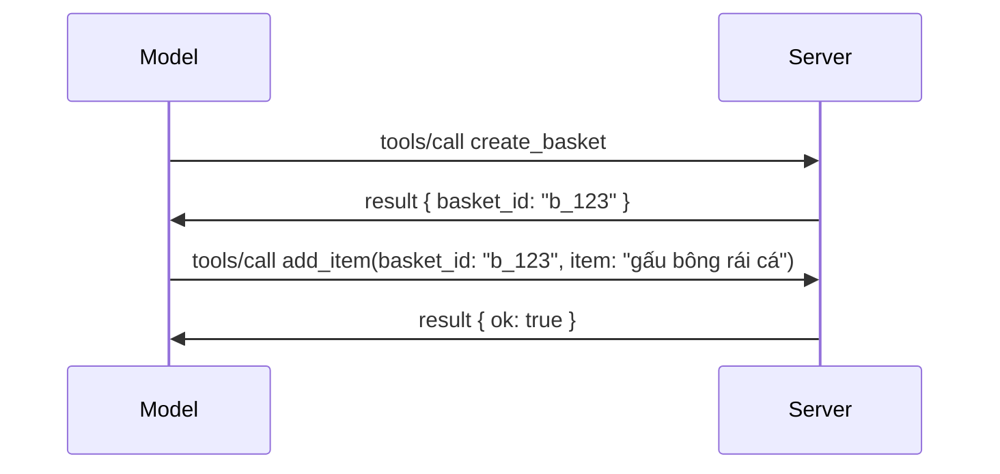

# Những Thay Đổi Trong MCP: Đặc Tả 2026-07-28

> **Trạng thái:** Cuối cùng. Đặc tả MCP `2026-07-28` được phát hành vào ngày 28 tháng 7 năm 2026
> và là phiên bản giao thức hiện tại. Bài học này mô tả đặc tả cuối cùng.
> Một số ví dụ trong chương trình học vẫn được phiên bản hóa rõ ràng với
> `2025-11-25` vì SDK của chúng chưa áp dụng API trạng thái mới;
> coi những ví dụ đó như hướng dẫn tương thích kế thừa.

## Tổng quan

`2026-07-28` là bản sửa đổi lớn nhất của MCP kể từ khi ra mắt. Sáu
Đề xuất Nâng cấp Đặc tả (SEP) loại bỏ các phiên giao thức cấp giao thức và
làm cho MCP không trạng thái ở tầng truyền tải, các phần mở rộng trở thành cơ chế
chính thức, có phiên bản, và một số tính năng được đề cập trước đó trong chương trình học
(Roots, Sampling, Logging) bị loại bỏ theo chính sách vòng đời mới. Bài học này
tóm tắt những gì đã thay đổi, tại sao quan trọng, và ý nghĩa đối với mã
viết theo `2025-11-25`.

Nguồn: [Ứng cử viên phát hành Đặc tả MCP 2026-07-28](https://blog.modelcontextprotocol.io/posts/2026-07-28-release-candidate/) (Blog Model Context Protocol, David Soria Parra và Den Delimarsky).

## Mục tiêu học tập

Vào cuối bài học này, bạn sẽ có thể:

- Giải thích lý do MCP chuyển sang lõi giao thức không trạng thái và vấn đề nó giải quyết cho các triển khai mở rộng theo chiều ngang.
- Mô tả cách `initialize`/`initialized` bắt tay và header `Mcp-Session-Id` được thay thế như thế nào.
- Nhận biết các header mới `Mcp-Method` và `Mcp-Name` và metadata bộ nhớ đệm `ttlMs`/`cacheScope`.
- Nhận biết khung Extensions và hai phần mở rộng đi kèm với bản phát hành này: MCP Apps và Tasks.
- Tóm tắt việc tăng cường phân quyền và việc loại bỏ Đăng ký Client Động
  (Dynamic Client Registration).
- Xác định những tính năng lõi nào (Roots, Sampling, Logging) hiện bị loại bỏ, và điều đó có ý nghĩa gì trên thực tế.
- Giải thích sự thay đổi sang Full JSON Schema 2020-12 cho `inputSchema`/`outputSchema` của công cụ.

## Giao thức không trạng thái

Thay đổi nổi bật: MCP trở thành không trạng thái ở tầng giao thức.

### Trước (2025-11-25): các phiên khóa bạn vào một phiên bản máy chủ

Gọi một công cụ qua Streamable HTTP bắt đầu bằng bắt tay `initialize`. Máy chủ trả về header `Mcp-Session-Id` mà mỗi yêu cầu sau đó phải mang theo:

```http
POST /mcp HTTP/1.1
Mcp-Session-Id: 1868a90c-3a3f-4f5b
Content-Type: application/json

{"jsonrpc":"2.0","id":2,"method":"tools/call",
 "params":{"name":"search","arguments":{"q":"otters"}}}
```

Vì phiên được gán cho phiên bản máy chủ đã phát hành nó, các triển khai mở rộng theo chiều ngang cần **định tuyến dính** (sticky routing) tại bộ cân bằng tải và **bộ lưu phiên chia sẻ** giữa các phiên bản.

### Sau (2026-07-28): mọi yêu cầu đều tự chứa thông tin

```http
POST /mcp HTTP/1.1
MCP-Protocol-Version: 2026-07-28
Mcp-Method: tools/call
Mcp-Name: search
Content-Type: application/json

{"jsonrpc":"2.0","id":1,"method":"tools/call",
 "params":{"name":"search","arguments":{"q":"otters"},
           "_meta":{"io.modelcontextprotocol/protocolVersion":"2026-07-28",
                    "io.modelcontextprotocol/clientInfo":{"name":"my-app","version":"1.0"},
                    "io.modelcontextprotocol/clientCapabilities":{}}}}
```

Bất kỳ phiên bản máy chủ nào cũng có thể xử lý yêu cầu này. Các thay đổi chính:

- **Bắt tay `initialize`/`initialized` bị loại bỏ** ([SEP-2575](https://github.com/modelcontextprotocol/modelcontextprotocol/pull/2575)). Phiên bản giao thức, thông tin client, và khả năng client chuyển sang `_meta` trên mỗi yêu cầu. Một phương thức mới `server/discover` cho phép client lấy khả năng máy chủ trước khi cần.
- **Header `Mcp-Session-Id` và phiên cấp giao thức bị loại bỏ** ([SEP-2567](https://github.com/modelcontextprotocol/modelcontextprotocol/pull/2567)). Định tuyến dính và bộ lưu phiên chia sẻ không còn cần thiết ở tầng giao thức.

### Giao thức không trạng thái, ứng dụng có trạng thái

Loại bỏ phiên cấp giao thức không có nghĩa là máy chủ của bạn không thể có trạng thái. Mẫu khuyến nghị là giống với API HTTP luôn dùng: tạo một handle rõ ràng (ví dụ `basket_id`, `browser_id`) từ một cuộc gọi công cụ, và để mô hình trả lại handle đó như một tham số thông thường trong các cuộc gọi sau.



Điều này làm cho trạng thái trở nên rõ ràng và hợp lý với mô hình thay vì ẩn trong metadata truyền tải, và cho phép bất kỳ phiên bản máy chủ nào xử lý bất kỳ cuộc gọi nào.

### Yêu cầu từ máy chủ đến client, tái cấu trúc

Một giao thức không trạng thái vẫn cần cách để máy chủ yêu cầu client một thứ gì đó giữa cuộc gọi (ví dụ, lời nhắc thu thập thông tin):

- **Yêu cầu khởi xướng bởi máy chủ chỉ có thể được gửi khi máy chủ đang xử lý yêu cầu client** ([SEP-2260](https://github.com/modelcontextprotocol/modelcontextprotocol/pull/2260)) — trước đây là khuyến nghị, nay là bắt buộc. Người dùng không bao giờ bị nhắc một cách bất ngờ.
- **Yêu cầu vòng lặp nhiều lần** ([SEP-2322](https://github.com/modelcontextprotocol/modelcontextprotocol/pull/2322)) thay thế việc giữ mở một luồng SSE. Thay vào đó, máy chủ trả về `InputRequiredResult`:

  ```json
  {
    "resultType": "input_required",
    "inputRequests": {
      "confirm": {
        "type": "elicitation",
        "message": "Delete 3 files?",
        "schema": { "type": "boolean" }
      }
    },
    "requestState": "eyJzdGVwIjoxLCJmaWxlcyI6WyJhIiwiYiIsImMiXX0="
  }
  ```

  Client thu thập câu trả lời và gửi lại cuộc gọi ban đầu với `inputResponses` cùng với `requestState` được echo lại. Bất kỳ phiên bản máy chủ nào cũng có thể tiếp nhận lần thử lại vì mọi thứ cần thiết đều trong payload.

### Có thể định tuyến, lưu bộ nhớ đệm, và truy vết

Ba thay đổi nhỏ làm cho lưu lượng không trạng thái dễ vận hành hơn:

- **Các header `Mcp-Method` và `Mcp-Name` bắt buộc trên Streamable HTTP** ([SEP-2243](https://github.com/modelcontextprotocol/modelcontextprotocol/pull/2243)), để bộ cân bằng tải, gateway, và bộ giới hạn tốc độ có thể định tuyến theo thao tác mà không cần kiểm tra thân JSON. Máy chủ từ chối yêu cầu khi header và thân không khớp.
- **`tools/list` và kết quả đọc tài nguyên mang `ttlMs` và `cacheScope`** ([SEP-2549](https://github.com/modelcontextprotocol/modelcontextprotocol/pull/2549)), mô phỏng theo HTTP `Cache-Control`. Client biết kết quả danh sách còn mới trong bao lâu và có an toàn để chia sẻ giữa người dùng không, không cần luồng SSE dài hạn để học về thay đổi.
- **Việc truyền tải Ngữ cảnh Truy vết W3C trong `_meta` được tài liệu hoá** ([SEP-414](https://github.com/modelcontextprotocol/modelcontextprotocol/pull/414)), chuẩn hóa tên các khóa `traceparent`, `tracestate`, và `baggage` để truy vết phân tán có thể theo dõi cuộc gọi qua client SDK, máy chủ MCP, và các hệ thống hạ nguồn trong backend tương thích [OpenTelemetry](https://opentelemetry.io/).

## Phần mở rộng trở thành chính thức

Phần mở rộng tồn tại một cách không chính thức trong `2025-11-25`. [SEP-2133](https://github.com/modelcontextprotocol/modelcontextprotocol/pull/2133) chính thức hóa chúng:

- Phần mở rộng được nhận diện bằng ID dạng reverse-DNS.
- Chúng được thương lượng qua bản đồ `extensions` trên khả năng client và máy chủ.
- Chúng được lưu trong kho `ext-*` riêng với người bảo trì ủy quyền và có phiên bản độc lập so với đặc tả lõi.
- Một Đường Dẫn Phần Mở Rộng mới trong quy trình SEP cho phép chúng tiến từ thử nghiệm sang chính thức.

Bản phát hành này bao gồm hai phần mở rộng chính thức.

### MCP Apps: giao diện người dùng được máy chủ kết xuất

[MCP Apps](https://blog.modelcontextprotocol.io/posts/2026-01-26-mcp-apps/) ([SEP-1865](https://github.com/modelcontextprotocol/modelcontextprotocol/pull/1865)) cho phép máy chủ phát hành giao diện HTML tương tác mà máy chủ lưu trú hiển thị trong iframe sandboxed. Công cụ khai báo mẫu UI của họ trước để máy chủ lưu trú có thể tải trước, lưu trữ bộ nhớ đệm, và kiểm tra bảo mật trước khi chạy. Bạn đã học căn bản điều này trong [Bài 15: MCP Apps](../03-GettingStarted/15-mcp-apps/README.md) — trong khuôn khổ Extensions, MCP Apps giờ là phần mở rộng chính thức chứ không còn là tính năng lõi thử nghiệm.

### Tasks được nâng lên thành phần mở rộng

Tasks được phát hành như tính năng lõi thử nghiệm trong `2025-11-25`. Sử dụng trong thực tế phát hiện cần thiết kế lại đủ để đưa nó thành phần mở rộng: [Tasks extension](https://github.com/modelcontextprotocol/modelcontextprotocol/pull/2663) tái cấu trúc vòng đời quanh mô hình không trạng thái — máy chủ có thể trả lời `tools/call` với handle tác vụ, và client điều khiển nó với `tasks/get`, `tasks/update`, và `tasks/cancel`. Việc tạo task do máy chủ chỉ đạo: client quảng bá phần mở rộng, máy chủ quyết định khi nào cuộc gọi nên chạy dưới dạng task. `tasks/list` bị loại bỏ hoàn toàn vì không thể giới hạn an toàn mà không có phiên.

> **Ghi chú di trú:** nếu bạn đã triển khai API Tasks thử nghiệm của `2025-11-25`, bạn sẽ cần di trú sang vòng đời phần mở rộng mới — nó không tương thích ngược.

## Tăng cường phân quyền

Một số SEP tăng cường
[đặc tả phân quyền](https://modelcontextprotocol.io/specification/2026-07-28/basic/authorization)
để phù hợp hơn với triển khai OAuth 2.0 / OpenID Connect thực tế:

| SEP | Thay đổi |
|---|---|
| [SEP-2468](https://github.com/modelcontextprotocol/modelcontextprotocol/pull/2468) | Client phải xác thực tham số `iss` trên phản hồi phân quyền theo [RFC 9207](https://www.rfc-editor.org/rfc/rfc9207), giảm thiểu các cuộc tấn công hoán đổi phổ biến trong mô hình MCP nhiều máy chủ, một client. Phiên bản tương lai sẽ yêu cầu từ chối các phản hồi thiếu `iss`. |
| [SEP-837](https://github.com/modelcontextprotocol/modelcontextprotocol/pull/837) | Chỉ dành cho tương thích: client Dynamic Client Registration khai báo `application_type` OpenID Connect, tránh mặc định `"web"` sai cho client desktop và CLI. |
| [SEP-2352](https://github.com/modelcontextprotocol/modelcontextprotocol/pull/2352) | Chỉ dành cho tương thích: thông tin đăng ký được liên kết với `issuer` của máy chủ phân quyền phát hành; client đăng ký lại nếu tài nguyên di chuyển. |
| [SEP-2207](https://github.com/modelcontextprotocol/modelcontextprotocol/pull/2207) | Tài liệu cách yêu cầu refresh token từ các máy chủ phân quyền kiểu OpenID Connect. |
| [SEP-2350](https://github.com/modelcontextprotocol/modelcontextprotocol/pull/2350) | Làm rõ sự tích lũy phạm vi trong phân quyền nâng cao (step-up authorization). |
| [SEP-2351](https://github.com/modelcontextprotocol/modelcontextprotocol/pull/2351) | Làm rõ hậu tố khám phá `.well-known`. |

Nếu bạn xây dựng máy chủ phân quyền cho MCP, cung cấp `iss` trong
phản hồi phân quyền và tuân theo đặc tả phân quyền cuối cùng. Xem
[02-Security](../02-Security/README.md) để được hướng dẫn triển khai.

Dynamic Client Registration vẫn có sẵn cho tương thích nhưng cũng
bị loại bỏ trong `2026-07-28`. Các triển khai mới nên dùng Client ID Metadata
Documents.

## Tính năng bị loại bỏ

Theo
[chính sách vòng đời tính năng](https://github.com/modelcontextprotocol/modelcontextprotocol/pull/2577),
Roots, Sampling, Logging, và Dynamic Client Registration **bị loại bỏ**:

| Tính năng | Thay thế được khuyến nghị |
|---|---|
| Roots | Tham số công cụ, URI tài nguyên, hoặc cấu hình máy chủ |
| Sampling | Tích hợp trực tiếp với API nhà cung cấp LLM |
| Logging | `stderr` cho truyền tải stdio; OpenTelemetry cho quan sát có cấu trúc |
| Dynamic Client Registration | Client ID Metadata Documents |

Những tính năng này vẫn có trong `2026-07-28` để tương thích. Chúng có thể bị
loại bỏ trong lần sửa đổi đặc tả đầu tiên được phát hành vào hoặc sau ngày 28 tháng 7 năm 2027;
việc loại bỏ thực tế có thể xảy ra muộn hơn. Các triển khai mới nên sử dụng mẫu
thay thế ở trên.

## Full JSON Schema 2020-12 cho Công cụ

`inputSchema` và `outputSchema` của công cụ được nâng lên thành [JSON Schema 2020-12 đầy đủ](https://json-schema.org/draft/2020-12) ([SEP-2106](https://github.com/modelcontextprotocol/modelcontextprotocol/pull/2106)):

- Các schema đầu vào giữ ràng buộc gốc `type: "object"` nhưng giờ cho phép kết hợp (`oneOf`, `anyOf`, `allOf`), điều kiện, và tham chiếu (`$ref`, `$defs`).
- Schema đầu ra không bị giới hạn, và `structuredContent` giờ có thể là bất kỳ giá trị JSON nào thay vì chỉ là object.
- Triển khai không được tự động giải tham chiếu các URI bên ngoài `$ref` và nên giới hạn độ sâu schema và thời gian xác thực (điều này để đề phòng tấn công từ chối dịch vụ nếu bạn xác thực schema ở phía máy chủ).

Ngoài ra, mã lỗi cho tài nguyên thiếu thay đổi từ MCP-tuỳ chỉnh `-32002` sang chuẩn JSON-RPC `-32602` (Invalid Params) ([SEP-2164](https://github.com/modelcontextprotocol/modelcontextprotocol/pull/2164)). Nếu client của bạn khớp chính xác với giá trị `-32002`, bạn sẽ cần cập nhật.

## Giao thức phát triển như thế nào từ đây

Bản phát hành này có các thay đổi phá vỡ, mà nhóm duy trì MCP không định là tiêu chuẩn trong tương lai. Ba SEP quản trị nhằm ngăn lặp lại:

- **Chính sách vòng đời tính năng** cung cấp cho mỗi tính năng lộ trình Hoạt động → Loại bỏ dần → Loại bỏ với ít nhất mười hai tháng giữa việc loại bỏ dần và thời điểm loại bỏ sớm nhất có thể.
- **Khung Extensions** cho phép khả năng mới được phát hành dưới dạng phần mở rộng tùy chọn và ổn định ở đó trước khi (nếu có) chuyển vào đặc tả lõi.
- Một SEP Đường dẫn Tiêu chuẩn không thể đạt trạng thái Cuối cùng cho đến khi kịch bản phù hợp xuất hiện trong [bộ kiểm thử tuân thủ](https://github.com/modelcontextprotocol/conformance) ([SEP-2484](https://github.com/modelcontextprotocol/modelcontextprotocol/pull/2484)) — chính là bộ mà hệ thống phân tầng SDK chấm điểm các SDK chính thức.

## Lịch phát hành và xác thực

- Ứng cử viên phát hành bị khóa vào ngày 21 tháng 5 năm 2026.
- Đặc tả cuối cùng được phát hành vào ngày 28 tháng 7 năm 2026.

- Hỗ trợ SDK có thể chậm hơn so với đặc tả. Kiểm tra
  [tài liệu SDK](https://modelcontextprotocol.io/docs/sdk) và các ghi chú phát hành SDK
  trước khi di chuyển một ví dụ.
- Theo dõi các thay đổi cuối cùng trong
  [đặc tả 2026-07-28](https://modelcontextprotocol.io/specification/2026-07-28/)
  và
  [nhật ký thay đổi](https://modelcontextprotocol.io/specification/2026-07-28/changelog).

## Ý Nghĩa Của Điều Này Đối Với Khóa Học Này

Khóa học đang chuyển từ các ví dụ `2025-11-25` sang đặc tả hiện tại
`2026-07-28`. Cụ thể:

- **Phiên và bắt tay `initialize`** trong các ví dụ nhắm tới
  `2025-11-25` là hành vi cũ. Giao thức `2026-07-28` thay thế chúng
  bằng mô hình yêu cầu không trạng thái như trên.
- **Lấy mẫu và Gốc** vẫn khả dụng để tương thích nhưng đã bị đánh dấu hết hạn.
  Thiết kế mới nên sử dụng các mẫu thay thế được liệt kê ở trên.
- **Tính năng Thử nghiệm Tasks**, nếu bạn đã sử dụng, cần được chuyển sang vòng đời mới của phần mở rộng Tasks.
- **Ứng dụng MCP** ([Bài 15](../03-GettingStarted/15-mcp-apps/README.md)) về thực tế không bị ảnh hưởng; nó chỉ được chuyển vào khuôn khổ phần mở rộng chính thức.

## Tài Nguyên Bổ Sung

- [Đặc tả MCP 2026-07-28](https://modelcontextprotocol.io/specification/2026-07-28/)
- [Nhật ký thay đổi 2026-07-28](https://modelcontextprotocol.io/specification/2026-07-28/changelog)
- [Bản ứng cử viên phát hành Đặc tả MCP 2026-07-28 (bài đăng blog lịch sử)](https://blog.modelcontextprotocol.io/posts/2026-07-28-release-candidate/)
- [Tương lai của các phương tiện MCP](https://blog.modelcontextprotocol.io/posts/2025-12-19-mcp-transport-future/)
- [Hướng dẫn SEP](https://modelcontextprotocol.io/community/sep-guidelines)
- [Hệ thống cấp độ SDK MCP](https://modelcontextprotocol.io/docs/sdk)

## Các Bước Tiếp Theo

Quay lại [Các Khái Niệm Cơ Bản](./README.md) hoặc tiếp tục tới
[Bảo mật](../02-Security/README.md) để áp dụng hướng dẫn `2026-07-28` hiện tại.

---

<!-- CO-OP TRANSLATOR DISCLAIMER START -->
**Tuyên bố miễn trừ trách nhiệm**:
Tài liệu này đã được dịch bằng dịch vụ dịch thuật AI [Co-op Translator](https://github.com/Azure/co-op-translator). Mặc dù chúng tôi cố gắng đảm bảo độ chính xác, xin lưu ý rằng bản dịch tự động có thể chứa lỗi hoặc sai sót. Tài liệu gốc bằng ngôn ngữ gốc nên được coi là nguồn tin chính thức. Đối với thông tin quan trọng, nên sử dụng dịch vụ dịch thuật chuyên nghiệp bởi con người. Chúng tôi không chịu trách nhiệm về bất kỳ hiểu lầm hoặc giải thích sai nào phát sinh từ việc sử dụng bản dịch này.
<!-- CO-OP TRANSLATOR DISCLAIMER END -->