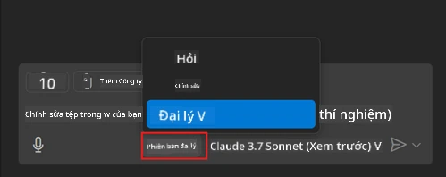
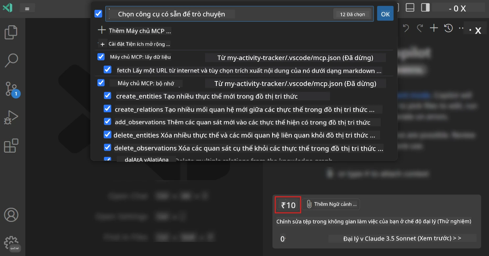
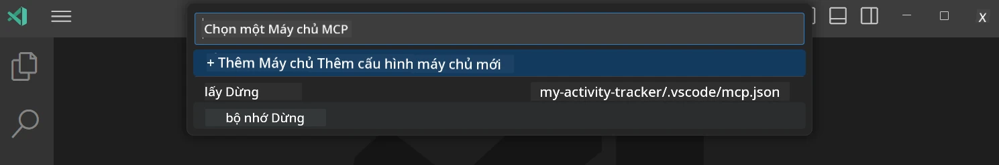
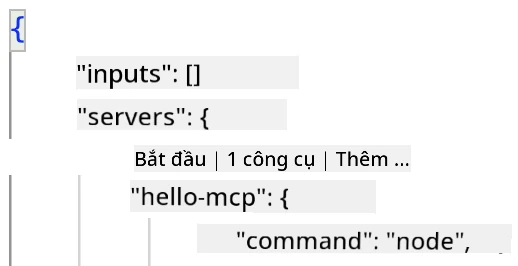
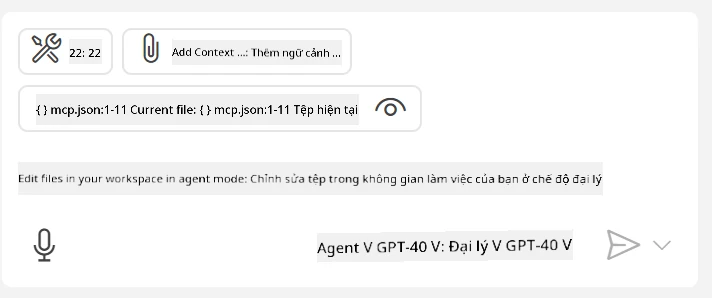
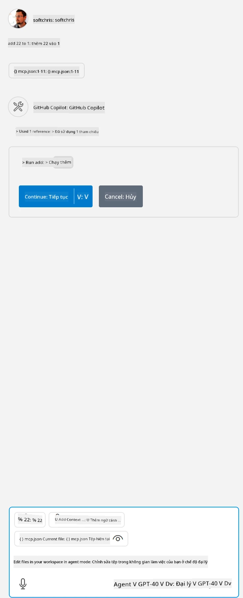

# Sử dụng máy chủ từ chế độ GitHub Copilot Agent

Visual Studio Code và GitHub Copilot có thể hoạt động như một client và sử dụng MCP Server. Tại sao bạn lại muốn làm điều đó? Chà, điều đó có nghĩa là mọi tính năng mà MCP Server có giờ đây có thể được sử dụng ngay trong IDE của bạn. Hãy tưởng tượng bạn thêm ví dụ như máy chủ MCP của GitHub, điều này sẽ cho phép bạn điều khiển GitHub qua các câu lệnh tự nhiên thay vì phải gõ các lệnh cụ thể trong terminal. Hoặc tưởng tượng bất cứ điều gì có thể cải thiện trải nghiệm phát triển của bạn đều được điều khiển bằng ngôn ngữ tự nhiên. Giờ bạn đã thấy lợi ích rồi phải không?

## Tổng quan

Bài học này hướng dẫn cách sử dụng Visual Studio Code và chế độ Agent của GitHub Copilot làm client cho MCP Server của bạn.

## Mục tiêu học tập

Đến cuối bài học này, bạn sẽ có thể:

- Sử dụng MCP Server qua Visual Studio Code.
- Chạy các tính năng như công cụ thông qua GitHub Copilot.
- Cấu hình Visual Studio Code để tìm và quản lý MCP Server của bạn.

## Cách sử dụng

Bạn có thể điều khiển MCP server của mình theo hai cách khác nhau:

- Giao diện người dùng, bạn sẽ thấy cách làm sau trong chương này.
- Terminal, bạn có thể điều khiển từ terminal sử dụng lệnh `code`:

  Để thêm một MCP server vào hồ sơ người dùng, sử dụng tùy chọn dòng lệnh --add-mcp, và cung cấp cấu hình server JSON dưới dạng {\"name\":\"server-name\",\"command\":...}.

  ```
  code --add-mcp "{\"name\":\"my-server\",\"command\": \"uvx\",\"args\": [\"mcp-server-fetch\"]}"
  ```

### Ảnh chụp màn hình





Hãy cùng nói thêm về cách sử dụng giao diện trực quan trong các phần tiếp theo.

## Phương pháp

Đây là cách tiếp cận ở mức cao:

- Cấu hình một file để tìm MCP Server của chúng ta.
- Khởi động/Kết nối đến server đó để lấy danh sách tính năng.
- Sử dụng các tính năng đó qua giao diện GitHub Copilot Chat.

Tuyệt vời, bây giờ chúng ta đã hiểu quy trình, hãy thử dùng MCP Server qua Visual Studio Code thông qua một bài tập.

## Bài tập: Sử dụng một máy chủ

Trong bài tập này, chúng ta sẽ cấu hình Visual Studio Code để tìm MCP server của bạn để có thể sử dụng từ giao diện GitHub Copilot Chat.

### -0- Bước chuẩn bị, kích hoạt khám phá MCP Server

Bạn có thể cần kích hoạt tính năng khám phá các MCP Server.

1. Vào `File -> Preferences -> Settings` trong Visual Studio Code.

1. Tìm kiếm "MCP" và bật `chat.mcp.discovery.enabled` trong file settings.json.

### -1- Tạo file cấu hình

Bắt đầu bằng cách tạo một file cấu hình trong thư mục gốc dự án của bạn, cần có file MCP.json đặt trong thư mục .vscode. File sẽ như sau:

```text
.vscode
|-- mcp.json
```

Tiếp theo, hãy xem cách thêm một mục server.

### -2- Cấu hình máy chủ

Thêm nội dung sau vào *mcp.json*:

```json
{
    "inputs": [],
    "servers": {
       "hello-mcp": {
           "command": "node",
           "args": [
               "build/index.js"
           ]
       }
    }
}
```

Ví dụ đơn giản ở trên cho thấy cách khởi động một server viết bằng Node.js, với các runtime khác chỉ cần chỉ ra lệnh thích hợp để khởi động server dùng `command` và `args`.

### -3- Khởi động server

Sau khi đã thêm mục, hãy khởi động server:

1. Tìm mục trong *mcp.json* và đảm bảo bạn thấy biểu tượng "play":

    

1. Click biểu tượng "play", bạn sẽ thấy biểu tượng công cụ trong GitHub Copilot Chat tăng số lượng công cụ có thể sử dụng. Nếu bạn click vào biểu tượng công cụ đó, bạn sẽ thấy danh sách công cụ đã đăng ký. Bạn có thể chọn/bỏ chọn từng công cụ tùy ý để GitHub Copilot dùng làm ngữ cảnh:

  

1. Để chạy một công cụ, hãy gõ một truy vấn mà bạn biết sẽ khớp mô tả một trong các công cụ, ví dụ như câu lệnh "add 22 to 1":

  

  Bạn sẽ thấy phản hồi là 23.

## Bài tập

Hãy thử thêm một mục server vào file *mcp.json* của bạn và đảm bảo bạn có thể khởi động/dừng server. Đảm bảo bạn cũng có thể giao tiếp với các công cụ trên server qua giao diện GitHub Copilot Chat.

## Giải pháp

[Giải pháp](./solution/README.md)

## Những điểm cần nhớ

Những điểm chính từ chương này là:

- Visual Studio Code là một client tuyệt vời cho phép bạn sử dụng nhiều MCP Server và công cụ của chúng.
- Giao diện GitHub Copilot Chat là cách bạn tương tác với các server.
- Bạn có thể yêu cầu người dùng nhập các thông tin như khóa API để truyền cho MCP Server khi cấu hình mục server trong file *mcp.json*.

## Mẫu ví dụ

- [Máy tính Java](../samples/java/calculator/README.md)
- [Máy tính .Net](../../../../03-GettingStarted/samples/csharp)
- [Máy tính JavaScript](../samples/javascript/README.md)
- [Máy tính TypeScript](../samples/typescript/README.md)
- [Máy tính Python](../../../../03-GettingStarted/samples/python)

## Tài nguyên thêm

- [Tài liệu Visual Studio](https://code.visualstudio.com/docs/copilot/chat/mcp-servers)

## Tiếp theo

- Tiếp theo: [Tạo một stdio Server](../05-stdio-server/README.md)

---

<!-- CO-OP TRANSLATOR DISCLAIMER START -->
**Tuyên bố miễn trừ trách nhiệm**:
Tài liệu này đã được dịch bằng dịch vụ dịch thuật AI [Co-op Translator](https://github.com/Azure/co-op-translator). Mặc dù chúng tôi cố gắng đảm bảo độ chính xác, xin lưu ý rằng bản dịch tự động có thể chứa lỗi hoặc sai sót. Tài liệu gốc bằng ngôn ngữ gốc nên được coi là nguồn tin chính thức. Đối với thông tin quan trọng, nên sử dụng dịch vụ dịch thuật chuyên nghiệp bởi con người. Chúng tôi không chịu trách nhiệm về bất kỳ hiểu lầm hoặc giải thích sai nào phát sinh từ việc sử dụng bản dịch này.
<!-- CO-OP TRANSLATOR DISCLAIMER END -->