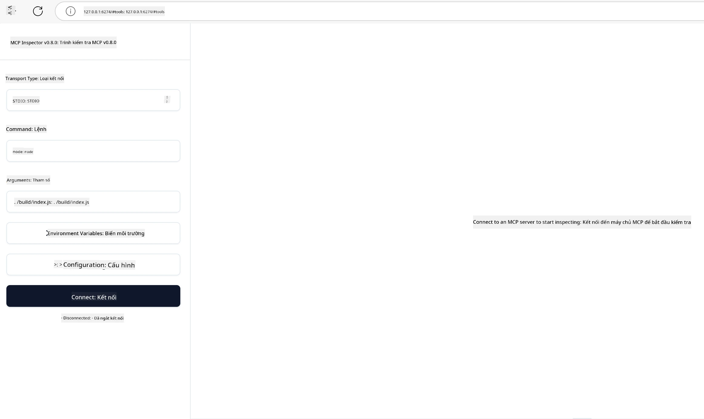

## Kiểm thử và Gỡ lỗi

Trước khi bắt đầu kiểm thử máy chủ MCP của bạn, việc hiểu các công cụ có sẵn và các thực tiễn tốt nhất để gỡ lỗi là rất quan trọng. Kiểm thử hiệu quả đảm bảo máy chủ của bạn hoạt động như mong đợi và giúp bạn nhanh chóng xác định cũng như giải quyết các sự cố. Phần sau đây trình bày các phương pháp được khuyến nghị để xác thực việc triển khai MCP của bạn.

## Tổng quan

Bài học này bao gồm cách chọn phương pháp kiểm thử phù hợp và công cụ kiểm thử hiệu quả nhất.

## Mục tiêu học tập

Đến cuối bài học này, bạn sẽ có thể:

- Mô tả các phương pháp khác nhau để kiểm thử.
- Sử dụng các công cụ khác nhau để kiểm thử mã hiệu quả.


## Kiểm thử các Máy chủ MCP

MCP cung cấp các công cụ giúp bạn kiểm thử và gỡ lỗi các máy chủ của mình:

- **MCP Inspector**: Một công cụ dòng lệnh có thể chạy cả dưới dạng công cụ CLI và công cụ trực quan.
- **Kiểm thử thủ công**: Bạn có thể sử dụng công cụ như curl để chạy các yêu cầu web, nhưng bất kỳ công cụ nào có khả năng chạy HTTP cũng đều có thể.
- **Kiểm thử đơn vị**: Có thể sử dụng framework kiểm thử ưa thích của bạn để kiểm thử các tính năng của cả máy chủ và khách hàng.

### Sử dụng MCP Inspector

Chúng tôi đã mô tả cách sử dụng công cụ này trong các bài học trước nhưng hãy cùng nói một chút ở cấp độ tổng quan. Đây là một công cụ được xây dựng trên Node.js và bạn có thể sử dụng bằng cách gọi `npx`, công cụ này sẽ tải xuống và cài đặt công cụ tạm thời, sau đó tự động dọn dẹp khi hoàn thành chạy yêu cầu của bạn.

[MCP Inspector](https://github.com/modelcontextprotocol/inspector) giúp bạn:

- **Khám phá Khả năng Máy chủ**: Tự động phát hiện các tài nguyên, công cụ và lời nhắc có sẵn
- **Kiểm thử Thực thi Công cụ**: Thử các tham số khác nhau và xem phản hồi theo thời gian thực
- **Xem Siêu dữ liệu Máy chủ**: Kiểm tra thông tin máy chủ, sơ đồ và cấu hình

Một lần chạy điển hình của công cụ trông như sau:

```bash
npx @modelcontextprotocol/inspector node build/index.js
```

Lệnh trên khởi động một MCP và giao diện trực quan của nó, đồng thời mở một giao diện web cục bộ trên trình duyệt của bạn. Bạn có thể mong đợi thấy một bảng điều khiển hiển thị các máy chủ MCP đã đăng ký của bạn, các công cụ, tài nguyên và lời nhắc có sẵn. Giao diện cho phép bạn tương tác để kiểm thử thực thi công cụ, kiểm tra siêu dữ liệu máy chủ và xem phản hồi theo thời gian thực, giúp bạn dễ dàng xác thực và gỡ lỗi các triển khai máy chủ MCP.

Đây là hình ảnh minh họa: 

Bạn cũng có thể chạy công cụ này ở chế độ CLI, trong trường hợp đó bạn thêm thuộc tính `--cli`. Dưới đây là ví dụ chạy công cụ ở chế độ "CLI" danh sách tất cả các công cụ trên máy chủ:

```sh
npx @modelcontextprotocol/inspector --cli node build/index.js --method tools/list
```

### Kiểm thử thủ công

Ngoài việc chạy công cụ inspector để kiểm thử khả năng máy chủ, một cách tiếp cận tương tự khác là chạy một khách hàng có khả năng sử dụng HTTP như ví dụ curl.

Với curl, bạn có thể kiểm thử trực tiếp các máy chủ MCP bằng các yêu cầu HTTP:

```bash
# Ví dụ: Siêu dữ liệu máy chủ thử nghiệm
curl http://localhost:3000/v1/metadata

# Ví dụ: Thực thi một công cụ
curl -X POST http://localhost:3000/v1/tools/execute \
  -H "Content-Type: application/json" \
  -d '{"name": "calculator", "parameters": {"expression": "2+2"}}'
```

Như bạn thấy qua việc sử dụng curl ở trên, bạn dùng yêu cầu POST để gọi một công cụ với payload gồm tên công cụ và các tham số của nó. Hãy dùng phương pháp phù hợp với bạn nhất. Các công cụ CLI thường nhanh hơn để sử dụng và có thể dễ dàng được lập trình tự động, điều này rất hữu ích trong môi trường CI/CD.

### Kiểm thử đơn vị

Tạo các kiểm thử đơn vị cho các công cụ và tài nguyên của bạn để đảm bảo chúng hoạt động đúng như mong đợi. Dưới đây là ví dụ mã kiểm thử.

```python
import pytest

from mcp.server.fastmcp import FastMCP
from mcp.shared.memory import (
    create_connected_server_and_client_session as create_session,
)

# Đánh dấu toàn bộ mô-đun để kiểm tra không đồng bộ
pytestmark = pytest.mark.anyio


async def test_list_tools_cursor_parameter():
    """Test that the cursor parameter is accepted for list_tools.

    Note: FastMCP doesn't currently implement pagination, so this test
    only verifies that the cursor parameter is accepted by the client.
    """

 server = FastMCP("test")

    # Tạo một vài công cụ kiểm tra
    @server.tool(name="test_tool_1")
    async def test_tool_1() -> str:
        """First test tool"""
        return "Result 1"

    @server.tool(name="test_tool_2")
    async def test_tool_2() -> str:
        """Second test tool"""
        return "Result 2"

    async with create_session(server._mcp_server) as client_session:
        # Kiểm tra mà không có tham số con trỏ (bị bỏ qua)
        result1 = await client_session.list_tools()
        assert len(result1.tools) == 2

        # Kiểm tra với con trỏ=None
        result2 = await client_session.list_tools(cursor=None)
        assert len(result2.tools) == 2

        # Kiểm tra với con trỏ là chuỗi
        result3 = await client_session.list_tools(cursor="some_cursor_value")
        assert len(result3.tools) == 2

        # Kiểm tra với con trỏ chuỗi rỗng
        result4 = await client_session.list_tools(cursor="")
        assert len(result4.tools) == 2
    
```

Mã trước đó thực hiện các bước sau:

- Sử dụng framework pytest, cho phép bạn tạo các bài kiểm thử dưới dạng hàm và dùng câu lệnh assert.
- Tạo một MCP Server với hai công cụ khác nhau.
- Dùng câu lệnh `assert` để kiểm tra các điều kiện nhất định được thỏa mãn.

Hãy xem [toàn bộ file ở đây](https://github.com/modelcontextprotocol/python-sdk/blob/main/tests/client/test_list_methods_cursor.py)

Với file trên, bạn có thể kiểm thử máy chủ của mình để đảm bảo các khả năng được tạo như mong muốn.

Tất cả SDK lớn đều có các phần kiểm thử tương tự nên bạn có thể điều chỉnh cho môi trường chạy của mình.

## Mẫu ví dụ

- [Máy tính Java](../samples/java/calculator/README.md)
- [Máy tính .Net](../../../../03-GettingStarted/samples/csharp)
- [Máy tính JavaScript](../samples/javascript/README.md)
- [Máy tính TypeScript](../samples/typescript/README.md)
- [Máy tính Python](../../../../03-GettingStarted/samples/python) 

## Tài nguyên bổ sung

- [Python SDK](https://github.com/modelcontextprotocol/python-sdk)

## Tiếp theo

- Tiếp theo: [Triển khai](../09-deployment/README.md)

---

<!-- CO-OP TRANSLATOR DISCLAIMER START -->
**Tuyên bố miễn trừ trách nhiệm**:
Tài liệu này đã được dịch bằng dịch vụ dịch thuật AI [Co-op Translator](https://github.com/Azure/co-op-translator). Mặc dù chúng tôi cố gắng đảm bảo độ chính xác, xin lưu ý rằng bản dịch tự động có thể chứa lỗi hoặc sai sót. Tài liệu gốc bằng ngôn ngữ gốc nên được coi là nguồn tin chính thức. Đối với thông tin quan trọng, nên sử dụng dịch vụ dịch thuật chuyên nghiệp bởi con người. Chúng tôi không chịu trách nhiệm về bất kỳ hiểu lầm hoặc giải thích sai nào phát sinh từ việc sử dụng bản dịch này.
<!-- CO-OP TRANSLATOR DISCLAIMER END -->