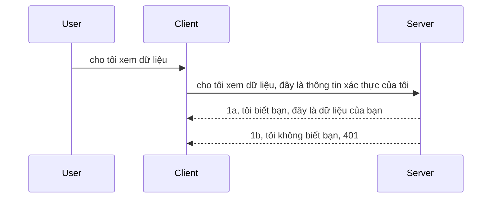

# Xác thực đơn giản

Các SDK MCP hỗ trợ sử dụng OAuth 2.1, mà công bằng mà nói là một quá trình khá phức tạp liên quan đến các khái niệm như máy chủ xác thực, máy chủ tài nguyên, gửi chứng chỉ, lấy mã, trao đổi mã lấy token bearer cho đến khi bạn cuối cùng có thể lấy dữ liệu tài nguyên của mình. Nếu bạn chưa quen với OAuth, vốn là một điều tuyệt vời để triển khai, thì việc bắt đầu với một mức cơ bản của xác thực và dần xây dựng lên mức độ bảo mật tốt hơn là một ý tưởng hay. Đó là lý do tại sao chương này tồn tại, để giúp bạn xây dựng đến xác thực nâng cao hơn.

## Xác thực, chúng ta nói gì?

Xác thực là viết tắt của authentication và authorization. Ý tưởng là chúng ta cần làm hai việc:

- **Authentication** (xác thực), là quá trình xác định xem chúng ta có cho một người vào nhà hay không, họ có quyền “ở đây” tức là có quyền truy cập vào máy chủ tài nguyên, nơi mà các tính năng MCP Server của chúng ta tồn tại.
- **Authorization** (ủy quyền), là quá trình xác định xem một người dùng có nên truy cập vào những tài nguyên cụ thể mà họ yêu cầu, ví dụ như những đơn hàng này hay những sản phẩm này, hoặc liệu họ chỉ được phép đọc nội dung mà không được xóa như một ví dụ khác.

## Chứng chỉ: cách chúng ta cho hệ thống biết mình là ai

Thường thì hầu hết các nhà phát triển web bắt đầu nghĩ đến việc cung cấp một chứng chỉ cho máy chủ, thường là một bí mật nói rằng họ có được phép ở đây hay không ("Authentication"). Chứng chỉ này thường là một phiên bản mã hóa base64 của tên đăng nhập và mật khẩu hoặc một khóa API nhận diện duy nhất một người dùng cụ thể.

Điều này liên quan đến việc gửi nó qua một header gọi là "Authorization" như sau:

```json
{ "Authorization": "secret123" }
```

Thông thường, điều này được gọi là xác thực cơ bản (basic authentication). Cách tổng thể của luồng hoạt động sau đó như sau:


Bây giờ chúng ta đã hiểu cách nó hoạt động từ góc độ luồng, làm thế nào để triển khai nó? Hầu hết các máy chủ web đều có khái niệm gọi là middleware, một đoạn mã chạy như một phần của yêu cầu có thể xác minh chứng chỉ, và nếu chứng chỉ hợp lệ thì cho phép yêu cầu đi tiếp. Nếu yêu cầu không có chứng chỉ hợp lệ thì bạn nhận được lỗi xác thực. Hãy xem cách triển khai điều này:

**Python**

```python
class AuthMiddleware(BaseHTTPMiddleware):
    async def dispatch(self, request, call_next):

        has_header = request.headers.get("Authorization")
        if not has_header:
            print("-> Missing Authorization header!")
            return Response(status_code=401, content="Unauthorized")

        if not valid_token(has_header):
            print("-> Invalid token!")
            return Response(status_code=403, content="Forbidden")

        print("Valid token, proceeding...")
       
        response = await call_next(request)
        # thêm bất kỳ tiêu đề khách hàng nào hoặc thay đổi phản hồi theo một cách nào đó
        return response


starlette_app.add_middleware(CustomHeaderMiddleware)
```

Ở đây chúng ta có:

- Tạo một middleware gọi là `AuthMiddleware` nơi phương thức `dispatch` của nó được gọi bởi máy chủ web.
- Thêm middleware vào máy chủ web:

    ```python
    starlette_app.add_middleware(AuthMiddleware)
    ```

- Viết logic xác thực kiểm tra xem header Authorization có tồn tại không và bí mật được gửi có hợp lệ không:

    ```python
    has_header = request.headers.get("Authorization")
    if not has_header:
        print("-> Missing Authorization header!")
        return Response(status_code=401, content="Unauthorized")

    if not valid_token(has_header):
        print("-> Invalid token!")
        return Response(status_code=403, content="Forbidden")
    ```

    nếu bí mật tồn tại và hợp lệ thì ta cho phép yêu cầu đi tiếp bằng cách gọi `call_next` và trả về phản hồi.

    ```python
    response = await call_next(request)
    # thêm bất kỳ tiêu đề khách hàng nào hoặc thay đổi phản hồi theo một cách nào đó
    return response
    ```

Cách hoạt động là nếu một yêu cầu web được gửi tới máy chủ thì middleware sẽ được gọi và dựa trên cách triển khai, nó sẽ hoặc cho phép yêu cầu đi qua hoặc trả về lỗi cho biết client không được phép tiếp tục.

**TypeScript**

Ở đây chúng ta tạo một middleware với framework phổ biến Express và chặn yêu cầu trước khi đến MCP Server. Đây là mã cho việc đó:

```typescript
function isValid(secret) {
    return secret === "secret123";
}

app.use((req, res, next) => {
    // 1. Có header ủy quyền không?
    if(!req.headers["Authorization"]) {
        res.status(401).send('Unauthorized');
    }
    
    let token = req.headers["Authorization"];

    // 2. Kiểm tra tính hợp lệ.
    if(!isValid(token)) {
        res.status(403).send('Forbidden');
    }

   
    console.log('Middleware executed');
    // 3. Chuyển yêu cầu đến bước tiếp theo trong chuỗi xử lý yêu cầu.
    next();
});
```

Trong đoạn code này chúng ta:

1. Kiểm tra xem header Authorization có tồn tại không, nếu không có thì gửi lỗi 401.
2. Đảm bảo chứng chỉ/token hợp lệ, nếu không, gửi lỗi 403.
3. Cuối cùng cho phép yêu cầu tiếp tục trong pipeline và trả về tài nguyên được yêu cầu.

## Bài tập: Triển khai xác thực

Hãy lấy kiến thức của chúng ta và thử triển khai nó. Kế hoạch như sau:

Server

- Tạo một máy chủ web và một instance MCP.
- Triển khai một middleware cho máy chủ.

Client

- Gửi yêu cầu web, kèm chứng chỉ, qua header.

### -1- Tạo máy chủ web và instance MCP

Trong bước đầu tiên, ta cần tạo instance máy chủ web và MCP Server.

**Python**

Ở đây ta tạo một instance MCP server, tạo app web starlette và host nó bằng uvicorn.

```python
# tạo máy chủ MCP

app = FastMCP(
    name="MCP Resource Server",
    instructions="Resource Server that validates tokens via Authorization Server introspection",
    host=settings["host"],
    port=settings["port"],
    debug=True
)

# tạo ứng dụng web starlette
starlette_app = app.streamable_http_app()

# phục vụ ứng dụng qua uvicorn
async def run(starlette_app):
    import uvicorn
    config = uvicorn.Config(
            starlette_app,
            host=app.settings.host,
            port=app.settings.port,
            log_level=app.settings.log_level.lower(),
        )
    server = uvicorn.Server(config)
    await server.serve()

run(starlette_app)
```

Trong đoạn code này chúng ta:

- Tạo MCP Server.
- Khởi tạo app web starlette từ MCP Server, `app.streamable_http_app()`.
- Host và phục vụ web app bằng uvicorn `server.serve()`.

**TypeScript**

Ở đây ta tạo một instance MCP Server.

```typescript
const server = new McpServer({
      name: "example-server",
      version: "1.0.0"
    });

    // ... thiết lập tài nguyên máy chủ, công cụ và lời nhắc ...
```

Việc tạo MCP Server này cần được thực hiện bên trong định nghĩa route POST /mcp, nên hãy lấy code trên và chuyển vào như sau:

```typescript
import express from "express";
import { randomUUID } from "node:crypto";
import { McpServer } from "@modelcontextprotocol/sdk/server/mcp.js";
import { StreamableHTTPServerTransport } from "@modelcontextprotocol/sdk/server/streamableHttp.js";
import { isInitializeRequest } from "@modelcontextprotocol/sdk/types.js"

const app = express();
app.use(express.json());

// Bản đồ để lưu trữ các phương tiện truyền tải theo ID phiên
const transports: { [sessionId: string]: StreamableHTTPServerTransport } = {};

// Xử lý các yêu cầu POST cho giao tiếp từ client đến server
app.post('/mcp', async (req, res) => {
  // Kiểm tra ID phiên đã tồn tại
  const sessionId = req.headers['mcp-session-id'] as string | undefined;
  let transport: StreamableHTTPServerTransport;

  if (sessionId && transports[sessionId]) {
    // Tái sử dụng phương tiện truyền tải hiện có
    transport = transports[sessionId];
  } else if (!sessionId && isInitializeRequest(req.body)) {
    // Yêu cầu khởi tạo mới
    transport = new StreamableHTTPServerTransport({
      sessionIdGenerator: () => randomUUID(),
      onsessioninitialized: (sessionId) => {
        // Lưu trữ phương tiện truyền tải theo ID phiên
        transports[sessionId] = transport;
      },
      // Bảo vệ DNS rebinding mặc định bị tắt để tương thích ngược. Nếu bạn đang chạy máy chủ này
      // cục bộ, hãy đảm bảo thiết lập:
      // enableDnsRebindingProtection: true,
      // allowedHosts: ['127.0.0.1'],
    });

    // Dọn dẹp phương tiện truyền tải khi đóng
    transport.onclose = () => {
      if (transport.sessionId) {
        delete transports[transport.sessionId];
      }
    };
    const server = new McpServer({
      name: "example-server",
      version: "1.0.0"
    });

    // ... thiết lập tài nguyên máy chủ, công cụ và lời nhắc ...

    // Kết nối với máy chủ MCP
    await server.connect(transport);
  } else {
    // Yêu cầu không hợp lệ
    res.status(400).json({
      jsonrpc: '2.0',
      error: {
        code: -32000,
        message: 'Bad Request: No valid session ID provided',
      },
      id: null,
    });
    return;
  }

  // Xử lý yêu cầu
  await transport.handleRequest(req, res, req.body);
});

// Bộ xử lý có thể tái sử dụng cho các yêu cầu GET và DELETE
const handleSessionRequest = async (req: express.Request, res: express.Response) => {
  const sessionId = req.headers['mcp-session-id'] as string | undefined;
  if (!sessionId || !transports[sessionId]) {
    res.status(400).send('Invalid or missing session ID');
    return;
  }
  
  const transport = transports[sessionId];
  await transport.handleRequest(req, res);
};

// Xử lý các yêu cầu GET cho thông báo từ server đến client qua SSE
app.get('/mcp', handleSessionRequest);

// Xử lý các yêu cầu DELETE để kết thúc phiên làm việc
app.delete('/mcp', handleSessionRequest);

app.listen(3000);
```

Bây giờ bạn thấy cách tạo MCP Server được chuyển vào trong `app.post("/mcp")`.

Chúng ta tiếp tục sang bước tiếp theo là tạo middleware để có thể xác thực chứng chỉ gửi tới.

### -2- Triển khai middleware cho server

Tiếp theo chúng ta đến phần middleware. Ở đây ta sẽ tạo một middleware tìm kiếm chứng chỉ trong header `Authorization` và xác thực nó. Nếu hợp lệ thì yêu cầu sẽ đi tiếp nhằm thực hiện những gì cần thiết (ví dụ liệt kê công cụ, đọc tài nguyên hay bất kỳ chức năng MCP nào client yêu cầu).

**Python**

Để tạo middleware, ta cần tạo một lớp kế thừa từ `BaseHTTPMiddleware`. Có hai thành phần thú vị:

- Yêu cầu `request`, từ đó ta đọc thông tin header.
- `call_next`, callback cần gọi nếu client gửi chứng chỉ mà ta chấp nhận.

Đầu tiên, ta cần xử lý trường hợp nếu header `Authorization` bị thiếu:

```python
has_header = request.headers.get("Authorization")

# không có tiêu đề, trả về lỗi 401, nếu không thì tiếp tục.
if not has_header:
    print("-> Missing Authorization header!")
    return Response(status_code=401, content="Unauthorized")
```

Ở đây chúng ta gửi thông báo 401 unauthorized vì client không vượt qua xác thực.

Tiếp theo, nếu có chứng chỉ gửi tới, ta cần kiểm tra tính hợp lệ của nó như sau:

```python
 if not valid_token(has_header):
    print("-> Invalid token!")
    return Response(status_code=403, content="Forbidden")
```

Chú ý cách gửi thông báo 403 forbidden ở trên. Hãy xem middleware đầy đủ dưới đây triển khai mọi thứ đã đề cập:

```python
class AuthMiddleware(BaseHTTPMiddleware):
    async def dispatch(self, request, call_next):

        has_header = request.headers.get("Authorization")
        if not has_header:
            print("-> Missing Authorization header!")
            return Response(status_code=401, content="Unauthorized")

        if not valid_token(has_header):
            print("-> Invalid token!")
            return Response(status_code=403, content="Forbidden")

        print("Valid token, proceeding...")
        print(f"-> Received {request.method} {request.url}")
        response = await call_next(request)
        response.headers['Custom'] = 'Example'
        return response

```

Tuyệt vời, nhưng hàm `valid_token` thì sao? Đây là nó bên dưới:

```python
# KHÔNG sử dụng cho sản xuất - cải thiện nó !!
def valid_token(token: str) -> bool:
    # xóa tiền tố "Bearer "
    if token.startswith("Bearer "):
        token = token[7:]
        return token == "secret-token"
    return False
```

Điều này dĩ nhiên có thể cải tiến hơn.

QUAN TRỌNG: Bạn KHÔNG BAO GIỜ nên để các bí mật như thế này trong code. Lý tưởng nhất là bạn nên lấy giá trị so sánh từ một nguồn dữ liệu hoặc từ IDP (nhà cung cấp dịch vụ định danh) hoặc tốt hơn, để IDP thực hiện việc xác thực.

**TypeScript**

Để triển khai với Express, ta cần gọi phương thức `use` nhận các hàm middleware.

Ta cần:

- Tương tác với biến request để kiểm tra chứng chỉ truyền trong thuộc tính `Authorization`.
- Xác thực chứng chỉ, nếu hợp lệ thì cho yêu cầu tiếp tục và MCP của client sẽ được thực hiện đúng chức năng (ví dụ liệt kê công cụ, đọc tài nguyên hoặc các thứ liên quan MCP khác).

Ở đây, ta kiểm tra nếu header `Authorization` bị thiếu thì dừng yêu cầu:

```typescript
if(!req.headers["authorization"]) {
    res.status(401).send('Unauthorized');
    return;
}
```

Nếu header không được gửi ngay từ đầu, bạn nhận được lỗi 401.

Tiếp theo kiểm tra xem chứng chỉ hợp lệ không, nếu không thì lại dừng yêu cầu nhưng với thông báo khác:

```typescript
if(!isValid(token)) {
    res.status(403).send('Forbidden');
    return;
} 
```

Bạn sẽ nhận được lỗi 403.

Đây là toàn bộ mã:

```typescript
app.use((req, res, next) => {
    console.log('Request received:', req.method, req.url, req.headers);
    console.log('Headers:', req.headers["authorization"]);
    if(!req.headers["authorization"]) {
        res.status(401).send('Unauthorized');
        return;
    }
    
    let token = req.headers["authorization"];

    if(!isValid(token)) {
        res.status(403).send('Forbidden');
        return;
    }  

    console.log('Middleware executed');
    next();
});
```

Chúng ta đã thiết lập máy chủ web chấp nhận middleware kiểm tra chứng chỉ mà client hy vọng gửi tới. Vậy client thì sao?

### -3- Gửi yêu cầu web với chứng chỉ qua header

Ta cần đảm bảo client gửi chứng chỉ qua header. Vì ta sẽ dùng client MCP nên cần tìm cách thực hiện điều đó.

**Python**

Đối với client, ta cần truyền một header với chứng chỉ như sau:

```python
# ĐỪNG mã hóa cứng giá trị, ít nhất hãy để nó trong biến môi trường hoặc một nơi lưu trữ an toàn hơn
token = "secret-token"

async with streamablehttp_client(
        url = f"http://localhost:{port}/mcp",
        headers = {"Authorization": f"Bearer {token}"}
    ) as (
        read_stream,
        write_stream,
        session_callback,
    ):
        async with ClientSession(
            read_stream,
            write_stream
        ) as session:
            await session.initialize()
      
            # TODO, bạn muốn làm gì trong client, ví dụ liệt kê công cụ, gọi công cụ v.v.
```

Chú ý cách ta điền thuộc tính `headers` như sau ` headers = {"Authorization": f"Bearer {token}"}`.

**TypeScript**

Ta có thể giải quyết việc này trong hai bước:

1. Tạo một đối tượng cấu hình với chứng chỉ.
2. Truyền đối tượng cấu hình cho transport.

```typescript

// ĐỪNG cứng mã hóa giá trị như được hiển thị ở đây. Tối thiểu hãy để nó làm biến môi trường và sử dụng một cái gì đó như dotenv (trong chế độ phát triển).
let token = "secret123"

// định nghĩa một đối tượng tùy chọn transport cho client
let options: StreamableHTTPClientTransportOptions = {
  sessionId: sessionId,
  requestInit: {
    headers: {
      "Authorization": "secret123"
    }
  }
};

// truyền đối tượng tùy chọn vào transport
async function main() {
   const transport = new StreamableHTTPClientTransport(
      new URL(serverUrl),
      options
   );
```

Ở đây bạn thấy cách ta tạo đối tượng `options` và đặt header trong thuộc tính `requestInit`.

QUAN TRỌNG: Làm sao cải thiện từ đây? Triển khai hiện tại có một số vấn đề. Đầu tiên, truyền chứng chỉ như thế này khá rủi ro trừ khi bạn ít nhất có HTTPS. Dù có HTTPS, chứng chỉ vẫn có thể bị đánh cắp, nên cần một hệ thống dễ dàng thu hồi token và thêm các kiểm tra như token đến từ đâu trên thế giới, yêu cầu có tần suất thế nào (hành vi giống bot), nói chung còn rất nhiều mối quan ngại khác.

Tuy nhiên, với các API rất đơn giản nơi bạn không muốn ai gọi API mà không được xác thực, thì những gì ta có ở đây là một khởi đầu tốt.

Nói vậy, hãy thử tăng cường bảo mật một chút bằng cách sử dụng định dạng chuẩn như JSON Web Token, còn gọi là JWT hoặc token "JOT".

## JSON Web Tokens, JWT

Vậy, ta đang cố cải thiện từ việc gửi chứng chỉ rất đơn giản. Lợi ích tức thì khi sử dụng JWT là gì?

- **Cải thiện bảo mật**. Trong basic auth, bạn gửi tên đăng nhập và mật khẩu dưới dạng token mã hóa base64 (hoặc gửi một khóa API) liên tục, tăng rủi ro. Với JWT, bạn gửi tên đăng nhập và mật khẩu để nhận lại token, và token này có giới hạn thời gian nghĩa là sẽ hết hạn. JWT cho phép dễ dàng sử dụng kiểm soát truy cập chi tiết qua vai trò, phạm vi và quyền.
- **Không trạng thái và khả năng mở rộng**. JWT tự chứa, mang toàn bộ thông tin người dùng và loại bỏ nhu cầu lưu session phía máy chủ. Token cũng có thể được xác thực cục bộ.
- **Khả năng tương tác và liên kết**. JWT là trung tâm của Open ID Connect và được sử dụng với các nhà cung cấp định danh nổi tiếng như Entra ID, Google Identity và Auth0. Chúng cũng hỗ trợ đăng nhập một lần (SSO) và nhiều chức năng khác làm cho nó phù hợp doanh nghiệp.
- **Tính mô-đun và linh hoạt**. JWT còn được sử dụng với các cổng API như Azure API Management, NGINX và nhiều hơn nữa. Nó hỗ trợ kịch bản xác thực người dùng và giao tiếp máy chủ-đến-dịch vụ bao gồm giả mạo và ủy quyền.
- **Hiệu năng và lưu trữ bộ nhớ đệm**. JWT có thể được cache sau khi giải mã, giảm nhu cầu phân tích lại. Điều này giúp các app có lưu lượng cao cải thiện thông lượng và giảm tải hạ tầng.
- **Tính năng nâng cao**. Nó hỗ trợ introspection (kiểm tra tính hợp lệ trên máy chủ) và revocation (làm token không hợp lệ).

Với tất cả các lợi ích này, hãy xem cách chúng ta có thể nâng cấp triển khai lên tầm cao hơn.

## Biến basic auth thành JWT

Vậy những thay đổi tổng quan ta cần thực hiện là:

- **Học cách tạo một token JWT** và chuẩn bị để gửi từ client đến server.
- **Xác thực token JWT**, và nếu đúng thì cho client truy cập tài nguyên.
- **Lưu trữ token an toàn**. Cách lưu trữ token này.
- **Bảo vệ các route**. Cần bảo vệ các route, trong trường hợp của ta, là các route và chức năng MCP cụ thể.
- **Thêm refresh token**. Đảm bảo tạo token có thời gian sống ngắn nhưng có refresh token sống lâu để lấy token mới nếu token hết hạn. Cũng đảm bảo có endpoint refresh và chiến lược xoay token.

### -1- Tạo token JWT

Đầu tiên, một token JWT gồm các phần sau:

- **header**, thuật toán dùng và loại token.
- **payload**, các claims, như sub (người dùng hoặc thực thể mà token đại diện, trong tình huống auth thường là userid), exp (thời gian hết hạn), role (vai trò)
- **signature**, được ký bằng bí mật hoặc khóa riêng.

Chúng ta cần tạo header, payload và token đã mã hóa.

**Python**

```python

import jwt
import jwt
from jwt.exceptions import ExpiredSignatureError, InvalidTokenError
import datetime

# Khóa bí mật dùng để ký JWT
secret_key = 'your-secret-key'

header = {
    "alg": "HS256",
    "typ": "JWT"
}

# thông tin người dùng và các tuyên bố cùng thời gian hết hạn của nó
payload = {
    "sub": "1234567890",               # Chủ đề (ID người dùng)
    "name": "User Userson",                # Tuyên bố tùy chỉnh
    "admin": True,                     # Tuyên bố tùy chỉnh
    "iat": datetime.datetime.utcnow(),# Thời gian phát hành
    "exp": datetime.datetime.utcnow() + datetime.timedelta(hours=1)  # Thời gian hết hạn
}

# mã hóa nó
encoded_jwt = jwt.encode(payload, secret_key, algorithm="HS256", headers=header)
```

Trong đoạn code trên chúng ta đã:

- Định nghĩa header với thuật toán HS256 và loại là JWT.
- Tạo payload chứa subject hoặc user id, tên người dùng, vai trò, khi phát hành và khi hết hạn, do đó triển khai được khía cạnh giới hạn thời gian đã đề cập.

**TypeScript**

Ở đây ta cần vài dependencies giúp tạo token JWT.

Dependencies

```sh

npm install jsonwebtoken
npm install --save-dev @types/jsonwebtoken
```

Giờ đã có, ta tạo header, payload và thông qua đó tạo token đã mã hóa.

```typescript
import jwt from 'jsonwebtoken';

const secretKey = 'your-secret-key'; // Sử dụng biến môi trường trong sản xuất

// Định nghĩa payload
const payload = {
  sub: '1234567890',
  name: 'User usersson',
  admin: true,
  iat: Math.floor(Date.now() / 1000), // Phát hành lúc
  exp: Math.floor(Date.now() / 1000) + 60 * 60 // Hết hạn sau 1 giờ
};

// Định nghĩa header (tùy chọn, jsonwebtoken thiết lập mặc định)
const header = {
  alg: 'HS256',
  typ: 'JWT'
};

// Tạo token
const token = jwt.sign(payload, secretKey, {
  algorithm: 'HS256',
  header: header
});

console.log('JWT:', token);
```

Token này:

Ký bằng HS256
Có hiệu lực 1 giờ
Bao gồm các claims như sub, name, admin, iat, và exp.

### -2- Xác thực token

Chúng ta cũng cần xác thực token, việc này cần làm trên server để đảm bảo token mà client gửi là hợp lệ. Có nhiều kiểm tra cần thực hiện từ xác thực cấu trúc đến tính hợp lệ. Bạn cũng nên thêm các kiểm tra khác như xác nhận người dùng có trong hệ thống không và hơn thế nữa.

Để xác thực token, ta cần giải mã để đọc và bắt đầu kiểm tra tính hợp lệ:

**Python**

```python

# Giải mã và xác minh JWT
try:
    decoded = jwt.decode(token, secret_key, algorithms=["HS256"])
    print("✅ Token is valid.")
    print("Decoded claims:")
    for key, value in decoded.items():
        print(f"  {key}: {value}")
except ExpiredSignatureError:
    print("❌ Token has expired.")
except InvalidTokenError as e:
    print(f"❌ Invalid token: {e}")

```

Trong đoạn code này, ta gọi `jwt.decode` với token, khóa bí mật và thuật toán đã chọn làm đầu vào. Chú ý ta dùng cấu trúc try-catch vì xác thực thất bại sẽ gây ra lỗi.

**TypeScript**

Ở đây ta gọi `jwt.verify` để lấy token đã giải mã có thể phân tích. Nếu gọi này thất bại, nghĩa là cấu trúc token không đúng hoặc token không còn hợp lệ.

```typescript

try {
  const decoded = jwt.verify(token, secretKey);
  console.log('Decoded Payload:', decoded);
} catch (err) {
  console.error('Token verification failed:', err);
}
```

LƯU Ý: như đã đề cập trước đó, bạn nên thực hiện thêm các kiểm tra để chắc chắn token này đánh dấu một người dùng trong hệ thống của bạn và đảm bảo người dùng đó có quyền như đã cam kết.

Tiếp theo, chúng ta sẽ xem xét kiểm soát truy cập dựa trên vai trò, còn gọi là RBAC.
## Thêm kiểm soát truy cập dựa trên vai trò

Ý tưởng là chúng ta muốn thể hiện rằng các vai trò khác nhau có các quyền khác nhau. Ví dụ, giả sử một quản trị viên có thể làm mọi thứ và người dùng bình thường có thể đọc/viết còn khách chỉ có thể đọc. Do đó, đây là một số cấp độ quyền có thể có:

- Admin.Write 
- User.Read
- Guest.Read

Hãy xem cách chúng ta có thể triển khai kiểm soát như vậy bằng middleware. Middleware có thể được thêm cho từng route cũng như cho tất cả các route.

**Python**

```python
from starlette.middleware.base import BaseHTTPMiddleware
from starlette.responses import JSONResponse
import jwt

# KHÔNG được để bí mật trong mã như thế này, đây chỉ là để minh họa thôi. Hãy lấy nó từ một nơi an toàn.
SECRET_KEY = "your-secret-key" # đặt cái này vào biến môi trường
REQUIRED_PERMISSION = "User.Read"

class JWTPermissionMiddleware(BaseHTTPMiddleware):
    async def dispatch(self, request, call_next):
        auth_header = request.headers.get("Authorization")
        if not auth_header or not auth_header.startswith("Bearer "):
            return JSONResponse({"error": "Missing or invalid Authorization header"}, status_code=401)

        token = auth_header.split(" ")[1]
        try:
            decoded = jwt.decode(token, SECRET_KEY, algorithms=["HS256"])
        except jwt.ExpiredSignatureError:
            return JSONResponse({"error": "Token expired"}, status_code=401)
        except jwt.InvalidTokenError:
            return JSONResponse({"error": "Invalid token"}, status_code=401)

        permissions = decoded.get("permissions", [])
        if REQUIRED_PERMISSION not in permissions:
            return JSONResponse({"error": "Permission denied"}, status_code=403)

        request.state.user = decoded
        return await call_next(request)


```

Có một vài cách khác nhau để thêm middleware như bên dưới:

```python

# Cách 1: thêm middleware khi tạo ứng dụng starlette
middleware = [
    Middleware(JWTPermissionMiddleware)
]

app = Starlette(routes=routes, middleware=middleware)

# Cách 2: thêm middleware sau khi ứng dụng starlette đã được tạo
starlette_app.add_middleware(JWTPermissionMiddleware)

# Cách 3: thêm middleware cho mỗi route
routes = [
    Route(
        "/mcp",
        endpoint=..., # bộ xử lý
        middleware=[Middleware(JWTPermissionMiddleware)]
    )
]
```

**TypeScript**

Chúng ta có thể sử dụng `app.use` và một middleware sẽ chạy cho tất cả các yêu cầu.

```typescript
app.use((req, res, next) => {
    console.log('Request received:', req.method, req.url, req.headers);
    console.log('Headers:', req.headers["authorization"]);

    // 1. Kiểm tra xem header xác thực đã được gửi chưa

    if(!req.headers["authorization"]) {
        res.status(401).send('Unauthorized');
        return;
    }
    
    let token = req.headers["authorization"];

    // 2. Kiểm tra xem token có hợp lệ không
    if(!isValid(token)) {
        res.status(403).send('Forbidden');
        return;
    }  

    // 3. Kiểm tra xem người dùng token có tồn tại trong hệ thống của chúng tôi không
    if(!isExistingUser(token)) {
        res.status(403).send('Forbidden');
        console.log("User does not exist");
        return;
    }
    console.log("User exists");

    // 4. Xác minh token có quyền hạn chính xác không
    if(!hasScopes(token, ["User.Read"])){
        res.status(403).send('Forbidden - insufficient scopes');
    }

    console.log("User has required scopes");

    console.log('Middleware executed');
    next();
});

```

Có khá nhiều thứ chúng ta có thể để middleware của mình làm, và middleware của chúng ta NÊN làm, cụ thể:

1. Kiểm tra xem header authorization có tồn tại không
2. Kiểm tra xem token có hợp lệ không, chúng ta gọi `isValid` là một phương thức chúng ta viết để kiểm tra tính toàn vẹn và hợp lệ của JWT token.
3. Xác minh người dùng có tồn tại trong hệ thống của chúng ta không, chúng ta nên kiểm tra điều này.

   ```typescript
    // người dùng trong cơ sở dữ liệu
   const users = [
     "user1",
     "User usersson",
   ]

   function isExistingUser(token) {
     let decodedToken = verifyToken(token);

     // CẦN LÀM, kiểm tra xem người dùng có tồn tại trong cơ sở dữ liệu không
     return users.includes(decodedToken?.name || "");
   }
   ```

   Ở trên, chúng ta đã tạo một danh sách `users` rất đơn giản, rõ ràng nó nên nằm trong cơ sở dữ liệu.

4. Ngoài ra, chúng ta cũng nên kiểm tra token có quyền phù hợp hay không.

   ```typescript
   if(!hasScopes(token, ["User.Read"])){
        res.status(403).send('Forbidden - insufficient scopes');
   }
   ```

   Trong đoạn code trên từ middleware, chúng ta kiểm tra rằng token có chứa quyền User.Read, nếu không thì gửi lỗi 403. Dưới đây là phương thức trợ giúp `hasScopes`.

   ```typescript
   function hasScopes(scope: string, requiredScopes: string[]) {
     let decodedToken = verifyToken(scope);
    return requiredScopes.every(scope => decodedToken?.scopes.includes(scope));
  }
   ```

Have a think which additional checks you should be doing, but these are the absolute minimum of checks you should be doing.

Using Express as a web framework is a common choice. There are helpers library when you use JWT so you can write less code.

- `express-jwt`, helper library that provides a middleware that helps decode your token.
- `express-jwt-permissions`, this provides a middleware `guard` that helps check if a certain permission is on the token.

Here's what these libraries can look like when used:

```typescript
const express = require('express');
const jwt = require('express-jwt');
const guard = require('express-jwt-permissions')();

const app = express();
const secretKey = 'your-secret-key'; // put this in env variable

// Decode JWT and attach to req.user
app.use(jwt({ secret: secretKey, algorithms: ['HS256'] }));

// Check for User.Read permission
app.use(guard.check('User.Read'));

// multiple permissions
// app.use(guard.check(['User.Read', 'Admin.Access']));

app.get('/protected', (req, res) => {
  res.json({ message: `Welcome ${req.user.name}` });
});

// Error handler
app.use((err, req, res, next) => {
  if (err.code === 'permission_denied') {
    return res.status(403).send('Forbidden');
  }
  next(err);
});

```

Bây giờ bạn đã thấy middleware có thể được dùng cho cả xác thực và phân quyền, còn MCP thì sao, nó có thay đổi cách chúng ta làm auth không? Hãy tìm hiểu trong phần tiếp theo.

### -3- Thêm RBAC vào MCP

Bạn đã thấy cách bạn có thể thêm RBAC qua middleware, tuy nhiên đối với MCP không có cách dễ dàng để thêm RBAC cho từng tính năng MCP, vậy chúng ta làm gì? Chúng ta chỉ cần thêm mã như thế này để kiểm tra trong trường hợp này liệu client có quyền gọi một công cụ cụ thể hay không:

Bạn có một vài lựa chọn khác nhau để thực hiện RBAC theo từng tính năng, đây là một số cách:

- Thêm một kiểm tra cho từng công cụ, tài nguyên, prompt mà bạn cần kiểm tra cấp độ quyền.

   **python**

   ```python
   @tool()
   def delete_product(id: int):
      try:
          check_permissions(role="Admin.Write", request)
      catch:
        pass # khách hàng xác thực không thành công, tạo lỗi xác thực
   ```

   **typescript**

   ```typescript
   server.registerTool(
    "delete-product",
    {
      title: Delete a product",
      description: "Deletes a product",
      inputSchema: { id: z.number() }
    },
    async ({ id }) => {
      
      try {
        checkPermissions("Admin.Write", request);
        // làm, gửi id đến productService và điểm nhập từ xa
      } catch(Exception e) {
        console.log("Authorization error, you're not allowed");  
      }

      return {
        content: [{ type: "text", text: `Deletected product with id ${id}` }]
      };
    }
   );
   ```


- Sử dụng phương pháp server nâng cao và các request handler để giảm thiểu số nơi bạn cần thực hiện kiểm tra.

   **Python**

   ```python
   
   tool_permission = {
      "create_product": ["User.Write", "Admin.Write"],
      "delete_product": ["Admin.Write"]
   }

   def has_permission(user_permissions, required_permissions) -> bool:
      # user_permissions: danh sách quyền mà người dùng có
      # required_permissions: danh sách quyền cần thiết cho công cụ
      return any(perm in user_permissions for perm in required_permissions)

   @server.call_tool()
   async def handle_call_tool(
     name: str, arguments: dict[str, str] | None
   ) -> list[types.TextContent]:
    # Giả sử request.user.permissions là danh sách quyền của người dùng
     user_permissions = request.user.permissions
     required_permissions = tool_permission.get(name, [])
     if not has_permission(user_permissions, required_permissions):
        # Báo lỗi "Bạn không có quyền gọi công cụ {name}"
        raise Exception(f"You don't have permission to call tool {name}")
     # tiếp tục và gọi công cụ
     # ...
   ```   
   

   **TypeScript**

   ```typescript
   function hasPermission(userPermissions: string[], requiredPermissions: string[]): boolean {
       if (!Array.isArray(userPermissions) || !Array.isArray(requiredPermissions)) return false;
       // Trả về true nếu người dùng có ít nhất một quyền cần thiết
       
       return requiredPermissions.some(perm => userPermissions.includes(perm));
   }
  
   server.setRequestHandler(CallToolRequestSchema, async (request) => {
      const { params: { name } } = request;
  
      let permissions = request.user.permissions;
  
      if (!hasPermission(permissions, toolPermissions[name])) {
         return new Error(`You don't have permission to call ${name}`);
      }
  
      // tiếp tục..
   });
   ```

   Lưu ý, bạn sẽ cần đảm bảo middleware của bạn gán một token đã được giải mã vào thuộc tính user của request để đoạn mã trên dễ dàng thực hiện.

### Tổng kết

Bây giờ chúng ta đã thảo luận cách thêm hỗ trợ RBAC nói chung và cho MCP nói riêng, đã đến lúc thử tự mình triển khai bảo mật để đảm bảo bạn đã hiểu các khái niệm được trình bày.

## Bài tập 1: Xây dựng server mcp và client mcp sử dụng xác thực cơ bản

Ở đây bạn sẽ áp dụng những gì đã học về việc gửi thông tin đăng nhập qua header.

## Giải pháp 1

[Giải pháp 1](./code/basic/README.md)

## Bài tập 2: Nâng cấp giải pháp từ Bài tập 1 để sử dụng JWT

Lấy giải pháp đầu tiên nhưng lần này, hãy cải tiến nó.

Thay vì sử dụng Basic Auth, hãy dùng JWT.

## Giải pháp 2

[Giải pháp 2](./solution/jwt-solution/README.md)

## Thử thách

Thêm RBAC theo từng công cụ như đã mô tả trong phần "Thêm RBAC vào MCP".

## Tóm tắt

Hy vọng bạn đã học được nhiều trong chương này, từ không có bảo mật, đến bảo mật cơ bản, đến JWT và cách nó có thể được thêm vào MCP.

Chúng ta đã xây dựng nền tảng vững chắc với JWT tùy chỉnh, nhưng khi mở rộng, chúng ta hướng tới một mô hình danh tính dựa trên chuẩn mực. Việc áp dụng một IdP như Entra hoặc Keycloak cho phép chúng ta giao phó việc cấp phát, xác thực và quản lý vòng đời token cho một nền tảng tin cậy — giúp chúng ta tập trung vào logic ứng dụng và trải nghiệm người dùng.

Về điều đó, chúng ta có một [chương nâng cao về Entra](../../05-AdvancedTopics/mcp-security-entra/README.md)

## Phần tiếp theo

- Tiếp theo: [Cài đặt MCP Hosts](../12-mcp-hosts/README.md)

---

<!-- CO-OP TRANSLATOR DISCLAIMER START -->
**Tuyên bố từ chối trách nhiệm**:  
Tài liệu này đã được dịch bằng dịch vụ dịch tự động AI [Co-op Translator](https://github.com/Azure/co-op-translator). Mặc dù chúng tôi nỗ lực đảm bảo độ chính xác, xin lưu ý rằng các bản dịch tự động có thể chứa lỗi hoặc sai sót. Tài liệu gốc bằng ngôn ngữ gốc nên được xem là nguồn tham khảo chính xác và có thẩm quyền. Đối với thông tin quan trọng, nên sử dụng dịch vụ dịch thuật chuyên nghiệp bởi con người. Chúng tôi không chịu trách nhiệm về bất kỳ sự hiểu lầm hay diễn giải sai nào phát sinh từ việc sử dụng bản dịch này.
<!-- CO-OP TRANSLATOR DISCLAIMER END -->