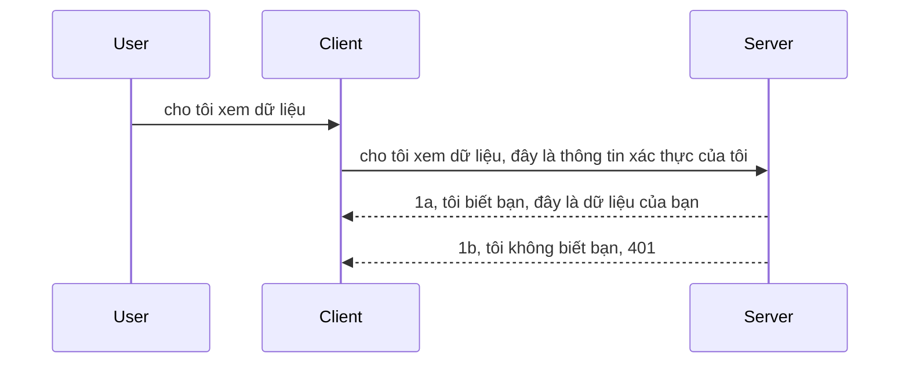

# Xác thực đơn giản

Các SDK MCP hỗ trợ việc sử dụng OAuth 2.1, một quá trình khá phức tạp bao gồm các khái niệm như máy chủ xác thực, máy chủ tài nguyên, gửi thông tin xác thực, lấy mã rồi đổi mã lấy token bearer cho đến khi bạn cuối cùng có thể lấy dữ liệu tài nguyên của mình. Nếu bạn chưa quen với OAuth, việc triển khai nó là điều tuyệt vời, nhưng tốt nhất nên bắt đầu với một mức độ xác thực cơ bản và dần xây dựng lên bảo mật tốt hơn. Đó là lý do chương này tồn tại, để giúp bạn tiến tới xác thực nâng cao hơn.

## Xác thực, chúng ta nói gì?

Xác thực là viết tắt của authentication và authorization. Ý tưởng là chúng ta cần làm hai việc:

- **Authentication** (xác thực), là quá trình xác định xem chúng ta có cho phép một người vào nhà mình không, tức họ có quyền “ở đây” hay không, tức là có quyền truy cập vào máy chủ tài nguyên nơi các tính năng MCP Server của chúng ta sống.
- **Authorization** (ủy quyền), là quá trình kiểm tra xem người dùng có nên được truy cập vào các tài nguyên cụ thể mà họ yêu cầu hay không, ví dụ như các đơn hàng này hoặc các sản phẩm này, hoặc liệu họ có được phép đọc nội dung nhưng không được phép xóa làm ví dụ khác.

## Thông tin xác thực: cách chúng ta cho biết hệ thống chúng ta là ai

Hầu hết các nhà phát triển web thường nghĩ đến việc cung cấp một thông tin xác thực cho máy chủ, thường là một bí mật cho biết họ có được phép ở đây hay không “Xác thực”. Thông tin xác thực này thường là phiên bản mã hóa base64 của tên người dùng và mật khẩu hoặc một khóa API xác định duy nhất một người dùng cụ thể.

Điều này liên quan đến việc gửi nó qua một header gọi là "Authorization" như sau:

```json
{ "Authorization": "secret123" }
```

Đây thường được gọi là xác thực cơ bản. Cách thức luồng tổng thể hoạt động như sau:


```mermaid
sequenceDiagram
   participant User
   participant Client
   participant Server

   User->>Client: cho tôi xem dữ liệu
   Client->>Server: cho tôi xem dữ liệu, đây là thông tin xác thực của tôi
   Server-->>Client: 1a, tôi biết bạn, đây là dữ liệu của bạn
   Server-->>Client: 1b, tôi không biết bạn, 401 
```

Bây giờ chúng ta đã hiểu cách thức hoạt động từ góc độ luồng, làm thế nào để triển khai nó? Hầu hết máy chủ web đều có khái niệm middleware, một đoạn mã chạy như một phần của yêu cầu có thể xác minh thông tin xác thực, và nếu thông tin xác thực hợp lệ thì cho phép yêu cầu đi qua. Nếu yêu cầu không có thông tin xác thực hợp lệ thì sẽ nhận được lỗi xác thực. Hãy xem cách triển khai điều này:

**Python**

```python
class AuthMiddleware(BaseHTTPMiddleware):
    async def dispatch(self, request, call_next):

        has_header = request.headers.get("Authorization")
        if not has_header:
            print("-> Missing Authorization header!")
            return Response(status_code=401, content="Unauthorized")

        if not valid_token(has_header):
            print("-> Invalid token!")
            return Response(status_code=403, content="Forbidden")

        print("Valid token, proceeding...")
       
        response = await call_next(request)
        # thêm bất kỳ tiêu đề khách hàng nào hoặc thay đổi phản hồi theo một cách nào đó
        return response


starlette_app.add_middleware(CustomHeaderMiddleware)
```

Ở đây chúng ta có:

- Tạo một middleware gọi là `AuthMiddleware` với phương thức `dispatch` được máy chủ web gọi.
- Thêm middleware vào máy chủ web:

    ```python
    starlette_app.add_middleware(AuthMiddleware)
    ```

- Viết logic kiểm tra nếu header Authorization có mặt và nếu bí mật gửi đến hợp lệ:

    ```python
    has_header = request.headers.get("Authorization")
    if not has_header:
        print("-> Missing Authorization header!")
        return Response(status_code=401, content="Unauthorized")

    if not valid_token(has_header):
        print("-> Invalid token!")
        return Response(status_code=403, content="Forbidden")
    ```

    nếu bí mật có mặt và hợp lệ thì cho phép yêu cầu đi qua bằng cách gọi `call_next` và trả về phản hồi.

    ```python
    response = await call_next(request)
    # thêm bất kỳ tiêu đề khách hàng nào hoặc thay đổi phản hồi theo một cách nào đó
    return response
    ```

Cách thức hoạt động là nếu có một yêu cầu web gửi tới máy chủ thì middleware sẽ được gọi và dựa trên cách triển khai, nó sẽ hoặc cho phép yêu cầu đi qua hoặc trả về lỗi cho biết client không được phép tiếp tục.

**TypeScript**

Ở đây chúng ta tạo middleware với framework phổ biến Express và chặn yêu cầu trước khi nó tới MCP Server. Đây là đoạn mã:

```typescript
function isValid(secret) {
    return secret === "secret123";
}

app.use((req, res, next) => {
    // 1. Có tiêu đề ủy quyền không?
    if(!req.headers["Authorization"]) {
        res.status(401).send('Unauthorized');
    }
    
    let token = req.headers["Authorization"];

    // 2. Kiểm tra tính hợp lệ.
    if(!isValid(token)) {
        res.status(403).send('Forbidden');
    }

   
    console.log('Middleware executed');
    // 3. Chuyển tiếp yêu cầu đến bước tiếp theo trong quy trình xử lý yêu cầu.
    next();
});
```

Trong đoạn mã này chúng ta:

1. Kiểm tra xem header Authorization có mặt hay không, nếu không thì gửi lỗi 401.
2. Đảm bảo thông tin xác thực/token hợp lệ, nếu không thì gửi lỗi 403.
3. Cuối cùng cho phép yêu cầu tiếp tục trong pipeline và trả về tài nguyên được yêu cầu.

## Bài tập: Triển khai xác thực

Hãy lấy kiến thức và thử triển khai nó. Kế hoạch như sau:

Máy chủ

- Tạo một máy chủ web và một instance MCP.
- Triển khai middleware cho máy chủ.

Client

- Gửi yêu cầu web, với thông tin xác thực, qua header.

### -1- Tạo máy chủ web và instance MCP

> [!WARNING]
> Ví dụ TypeScript dưới đây nhắm đến MCP `2025-11-25`. Nó theo dõi các kết nối
> theo `mcp-session-id` và không phải là mô hình kết nối vận chuyển hiện tại `2026-07-28`. MCP
> `2026-07-28` bỏ qua bước bắt tay `initialize` và ID phiên giao thức; các triển khai mới
> sử dụng các yêu cầu tự chứa. Xem thêm
> [Điều gì đã thay đổi trong MCP: Đặc tả 2026-07-28](../../01-CoreConcepts/mcp-2026-07-28.md).

Trong bước đầu tiên, chúng ta cần tạo instance máy chủ web và MCP Server.

**Python**

Ở đây chúng ta tạo một MCP server instance, tạo ứng dụng web starlette và host nó bằng uvicorn.

```python
# tạo MCP Server

app = FastMCP(
    name="MCP Resource Server",
    instructions="Resource Server that validates tokens via Authorization Server introspection",
    host=settings["host"],
    port=settings["port"],
    debug=True
)

# tạo ứng dụng web starlette
starlette_app = app.streamable_http_app()

# phục vụ ứng dụng qua uvicorn
async def run(starlette_app):
    import uvicorn
    config = uvicorn.Config(
            starlette_app,
            host=app.settings.host,
            port=app.settings.port,
            log_level=app.settings.log_level.lower(),
        )
    server = uvicorn.Server(config)
    await server.serve()

run(starlette_app)
```

Trong đoạn mã này chúng ta:

- Tạo MCP Server.
- Tạo ứng dụng web starlette từ MCP Server, `app.streamable_http_app()`.
- Host và phục vụ ứng dụng web bằng uvicorn `server.serve()`.

**TypeScript**

Ở đây chúng ta tạo một instance MCP Server.

```typescript
const server = new McpServer({
      name: "example-server",
      version: "1.0.0"
    });

    // ... thiết lập tài nguyên máy chủ, công cụ và gợi ý ...
```

Việc tạo MCP Server này cần diễn ra trong định nghĩa route POST /mcp, vậy hãy lấy đoạn mã trên và chuyển như sau:

```typescript
import express from "express";
import { randomUUID } from "node:crypto";
import { McpServer } from "@modelcontextprotocol/sdk/server/mcp.js";
import { StreamableHTTPServerTransport } from "@modelcontextprotocol/sdk/server/streamableHttp.js";
import { isInitializeRequest } from "@modelcontextprotocol/sdk/types.js"

const app = express();
app.use(express.json());

// Bản đồ để lưu trữ các phương tiện theo ID phiên
const transports: { [sessionId: string]: StreamableHTTPServerTransport } = {};

// Xử lý các yêu cầu POST cho giao tiếp từ client đến server
app.post('/mcp', async (req, res) => {
  // Kiểm tra ID phiên đã tồn tại
  const sessionId = req.headers['mcp-session-id'] as string | undefined;
  let transport: StreamableHTTPServerTransport;

  if (sessionId && transports[sessionId]) {
    // Tái sử dụng phương tiện hiện có
    transport = transports[sessionId];
  } else if (!sessionId && isInitializeRequest(req.body)) {
    // Yêu cầu khởi tạo mới
    transport = new StreamableHTTPServerTransport({
      sessionIdGenerator: () => randomUUID(),
      onsessioninitialized: (sessionId) => {
        // Lưu trữ phương tiện theo ID phiên
        transports[sessionId] = transport;
      },
      // Bảo vệ DNS rebinding mặc định bị tắt để tương thích ngược. Nếu bạn đang chạy server này
      // cục bộ, hãy đảm bảo đặt:
      // enableDnsRebindingProtection: true,
      // allowedHosts: ['127.0.0.1'],
    });

    // Dọn dẹp phương tiện khi bị đóng
    transport.onclose = () => {
      if (transport.sessionId) {
        delete transports[transport.sessionId];
      }
    };
    const server = new McpServer({
      name: "example-server",
      version: "1.0.0"
    });

    // ... thiết lập tài nguyên, công cụ và lệnh nhắc cho server ...

    // Kết nối đến server MCP
    await server.connect(transport);
  } else {
    // Yêu cầu không hợp lệ
    res.status(400).json({
      jsonrpc: '2.0',
      error: {
        code: -32000,
        message: 'Bad Request: No valid session ID provided',
      },
      id: null,
    });
    return;
  }

  // Xử lý yêu cầu
  await transport.handleRequest(req, res, req.body);
});

// Bộ xử lý có thể tái sử dụng cho các yêu cầu GET và DELETE
const handleSessionRequest = async (req: express.Request, res: express.Response) => {
  const sessionId = req.headers['mcp-session-id'] as string | undefined;
  if (!sessionId || !transports[sessionId]) {
    res.status(400).send('Invalid or missing session ID');
    return;
  }
  
  const transport = transports[sessionId];
  await transport.handleRequest(req, res);
};

// Xử lý yêu cầu GET để nhận thông báo từ server đến client qua SSE
app.get('/mcp', handleSessionRequest);

// Xử lý yêu cầu DELETE để kết thúc phiên làm việc
app.delete('/mcp', handleSessionRequest);

app.listen(3000);
```

Bây giờ bạn thấy cách tạo MCP Server được chuyển vào bên trong `app.post("/mcp")`.

Hãy chuyển sang bước tiếp theo là tạo middleware để xác thực thông tin xác thực đến.

### -2- Triển khai middleware cho máy chủ

Tiếp theo chúng ta sẽ tới phần middleware. Ở đây ta sẽ tạo một middleware tìm kiếm thông tin xác thực trong header `Authorization` và xác thực nó. Nếu chấp nhận được thì yêu cầu sẽ tiếp tục thực hiện chức năng được yêu cầu (ví dụ liệt kê công cụ, đọc tài nguyên hoặc bất kỳ tính năng MCP nào client yêu cầu).

**Python**

Để tạo middleware, ta cần tạo một class kế thừa từ `BaseHTTPMiddleware`. Có hai phần đáng chú ý:

- Yêu cầu `request`, từ đó ta đọc thông tin header.
- `call_next` là callback cần gọi nếu client mang theo thông tin xác thực mà ta chấp nhận.

Đầu tiên, ta cần xử lý trường hợp header `Authorization` bị thiếu:

```python
has_header = request.headers.get("Authorization")

# không có tiêu đề, lỗi với 401, nếu không tiếp tục.
if not has_header:
    print("-> Missing Authorization header!")
    return Response(status_code=401, content="Unauthorized")
```

Ở đây chúng ta gửi thông báo 401 unauthorized vì client không xác thực được.

Tiếp theo, nếu có thông tin xác thực gửi lên, ta cần kiểm tra tính hợp lệ như sau:

```python
 if not valid_token(has_header):
    print("-> Invalid token!")
    return Response(status_code=403, content="Forbidden")
```

Lưu ý cách gửi thông báo 403 forbidden ở trên. Dưới đây là toàn bộ middleware triển khai mọi thứ chúng ta đã đề cập:

```python
class AuthMiddleware(BaseHTTPMiddleware):
    async def dispatch(self, request, call_next):

        has_header = request.headers.get("Authorization")
        if not has_header:
            print("-> Missing Authorization header!")
            return Response(status_code=401, content="Unauthorized")

        if not valid_token(has_header):
            print("-> Invalid token!")
            return Response(status_code=403, content="Forbidden")

        print("Valid token, proceeding...")
        print(f"-> Received {request.method} {request.url}")
        response = await call_next(request)
        response.headers['Custom'] = 'Example'
        return response

```

Tuyệt, nhưng còn hàm `valid_token` thì sao? Đây là hàm dưới đây:

```python
# KHÔNG sử dụng cho sản xuất - cải thiện nó !!
def valid_token(token: str) -> bool:
    # loại bỏ tiền tố "Bearer "
    if token.startswith("Bearer "):
        token = token[7:]
        return token == "secret-token"
    return False
```

Điều này tất nhiên cần cải thiện hơn nữa.

IMPORTANT: Bạn KHÔNG BAO GIỜ nên để các bí mật như thế này trong mã nguồn. Nên lấy giá trị để so sánh từ một nguồn dữ liệu hoặc từ nhà cung cấp dịch vụ định danh (IDP) hoặc tốt nhất là để IDP thực hiện việc xác thực.

**TypeScript**

Để triển khai điều này với Express, cần gọi phương thức `use` nhận các middleware function.

Cần:

- Tương tác với biến request để kiểm tra thông tin xác thực truyền trong thuộc tính `Authorization`.
- Xác thực thông tin xác thực, nếu được thì cho phép yêu cầu tiếp tục và yêu cầu MCP của client thực hiện chức năng mong muốn (ví dụ liệt kê công cụ, đọc tài nguyên hoặc mọi gì liên quan MCP).

Ở đây, ta kiểm tra xem header `Authorization` có mặt không, nếu không thì ngăn yêu cầu đi tiếp:

```typescript
if(!req.headers["authorization"]) {
    res.status(401).send('Unauthorized');
    return;
}
```

Nếu header không được gửi từ đầu, bạn sẽ nhận được lỗi 401.

Tiếp theo ta kiểm tra tính hợp lệ của thông tin xác thực, nếu không hợp lệ lại ngăn yêu cầu với thông báo khác:

```typescript
if(!isValid(token)) {
    res.status(403).send('Forbidden');
    return;
} 
```

Lưu ý bạn sẽ nhận được lỗi 403.

Đây là đoạn mã đầy đủ:

```typescript
app.use((req, res, next) => {
    console.log('Request received:', req.method, req.url, req.headers);
    console.log('Headers:', req.headers["authorization"]);
    if(!req.headers["authorization"]) {
        res.status(401).send('Unauthorized');
        return;
    }
    
    let token = req.headers["authorization"];

    if(!isValid(token)) {
        res.status(403).send('Forbidden');
        return;
    }  

    console.log('Middleware executed');
    next();
});
```

Chúng ta đã thiết lập máy chủ web để chấp nhận middleware kiểm tra thông tin xác thực mà client gửi. Còn phía client thì sao?

### -3- Gửi yêu cầu web với thông tin xác thực qua header

Cần đảm bảo client truyền thông tin xác thực qua header. Vì sẽ sử dụng client MCP nên cần biết làm thế nào để làm điều đó.

**Python**

Với client, ta cần truyền một header với thông tin xác thực như sau:

```python
# ĐỪNG mã hóa cứng giá trị, ít nhất hãy để nó trong biến môi trường hoặc một nơi lưu trữ an toàn hơn
token = "secret-token"

async with streamablehttp_client(
        url = f"http://localhost:{port}/mcp",
        headers = {"Authorization": f"Bearer {token}"}
    ) as (
        read_stream,
        write_stream,
        session_callback,
    ):
        async with ClientSession(
            read_stream,
            write_stream
        ) as session:
            await session.initialize()
      
            # TODO, bạn muốn làm gì trên client, ví dụ liệt kê công cụ, gọi công cụ, v.v.
```

Lưu ý cách ta gán thuộc tính `headers` như ` headers = {"Authorization": f"Bearer {token}"}`.

**TypeScript**

Ta có thể làm điều này qua hai bước:

1. Gán một đối tượng cấu hình chứa thông tin xác thực.
2. Truyền đối tượng cấu hình đó cho transport.

```typescript

// ĐỪNG mã hóa cứng giá trị như được hiển thị ở đây. Ít nhất hãy để nó là một biến môi trường và sử dụng thứ gì đó như dotenv (trong chế độ phát triển).
let token = "secret123"

// định nghĩa một đối tượng tùy chọn giao thức khách hàng
let options: StreamableHTTPClientTransportOptions = {
  sessionId: sessionId,
  requestInit: {
    headers: {
      "Authorization": "secret123"
    }
  }
};

// truyền đối tượng tùy chọn vào giao thức
async function main() {
   const transport = new StreamableHTTPClientTransport(
      new URL(serverUrl),
      options
   );
```

Ở trên bạn thấy ta tạo đối tượng `options` và đặt headers vào thuộc tính `requestInit`.

IMPORTANT: Làm thế nào để cải thiện từ đây? Thực tế là cách triển khai hiện tại có vấn đề. Trước hết, truyền thông tin xác thực thế này khá rủi ro trừ khi bạn có HTTPS tối thiểu. Dù vậy thông tin xác thực vẫn có thể bị đánh cắp nên bạn cần hệ thống để thu hồi token dễ dàng và thêm nhiều kiểm tra như token đang được dùng từ đâu trên thế giới, yêu cầu có quá thường xuyên (hành vi kiểu bot) hay không, tóm lại có nhiều mối lo khác.

Cần nói thêm rằng với API rất đơn giản, nơi bạn không muốn ai gọi API của bạn mà không xác thực, thì những gì có ở đây đã là khởi đầu tốt.

Với điều đó, hãy cùng cố gắng tăng cường bảo mật bằng cách sử dụng định dạng chuẩn như JSON Web Token, còn gọi là JWT hoặc token "JOT".

## JSON Web Tokens, JWT

Vậy, ta đang cố gắng cải thiện từ cách gửi thông tin xác thực rất đơn giản. Lợi ích ngay lập tức khi sử dụng JWT là gì?

- **Cải thiện bảo mật**. Trong xác thực cơ bản, bạn gửi tên người dùng và mật khẩu mã hóa base64 (hoặc khóa API) liên tục làm tăng rủi ro. Với JWT, bạn gửi tên người dùng và mật khẩu để lấy token, token này có giới hạn thời gian hết hạn. JWT cho phép kiểm soát truy cập rất chi tiết qua vai trò, phạm vi và quyền hạn.
- **Không trạng thái và khả năng mở rộng**. JWT là tự chứa, mang toàn bộ thông tin người dùng và loại bỏ nhu cầu lưu trữ phiên phía máy chủ. Token có thể được xác thực tại chỗ.
- **Tương tác và liên kết hệ thống**. JWT là trung tâm của Open ID Connect và được sử dụng với các IDP nổi tiếng như Entra ID, Google Identity và Auth0. JWT cũng cho phép đăng nhập một lần và nhiều hơn nữa, phù hợp cho doanh nghiệp.
- **Tính mô-đun và linh hoạt**. JWT cũng dùng được với API Gateway như Azure API Management, NGINX và hơn thế. Nó hỗ trợ kịch bản xác thực người dùng và giao tiếp server-to-service bao gồm mạo danh và ủy quyền.
- **Hiệu năng và bộ nhớ đệm**. JWT có thể được lưu đệm sau khi giải mã giúp giảm cần phân tích lại. Giúp đặc biệt với ứng dụng nhiều lưu lượng vì tăng thông lượng và giảm tải cho hạ tầng.
- **Tính năng nâng cao**. Nó còn hỗ trợ introspection (kiểm tra hợp lệ trên server) và revocation (thu hồi token).

Với tất cả lợi ích đó, hãy xem cách ta có thể nâng cấp việc triển khai.

## Biến xác thực cơ bản thành JWT

Những thay đổi ở cấp độ tổng quát ta cần thực hiện là:

- **Học cách tạo token JWT** và sẵn sàng gửi nó từ client lên server.
- **Xác thực token JWT**, nếu hợp lệ thì cho client truy cập tài nguyên.
- **Lưu trữ token an toàn**. Cách ta lưu trữ token này.
- **Bảo vệ các route**. Ta cần bảo vệ các đường dẫn, với trường hợp ta bảo vệ các route và tính năng MCP cụ thể.
- **Thêm refresh token**. Đảm bảo tạo token có thời hạn ngắn và refresh token có thời gian dài hơn dùng để lấy token mới khi token hết hạn. Cần có điểm cuối refresh và chiến lược luân phiên token.

### -1- Tạo token JWT

Trước hết, token JWT có các phần sau:

- **header**, thuật toán và kiểu token.
- **payload**, các claims, ví dụ sub (người dùng hay thực thể đại diện token, trong xác thực thường là userid), exp (thời gian hết hạn), role (vai trò)
- **signature**, được ký bằng bí mật hoặc khóa riêng.

Để làm điều này ta cần tạo header, payload và token mã hóa.

**Python**

```python

import jwt
import jwt
from jwt.exceptions import ExpiredSignatureError, InvalidTokenError
import datetime

# Khóa bí mật dùng để ký JWT
secret_key = 'your-secret-key'

header = {
    "alg": "HS256",
    "typ": "JWT"
}

# thông tin người dùng và các tuyên bố cùng thời gian hết hạn
payload = {
    "sub": "1234567890",               # Chủ đề (ID người dùng)
    "name": "User Userson",                # Tuyên bố tùy chỉnh
    "admin": True,                     # Tuyên bố tùy chỉnh
    "iat": datetime.datetime.utcnow(),# Thời gian phát hành
    "exp": datetime.datetime.utcnow() + datetime.timedelta(hours=1)  # Thời gian hết hạn
}

# mã hóa nó
encoded_jwt = jwt.encode(payload, secret_key, algorithm="HS256", headers=header)
```

Trong đoạn mã trên ta:

- Định nghĩa header dùng thuật toán HS256 và kiểu là JWT.
- Tạo payload chứa subject hoặc user id, tên người dùng, vai trò, thời điểm phát hành và thời điểm hết hạn, thể hiện tính giới hạn thời gian đã nói.

**TypeScript**

Ở đây ta cần một số thư viện hỗ trợ tạo token JWT.

Thư viện phụ thuộc

```sh

npm install jsonwebtoken
npm install --save-dev @types/jsonwebtoken
```

Bây giờ ta đã có thư viện, hãy tạo header, payload và qua đó tạo token mã hóa.

```typescript
import jwt from 'jsonwebtoken';

const secretKey = 'your-secret-key'; // Sử dụng biến môi trường trong môi trường sản xuất

// Định nghĩa dữ liệu gửi đi
const payload = {
  sub: '1234567890',
  name: 'User usersson',
  admin: true,
  iat: Math.floor(Date.now() / 1000), // Thời điểm phát hành
  exp: Math.floor(Date.now() / 1000) + 60 * 60 // Hết hạn trong 1 giờ
};

// Định nghĩa tiêu đề (tùy chọn, jsonwebtoken đặt mặc định)
const header = {
  alg: 'HS256',
  typ: 'JWT'
};

// Tạo token
const token = jwt.sign(payload, secretKey, {
  algorithm: 'HS256',
  header: header
});

console.log('JWT:', token);
```

Token này:

Ký bằng HS256
Hợp lệ trong 1 giờ
Bao gồm các claims như sub, name, admin, iat, và exp.

### -2- Xác thực token

Ta cũng cần xác thực token, việc này nên làm trên server để đảm bảo client gửi cho ta token đúng. Cần làm nhiều kiểm tra từ cấu trúc tới tính hợp lệ. Bạn cũng nên thêm kiểm tra xem user có trong hệ thống bạn không và hơn thế nữa.

Để xác thực token, ta cần giải mã nó để đọc và bắt đầu kiểm tra tính hợp lệ:

**Python**

```python

# Giải mã và xác minh JWT
try:
    decoded = jwt.decode(token, secret_key, algorithms=["HS256"])
    print("✅ Token is valid.")
    print("Decoded claims:")
    for key, value in decoded.items():
        print(f"  {key}: {value}")
except ExpiredSignatureError:
    print("❌ Token has expired.")
except InvalidTokenError as e:
    print(f"❌ Invalid token: {e}")

```


Trong đoạn mã này, chúng ta gọi `jwt.decode` sử dụng token, khóa bí mật và thuật toán đã chọn làm đầu vào. Lưu ý cách chúng ta sử dụng cấu trúc try-catch vì việc xác thực thất bại dẫn đến lỗi được đưa ra.

**TypeScript**

Ở đây chúng ta cần gọi `jwt.verify` để lấy phiên bản token đã giải mã mà chúng ta có thể phân tích thêm. Nếu cuộc gọi này thất bại, điều đó có nghĩa là cấu trúc của token không đúng hoặc nó không còn hợp lệ nữa.

```typescript

try {
  const decoded = jwt.verify(token, secretKey);
  console.log('Decoded Payload:', decoded);
} catch (err) {
  console.error('Token verification failed:', err);
}
```

LƯU Ý: như đã đề cập trước đó, chúng ta nên thực hiện các kiểm tra bổ sung để đảm bảo token này trỏ tới một người dùng trong hệ thống của chúng ta và đảm bảo người dùng đó có các quyền mà nó tuyên bố.

Tiếp theo, hãy xem xét kiểm soát truy cập dựa trên vai trò, còn gọi là RBAC.

## Thêm kiểm soát truy cập dựa trên vai trò

Ý tưởng là chúng ta muốn biểu thị rằng các vai trò khác nhau có các quyền khác nhau. Ví dụ, chúng ta giả định một admin có thể làm mọi việc và một người dùng bình thường có thể đọc/ghi còn một khách chỉ có thể đọc. Do đó, đây là một số cấp quyền có thể có:

- Admin.Write 
- User.Read
- Guest.Read

Hãy xem cách chúng ta có thể triển khai kiểm soát như vậy với middleware. Middleware có thể được thêm cho từng route cũng như cho tất cả các route.

**Python**

```python
from starlette.middleware.base import BaseHTTPMiddleware
from starlette.responses import JSONResponse
import jwt

# KHÔNG nên để bí mật trong code như thế này, đây chỉ là để minh họa. Hãy đọc nó từ nơi an toàn.
SECRET_KEY = "your-secret-key" # đặt cái này vào biến môi trường
REQUIRED_PERMISSION = "User.Read"

class JWTPermissionMiddleware(BaseHTTPMiddleware):
    async def dispatch(self, request, call_next):
        auth_header = request.headers.get("Authorization")
        if not auth_header or not auth_header.startswith("Bearer "):
            return JSONResponse({"error": "Missing or invalid Authorization header"}, status_code=401)

        token = auth_header.split(" ")[1]
        try:
            decoded = jwt.decode(token, SECRET_KEY, algorithms=["HS256"])
        except jwt.ExpiredSignatureError:
            return JSONResponse({"error": "Token expired"}, status_code=401)
        except jwt.InvalidTokenError:
            return JSONResponse({"error": "Invalid token"}, status_code=401)

        permissions = decoded.get("permissions", [])
        if REQUIRED_PERMISSION not in permissions:
            return JSONResponse({"error": "Permission denied"}, status_code=403)

        request.state.user = decoded
        return await call_next(request)


```

Có một vài cách khác nhau để thêm middleware như dưới đây:

```python

# Lựa chọn 1: thêm middleware trong khi xây dựng ứng dụng starlette
middleware = [
    Middleware(JWTPermissionMiddleware)
]

app = Starlette(routes=routes, middleware=middleware)

# Lựa chọn 2: thêm middleware sau khi ứng dụng starlette đã được xây dựng
starlette_app.add_middleware(JWTPermissionMiddleware)

# Lựa chọn 3: thêm middleware cho từng tuyến đường
routes = [
    Route(
        "/mcp",
        endpoint=..., # trình xử lý
        middleware=[Middleware(JWTPermissionMiddleware)]
    )
]
```

**TypeScript**

Chúng ta có thể sử dụng `app.use` và một middleware sẽ chạy cho tất cả các yêu cầu.

```typescript
app.use((req, res, next) => {
    console.log('Request received:', req.method, req.url, req.headers);
    console.log('Headers:', req.headers["authorization"]);

    // 1. Kiểm tra xem tiêu đề ủy quyền đã được gửi chưa

    if(!req.headers["authorization"]) {
        res.status(401).send('Unauthorized');
        return;
    }
    
    let token = req.headers["authorization"];

    // 2. Kiểm tra xem token có hợp lệ không
    if(!isValid(token)) {
        res.status(403).send('Forbidden');
        return;
    }  

    // 3. Kiểm tra xem người dùng token có tồn tại trong hệ thống của chúng tôi không
    if(!isExistingUser(token)) {
        res.status(403).send('Forbidden');
        console.log("User does not exist");
        return;
    }
    console.log("User exists");

    // 4. Xác minh token có quyền thích hợp không
    if(!hasScopes(token, ["User.Read"])){
        res.status(403).send('Forbidden - insufficient scopes');
    }

    console.log("User has required scopes");

    console.log('Middleware executed');
    next();
});

```

Có khá nhiều điều chúng ta có thể cho middleware thực hiện và middleware NÊN làm, cụ thể:

1. Kiểm tra xem header authorization có tồn tại không
2. Kiểm tra xem token có hợp lệ không, chúng ta gọi `isValid` là một phương thức mà chúng ta viết để kiểm tra tính toàn vẹn và hợp lệ của token JWT.
3. Xác minh người dùng có tồn tại trong hệ thống của chúng ta không, chúng ta nên kiểm tra điều này.

   ```typescript
    // người dùng trong cơ sở dữ liệu
   const users = [
     "user1",
     "User usersson",
   ]

   function isExistingUser(token) {
     let decodedToken = verifyToken(token);

     // CẦN LÀM, kiểm tra xem người dùng có tồn tại trong cơ sở dữ liệu không
     return users.includes(decodedToken?.name || "");
   }
   ```

   Ở trên, chúng ta đã tạo một danh sách `users` rất đơn giản, dĩ nhiên danh sách đó nên nằm trong một cơ sở dữ liệu.

4. Thêm vào đó, chúng ta cũng nên kiểm tra token có quyền phù hợp không.

   ```typescript
   if(!hasScopes(token, ["User.Read"])){
        res.status(403).send('Forbidden - insufficient scopes');
   }
   ```

   Trong đoạn mã ở trên từ middleware, chúng ta kiểm tra rằng token chứa quyền User.Read, nếu không chúng ta gửi lỗi 403. Dưới đây là phương thức trợ giúp `hasScopes`.

   ```typescript
   function hasScopes(scope: string, requiredScopes: string[]) {
     let decodedToken = verifyToken(scope);
    return requiredScopes.every(scope => decodedToken?.scopes.includes(scope));
  }
   ```

Have a think which additional checks you should be doing, but these are the absolute minimum of checks you should be doing.

Using Express as a web framework is a common choice. There are helpers library when you use JWT so you can write less code.

- `express-jwt`, helper library that provides a middleware that helps decode your token.
- `express-jwt-permissions`, this provides a middleware `guard` that helps check if a certain permission is on the token.

Here's what these libraries can look like when used:

```typescript
const express = require('express');
const jwt = require('express-jwt');
const guard = require('express-jwt-permissions')();

const app = express();
const secretKey = 'your-secret-key'; // put this in env variable

// Decode JWT and attach to req.user
app.use(jwt({ secret: secretKey, algorithms: ['HS256'] }));

// Check for User.Read permission
app.use(guard.check('User.Read'));

// multiple permissions
// app.use(guard.check(['User.Read', 'Admin.Access']));

app.get('/protected', (req, res) => {
  res.json({ message: `Welcome ${req.user.name}` });
});

// Error handler
app.use((err, req, res, next) => {
  if (err.code === 'permission_denied') {
    return res.status(403).send('Forbidden');
  }
  next(err);
});

```

Bây giờ bạn đã thấy middleware có thể được sử dụng cho cả xác thực và ủy quyền, còn MCP thì sao, nó có thay đổi cách chúng ta làm auth không? Hãy tìm hiểu trong phần tiếp theo.

### -3- Thêm RBAC vào MCP

Bạn đã thấy cho tới giờ bạn có thể thêm RBAC qua middleware, tuy nhiên với MCP không có cách dễ dàng để thêm RBAC tính năng riêng cho từng MCP, vậy chúng ta làm gì? Chúng ta chỉ cần thêm đoạn mã như thế này để kiểm tra trong trường hợp này liệu client có quyền gọi một công cụ cụ thể không:

Bạn có một số lựa chọn khác nhau để thực hiện RBAC theo tính năng, dưới đây là một số:

- Thêm kiểm tra cho từng công cụ, tài nguyên, prompt nơi bạn cần kiểm tra cấp quyền.

   **python**

   ```python
   @tool()
   def delete_product(id: int):
      try:
          check_permissions(role="Admin.Write", request)
      catch:
        pass # khách hàng không xác thực được, báo lỗi xác thực
   ```

   **typescript**

   ```typescript
   server.registerTool(
    "delete-product",
    {
      title: Delete a product",
      description: "Deletes a product",
      inputSchema: { id: z.number() }
    },
    async ({ id }) => {
      
      try {
        checkPermissions("Admin.Write", request);
        // todo, gửi id đến productService và mục nhập từ xa
      } catch(Exception e) {
        console.log("Authorization error, you're not allowed");  
      }

      return {
        content: [{ type: "text", text: `Deletected product with id ${id}` }]
      };
    }
   );
   ```


- Sử dụng phương pháp máy chủ nâng cao và các trình xử lý yêu cầu để bạn giảm thiểu số nơi cần thực hiện kiểm tra.

   **Python**

   ```python
   
   tool_permission = {
      "create_product": ["User.Write", "Admin.Write"],
      "delete_product": ["Admin.Write"]
   }

   def has_permission(user_permissions, required_permissions) -> bool:
      # user_permissions: danh sách quyền mà người dùng có
      # required_permissions: danh sách quyền cần thiết cho công cụ
      return any(perm in user_permissions for perm in required_permissions)

   @server.call_tool()
   async def handle_call_tool(
     name: str, arguments: dict[str, str] | None
   ) -> list[types.TextContent]:
    # Giả sử request.user.permissions là danh sách các quyền của người dùng
     user_permissions = request.user.permissions
     required_permissions = tool_permission.get(name, [])
     if not has_permission(user_permissions, required_permissions):
        # Ném lỗi "Bạn không có quyền gọi công cụ {name}"
        raise Exception(f"You don't have permission to call tool {name}")
     # tiếp tục và gọi công cụ
     # ...
   ```   
   

   **TypeScript**

   ```typescript
   function hasPermission(userPermissions: string[], requiredPermissions: string[]): boolean {
       if (!Array.isArray(userPermissions) || !Array.isArray(requiredPermissions)) return false;
       // Trả về true nếu người dùng có ít nhất một quyền cần thiết
       
       return requiredPermissions.some(perm => userPermissions.includes(perm));
   }
  
   server.setRequestHandler(CallToolRequestSchema, async (request) => {
      const { params: { name } } = request;
  
      let permissions = request.user.permissions;
  
      if (!hasPermission(permissions, toolPermissions[name])) {
         return new Error(`You don't have permission to call ${name}`);
      }
  
      // tiếp tục..
   });
   ```

   Lưu ý, bạn sẽ cần đảm bảo middleware của mình gán token đã giải mã cho thuộc tính user của yêu cầu để đoạn mã trên được đơn giản.

### Tóm lại

Bây giờ chúng ta đã thảo luận về cách thêm hỗ trợ cho RBAC nói chung và cho MCP nói riêng, đã đến lúc thử tự mình triển khai bảo mật để đảm bảo bạn đã hiểu các khái niệm đã trình bày.

## Bài tập 1: Xây dựng một server mcp và client mcp sử dụng xác thực cơ bản

Ở đây bạn sẽ áp dụng những gì đã học về việc gửi thông tin đăng nhập qua header.

## Giải pháp 1

[Giải pháp 1](./code/basic/README.md)

## Bài tập 2: Nâng cấp giải pháp từ Bài tập 1 để sử dụng JWT

Lấy giải pháp đầu tiên nhưng lần này, hãy cải thiện nó.

Thay vì sử dụng Basic Auth, hãy sử dụng JWT.

## Giải pháp 2

[Giải pháp 2](./solution/jwt-solution/README.md)

## Thử thách

Thêm RBAC cho từng công cụ như chúng ta mô tả trong phần "Thêm RBAC vào MCP".

## Tóm tắt

Hy vọng bạn đã học được rất nhiều trong chương này, từ không có bảo mật gì, đến bảo mật cơ bản, đến JWT và cách nó có thể được thêm vào MCP.

Chúng ta đã xây dựng nền tảng vững chắc với JWT tùy chỉnh, nhưng khi mở rộng quy mô, chúng ta đang hướng tới mô hình nhận dạng dựa trên tiêu chuẩn. Việc áp dụng một IdP như Entra hoặc Keycloak cho phép chúng ta chuyển giao việc phát hành token, kiểm tra và quản lý vòng đời cho một nền tảng tin cậy — giải phóng chúng ta tập trung vào logic ứng dụng và trải nghiệm người dùng.

Vì thế, chúng ta có một [chương nâng cao hơn về Entra](../../05-AdvancedTopics/mcp-security-entra/README.md)

## Tiếp theo là gì

- Tiếp theo: [Cài đặt các máy chủ MCP](../12-mcp-hosts/README.md)

---

<!-- CO-OP TRANSLATOR DISCLAIMER START -->
**Tuyên bố miễn trừ trách nhiệm**:
Tài liệu này đã được dịch bằng dịch vụ dịch thuật AI [Co-op Translator](https://github.com/Azure/co-op-translator). Mặc dù chúng tôi cố gắng đảm bảo độ chính xác, xin lưu ý rằng bản dịch tự động có thể chứa lỗi hoặc sai sót. Tài liệu gốc bằng ngôn ngữ gốc nên được coi là nguồn tin chính thức. Đối với thông tin quan trọng, nên sử dụng dịch vụ dịch thuật chuyên nghiệp bởi con người. Chúng tôi không chịu trách nhiệm về bất kỳ hiểu lầm hoặc giải thích sai nào phát sinh từ việc sử dụng bản dịch này.
<!-- CO-OP TRANSLATOR DISCLAIMER END -->