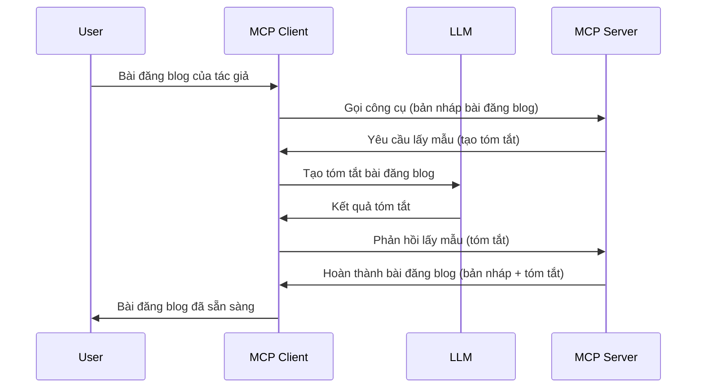

> [!WARNING]
> Sampling bị ngừng hỗ trợ trong MCP `2026-07-28`. Bài học này được giữ lại cho
> các triển khai kế thừa. Các máy chủ mới nên tích hợp trực tiếp với API nhà cung cấp LLM.


> bị loại bỏ trong lần chỉnh sửa đầu tiên được phát hành vào hoặc sau ngày 28
> tháng 7 năm 2027. Các ví dụ trong bài học này có thể sử dụng các API SDK
> thực hiện `2025-11-25`.
> Xem [Có gì thay đổi trong MCP: Đặc tả 2026-07-28](../../01-CoreConcepts/mcp-2026-07-28.md).

Trong các triển khai kế thừa, Sampling cho phép máy chủ MCP yêu cầu trợ giúp từ LLM
được quản lý bởi client. Đối với các triển khai mới, hãy gọi trực tiếp nhà cung cấp LLM đã chọn
thay vào đó.

Hãy khám phá một số trường hợp sử dụng và cách xây dựng giải pháp liên quan đến sampling.

## Tổng quan

Trong bài học này, chúng ta tập trung giải thích khi nào và ở đâu nên sử dụng Sampling cũng như cách cấu hình nó.

## Mục tiêu học tập

Trong chương này, chúng ta sẽ:

- Giải thích Sampling là gì và khi nào sử dụng nó.
- Hướng dẫn cách cấu hình Sampling trong MCP.
- Cung cấp ví dụ về Sampling trong thực tế.

## Sampling là gì và tại sao dùng nó?

Sampling là một tính năng nâng cao hoạt động theo cách sau:



### Yêu cầu Sampling

Ok, bây giờ chúng ta đã có cái nhìn tổng quan về một kịch bản tin cậy, hãy nói về yêu cầu sampling mà máy chủ gửi lại cho client. Đây là cách một yêu cầu như vậy có thể trông như thế nào ở định dạng JSON-RPC:

```json
{
  "jsonrpc": "2.0",
  "id": 1,
  "method": "sampling/createMessage",
  "params": {
    "messages": [
      {
        "role": "user",
        "content": {
          "type": "text",
          "text": "Create a blog post summary of the following blog post: <BLOG POST>"
        }
      }
    ],
    "modelPreferences": {
      "hints": [
        {
          "name": "claude-3-sonnet"
        }
      ],
      "intelligencePriority": 0.8,
      "speedPriority": 0.5
    },
    "systemPrompt": "You are a helpful assistant.",
    "maxTokens": 100
  }
}
```

Có một vài điểm đáng lưu ý:

- Prompt, dưới content -> text, là lời nhắc của chúng ta, đó là một hướng dẫn cho LLM tóm tắt nội dung bài viết trên blog.

- **modelPreferences**. Phần này chỉ là sở thích, một đề xuất về cấu hình nên dùng với LLM. Người dùng có thể chọn theo các đề xuất này hoặc thay đổi chúng. Trong trường hợp này có đề xuất về mô hình, ưu tiên tốc độ và trí thông minh.
- **systemPrompt**, đây là lời nhắc hệ thống thông thường của bạn cung cấp cho LLM cá tính và hướng dẫn thực hiện.
- **maxTokens**, đây là thuộc tính khác được dùng để nói số token khuyến nghị sử dụng cho nhiệm vụ này.

### Phản hồi Sampling

Phản hồi này là thứ Client MCP cuối cùng gửi lại cho MCP Server và là kết quả của việc client gọi LLM, chờ phản hồi rồi tạo thành thông điệp này. Đây là cách nó có thể trông trong JSON-RPC:

```json
{
  "jsonrpc": "2.0",
  "id": 1,
  "result": {
    "role": "assistant",
    "content": {
      "type": "text",
      "text": "Here's your abstract <ABSTRACT>"
    },
    "model": "gpt-5",
    "stopReason": "endTurn"
  }
}
```

Lưu ý cách phản hồi là một bản tóm tắt bài viết trên blog như chúng ta yêu cầu. Cũng lưu ý mô hình `model` được dùng không phải là mô hình ta yêu cầu mà là "gpt-5" thay vì "claude-3-sonnet". Điều này minh họa rằng người dùng có thể thay đổi quyết định về mô hình sử dụng và yêu cầu sampling của bạn chỉ là một đề xuất.

Ok, giờ chúng ta đã hiểu luồng chính, và nhiệm vụ hữu ích để dùng tính năng này là "tạo bài viết blog + tóm tắt", hãy xem chúng ta cần làm gì để nó hoạt động.

### Các loại tin nhắn

Tin nhắn sampling không chỉ giới hạn ở văn bản mà bạn còn có thể gửi ảnh và âm thanh. Đây là cách JSON-RPC khác nhau:

**Văn bản**

```json
{
  "type": "text",
  "text": "The message content"
}
```

**Nội dung hình ảnh**

```json
{
  "type": "image",
  "data": "base64-encoded-image-data",
  "mimeType": "image/jpeg"
}
```

**Nội dung âm thanh**

```json
{
  "type": "audio",
  "data": "base64-encoded-audio-data",
  "mimeType": "audio/wav"
}
```

> NOTE: Để biết tình trạng hiện tại và hướng dẫn di chuyển, xem
> [tài liệu Sampling đã bị ngừng hỗ trợ](https://modelcontextprotocol.io/specification/2026-07-28/client/sampling).

## Cách cấu hình Sampling trong Client

> Lưu ý: nếu bạn chỉ xây dựng máy chủ, bạn không cần làm nhiều ở đây.

Trong client, bạn cần chỉ định tính năng sau như sau:

```json
{
  "capabilities": {
    "sampling": {}
  }
}
```

Sau đó nó sẽ được nhận khi client bạn chọn khởi tạo với máy chủ.

## Ví dụ Sampling trong thực tế - Tạo bài viết blog

Hãy cùng lập trình một máy chủ sampling, chúng ta cần làm những việc sau:

1. Tạo một công cụ trên máy chủ.
1. Công cụ đó phải tạo yêu cầu sampling
1. Công cụ chờ câu trả lời cho yêu cầu sampling từ client.
1. Sau đó tạo ra kết quả công cụ.

Hãy xem mã nguồn từng bước:

### -1- Tạo công cụ

**python**

```python
@mcp.tool()
async def create_blog(title: str, content: str, ctx: Context[ServerSession, None]) -> str:
    """Create a blog post and generate a summary"""

```

### -2- Tạo yêu cầu sampling

Mở rộng công cụ của bạn với đoạn mã sau:

**python**

```python
post = BlogPost(
        id=len(posts) + 1,
        title=title,
        content=content,
        abstract=""
    )

prompt = f"Create an abstract of the following blog post: title: {title} and draft: {content} "

result = await ctx.session.create_message(
        messages=[
            SamplingMessage(
                role="user",
                content=TextContent(type="text", text=prompt),
            )
        ],
        max_tokens=100,
)

```

### -3- Chờ phản hồi và trả lại phản hồi

**python**

```python
post.abstract = result.content.text

posts.append(post)

# trả về sản phẩm hoàn chỉnh
return json.dumps({
    "id": post.title,
    "abstract": post.abstract
})
```

### -4- Mã nguồn đầy đủ

**python**

```python
from starlette.applications import Starlette
from starlette.routing import Mount, Host

from mcp.server.fastmcp import Context, FastMCP

from mcp.server.session import ServerSession
from mcp.types import SamplingMessage, TextContent

import json


from uuid import uuid4
from typing import List
from pydantic import BaseModel


mcp = FastMCP("Blog post generator")

# app = FastAPI()

posts = []

class BlogPost(BaseModel):
    id: int
    title: str
    content: str
    abstract: str

posts: List[BlogPost] = []

@mcp.tool()
async def create_blog(title: str, content: str, ctx: Context[ServerSession, None]) -> str:
    """Create a blog post and generate a summary"""

    post = BlogPost(
        id=len(posts) + 1,
        title=title,
        content=content,
        abstract=""
    )

    prompt = f"Create an abstract of the following blog post: title: {title} and draft: {content} "

    result = await ctx.session.create_message(
        messages=[
            SamplingMessage(
                role="user",
                content=TextContent(type="text", text=prompt),
            )
        ],
        max_tokens=100,
    )

    post.abstract = result.content.text

    posts.append(post)

    # trả về bài viết blog đầy đủ
    return json.dumps({
        "id": post.title,
        "abstract": post.abstract
    })

if __name__ == "__main__":
    print("Starting server...")
    # mcp.run()
    mcp.run(transport="streamable-http")

# chạy app với: python server.py
```

### -5- Kiểm thử trên Visual Studio Code

Để kiểm thử trên Visual Studio Code, làm như sau:

1. Khởi động máy chủ trong terminal
1. Thêm nó vào *mcp.json* (và đảm bảo máy chủ được khởi động), ví dụ như sau:

   ```json
   "servers": {
      "blog-server": {
        "type": "http",
        "url": "http://localhost:8000/mcp"
      }
   }
   ```

1. Gõ một lời nhắc:

   ```text
   create a blog post named "Where Python comes from", the content is "Python is actually named after Monty Python Flying Circus"
   ```

1. Cho phép thực hiện sampling. Lần đầu bạn thử, bạn sẽ được yêu cầu chấp nhận một hộp thoại bổ sung, sau đó bạn sẽ thấy hộp thoại bình thường để yêu cầu chạy công cụ

1. Kiểm tra kết quả. Bạn sẽ thấy kết quả hiển thị đẹp trong GitHub Copilot Chat nhưng bạn cũng có thể xem phản hồi JSON thô.

**Thưởng thêm**. Công cụ Visual Studio Code có hỗ trợ rất tốt cho sampling. Bạn có thể cấu hình quyền truy cập Sampling trên máy chủ đã cài đặt bằng cách thực hiện:

1. Điều hướng đến phần mở rộng.
1. Chọn biểu tượng bánh răng cho máy chủ đã cài trong phần "MCP SERVERS - INSTALLED".
1 Chọn "Configure Model Access", tại đây bạn có thể chọn những mô hình mà GitHub Copilot được phép sử dụng khi thực hiện sampling. Bạn cũng có thể xem tất cả yêu cầu sampling gần đây bằng cách chọn "Show Sampling requests".

## Bài tập

Trong bài tập này, bạn sẽ xây dựng một sampling hơi khác, đó là tích hợp sampling hỗ trợ tạo mô tả sản phẩm. Đây là kịch bản của bạn:

**Kịch bản**: Nhân viên phòng hậu cần của một trang thương mại điện tử cần trợ giúp, việc tạo mô tả sản phẩm mất quá nhiều thời gian. Do đó, bạn phải xây dựng một giải pháp cho phép gọi công cụ "create_product" với các đối số "title" và "keywords" và nó sẽ tạo ra một sản phẩm hoàn chỉnh bao gồm trường "description" được điền bởi LLM của client.

MẸO: sử dụng những gì bạn đã học trước đó để xây dựng máy chủ này và công cụ của nó dùng yêu cầu sampling.

## Giải pháp

[Giải pháp](./solution/README.md)

## Những điểm cần nhớ


Lấy mẫu là một tính năng mạnh mẽ cho phép máy chủ giao nhiệm vụ cho client khi nó cần sự trợ giúp của một mô hình ngôn ngữ lớn (LLM).

## Bước tiếp theo

- [Chương 4 - Triển khai thực tế](../../04-PracticalImplementation/README.md)

---

<!-- CO-OP TRANSLATOR DISCLAIMER START -->
**Tuyên bố miễn trừ trách nhiệm**:
Tài liệu này đã được dịch bằng dịch vụ dịch thuật AI [Co-op Translator](https://github.com/Azure/co-op-translator). Mặc dù chúng tôi cố gắng đảm bảo độ chính xác, xin lưu ý rằng bản dịch tự động có thể chứa lỗi hoặc sai sót. Tài liệu gốc bằng ngôn ngữ gốc nên được coi là nguồn tin chính thức. Đối với thông tin quan trọng, nên sử dụng dịch vụ dịch thuật chuyên nghiệp bởi con người. Chúng tôi không chịu trách nhiệm về bất kỳ hiểu lầm hoặc giải thích sai nào phát sinh từ việc sử dụng bản dịch này.
<!-- CO-OP TRANSLATOR DISCLAIMER END -->