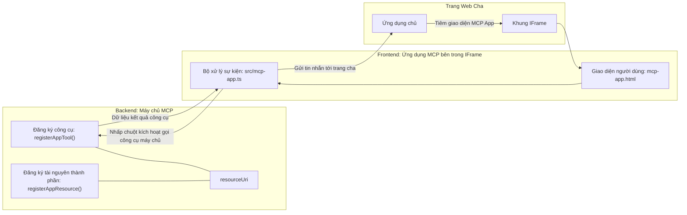
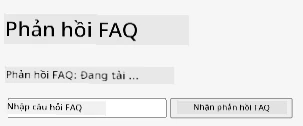
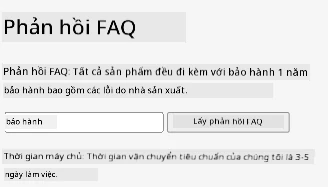
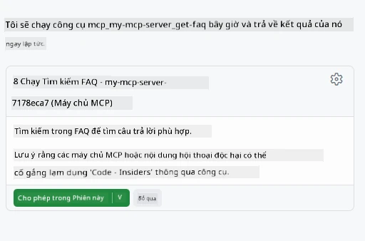
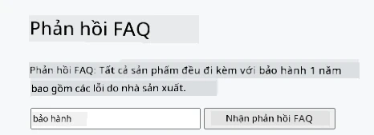

# MCP Apps

MCP Apps là một mô hình mới trong MCP. Ý tưởng là bạn không chỉ trả về dữ liệu từ một công cụ gọi, mà còn cung cấp thông tin về cách mà thông tin này nên được tương tác. Điều đó có nghĩa là kết quả của công cụ bây giờ có thể chứa thông tin giao diện người dùng. Tại sao chúng ta lại muốn điều đó? Hãy xem xét cách bạn làm việc hôm nay. Bạn có thể đang sử dụng kết quả từ một MCP Server bằng cách đặt một kiểu frontend nào đó phía trước nó, đó là mã bạn cần viết và duy trì. Đôi khi đó là điều bạn muốn, nhưng đôi khi sẽ rất tuyệt nếu bạn có thể chỉ mang một đoạn thông tin tự chứa mọi thứ từ dữ liệu đến giao diện người dùng.

## Tổng quan

Bài học này cung cấp hướng dẫn thực tiễn về MCP Apps, cách bắt đầu với nó và cách tích hợp nó vào các Web Apps hiện có của bạn. MCP Apps là một bổ sung rất mới cho Tiêu chuẩn MCP.

## Mục tiêu học tập

Kết thúc bài học này, bạn sẽ có thể:

- Giải thích MCP Apps là gì.
- Khi nào nên sử dụng MCP Apps.
- Xây dựng và tích hợp MCP Apps của riêng bạn.

## MCP Apps - nó hoạt động như thế nào

Ý tưởng với MCP Apps là cung cấp một phản hồi về cơ bản là một thành phần được render. Thành phần đó có thể có cả hình ảnh và tính tương tác, ví dụ nhấn nút, nhập liệu người dùng và nhiều hơn nữa. Hãy bắt đầu với phía server và MCP Server của chúng ta. Để tạo một thành phần MCP App bạn cần tạo một tool lẫn resource ứng dụng. Hai phần này được kết nối bởi một resourceUri.

Dưới đây là một ví dụ. Hãy thử hình dung những gì liên quan và phần nào làm gì:

```text
server.ts -- responsible for registering tools and the component as a UI component
src/
  mcp-app.ts -- wiring up event handlers
mcp-app.html -- the user interface
```

Hình ảnh này mô tả kiến trúc để tạo thành phần và logic của nó.


Hãy thử mô tả trách nhiệm tiếp theo cho backend và frontend tương ứng.

### Phía backend

Có hai việc chúng ta cần hoàn thành ở đây:

- Đăng ký các công cụ mà chúng ta muốn tương tác.
- Định nghĩa thành phần.

**Đăng ký công cụ**

```typescript
registerAppTool(
    server,
    "get-time",
    {
      title: "Get Time",
      description: "Returns the current server time.",
      inputSchema: {},
      _meta: { ui: { resourceUri } }, // Liên kết công cụ này với tài nguyên giao diện người dùng của nó
    },
    async () => {
      const time = new Date().toISOString();
      return { content: [{ type: "text", text: time }] };
    },
  );

```

Mã trước mô tả hành vi, nơi nó tiếp cận một công cụ gọi là `get-time`. Nó không nhận đầu vào nào nhưng cuối cùng tạo ra thời gian hiện tại. Chúng ta có khả năng định nghĩa một `inputSchema` cho các công cụ cần chấp nhận đầu vào từ người dùng.

**Đăng ký thành phần**

Trong cùng một file, ta cũng cần đăng ký thành phần:

```typescript
const resourceUri = "ui://get-time/mcp-app.html";

// Đăng ký tài nguyên, nó trả về HTML/JavaScript đã được đóng gói cho giao diện người dùng.
registerAppResource(
  server,
  resourceUri,
  resourceUri,
  { mimeType: RESOURCE_MIME_TYPE },
  async () => {
    const html = await fs.readFile(path.join(DIST_DIR, "mcp-app.html"), "utf-8");

    return {
    contents: [
        { uri: resourceUri, mimeType: RESOURCE_MIME_TYPE, text: html },
    ],
    };
  },
);
```

Chú ý cách ta đề cập `resourceUri` để kết nối thành phần với các công cụ của nó. Điều thú vị là callback nơi ta tải file UI và trả về thành phần.

### Phía frontend của thành phần

Cũng như backend, có hai phần ở đây:

- Một frontend viết bằng HTML thuần.
- Mã xử lý các sự kiện và những gì cần làm, ví dụ gọi các tool hoặc gửi tin nhắn đến cửa sổ cha.

**Giao diện người dùng**

Hãy xem qua giao diện người dùng.

```html
<!-- mcp-app.html -->
<!DOCTYPE html>
<html lang="en">
  <head>
    <meta charset="UTF-8" />
    <title>Get Time App</title>
  </head>
  <body>
    <p>
      <strong>Server Time:</strong> <code id="server-time">Loading...</code>
    </p>
    <button id="get-time-btn">Get Server Time</button>
    <script type="module" src="/src/mcp-app.ts"></script>
  </body>
</html>
```

**Kết nối sự kiện**

Phần cuối cùng là kết nối sự kiện. Điều đó nghĩa là chúng ta xác định phần nào trong UI cần có bộ xử lý sự kiện và xử lý thế nào khi sự kiện được kích hoạt:

```typescript
// mcp-app.ts

import { App } from "@modelcontextprotocol/ext-apps";

// Lấy tham chiếu phần tử
const serverTimeEl = document.getElementById("server-time")!;
const getTimeBtn = document.getElementById("get-time-btn")!;

// Tạo phiên bản ứng dụng
const app = new App({ name: "Get Time App", version: "1.0.0" });

// Xử lý kết quả công cụ từ máy chủ. Đặt trước `app.connect()` để tránh
// bị thiếu kết quả công cụ ban đầu.
app.ontoolresult = (result) => {
  const time = result.content?.find((c) => c.type === "text")?.text;
  serverTimeEl.textContent = time ?? "[ERROR]";
};

// Liên kết sự kiện nhấp nút
getTimeBtn.addEventListener("click", async () => {
  // `app.callServerTool()` cho phép giao diện người dùng yêu cầu dữ liệu mới từ máy chủ
  const result = await app.callServerTool({ name: "get-time", arguments: {} });
  const time = result.content?.find((c) => c.type === "text")?.text;
  serverTimeEl.textContent = time ?? "[ERROR]";
});

// Kết nối với máy chủ chủ trì
app.connect();
```

Như bạn thấy ở trên, đây là mã thông thường để gán các phần tử DOM với các sự kiện. Đáng chú ý là lời gọi `callServerTool` cuối cùng gọi một tool ở backend.

## Xử lý đầu vào của người dùng

Cho tới giờ, chúng ta đã thấy một thành phần có nút bấm khi nhấn sẽ gọi một tool. Hãy xem liệu chúng ta có thể thêm các phần tử UI khác như trường nhập và gửi đối số tới một tool. Hãy triển khai một chức năng FAQ. Cách nó hoạt động như sau:

- Có một nút và một ô nhập nơi người dùng nhập từ khóa tìm kiếm ví dụ như "Shipping". Điều này sẽ gọi một tool phía backend tìm kiếm trong dữ liệu FAQ.
- Một tool hỗ trợ tìm kiếm FAQ đã nêu.

Hãy thêm hỗ trợ cần thiết ở backend trước:

```typescript
const faq: { [key: string]: string } = {
    "shipping": "Our standard shipping time is 3-5 business days.",
    "return policy": "You can return any item within 30 days of purchase.",
    "warranty": "All products come with a 1-year warranty covering manufacturing defects.",
  }

registerAppTool(
    server,
    "get-faq",
    {
      title: "Search FAQ",
      description: "Searches the FAQ for relevant answers.",
      inputSchema: zod.object({
        query: zod.string().default("shipping"),
      }),
      _meta: { ui: { resourceUri: faqResourceUri } }, // Liên kết công cụ này với tài nguyên giao diện người dùng của nó
    },
    async ({ query }) => {
      const answer: string = faq[query.toLowerCase()] || "Sorry, I don't have an answer for that.";
      return { content: [{ type: "text", text: answer }] };
    },
  );
```

Những gì ta thấy ở đây là cách điền `inputSchema` và cung cấp một schema `zod` như sau:

```typescript
inputSchema: zod.object({
  query: zod.string().default("shipping"),
})
```

Trong schema trên ta khai báo có một tham số input tên là `query` và nó là tùy chọn với giá trị mặc định "shipping".

Ok, tiếp theo ta sang *mcp-app.html* xem ta cần tạo UI gì cho phần này:

```html
<div class="faq">
    <h1>FAQ response</h1>
    <p>FAQ Response: <code id="faq-response">Loading...</code></p>
    <input type="text" id="faq-query" placeholder="Enter FAQ query" />
    <button id="get-faq-btn">Get FAQ Response</button>
  </div>
```

Tuyệt, giờ chúng ta có một phần tử nhập và một nút. Tiếp theo sang *mcp-app.ts* để kết nối các sự kiện này:

```typescript
const getFaqBtn = document.getElementById("get-faq-btn")!;
const faqQueryInput = document.getElementById("faq-query") as HTMLInputElement;

getFaqBtn.addEventListener("click", async () => {
  const query = faqQueryInput.value;
  const result = await app.callServerTool({ name: "get-faq", arguments: { query } });
  const faq = result.content?.find((c) => c.type === "text")?.text;
  faqResponseEl.textContent = faq ?? "[ERROR]";
});
```

Trong đoạn mã trên chúng ta:

- Tạo tham chiếu đến các phần tử UI quan trọng.
- Xử lý sự kiện nút nhấn để phân tích giá trị ô nhập và gọi `app.callServerTool()` với `name` và `arguments` trong đó đối số truyền là `query` với giá trị.

Điều thực sự xảy ra khi bạn gọi `callServerTool` là nó gửi tin nhắn tới cửa sổ cha và cửa sổ đó gọi MCP Server.

### Thử nghiệm

Khi thử nghiệm ta sẽ thấy như sau:



và đây là khi ta thử với đầu vào như "warranty"



Để chạy đoạn mã này, hãy xem phần [Mã nguồn](./code/README.md)

## Kiểm thử trong Visual Studio Code

Visual Studio Code hỗ trợ rất tốt cho MVP Apps và có lẽ là một trong những cách dễ nhất để kiểm thử MCP Apps của bạn. Để dùng Visual Studio Code, thêm một mục server vào *mcp.json* như sau:

```json
"my-mcp-server-7178eca7": {
    "url": "http://localhost:3001/mcp",
    "type": "http"
  }
```

Sau đó khởi động server, bạn có thể giao tiếp với MVP App của mình qua cửa sổ Chat với điều kiện bạn đã cài GitHub Copilot.

Bằng cách kích hoạt qua prompt, ví dụ "#get-faq":



và giống như khi bạn chạy qua trình duyệt web, nó render y hệt như sau:



## Bài tập

Tạo một trò chơi oẳn tù tì. Nó nên gồm các phần sau:

Giao diện:

- danh sách thả xuống với các lựa chọn
- nút để gửi lựa chọn
- nhãn hiển thị ai chọn gì và ai thắng

Server:

- nên có một tool oẳn tù tì nhận "choice" làm đầu vào. Nó cũng nên render lựa chọn của máy tính và xác định người thắng cuộc

## Giải pháp

[Giải pháp](./assignment/README.md)

## Tóm tắt

Chúng ta đã tìm hiểu về mô hình mới MCP Apps. Đây là một mô hình mới cho phép MCP Server có quan điểm không chỉ về dữ liệu mà còn cả cách mà dữ liệu này nên được trình bày.

Thêm vào đó, chúng ta biết rằng các MCP Apps được host trong một IFrame và để giao tiếp với MCP Server chúng cần gửi tin nhắn tới ứng dụng web cha. Có nhiều thư viện cho cả JavaScript thuần và React, v.v., giúp giao tiếp này dễ dàng hơn.

## Những điểm chính cần lưu ý

Đây là những gì bạn học được:

- MCP Apps là một tiêu chuẩn mới hữu ích khi bạn muốn vận chuyển cả dữ liệu và tính năng giao diện người dùng.
- Loại app này chạy trong IFrame vì lý do bảo mật.

## Tiếp theo

- [Chương 4](../../04-PracticalImplementation/README.md)

---

<!-- CO-OP TRANSLATOR DISCLAIMER START -->
**Tuyên bố miễn trừ trách nhiệm**:  
Tài liệu này đã được dịch bằng dịch vụ dịch thuật AI [Co-op Translator](https://github.com/Azure/co-op-translator). Mặc dù chúng tôi cố gắng đảm bảo độ chính xác, xin lưu ý rằng bản dịch tự động có thể chứa lỗi hoặc sự không chính xác. Tài liệu gốc bằng ngôn ngữ gốc của nó nên được xem là nguồn tham khảo chính xác nhất. Đối với thông tin quan trọng, nên sử dụng bản dịch chuyên nghiệp do con người thực hiện. Chúng tôi không chịu trách nhiệm đối với bất kỳ sự hiểu lầm hay giải thích sai nào phát sinh từ việc sử dụng bản dịch này.
<!-- CO-OP TRANSLATOR DISCLAIMER END -->