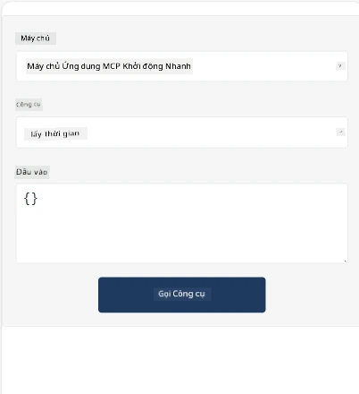
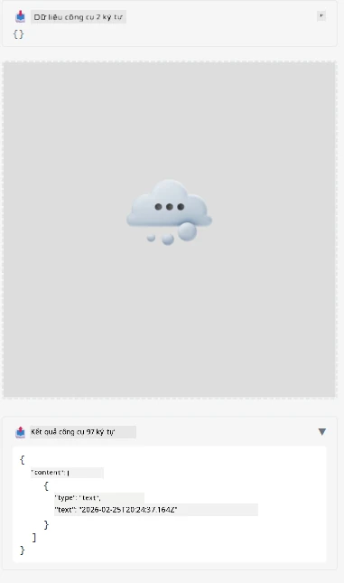

Dưới đây là ví dụ minh họa MCP App

## Cài đặt

1. Điều hướng đến thư mục *mcp-app*
1. Chạy `npm install`, bước này sẽ cài đặt các phụ thuộc frontend và backend

Xác minh backend biên dịch bằng cách chạy:

```sh
npx tsc --noEmit
```

Sẽ không có đầu ra nếu mọi thứ đều ổn.

## Chạy backend

> Việc này sẽ phức tạp hơn một chút nếu bạn đang sử dụng máy Windows vì giải pháp MCP Apps sử dụng thư viện `concurrently` để chạy, bạn cần tìm một thay thế tương ứng. Dưới đây là dòng gây lỗi trong *package.json* của MCP App:

    ```json
    "start": "concurrently \"cross-env NODE_ENV=development INPUT=mcp-app.html vite build --watch\" \"tsx watch main.ts\""
    ```

Ứng dụng này gồm hai phần, phần backend và phần host.

Khởi động backend bằng lệnh:

```sh
npm start
```

Điều này sẽ khởi động backend tại `http://localhost:3001/mcp`.

> Lưu ý, nếu bạn đang ở trong Codespace, bạn có thể cần đặt cổng hiển thị ở chế độ công khai. Kiểm tra xem bạn có thể truy cập endpoint trong trình duyệt qua https://<tên Codespace>.app.github.dev/mcp

## Lựa chọn -1 Kiểm thử ứng dụng trong Visual Studio Code

Để thử nghiệm giải pháp trong Visual Studio Code, làm theo các bước sau:

- Thêm một mục máy chủ vào `mcp.json` như sau:

    ```json
    {
        "servers": {
            "my-mcp-server-7178eca7": {
                "url": "http://localhost:3001/mcp",
                "type": "http"
            }
        },
        "inputs": []
    }
    ```

1. Nhấn nút "start" trong *mcp.json*
1. Đảm bảo cửa sổ chat đang mở và gõ `get-faq`, bạn sẽ thấy kết quả như sau:

    

## Lựa chọn -2- Kiểm thử ứng dụng với một host

Kho lưu trữ <https://github.com/modelcontextprotocol/ext-apps> chứa nhiều host khác nhau mà bạn có thể dùng để thử nghiệm MVP Apps của mình.

Chúng tôi sẽ cung cấp cho bạn hai lựa chọn dưới đây:

### Máy tính cá nhân

- Điều hướng đến *ext-apps* sau khi bạn đã clone repo.

- Cài đặt các phụ thuộc

   ```sh
   npm install
   ```

- Mở một cửa sổ terminal riêng, điều hướng tới *ext-apps/examples/basic-host*

    > Nếu bạn dùng Codespace, bạn cần mở serve.ts dòng 27 và thay thế http://localhost:3001/mcp bằng URL Codespace của backend, ví dụ https://psychic-xylophone-657rpjgvxpc5g64-3001.app.github.dev/mcp

- Chạy host:

    ```sh
    npm start
    ```

    Điều này sẽ kết nối host với backend và bạn sẽ thấy ứng dụng chạy như hình:

    

### Codespace

Cần một số bước bổ sung để thiết lập môi trường Codespace hoạt động. Để sử dụng host qua Codespace:

- Xem thư mục *ext-apps* và điều hướng đến *examples/basic-host*.
- Chạy `npm install` để cài đặt phụ thuộc
- Chạy `npm start` để khởi động host.

## Thử nghiệm ứng dụng

Thử ứng dụng theo cách sau:

- Chọn nút "Call Tool" và bạn sẽ thấy kết quả như sau:

    

Tuyệt vời, mọi thứ đang hoạt động bình thường.

---

<!-- CO-OP TRANSLATOR DISCLAIMER START -->
**Tuyên bố từ chối trách nhiệm**:  
Tài liệu này đã được dịch bằng dịch vụ dịch thuật AI [Co-op Translator](https://github.com/Azure/co-op-translator). Mặc dù chúng tôi nỗ lực đảm bảo độ chính xác, xin lưu ý rằng bản dịch tự động có thể chứa lỗi hoặc không chính xác. Văn bản gốc bằng ngôn ngữ gốc nên được coi là nguồn tham khảo chính thức. Đối với các thông tin quan trọng, nên sử dụng dịch vụ dịch thuật chuyên nghiệp bởi con người. Chúng tôi không chịu trách nhiệm về bất kỳ sự hiểu nhầm hoặc sai lệch nào phát sinh từ việc sử dụng bản dịch này.
<!-- CO-OP TRANSLATOR DISCLAIMER END -->