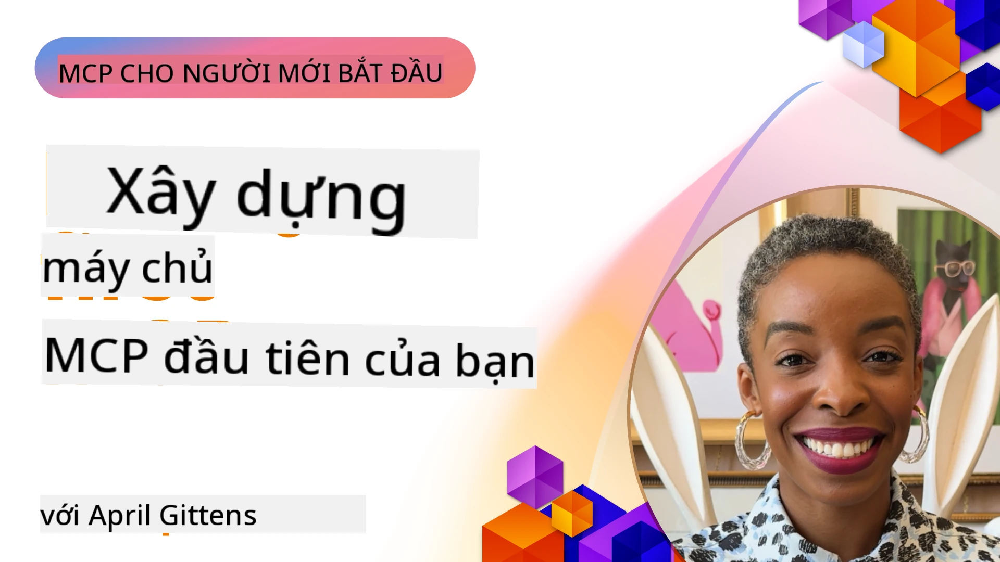

## Bắt Đầu  

_(Nhấp vào hình ảnh trên để xem video bài học này)_

Phần này bao gồm một số bài học:

- **1 Máy chủ đầu tiên của bạn**, trong bài học đầu tiên này, bạn sẽ học cách tạo máy chủ đầu tiên và kiểm tra nó với công cụ inspector, một cách quý giá để kiểm thử và gỡ lỗi máy chủ của bạn, [đến bài học](01-first-server/README.md)

- **2 Client**, trong bài học này, bạn sẽ học cách viết một client có thể kết nối với máy chủ của bạn, [đến bài học](02-client/README.md)

- **3 Client với LLM**, một cách viết client còn tốt hơn nữa là thêm một LLM để nó có thể "đàm phán" với máy chủ của bạn về những việc cần làm, [đến bài học](03-llm-client/README.md)

- **4 Sử dụng chế độ Agent GitHub Copilot của máy chủ trong Visual Studio Code**. Ở đây, chúng ta xem cách chạy Máy chủ MCP của mình từ trong Visual Studio Code, [đến bài học](04-vscode/README.md)

- **5 Máy chủ Giao thức Truyền tải stdio** stdio là chuẩn đề xuất cho giao tiếp máy chủ MCP cục bộ với client, cung cấp giao tiếp bảo mật dựa trên quy trình phụ với cô lập quy trình tích hợp sẵn [đến bài học](05-stdio-server/README.md)

- **6 Streaming HTTP với MCP (Streamable HTTP)**. Tìm hiểu về giao thức truyền tải HTTP streaming hiện đại (phương pháp đề xuất cho máy chủ MCP từ xa theo [MCP Specification 2025-11-25](https://spec.modelcontextprotocol.io/specification/2025-11-25/basic/transports/#streamable-http)), thông báo tiến trình, và cách triển khai máy chủ và client MCP quy mô lớn thời gian thực sử dụng Streamable HTTP. [đến bài học](06-http-streaming/README.md)

- **7 Sử dụng Bộ công cụ AI cho VSCode** để tiêu thụ và kiểm thử các MCP Client và Server của bạn [đến bài học](07-aitk/README.md)

- **8 Kiểm thử**. Ở đây chúng ta sẽ tập trung đặc biệt vào những cách khác nhau bạn có thể kiểm thử máy chủ và client, [đến bài học](08-testing/README.md)

- **9 Triển khai**. Chương này sẽ xem các cách triển khai các giải pháp MCP của bạn, [đến bài học](09-deployment/README.md)

- **10 Sử dụng máy chủ nâng cao**. Chương này đề cập đến sử dụng máy chủ nâng cao, [đến bài học](./10-advanced/README.md)

- **11 Xác thực**. Chương này đề cập cách thêm xác thực đơn giản, từ Basic Auth đến sử dụng JWT và RBAC. Bạn được khuyến khích bắt đầu ở đây rồi xem các Chủ đề Nâng cao ở Chương 5 và thực hiện tăng cường bảo mật bổ sung thông qua các khuyến nghị trong Chương 2, [đến bài học](./11-simple-auth/README.md)

- **12 Máy chủ MCP**. Cấu hình và sử dụng các client máy chủ MCP phổ biến bao gồm Claude Desktop, Cursor, Cline và Windsurf. Tìm hiểu các loại giao thức truyền tải và xử lý sự cố, [đến bài học](./12-mcp-hosts/README.md)

- **13 MCP Inspector**. Gỡ lỗi và kiểm thử các máy chủ MCP của bạn tương tác bằng công cụ MCP Inspector. Học cách xử lý sự cố các công cụ, tài nguyên và tin nhắn giao thức, [đến bài học](./13-mcp-inspector/README.md)

- **14 Lấy mẫu**. Tạo các máy chủ MCP hợp tác với client MCP trong các tác vụ liên quan đến LLM. [đến bài học](./14-sampling/README.md)

- **15 Ứng dụng MCP**. Xây dựng máy chủ MCP đồng thời trả lời với hướng dẫn giao diện người dùng, [đến bài học](./15-mcp-apps/README.md)

Model Context Protocol (MCP) là một giao thức mở chuẩn hóa cách ứng dụng cung cấp ngữ cảnh cho các LLM. Hãy tưởng tượng MCP như cổng USB-C dành cho ứng dụng AI - nó cung cấp cách chuẩn hóa để kết nối các mô hình AI với các nguồn dữ liệu và công cụ khác nhau.

## Mục Tiêu Học Tập

Sau bài học này, bạn sẽ có thể:

- Thiết lập các môi trường phát triển cho MCP bằng C#, Java, Python, TypeScript và JavaScript
- Xây dựng và triển khai máy chủ MCP cơ bản với các tính năng tùy chỉnh (tài nguyên, prompt, và công cụ)
- Tạo ứng dụng máy chủ kết nối với các máy chủ MCP
- Kiểm thử và gỡ lỗi các triển khai MCP
- Hiểu các thách thức thường gặp khi thiết lập và cách giải quyết
- Kết nối các triển khai MCP của bạn với các dịch vụ LLM phổ biến

## Thiết Lập Môi Trường MCP của Bạn

Trước khi bắt đầu làm việc với MCP, điều quan trọng là chuẩn bị môi trường phát triển và hiểu quy trình làm việc cơ bản. Phần này sẽ hướng dẫn bạn qua các bước thiết lập ban đầu để đảm bảo khởi đầu thuận lợi với MCP.

### Yêu Cầu Trước

Trước khi bắt đầu phát triển MCP, hãy đảm bảo bạn có:

- **Môi trường phát triển**: Dành cho ngôn ngữ bạn chọn (C#, Java, Python, TypeScript hoặc JavaScript)
- **IDE/Trình chỉnh sửa**: Visual Studio, Visual Studio Code, IntelliJ, Eclipse, PyCharm hoặc bất kỳ trình soạn thảo mã nào hiện đại
- **Trình quản lý gói**: NuGet, Maven/Gradle, pip hoặc npm/yarn
- **Khóa API**: Dành cho bất kỳ dịch vụ AI nào bạn định sử dụng trong các ứng dụng máy chủ của bạn

### SDK Chính Thức

Trong các chương tới bạn sẽ thấy các giải pháp được xây dựng bằng Python, TypeScript, Java và .NET. Dưới đây là tất cả SDK được hỗ trợ chính thức.

MCP cung cấp các SDK chính thức cho nhiều ngôn ngữ (điều chỉnh theo [MCP Specification 2025-11-25](https://spec.modelcontextprotocol.io/specification/2025-11-25/)):
- [SDK C#](https://github.com/modelcontextprotocol/csharp-sdk) - Được duy trì phối hợp với Microsoft
- [SDK Java](https://github.com/modelcontextprotocol/java-sdk) - Được duy trì phối hợp với Spring AI
- [SDK TypeScript](https://github.com/modelcontextprotocol/typescript-sdk) - Triển khai TypeScript chính thức
- [SDK Python](https://github.com/modelcontextprotocol/python-sdk) - Triển khai Python chính thức (FastMCP)
- [SDK Kotlin](https://github.com/modelcontextprotocol/kotlin-sdk) - Triển khai Kotlin chính thức
- [SDK Swift](https://github.com/modelcontextprotocol/swift-sdk) - Được duy trì phối hợp với Loopwork AI
- [SDK Rust](https://github.com/modelcontextprotocol/rust-sdk) - Triển khai Rust chính thức
- [SDK Go](https://github.com/modelcontextprotocol/go-sdk) - Triển khai Go chính thức

## Những Điểm Cần Nhớ

- Việc thiết lập môi trường phát triển MCP đơn giản với các SDK cho từng ngôn ngữ
- Xây dựng máy chủ MCP gồm tạo và đăng ký các công cụ với sơ đồ rõ ràng
- Các client MCP kết nối tới máy chủ và mô hình để tận dụng các khả năng mở rộng
- Kiểm thử và gỡ lỗi là thiết yếu để đảm bảo các triển khai MCP đáng tin cậy
- Các lựa chọn triển khai đa dạng từ phát triển cục bộ đến các giải pháp trên đám mây

## Thực Hành

Chúng tôi có một tập các mẫu bổ trợ cho các bài tập bạn sẽ gặp trong tất cả các chương của phần này. Bên cạnh đó, mỗi chương cũng có bài tập và nhiệm vụ riêng.

- [Máy tính Java](./samples/java/calculator/README.md)
- [Máy tính .Net](../../../03-GettingStarted/samples/csharp)
- [Máy tính JavaScript](./samples/javascript/README.md)
- [Máy tính TypeScript](./samples/typescript/README.md)
- [Máy tính Python](../../../03-GettingStarted/samples/python)

## Tài Nguyên Bổ Sung

- [Xây dựng Agents sử dụng Model Context Protocol trên Azure](https://learn.microsoft.com/azure/developer/ai/intro-agents-mcp)
- [MCP từ xa với Azure Container Apps (Node.js/TypeScript/JavaScript)](https://learn.microsoft.com/samples/azure-samples/mcp-container-ts/mcp-container-ts/)
- [Agent MCP OpenAI .NET](https://learn.microsoft.com/samples/azure-samples/openai-mcp-agent-dotnet/openai-mcp-agent-dotnet/)

## Tiếp theo

Bắt đầu với bài học đầu tiên: [Tạo Máy chủ MCP đầu tiên của bạn](01-first-server/README.md)

Khi bạn đã hoàn thành mô-đun này, tiếp tục đến: [Mô-đun 4: Triển khai Thực tế](../04-PracticalImplementation/README.md)

---

<!-- CO-OP TRANSLATOR DISCLAIMER START -->
**Tuyên bố từ chối trách nhiệm**:
Tài liệu này đã được dịch bằng dịch vụ dịch thuật AI [Co-op Translator](https://github.com/Azure/co-op-translator). Mặc dù chúng tôi nỗ lực đảm bảo độ chính xác, xin lưu ý rằng bản dịch tự động có thể chứa lỗi hoặc không chính xác. Tài liệu gốc bằng ngôn ngữ gốc nên được coi là nguồn tham khảo chính thức. Đối với thông tin quan trọng, nên sử dụng dịch vụ dịch thuật chuyên nghiệp do con người thực hiện. Chúng tôi không chịu trách nhiệm đối với bất kỳ sự hiểu nhầm hoặc diễn giải sai nào phát sinh từ việc sử dụng bản dịch này.
<!-- CO-OP TRANSLATOR DISCLAIMER END -->