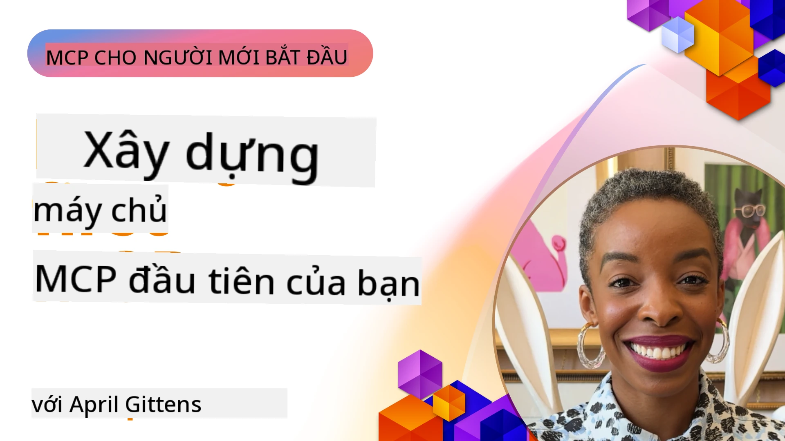

## Bắt Đầu  

_(Nhấp vào hình ảnh trên để xem video bài học này)_

Phần này bao gồm nhiều bài học:

- **1 Máy chủ đầu tiên của bạn**, trong bài học đầu tiên này, bạn sẽ học cách tạo máy chủ đầu tiên và kiểm tra nó bằng công cụ inspector, một cách quý giá để kiểm thử và gỡ lỗi máy chủ của bạn, [đến bài học](01-first-server/README.md)

- **2 Khách hàng**, trong bài học này, bạn sẽ học cách viết một client có thể kết nối tới máy chủ của bạn, [đến bài học](02-client/README.md)

- **3 Khách hàng với LLM**, một cách tốt hơn để viết client là thêm một LLM vào nó để client có thể "đàm phán" với máy chủ của bạn về những việc cần làm, [đến bài học](03-llm-client/README.md)

- **4 Tiêu thụ chế độ GitHub Copilot Agent của máy chủ trong Visual Studio Code**. Ở đây, chúng ta xem cách chạy MCP Server của mình trong Visual Studio Code, [đến bài học](04-vscode/README.md)

- **5 Máy chủ truyền tải stdio** stdio là tiêu chuẩn được khuyến nghị cho giao tiếp máy chủ-client MCP nội bộ, cung cấp truyền thông subprocess an toàn với cách ly tiến trình tích hợp sẵn [đến bài học](05-stdio-server/README.md)

- **6 Streaming HTTP với MCP (Streamable HTTP)**. Tìm hiểu về tiêu chuẩn
	truyền tải từ xa trong [Đặc tả MCP 2026-07-28](https://modelcontextprotocol.io/specification/2026-07-28/basic/transports/streamable-http),
	cùng với cách triển khai phiên dựa trên phiên bản cũ được giữ lại trong bài học.
	[đến bài học](06-http-streaming/README.md)

- **7 Sử dụng Bộ công cụ AI cho VSCode** để tiêu thụ và thử nghiệm các MCP Client và Server của bạn [đến bài học](07-aitk/README.md)

- **8 Kiểm thử**. Ở đây chúng ta sẽ tập trung đặc biệt vào các cách kiểm thử máy chủ và client của bạn, [đến bài học](08-testing/README.md)

- **9 Triển khai**. Chương này xem xét các cách khác nhau để triển khai giải pháp MCP của bạn, [đến bài học](09-deployment/README.md)

- **10 Sử dụng máy chủ nâng cao**. Chương này bao gồm việc sử dụng máy chủ nâng cao, [đến bài học](./10-advanced/README.md)

- **11 Xác thực**. Chương này bao gồm cách thêm xác thực đơn giản, từ Basic Auth đến sử dụng JWT và RBAC. Bạn được khuyến nghị bắt đầu từ đây rồi xem Chủ đề Nâng cao trong Chương 5 và thực hiện bổ sung các biện pháp tăng cường bảo mật theo khuyến nghị trong Chương 2, [đến bài học](./11-simple-auth/README.md)

- **12 Máy chủ MCP**. Cấu hình và sử dụng các client máy chủ MCP phổ biến như Claude Desktop, Cursor, Cline và Windsurf. Tìm hiểu các loại truyền tải và khắc phục sự cố, [đến bài học](./12-mcp-hosts/README.md)

- **13 MCP Inspector**. Gỡ lỗi và kiểm thử các máy chủ MCP của bạn một cách tương tác bằng công cụ MCP Inspector. Tìm hiểu công cụ, tài nguyên và các thông điệp giao thức để xử lý sự cố, [đến bài học](./13-mcp-inspector/README.md)

- **14 Sampling**. Tìm hiểu nguyên thủy Sampling cũ cho `2025-11-25` và
	cách chuyển đổi các thiết kế mới sang tích hợp trực tiếp nhà cung cấp LLM. Sampling
	đã bị loại bỏ trong MCP `2026-07-28`. [đến bài học](./14-sampling/README.md)

- **15 Ứng dụng MCP**. Xây dựng các MCP Server đồng thời phản hồi với hướng dẫn giao diện người dùng, [đến bài học](./15-mcp-apps/README.md)

Model Context Protocol (MCP) là giao thức mở chuẩn hóa cách các ứng dụng cung cấp ngữ cảnh cho LLM. Hãy nghĩ MCP như cổng USB-C dành cho các ứng dụng AI - nó cung cấp cách chuẩn để kết nối các mô hình AI với các nguồn dữ liệu và công cụ khác nhau.

## Mục tiêu học tập

Đến cuối bài học này, bạn sẽ có thể:

- Thiết lập môi trường phát triển cho MCP với C#, Java, Python, TypeScript và JavaScript
- Xây dựng và triển khai các máy chủ MCP cơ bản với tính năng tùy chỉnh (tài nguyên, lời nhắc, và công cụ)
- Tạo các ứng dụng host kết nối với các máy chủ MCP
- Kiểm thử và gỡ lỗi các triển khai MCP
- Hiểu các thách thức cài đặt thông thường và cách giải quyết
- Kết nối các triển khai MCP của bạn với các dịch vụ LLM phổ biến

## Thiết lập môi trường MCP của bạn

Trước khi bắt đầu làm việc với MCP, việc chuẩn bị môi trường phát triển và hiểu quy trình cơ bản là rất quan trọng. Phần này sẽ hướng dẫn bạn qua các bước thiết lập ban đầu để khởi đầu thuận lợi với MCP.

### Yêu cầu tiên quyết

Trước khi bắt đầu phát triển MCP, hãy đảm bảo bạn có:

- **Môi trường phát triển**: Cho ngôn ngữ bạn chọn (C#, Java, Python, TypeScript hoặc JavaScript)
- **IDE/Trình soạn thảo**: Visual Studio, Visual Studio Code, IntelliJ, Eclipse, PyCharm hoặc bất kỳ trình soạn thảo mã hiện đại nào
- **Trình quản lý gói**: NuGet, Maven/Gradle, pip hoặc npm/yarn
- **Khóa API**: Cho bất kỳ dịch vụ AI nào bạn dự định sử dụng trong ứng dụng host của mình

### SDK chính thức

Trong các chương tới bạn sẽ thấy các giải pháp xây dựng sử dụng Python, TypeScript,
Java và .NET. Dưới đây là các SDK chính thức.

Hỗ trợ SDK cho MCP `2026-07-28` đang được triển khai độc lập theo ngôn ngữ.
Trước khi chạy ví dụ, kiểm tra phiên bản gói và ghi chú phát hành SDK
để xem các phiên bản giao thức được hỗ trợ. Xem danh sách
[SDK chính thức](https://modelcontextprotocol.io/docs/sdk):
- [C# SDK](https://github.com/modelcontextprotocol/csharp-sdk) - Bảo trì hợp tác với Microsoft
- [Java SDK](https://github.com/modelcontextprotocol/java-sdk) - Bảo trì hợp tác với Spring AI
- [TypeScript SDK](https://github.com/modelcontextprotocol/typescript-sdk) - Triển khai TypeScript chính thức
- [Python SDK](https://github.com/modelcontextprotocol/python-sdk) - Triển khai Python chính thức (FastMCP)
- [Kotlin SDK](https://github.com/modelcontextprotocol/kotlin-sdk) - Triển khai Kotlin chính thức
- [Swift SDK](https://github.com/modelcontextprotocol/swift-sdk) - Bảo trì hợp tác với Loopwork AI
- [Rust SDK](https://github.com/modelcontextprotocol/rust-sdk) - Triển khai Rust chính thức
- [Go SDK](https://github.com/modelcontextprotocol/go-sdk) - Triển khai Go chính thức

## Những điểm mấu chốt

- Việc thiết lập môi trường phát triển MCP đơn giản với các SDK theo từng ngôn ngữ
- Xây dựng máy chủ MCP gồm tạo và đăng ký công cụ với lược đồ rõ ràng
- MCP client kết nối với máy chủ và mô hình để tận dụng khả năng mở rộng
- Kiểm thử và gỡ lỗi là rất cần thiết cho các triển khai MCP đáng tin cậy
- Các lựa chọn triển khai từ phát triển nội bộ đến các giải pháp trên đám mây

## Luyện tập

Chúng tôi có bộ mẫu bổ sung bài tập bạn sẽ thấy trong tất cả các chương của phần này. Thêm vào đó, mỗi chương cũng có bài tập và nhiệm vụ riêng.

- [Máy tính Java](./samples/java/calculator/README.md)
- [Máy tính .NET](../../../03-GettingStarted/samples/csharp)
- [Máy tính JavaScript](./samples/javascript/README.md)
- [Máy tính TypeScript](./samples/typescript/README.md)
- [Máy tính Python](../../../03-GettingStarted/samples/python)

## Tài nguyên bổ sung

- [Xây dựng Đại lý với Model Context Protocol trên Azure](https://learn.microsoft.com/azure/developer/ai/intro-agents-mcp)
- [MCP từ xa với Azure Container Apps (Node.js/TypeScript/JavaScript)](https://learn.microsoft.com/samples/azure-samples/mcp-container-ts/mcp-container-ts/)
- [Đại lý MCP OpenAI .NET](https://learn.microsoft.com/samples/azure-samples/openai-mcp-agent-dotnet/openai-mcp-agent-dotnet/)

## Tiếp theo là gì

Bắt đầu với bài học đầu tiên: [Tạo máy chủ MCP đầu tiên của bạn](01-first-server/README.md)

Khi hoàn tất mô-đun này, tiếp tục đến: [Mô-đun 4: Triển khai thực tiễn](../04-PracticalImplementation/README.md)

---

<!-- CO-OP TRANSLATOR DISCLAIMER START -->
**Tuyên bố miễn trừ trách nhiệm**:
Tài liệu này đã được dịch bằng dịch vụ dịch thuật AI [Co-op Translator](https://github.com/Azure/co-op-translator). Mặc dù chúng tôi cố gắng đảm bảo độ chính xác, xin lưu ý rằng bản dịch tự động có thể chứa lỗi hoặc sai sót. Tài liệu gốc bằng ngôn ngữ gốc nên được coi là nguồn tin chính thức. Đối với thông tin quan trọng, nên sử dụng dịch vụ dịch thuật chuyên nghiệp bởi con người. Chúng tôi không chịu trách nhiệm về bất kỳ hiểu lầm hoặc giải thích sai nào phát sinh từ việc sử dụng bản dịch này.
<!-- CO-OP TRANSLATOR DISCLAIMER END -->